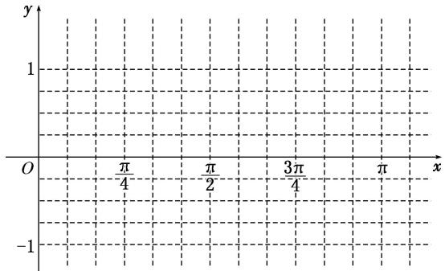
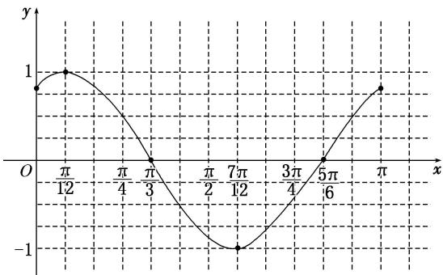

# 专题七 三角恒等变换应用篇(解答题)
答题模板

# 三角函数图象与性质的综合问题

典例 (12 分) 已知函数 $f(x) = 2\sqrt{3}\sin \left(\frac{x}{2} + \frac{\pi}{4}\right) \cdot \cos \left(\frac{x}{2} + \frac{\pi}{4}\right) - \sin (x + \pi)$ .  
（1）求 $f(x)$ 的最小正周期;  
（2）若将 $f(x)$ 的图象向右平移 $\frac{\pi}{6}$ 个单位长度，得到函数 $g(x)$ 的图象，求函数 $g(x)$ 在区间 $[0, \pi]$ 上的最大值和最小值.

思维点拨 （1）先将 $f(x)$ 化成 $y=A\sin(\omega x+\varphi)$ 的形式再求周期；  
（2）将 $f(x)$ 解析式中的x换成 $x-\frac{\pi}{6}$ ，得 $g(x)$ ，然后利用整体思想求最值.

# 规范解答
解 （1） $f(x)=2\sqrt{3}\sin\left(\frac{x}{2}+\frac{\pi}{4}\right)\cos\left(\frac{x}{2}+\frac{\pi}{4}\right)-\sin(x+\pi)=\sqrt{3}\cos x+\sin x[3\text{分}]$
$= 2 \sin \left(x + \frac {\pi}{3}\right), [ 5 \text {分} ]$
于是 $T=\frac{2\pi}{1}=2\pi.$ [6 分]  
（2）由已知得 $g(x) = f\left(x - \frac{\pi}{6}\right) = 2\sin \left(x + \frac{\pi}{6}\right)$ ，[8分]
$\because x \in [ 0, \pi ], \therefore x + \frac {\pi}{6} \in \left[ \frac {\pi}{6}, \frac {7 \pi}{6} \right], \therefore \sin \left(x + \frac {\pi}{6}\right) \in \left[ - \frac {1}{2}, 1 \right], [ 1 0 \text {分} ]$
$\therefore g (x) = 2 \sin \left(x + \frac {\pi}{6}\right) \in [ - 1, 2 ]. [ 1 1 \text {分} ]$
故函数 $g(x)$ 在区间 $[0, \pi]$ 上的最大值为 2，最小值为 -1. [12 分]

# 答题模板
解决三角函数图象与性质的综合问题的一般步骤

第一步：(化简)将 $f(x)$ 化为 $a\sin x + b\cos x$ 的形式；
第二步：(用辅助角公式)构造 $f(x)=\sqrt{a^{2}+b^{2}}\cdot\left(\sin x\cdot\frac{a}{\sqrt{a^{2}+b^{2}}}+\cos x\cdot\frac{b}{\sqrt{a^{2}+b^{2}}}\right)$ ;
第三步：(求性质)利用 $f(x)=\sqrt{a^{2}+b^{2}}\sin(x+\varphi)$ 研究三角函数的性质；
第四步：(反思)反思回顾，查看关键点、易错点和答题规范.

思想方法

# 化归思想和整体代换思想在三角函数中的应用

典例 (12 分)(2016·天津)已知函数 $f(x)=4\tan x\cdot\sin\left(\frac{\pi}{2}-x\right)\cdot\cos\left(x-\frac{\pi}{3}\right)-\sqrt{3}$ .  
（1）求 $f(x)$ 的定义域与最小正周期;  
（2）讨论 $f(x)$ 在区间 $\left[-\frac{\pi}{4},\frac{\pi}{4}\right]$ 上的单调性.

思想方法指导 （1） 讨论形如 $y = a \sin \omega x + b \cos \omega x$ 型函数的性质，一律化成 $y = \sqrt{a^2 + b^2} \sin (\omega x + \varphi)$ 型的函数.  
（2）研究 $y = A\sin (\omega x + \varphi)$ 型函数的最值、单调性，可将 $\omega x + \varphi$ 视为一个整体，换元后结合 $y = \sin x$ 的图象解决.

# 规范解答
解 （1） $f(x)$ 的定义域为 $\left\{x\mid x\neq\frac{\pi}{2}+k\pi,\quad k\in\mathbf{Z}\right\}$ .
$\begin{array}{l} f (x) = 4 \tan x \cos x \cos \left(x - \frac {\pi}{3}\right) - \sqrt {3} = 4 \sin x \cos \left(x - \frac {\pi}{3}\right) - \sqrt {3} = 4 \sin x \left(\frac {1}{2} \cos x + \frac {\sqrt {3}}{2} \sin x\right) - \sqrt {3} \\ = 2 \sin x \cos x + 2 \sqrt {3} \sin^ {2} x - \sqrt {3} = \sin 2 x + \sqrt {3} (1 - \cos 2 x) - \sqrt {3} = \sin 2 x - \sqrt {3} \cos 2 x = 2 \sin \left(2 x - \frac {\pi}{3}\right). [ 5 \text {分} ] \\ \end{array}$
所以 $f(x)$ 的最小正周期 $T=\frac{2\pi}{2}=\pi$ . [6 分]  
（2）因为 $x\in \left[-\frac{\pi}{4},\frac{\pi}{4}\right]$ ，所以 $2x - \frac{\pi}{3}\in \left[-\frac{5\pi}{6},\frac{\pi}{6}\right],$ [8分]
由 $y=\sin x$ 的图象可知，当 $2x-\frac{\pi}{3}\in\left[-\frac{5\pi}{6}, -\frac{\pi}{2}\right]$ ，即 $x\in\left[-\frac{\pi}{4}, -\frac{\pi}{12}\right]$ 时， $f(x)$ 单调递减；
当 $2x - \frac{\pi}{3} \in \left[-\frac{\pi}{2}, \frac{\pi}{6}\right]$ ，即 $x \in \left[-\frac{\pi}{12}, \frac{\pi}{4}\right]$ 时， $f(x)$ 单调递增。[10分]
所以当 $x \in \left[-\frac{\pi}{4}, \frac{\pi}{4}\right]$ 时， $f(x)$ 在区间 $\left[-\frac{\pi}{12}, \frac{\pi}{4}\right]$ 上单调递增，在区间 $\left[-\frac{\pi}{4}, -\frac{\pi}{12}\right]$ 上单调递减。[12分]

# 【例题选讲】

[例 1] (2018·浙江) 已知角 $\alpha$ 的顶点与原点 O 重合，始边与 x 轴的非负半轴重合，它的终边过点 $P\left(-\frac{3}{5}, -\frac{4}{5}\right)$ .  
（1）求 $\sin(\alpha+\pi)$ 的值;  
（2）若角 $\beta$ 满足 $\sin (\alpha +\beta) = \frac{5}{13}$ ，求 $\cos \beta$ 的值.
解 （1）由角 $\alpha$ 的终边过点 $P\left[-\frac{3}{5}, -\frac{4}{5}\right]$ 得 $\sin \alpha = -\frac{4}{5}$ ，所以 $\sin (\alpha + \pi) = -\sin \alpha = \frac{4}{5}$ .  
（2）由角 $\alpha$ 的终边过点 $P\left(-\frac{3}{5}, -\frac{4}{5}\right)$ 得 $\cos \alpha = -\frac{3}{5}$ , 由 $\sin (\alpha + \beta) = \frac{5}{13}$ 得 $\cos (\alpha + \beta) = \pm \frac{12}{13}$ .
由 $\beta = (\alpha +\beta) - \alpha$ 得 $\cos \beta = \cos (\alpha +\beta)\cos \alpha +\sin (\alpha +\beta)\sin \alpha$ ，所以 $\cos \beta = -\frac{56}{65}$ 或 $\cos \beta = \frac{16}{65}.$

[例 2] 已知函数 $f(x)=(2\cos^{2}x-1)\sin 2x+\frac{1}{2}\cos 4x$ .  
（1）求函数 $f(x)$ 的最小正周期及单调递减区间;  
（2）若 $\alpha \in (0, \pi)$ ，且 $f\left(\frac{\alpha}{4} - \frac{\pi}{8}\right) = \frac{\sqrt{2}}{2}$ ，求 $\tan \left(\alpha + \frac{\pi}{3}\right)$ 的值.
解 （1） $\because f(x) = (2\cos^2 x - 1)\sin 2x + \frac{1}{2}\cos 4x = \cos 2x\sin 2x + \frac{1}{2}\cos 4x = \frac{1}{2} (\sin 4x + \cos 4x) = \frac{\sqrt{2}}{2}\sin \left(4x + \frac{\pi}{4}\right),$
∴函数 $f(x)$ 的最小正周期 $T=\frac{\pi}{2}$ . 令 $2k\pi+\frac{\pi}{2}\leq4x+\frac{\pi}{4}\leq2k\pi+\frac{3\pi}{2}$ ， $k\in Z$ ，得 $\frac{k\pi}{2}+\frac{\pi}{16}\leq x\leq\frac{k\pi}{2}+\frac{5\pi}{16}$ ， $k\in Z$ .
∴函数 $f(x)$ 的单调递减区间为 $\left[\frac{k\pi}{2}+\frac{\pi}{16},\frac{k\pi}{2}+\frac{5\pi}{16}\right]$ ， $k\in Z$ .  
（2） $\because f\left(\frac{\alpha}{4}-\frac{\pi}{8}\right)=\frac{\sqrt{2}}{2},\quad\therefore\sin\left(\alpha-\frac{\pi}{4}\right)=1.$ 又 $\alpha\in(0,\pi),\quad\therefore-\frac{\pi}{4}<\alpha-\frac{\pi}{4}<\frac{3\pi}{4},\quad\therefore\alpha-\frac{\pi}{4}=\frac{\pi}{2},\quad\text{故}\alpha=\frac{3\pi}{4}.$
因此 $\tan \left(\alpha +\frac{\pi}{3}\right) = \frac{\tan\frac{3\pi}{4} + \tan\frac{\pi}{3}}{1 - \tan\frac{3\pi}{4}\tan\frac{\pi}{3}} = \frac{-1 + \sqrt{3}}{1 + \sqrt{3}} = 2 - \sqrt{3}.$

[例 3] (2018·山东) 设 $f(x)=2\sqrt{3}\sin(\pi-x)\sin x-(\sin x-\cos x)^{2}$ .  
（1）求 $f(x)$ 的单调递增区间；  
（2）把 $y=f(x)$ 的图象上所有点的横坐标伸长到原来的 2 倍(纵坐标不变)，再把得到的图象向左平移 $\frac{\pi}{3}$ 个单位，得到函数 $y=g(x)$ 的图象，求 $g\left(\frac{\pi}{6}\right)$ 的值.
解 （1） $f(x)=2\sqrt{3}\sin^{2}x-(1-2\sin x\cos x)=\sqrt{3}(1-\cos 2x)+\sin 2x-1=\sin 2x-\sqrt{3}\cos 2x+\sqrt{3}-1$
$= 2 \sin \left(2 x - \frac {\pi}{3}\right) + \sqrt {3} - 1.$
由 $2k\pi - \frac{\pi}{2} \leq 2x - \frac{\pi}{3} \leq 2k\pi + \frac{\pi}{2}(k \in \mathbf{Z})$ ，得 $k\pi - \frac{\pi}{12} \leq x \leq k\pi + \frac{5\pi}{12}(k \in \mathbf{Z})$
所以 $f(x)$ 的单调递增区间是 $\left[k\pi-\frac{\pi}{12}, k\pi+\frac{5\pi}{12}\right](k\in\mathbf{Z})$ .  
（2）由（1）知 $f(x) = 2\sin \left(2x - \frac{\pi}{3}\right) + \sqrt{3} - 1$ ，把 $y = f(x)$ 的图象上所有点的横坐标伸长到原来的2倍(纵坐标不变)，得到 $y = 2\sin \left(x - \frac{\pi}{3}\right) + \sqrt{3} - 1$ 的图象，再把所得到的图象向左平移 $\frac{\pi}{3}$ 个单位，得到 $y = 2\sin x + \sqrt{3} - 1$ 的图象，即 $g(x) = 2\sin x + \sqrt{3} - 1$ . 所以 $g\left(\frac{\pi}{6}\right) = 2\sin \frac{\pi}{6} + \sqrt{3} - 1 = \sqrt{3}$ .

[例 4] 已知函数 $f(x)=4\sin x\cos\left(x-\frac{\pi}{3}\right)-\sqrt{3}$ .  
（1）求函数 $f(x)$ 的单调区间；  
（2）求函数 $f(x)$ 图象的对称轴和对称中心.
解 （1） $f(x)=4\sin x\cos\left(x-\frac{\pi}{3}\right)-\sqrt{3}=4\sin x\left(\frac{1}{2}\cos x+\frac{\sqrt{3}}{2}\sin x\right)-\sqrt{3}=2\sin x\cos x+2\sqrt{3}\sin^{2}x-\sqrt{3}$
$= \sin 2 x + \sqrt {3} (1 - \cos 2 x) - \sqrt {3} = \sin 2 x - \sqrt {3} \cos 2 x = 2 \sin \left(2 x - \frac {\pi}{3}\right).$
令 $2k\pi - \frac{\pi}{2} \leq 2x - \frac{\pi}{3} \leq 2k\pi + \frac{\pi}{2}(k \in \mathbb{Z})$ ，得 $k\pi - \frac{\pi}{12} \leq x \leq k\pi + \frac{5\pi}{12}(k \in \mathbb{Z})$
所以函数 $f(x)$ 的单调递增区间为 $\left[k\pi-\frac{\pi}{12}, k\pi+\frac{5\pi}{12}\right](k\in\mathbf{Z})$ .
令 $2k\pi + \frac{\pi}{2} \leq 2x - \frac{\pi}{3} \leq 2k\pi + \frac{3\pi}{2} (k \in \mathbf{Z})$ ，得 $k\pi + \frac{5\pi}{12} \leq x \leq k\pi + \frac{11\pi}{12} (k \in \mathbf{Z})$
所以函数 $f(x)$ 的单调递减区间为 $\left[k\pi+\frac{5\pi}{12}, k\pi+\frac{11\pi}{12}\right](k\in\mathbf{Z})$ .  
（2）令 $2x - \frac{\pi}{3} = k\pi + \frac{\pi}{2} (k \in \mathbb{Z})$ ，得 $x = \frac{k\pi}{2} + \frac{5\pi}{12} (k \in \mathbb{Z})$ ，所以函数 $f(x)$ 的对称轴方程为 $x = \frac{k\pi}{2} + \frac{5\pi}{12} (k \in \mathbb{Z})$ .
令 $2x - \frac{\pi}{3} = k\pi (k\in \mathbf{Z})$ ，得 $x = \frac{k\pi}{2} +\frac{\pi}{6} (k\in \mathbf{Z})$ ，所以函数 $f(x)$ 的对称中心为 $\left[\frac{k\pi}{2} +\frac{\pi}{6},0\right](k\in \mathbf{Z}).$

[例 5] 已知函数 $f(x)=2\sin x\sin\left(x+\frac{\pi}{6}\right)$ .  
（1）求函数 $f(x)$ 的最小正周期和单调递增区间；  
（2）当 $x \in \left[0, \frac{\pi}{2}\right]$ 时，求函数 $f(x)$ 的值域.
解 （1） 因为 $f(x)=2\sin x\left(\frac{\sqrt{3}}{2}\sin x+\frac{1}{2}\cos x\right)=\sqrt{3}\times\frac{1-\cos 2x}{2}+\frac{1}{2}\sin 2x=\sin\left(2x-\frac{\pi}{3}\right)+\frac{\sqrt{3}}{2}$ ,
所以函数 $f(x)$ 的最小正周期为 $T=\pi$ .
由 $-\frac{\pi}{2}+2k\pi\leq2x-\frac{\pi}{3}\leq\frac{\pi}{2}+2k\pi,\quad k\in\mathbf{Z},$ 解得 $-\frac{\pi}{12}+k\pi\leq x\leq\frac{5\pi}{12}+k\pi,\quad k\in\mathbf{Z},$
所以函数 $f(x)$ 的单调递增区间是 $\left[-\frac{\pi}{12} + k\pi, \frac{5\pi}{12} + k\pi\right], k \in \mathbf{Z}$ .  
（2）当 $x\in \left[0,\frac{\pi}{2}\right]$ 时， $2x - \frac{\pi}{3}\in \left[-\frac{\pi}{3},\frac{2\pi}{3}\right],\sin \left(2x - \frac{\pi}{3}\right)\in \left[-\frac{\sqrt{3}}{2},1\right],f(x)\in \left[0,1 + \frac{\sqrt{3}}{2}\right].$
故 $f(x)$ 的值域为 $\left[0, 1 + \frac{\sqrt{3}}{2}\right]$ .

[例 6] (2019·浙江) 设函数 $f(x)=\sin x,\quad x\in\mathbf{R}$ .  
（1）已知 $\theta\in[0,\ 2\pi)$ ，函数 $f(x+\theta)$ 是偶函数，求 $\theta$ 的值；  
（2）求函数 $y=\left[f\left(x+\frac{\pi}{12}\right)\right]^{2}+\left[f\left(x+\frac{\pi}{4}\right)\right]^{2}$ 的值域.
解 （1） 因为 $f(x+\theta)=\sin(x+\theta)$ 是偶函数，所以对任意实数 x 都有 $\sin(x+\theta)=\sin(-x+\theta)$ ，即 $\sin x\cos\theta+\cos x\sin\theta=-\sin x\cos\theta+\cos x\sin\theta$ ，故 $2\sin x\cos\theta=0$ ，所以 $\cos\theta=0$ 。
又 $\theta \in [0, 2\pi)$ ，因此 $\theta = \frac{\pi}{2}$ 或 $\theta = \frac{3\pi}{2}$ .  
（2） $y=\left[f\left(x+\frac{\pi}{12}\right)\right]^{2}+\left[f\left(x+\frac{\pi}{4}\right)\right]^{2}=\sin^{2}\left(x+\frac{\pi}{12}\right)+\sin^{2}\left(x+\frac{\pi}{4}\right)=\frac{1-\cos\left(2x+\frac{\pi}{6}\right)}{2}+\frac{1-\cos\left(2x+\frac{\pi}{2}\right)}{2}$
$= 1 - \frac {1}{2} \left(\frac {\sqrt {3}}{2} \cos 2 x - \frac {3}{2} \sin 2 x\right) = 1 - \frac {\sqrt {3}}{2} \cos \left(2 x + \frac {\pi}{3}\right).$
因此，所求函数的值域是 $\left[1 - \frac{\sqrt{3}}{2}, 1 + \frac{\sqrt{3}}{2}\right]$ .

# 【对点训练】

1. 已知函数 $f(x) = \cos^2 x + \sin x\cos x, x \in \mathbf{R}$ .  
（1）求 $f\left(\frac{\pi}{6}\right)$ 的值；  
（2）若 $\sin\alpha=\frac{3}{5}$ ，且 $\alpha\in\left(\frac{\pi}{2},\quad\pi\right)$ ，求 $f\left(\frac{\alpha}{2}+\frac{\pi}{24}\right)$ .

1. 解 $（1）f\left(\frac{\pi}{6}\right)=\cos^{2}\frac{\pi}{6}+\sin\frac{\pi}{6}\cos\frac{\pi}{6}=\left(\frac{\sqrt{3}}{2}\right)^{2}+\frac{1}{2}\times\frac{\sqrt{3}}{2}=\frac{3+\sqrt{3}}{4}.$  
（2） 因为 $f(x)=\cos^{2}x+\sin x\cos x=\frac{1+\cos 2x}{2}+\frac{1}{2}\sin 2x=\frac{1}{2}+\frac{1}{2}(\sin 2x+\cos 2x)=\frac{1}{2}+\frac{\sqrt{2}}{2}\sin\left(2x+\frac{\pi}{4}\right)$ ,
所以 $f\left(\frac{\alpha}{2}+\frac{\pi}{24}\right)=\frac{1}{2}+\frac{\sqrt{2}}{2}\sin\left(\alpha+\frac{\pi}{12}+\frac{\pi}{4}\right)=\frac{1}{2}+\frac{\sqrt{2}}{2}\sin\left(\alpha+\frac{\pi}{3}\right)=\frac{1}{2}+\frac{\sqrt{2}}{2}\left(\frac{1}{2}\sin\alpha+\frac{\sqrt{3}}{2}\cos\alpha\right).$
又因为 $\sin\alpha=\frac{3}{5}$ ，且 $\alpha\in\left(\frac{\pi}{2},\quad\pi\right)$ ，所以 $\cos\alpha=-\frac{4}{5}$ ，所以 $f\left(\frac{\alpha}{2}+\frac{\pi}{24}\right)=\frac{1}{2}+\frac{\sqrt{2}}{2}\left(\frac{1}{2}\times\frac{3}{5}-\frac{\sqrt{3}}{2}\times\frac{4}{5}\right)=\frac{10+3\sqrt{2}-4\sqrt{6}}{20}$ .

2. 已知 $\cos \left(\frac{\pi}{6} + \alpha\right) \cdot \cos \left(\frac{\pi}{3} - \alpha\right) = -\frac{1}{4}, \alpha \in \left(\frac{\pi}{3}, \frac{\pi}{2}\right)$ .  
（1）求 $\sin 2\alpha$ 的值；  
（2）求 $\tan \alpha -\frac{1}{\tan\alpha}$ 的值.

2. 解 （1） $\because \cos \left(\frac{\pi}{6} + \alpha\right)_{\cos \left(\frac{\pi}{3} - \alpha\right)} = \cos \left(\frac{\pi}{6} + \alpha\right)_{\sin \left[\frac{\pi}{6} + \alpha\right]} = \frac{1}{2}\sin \left(2\alpha + \frac{\pi}{3}\right) = -\frac{1}{4}, \therefore \sin \left(2\alpha + \frac{\pi}{3}\right) = -\frac{1}{2}.$
$\because \alpha \in \left( \begin{array}{c c} \frac {\pi}{3}, & \frac {\pi}{2} \end{array} \right), \therefore 2 \alpha + \frac {\pi}{3} \in \left( \begin{array}{c c} \pi , & \frac {4 \pi}{3} \end{array} \right), \therefore \cos \left(2 \alpha + \frac {\pi}{3}\right) = - \frac {\sqrt {3}}{2},$
$\therefore \sin 2 \alpha = \sin \left[ \left(2 \alpha + \frac {\pi}{3}\right) - \frac {\pi}{3} \right] = \sin \left(2 \alpha + \frac {\pi}{3}\right) \cos \frac {\pi}{3} - \cos \left(2 \alpha + \frac {\pi}{3}\right) \sin \frac {\pi}{3} = \frac {1}{2}.$  
（2） $\because\alpha\in\left(\frac{\pi}{3},\quad\frac{\pi}{2}\right),\quad\therefore2\alpha\in\left(\frac{2\pi}{3},\quad\pi\right).$ 又由（1）知 $\sin2\alpha=\frac{1}{2},\quad\therefore\cos2\alpha=-\frac{\sqrt{3}}{2}.$
$\therefore \tan \alpha - \frac {1}{\tan \alpha} = \frac {\sin \alpha}{\cos \alpha} - \frac {\cos \alpha}{\sin \alpha} = \frac {\sin^ {2} \alpha - \cos^ {2} \alpha}{\sin \alpha \cos \alpha} = - \frac {2 \cos 2 \alpha}{\sin 2 \alpha} = - 2 \times \frac {- \frac {\sqrt {3}}{2}}{\frac {1}{2}} = 2 \sqrt {3}.$

3. (2017·浙江)已知函数 $f(x) = \sin^2 x - \cos^2 x - 2\sqrt{3}\sin x\cos x (x \in \mathbf{R})$ .  
（1）求 $f\left(\frac{2\pi}{3}\right)$ 的值；  
（2）求 $f(x)$ 的最小正周期及单调递增区间.

3. 解 （1） 由 $\sin \frac{2\pi}{3} = \frac{\sqrt{3}}{2}$ , $\cos \frac{2\pi}{3} = -\frac{1}{2}$ , 得 $f\left(\frac{2\pi}{3}\right) = \left(\frac{\sqrt{3}}{2}\right)^2 - \left(-\frac{1}{2}\right)^2 - 2\sqrt{3} \times \frac{\sqrt{3}}{2} \times \left(-\frac{1}{2}\right) = 2$ .  
（2）由 $\cos 2x = \cos^2 x - \sin^2 x$ 与 $\sin 2x = 2\sin x\cos x$ ，得 $f(x) = -\cos 2x - \sqrt{3}\sin 2x = -2\sin \left(2x + \frac{\pi}{6}\right)$ .
所以 $f(x)$ 的最小正周期是 $\pi$ 。由正弦函数的性质，得 $\frac{\pi}{2} + 2k\pi \leq 2x + \frac{\pi}{6} \leq \frac{3\pi}{2} + 2k\pi, k \in Z,$
解得 $\frac{\pi}{6}+k\pi\leq x\leq\frac{2\pi}{3}+k\pi,\quad k\in\mathbf{Z}$ . 所以 $f(x)$ 的单调递增区间为 $\left[\frac{\pi}{6}+k\pi,\quad\frac{2\pi}{3}+k\pi\right](k\in\mathbf{Z})$ .

4. 已知角 $\alpha$ 的顶点在坐标原点，始边与 $x$ 轴的正半轴重合，终边经过点 $P(-3, \sqrt{3})$ .  
（1）求 $\sin 2\alpha - \tan \alpha$ 的值；  
（2）若函数 $f(x) = \cos (x - a)\cos a - \sin (x - a)\sin a$ ，求函数 $g(x) = \sqrt{3} f\left(\frac{\pi}{2} - 2x\right) - 2f^2 (x)$ 在区间 $\left[0, \frac{2\pi}{3}\right]$ 上的值域.

4. 解 （1） ∵ 角 $\alpha$ 的终边经过点 $P(-3, \sqrt{3})$ ，∴ $\sin \alpha = \frac{1}{2}$ ， $\cos \alpha = -\frac{\sqrt{3}}{2}$ ， $\tan \alpha = -\frac{\sqrt{3}}{3}$ .
$\therefore \sin 2 \alpha - \tan \alpha = 2 \sin \alpha \cos \alpha - \tan \alpha = - \frac {\sqrt {3}}{2} + \frac {\sqrt {3}}{3} = - \frac {\sqrt {3}}{6}.$  
（2） $\because f(x)=\cos(x-\alpha)\cos\alpha-\sin(x-\alpha)\sin\alpha=\cos x,$
$\therefore g (x) = \sqrt {3} \cos \left(\frac {\pi}{2} - 2 x\right) - 2 \cos^ {2} x = \sqrt {3} \sin 2 x - 1 - \cos 2 x = 2 \sin \left(2 x - \frac {\pi}{6}\right) - 1. \quad \because 0 \leq x \leq \frac {2 \pi}{3}, \quad \therefore - \frac {\pi}{6} \leq 2 x - \frac {\pi}{6} \leq \frac {7 \pi}{6}.$
$\therefore - \frac {1}{2} \leq \sin \left(2 x - \frac {\pi}{6}\right) \leq 1, \quad \therefore - 2 \leq 2 \sin \left(2 x - \frac {\pi}{6}\right) - 1 \leq 1,$
故函数 $g(x)=\sqrt{3}f\left(\frac{\pi}{2}-2x\right)-2f^{2}(x)$ 在区间 $\left[0,\frac{2\pi}{3}\right]$ 上的值域是 $[-2,1]$ .

5. 已知函数 $f(x) = 2\cos^2\omega x - 1 + 2\sqrt{3}\sin \omega x\cos \omega x (0 < \omega < 1)$ ，直线 $x = \frac{\pi}{3}$ 是函数 $f(x)$ 的图象的一条对称轴.  
（1）求函数 $f(x)$ 的单调递增区间；  
（2）已知函数 $y=g(x)$ 的图象是由 $y=f(x)$ 的图象上各点的横坐标伸长到原来的 2 倍，然后再向左平移 $\frac{2\pi}{3}$ 个单位长度得到的，若 $g\left(2\alpha+\frac{\pi}{3}\right)=\frac{6}{5}, \quad \alpha\in\left(0, \frac{\pi}{2}\right)$ ，求 $\sin\alpha$ 的值.

5. 解 （1） $f(x)=\cos2\omega x+\sqrt{3}\sin2\omega x=2\sin\left(2\omega x+\frac{\pi}{6}\right)$ ,
由于直线 $x=\frac{\pi}{3}$ 是函数 $f(x)=2\sin\left(2\omega x+\frac{\pi}{6}\right)$ 的图象的一条对称轴，
所以 $\frac{2\pi}{3}\omega+\frac{\pi}{6}=k\pi+\frac{\pi}{2}(k\in\mathbf{Z})$ ，解得 $\omega=\frac{3}{2}k+\frac{1}{2}(k\in\mathbf{Z})$ ，又0< $\omega<1$ ，所以 $\omega=\frac{1}{2}$ ，所以 $f(x)=2\sin\left(x+\frac{\pi}{6}\right)$ .
由 $2k\pi - \frac{\pi}{2} \leq x + \frac{\pi}{6} \leq 2k\pi + \frac{\pi}{2} (k \in \mathbf{Z})$ ，得 $2k\pi - \frac{2\pi}{3} \leq x \leq 2k\pi + \frac{\pi}{3} (k \in \mathbf{Z})$
所以函数 $f(x)$ 的单调递增区间为 $\left[2k\pi-\frac{2\pi}{3},\quad2k\pi+\frac{\pi}{3}\right](k\in\mathbf{Z})$ .  
（2）由题意可得 $g(x) = 2\sin \left[\frac{1}{2}\left(x + \frac{2\pi}{3}\right) + \frac{\pi}{6}\right]$ ，即 $g(x) = 2\cos \frac{x}{2}$ ，
由 $g\left(2\alpha + \frac{\pi}{3}\right) = 2\cos \left[\frac{1}{2}\left(2\alpha + \frac{\pi}{3}\right)\right] = 2\cos \left(\alpha + \frac{\pi}{6}\right) = \frac{6}{5}$ , 得 $\cos \left(\alpha + \frac{\pi}{6}\right) = \frac{3}{5}$ ,
又 $\alpha \in \left(0, \frac{\pi}{2}\right)$ ，故 $\frac{\pi}{6} < \alpha + \frac{\pi}{6} < \frac{2\pi}{3}$ ，所以 $\sin \left(\alpha + \frac{\pi}{6}\right) = \frac{4}{5}$ ，
所以 $\sin \alpha = \sin \left[\left(\alpha +\frac{\pi}{6}\right) - \frac{\pi}{6}\right] = \sin \left(\alpha +\frac{\pi}{6}\right)\cdot \cos \frac{\pi}{6} -\cos \left(\alpha +\frac{\pi}{6}\right)\cdot \sin \frac{\pi}{6} = \frac{4}{5}\times \frac{\sqrt{3}}{2} -\frac{3}{5}\times \frac{1}{2} = \frac{4\sqrt{3} - 3}{10}.$

6. 已知函数 $f(x)=\frac{1}{2}\sin\omega x+\frac{\sqrt{3}}{2}\cos\omega x(\omega>0)$ 的最小正周期为 $\pi$ .  
（1）求 $\omega$ 的值，并在下面提供的坐标系中画出函数 $y=f(x)$ 在区间 $[0,\pi]$ 上的图象；  
（2）函数 $y=f(x)$ 的图象可由函数 $y=\sin x$ 的图象经过怎样的变换得到?

6. 解 （1）由题意知 $f(x)=\sin\left(\omega x+\frac{\pi}{3}\right)$ ，因为 $T=\pi$ ，所以 $\frac{2\pi}{\omega}=\pi$ ，即 $\omega=2$ ，故 $f(x)=\sin\left(2x+\frac{\pi}{3}\right)$ .
列表如下：

<table><tr><td> $2x+\frac{\pi}{3}$ </td><td> $\frac{\pi}{3}$ </td><td> $\frac{\pi}{2}$ </td><td> $\pi$ </td><td> $\frac{3\pi}{2}$ </td><td> $2\pi$ </td><td> $\frac{7\pi}{3}$ </td></tr><tr><td> $x$ </td><td>0</td><td> $\frac{\pi}{12}$ </td><td> $\frac{\pi}{3}$ </td><td> $\frac{7\pi}{12}$ </td><td> $\frac{5\pi}{6}$ </td><td> $\pi$ </td></tr><tr><td> $f(x)$ </td><td> $\frac{\sqrt{3}}{2}$ </td><td>1</td><td>0</td><td>-1</td><td>0</td><td> $\frac{\sqrt{3}}{2}$ </td></tr></table>
$y=f(x)$ 在 $[0,\pi]$ 上的图象如图所示.

  
（2）将 $y=\sin x$ 的图象上的所有点向左平移 $\frac{\pi}{3}$ 个单位长度，得到函数 $y=\sin\left(\frac{x+\frac{\pi}{3}}{3}\right)$ 的图象，再将 $y=\sin\left(\frac{x+\frac{\pi}{3}}{3}\right)$ 的图象上所有点的横坐标缩短到原来的 $\frac{1}{2}$ (纵坐标不变)，得到函数 $f(x)=\sin\left(\frac{2x+\frac{\pi}{3}}{3}\right)(x\in\mathbb{R})$ 的图象.

7. 已知函数 $f(x) = \sqrt{3}\sin (\omega x + \varphi) + 2\sin^2{\frac{\omega x + \varphi}{2}} - 1 (\omega > 0, 0 < \varphi < \pi)$ 为奇函数，且相邻两对称轴间的距离为 $\frac{\pi}{2}$ .  
（1）当 $x \in \left[-\frac{\pi}{2}, \frac{\pi}{4}\right]$ 时，求 $f(x)$ 的单调递减区间；  
（2）将函数 $y=f(x)$ 的图象沿 x 轴方向向右平移 $\frac{\pi}{6}$ 个单位长度，再把横坐标缩短到原来的 $\frac{1}{2}$ (纵坐标不变)，得到函数 $y=g(x)$ 的图象。当 $x\in\left[-\frac{\pi}{12},\frac{\pi}{6}\right]$ 时，求函数 $g(x)$ 的值域。

7. 解 （1）由题意得 $f(x) = \sqrt{3}\sin (\omega x + \varphi) - \cos (\omega x + \varphi) = 2\sin \left(\frac{\omega x + \varphi - \frac{\pi}{6}}{6}\right)$ ,
因为相邻两对称轴间的距离为 $\frac{\pi}{2}$ ，所以 $T=\frac{2\pi}{\omega}=\pi,\quad\omega=2$ ，又因为函数 $f(x)$ 为奇函数，
所以 $\varphi -\frac{\pi}{6} = k\pi$ ， $k\in \mathbf{Z}$ ， $\varphi = k\pi +\frac{\pi}{6}$ ， $k\in \mathbf{Z}$ 因为 $0 <   \varphi <  \pi$ ，所以 $\varphi = \frac{\pi}{6},$
故函数 $f(x) = 2\sin 2x$ . 令 $\frac{\pi}{2} + 2k\pi \leq 2x \leq \frac{3\pi}{2} + 2k\pi, k \in \mathbf{Z}$ , 得 $\frac{\pi}{4} + k\pi \leq x \leq \frac{3\pi}{4} + k\pi, k \in \mathbf{Z}$ ,
令 $k = -1$ ，得 $-\frac{3\pi}{4} \leq x \leq -\frac{\pi}{4}$ 因为 $x \in \left[-\frac{\pi}{2}, \frac{\pi}{4}\right]$ 所以函数 $f(x)$ 的单调递减区间为 $\left[-\frac{\pi}{2}, -\frac{\pi}{4}\right]$ .  
（2）由题意可得 $g(x) = 2\sin \left[4x - \frac{\pi}{3}\right]$ ，因为 $x \in \left[-\frac{\pi}{12}, \frac{\pi}{6}\right]$ ，所以 $-\frac{2\pi}{3} \leq 4x - \frac{\pi}{3} \leq \frac{\pi}{3}$ ，
所以 $-1 \leq \sin \left(4x - \frac{\pi}{3}\right) \leq \frac{\sqrt{3}}{2}, g(x) \in [-2, \sqrt{3}]$ ，即函数 $g(x)$ 的值域为 $[-2, \sqrt{3}]$ .

8. 设函数 $f(x)=\sin \omega x \cdot \cos \omega x - \sqrt{3} \cos^{2} \omega x + \frac{\sqrt{3}}{2} (\omega > 0)$ 的图象上相邻最高点与最低点的距离为 $\sqrt{\pi^{2} + 4}$ .  
（1）求 $\omega$ 的值;  
（2）若函数 $y = f(x + \varphi)\left(0 < \varphi < \frac{\pi}{2}\right)$ 是奇函数，求函数 $g(x) = \cos (2x - \varphi)$ 在 $[0, 2\pi]$ 上的单调递减区间.

8. 解 （1） $f(x)=\sin \omega x \cdot \cos \omega x - \sqrt{3} \cos^{2} \omega x + \frac{\sqrt{3}}{2} = \frac{1}{2} \sin 2\omega x - \frac{\sqrt{3}(1 + \cos 2\omega x)}{2} + \frac{\sqrt{3}}{2}$
$= \frac {1}{2} \sin 2 \omega x - \frac {\sqrt {3}}{2} \cos 2 \omega x = \sin \left(2 \omega x - \frac {\pi}{3}\right).$
设 $T$ 为 $f(x)$ 的最小正周期，由 $f(x)$ 的图象上相邻最高点与最低点的距离为 $\sqrt{\pi^2 + 4}$ .
得 $\left(\frac{T}{2}\right)^2 + [2f(x)_{\max}]^2 = \pi^2 + 4$ 。因为 $f(x)_{\max} = 1$ ，所以 $\left(\frac{T}{2}\right)^2 + 4 = \pi^2 + 4$ ，整理得 $T = 2\pi$ 。
又因为 $\omega > 0$ ， $T = \frac{2\pi}{2\omega} = 2\pi$ ，所以 $\omega = \frac{1}{2}$ .  
（2）由（1）可知 $f(x)=\sin\left(x-\frac{\pi}{3}\right)$ ，所以 $f(x+\varphi)=\sin\left(x+\varphi-\frac{\pi}{3}\right)$ .
因为 $y=f(x+\varphi)$ 是奇函数，所以 $\sin\left(\varphi-\frac{\pi}{3}\right)=0$ 。又因为 $0<\varphi<\frac{\pi}{2}$ ，所以 $\varphi=\frac{\pi}{3}$
所以 $g(x)=\cos(2x-\varphi)=\cos\left(2x-\frac{\pi}{3}\right)$ . 令 $2k\pi\leq2x-\frac{\pi}{3}\leq2k\pi+\pi,\quad k\in Z$ ，则 $k\pi+\frac{\pi}{6}\leq x\leq k\pi+\frac{2\pi}{3},\quad k\in Z,$
所以函数 $g(x)$ 的单调递减区间是 $\left[k\pi+\frac{\pi}{6}, k\pi+\frac{2\pi}{3}\right]$ ， $k \in Z$ 。又因为 $x \in [0, 2\pi]$ ，
所以当 k=0 时， $g(x)$ 的单调递减区间为 $\left[\frac{\pi}{6}, \frac{2\pi}{3}\right]$ ; 当 k=1 时， $g(x)$ 的单调递减区间为 $\left[\frac{7\pi}{6}, \frac{5\pi}{3}\right]$ .
所以函数 $g(x)$ 在 $[0, 2\pi]$ 上的单调递减区间是 $\left[\frac{\pi}{6}, \frac{2\pi}{3}\right], \left[\frac{7\pi}{6}, \frac{5\pi}{3}\right]$ .

9. 已知函数 $f(x) = \sin^2 x - \sin^2\left(x - \frac{\pi}{6}\right)$ ， $x \in \mathbf{R}$ .  
（1）求 $f(x)$ 的最小正周期;  
（2）求 $f(x)$ 在区间 $\left[-\frac{\pi}{3}, \frac{\pi}{4}\right]$ 上的最大值和最小值.

9. 解 （1）由已知，有 $f(x) = \frac{1 - \cos 2x}{2} - \frac{1 - \cos\left(2x - \frac{\pi}{3}\right)}{2} = \frac{1}{2}\left(\frac{1}{2}\cos 2x + \frac{\sqrt{3}}{2}\sin 2x\right) - \frac{1}{2}\cos 2x$
$= \frac{\sqrt{3}}{4}\sin 2x - \frac{1}{4}\cos 2x = \frac{1}{2}\sin \left(2x - \frac{\pi}{6}\right)$ . 所以 $f(x)$ 的最小正周期 $T = \frac{2\pi}{2} = \pi$ .  
（2）因为 $f(x)$ 在区间 $\left[-\frac{\pi}{3}, -\frac{\pi}{6}\right]$ 上是减函数，在区间 $\left[-\frac{\pi}{6}, \frac{\pi}{4}\right]$ 上是增函数，

且 $f\left(-\frac{\pi}{3}\right)=-\frac{1}{4},f\left(-\frac{\pi}{6}\right)=-\frac{1}{2},f\left(\frac{\pi}{4}\right)=\frac{\sqrt{3}}{4}$ ，所以 $f(x)$ 在区间 $\left[-\frac{\pi}{3},\frac{\pi}{4}\right]$ 上的最大值为 $\frac{\sqrt{3}}{4}$ ，最小值为 $-\frac{1}{2}$ .

10. 已知函数 $f(x) = \sin (2x + \frac{\pi}{3}) + \sin (2x - \frac{\pi}{3}) + 2\cos^2 x, x \in \mathbf{R}$ .  
（1）求函数 $f(x)$ 的最小正周期；  
（2）求函数 $f(x)$ 在区间 $[- \frac{\pi}{4}, \frac{\pi}{4}]$ 上的最大值和最小值.

10. 解 （1） $\because f(x)=\sin 2x \cdot \cos \frac{\pi}{3}+\cos 2x \cdot \sin \frac{\pi}{3}+\sin 2x \cdot \cos \frac{\pi}{3}-\cos 2x \sin \frac{\pi}{3}+\cos 2x+1$
$= \sin 2 x + \cos 2 x + 1 = \sqrt {2} \sin \left(2 x + \frac {\pi}{4}\right) + 1,$
∴ $f(x)$ 的最小正周期 $T=\frac{2\pi}{2}=\pi$ .  
（2）由（1）知， $f(x)=\sqrt{2}\sin(2x+\frac{\pi}{4})+1,\quad\because x\in[-\frac{\pi}{4},\frac{\pi}{4}],\quad\therefore$ 令 $2x+\frac{\pi}{4}=\frac{\pi}{2}$ 得 $x=\frac{\pi}{8}$
∴ $f(x)$ 在区间 $\left[-\frac{\pi}{4}, \frac{\pi}{8}\right]$ 上是增函数；在区间 $\left[\frac{\pi}{8}, \frac{\pi}{4}\right]$ 上是减函数，
又 $\because f(-\frac{\pi}{4}) = 0, f(\frac{\pi}{8}) = \sqrt{2} + 1, f(\frac{\pi}{4}) = 2,$
∴函数 $f(x)$ 在区间 $\left[-\frac{\pi}{4}, \frac{\pi}{4}\right]$ 上的最大值为 $\sqrt{2} + 1$ ，最小值为 0.

11. (2018·北京)已知函数 $f(x)=\sin^{2}x+\sqrt{3}\sin x\cos x$ .  
（1）求 $f(x)$ 的最小正周期;  
（2）若 $f(x)$ 在区间 $\left[-\frac{\pi}{3}, m\right]$ 上的最大值为 $\frac{3}{2}$ ，求 $m$ 的最小值.

11. 解 （1） 因为 $f(x)=\sin^{2}x+\sqrt{3}\sin x\cos x=\frac{1}{2}-\frac{1}{2}\cos 2x+\frac{\sqrt{3}}{2}\sin 2x=\sin\left(2x-\frac{\pi}{6}\right)+\frac{1}{2}$ ,
所以 $f(x)$ 的最小正周期为 $T=\frac{2\pi}{2}=\pi$ .  
（2）由（1）知 $f(x)=\sin\left(2x-\frac{\pi}{6}\right)+\frac{1}{2}$ . 由题意知 $-\frac{\pi}{3}\leq x\leq m$ ，所以 $-\frac{5\pi}{6}\leq2x-\frac{\pi}{6}\leq2m-\frac{\pi}{6}$ .

要使 $f(x)$ 在区间 $\left[-\frac{\pi}{3}, m\right]$ 上的最大值为 $\frac{3}{2}$ ，即 $\sin\left(2x-\frac{\pi}{6}\right)$ 在区间 $\left[-\frac{\pi}{3}, m\right]$ 上的最大值为1，
所以 $2m - \frac{\pi}{6} \geq \frac{\pi}{2}$ ，即 $m \geq \frac{\pi}{3}$ 。所以 m 的最小值为 $\frac{\pi}{3}$ 。

12. (2017·山东) 设函数 $f(x)=\sin\left(\omega x-\frac{\pi}{6}\right)+\sin\left(\omega x-\frac{\pi}{2}\right)$ ，其中 $0<\omega<3$ 。已知 $f\left(\frac{\pi}{6}\right)=0$ 。  
（1）求 $\omega$ ;  
（2）将函数 $y=f(x)$ 的图象上各点的横坐标伸长为原来的 2 倍(纵坐标不变)，再将得到的图象向左平移 $\frac{\pi}{4}$ 个单位长度，得到函数 $y=g(x)$ 的图象，求 $g(x)$ 在 $\left[-\frac{\pi}{4},\frac{3\pi}{4}\right]$ 上的最小值.

12. 解 （1） 因为 $f(x)=\sin\left(\omega x-\frac{\pi}{6}\right)+\sin\left(\omega x-\frac{\pi}{2}\right)$ ,
所以 $f(x)=\frac{\sqrt{3}}{2}\sin\omega x-\frac{1}{2}\cos\omega x-\cos\omega x=\frac{\sqrt{3}}{2}\sin\omega x-\frac{3}{2}\cos\omega x=\sqrt{3}\left(\frac{1}{2}\sin\omega x-\frac{\sqrt{3}}{2}\cos\omega x\right)=\sqrt{3}\sin\left(\omega x-\frac{\pi}{3}\right)$ .
由题设知 $f\left(\frac{\pi}{6}\right)=0$ ，所以 $\frac{\omega\pi}{6}-\frac{\pi}{3}=k\pi, k\in\mathbf{Z}$ ，故 $\omega=6k+2, k\in\mathbf{Z}$ 。又 $0<\omega<3$ ，所以 $\omega=2$ 。  
（2）由（1）得 $f(x)=\sqrt{3}\sin\left(2x-\frac{\pi}{3}\right)$ ，所以 $g(x)=\sqrt{3}\sin\left(x+\frac{\pi}{4}-\frac{\pi}{3}\right)=\sqrt{3}\sin\left(x-\frac{\pi}{12}\right)$ 。因为 $x\in\left[-\frac{\pi}{4},\frac{3\pi}{4}\right]$ ，所以 $x-\frac{\pi}{12}\in\left[-\frac{\pi}{3},\frac{2\pi}{3}\right]$ ，当 $x-\frac{\pi}{12}=-\frac{\pi}{3}$ ，即 $x=-\frac{\pi}{4}$ 时， $g(x)$ 取得最小值 $-\frac{3}{2}$ 。

