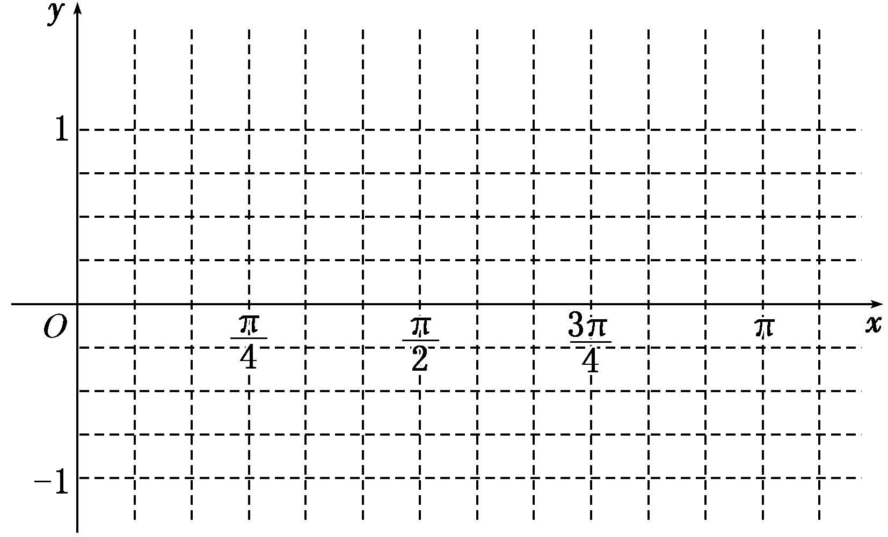
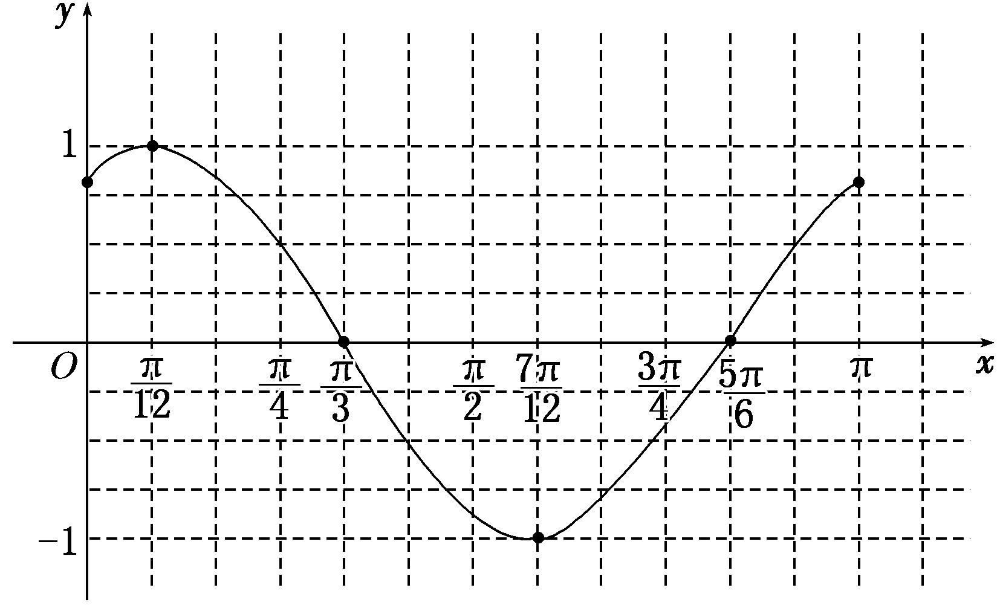

专题七 三角恒等变换应用篇(解答题)

三角函数图象与性质的综合问题

<strong>典例</strong> (12分)已知函数<em>f</em>(<em>x</em>)＝2sin·cos－sin(<em>x</em>＋π)．  
（1）求*f*(*x*)的最小正周期；  
（2）若将*f*(*x*)的图象向右平移个单位长度，得到函数*g*(*x*)的图象，求函数*g*(*x*)在区间[0，π]上的最大值和最小值．

<strong>思维点拨</strong>　（1）先将<em>f</em>(<em>x</em>)化成<em>y</em>＝<em>A</em>sin(<em>ωx</em>＋<em>φ</em>)的形式再求周期；  
（2）将*f*(*x*)解析式中的*x*换成*x*－，得*g*(*x*)，然后利用整体思想求最值．

规范解答

<strong>解</strong>　（1）<em>f</em>(<em>x</em>)＝2sincos－sin(<em>x</em>＋π)＝cos <em>x</em>＋sin <em>x</em>[3分]

＝2sin，[5分]
于是*T*＝＝2π．[6分]  
（2）由已知得*g*(*x*)＝*f*＝2sin，[8分]
∵*x*∈[0，π]，∴*x*＋∈，∴sin∈，[10分]
∴*g*(*x*)＝2sin∈[－1,2]．[11分]
故函数*g*(*x*)在区间[0，π]上的最大值为2，最小值为－1．[12分]

解决三角函数图象与性质的综合问题的一般步骤

第一步：(化简)将*f*(*x*)化为*a*sin *x*＋*b*cos *x*的形式；
第二步：(用辅助角公式)构造*f*(*x*)＝·；
第三步：(求性质)利用*f*(*x*)＝sin(*x*＋*φ*)研究三角函数的性质；
第四步：(反思)反思回顾，查看关键点、易错点和答题规范．

化归思想和整体代换思想在三角函数中的应用

<strong>典例</strong> (12分)(2016·天津)已知函数<em>f</em>(<em>x</em>)＝4tan <em>x</em>·sin·cos－．  
（1）求*f*(*x*)的定义域与最小正周期；  
（2）讨论*f*(*x*)在区间上的单调性．

<strong>思想方法指导</strong>　（1）讨论形如<em>y</em>＝<em>a</em>sin <em>ωx</em>＋<em>b</em>cos <em>ωx</em>型函数的性质，一律化成<em>y</em>＝sin(<em>ωx</em>＋<em>φ</em>)型的函数．  
（2）研究*y*＝*A*sin(*ωx*＋*φ*)型函数的最值、单调性，可将*ωx*＋*φ*视为一个整体，换元后结合*y*＝sin *x*的图象解决．

规范解答

<strong>解</strong>　（1）<em>f</em>(<em>x</em>)的定义域为．

*f*(*x*)＝4tan *x*cos *x*cos－＝4sin *x*cos－＝4sin *x*－

＝2sin <em>x</em>cos <em>x</em>＋2sin2<em>x</em>－＝sin 2<em>x</em>＋(1－cos 2<em>x</em>)－＝sin 2<em>x</em>－cos 2<em>x</em>＝2sin．[5分]
所以*f*(*x*)的最小正周期*T*＝＝π．[6分]  
（2）因为*x*∈，所以2*x*－∈，[8分]
由*y*＝sin *x*的图象可知，当2*x*－∈，即*x*∈时，*f*(*x*)单调递减；
当2*x*－∈，即*x*∈时，*f*(*x*)单调递增．[10分]
所以当*x*∈时，*f*(*x*)在区间上单调递增，在区间上单调递减．[12分]

【例题选讲】

<strong>[例1]</strong> (2018·浙江)已知角<em>α</em>的顶点与原点<em>O</em>重合，始边与<em>x</em>轴的非负半轴重合，它的终边过点<em>P</em>．  
（1）求sin(*α*＋π)的值；  
（2）若角*β*满足sin(*α*＋*β*)＝，求cos*β*的值．

<strong>解</strong>　（1）由角<em>α</em>的终边过点<em>P</em>得sin <em>α</em>＝－，所以sin(<em>α</em>＋π)＝－sin <em>α</em>＝．  
（2）由角*α*的终边过点*P*得cos *α*＝－，由sin(*α*＋*β*)＝得cos(*α*＋*β*)＝±．
由*β*＝(*α*＋*β*)－*α*得cos *β*＝cos(*α*＋*β*)cos *α*＋sin(*α*＋*β*)sin *α*，所以cos *β*＝－或cos *β*＝．

<strong>[例2]</strong> 已知函数<em>f</em>(<em>x</em>)＝(2cos2<em>x</em>－1)sin 2<em>x</em>＋cos 4<em>x</em>．  
（1）求函数*f*(*x*)的最小正周期及单调递减区间；  
（2）若*α*∈(0，π)，且*f*＝，求tan的值．

<strong>解</strong>　（1）∵<em>f</em>(<em>x</em>)＝(2cos2<em>x</em>－1)sin 2<em>x</em>＋cos 4<em>x</em>＝cos 2<em>x</em>sin 2<em>x</em>＋cos 4<em>x</em>＝(sin 4<em>x</em>＋cos 4<em>x</em>)＝sin，
∴函数<em>f</em>(<em>x</em>)的最小正周期<em>T</em>＝．令2<em>k</em>π＋≤4<em>x</em>＋≤2<em>k</em>π＋，<em>k</em>∈<strong>Z</strong>，得＋≤<em>x</em>≤＋，<em>k</em>∈<strong>Z</strong>．
∴函数<em>f</em>(<em>x</em>)的单调递减区间为，<em>k</em>∈<strong>Z</strong>．  
（2）∵*f*＝，∴sin＝1．又*α*∈(0，π)，∴－<*α*－<，∴*α*－＝，故*α*＝．
因此tan＝＝＝2－．

<strong>[例3]</strong> (2018·山东)设<em>f</em>(<em>x</em>)＝2sin(π－<em>x</em>)sin <em>x</em>－(sin <em>x</em>－cos <em>x</em>)2．  
（1）求*f*(*x*)的单调递增区间；  
（2）把*y*＝*f*(*x*)的图象上所有点的横坐标伸长到原来的2倍(纵坐标不变)，再把得到的图象向左平移个单位，得到函数*y*＝*g*(*x*)的图象，求*g*的值．

<strong>解</strong>　（1）<em>f</em>(<em>x</em>)＝2sin2<em>x</em>－(1－2sin <em>x</em>cos <em>x</em>)＝(1－cos 2<em>x</em>)＋sin 2<em>x</em>－1＝sin 2<em>x</em>－cos 2<em>x</em>＋－1

＝2sin＋－1．
由2<em>k</em>π－≤2<em>x</em>－≤2<em>k</em>π＋(<em>k</em>∈<strong>Z</strong>)，得<em>k</em>π－≤<em>x</em>≤<em>k</em>π＋(<em>k</em>∈<strong>Z</strong>)，
所以<em>f</em>(<em>x</em>)的单调递增区间是(<em>k</em>∈<strong>Z</strong>)．  
（2）由（1）知*f*(*x*)＝2sin＋－1，把*y*＝*f*(*x*)的图象上所有点的横坐标伸长到原来的2倍(纵坐标不变)，得到*y*＝2sin＋－1的图象，再把所得到的图象向左平移个单位，得到*y*＝2sin *x*＋－1的图象，即*g*(*x*)＝2sin *x*＋－1．所以*g*＝2sin ＋－1＝．

<strong>[例4]</strong> 已知函数<em>f</em>(<em>x</em>)＝4sin <em>x</em>cos－．  
（1）求函数*f*(*x*)的单调区间；  
（2）求函数*f*(*x*)图象的对称轴和对称中心．

<strong>解</strong>　（1）<em>f</em>(<em>x</em>)＝4sin <em>x</em>cos－＝4sin <em>x</em>－＝2sin <em>x</em>cos <em>x</em>＋2sin2<em>x</em>－

＝sin 2*x*＋(1－cos 2*x*)－＝sin 2*x*－cos 2*x*＝2sin．
令2<em>k</em>π－≤2<em>x</em>－≤2<em>k</em>π＋(<em>k</em>∈Z)，得<em>k</em>π－≤<em>x</em>≤<em>k</em>π＋(<em>k</em>∈<strong>Z</strong>)，
所以函数<em>f</em>(<em>x</em>)的单调递增区间为(<em>k</em>∈<strong>Z</strong>)．
令2<em>k</em>π＋≤2<em>x</em>－≤2<em>k</em>π＋(<em>k</em>∈<strong>Z</strong>)，得<em>k</em>π＋≤<em>x</em>≤<em>k</em>π＋(<em>k</em>∈<strong>Z</strong>)，
所以函数<em>f</em>(<em>x</em>)的单调递减区间为(<em>k</em>∈<strong>Z</strong>)．  
（2）令2<em>x</em>－＝<em>k</em>π＋(<em>k</em>∈Z)，得<em>x</em>＝＋(<em>k</em>∈<strong>Z</strong>)，所以函数<em>f</em>(<em>x</em>)的对称轴方程为<em>x</em>＝＋(<em>k</em>∈<strong>Z</strong>)．
令2<em>x</em>－＝<em>k</em>π(<em>k</em>∈Z)，得<em>x</em>＝＋(<em>k</em>∈<strong>Z</strong>)，所以函数<em>f</em>(<em>x</em>)的对称中心为(<em>k</em>∈<strong>Z</strong>)．

<strong>[例5]</strong> 已知函数<em>f</em>(<em>x</em>)＝2sin <em>x</em>sin．  
（1）求函数*f*(*x*)的最小正周期和单调递增区间；  
（2）当*x*∈时，求函数*f*(*x*)的值域．

<strong>解</strong>　（1）因为<em>f</em>(<em>x</em>)＝2sin <em>x</em>＝×＋sin 2<em>x</em>＝sin＋，
所以函数*f*(*x*)的最小正周期为*T*＝π．
由－＋2<em>k</em>π≤2<em>x</em>－≤＋2<em>k</em>π，<em>k</em>∈<strong>Z</strong>，解得－＋<em>k</em>π≤<em>x</em>≤＋<em>k</em>π，<em>k</em>∈<strong>Z</strong>，
所以函数<em>f</em>(<em>x</em>)的单调递增区间是，<em>k</em>∈<strong>Z</strong>．  
（2）当*x*∈时，2*x*－∈，sin∈，*f*(*x*)∈．
故*f*(*x*)的值域为．

<strong>[例6]</strong> (2019·浙江)设函数<em>f</em>(<em>x</em>)＝sin <em>x</em>，<em>x</em>∈<strong>R</strong>．  
（1）已知*θ*∈[0，2π)，函数*f*(*x*＋*θ*)是偶函数，求*θ*的值；  
（2）求函数<em>y</em>＝2＋2的值域．

<strong>解</strong>　（1）因为<em>f</em>(<em>x</em>＋<em>θ</em>)＝sin(<em>x</em>＋<em>θ</em>)是偶函数，所以对任意实数<em>x</em>都有sin(<em>x</em>＋<em>θ</em>)＝sin(－<em>x</em>＋<em>θ</em>)，
即sin *x*cos *θ*＋cos *x*sin *θ*＝－sin *x*cos *θ*＋cos *x*sin *θ*，故2sin *x*cos *θ*＝0，所以cos *θ*＝0．
又*θ*∈[0，2π)，因此*θ*＝或*θ*＝．  
（2）<em>y</em>＝2＋2＝sin2＋sin2＝＋

＝1－＝1－cos．
因此，所求函数的值域是．

【对点训练】

1．已知函数<em>f</em>(<em>x</em>)＝cos2<em>x</em>＋sin <em>x</em>cos <em>x</em>，<em>x</em>∈<strong>R</strong>．  
（1）求*f*的值；  
（2）若sin*α*＝，且*α*∈，求*f*．

1．解　（1）<em>f</em>＝cos2＋sin cos ＝2＋×＝．  
（2）因为<em>f</em>(<em>x</em>)＝cos2<em>x</em>＋sin <em>x</em>cos <em>x</em>＝＋sin 2<em>x</em>＝＋(sin 2<em>x</em>＋cos 2<em>x</em>)＝＋sin，
所以*f*＝＋sin＝＋sin＝＋．
又因为sin *α*＝，且*α*∈，所以cos *α*＝－，所以*f*＝＋＝．

2．已知cos·cos＝－，*α*∈．  
（1）求sin2*α*的值；  
（2）求tan*α*－的值．

2．解　（1）∵coscos＝cossin＝sin＝－，∴sin＝－.
∵*α*∈，∴2*α*＋∈，∴cos＝－，
∴sin 2*α*＝sin＝sincos －cossin ＝．  
（2）∵*α*∈，∴2*α*∈.又由（1）知sin 2*α*＝，∴cos 2*α*＝－．
∴tan *α*－＝－＝＝－＝－2×＝2．

3．(2017·浙江)已知函数<em>f</em>(<em>x</em>)＝sin2<em>x</em>－cos2<em>x</em>－2sin <em>x</em>cos <em>x</em>(<em>x</em>∈<strong>R</strong>)．  
（1）求*f*的值；  
（2）求*f*(*x*)的最小正周期及单调递增区间．

3．解　（1）由sin＝，cos＝－，得<em>f</em>＝2－2－2××＝2．  
（2）由cos 2<em>x</em>＝cos2<em>x</em>－sin2<em>x</em>与sin 2<em>x</em>＝2sin <em>x</em>cos <em>x</em>，得<em>f</em>(<em>x</em>)＝－cos 2<em>x</em>－sin 2<em>x</em>＝－2sin．
所以<em>f</em>(<em>x</em>)的最小正周期是π．由正弦函数的性质，得＋2<em>k</em>π≤2<em>x</em>＋≤＋2<em>k</em>π，<em>k</em>∈<strong>Z</strong>，
解得＋<em>k</em>π≤<em>x</em>≤＋<em>k</em>π，<em>k</em>∈<strong>Z</strong>．所以<em>f</em>(<em>x</em>)的单调递增区间为(<em>k</em>∈<strong>Z</strong>)．

4．已知角*α*的顶点在坐标原点，始边与*x*轴的正半轴重合，终边经过点*P*(－3，)．  
（1）求sin 2*α*－tan *α*的值；  
（2）若函数<em>f</em>(<em>x</em>)＝cos(<em>x</em>－<em>α</em>)cos <em>α</em>－sin(<em>x</em>－<em>α</em>)sin <em>α</em>，求函数<em>g</em>(<em>x</em>)＝<em>f</em>－2<em>f</em> 2(<em>x</em>)在区间上的值域．

4．解　（1）∵角*α*的终边经过点*P*(－3，)，∴sin *α*＝，cos *α*＝－，tan *α*＝－．
∴sin 2*α*－tan *α*＝2sin *α*cos *α*－tan *α*＝－＋＝－．  
（2）∵*f*(*x*)＝cos(*x*－*α*)cos *α*－sin(*x*－*α*)sin *α*＝cos *x*，
∴<em>g</em>(<em>x</em>)＝cos－2cos2<em>x</em>＝sin 2<em>x</em>－1－cos 2<em>x</em>＝2sin－1．∵0≤<em>x</em>≤，∴－≤2<em>x</em>－≤．
∴－≤sin≤1，∴－2≤2sin－1≤1，
故函数<em>g</em>(<em>x</em>)＝<em>f</em>－2<em>f</em>2(<em>x</em>)在区间上的值域是[－2,1]．

5．已知函数<em>f</em>(<em>x</em>)＝2cos2<em>ωx</em>－1＋2sin <em>ωx</em>cos <em>ωx</em>(0&lt;<em>ω</em>&lt;1)，直线<em>x</em>＝是函数<em>f</em>(<em>x</em>)的图象的一条对称轴．  
（1）求函数*f*(*x*)的单调递增区间；  
（2）已知函数*y*＝*g*(*x*)的图象是由*y*＝*f*(*x*)的图象上各点的横坐标伸长到原来的2倍，然后再向左平移个单位长度得到的，若*g*＝，*α*∈，求sin *α*的值．

5．解　（1）*f*(*x*)＝cos 2*ωx*＋sin 2*ωx*＝2sin，
由于直线*x*＝是函数*f*(*x*)＝2sin的图象的一条对称轴，
所以<em>ω</em>＋＝<em>k</em>π＋(<em>k</em>∈<strong>Z</strong>)，解得<em>ω</em>＝<em>k</em>＋(<em>k</em>∈<strong>Z</strong>)，又0&lt;<em>ω</em>&lt;1，所以<em>ω</em>＝，所以<em>f</em>(<em>x</em>)＝2sin．
由2<em>k</em>π－≤<em>x</em>＋≤2<em>k</em>π＋(<em>k</em>∈<strong>Z</strong>)，得2<em>k</em>π－≤<em>x</em>≤2<em>k</em>π＋(<em>k</em>∈<strong>Z</strong>)，
所以函数<em>f</em>(<em>x</em>)的单调递增区间为(<em>k</em>∈<strong>Z</strong>)．  
（2）由题意可得*g*(*x*)＝2sin，即*g*(*x*)＝2cos，
由*g*＝2cos＝2cos＝，得cos＝，
又*α*∈，故<*α*＋<，所以sin＝，
所以sin *α*＝sin＝sin·cos－cos·sin＝×－×＝．

6．已知函数*f*(*x*)＝sin *ωx*＋cos *ωx*(*ω*>0)的最小正周期为π．  
（1）求*ω*的值，并在下面提供的坐标系中画出函数*y*＝*f*(*x*)在区间[0，π]上的图象；  
（2）函数*y*＝*f*(*x*)的图象可由函数*y*＝sin *x*的图象经过怎样的变换得到？

6．解　（1）由题意知*f*(*x*)＝sin，因为*T*＝π，所以＝π，即*ω*＝2，故*f*(*x*)＝sin.

列表如下：

<table><tr><td>
2<em>x</em>＋
</td><td></td><td></td><td>
π
</td><td></td><td>
2π
</td><td></td></tr><tr><td>
<em>x</em>
</td><td>
0
</td><td></td><td></td><td></td><td></td><td>
π
</td></tr><tr><td>
<em>f</em>(<em>x</em>)
</td><td></td><td>
1
</td><td>
0
</td><td>
－1
</td><td>
0
</td><td></td></tr></table>

*y*＝*f*(*x*)在[0，π]上的图象如图所示．

  
（2）将*y*＝sin *x*的图象上的所有点向左平移个单位长度，得到函数*y*＝sin的图象，再将*y*＝sin的图象上所有点的横坐标缩短到原来的(纵坐标不变)，得到函数*f*(*x*)＝sin(*x*∈R)的图象．

7．已知函数<em>f</em>(<em>x</em>)＝sin(<em>ωx</em>＋<em>φ</em>)＋2sin2－1(<em>ω</em>＞0，0＜<em>φ</em>＜π)为奇函数，且相邻两对称轴间的距离为

．  
（1）当*x*∈时，求*f*(*x*)的单调递减区间；  
（2）将函数*y*＝*f*(*x*)的图象沿*x*轴方向向右平移个单位长度，再把横坐标缩短到原来的(纵坐标不变)，得到函数*y*＝*g*(*x*)的图象．当*x*∈时，求函数*g*(*x*)的值域．

7．解　（1）由题意得*f*(*x*)＝sin(*ωx*＋*φ*)－cos＝2sin，
因为相邻两对称轴间的距离为，所以*T*＝＝π，*ω*＝2，又因为函数*f*(*x*)为奇函数，
所以<em>φ</em>－＝<em>k</em>π，<em>k</em>∈<strong>Z</strong>，<em>φ</em>＝<em>k</em>π＋，<em>k</em>∈<strong>Z．</strong>因为0＜<em>φ</em>＜π，所以<em>φ</em>＝，
故函数<em>f</em>(<em>x</em>)＝2sin 2<em>x．</em>令＋2<em>k</em>π≤2<em>x</em>≤＋2<em>k</em>π，<em>k</em>∈<strong>Z</strong>，得＋<em>k</em>π≤<em>x</em>≤＋<em>k</em>π，<em>k</em>∈<strong>Z</strong>，
令*k*＝－1，得－≤*x*≤－，因为*x*∈，所以函数*f*(*x*)的单调递减区间为.  
（2）由题意可得*g*(*x*)＝2sin，因为*x*∈，所以－≤4*x*－≤，
所以－1≤sin≤，*g*(*x*)∈[－2，]，即函数*g*(*x*)的值域为[－2，]．

8．设函数<em>f</em>(<em>x</em>)＝sin <em>ωx</em>·cos <em>ωx</em>－cos2<em>ωx</em>＋(<em>ω</em>＞0)的图象上相邻最高点与最低点的距离为．  
（1）求*ω*的值；  
（2）若函数*y*＝*f*(*x*＋*φ*)是奇函数，求函数*g*(*x*)＝cos(2*x*－*φ*)在[0，2π]上的单调递减区间．

8．解　（1）<em>f</em>(<em>x</em>)＝sin <em>ωx</em>·cos <em>ωx</em>－cos2<em>ωx</em>＋＝sin 2<em>ωx</em>－＋

＝sin 2*ωx*－cos 2*ωx*＝sin．
设*T*为*f*(*x*)的最小正周期，由*f*(*x*)的图象上相邻最高点与最低点的距离为．
得2＋[2<em>f</em>(<em>x</em>)max]2＝π2＋4．因为<em>f</em>(<em>x</em>)max＝1，所以2＋4＝π2＋4，整理得<em>T</em>＝2π．
又因为*ω*>0，*T*＝＝2π，所以*ω*＝．  
（2）由（1）可知*f*(*x*)＝sin，所以*f*(*x*＋*φ*)＝sin．
因为*y*＝*f*(*x*＋*φ*)是奇函数，所以sin＝0．又因为0<*φ*<，所以*φ*＝．
所以<em>g</em>(<em>x</em>)＝cos(2<em>x</em>－<em>φ</em>)＝cos.令2<em>k</em>π≤2<em>x</em>－≤2<em>k</em>π＋π，<em>k</em>∈<strong>Z</strong>，则<em>k</em>π＋≤<em>x</em>≤<em>k</em>π＋，<em>k</em>∈<strong>Z</strong>，
所以函数<em>g</em>(<em>x</em>)的单调递减区间是，<em>k</em>∈<strong>Z．</strong>又因为<em>x</em>∈[0，2π]，
所以当*k*＝0时，*g*(*x*)的单调递减区间为；当*k*＝1时，*g*(*x*)的单调递减区间为．
所以函数*g*(*x*)在[0，2π]上的单调递减区间是，．

9．已知函数<em>f</em>(<em>x</em>)＝sin2<em>x</em>－sin2，<em>x</em>∈<strong>R</strong>.  
（1）求*f*(*x*)的最小正周期；  
（2）求*f*(*x*)在区间上的最大值和最小值．

9．解　（1）由已知，有*f*(*x*)＝－＝－cos 2*x*

＝sin 2*x*－cos2*x*＝sin．所以*f*(*x*)的最小正周期*T*＝＝π．  
（2）因为*f*(*x*)在区间上是减函数，在区间上是增函数，

且*f*＝－，*f*＝－，*f*＝，所以*f*(*x*)在区间上的最大值为，最小值为－．

10．已知函数<em>f</em>(<em>x</em>)＝sin(2<em>x</em>＋)＋sin(2<em>x</em>－)＋2cos2<em>x</em>，<em>x</em>∈<strong>R</strong>.  
（1）求函数*f*(*x*)的最小正周期；  
（2）求函数*f*(*x*)在区间[－，]上的最大值和最小值．

10．解　（1）∵*f*(*x*)＝sin2*x*·cos＋cos2*x*·sin＋sin2*x*·cos－cos2*x*sin＋cos2*x*＋1

＝sin2*x*＋cos2*x*＋1＝sin(2*x*＋)＋1，
∴*f*(*x*)的最小正周期*T*＝＝π.  
（2）由（1）知，*f*(*x*)＝sin(2*x*＋)＋1，∵*x*∈[－，]，∴令2*x*＋＝得*x*＝，
∴*f*(*x*)在区间[－，]上是增函数；在区间[，]上是减函数，
又∵*f*(－)＝0，*f*()＝＋1，*f*()＝2，
∴函数*f*(*x*)在区间[－，]上的最大值为＋1，最小值为0．

11．(2018·北京)已知函数<em>f</em>(<em>x</em>)＝sin2<em>x</em>＋sin <em>x</em>cos <em>x</em>．  
（1）求*f*(*x*)的最小正周期；  
（2）若*f*(*x*)在区间上的最大值为，求*m*的最小值．

11．解　（1）因为<em>f</em>(<em>x</em>)＝sin2<em>x</em>＋sin <em>x</em>cos <em>x</em>＝－cos 2<em>x</em>＋sin 2<em>x</em>＝sin＋，
所以*f*(*x*)的最小正周期为*T*＝＝π．  
（2）由（1）知*f*(*x*)＝sin＋．由题意知－≤*x*≤*m*，所以－≤2*x*－≤2*m*－．

要使*f*(*x*)在区间上的最大值为，即sin在区间上的最大值为1，
所以2*m*－≥，即*m*≥．所以*m*的最小值为．

12．(2017·山东)设函数*f*(*x*)＝sin＋sin，其中0＜*ω*＜3．已知*f*＝0．  
（1）求*ω*；  
（2）将函数*y*＝*f*(*x*)的图象上各点的横坐标伸长为原来的2倍(纵坐标不变)，再将得到的图象向左平移个单位长度，得到函数*y*＝*g*(*x*)的图象，求*g*(*x*)在上的最小值．

12．解　（1）因为*f*(*x*)＝sin＋sin，
所以*f*(*x*)＝sin *ωx*－cos *ωx*－cos *ωx*＝sin *ωx*－cos *ωx*＝＝sin．
由题设知<em>f</em>＝0，所以－＝<em>k</em>π，<em>k</em>∈<strong>Z</strong>，故<em>ω</em>＝6<em>k</em>＋2，<em>k</em>∈<strong>Z</strong>．又0＜<em>ω</em>＜3，所以<em>ω</em>＝2．  
（2）由（1）得*f*(*x*)＝sin，所以*g*(*x*)＝sin＝sin．因为*x*∈，所以*x*－∈，当*x*－＝－，即*x*＝－时，*g*(*x*)取得最小值－．

