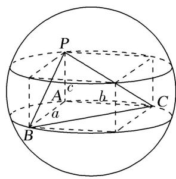
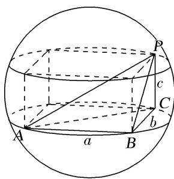
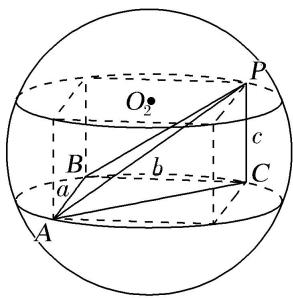
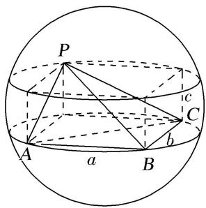
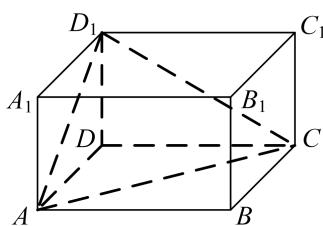
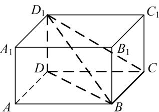
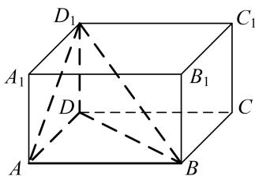
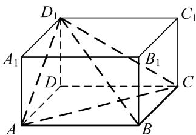
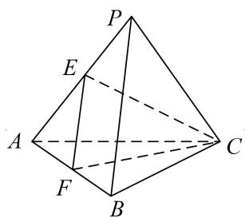
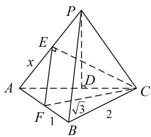

# 专题一 墙角模型
如果一个多面体的各个顶点都在同一个球面上，那么称这个多面体是球的内接多面体，这个球称为多面体的外接球。有关多面体外接球的问题，是立体几何的一个重点与难点，也是高考考查的一个热点。考查学生的空间想象能力以及化归能力。研究多面体的外接球问题，既要运用多面体的知识，又要运用球的知识，解决这类问题的关键是抓住内接的特点，即球心到多面体的顶点的距离等于球的半径。并且还要特别注意多面体的有关几何元素与球的半径之间的关系，而多面体外接球半径的求法在解题中往往会起到至关重要的作用。

球的内切问题主要是指球外切多面体与旋转体，解答时首先要找准切点，通过作截面来解决。如果外切的是多面体，则作截面时主要抓住多面体过球心的对角面来作。当球与多面体的各个面相切时，注意球心到各面的距离相等即球的半径，求球的半径时，可用球心与多面体的各顶点连接，球的半径为分成的小棱锥的高，用体积法来求球的半径。

# 空间几何体的外接球与内切球十大模型

1. 墙角模型；2. 对棱相等模型；3. 汉堡模型；4. 垂面模型；5. 切瓜模型；6. 斗笠模型；7. 鳄鱼模型；8. 已知球心或球半径模型；9. 最值模型；10. 内切球模型。

# 【方法总结】

墙角模型是三棱锥有一条侧棱垂直于底面且底面是直角三角形模型，用构造法(构造长方体)解决．外接球的直径等于长方体的体对角线长(在长方体的同一顶点的三条棱长分别为a，b，c，外接球的半径为R，则 $2R=\sqrt{a^{2}+b^{2}+c^{2}}$ ．)，秒杀公式： $R^{2}=\frac{a^{2}+b^{2}+c^{2}}{4}$ ．可求出球的半径从而解决问题．有以下四种类型：

类型 I

类型Ⅱ

类型III

例外型

# 【例题选讲】

[例] （1）已知三棱锥 A-BCD 的四个顶点 A, B, C, D 都在球 O 的表面上， $AC \perp$ 平面 BCD， $BC \perp CD$ ，且 $AC = \sqrt{3}$ ，BC = 2， $CD = \sqrt{5}$ ，则球 O 的表面积为（）

A. $12\pi$

B. $7\pi$

C. $9\pi$

D. $8\pi$  
（2）若三棱锥 S-ABC 的三条侧棱两两垂直，且 SA=2，SB=SC=4，则该三棱锥的外接球半径为().

A. 3

B. 6

C. 36

D. 9  
（3）已知 S, A, B, C，是球 O 表面上的点， $SA \perp$ 平面 ABC， $AB \perp BC$ ， $SA = AB = 1$ ， $BC = \sqrt{2}$ ，则球 O 的表面积等于( ).

A. $4\pi$

B. $3\pi$

C. $2\pi$

D. $\pi$  
（4）在正三棱锥 S-ABC 中，M，N 分别是棱 SC，BC 的中点，且 $AM \perp MN$ ，若侧棱 $SA = 2\sqrt{3}$ ，则正三棱锥 S-ABC 外接球的表面积是 \_\_\_\_.  
（5）(2019 全国 I)已知三棱锥 $P-ABC$ 的四个顶点在球 $O$ 的球面上, $PA=PB=PC$ , $\triangle ABC$ 是边长为 2 的正三角形, $E$ , $F$ 分别是 $PA$ , $AB$ 的中点, $\angle CEF=90^{\circ}$ , 则球 $O$ 的体积为 ( ).

A. $8 \sqrt{6} \pi$

B. $4 \sqrt{6} \pi$

C. $2 \sqrt{6} \pi$

D. $\sqrt{6}\pi$
> 

> 
> |  |  |
> | --- | --- |
> | （解法一） | （解法二） |
> 
  
（6）已知二面角 $\alpha - l - \beta$ 的大小为 $\frac{\pi}{3}$ , 点 $P \in \alpha$ , 点 $P$ 在 $\beta$ 内的正投影为点 $A$ , 过点 $A$ 作 $AB \perp l$ , 垂足为点 $B$ , 点 $C \in l$ , $BC = 2\sqrt{2}$ , $PA = 2\sqrt{3}$ , 点 $D \in \beta$ , 且四边形 $ABCD$ 满足 $\angle BCD + \angle DAB = \pi$ . 若四面体 $PACD$ 的四个顶点都在同一球面上, 则该球的体积为 \_\_\_\_.

# 【对点训练】

1. 点 $A, B, C, D$ 均在同一球面上，且 $AB, AC, AD$ 两两垂直，且 $AB = 1, AC = 2, AD = 3$ ，则该球的表面积为（）

A. $7\pi$

B. $14\pi$

C. $\frac{7}{2}\pi$

D. $\frac{7\sqrt{14}\pi}{3}$

2. 等腰 $\triangle ABC$ 中, $AB = AC = 5$ , $BC = 6$ , 将 $\triangle ABC$ 沿 $BC$ 边上的高 $AD$ 折成直二面角 $B - AD - C$ , 则三棱锥 $B - ACD$ 的外接球的表面积为( )

A. $5\pi$

B. $\frac{20}{3}\pi$

C. $10\pi$

D. $34\pi$

3. 已知球 $O$ 的球面上有四点 $A, B, C, D, DA \perp$ 平面 $ABC, AB \perp BC, DA = AB = BC = \sqrt{2}$ , 则球 $O$ 的体积等于 \_\_\_\_.

4. 已知四面体 $P - ABC$ 四个顶点都在球 $O$ 的球面上, 若 $PB \perp$ 平面 $ABC$ , $AB \perp AC$ , 且 $AC = 1$ , $AB = PB = 2$ , 则球 $O$ 的表面积为 \_\_\_\_.

5. 三棱锥 $P - ABC$ 中, $\triangle ABC$ 为等边三角形, $PA = PB = PC = 3$ , $PA \perp PB$ , 三棱锥 $P - ABC$ 的外接球的体积为( )

A. $\frac{27}{2}\pi$

B. $\frac{27\sqrt{3}}{2}\pi$

C. $27\sqrt{3}\pi$

D. $27\pi$

6. 在空间直角坐标系 $Oxyz$ 中, 四面体 $ABCD$ 各顶点的坐标分别为 $A(2, 2, 1)$ , $B(2, 2, -1)$ , $C(0, 2, 1)$ , $D(0, 0, 1)$ , 则该四面体外接球的表面积是 ( )

A. $16\pi$

B. $12\pi$

C. $4\sqrt{3}\pi$

D. $6\pi$

7. 在平行四边形 $ABCD$ 中, $\angle ABD = 90^{\circ}$ , 且 $AB = 1$ , $BD = \sqrt{2}$ , 若将其沿 $BD$ 折起使平面 $ABD \perp$ 平面 $BC$ $D$ , 则三棱锥 $A - BDC$ 的外接球的表面积为 (D)

A. $2\pi$

B. $8\pi$

C. $16\pi$

D. $4\pi$

8. 在正三棱锥 $S - ABC$ 中, 点 $M$ 是 $SC$ 的中点, 且 $AM \perp SB$ , 底面边长 $AB = 2\sqrt{2}$ , 则正三棱锥 $S - ABC$ 的外接球的表面积为( )

A. $6\pi$

B. $12\pi$

C. $32\pi$

D. $36\pi$

9. 在古代将四个面都为直角三角形的四面体称之为鳖臑, 已知四面体 $A - BCD$ 为鳖臑, $AB \perp$ 平面 $BCD$ , 且 $AB = BC = \frac{\sqrt{3}}{6} CD$ , 若此四面体的体积为 $\frac{8\sqrt{3}}{3}$ , 则其外接球的表面积为 \_\_\_\_.

10. 在长方体 $ABCD - A_{1}B_{1}C_{1}D_{1}$ 中, 底面 $ABCD$ 是边长为 $3\sqrt{2}$ 的正方形, $AA_{1} = 3$ , $E$ 是线段 $A_{1}B_{1}$ 上一点, 若二面角 $A - BD - E$ 的正切值为 3 , 则三棱锥 $A - A_{1}D_{1}E$ 外接球的表面积为 \_\_\_\_.

