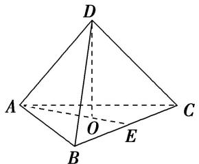
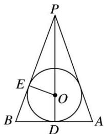
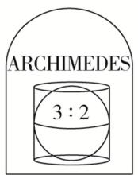
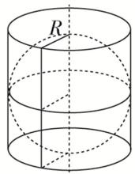
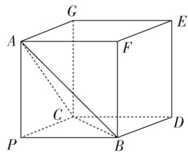

# 专题十 内切球模型

# 【方法总结】

以三棱锥 P-ABC 为例，求其内切球的半径.

方法：等体积法，三棱锥 P-ABC 体积等于内切球球心与四个面构成的四个三棱锥的体积之和；

第一步：先求出四个表面的面积和整个锥体体积；

第二步：设内切球的半径为 r，球心为 O，建立等式： $V_{P-ABC}=V_{O-ABC}+V_{O-PAB}+V_{O-PAC}+V_{O-PBC}\Rightarrow V_{P-ABC}=\frac{1}{3}S_{\triangle ABC}\cdot r+\frac{1}{3}S_{\triangle PAB}\cdot r+\frac{1}{3}S_{\triangle PAC}\cdot r+\frac{1}{3}S_{\triangle PBC}\cdot r=\frac{1}{3}(S_{\triangle ABC}+S_{\triangle PAB}+S_{\triangle PAC}+S_{\triangle PBC})\cdot r;$

第三步：解出 $r=\frac{3V_{P-ABC}}{S_{O-ABC}+S_{O-PAB}+S_{O-PAC}+S_{O-PBC}}=\frac{3V}{S_{表}}$ .

秒杀公式(万能公式): $r=\frac{3V}{S_{表}}$

# 【例题选讲】

[例] (1)已知一个三棱锥的所有棱长均为 $\sqrt{2}$ ，则该三棱锥的内切球的体积为 \_\_\_\_.

text_image

D
A
O
C
B
E

(2)(2020·全国III)已知圆锥的底面半径为1，母线长为3，则该圆锥内半径最大的球的体积为\_\_\_\_。

text_image

P
E
O
B
D
A

(3)阿基米德(公元前 287 年～公元前 212 年)是古希腊伟大的哲学家、数学家和物理学家，他和高斯、牛顿并列被称为世界三大数学家．据说，他自己觉得最为满意的一个数学发现就是“圆柱内切球体的体积是圆柱体积的三分之二，并且球的表面积也是圆柱表面积的三分之二”．他特别喜欢这个结论．要求后人在他的墓碑上刻着一个圆柱容器里放了一个球，如图，该球顶天立地，四周碰边．若表面积为 $54\pi$ 的圆柱的底面直径与高都等于球的直径，则该球的体积为( )

A. $4\pi$

B. $16\pi$

C. $36\pi$

D. $\frac{64\pi}{3}$

(4)已知三棱锥 P-ABC 的三条侧棱 PA, PB, PC 两两互相垂直，且 PA=PB=PC=2，则三棱锥 P-ABC 的外接球与内切球的半径比为 \_\_\_\_.

text_image

G
A
F
E
C
P
B
D

(5)正四面体的外接球和内切球上各有一个动点 $P$ 、 $Q$ ，若线段 $PQ$ 长度的最大值为 $\frac{4}{3}\sqrt{6}$ ，则这个四面体的棱长为 \_\_\_\_.

# 【对点训练】

1. 若一个正四面体的表面积为 $S_{1}$ , 其内切球的表面积为 $S_{2}$ , 则 $\frac{S_{1}}{S_{2}} =$ \_\_\_\_.

2. 已知一个平放的各棱长为 4 的三棱锥内有一个小球 $O$ (重量忽略不计), 现从该三棱锥顶端向内注水, 小球慢慢上浮, 当注入的水的体积是该三棱锥体积的 $\frac{7}{8}$ 时, 小球与该三棱锥各侧面均相切 (与水面也相切), 则小球的表面积等于 ( )

A. $\frac{7\pi}{6}$

B. $\frac{4\pi}{3}$

C. $\frac{2\pi}{3}$

D. $\frac{\pi}{2}$

3. 已知四棱锥 $P - ABCD$ 的底面 $ABCD$ 是边长为 6 的正方形，且 $PA = PB = PC = PD$ ，若一个半径为 1 的球与此四棱锥所有面都相切，则该四棱锥的高是（）

A. 6

B. 5

C. $\frac{9}{2}$

D. $\frac{9}{4}$

4. 将半径为 3，圆心角为 $\frac{2\pi}{3}$ 的扇形围成一个圆锥，则该圆锥的内切球的表面积为( )

A. $\pi$

B. $2\pi$

C. $3\pi$

D. $4\pi$

5. 体积为 $\frac{4\pi}{3}$ 的球与正三棱柱的所有面均相切, 则该棱柱的体积为 \_\_\_\_.

6. 在四棱锥 $P - ABCD$ 中, 四边形 $ABCD$ 是边长为 $2a$ 的正方形, $PD \perp$ 底面 $ABCD$ , 且 $PD = 2a$ , 若在这个四棱锥内放一个球, 则该球半径的最大值为 \_\_\_\_.

7. 一个棱长为 6 的正四面体内部有一个任意旋转的正方体, 当正方体的棱长取得最大值时, 正方体的外接球的表面积是( )

A. $4\pi$

B. $6\pi$

C. $12\pi$

D. $24\pi$

8. 在《九章算术》中, 将底面为长方形且有一条侧棱与底面垂直的四棱锥称之为阳马. 若四棱锥 $M - ABCD$ 为阳马, 侧棱 $MA \perp$ 底面 $ABCD$ , 且 $MA = BC = AB = 2$ , 则该阳马的外接球与内切球表面积之和为 \_\_\_\_.

9. 在三棱锥 $S - ABC$ 中, $AB = 6$ , $BC = 8$ , $AC = 10$ , 二面角 $S - AB - C$ 、 $S - AC - B$ 、 $S - BC - A$ 的大小均为 $\frac{\pi}{4}$ , 设三棱锥 $S - ABC$ 的外接球球心为 $O$ , 直线 $SO$ 交平面 $ABC$ 于点 $M$ , 则三棱锥 $S - ABC$ 的内切球半径为 \_\_\_\_. $\frac{SO}{OM} =$ \_\_\_\_.

10. 已知直三棱柱 $ABC - AB_{1}C_{1}$ 中， $AC = BC = 2$ ， $AC \perp BC$ ，设二面角 $C - AB - C_{1}$ 的平面角为 $\theta$ ，且 $\tan \theta = \sqrt{2}$ ，现在该三棱柱的内部空间放一个小球 $O_{1}$ ，设小球 $O_{1}$ 的表面积为 $S_{1}$ ，三棱柱的外接球 $O_{2}$ 的表面积为 $S_{2}$ ，则 $\frac{S_{1}}{S_{2}}$ 的最大值为 \_\_\_\_

扫码关注学科网数学服务号，获取优质数学教育资源

↓ ↓ ↓

text_image

QR code image containing encoded data, no visible human-readable text

