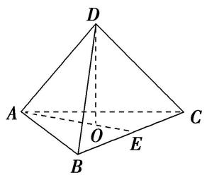
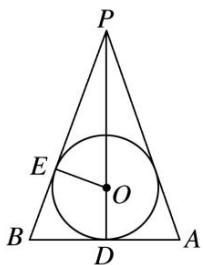
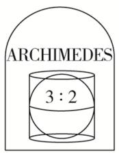
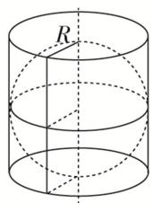
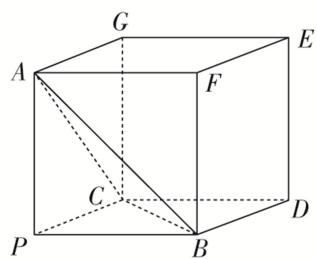
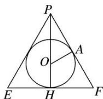
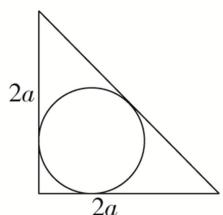

# 专题十 内切球模型

# 【方法总结】

以三棱锥 P-ABC 为例，求其内切球的半径.
方法：等体积法，三棱锥 P-ABC 体积等于内切球球心与四个面构成的四个三棱锥的体积之和；
第一步：先求出四个表面的面积和整个锥体体积；
第二步：设内切球的半径为 r，球心为 O，建立等式： $V_{P-ABC}=V_{O-ABC}+V_{O-PAB}+V_{O-PAC}+V_{O-PBC}\Rightarrow V_{P-ABC}=\frac{1}{3}S_{\triangle ABC}\cdot r+\frac{1}{3}S_{\triangle PAB}\cdot r+\frac{1}{3}S_{\triangle PAC}\cdot r+\frac{1}{3}S_{\triangle PBC}\cdot r=\frac{1}{3}(S_{\triangle ABC}+S_{\triangle PAB}+S_{\triangle PAC}+S_{\triangle PBC})\cdot r;$
第三步：解出 $r = \frac{3V_{P - ABC}}{S_{O - ABC} + S_{O - PAB} + S_{O - PAC} + S_{O - PBC}} = \frac{3V}{S_{\text{表}}}.$

秒杀公式(万能公式): $r=\frac{3V}{S_{表}}$

# 【例题选讲】

[例] （1）已知一个三棱锥的所有棱长均为 $\sqrt{2}$ ，则该三棱锥的内切球的体积为 \_\_\_\_.
答案 $\frac{\sqrt{3}}{54}\pi$ 解析 由题意可知，该三棱锥为正四面体，如图所示。 $AE = AB\cdot \sin 60^{\circ} = \frac{\sqrt{6}}{2}, AO = \frac{2}{3} AE = \frac{\sqrt{6}}{3}, DO = \sqrt{AD^{2} - AO^{2}} = \frac{2\sqrt{3}}{3}$ ，三棱锥的体积 $V_{D - ABC} = \frac{1}{3} S_{\triangle ABC}\cdot DO = \frac{1}{3}$ ，设内切球的半径为 $r$ ，则 $V_{D - ABC} = \frac{1}{3} r(S_{\triangle ABC} + S_{\triangle ABD} + S_{\triangle BCD} + S_{\triangle ACD}) = \frac{1}{3}, r = \frac{\sqrt{3}}{6}, V_{\text{内切球}} = \frac{4}{3}\pi r^3 = \frac{\sqrt{3}}{54}\pi .$

  
（2）(2020·全国III)已知圆锥的底面半径为1，母线长为3，则该圆锥内半径最大的球的体积为\_\_\_\_。
答案 $\frac{\sqrt{2}}{3}\pi$ 解析 圆锥内半径最大的球即为圆锥的内切球，设其半径为 $r$ 。作出圆锥的轴截面 $PAB$ ，如图所示，则 $\triangle PAB$ 的内切圆为圆锥的内切球的大圆。在 $\triangle PAB$ 中， $PA = PB = 3$ ， $D$ 为 $AB$ 的中点， $AB = 2$ ， $E$ 为切点，则 $PD = 2\sqrt{2}$ ， $\triangle PEO \sim \triangle PDB$ ，故 $\frac{PO}{PB} = \frac{OE}{DB}$ ，即 $\frac{2\sqrt{2} - r}{3} = \frac{r}{1}$ ，解得 $r = \frac{\sqrt{2}}{2}$ ，故内切球的体积为 $\frac{4}{3}\pi\left(\frac{\sqrt{2}}{2}\right)^3 = \frac{\sqrt{2}}{3}\pi$ 。

  
（3）阿基米德(公元前287年～公元前212年)是古希腊伟大的哲学家、数学家和物理学家，他和高斯、牛顿并列被称为世界三大数学家．据说，他自己觉得最为满意的一个数学发现就是“圆柱内切球体的体积是圆柱体积的三分之二，并且球的表面积也是圆柱表面积的三分之二”．他特别喜欢这个结论．要求后人在他的墓碑上刻着一个圆柱容器里放了一个球，如图，该球顶天立地，四周碰边．若表面积为 $54\pi$ 的圆柱的底面直径与高都等于球的直径，则该球的体积为( )

A. $4\pi$

B. $16\pi$

C. $36\pi$

D. $\frac{64\pi}{3}$
答案 C 解析 设该圆柱的底面半径为 R，则圆柱的高为 2R，则圆柱的表面积 $S = S_{底} + S_{侧} = 2 \times \pi R^{2} + 2 \cdot \pi \cdot R \cdot 2R = 54\pi$ ，解得 $R^{2} = 9$ ，即 R = 3。∴ 圆柱的体积为 $V = \pi R^{2} \times 2R = 54\pi$ ，∴ 该圆柱的内切球的体积为 $\frac{2}{3} \times 54\pi = 36\pi$ 。故选 C.  
（4）已知三棱锥 $P - ABC$ 的三条侧棱 $PA, PB, PC$ 两两互相垂直，且 $PA = PB = PC = 2$ ，则三棱锥 $P - ABC$ 的外接球与内切球的半径比为
答案 $\frac{3\sqrt{3} + 3}{2}$ 解析 以 $PA, PB, PC$ 为过同一顶点的三条棱，作长方体，由 $PA = PB = PC = 2$ ，可知此长方体即为正方体．设外接球的半径为 $R$ ，则 $R = \frac{\sqrt{4 + 4 + 4}}{2} = \sqrt{3}$ ，设内切球的半径为 $r$ ，则内切球的球心到四个面的距离均为 $r$ ，由 $\frac{1}{3} (S_{\triangle ACP} + S_{\triangle APB} + S_{\triangle PCB} + S_{\triangle ABC})\cdot r = \frac{1}{3}\cdot S_{\triangle PCB}\cdot AP$ ，解得 $r = \frac{2}{3 + \sqrt{3}}$ ，所以 $\frac{R}{r} = \frac{\frac{\sqrt{3}}{2}}{\frac{3\sqrt{3} + 3}{2}} = \frac{3\sqrt{3} + 3}{2}$

  
（5）正四面体的外接球和内切球上各有一个动点 $P$ 、 $Q$ ，若线段 $PQ$ 长度的最大值为 $\frac{4}{3}\sqrt{6}$ ，则这个四面体的棱长为 \_\_\_\_.
答案 4 解析 设这个四面体的棱长为 a，则它的外接球与内切球的球心重合，且半径 $R_{外}=\frac{\sqrt{6}}{4}a$ ，
$r_{内}=\frac{\sqrt{6}}{12}a$ ，依题意得 $\frac{\sqrt{6}}{4}a+\frac{\sqrt{6}}{12}a=\frac{4\sqrt{6}}{3}$ ，∴a=4。

# 【对点训练】

1. 若一个正四面体的表面积为 $S_{1}$ , 其内切球的表面积为 $S_{2}$ , 则 $\frac{S_{1}}{S_{2}} =$ \_\_\_\_.

1. 答案 $\frac{6\sqrt{3}}{\pi}$ 解析 设正四面体棱长为 $a$ ，则正四面体表面积为 $S_{1} = 4 \times \frac{\sqrt{3}}{4} a^{2} = \sqrt{3} a^{2}$ ，其内切球半径为正四面体高的 $\frac{1}{4}$ ，即 $r = \frac{1}{4} \times \frac{\sqrt{6}}{3} a = \frac{\sqrt{6}}{12} a$ ，因此内切球表面积为 $S_{2} = 4\pi r^{2} = \frac{\pi a^{2}}{6}$ ，则 $\frac{S_{1}}{S_{2}} = \frac{\sqrt{3} a^{2}}{\frac{\pi}{6} a^{2}} = \frac{6\sqrt{3}}{\pi}$ .

2. 已知一个平放的各棱长为 4 的三棱锥内有一个小球 $O$ (重量忽略不计), 现从该三棱锥顶端向内注水, 小球慢慢上浮, 当注入的水的体积是该三棱锥体积的 $\frac{7}{8}$ 时, 小球与该三棱锥各侧面均相切 (与水面也相切), 则小球的表面积等于 ( )

A. $\frac{7\pi}{6}$

B. $\frac{4\pi}{3}$

C. $\frac{2\pi}{3}$

D. $\frac{\pi}{2}$

2. 答案 C 解析 当注入水的体积是该三棱锥体积的 $\frac{7}{8}$ 时，设水面上方的小三棱锥的棱长为 $x$ （各棱长都相等），依题意， $\left(\frac{x}{4}\right)^3 = \frac{1}{8}$ ，得 $x = 2$ 。易得小三棱锥的高为 $\frac{2\sqrt{6}}{3}$ ，设小球半径为 $r$ ，则 $\frac{1}{3} S_{\text {底面}} \cdot \frac{2\sqrt{6}}{3} = 4 \cdot \frac{1}{3} \cdot S_{\text {底面}} \cdot r$ ，得 $r = \frac{\sqrt{6}}{6}$ ，故小球的表面积 $S = 4\pi r^2 = \frac{2\pi}{3}$ 。故选 C.

3. 已知四棱锥 $P - ABCD$ 的底面 $ABCD$ 是边长为 6 的正方形, 且 $PA = PB = PC = PD$ , 若一个半径为 1 的球与此四棱锥所有面都相切, 则该四棱锥的高是 ( )

A. 6

B. 5

C. $\frac{9}{2}$

D. $\frac{9}{4}$

3. 答案 D 解析 由题意知, 四棱锥 $P - ABCD$ 是正四棱锥, 球的球心 $O$ 在四棱锥的高 $PH$ 上, 过正四棱锥的高作组合体的轴截面如图:

其中 $PE, PF$ 是斜高， $A$ 为球面与侧面的切点．设 $PH = h$ ，易知 $\mathrm{Rt}\triangle PAO \sim \mathrm{Rt}\triangle PHF$ ，所以 $\frac{OA}{FH} = \frac{PO}{PF}$ ，即 $\frac{1}{3} = \frac{h - 1}{\sqrt{h^2 + 3^2}}$ ，解得 $h = \frac{9}{4}$ ，故选 D.

4. 将半径为 3，圆心角为 $\frac{2\pi}{3}$ 的扇形围成一个圆锥，则该圆锥的内切球的表面积为( )

A. $\pi$

B. $2 \pi$

C. $3\pi$

D. $4\pi$

4. 答案 B 解析 将半径为 3，圆心角为 $\frac{2\pi}{3}$ 的扇形围成一个圆锥，设圆锥的底面圆的半径为 $R$ ，则有 $2\pi R = 3 \times \frac{2\pi}{3}$ ，所以 $R = 1$ ，设圆锥的内切球的半径为 $r$ ，结合圆锥和球的特征，可知内切球球心必在圆锥的

高线上，设圆锥的高为 h，因为圆锥的母线长为 3，所以 $h=\sqrt{9-1}=2\sqrt{2}$ ，所以 $\frac{r}{h-r}=\frac{R}{3}$ ，解得 $r=\frac{\sqrt{2}}{2}$ ，因此内切球的表面积 $S=4\pi r^{2}=2\pi$ 。故选 B.

5. 体积为 $\frac{4\pi}{3}$ 的球与正三棱柱的所有面均相切, 则该棱柱的体积为 \_\_\_\_.

5. 答案 $6 \sqrt{3}$ 解析 设球的半径为 $R$ ，由 $\frac{4\pi}{3} R^3 = \frac{4\pi}{3}$ ，得 $R = 1$ ，所以正三棱柱的高 $h = 2$ ，设底面边长为 $a$ ，则 $\frac{1}{3} \times \frac{\sqrt{3}}{2} a = 1$ ，所以 $a = 2\sqrt{3}$ 。所以 $V = \frac{\sqrt{3}}{4} \times (2\sqrt{3})^2 \times 2 = 6\sqrt{3}$ 。

6. 在四棱锥 $P - ABCD$ 中, 四边形 $ABCD$ 是边长为 $2a$ 的正方形, $PD \perp$ 底面 $ABCD$ , 且 $PD = 2a$ , 若在这个四棱锥内放一个球, 则该球半径的最大值为 \_\_\_\_.

6. 答案 $(2 - \sqrt{2})a$ 解析 解法一：由题意知，球内切于四棱锥 $P - ABCD$ 时半径最大，设该四棱锥的内切球的球心为 $O$ ，半径为 $r$ ，连接 $OA, OB, OC, OD, OP$ ，则 $V_{P - ABCD} = V_{O - ABCD} + V_{O - PAD} + V_{O - PAB} + V_{O - PBC} + V_{O - PCD}$ ，即 $\frac{1}{3} \times 2a \times 2a \times 2a = \frac{1}{3} \times \left(4a^2 + 2 \times \frac{1}{2} \times 2a \times 2a + 2 \times \frac{1}{2} \times 2a \times 2\sqrt{2}a\right) \times r$ ，解得 $r = (2 - \sqrt{2})a$
解法二：易知当球内切于四棱锥 P-ABCD，即与四棱锥 P-ABCD 各个面均相切时，球的半径最大，作出相切时的侧视图如图所示，设四棱锥 P-ABCD 内切球的半径为 r，则

$\frac{1}{2} \times 2a \times 2a = \frac{1}{2} \times (2a + 2a + 2\sqrt{2}a) \times r$ ，解得 $r = (2 - \sqrt{2})a$ .

7. 一个棱长为 6 的正四面体内部有一个任意旋转的正方体, 当正方体的棱长取得最大值时, 正方体的外接球的表面积是( )

A. $4\pi$

B. $6\pi$

C. $12\pi$

D. $24\pi$

7. 答案 B 解析 ∵ 正方体可以在正四面体纸盒内任意转动，∴ 正方体在正四面体的内切球中，∴ 正方体棱长最大时，正方体的对角线是内切球的直径，点 O 为内切球的圆心，连接 PO 并延长交底面 ABC 与点 D，点 D 是底面三角形 ABC 的中心，∴ $PD \perp$ 底面 ABC，∴ OD 为内切球的半径，连接 BO，则 BO = OP，在 RtΔBDP 中， $BD = \frac{2}{3} \times \frac{\sqrt{3}}{2} \times 6 = 2\sqrt{3}$ ， $PD = \sqrt{PB^{2} - BD^{2}} = 2\sqrt{6}$ ，在 RtΔBDO 中， $OD^{2} = BD^{2} + OB^{2} = BD^{2} + OP^{2} = BD^{2} + (OP - OD)^{2}$ ，代入数据得 $OD = \frac{\sqrt{6}}{2}$ ，令正方体棱长为 a，则 $3a^{2} = \sqrt{6}$ ，解得 $a = \sqrt{2}$ ，∴ 正方体棱长的最大值为 $\sqrt{2}$ ，此时正方体的外接球半径： $r = \frac{\sqrt{3}}{2} \times \sqrt{2} = \frac{\sqrt{6}}{2}$ 。∴ 当正方体的棱长取得最大值时，正方体的外接球的表面积是： $S = 4\pi r^{2} = 4\pi \times (\frac{\sqrt{6}}{2})^{2} = 6\pi$ 。

8. 在《九章算术》中, 将底面为长方形且有一条侧棱与底面垂直的四棱锥称之为阳马. 若四棱锥 $M - ABCD$ 为阳马, 侧棱 $MA \perp$ 底面 $ABCD$ , 且 $MA = BC = AB = 2$ , 则该阳马的外接球与内切球表面积之和为 \_\_\_\_.

8. 答案 $36\pi - 16\sqrt{2}\pi$ 解析 因为侧棱 $MA \perp$ 底面 $ABCD$ ，且底面为长方形，所以内切球 $O_1$ 在侧面 $MAD$ 内的正视图为 $\Delta MAD$ 的内切圆 $\odot Y$ ，设 $\odot Y$ 的半径为 $r$ ，根据圆的切线长定理得 $r = \frac{MA + AD - MD}{2} = 2 - \sqrt{2}$ ，所以内切球 $O_1$ 的半径为 $r = 2 - \sqrt{2}$ ；设该阳马的外接球半径为 $R$ ，易知该阳马补形所得的正方体的对角线为其外接球的直径，所以 $R = \frac{1}{2}\sqrt{AB^2 + AD^2 + AM^2} = \sqrt{3}$ ，所以该阳马的外接球与内切球表面积之和为 $4\pi(R^2 + r^2) = 36\pi - 16\sqrt{2}\pi$ 。

9. 在三棱锥 $S - ABC$ 中， $AB = 6$ ， $BC = 8$ ， $AC = 10$ ，二面角 $S - AB - C$ 、 $S - AC - B$ 、 $S - BC - A$ 的大小均为 $\frac{\pi}{4}$ ，设三棱锥 $S - ABC$ 的外接球球心为 $O$ ，直线 $SO$ 交平面 $ABC$ 于点 $M$ ，则三棱锥 $S - ABC$ 的内切球半径为 \_\_\_\_. $\frac{SO}{OM} =$ \_\_\_\_.

9. 答案 $2\sqrt{2} - 2 = \frac{3}{2}$ 解析 如图， $\because$ 二面角 $S - AB - C$ 、 $S - AC - B$ 、 $S - BC - A$ 的大小相等， $\therefore S$ 在底面射影为底面三角形 $ABC$ 的内心，设为 $E$ ， $\because AB = 6$ ， $BC = 8$ ， $AC = 10$ ， $\therefore AB^2 + BC^2 = AC^2$ ，可得 $\triangle ABC$ 是以角 $B$ 为直角的直角三角形。过 $E$ 作 $EF \perp AC$ ，连接 $SF$ ，则 $EF$ 为三角形 $ABC$ 内切圆的半径，且 $\angle SFE$ 为二面角 $S - AC - B$ 的平面角为 $\frac{\pi}{4}$ 。由等面积法求得： $\frac{1}{2} BC \cdot AB = \frac{1}{2}(AB + BC + AC) \times EF$ ，得 $EF = 2$ ，可得三边上的斜高相等为 $2\sqrt{2}$ 。设三棱锥 $S - ABC$ 的内切球半径为 $r$ ，则 $\frac{1}{3} \times \frac{1}{2} \times 6 \times 8 \times 2 = \frac{1}{3} [\frac{1}{2} \times (6 + 8 + 10) \times 2\sqrt{2}]r + \frac{1}{3} \times \frac{1}{2} \times 6 \times 8r$ ，得 $r = 2\sqrt{2} - 2$ ；如图，设 $D$ 是 $AC$ 的中点，则 $D$ 是三角形 $ABC$ 的外心，三棱锥 $S - ABC$ 的外接球球心为 $O$ ，则 $OD \perp$ 平面 $ABC$ ，则 $OD // SE$ ， $\therefore M$ ， $D$ ， $E$ 共线，在直角三角形 $ABC$ 中，分别以 $BC$ ， $BA$ 所在直线为 $x$ ， $y$ 轴建立平面直角坐标系，由 $E(2,2)$ ， $D(4,3)$ ，得 $DE = \sqrt{(4 - 2)^2 + (3 - 2)^2} = \sqrt{5}$ 。设三棱锥 $S - ABC$ 的外接球的半径为 $R$ ，即 $OC = OA = R$ ，若 $O$ 与 $S$ 在平面 $ABC$ 的同侧，由直角梯形 $SEDO$ 与直角三角形 $ODC$ 得： $2 - \sqrt{R^2 - 5} = \sqrt{R^2 - 5^2}$ ， $R$ 无解；若 $O$ 与 $S$ 在平面 $ABC$ 的异侧，则 $\sqrt{R^2 - 5^2} + 2 = \sqrt{R^2 - 5}$ ，解得 $R = \sqrt{41}$ ，此时 $OD = \sqrt{41 - 25} = 4$ 。 $\therefore \frac{SM}{MO} = \frac{SE}{OD} = \frac{2}{4} = \frac{1}{2}$ ，则 $\frac{SO}{OM} = \frac{3}{2}$ 。

10. 已知直三棱柱 $ABC - AB_{1}C_{1}$ 中， $AC = BC = 2$ ， $AC \perp BC$ ，设二面角 $C - AB - C_{1}$ 的平面角为 $\theta$ ，且 $\tan \theta = \sqrt{2}$ ，现在该三棱柱的内部空间放一个小球 $O_{1}$ ，设小球 $O_{1}$ 的表面积为 $S_{1}$ ，三棱柱的外接球 $O_{2}$ 的表面积为 $S_{2}$ ，则 $\frac{S_{1}}{S_{2}}$ 的最大值为 \_\_\_\_.

10. 答案 $\frac{6 - 4\sqrt{2}}{3}$ 解析 取 $AB$ 中点为 $D$ ，连接 $AC_{1}$ ， $BC_{1}$ ， $C_{1}D$ ，容易得出 $AC_{1} = BC_{1}$ ，则 $C_{1}D \perp AB$ ，因为 $AC = BC = 2$ ，所以 $CD \perp AB$ ，则二面角 $C - AB - C_{1}$ 的平面角为 $\angle CDC_{1}$ ，在直角三角形 $C_{1}CD$ 中， $\tan \angle CDC_{1} = \frac{CC_{1}}{CD} = \sqrt{2}$ ， $\because CD = \frac{AB}{2} = \sqrt{2}$ ， $\therefore CC_{1} = 2$ ，直三棱柱 $ABC - AB_{1}C_{1}$ 的外接球的球心在矩形 $A_{1}ABB_{1}$ 的中心，则 $R_{2} = \frac{\sqrt{AB^{2} + AA_{1}^{2}}}{2} = \sqrt{3}$ ，由于 $S_{2}$ 的值为定值，则 $\frac{S_{1}}{S_{2}}$ 取最大值，即小球 $O_{1}$ 的半径最大， $\triangle ABC$ 的内切圆的半径 $r = \frac{2S_{\triangle ABC}}{AB + AC + BC} = \frac{4}{4 + 2\sqrt{2}} = 2 - \sqrt{2} < \frac{AA_{1}}{2}$ ，则小球 $O_{1}$ 的半径最大为 $R_{1} = r = 2 - \sqrt{2}$ ， $\therefore \frac{S_{1}}{S_{2}} = \frac{R_{1}^{2}}{R_{2}^{2}} = \frac{(2 - \sqrt{2})^{2}}{3} = \frac{6 - 4\sqrt{2}}{3}$ ，

