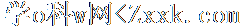
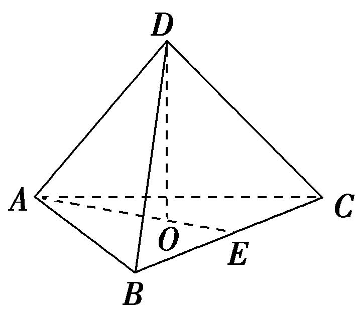
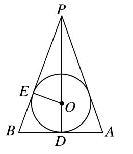
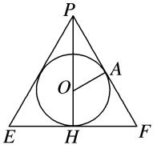

**专题十　内切球模型**

**【方法总结】**

以三棱锥*P*－*ABC*为例，求其内切球的半径．

方法：等体积法，三棱锥*P*－*ABC*体积等于内切球球心与四个面构成的四个三棱锥的体积之和；

第一步：先求出四个表面的面积和整个锥体体积；

第二步：设内切球的半径为<em>r</em>，球心为<em>O</em>，建立等式：<em>VP</em>－<em>ABC</em>＝<em>VO</em>－<em>ABC</em>＋<em>VO</em>－<em>PAB</em>＋<em>VO</em>－<em>PAC</em>＋<em>VO</em>－<em>PBC</em>⇒<em>VP</em>－<em>ABC</em>＝<em>S</em>△<em>ABC</em>·<em>r</em>＋<em>S</em>△<em>PAB</em>·<em>r</em>＋<em>S</em>△<em>PAC</em>·<em>r</em>＋<em>S</em>△<em>PBC</em>·<em>r</em>＝(<em>S</em>△<em>ABC</em>＋<em>S</em>△<em>PAB</em>＋<em>S</em>△<em>PAC</em>＋<em>S</em>△<em>PBC</em>)·<em>r</em>；

第三步：解出*r*＝＝．

秒杀公式<strong>(</strong>万能公式<strong>)：</strong><em>r</em>＝

**【例题选讲】**

**[例]**　(1)已知一个三棱锥的所有棱长均为，则该三棱锥的内切球的体积为\_\_\_\_\_\_\_\_．

答案　π　解析　由题意可知，该三棱锥为正四面体，如图所示．<em>AE</em>＝<em>AB</em>·sin 60°＝，<em>AO</em>＝<em>AE</em>＝，<em>DO</em>＝＝，三棱锥的体积<em>VD</em>­<em>ABC</em>＝<em>S</em>△<em>ABC</em>·<em>DO</em>＝，设内切球的半径为<em>r</em>，则<em>VD</em>­<em>ABC</em>＝<em>r</em>(<em>S</em>△<em>ABC</em>＋<em>S</em>△<em>ABD</em>＋<em>S</em>△<em>BCD</em>＋<em>S</em>△<em>ACD</em>)＝，<em>r</em>＝，<em>V</em>内切球＝π<em>r</em>3＝π．

(2)(2020·全国Ⅲ)已知圆锥的底面半径为1，母线长为3，则该圆锥内半径最大的球的体积为\_\_\_\_\_\_\_\_．

答案　π　解析　圆锥内半径最大的球即为圆锥的内切球，设其半径为<em>r</em>．作出圆锥的轴截面<em>PAB</em>，如图所示，则△<em>PAB</em>的内切圆为圆锥的内切球的大圆．在△<em>PAB</em>中，<em>PA</em>＝<em>PB</em>＝3，<em>D</em>为<em>AB</em>的中点，<em>AB</em>＝2，<em>E</em>为切点，则<em>PD</em>＝2，△<em>PEO</em>∽△<em>PDB</em>，故＝，即＝，解得<em>r</em>＝，故内切球的体积为π3＝π．

(3)阿基米德(公元前287年～公元前212年)是古希腊伟大的哲学家、数学家和物理学家，他和高斯、牛顿并列被称为世界三大数学家．据说，他自己觉得最为满意的一个数学发现就是“圆柱内切球体的体积是圆柱体积的三分之二，并且球的表面积也是圆柱表面积的三分之二”．他特别喜欢这个结论．要求后人在他的墓碑上刻着一个圆柱容器里放了一个球，如图，该球顶天立地，四周碰边．若表面积为54π的圆柱的底面直径与高都等于球的直径，则该球的体积为(　　)

A．4π　　　　　　　　B．16π　　　　　　　　C．36π　　　　　　　　D．

答案　C　解析　设该圆柱的底面半径为<em>R</em>，则圆柱的高为2<em>R</em>，则圆柱的表面积<em>S</em>＝<em>S</em>底＋<em>S</em>侧＝2×π<em>R</em>2＋2·π·<em>R</em>·2<em>R</em>＝54π，解得<em>R</em>2＝9，即<em>R</em>＝3．∴圆柱的体积为<em>V</em>＝π<em>R</em>2×2<em>R</em>＝54π，∴该圆柱的内切球的体积为×54π＝36π．故选C．

(4)已知三棱锥*P*－*ABC*的三条侧棱*PA*，*PB*，*PC*两两互相垂直，且*PA*＝*PB*＝*PC*＝2，则三棱锥*P*－*ABC*的外接球与内切球的半径比为\_\_\_\_\_\_\_\_．

答案　　解析　以<em>PA</em>，<em>PB</em>，<em>PC</em>为过同一顶点的三条棱，作长方体，由<em>PA</em>＝<em>PB</em>＝<em>PC</em>＝2，可知此长方体即为正方体．设外接球的半径为<em>R</em>，则<em>R</em>＝＝，设内切球的半径为<em>r</em>，则内切球的球心到四个面的距离均为<em>r</em>，由(<em>S</em>△<em>ACP</em>＋<em>S</em>△<em>APB</em>＋<em>S</em>△<em>PCB</em>＋<em>S</em>△<em>ABC</em>)·<em>r</em>＝·<em>S</em>△<em>PCB</em>·<em>AP</em>，解得<em>r</em>＝，所以＝＝．

(5)正四面体的外接球和内切球上各有一个动点、，若线段长度的最大值为，则这个四面体的棱长为\_\_\_\_\_\_\_\_．

答案　4　解析　设这个四面体的棱长为，则它的外接球与内切球的球心重合，且半径，，依题意得，．

**【对点训练】**

1．若一个正四面体的表面积为<em>S</em>1，其内切球的表面积为<em>S</em>2，则＝\_\_\_\_\_\_\_\_.

1．答案　解析　设正四面体棱长为<em>a</em>，则正四面体表面积为<em>S</em>1＝4×·<em>a</em>2＝<em>a</em>2，其内切球半径为正

四面体高的，即<em>r</em>＝×<em>a</em>＝<em>a</em>，因此内切球表面积为<em>S</em>2＝4π<em>r</em>2＝，则＝＝.

2．已知一个平放的各棱长为4的三棱锥内有一个小球*O*(重量忽略不计)，现从该三棱锥顶端向内注水，

小球慢慢上浮，当注入的水的体积是该三棱锥体积的时，小球与该三棱锥各侧面均相切(与水面也相切)，则小球的表面积等于(　　)

A．　　　　　　　　B．　　　　　　　　C．　　　　　　　　D．

2．答案　C　解析　当注入水的体积是该三棱锥体积的时，设水面上方的小三棱锥的棱长为*x*(各棱长都

相等)，依题意，＝，得<em>x</em>＝2．易得小三棱锥的高为，设小球半径为<em>r</em>，则<em>S</em>底面·＝4··<em>S</em>底面·<em>r</em>，得<em>r</em>＝，故小球的表面积<em>S</em>＝4π<em>r</em>2＝．故选C．

3．已知四棱锥*P*－*ABCD*的底面*ABCD*是边长为6的正方形，且*PA*＝*PB*＝*PC*＝*PD*，若一个半径为1的

球与此四棱锥所有面都相切，则该四棱锥的高是(　　)

A．6　　　　　　　　B．5　　　　　　　　C．　　　　　　　　D．

3．答案　D　解析　由题意知，四棱锥*P*－*ABCD*是正四棱锥，球的球心*O*在四棱锥的高*PH*上，过正

四棱锥的高作组合体的轴截面如图：

其中*PE*，*PF*是斜高，*A*为球面与侧面的切点．设*PH*＝*h*，易知Rt△*PAO*∽Rt△*PHF*，所以＝，即＝，解得*h*＝，故选D．

4．将半径为3，圆心角为的扇形围成一个圆锥，则该圆锥的内切球的表面积为(　　)

A．π　　　　　　　　B．2π　　　　　　　　C．3π　　　　　　　　D．4π

4．答案　B　解析　将半径为3，圆心角为的扇形围成一个圆锥，设圆锥的底面圆的半径为*R*，则有2π*R*

＝3×，所以<em>R</em>＝1，设圆锥的内切球的半径为<em>r</em>，结合圆锥和球的特征，可知内切球球心必在圆锥的高线上，设圆锥的高为<em>h</em>，因为圆锥的母线长为3，所以<em>h</em>＝＝2，所以＝，解得<em>r</em>＝，因此内切球的表面积<em>S</em>＝4π<em>r</em>2＝2π．故选B．

5．体积为的球与正三棱柱的所有面均相切，则该棱柱的体积为\_\_\_\_\_\_\_\_.

5．答案　6　解析　设球的半径为<em>R</em>，由<em>R</em>3＝，得<em>R</em>＝1，所以正三棱柱的高<em>h</em>＝2，设底面边长为

<em>a</em>，则×<em>a</em>＝1，所以<em>a</em>＝2．所以<em>V</em>＝×(2)2×2＝6．

6．在四棱锥*P*－*ABCD*中，四边形*ABCD*是边长为2*a*的正方形，*PD*⊥底面*ABCD*，且*PD*＝2*a*，若在这

个四棱锥内放一个球，则该球半径的最大值为\_\_\_\_\_\_\_\_．

6．答案　(2－)*a*　解析　解法一：由题意知，球内切于四棱锥*P*－*ABCD*时半径最大，设该四棱锥的

内切球的球心为<em>O</em>，半径为<em>r</em>，连接<em>OA</em>，<em>OB</em>，<em>OC</em>，<em>OD</em>，<em>OP</em>，则<em>VP</em>－<em>ABCD</em>＝<em>VO</em>－<em>ABCD</em>＋<em>VO</em>－<em>PAD</em>＋<em>VO</em>－<em>PAB</em>＋<em>VO</em>－<em>PBC</em>＋<em>VO</em>－<em>PCD</em>，即×2<em>a</em>×2<em>a</em>×2<em>a</em>＝××<em>r</em>，解得<em>r</em>＝(2－)<em>a</em>．

解法二：易知当球内切于四棱锥*P*－*ABCD*，即与四棱锥*P*－*ABCD*各个面均相切时，球的半径最大，作出相切时的侧视图如图所示，设四棱锥*P*－*ABCD*内切球的半径为*r*，则

×2*a*×2*a*＝×(2*a*＋2*a*＋2*a*)×*r*，解得*r*＝(2－)*a*．

7．一个棱长为6的正四面体内部有一个任意旋转的正方体，当正方体的棱长取得最大值时，正方体的外接球的表面积是

A．　　　　　　　　B．　　　　　　　　C．　　　　　　　　D．

7．答案　B　解析　正方体可以在正四面体纸盒内任意转动，正方体在正四面体的内切球中，正方

体棱长最大时，正方体的对角线是内切球的直径，点为内切球的圆心，连接并延长交底面与点，点是底面三角形的中心，底面，为内切球的半径，连接，则，在中，，，在中，，代入数据得，令正方体棱长为，则，解得，正方体棱长的最大值为，此时正方体的外接球半径：．当正方体的棱长取得最大值时，正方体的外接球的表面积是：．

8．在《九章算术》中，将底面为长方形且有一条侧棱与底面垂直的四棱锥称之为阳马．若四棱锥

为阳马，侧棱底面，且，则该阳马的外接球与内切球表面积之和为\_\_\_\_\_\_\_\_．

8．答案　36π－16π　解析　因为侧棱底面，且底面为长方形，所以内切球在侧面

内的正视图为的内切圆，设的半径为，根据圆的切线长定理得，所以内切球的半径为；设该阳马的外接球半径为，易知该阳马补形所得的正方体的对角线为其外接球的直径，所以，所以该阳马的外接球与内切球表面积之和为．

9．在三棱锥中，，，，二面角、、的大

小均为，设三棱锥的外接球球心为，直线交平面于点，则三棱锥的内切球半径为\_\_\_\_\_\_\_\_．\_\_\_\_\_\_\_\_．

9．答案　　　解析　如图，二面角、、的大小相等，在

底面射影为底面三角形的内心，设为，，，，，可得是以角为直角的直角三角形．过作，连接，则为三角形内切圆的半径，且为二面角的平面角为．由等面积法求得：，得，可得三边上的斜高相等为．设三棱锥的内切球半径为，则，得；如图，设是的中点，则是三角形的外心，三棱锥的外接球球心为，则平面，则，，，共线，在直角三角形中，分别以，所在直线为，轴建立平面直角坐标系，由，，得．设三棱锥的外接球的半径为，即，若与在平面的同侧，由直角梯形与直角三角形得：，无解；若与在平面的异侧，则，解得，此时．，则．

10．已知直三棱柱中，，，设二面角的平面角为，且

，现在该三棱柱的内部空间放一个小球，设小球的表面积为，三棱柱的外接球的表面积为，则的最大值为\_\_\_\_\_\_\_\_．

10．答案　　解析　取中点为，连接，，，容易得出，则

，因为，所以，则二面角的平面角为，在直角三角形中，，，，直三棱柱的外接球的球心在矩形的中心，则，由于的值为定值，则取最大值，即小球的半径最大，的内切圆的半径，则小球的半径最大为，，

