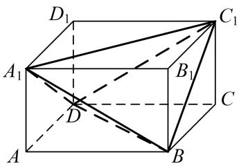

# 专题二 对棱相等模型

# 【方法总结】

对棱相等模型是三棱锥的三组对棱长分别相等模型，用构造法(构造长方体)解决．外接球的直径等于长方体的体对角线长，即 $2R=\sqrt{a^{2}+b^{2}+c^{2}}$ （长方体的长、宽、高分别为a、b、c).秒杀公式： $R^{2}=\frac{x^{2}+y^{2}+z^{2}}{8}$ （三棱锥的三组对棱长分别为x、y、z).可求出球的半径从而解决问题.

text_image

D₁
A₁
B₁
C₁
D
C
A
B

# 【例题选讲】

[例] (1)正四面体的各条棱长都为 $\sqrt{2}$ ，则该正面体外接球的体积为 \_\_\_\_.

(2)在三棱锥 A-BCD 中，AB=CD=2，AD=BC=3，AC=BD=4，则三棱锥 A-BCD 外接球的表面积为 \_\_\_\_。

(3)在三棱锥 A-BCD 中，AB=CD=6，AC=BD=AD=BC=5，则该三棱锥的外接球的体积为 \_\_\_\_。

(4)在正四面体 A-BCD 中，E 是棱 AD 的中点，P 是棱 AC 上一动点， $BP+PE$ 的最小值为 $\sqrt{7}$ ，则该正四面体的外接球的体积是（）

A. $\sqrt{6}\pi$

B. $6\pi$

C. $\frac{3\sqrt{6}}{32}\pi$

D. $\frac{3}{2}\pi$

(5)已知三棱锥 A-BCD，三组对棱两两相等，且 AB=CD=1， $AB=BC=\sqrt{3}$ ，若三棱锥 A-BCD 的外接球表面积为 $\frac{9\pi}{2}$ 。则 AC= \_\_\_\_.

# 【对点训练】

1. 已知正四面体 $ABCD$ 的外接球的体积为 $8\sqrt{6}\pi$ ，则这个四面体的表面积为 \_\_\_\_.

2. 表面积为 $8 \sqrt{3}$ 的正四面体的外接球的表面积为（ ）

A. $4 \sqrt{3} \pi$

B. $12\pi$

C. $8\pi$

D. $4 \sqrt{6} \pi$

3. 已知四面体 $ABCD$ 满足 $AB = CD = \sqrt{6}$ , $AC = AD = BC = BD = 2$ , 则四面体 $ABCD$ 的外接球的表面积是 \_\_\_\_.

4. 三棱锥中 $S - ABC, SA = BC = \sqrt{13}, SB = AC = \sqrt{5}, SC = AB = \sqrt{10}$ . 则三棱锥的外接球的表面积为 \_\_\_\_.

5. 已知一个四面体 ABCD 的每个顶点都在表面积为 $9\pi$ 的球 O 的表面上，且 AB = CD = a，AC = AD = BC = BD = $\sqrt{5}$ ，则 a = \_\_\_\_.

6. 正四面体 $ABCD$ 中, $E$ 是棱 $AD$ 的中点, $P$ 是棱 $AC$ 上一动点, $BP + PE$ 的最小值为 $\sqrt{14}$ , 则该正四面体的外接球表面积是 ( )

A. $12\pi$

B. $32\pi$

C. $8\pi$

D. $24\pi$

