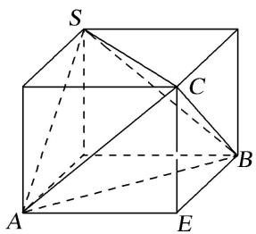

# 专题二 对棱相等模型

# 【方法总结】

对棱相等模型是三棱锥的三组对棱长分别相等模型，用构造法(构造长方体)解决．外接球的直径等于长方体的体对角线长，即 $2R=\sqrt{a^{2}+b^{2}+c^{2}}$ （长方体的长、宽、高分别为a、b、c).秒杀公式： $R^{2}=\frac{x^{2}+y^{2}+z^{2}}{8}$ （三棱锥的三组对棱长分别为x、y、z).可求出球的半径从而解决问题.

# 【例题选讲】

[例] （1）正四面体的各条棱长都为 $\sqrt{2}$ ，则该正面体外接球的体积为 \_\_\_\_.
答案 $\frac{\sqrt{3}}{2}\pi$ 解析这是特殊情况，但也是对棱相等的模式，放入长方体中， $2R = \sqrt{3}$ ， $R = \frac{\sqrt{3}}{2}$ $V = \frac{4}{3}\pi \cdot \frac{3\sqrt{3}}{8} = \frac{\sqrt{3}}{2}\pi .$  
（2）在三棱锥 A-BCD 中，AB=CD=2，AD=BC=3，AC=BD=4，则三棱锥 A-BCD 外接球的表面积为 \_\_\_\_.
答案 $\frac{29}{2}\pi$ 解析 构造长方体, 三个长度为三对面的对角线长, 设长宽高分别为 $a, b, c$ , 则 $a^2 + b^2 = 9$ , $b^2 + c^2 = 4$ , $c^2 + a^2 = 16$ . $\therefore 2(a^2 + b^2 + c^2) = 9 + 4 + 16 = 29$ , $2(a^2 + b^2 + c^2) = 9 + 4 + 16 = 29$ , $a^2 + b^2 + c^2 = \frac{29}{2}$ , $4R^2 = \frac{29}{2}$ , $S = \frac{29}{2}\pi$ .  
（3）在三棱锥 A-BCD 中，AB=CD=6，AC=BD=AD=BC=5，则该三棱锥的外接球的体积为 \_\_\_\_。
答案 $\frac{43\sqrt{43}\pi}{6}$ 解析 依题意得，该三棱锥的三组对棱分别相等，因此可将该三棱锥补形成一个长方体，设该长方体的长、宽、高分别为 $a$ 、 $b$ 、 $c$ ，且其外接球的半径为 $R$ ，则 $\left\{ \begin{array}{l} a^2 + b^2 = 6^2, \\ b^2 + c^2 = 5^2, \\ c^2 + a^2 = 5^2, \end{array} \right.$ 得 $a^2 + b^2 + c^2 = 43$ ，即 $(2R)^2 = a^2 + b^2 + c^2 = 43$ ，易知 $R = \frac{\sqrt{43}}{2}$ ，即为该三棱锥的外接球的半径，所以该三棱锥的外接球的表面积为 $\frac{4}{3}\pi R^3 = \frac{43\sqrt{43}\pi}{6}$ .  
（4）在正四面体 A-BCD 中，E 是棱 AD 的中点，P 是棱 AC 上一动点， $BP+PE$ 的最小值为 $\sqrt{7}$ ，则该正四面体的外接球的体积是（）

A. $\sqrt{6}\pi$

B. $6\pi$

C. $\frac{3\sqrt{6}}{32}\pi$

D. $\frac{3}{2}\pi$
答案 A 解析 将侧面 $\Delta ABC$ 和 $\Delta ACD$ 展成平面图形，如图所示：设正四面体的棱长为 a，则
$BP + PE$ 的最小值为 $BE = \sqrt{a^2 + \frac{a^2}{4} - 2a \cdot \frac{1}{2} a \cos 120^\circ} = \frac{\sqrt{7}}{2} a = \sqrt{7}$ ， $\therefore a = 2$ 。在正四面体 $A - BCD$ 的边长为

2，外接球的半径 $R = \frac{\sqrt{6}}{4} a = \frac{\sqrt{6}}{2}$ ，外接球的体积 $V = \frac{4}{3}\pi R^3 = \sqrt{6}\pi$ 。  
（5）已知三棱锥 A-BCD，三组对棱两两相等，且 AB=CD=1， $AB=BC=\sqrt{3}$ ，若三棱锥 A-BCD 的外接球表面积为 $\frac{9\pi}{2}$ 。则 AC= \_\_\_\_.
答案 $\sqrt{5}$ 解析 将四面体 $A - BCD$ 放置于长方体中， $\because$ 四面体 $A - BCD$ 的顶点为长方体八个顶点中的四个， $\therefore$ 长方体的外接球就是四面体 $A - BCD$ 的外接球， $\because AB = CD = 1$ ， $AD = BC = \sqrt{3}$ ，且三组对棱两两相等， $\therefore$ 设 $AC = BD = x$ ，得长方体的对角线长为 $\sqrt{\frac{1}{2} [1^2 + (\sqrt{3})^2 + x^2]} = \sqrt{\frac{1}{2} (4 + x^2)}$ ，可得外接球的直径 $2R = \sqrt{\frac{1}{2} (4 + x^2)}$ ，所以 $R = \frac{\sqrt{2(4 + x^2)}}{4}$ ， $\because$ 三棱锥 $A - BCD$ 的外接球表面积为 $\frac{9\pi}{2}$ ， $\therefore 4\pi R^2 = \frac{9\pi}{2}$ ，解得 $R = \frac{3\sqrt{2}}{4}$ ，即 $\frac{\sqrt{2(4 + x^2)}}{4} = \frac{3\sqrt{2}}{4}$ ，解之得 $x = \sqrt{5}$ ，因即 $AC = BD = \sqrt{5}$ .

# 【对点训练】

1. 已知正四面体 $ABCD$ 的外接球的体积为 $8\sqrt{6}\pi$ ，则这个四面体的表面积为 \_\_\_\_.

1. 答案 $16 \sqrt{3}$ 解析 将正四面体 $ABCD$ 放在一个正方体内, 设正方体的棱长为 $a$ , 设正四面体 $ABCD$ 的外接球的半径为 $R$ , 则 $\frac{4}{3} \pi R^3 = 8 \sqrt{6} \pi$ , 解得 $R = \sqrt{6}$ , 因为正四面体 $ABCD$ 的外接球和正方体的外接球是同一个球, 则有 $\sqrt{3} a = 2R = 2\sqrt{6}$ , 所以 $a = 2\sqrt{2}$ . 而正四面体 $ABCD$ 的每条棱长均为正方体的面对角线长, 所以正四面体 $ABCD$ 的棱长为 $\sqrt{2} a = 4$ , 因此, 这个正四面体的表面积为 $4 \times \frac{1}{2} \times 4^2 \times \sin \frac{\pi}{3} = 16 \sqrt{3}$ .

2. 表面积为 $8 \sqrt{3}$ 的正四面体的外接球的表面积为( )

A. $4 \sqrt{3} \pi$

B. $12\pi$

C. $8\pi$

D. $4 \sqrt{6} \pi$

2. 答案 B 解析 表面积为 $8\sqrt{3}$ 的正四面体的棱长为 $2\sqrt{2}$ ，将正四面体补成一个正方体，则正方体的棱长为 2，正方体的对角线长为 $2\sqrt{3}$ ，∵ 正四面体的外接球的直径为正方体的对角线长，∴ 外接球的表面积的值为 $4\pi \cdot (\sqrt{3})^2 = 12\pi$ 。

3. 已知四面体 $ABCD$ 满足 $AB = CD = \sqrt{6}$ , $AC = AD = BC = BD = 2$ , 则四面体 $ABCD$ 的外接球的表面积是 \_\_\_\_.

3. 答案 \(7\pi\) 解析 在四面体 \(ABCD\) 中，取线段 \(CD\) 的中点为 \(E\)，连接 \(AE, BE\)。\$\because AC = AD = BC = BD\$ = 2，\$\therefore AE \perp CD, BE \perp CD\$. 在 Rt△AED 中，\(CD = \sqrt{6}\)，\$\therefore AE = \frac{\sqrt{10}}{2}\$。同理 \(BE = \frac{\sqrt{10}}{2}\)，取 \(AB\) 的中点为 \(F\)，连接 \(EF\)。由 \(AE = BE\)，得 \(EF \perp AB\)。在 Rt△EFA 中，\$\because AF = \frac{1}{2} AB = \frac{\sqrt{6}}{2}\$，\(AE = \frac{\sqrt{10}}{2}\)，\$\therefore EF = 1\)，取 \(EF\) 的

中点为 O，连接 OA，则 $OF=\frac{1}{2}$ 。在 Rt△OFA 中， $OA=\frac{\sqrt{7}}{2}$ 。同理得 OA=OB=OC=OD，∴该四面体的外接球的半径是 $\frac{\sqrt{7}}{2}$ ，∴外接球的表面积是 $7\pi$ 。

4. 三棱锥中 $S - ABC$ , $SA = BC = \sqrt{13}$ , $SB = AC = \sqrt{5}$ , $SC = AB = \sqrt{10}$ . 则三棱锥的外接球的表面积为 \_\_\_\_.

4. 答案 $14\pi$ 解析 如图，在长方体中，设 $AE = a, BE = b, CE = c$ 。则 $SC = AB = \sqrt{a^2 + b^2} = \sqrt{10}, SA = BC = \sqrt{b^2 + c^2} = \sqrt{13}, SB = AC = \sqrt{a^2 + c^2} = \sqrt{5}$ ，从而 $a^2 + b^2 + c^2 = 14 = (2R)^2$ ，可得 $S = 4\pi R^2 = 14\pi$ 。故所求三棱锥的外接球的表面积为 $14\pi$ 。

5. 已知一个四面体 $ABCD$ 的每个顶点都在表面积为 $9\pi$ 的球 $O$ 的表面上，且 $AB = CD = a$ ， $AC = AD = BC = BD = \sqrt{5}$ ，则 $a =$ \_\_\_\_.

5. 答案 $2\sqrt{2}$ 解析 由题意可知，四面体ABCD的对棱都相等，故该四面体可以通过补形补成一个长方体，如图所示。设 $AF = x$ ， $BF = y$ ， $CF = z$ ，则 $\sqrt{x^2 + z^2} = \sqrt{y^2 + z^2} = \sqrt{5}$ ，又 $4\pi \times \left(\frac{\sqrt{x^2 + y^2 + z^2}}{2}\right)^2 = 9\pi$ ，可得 $x = y = 2$ ， $\therefore a = \sqrt{x^2 + y^2} = 2\sqrt{2}$

6. 正四面体 $ABCD$ 中, $E$ 是棱 $AD$ 的中点, $P$ 是棱 $AC$ 上一动点, $BP + PE$ 的最小值为 $\sqrt{14}$ , 则该正四面体的外接球表面积是( )

A. $12\pi$

B. $32\pi$

C. $8\pi$

D. $24\pi$

6. 答案 A 解析 将三角形 ABC 与三角形 ACD 展成平面， $BP + PE$ 的最小值，即为 BE 两点之间连线的距离，则 $BE = \sqrt{14}$ ，设 AB = 2a，则 $\angle BAD = 120^\circ$ ，由余弦定理 $-\frac{1}{2} = \frac{4a^2 + a^2 - 14}{2 \cdot 2a \cdot a}$ ，解得 $a = \sqrt{2}$ ，则正四面体棱长为 $2\sqrt{2}$ ，因为正四面体的外接球半径是棱长的 $\frac{\sqrt{6}}{4}$ 倍，所以，设外接球半径为 R，则 $R = \frac{\sqrt{6}}{4} \cdot 2\sqrt{2} = \sqrt{3}$ ，则表面积 $S = 4\pi R^2 = 4\pi \cdot 3 = 12\pi$ .

