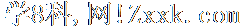
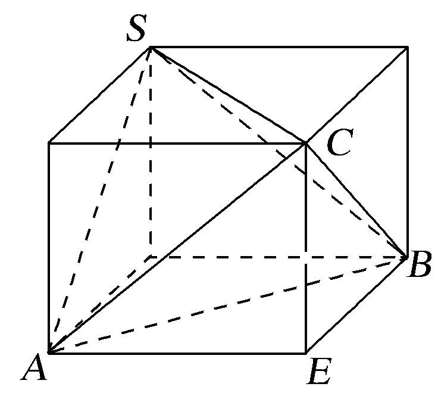

专题二　对棱相等模型

【方法总结】

对棱相等模型是三棱锥的三组对棱长分别相等模型，用构造法(构造长方体)解决．外接球的直径等于长方体的体对角线长，即(长方体的长、宽、高分别为<em>a</em>、<em>b</em>、<em>c</em>)．秒杀公式：<em>R</em>2＝(三棱锥的三组对棱长分别为<em>x</em>、<em>y</em>、<em>z</em>)．可求出球的半径从而解决问题．

【例题选讲】

[例]　（1）正四面体的各条棱长都为，则该正面体外接球的体积为\_\_\_\_\_\_\_\_．

答案　　解析　这是特殊情况，但也是对棱相等的模式，放入长方体中，，，．

  
（2）在三棱锥*A*－*BCD*中，*AB*＝*CD*＝2，*AD*＝*BC*＝3，*AC*＝*BD*＝4，则三棱锥外接球的表面积为\_\_\_\_\_\_\_\_．

答案　　解析　构造长方体，三个长度为三对面的对角线长，设长宽高分别为，则，，，，，，．

  
（3）在三棱锥*A*－*BCD*中，*AB*＝*CD*＝6，*AC*＝*BD*＝*AD*＝*BC*＝5，则该三棱锥的外接球的体积为\_\_\_\_．

答案　　解析　依题意得，该三棱锥的三组对棱分别相等，因此可将该三棱锥补形成一个长方体，设该长方体的长、宽、高分别为<em>a</em>、<em>b</em>、<em>c</em>，且其外接球的半径为<em>R</em>，则得<em>a</em>2＋<em>b</em>2＋<em>c</em>2＝43，即(2<em>R</em>)2＝<em>a</em>2＋<em>b</em>2＋<em>c</em>2＝43，易知，即为该三棱锥的外接球的半径，所以该三棱锥的外接球的表面积为．

  
（4）在正四面体中，是棱的中点，是棱上一动点，的最小值为，则该正四面体的外接球的体积是

A．　　　　　　　　
B．　　　　　　　　
C．　　　　　　　　
D．

答案　A　解析　将侧面和展成平面图形，如图所示：设正四面体的棱长为，则的最小值为，．在正四面体的边长为2，外接球的半径，外接球的体积．

  
（5）已知三棱锥，三组对棱两两相等，且，，若三棱锥的外接球表面积为．则\_\_\_\_\_\_\_\_．

答案　　解析　将四面体放置于长方体中，四面体的顶点为长方体八个顶点中的四个，长方体的外接球就是四面体的外接球，，，且三组对棱两两相等，设，得长方体的对角线长为，可得外接球的直径，所以，三棱锥的外接球表面积为，，解得，即，解之得，因即．

【对点训练】

1．已知正四面体*ABCD*的外接球的体积为8π，则这个四面体的表面积为\_\_\_\_\_\_\_\_．

1．答案　16　解析　将正四面体*ABCD*放在一个正方体内，设正方体的棱长为*a*，设正四面体*ABCD*

的外接球的半径为<em>R</em>，则π<em>R</em>3＝8π，解得<em>R</em>＝，因为正四面体<em>ABCD</em>的外接球和正方体的外接球是同一个球，则有<em>a</em>＝2<em>R</em>＝2，所以<em>a</em>＝2．而正四面体<em>ABCD</em>的每条棱长均为正方体的面对角线长，所以正四面体<em>ABCD</em>的棱长为<em>a</em>＝4，因此，这个正四面体的表面积为4××42×sin＝16．

2．表面积为的正四面体的外接球的表面积为

A．　　　　　　　　
B．　　　　　　　　
C．　　　　　　　　
D．

2．答案　B　解析　表面积为的正四面体的棱长为，将正四面体补成一个正方体，则正方体的棱长为2，正方体的对角线长为，正四面体的外接球的直径为正方体的对角线长，外接球的表面积的值为．

3．已知四面体*ABCD*满足*AB*＝*CD*＝，*AC*＝*AD*＝*BC*＝*BD*＝2，则四面体*ABCD*的外接球的表面积是

\_\_\_\_\_\_\_\_．

3．<strong>答案</strong>　7π　解析　在四面体<em>ABCD</em>中，取线段<em>CD</em>的中点为<em>E</em>，连接<em>AE</em>，<em>BE</em>．∵<em>AC</em>＝<em>AD</em>＝<em>BC</em>＝<em>BD</em>

＝2，∴*AE*⊥*CD*，*BE*⊥*CD*.在Rt△*AED*中，*CD*＝，∴*AE*＝．同理*BE*＝，取*AB*的中点为*F*，连接*EF*．由*AE*＝*BE*，得*EF*⊥*AB*．在Rt△*EFA*中，∵*AF*＝*AB*＝，*AE*＝，∴*EF*＝1，取*EF*的中点为*O*，连接*OA*，则*OF*＝．在Rt△*OFA*中，*OA*＝．同理得*OA*＝*OB*＝*OC*＝*OD*，∴该四面体的外接球的半径是，∴外接球的表面积是7π．

4．三棱锥中*S*－*ABC*，*SA*＝*BC*＝，*SB*＝*AC*＝，*SC*＝*AB*＝．则三棱锥的外接球的表面积为\_\_\_\_\_\_.

4．答案　14π　解析　如图，在长方体中，设*AE*＝*a*，*BE*＝*b*，*CE*＝*c*．则*SC*＝*AB*＝＝，*SA*

＝<em>BC</em>＝＝，<em>SB</em>＝<em>AC</em>＝＝，从而<em>a</em>2＋<em>b</em>2＋<em>c</em>2＝14＝(2<em>R</em>)2，可得<em>S</em>＝4π<em>R</em>2＝14π.故所求三棱锥的外接球的表面积为14π．

5．已知一个四面体*ABCD*的每个顶点都在表面积为9π的球*O*的表面上，且*AB*＝*CD*＝*a*，*AC*＝*AD*＝*BC*

＝*BD*＝，则*a*＝\_\_\_\_\_\_\_\_.

5．答案　2　解析　由题意可知，四面体*ABCD*的对棱都相等，故该四面体可以通过补形补成一个长

方体，如图所示．设<em>AF</em>＝<em>x</em>，<em>BF</em>＝<em>y</em>，<em>CF</em>＝<em>z</em>，则＝＝，又4π×2＝9π，可得<em>x</em>＝<em>y</em>＝2，∴<em>a</em>＝＝2．

6．正四面体中，是棱的中点，是棱上一动点，的最小值为，则该正四面

体的外接球表面积是

A．　　　　　　　　
B．　　　　　　　　
C．　　　　　　　　
D．

6．答案　A　解析　将三角形与三角形展成平面，的最小值，即为两点之间连线

的距离，则，设，则，由余弦定理，解得，则正四面体棱长为，因为正四面体的外接球半径是棱长的倍，所以，设外接球半径为，则，则表面积．

