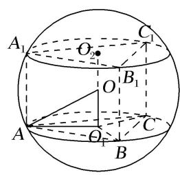
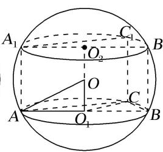
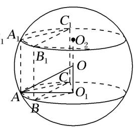
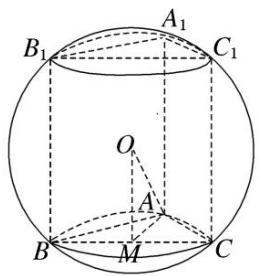
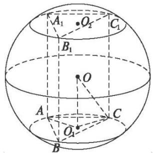

# 专题三 汉堡模型

# 【方法总结】

汉堡模型是直棱柱的外接球、圆柱的外接球模型，用找球心法(多面体的外接球的球心是过多面体的两个面的外心且分别垂直这两个面的直线的交点．一般情况下只作出一个面的垂线，然后设出球心用算术方法或代数方法即可解决问题．有时也作出两条垂线，交点即为球心．)解决．以直三棱柱为例，模型如下图，由对称性可知球心 O 的位置是 $\triangle ABC$ 的外心 $O_{1}$ 与 $\triangle A_{1}B_{1}C_{1}$ 的外心 $O_{2}$ 连线的中点，算出小圆 $O_{1}$ 的半径 $AO_{1}$
$= r, O O _ {1} = \frac {h}{2}, \therefore R ^ {2} = r ^ {2} + \frac {h ^ {2}}{4}.$

# 【例题选讲】

[例] （1）(2013 辽宁)已知直三棱柱 $ABC - A_{1}B_{1}C_{1}$ 的 6 个顶点都在球 $O$ 的球面上．若 $AB = 3$ ， $AC = 4$ ， $AB \perp AC$ ， $AA_{1} = 12$ ，则球 $O$ 的半径为（ ）.

A. $\frac{3\sqrt{17}}{2}$

B. $2 \sqrt{10}$

C. $\frac{13}{2}$

D. $3 \sqrt{10}$

  
（2）设三棱柱的侧棱垂直于底面，所有棱长都为 $a$ ，顶点都在一个球面上，则该球的表面积为( ).

A. $\pi a^{2}$

B. $\frac{7}{3}\pi a^2$

C. $\frac{11}{3}\pi a^{2}$

D. $\frac{3}{7}\pi a^{2}$  
（3）(2009 全国 I) 直三棱柱 $ABC - A_{1}B_{1}C_{1}$ 的各顶点都在同一球面上, 若 $AB = AC = AA_{1} = 2$ , $\angle BAC = 120^{\circ}$ , 则此球的表面积等于 ( ).

A. $10\pi$

B. $20\pi$

C. $30\pi$

D. $40\pi$

  
（4）已知圆柱的高为2，底面半径为 $\sqrt{3}$ ，若该圆柱的两个底面的圆周都在同一个球面上，则这个球的表面积等于（ ）

A. $4\pi$

B. $\frac{16\pi}{3}$

C. $\frac{32\pi}{3}$

D. $16\pi$  
（5）若一个圆柱的表面积为 $12\pi$ ，则该圆柱的外接球的表面积的最小值为（

A. $(12\sqrt{5} - 12)\pi$

B. $12\sqrt{3}\pi$

C. $(12\sqrt{3} + 3)\pi$

D. $16\pi$

# 【对点训练】

1. 一直三棱柱的每条棱长都是2，且每个顶点都在球 $O$ 的表面上，则球 $O$ 的表面积为( )

A. $\frac{28\pi}{3}$

B. $\frac{\sqrt{22}\pi}{3}$

C. $\frac{4\sqrt{3}\pi}{3}$

D. $\sqrt{7}\pi$

2. 一个正六棱柱的底面是正六边形, 其侧棱垂直于底面, 已知该六棱柱的顶点都在同一个球面上, 且该六棱柱的体积为 $\frac{9}{8}$ , 底面周长为 3 , 则这个球的体积为 \_\_\_\_.

3. 已知正三棱柱 $ABC - A_{1}B_{1}C_{1}$ 中，底面积为 $\frac{3\sqrt{3}}{4}$ ，一个侧面的周长为 $6\sqrt{3}$ ，则正三棱柱 $ABC - A_{1}B_{1}C_{1}$ 外接球的表面积为（ ）

A. $4\pi$

B. $8\pi$

C. $16\pi$

D. $32\pi$

4. 已知直三棱柱 $ABC - A_{1}B_{1}C_{1}$ 的6个顶点都在球 $O$ 的球面上，若 $AB = 3$ ， $AC = 1$ ， $\angle BAC = 60^{\circ}$ ， $AA_{1} = 2$ ，则该三棱柱的外接球的体积为（）

A. $\frac{40\pi}{3}$

B. $\frac{40\sqrt{30}\pi}{27}$

C. $\frac{320\sqrt{30}\pi}{27}$

D. $20\pi$

5. 已知矩形 $ABCD$ 中, $AB = 2AD = 2$ , $E$ , $F$ 分别为 $AB$ , $CD$ 的中点, 将四边形 $AEFD$ 沿 $EF$ 折起, 使二面角 $A - EF - C$ 的大小为 $120^{\circ}$ , 则过 $A$ , $B$ , $C$ , $D$ , $E$ , $F$ 六点的球的表面积为( )

A. $6\pi$

B. $5\pi$

C. $4\pi$

D. $3\pi$

6. 已知直三棱柱 $ABC - A_{1}B_{1}C_{1}$ 的 6 个顶点都在球 $O$ 的表面上, 若 $AB = AC = 1$ , $AA_{1} = 2\sqrt{3}$ , $\angle BAC = \frac{2\pi}{3}$ , 则球 $O$ 的体积为 ( )

A. $\frac{32\pi}{3}$

B. $3\pi$

C. $\frac{4\pi}{3}$

D. $8\pi$

7. 有一个圆锥与一个圆柱的底面半径相等, 此圆锥的母线与底面所成角为 $60^{\circ}$ , 若此圆柱的外接球的表面积是圆锥的侧面积的 4 倍, 则此圆柱的高是其底面半径的 ( )

A. $\sqrt{2}$ 倍

B. 2 倍

C. $2\sqrt{2}$ 倍

D. 3 倍

8. 正四棱柱 $ABCD-A_{1}B_{1}C_{1}D_{1}$ 中，AB=2，二面角 $A_{1}-BD-C_{1}$ 的大小为 $\frac{\pi}{3}$ ，则该正四棱柱外接球的表面积为（）

A. $12\pi$

B. $14\pi$

C. $16\pi$

D. $18\pi$

9. 正四棱柱 $ABCD - A_{1}B_{1}C_{1}D_{1}$ 中， $AB = \sqrt{2}$ ， $AA_{1} = 2$ ，设四棱柱的外接球的球心为 $O$ ，动点 $P$ 在正方形 $ABCD$ 的边上，射线 $OP$ 交球 $O$ 的表面点 $M$ ，现点 $P$ 从点 $A$ 出发，沿着 $A \to B \to C \to D \to A$ 运动

一次，则点 M 经过的路径长为 \_\_\_\_.

10. 已知圆柱的上底面圆周经过正三棱锥 $P - ABC$ 的三条侧棱的中点, 下底面圆心为此三棱锥底面中心 $O$ . 若三棱锥 $P - ABC$ 的高为该圆柱外接球半径的 2 倍, 则该三棱锥的外接球与圆柱外接球的半径的比值为 \_\_\_\_.

