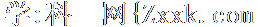
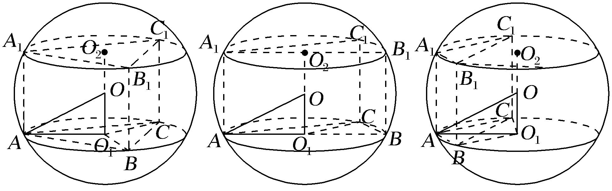
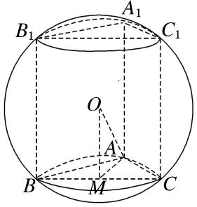
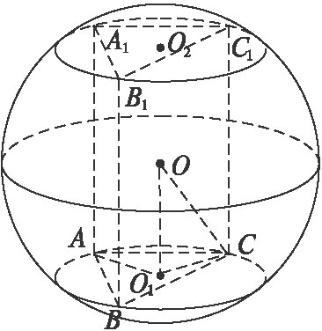
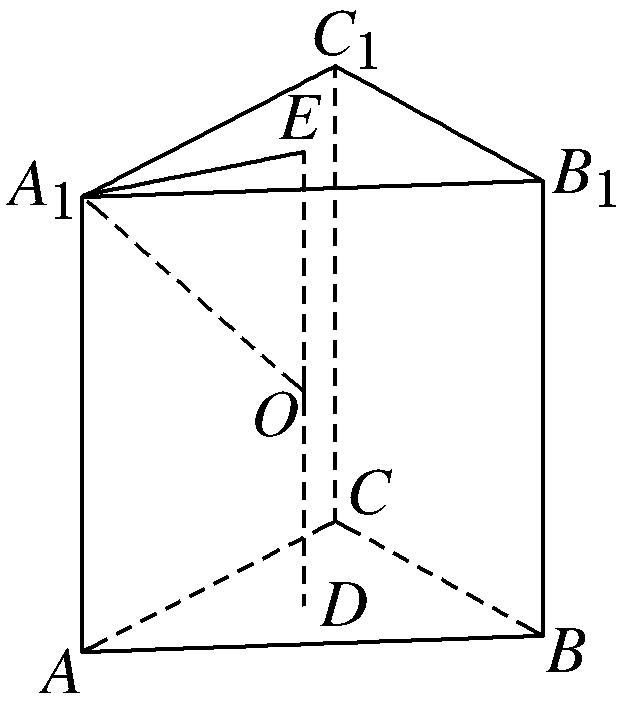
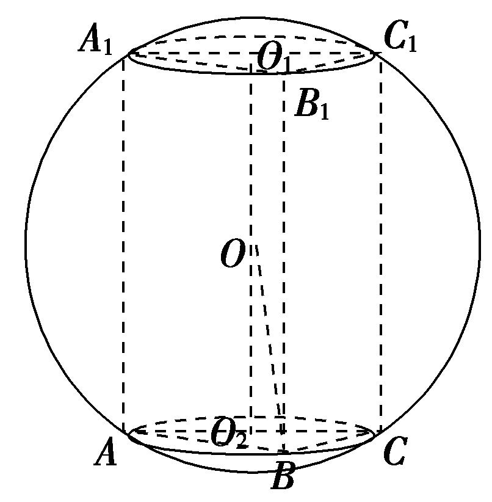
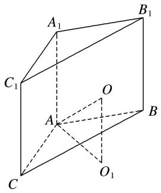

专题三　汉堡模型

【方法总结】

汉堡模型是直棱柱的外接球、圆柱的外接球模型，用找球心法(多面体的外接球的球心是过多面体的两个面的外心且分别垂直这两个面的直线的交点．一般情况下只作出一个面的垂线，然后设出球心用算术方法或代数方法即可解决问题．有时也作出两条垂线，交点即为球心．)解决．以直三棱柱为例，模型如下图，由对称性可知球心<em>O</em>的位置是△<em>ABC</em>的外心<em>O</em>1与△<em>A</em>1<em>B</em>1<em>C</em>1的外心<em>O</em>2连线的中点，算出小圆<em>O</em>1的半径<em>AO</em>1＝<em>r</em>，<em>OO</em>1＝，．

【例题选讲】

<strong>[例]</strong>　（1） (2013辽宁)已知直三棱柱<em>ABC</em>－<em>A</em>1<em>B</em>1<em>C</em>1的6个顶点都在球<em>O</em>的球面上．若<em>AB</em>＝3，<em>AC</em>＝4，<em>AB</em>⊥<em>AC</em>，<em>AA</em>1＝12，则球<em>O</em>的半径为(　　)．

A．　　　　　　　
B．　　　　　　　
C．　　　　　　　
D．

答案　C　解析　如图所示，由球心作平面<em>ABC</em>的垂线，则垂足为<em>BC</em>的中点<em>M</em>．又<em>AM</em>＝<em>BC</em>＝，<em>OM</em>＝<em>AA</em>1＝6，所以球<em>O</em>的半径<em>R</em>＝<em>OA</em>＝＝．

另解　过<em>C</em>点作<em>AB</em>的平行线，过<em>B</em>点作<em>AC</em>的平行线，交点为<em>D</em>，同理过<em>C</em>1作<em>A</em>1<em>B</em>1的平行线，过<em>B</em>1作<em>A</em>1<em>C</em>1的平行线，交点为<em>D</em>1，连接<em>DD</em>1，则<em>ABCD</em>－<em>A</em>1<em>B</em>1<em>C</em>1<em>D</em>1恰好成为球的一个内接长方体，故球的半径<em>r</em>＝．故选C．

  
（2）设三棱柱的侧棱垂直于底面，所有棱长都为，顶点都在一个球面上，则该球的表面积为(　　)．

A．　　　　　 　　
B．　　　　　　　
C．　　　　　　
D．

答案　B　解析　，．故选B．

  
（3）(2009全国Ⅰ)直三棱柱<em>ABC</em>－<em>A</em>1<em>B</em>1<em>C</em>1的各顶点都在同一球面上，若<em>AB</em>＝<em>AC</em>＝<em>AA</em>1＝2，∠<em>BAC</em>＝120°，则此球的表面积等于(　　)．

A．10π　　　　　　　　
B．20π　　　　　　　　
C．30π　　　　　　　　
D．40π

答案　B　解析　如图，先由余弦定理求出<em>BC</em>＝2，再由正弦定理求出<em>r</em>＝<em>AO</em>1＝2，外接球的直径<em>R</em>＝＝，所以该球的表面积为4π<em>R</em>2＝20π．故选B．

  
（4）已知圆柱的高为2，底面半径为，若该圆柱的两个底面的圆周都在同一个球面上，则这个球的表面积等于(　　)

A．4π 　　　　　　　　
B．　　　　　　　　
C．　　　　　　　　
D．16π

答案　D　解析　由题意知圆柱的中心<em>O</em>为这个球的球心，于是，球的半径<em>r</em>＝<em>OB</em>＝＝＝2．故这个球的表面积<em>S</em>＝4π<em>r</em>2＝16π．故选D．

  
（5）若一个圆柱的表面积为，则该圆柱的外接球的表面积的最小值为

A．　　　　　
B．　　　　　
C．　　　　　
D．

答案　A　解析　设圆柱的底面半径为，高为，则，则．设该圆柱的外接球的半径为，则，当且仅当，即时，等号成立．故该圆柱的外接球的表面积的最小值为．

【对点训练】

1．一直三棱柱的每条棱长都是2，且每个顶点都在球*O*的表面上，则球*O*的表面积为(　　)

A．　　　　　　　　　
B．　　　　　　　　
C．　　　　　　　　
D．π

1．答案　A　解析　由题知此直棱柱为正三棱柱<em>ABC</em>－<em>A</em>1<em>B</em>1<em>C</em>1，设其上下底面中心为<em>O</em>′，<em>O</em>1，则外接球

的球心<em>O</em>为线段<em>O</em>′<em>O</em>1的中点，∵<em>AB</em>＝2，∴<em>O</em>′<em>A</em>＝<em>AB</em>＝，<em>OO</em>′＝<em>O</em>′<em>O</em>1＝1，∴<em>OA</em>＝＝，因此，它的外接球的半径为，故球<em>O</em>的表面积为．故选A．

2．一个正六棱柱的底面是正六边形，其侧棱垂直于底面，已知该六棱柱的顶点都在同一个球面上，且该

六棱柱的体积为，底面周长为3，则这个球的体积为\_\_\_\_\_\_\_\_.

2．答案　　解析　设正六棱柱底面边长为*a*，正六棱柱的高为*h*，底面外接圆的半径为*r*，则*a*＝，底

面积为<em>S</em>＝6··＝，<em>V</em>柱＝<em>Sh</em>＝<em>h</em>＝，∴<em>h</em>＝，<em>R</em>2＝＋＝1，<em>R</em>＝1，球的体积为<em>V</em>＝.

3．已知正三棱柱<em>ABC</em>－<em>A</em>1<em>B</em>1<em>C</em>1中，底面积为，一个侧面的周长为6，则正三棱柱<em>ABC</em>－<em>A</em>1<em>B</em>1<em>C</em>1外

接球的表面积为(　　)

A．4π　　　　　　　　
B．8π　　　　　　　　
C．16π　　　　　　　
D．32π

3．答案　C　解析　如图所示，设底面边长为<em>a</em>，则底面面积为<em>a</em>2＝，所以<em>a</em>＝.又一个侧面的

周长为6，所以<em>AA</em>1＝2.设<em>E</em>，<em>D</em>分别为上、下底面的中心，连接<em>DE</em>，设<em>DE</em>的中点为<em>O</em>，则点<em>O</em>即为正三棱柱<em>ABC</em>­<em>A</em>1<em>B</em>1<em>C</em>1的外接球的球心，连接<em>OA</em>1，<em>A</em>1<em>E</em>，则<em>OE</em>＝，<em>A</em>1<em>E</em>＝××＝1.在直角三角形<em>OEA</em>1中，<em>OA</em>1＝＝2，即外接球的半径<em>R</em>＝2，所以外接球的表面积<em>S</em>＝4π<em>R</em>2＝16π，故选C．

4．已知直三棱柱<em>ABC</em>－<em>A</em>1<em>B</em>1<em>C</em>1的6个顶点都在球<em>O</em>的球面上，若<em>AB</em>＝3，<em>AC</em>＝1，∠<em>BAC</em>＝60°，<em>AA</em>1

＝2，则该三棱柱的外接球的体积为(　　)

A．　　　　　　　　
B．　　　　　　　　
C．　　　　　　　　
D．20π

4．答案　B　解析　设△<em>A</em>1<em>B</em>1<em>C</em>1的外心为<em>O</em>1，△<em>ABC</em>的外心为<em>O</em>2，连接<em>O</em>1<em>O</em>2，<em>O</em>2<em>B</em>，<em>OB</em>，如图所示．

由题意可得外接球的球心<em>O</em>为<em>O</em>1<em>O</em>2的中点．在△<em>ABC</em>中，由余弦定理可得<em>BC</em>2＝<em>AB</em>2＋<em>AC</em>2－2<em>AB</em>×<em>AC</em>cos∠<em>BAC</em>＝32＋12－2×3×1×cos 60°＝7，所以<em>BC</em>＝，由正弦定理可得△<em>ABC</em>外接圆的直径2<em>r</em>＝2<em>O</em>2<em>B</em>＝＝，所以<em>r</em>＝＝，而球心<em>O</em>到截面<em>ABC</em>的距离<em>d</em>＝<em>OO</em>2＝<em>AA</em>1＝1，设直三棱柱<em>ABC</em>－<em>A</em>1<em>B</em>1<em>C</em>1的外接球半径为<em>R</em>，由球的截面性质可得<em>R</em>2＝<em>d</em>2＋<em>r</em>2＝12＋2＝，故<em>R</em>＝，所以该三棱柱的外接球的体积为<em>V</em>＝<em>R</em>3＝．故选B．

5．已知矩形*ABCD*中，*AB*＝2*AD*＝2，*E*，*F*分别为*AB*，*CD*的中点，将四边形*AEFD*沿*EF*折起，使二

面角*A*－*EF*－*C*的大小为120°，则过*A*，*B*，*C*，*D*，*E*，*F*六点的球的表面积为(　　)

A．6π　　　　　　　　
B．5π　　　　　　　　
C．4π　　　　　　　　
D．3π

5．答案　B　解析　其中<em>O</em>1，<em>O</em>2分别为正方形<em>AEFD</em>和<em>BCFE</em>的中心，<em>OO</em>1，<em>OO</em>2分别垂直于这两个平

面．由于∠<em>OGO</em>2＝60°，<em>O</em>2<em>G</em>＝，所以<em>OO</em>2＝，而<em>O</em>2<em>C</em>＝<em>CE</em>＝，所以球的半径<em>OC</em>＝＝，所以球的表面积为4π·<em>OC</em>2＝5π．故选B．

6．已知直三棱柱<em>ABC</em>－<em>A</em>1<em>B</em>1<em>C</em>1的6个顶点都在球<em>O</em>的表面上，若<em>AB</em>＝<em>AC</em>＝1，<em>AA</em>1＝2，∠<em>BAC</em>＝，

则球*O*的体积为(　　)

A．　　　　　　　　
B．3π　　　　　　　　
C．　　　　　　　　
D．8π

6．答案　A　解析　设△<em>ABC</em>外接圆圆心为<em>O</em>1，半径为<em>r</em>，连接<em>O</em>1<em>O</em>，如图，易得<em>O</em>1<em>O</em>⊥平面<em>ABC</em>，

∵<em>AB</em>＝<em>AC</em>＝1，<em>AA</em>1＝2，∠<em>BAC</em>＝，∴2<em>r</em>＝＝＝2，即<em>O</em>1<em>A</em>＝1，<em>O</em>1<em>O</em>＝<em>AA</em>1＝，∴<em>OA</em>＝＝＝2，∴球<em>O</em>的体积<em>V</em>＝π·<em>OA</em>3＝．故选A．

7．有一个圆锥与一个圆柱的底面半径相等，此圆锥的母线与底面所成角为，若此圆柱的外接球的表面积是圆锥的侧面积的4倍，则此圆柱的高是其底面半径的

A．倍　　　　　　
B．2倍　　　　　　
C．倍　　　　　　
D．3倍

7．答案　B　解析　设圆柱的高为，底面半径为，圆柱的外接球的半径为．则，圆锥的母线与底面所成角为．圆锥的高为，母线长，圆锥的侧面积为，，化简得：．

8．正四棱柱中，，二面角的大小为，则该正四棱柱外接球的表面

积为

A．　　　　　　　　
B．　　　　　　　　
C．　　　　　　　　
D．

8．答案　B　解析　如图，，交于，易证为二面角的平面角，即

，从而，，，，外接球直径为，外接球半径为，．

9．正四棱柱中，，，设四棱柱的外接球的球心为，动点在正方

形的边上，射线交球的表面点，现点从点出发，沿着运动一次，则点经过的路径长为\_\_\_\_\_\_\_\_．

9．答案　　解析　由题意，点从点出发，沿着运动一次，则点经

过的路径是四段大圆上的相等的弧．正四棱柱中，，，四棱柱的外接球的直径为其对角线，长度为，四棱柱的外接球的半径为，，所在大圆，所对的弧长为，点经过的路径长为．

10．已知圆柱的上底面圆周经过正三棱锥的三条侧棱的中点，下底面圆心为此三棱锥底面中心

．若三棱锥的高为该圆柱外接球半径的2倍，则该三棱锥的外接球与圆柱外接球的半径的比值为\_\_\_\_\_\_\_\_．

10．答案　　解析　设正三棱锥的底面边长为，高为，则圆柱高为，底面圆半径为

，利用勾股定理，可求得圆柱外接球半径．由，可求得．设正三棱锥的外接球的半径为，则球心到底面距离为，，利用勾股定理，可得，故，

