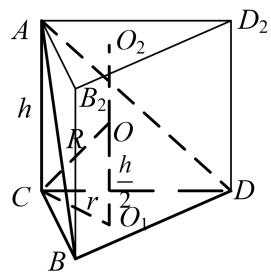
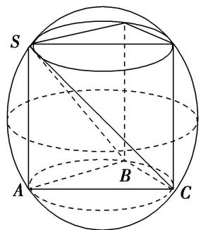
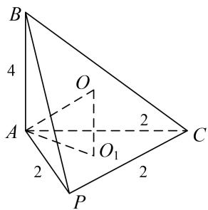
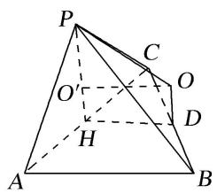
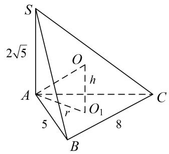
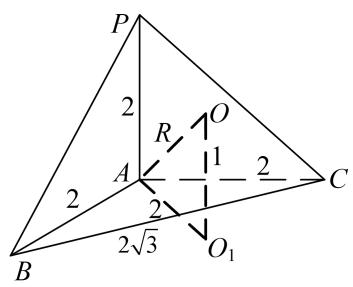
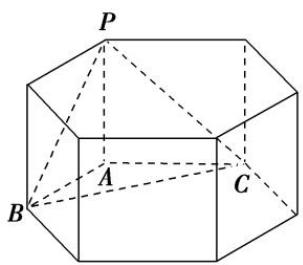
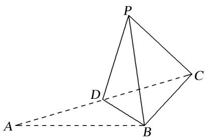
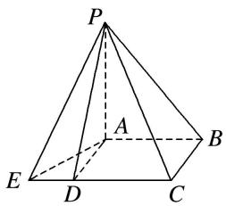

# 专题四 垂面模型

# 【方法总结】

垂面模型是有一条侧棱垂直底面的棱锥模型，可补为直棱柱内接于球，由对称性可知球心 O 的位置是 $\triangle CBD$ 的外心 $O_{1}$ 与 $\triangle AB_{2}D_{2}$ 的外心 $O_{2}$ 连线的中点，算出小圆 $O_{1}$ 的半径 $AO_{1}=r, OO_{1}=\frac{h}{2}, \therefore R^{2}=r^{2}+\frac{h^{2}}{4}$ .

text_image

A
h
R
O
C
r
O₁
B
D

text_image

A
h
B₂
O₂
R
C
r
h/2
O₁
B
D
D₂

# 【例题选讲】

[例] (1)已知在三棱锥 $S - ABC$ 中， $SA \perp$ 平面 $ABC$ ，且 $\angle ACB = 30^{\circ}$ ， $AC = 2AB = 2\sqrt{3}$ ， $SA = 1$ 。则该三棱锥的外接球的体积为（）

A. $\frac{13}{8}\sqrt{13}\pi$

B. $13\pi$

C. $\frac{\sqrt{13}}{6}\pi$

D. $\frac{13\sqrt{13}}{6}\pi$

text_image

S
A
B
C

第(1)小题图

text_image

B
4
O
A
2
O₁
2
C
P

第(2)小题图1

text_image

Geometric diagram of a triangular pyramid with labeled vertices and internal points, used for spatial geometry problems.

第(2)小题图 2

(2)三棱锥 P-ABC 中，平面 $PAC \perp$ 平面 ABC， $AB \perp AC$ ，PA = PC = AC = 2，AB = 4，则三棱锥 P-ABC 的外接球的表面积为()

A. $23\pi$

B. $\frac{23}{4}\pi$

C. $64\pi$

D. $\frac{64}{3}\pi$

(3)在三棱锥 S-ABC 中，侧棱 $SA \perp$ 底面 ABC，AB=5，BC=8， $\angle ABC=60^{\circ}$ ， $SA=2\sqrt{5}$ ，则该三棱锥的外接球的表面积为()

A. $\frac{64}{3}\pi$

B. $\frac{256}{3}\pi$

C. $\frac{436}{3}\pi$

D. $\frac{2048\sqrt{3}}{27}\pi$

(4)在三棱锥 P-ABC 中，已知 $PA \perp$ 底面 ABC， $\angle BAC = 120^{\circ}$ ，PA = AB = AC = 2，若该三棱锥的顶点都在同一个球面上，则该球的表面积为()

A. $10 \sqrt{3} \pi$

B. $18\pi$

C. $20\pi$

D. $9\sqrt{3}\pi$

text_image

S
2√5
O
h
A
r
O₁
C
5
B
8

第(3)小题图

text_image

P
2
R
O
A
1
2
C
2
2√3
B
O₁

第(4)小题图1

text_image

P
A
B
C

第(4)小题图2

(5)在三棱锥 P-ABC 中， $PA \perp$ 平面 ABC， $\angle BAC = 120^{\circ}$ ，AC = 2，AB = 1，设 D 为 BC 中点，且直线 PD 与平面 ABC 所成角的余弦值为 $\frac{\sqrt{5}}{5}$ ，则该三棱锥外接球的表面积为 \_\_\_\_.

# 【对点训练】

1. 三棱锥 $S - ABC$ 中， $SA \perp$ 底面 $ABC$ ，若 $SA = AB = BC = AC = 3$ ，则该三棱锥外接球的表面积为（）

A. $18\pi$

B. $\frac{21\pi}{2}$

C. $21\pi$

D. $42\pi$

2. 四面体 $ABCD$ 的四个顶点都在球 $O$ 的表面上, $AB \perp$ 平面 $BCD$ , $\triangle BCD$ 是边长为 3 的等边三角形, 若 $AB = 2$ , 则球 $O$ 的表面积为 ( )

A. $4\pi$

B. $12\pi$

C. $16\pi$

D. $32\pi$

3. 已知三棱锥 $S - ABC$ 的所有顶点都在球 $O$ 的球面上, $SA \perp$ 平面 $ABC$ , $SA = 2\sqrt{3}$ , $AB = 1$ , $AC = 2$ , $\angle BAC = 60^\circ$ , 则球 $O$ 的表面积为( )

A. $4\pi$

B. $12\pi$

C. $16\pi$

D. $64\pi$

4. 在三棱锥 $P - ABC$ 中，已知 $PA \perp$ 底面 $ABC, \angle BAC = 60^{\circ}, PA = 2, AB = AC = \sqrt{3}$ ，若该三棱锥的顶点都在同一个球面上，则该球的表面积为（）

A. $\frac{4\pi}{3}$

B. $\frac{8\sqrt{2}\pi}{3}$

C. $8\pi$

D. $12\pi$

5. 在三棱锥 $A - BCD$ 中, $AC = CD = \sqrt{2}$ , $AB = AD = BD = BC = 1$ , 若三棱锥的所有顶点, 都在同一球面上, 则球的表面积是 \_\_\_\_.

6. 如图, 在 $\triangle ABC$ 中, $AB = BC = \sqrt{6}$ , $\angle ABC = 90^{\circ}$ , 点 $D$ 为 $AC$ 的中点, 将 $\triangle ABD$ 沿 $BD$ 折起到 $\triangle PBD$ 的位置, 使 $PC = PD$ , 连接 $PC$ , 得到三棱锥 $P - BCD$ , 若该三棱锥的所有顶点都在同一球面上, 则该球的表面积是( )

text_image

P
D
C
A
B

A. $7\pi$

B. $5\pi$

C. $3\pi$

D. $\pi$

7. 已知点 $P, A, B, C, D$ 是球 $O$ 表面上的点， $PA \perp$ 平面 $ABCD$ ，四边形 $ABCD$ 是边长为 $2\sqrt{3}$ 的正方形。若 $PA = 2\sqrt{6}$ ，则 $\triangle OAB$ 的面积为（ ）.

A. $\sqrt{3}$

B. $2 \sqrt{2}$

C. $3\sqrt{3}$

D. $6\sqrt{3}$

8. 三棱锥 $P - ABC$ 中, $AB = BC = \sqrt{15}$ , $AC = 6$ , $PC \perp$ 平面 $ABC$ , $PC = 2$ , 则该三棱锥的外接球表面积为 \_\_\_\_.

9. 中国古代数学经典《九章算术》系统地总结了战国、秦、汉时期的数学成就，书中将底面为长方形且有一条侧棱与底面垂直的四棱锥称之为阳马，将四个面都为直角三角形的三棱锥称之为鳖臑，如图为一个阳马与一个鳖臑的组合体，已知 $PA \perp$ 平面 $ABCE$ ，四边形 $ABCD$ 为正方形， $AD = \sqrt{5}$ ， $ED = \sqrt{3}$ ，若鳖臑 $P - ADE$ 的外接球的体积为 $9\sqrt{2}\pi$ ，则阳马 $P - ABCD$ 的外接球的表面积为 \_\_\_\_.

text_image

P
A
B
E
D
C

10. 在四棱锥 $P - ABCD$ 中， $PA \perp$ 平面 $ABCD$ ， $AP = 2$ ，点 $M$ 是矩形 $ABCD$ 内（含边界）的动点，且 $AB = 1$ ， $AD = 3$ ，直线 $PM$ 与平面 $ABCD$ 所成的角为 $\frac{\pi}{4}$ 。记点 $M$ 的轨迹长度为 $\alpha$ ，则 $\tan \alpha =$ \_\_\_\_；当三棱锥 $P - ABM$ 的体积最小时，三棱锥 $P - ABM$ 的外接球的表面积为 \_\_\_\_。

