# 专题四 垂面模型

# 【方法总结】

垂面模型是有一条侧棱垂直底面的棱锥模型，可补为直棱柱内接于球，由对称性可知球心 O 的位置是 $\triangle CBD$ 的外心 $O_{1}$ 与 $\triangle AB_{2}D_{2}$ 的外心 $O_{2}$ 连线的中点，算出小圆 $O_{1}$ 的半径 $AO_{1}=r, OO_{1}=\frac{h}{2}, \therefore R^{2}=r^{2}+\frac{h^{2}}{4}$ .

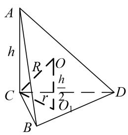

text_image

A
h
R
O
C
r
O₁
B
D

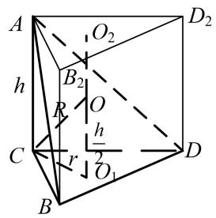

text_image

A
h
B₂
O₂
R
O
C
r
h/2
O₁
D
B
D₂

# 【例题选讲】

[例] (1)已知在三棱锥 $S - ABC$ 中， $SA \perp$ 平面 $ABC$ ，且 $\angle ACB = 30^{\circ}$ ， $AC = 2AB = 2\sqrt{3}$ ， $SA = 1$ 。则该三棱锥的外接球的体积为（）

A. $\frac{13}{8}\sqrt{13}\pi$

B. $13\pi$

C. $\frac{\sqrt{13}}{6}\pi$

D. $\frac{13\sqrt{13}}{6}\pi$

答案 D 解析 $\because \angle ACB = 30^{\circ}, AC = 2AB = 2\sqrt{3}, \therefore \triangle ABC$ 是以 $AC$ 为斜边的直角三角形，其外接圆半径 $r = \frac{AC}{2} = \sqrt{3}$ ，则三棱锥外接球即为以 $\triangle ABC$ 为底面，以 $SA$ 为高的三棱柱的外接球， $\therefore$ 三棱锥外接球的半径 $R$ 满足 $R = \sqrt{r^{2} + \left(\frac{SA}{2}\right)^{2}} = \frac{\sqrt{13}}{2}$ ，故三棱锥外接球的体积 $V = \frac{4}{3}\pi R^{3} = \frac{13\sqrt{13}}{6}\pi$ 。故选 D.

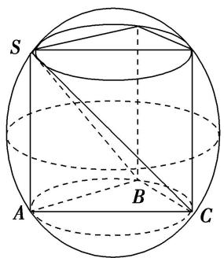

text_image

S
A
B
C

第(1)小题图

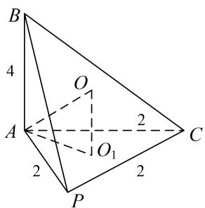

text_image

B
4
O
A
2
O₁
2
C
P

第(2)小题图1

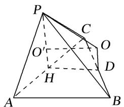

text_image

P
C
O
O
D
H
A
B

第(2)小题图 2

(2)三棱锥 P-ABC 中，平面 $PAC \perp$ 平面 ABC， $AB \perp AC$ ，PA = PC = AC = 2，AB = 4，则三棱锥 P-ABC 的外接球的表面积为()

A. $23\pi$

B. $\frac{23}{4}\pi$

C. $64\pi$

D. $\frac{64}{3}\pi$

答案 D 解析 如图 1, 设 O 为三棱锥外接球的球心, $O_{1}$ 为正 $\triangle PAC$ 的中心, 则 $OO_{1}=\frac{1}{2}AB=2.2AO_{1}=\frac{2}{\sin\frac{\pi}{3}}=\frac{4\sqrt{3}}{3}$ , $AO_{1}=\frac{2\sqrt{3}}{3}$ , $R^{2}=OA^{2}=O_{1}A^{2}+O_{1}O^{2}=\frac{4}{3}+4=\frac{16}{3}$ , 故几何体外接球的表面积 $S=4\pi R^{2}=\frac{64}{3}\pi$ .

另解：如图2，设 $O'$ 为正 $\triangle PAC$ 的中心， $D$ 为 Rt $\triangle ABC$ 斜边的中点， $H$ 为 $AC$ 中点．由平面 $PAC \perp$ 平面 $ABC$ ，则 $O'H \perp$ 平面 $ABC$ ．作 $O'O \parallel HD, OD \parallel O'H$ ，则交点 $O$ 为三棱锥外接球的球心，连接 $OP$ ，又 $O'P$

$= \frac{2}{3} PH = \frac{2}{3}\times \frac{\sqrt{3}}{2}\times 2 = \frac{2\sqrt{3}}{3}, OO' = DH = \frac{1}{2} AB = 2.\therefore R^2 = OP^2 = O'P^2 +O'O^2 = \frac{4}{3} +4 = \frac{16}{3}.$ 故几何体外接球的表面积 $S = 4\pi R^2 = \frac{64}{3}\pi .$

(3)在三棱锥 S-ABC 中，侧棱 $SA \perp$ 底面 ABC，AB=5，BC=8， $\angle ABC=60^{\circ}$ ， $SA=2\sqrt{5}$ ，则该三棱锥的外接球的表面积为()

A. $\frac{64}{3}\pi$

B. $\frac{256}{3}\pi$

C. $\frac{436}{3}\pi$

D. $\frac{2048\sqrt{3}}{27}\pi$

答案 B 解析 由题意知， $AB=5,\ BC=8,\ \angle ABC=60^{\circ}$ ，则在 $\triangle ABC$ 中，由余弦定理得 $AC^{2}=AB^{2}+BC^{2}-2\times AB\times BC\times\cos\angle ABC$ ，解得AC=7，设 $\triangle ABC$ 的外接圆半径为r，则 $\triangle ABC$ 的外接圆直径 $2r=\frac{AC}{\sin\angle ABC}=\frac{7}{\frac{\sqrt{3}}{2}},\ \therefore r=\frac{7}{\sqrt{3}}$ ，又∵侧棱SA⊥底面ABC，∴三棱锥的外接球的球心到平面ABC的距离 $h=\frac{1}{2}SA=\sqrt{5}$ ，则外接球的半径 $R=\sqrt{\left(\frac{7}{\sqrt{3}}\right)^{2}+(\sqrt{5})^{2}}=\sqrt{\frac{64}{3}}$ ，则该三棱锥的外接球的表面积为 $S=4\pi R^{2}=\frac{256}{3}\pi.$

(4)在三棱锥 P-ABC 中，已知 $PA \perp$ 底面 ABC， $\angle BAC = 120^{\circ}$ ，PA = AB = AC = 2，若该三棱锥的顶点都在同一个球面上，则该球的表面积为()

A. $10\sqrt{3}\pi$

B. $18\pi$

C. $20\pi$

D. $9\sqrt{3}\pi$

答案 C 解析 如图 1，先由余弦定理求出 $BC=2\sqrt{3}$ ，再由正弦定理求出 $r=AO_{1}=2$ ，外接球的直径 $R=\sqrt{1^{2}+2^{2}}=\sqrt{5}$ ，所以该球的表面积为 $4\pi R^{2}=20\pi$ .

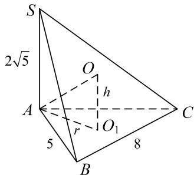

text_image

S
2√5
O
h
A
r
O₁
C
5
B
8

第(3)小题图

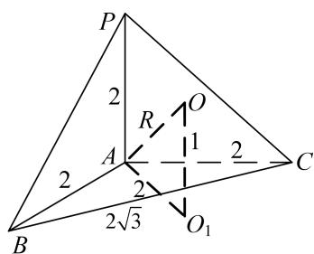

text_image

P
2
R
O
A
1
2
C
2
2√3
B
O₁

第(4)小题图1

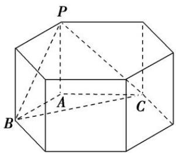

text_image

P
A
B
C

第(4)小题图2

另解 如图2，该三棱锥为图中正六棱柱内的三棱锥 $P - ABC$ ， $PA = AB = AC = 2$ ，所以该三棱锥的外接球即该六棱柱的外接球，所以外接球的直径 $2R = \sqrt{4^2 + 2^2} = 2\sqrt{5} \Rightarrow R = \sqrt{5}$ ，所以该球的表面积为 $4\pi R^2 = 20\pi$

(5)在三棱锥 P-ABC 中， $PA \perp$ 平面 ABC， $\angle BAC = 120^{\circ}$ ，AC = 2，AB = 1，设 D 为 BC 中点，且直线 PD 与平面 ABC 所成角的余弦值为 $\frac{\sqrt{5}}{5}$ ，则该三棱锥外接球的表面积为 \_\_\_\_.

答案 $\frac{37}{3}\pi$ 解析 在 $\Delta ABC$ 中， $\angle BAC = 120^{\circ}$ ， $AC = 2$ ， $AB = 1$ ，由余弦定理得： $BC^{2} = AC^{2} + AB^{2} - 2AC \cdot BC \cdot \cos \angle BAC$ ，即 $BC^{2} = 2^{2} + 1^{2} - 2 \times 2 \times 1 \times \cos 120^{\circ} = 7$ ，解得： $BC = \sqrt{7}$ 。设 $\Delta ABC$ 的外接圆半径为 $r$ ，由正弦定理得 $2r = \frac{BC}{\sin \angle BAC} = \frac{\sqrt{7}}{\sin 120^{\circ}} = \frac{2\sqrt{7}}{\sqrt{3}}$ 解得： $r = \frac{\sqrt{7}}{\sqrt{3}} = \frac{\sqrt{21}}{3}$ ；且 $\cos \angle ABC = \frac{AB^{2} + BC^{2} - AC^{2}}{2AB \cdot BC} = \frac{1^{2} + (\sqrt{7})^{2} - 2^{2}}{2 \times 1 \times \sqrt{7}} = \frac{2\sqrt{7}}{7}$ ，又 $D$ 为 $BC$ 中点，在 $\Delta ABD$ 中， $BD = \frac{1}{2} BC = \frac{\sqrt{7}}{2}$ ， $AB = 1$ ， $\cos \angle ABD = \frac{2\sqrt{7}}{7}$ 。由

余弦定理得： $AD^{2} = AB^{2} + BD^{2} - 2AB\cdot BD\cos \angle ABD$ ，即： $AD^{2} = 1^{2} + (\frac{\sqrt{7}}{2})^{2} - 2\times 1\times \frac{\sqrt{7}}{2}\times \frac{2\sqrt{7}}{7} = \frac{3}{4}$ ，解得 $AD = \frac{\sqrt{3}}{2}$ .又因为 $PA\bot$ 平面ABC，所以∠PDA为直线PD与平面ABC所成角，由 $\cos \angle PDA = \frac{\sqrt{5}}{5}$ ，得 $\sin \angle PDA = \frac{2\sqrt{5}}{5}$ ， $\tan \angle PDA = 2$ ，所以在Rt△PAD中， $PA = AD\cdot \tan \angle PDA = \frac{\sqrt{3}}{2}\cdot 2 = \sqrt{3}$ .设三棱锥 $P - ABC$ 的外接球半径为 $R$ ，所以 $R = \sqrt{\left(\frac{PA}{2}\right)^2 + r^2} = \sqrt{\left(\frac{\sqrt{3}}{2}\right)^2 + \left(\frac{\sqrt{21}}{3}\right)^2} = \sqrt{\frac{37}{12}}$ ，三棱锥 $P - ABC$ 外接球表面积为 $S = 4\pi R^2 = \frac{37}{3}\pi .$

# 【对点训练】

1. 三棱锥 $S - ABC$ 中， $SA \perp$ 底面 $ABC$ ，若 $SA = AB = BC = AC = 3$ ，则该三棱锥外接球的表面积为（）

A. $18\pi$

B. $\frac{21\pi}{2}$

C. $21\pi$

D. $42\pi$

1. 答案 C 解析 由于 $AB = BC = AC = 3$ ，则 $\triangle ABC$ 是边长为 3 的等边三角形，由正弦定理知， $\triangle ABC$ 的外接圆的直径为 $2r = \frac{3}{\sin\frac{\pi}{3}} = 2\sqrt{3}$ ，由于 $SA \perp$ 底面 $ABC$ ，所以 $\triangle ABC$ 外接圆的过圆心的垂线与线段 $SA$ 中垂面的交点为该三棱锥的外接球的球心，所以外接球的半径 $R = \sqrt{\left(\frac{SA}{2}\right)^2 + r^2} = \frac{\sqrt{21}}{2}$ ，因此，三棱锥 $S - ABC$ 的外接球的表面积为 $4\pi R^2 = 4\pi \times \frac{21}{4} = 21\pi$ 。故选 C.

2. 四面体 $ABCD$ 的四个顶点都在球 $O$ 的表面上, $AB \perp$ 平面 $BCD$ , $\triangle BCD$ 是边长为 3 的等边三角形, 若 $AB = 2$ , 则球 $O$ 的表面积为 ( )

A. $4\pi$

B. $12\pi$

C. $16\pi$

D. $32\pi$

2. 答案 C 解析 取 CD 的中点 E，连接 AE，BE，∵ 在四面体 ABCD 中， $AB \perp$ 平面 BCD， $\triangle BCD$ 是边长为 3 的等边三角形．∴ $Rt\triangle ABC \cong Rt\triangle ABD$ ， $\triangle ACD$ 是等腰三角形，设 $\triangle BCD$ 的中心为 G，作 OG // AB 交 AB 的中垂线于 O，则 O 为外接球的球心，∵ $BE = \frac{3\sqrt{3}}{2}$ ， $BG = \sqrt{3}$ ，∴ 外接球的半径 $R = \sqrt{BG^{2} + \left(\frac{1}{2}AB\right)^{2}} = \sqrt{3 + 1} = 2$ 。∴ 四面体 ABCD 外接球的表面积为 $4\pi R^{2} = 16\pi$ 。故选 C。

3. 已知三棱锥 $S - ABC$ 的所有顶点都在球 $O$ 的球面上， $SA \perp$ 平面 $ABC$ ， $SA = 2\sqrt{3}$ ， $AB = 1$ ， $AC = 2$ ， $\angle BAC = 60^\circ$ ，则球 $O$ 的表面积为（）

A. $4\pi$

B. $12\pi$

C. $16\pi$

D. $64\pi$

3. 答案 C 解析 在 $\triangle ABC$ 中，由余弦定理得， $BC^2 = AB^2 + AC^2 - 2AB \cdot AC \cos 60^\circ = 3$ ， $\therefore AC^2 = AB^2 + BC^2$ ，即 $AB \perp BC$ 。又 $SA \perp$ 平面 $ABC$ ， $\therefore SA \perp AB$ ， $SA \perp BC$ ， $\therefore$ 三棱锥 $S - ABC$ 可补成分别以 $AB = 1$ ， $BC = \sqrt{3}$ ， $SA = 2\sqrt{3}$ 为长、宽、高的长方体， $\therefore$ 球 $O$ 的直径为 $\sqrt{1^2 + (\sqrt{3})^2 + (2\sqrt{3})^2} = 4$ ，故球 $O$ 的表面积为 $4\pi \times 2^2 = 16\pi$ 。

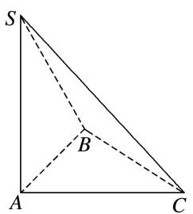

text_image

S
B
A
C

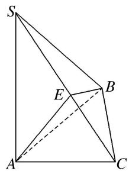

text_image

Geometric diagram with labeled points S, A, B, C, and E, showing solid and dashed lines forming triangles and quadrilaterals.

另解 取 $SC$ 的中点 $E$ , 连接 $AE, BE$ , 依题意, $BC^2 = AB^2 + AC^2 - 2AB \cdot AC \cos 60^\circ = 3$ , $\therefore AC^2 = AB^2 + BC^2$ , 即 $AB \perp BC$ , 又 $SA \perp$ 平面 $ABC$ , $\therefore SA \perp BC$ , 又 $SA \cap AB = A$ , $\therefore BC \perp$ 平面 $SAB$ , $BC \perp SB$ , $AE = \frac{1}{2} SC = BE$ , $\therefore$ 点 $E$ 是三棱锥 $S - ABC$ 的外接球的球心, 即点 $E$ 与点 $O$ 重合, $OA = \frac{1}{2} SC = \frac{1}{2} \sqrt{SA^2 + AC^2} = 2$ , 故球 $O$ 的表面积为 $4\pi \times OA^2 = 16\pi$ .

4. 在三棱锥 $P - ABC$ 中，已知 $PA \perp$ 底面 $ABC$ ， $\angle BAC = 60^\circ$ ， $PA = 2$ ， $AB = AC = \sqrt{3}$ ，若该三棱锥的顶点都在同一个球面上，则该球的表面积为（）

A. $\frac{4\pi}{3}$

B. $\frac{8\sqrt{2}\pi}{3}$

C. $8\pi$

D. $12\pi$

4. 答案 C 解析 易知 $\triangle ABC$ 是等边三角形．如图，作 $OM \perp$ 平面 $ABC$ ，其中 $M$ 为 $\triangle ABC$ 的中心，且点 $O$ 满足 $OM = \frac{1}{2} PA = 1$ ，则点 $O$ 为三棱锥 $P - ABC$ 外接球的球心．于是，该外接球的半径 $R = OA = \sqrt{AM^2 + OM^2} = \sqrt{(\frac{\sqrt{3}}{2} \times \sqrt{3} \times \frac{2}{3})^2 + 1^2} = \sqrt{2}$ ．故该球的表面积 $S = 4\pi R^2 = 8\pi$ ，故选 C．

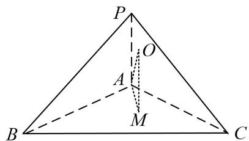

text_image

P
O
A
M
B
C

5. 在三棱锥 $A - BCD$ 中, $AC = CD = \sqrt{2}$ , $AB = AD = BD = BC = 1$ , 若三棱锥的所有顶点, 都在同一球面上, 则球的表面积是 \_\_\_\_.

5. 答案 $\frac{7}{3}\pi$ 解析 由已知可得, $BC \perp AB$ , $BC \perp BD$ , 所以 $BC \perp$ 平面 $ABD$ , 设三棱锥外接球的球心为 $O$ , 正三角形 $ABD$ 的中心为 $O_1$ , 则 $OO_1 \perp$ 平面 $ABD$ , 连接 $O_1B$ , $OO_1$ , $OC$ , 在直角梯形 $O_1BCO$ 中, 有 $O_1B = \frac{\sqrt{3}}{3}$ , $BC = 1$ , $OC = OB = R$ , 可得: $R^2 = \frac{7}{12}$ , 故所求球的表面积为 $4\pi R^2 = \frac{7}{3}\pi$ .

6. 如图，在 $\triangle ABC$ 中， $AB = BC = \sqrt{6}$ ， $\angle ABC = 90^{\circ}$ ，点 $D$ 为 $AC$ 的中点，将 $\triangle ABD$ 沿 $BD$ 折起到 $\triangle PBD$ 的位置，使 $PC = PD$ ，连接 $PC$ ，得到三棱锥 $P - BCD$ ，若该三棱锥的所有顶点都在同一球面上，则该球的表面积是（）

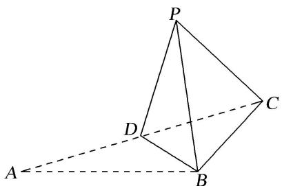

text_image

P
D
C
A
B

A. $7\pi$

B. $5\pi$

C. $3\pi$

D. $\pi$

6. 答案 A 解析 依题意可得该三棱锥的面 $PCD$ 是边长为 $\sqrt{3}$ 的正三角形，且 $BD \perp$ 平面 $PCD$ ，设三棱锥 $P - BDC$ 外接球的球心为 $O$ ， $\triangle PCD$ 外接圆的圆心为 $O_1$ ，则 $OO_1 \perp$ 平面 $PCD$ ，所以四边形 $OO_1DB$ 为直角梯形，由 $BD = \sqrt{3}$ ， $O_1D = 1$ ，及 $OB = OD$ ，可得 $OB = \frac{\sqrt{7}}{2}$ ，则外接球的半径 $R = \frac{\sqrt{7}}{2}$ 。所以该球的表面积 $S_{\text{球}} = 4\pi R^2 = 7\pi$ 。

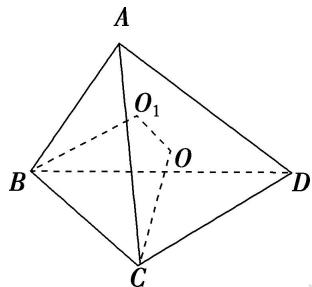

text_image

A
O₁
B
O
D
C

7. 已知点 $P, A, B, C, D$ 是球 $O$ 表面上的点， $PA \perp$ 平面 $ABCD$ ，四边形 $ABCD$ 是边长为 $2\sqrt{3}$ 的正方形。若 $PA = 2\sqrt{6}$ ，则 $\triangle OAB$ 的面积为（ ）.

A. $\sqrt{3}$

B. $2 \sqrt{2}$

C. $3\sqrt{3}$

D. $6\sqrt{3}$

7. 如图所示，∵ $PA \perp$ 平面 ABCD，∴ $PA \perp AC$ 。故可知 PC 为球 O 直径，则 PC 的中点为 O，取 AC 的中点为 $O'$ ，则 $OO' = \frac{1}{2} PA = \sqrt{6}$ ，又∵ $AC = \sqrt{(2\sqrt{3})^2 + (2\sqrt{3})^2} = 2\sqrt{6}$ ， $PA = 2\sqrt{6}$ ， $PC = \sqrt{(2\sqrt{6})^2 + (2\sqrt{6})^2}$ ∴ $4\sqrt{3}$ ，∴ 球半径 $R = 2\sqrt{3}$ ，故 $OC = OA = OB = 2\sqrt{3}$ ，又∵ $AB = 2\sqrt{3}$ ，∴ △OAB 为等边三角形．∴ $S_{\triangle OAB} = \frac{1}{2} \times 2\sqrt{3} \times 2\sqrt{3} \times \sin 60^\circ = 3\sqrt{3}$ .

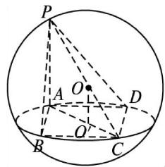

text_image

P
A
O
D
B
C

8. 三棱锥 $P - ABC$ 中, $AB = BC = \sqrt{15}$ , $AC = 6$ , $PC \perp$ 平面 $ABC$ , $PC = 2$ , 则该三棱锥的外接球表面积为 \_\_\_\_.

8. 答案 $\frac{83}{2}\pi$ 解析 由题可知， $\triangle ABC$ 中 $AC$ 边上的高为 $\sqrt{15 - 3^2} = \sqrt{6}$ ，球心 $O$ 在底面 $ABC$ 的投影即为 $\triangle ABC$ 的外心 $D$ ，设 $DA = DB = DC = x$ ，所以 $x^2 = 3^2 + (\sqrt{6} - x)^2$ ，解得 $x = \frac{5\sqrt{6}}{4}$ ，所以 $R^2 = x^2 + \left(\frac{PC}{2}\right)^2 = \frac{75}{8} + 1 = \frac{83}{8}$ （其中 $R$ 为三棱锥外接球的半径），所以外接球的表面积 $S = 4\pi R^2 = \frac{83}{2}\pi$ .

9. 中国古代数学经典《九章算术》系统地总结了战国、秦、汉时期的数学成就，书中将底面为长方形且有一条侧棱与底面垂直的四棱锥称之为阳马，将四个面都为直角三角形的三棱锥称之为鳖臑，如图为一个阳马与一个鳖臑的组合体，已知 $PA \perp$ 平面 $ABCE$ ，四边形 $ABCD$ 为正方形， $AD = \sqrt{5}$ ， $ED = \sqrt{3}$ ，若鳖臑 $P - ADE$ 的外接球的体积为 $9\sqrt{2}\pi$ ，则阳马 $P - ABCD$ 的外接球的表面积为 \_\_\_\_.

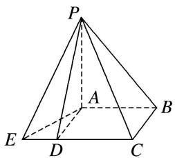

text_image

P
A
B
E
D
C

9. 答案 $20\pi$ 解析 $\because$ 四边形 $ABCD$ 是正方形， $\therefore AD \perp CD$ ，即 $AD \perp CE$ ，且 $AD = \sqrt{5}$ ， $ED = \sqrt{3}$ ， $\therefore \triangle ADE$ 的外接圆半径为 $r_1 = \frac{AE}{2} = \frac{\sqrt{AD^2 + ED^2}}{2} = \sqrt{2}$ ，设鳖臑 $P - ADE$ 的外接球的半径为 $R_1$ ，则 $\frac{4}{3}\pi R_1^3 = 9\sqrt{2}\pi$ ，解得 $R_1 = \frac{3\sqrt{2}}{2}$ 。 $\because PA \perp$ 平面 $ADE$ ， $\therefore R_1 = \sqrt{\left(\frac{PA}{2}\right)^2 + r_1^2}$ ，可得 $\frac{PA}{2} = \sqrt{R_1^2 - r_1^2} = \frac{\sqrt{10}}{2}$ ， $\therefore PA = \sqrt{10}$ 。正方形 $ABCD$ 的外接圆直径为 $2r_2 = AC = \sqrt{2}AD = \sqrt{10}$ ， $\therefore r_2 = \frac{\sqrt{10}}{2}$ ， $\because PA \perp$ 平面 $ABCD$ ， $\therefore$ 阳马 $P - ABCD$ 的外接球半径 $R_2 = \sqrt{\left(\frac{PA}{2}\right)^2 + r_2^2} = \sqrt{5}$ ， $\therefore$ 阳马 $P - ABCD$ 的外接球的表面积为 $4\pi R_2^2 = 20\pi$ 。

10. 在四棱锥 $P - ABCD$ 中， $PA \perp$ 平面 $ABCD$ ， $AP = 2$ ，点 $M$ 是矩形 $ABCD$ 内（含边界）的动点，且 $AB = 1$ ， $AD = 3$ ，直线 $PM$ 与平面 $ABCD$ 所成的角为 $\frac{\pi}{4}$ 。记点 $M$ 的轨迹长度为 $\alpha$ ，则 $\tan \alpha =$ \_\_\_\_。当三棱锥 $P - ABM$ 的体积最小时，三棱锥 $P - ABM$ 的外接球的表面积为 \_\_\_\_。

10. 答案 $\sqrt{3} 8\pi$ 解析 因为 $PA \perp$ 平面 $ABCD$ ，垂足为 $A$ ，则 $\angle PMA$ 为直线 $PM$ 与平面 $ABCD$ 所成的角，所以 $\angle PMA = \frac{\pi}{4}$ ；因为 $AP = 2$ ，所以 $AM = 2$ ，所以点 $M$ 位于底面矩形 $ABCD$ 内的以点 $A$ 为圆心，2 为半径的圆上，记点 $M$ 的轨迹为圆弧 $EF$ ，连接 $AF$ ，则 $AF = 2$ ；因为 $AB = 1$ ， $AD = 3$ ，所以 $\angle AFB = \angle FAE = \frac{\pi}{6}$ ；则弧 $EF$ 的长度为 $\alpha = \frac{\pi}{6} \times 2 = \frac{\pi}{3}$ ，所以 $\tan \alpha = \sqrt{3}$ 。当点 $M$ 位于 $F$ 时，三棱锥 $P - ABM$ 的体积最小，又 $\angle PAF = \angle PBF = \frac{\pi}{2}$ ，所以三棱锥 $P - ABM$ 的外接球球心为 $PF$ 的中点；因为 $PF = \sqrt{2^2 + 2^2} = 2\sqrt{2}$ ，所以三棱锥 $P - ABM$ 的外接球的表面积为 $S = 4\pi (\sqrt{2})^2 = 8\pi$ 。

