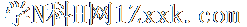
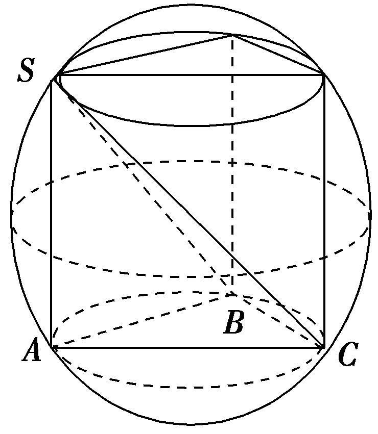
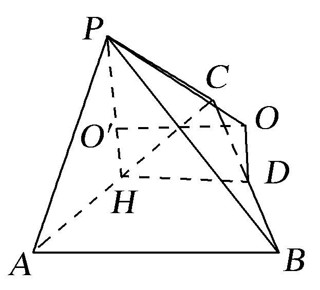
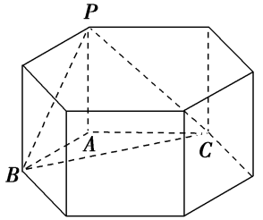
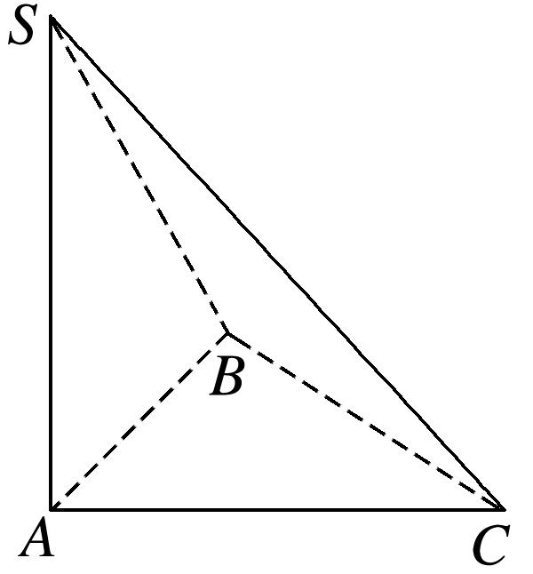
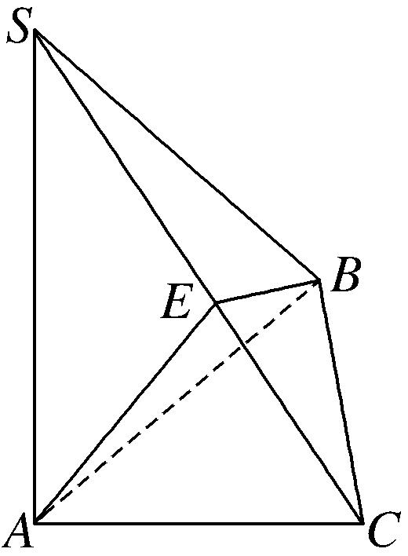
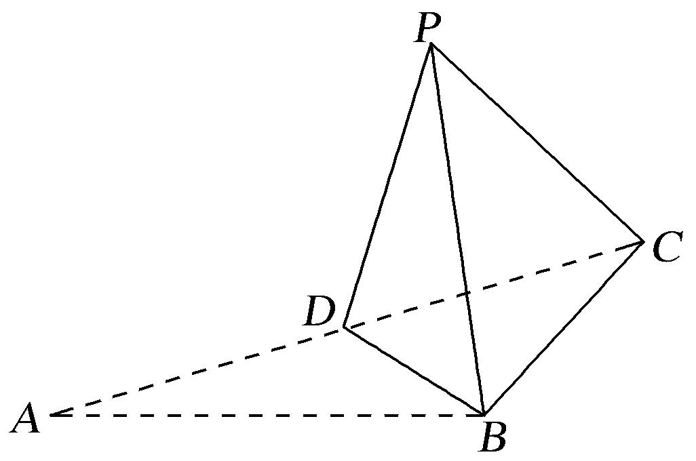
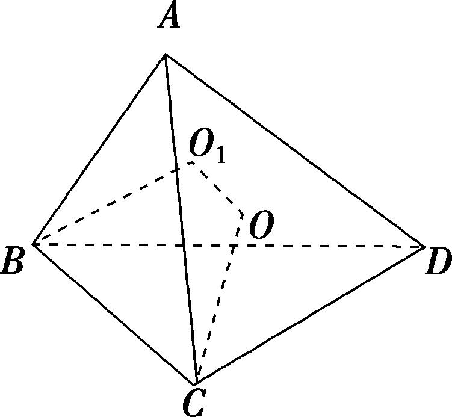
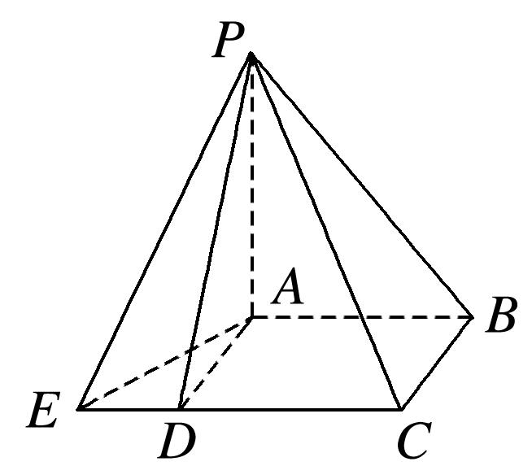

**专题四　垂面模型**

**【方法总结】**

垂面模型是有一条侧棱垂直底面的棱锥模型，可补为直棱柱内接于球，由对称性可知球心<em>O</em>的位置是△<em>CBD</em>的外心<em>O</em>1与△<em>AB</em>2<em>D</em>2的外心<em>O</em>2连线的中点，算出小圆<em>O</em>1的半径<em>AO</em>1＝<em>r</em>，<em>OO</em>1＝，．

**【例题选讲】**

<strong>[例]</strong>　(1)已知在三棱锥<em>S</em>－<em>ABC</em>中，<em>SA</em>⊥平面<em>ABC</em>，且∠<em>ACB</em>＝30°，<em>AC</em>＝2<em>AB</em>＝2，<em>SA</em>＝1．则该三棱锥的外接球的体积为(　　)

A．π　　　　　　B．13π　　　　　　C．π　　　　　　D．π

答案　D　解析　∵∠<em>ACB</em>＝30°，<em>AC</em>＝2<em>AB</em>＝2，∴△<em>ABC</em>是以<em>AC</em>为斜边的直角三角形，其外接圆半径<em>r</em>＝＝，则三棱锥外接球即为以△<em>ABC</em>为底面，以<em>SA</em>为高的三棱柱的外接球，∴三棱锥外接球的半径<em>R</em>满足<em>R</em>＝＝，故三棱锥外接球的体积<em>V</em>＝π<em>R</em>3＝π．故选D．

第(1)小题图                     第(2)小题图1　　　　     　　　第(2)小题图2

(2)三棱锥*P*－*ABC*中，平面*PAC*⊥平面*ABC*，*AB*⊥*AC*，*PA*＝*PC*＝*AC*＝2，*AB*＝4，则三棱锥*P*－*ABC*的外接球的表面积为(　　)

A．23π　　　　　　　　B．π　　　　　　　　C．64π　　　　　　　　D．π

答案　D　解析　如图1，设<em>O</em>为三棱锥外接球的球心，<em>O</em>1为正△<em>PAC</em>的中心，则<em>OO</em>1＝<em>AB</em>＝2．2<em>AO</em>1＝＝，<em>AO</em>1＝，<em>R</em>2＝<em>OA</em>2＝<em>O</em>1<em>A</em>2＋<em>O</em>1<em>O</em>2＝＋4＝，故几何体外接球的表面积<em>S</em>＝4π<em>R</em>2＝π．

另解：如图2，设<em>O</em>′为正△<em>PAC</em>的中心，<em>D</em>为Rt△<em>ABC</em>斜边的中点，<em>H</em>为<em>AC</em>中点．由平面<em>PAC</em>⊥平面<em>ABC</em>，则<em>O</em>′<em>H</em>⊥平面<em>ABC</em>．作<em>O</em>′<em>O</em>∥<em>HD</em>，<em>OD</em>∥<em>O</em>′<em>H</em>，则交点<em>O</em>为三棱锥外接球的球心，连接<em>OP</em>，又<em>O</em>′<em>P</em>＝<em>PH</em>＝××2＝，<em>OO</em>′＝<em>DH</em>＝<em>AB</em>＝2．∴<em>R</em>2＝<em>OP</em>2＝<em>O</em>′<em>P</em>2＋<em>O</em>′<em>O</em>2＝＋4＝．故几何体外接球的表面积<em>S</em>＝4π<em>R</em>2＝π．

(3)在三棱锥*S*－*ABC*中，侧棱*SA*⊥底面*ABC*，*AB*＝5，*BC*＝8，∠*ABC*＝60°，*SA*＝2，则该三棱锥的外接球的表面积为(　　)

A．π　　　　　　　　B．π　　　　　　　　C．π　　　　　　　　D．π

答案　B　解析　由题意知，<em>AB</em>＝5，<em>BC</em>＝8，∠<em>ABC</em>＝60°，则在△<em>ABC</em>中，由余弦定理得<em>AC</em>2＝<em>AB</em>2＋<em>BC</em>2－2×<em>AB</em>×<em>BC</em>×cos∠<em>ABC</em>，解得<em>AC</em>＝7，设△<em>ABC</em>的外接圆半径为<em>r</em>，则△<em>ABC</em>的外接圆直径2<em>r</em>＝＝，∴<em>r</em>＝，又∵侧棱<em>SA</em>⊥底面<em>ABC</em>，∴三棱锥的外接球的球心到平面<em>ABC</em>的距离<em>h</em>＝<em>SA</em>＝，则外接球的半径<em>R</em>＝＝，则该三棱锥的外接球的表面积为<em>S</em>＝4π<em>R</em>2＝π.

(4)在三棱锥*P*－*ABC*中，已知*PA*⊥底面*ABC*，∠*BAC*＝120˚，*PA*＝*AB*＝*AC*＝2，若该三棱锥的顶点都在同一个球面上，则该球的表面积为(　　)

A．10π　　　　　　　B．18π　　　　　　　C．20π　　　　　　　D．9π

答案　C　解析　如图1，先由余弦定理求出<em>BC</em>＝2，再由正弦定理求出<em>r</em>＝<em>AO</em>1＝2，外接球的直径<em>R</em>＝＝，所以该球的表面积为4π<em>R</em>2＝20π．

第(3)小题图                          第(4)小题图1　　　　     　　     　第(4)小题图2

另解　如图2，该三棱锥为图中正六棱柱内的三棱锥<em>P</em>－<em>ABC</em>，<em>PA</em>＝<em>AB</em>＝<em>AC</em>＝2，所以该三棱锥的外接球即该六棱柱的外接球，所以外接球的直径2<em>R</em>＝＝2⇒<em>R</em>＝，所以该球的表面积为4π<em>R</em>2＝20π．

(5)在三棱锥中，平面，，，，设为中点，且直线与平面所成角的余弦值为，则该三棱锥外接球的表面积为\_\_\_\_\_\_\_\_．

答案　　解析　在中，，，，由余弦定理得：

，即，解得：．设的外接圆半径为，由正弦定理得解得：；且

，又为中点，在中，，，．由余弦定理得：，即：，解得．又因为平面，所以为直线与平面所成角，由，得，，所以在中，．设三棱锥的外接球半径为，所以，三棱锥外接球表面积为．

**【对点训练】**

1．三棱锥*S*－*ABC*中，*SA*⊥底面*ABC*，若*SA*＝*AB*＝*BC*＝*AC*＝3，则该三棱锥外接球的表面积为(　　)

A．18π　　　　　　　　B．　　　　　　　　C．21π　　　　　　　　D．42π

1．答案　C　解析　由于*AB*＝*BC*＝*AC*＝3，则△*ABC*是边长为3的等边三角形，由正弦定理知，△*ABC*

的外接圆的直径为2<em>r</em>＝＝2，由于<em>SA</em>⊥底面<em>ABC</em>，所以△<em>ABC</em>外接圆的过圆心的垂线与线段<em>SA</em>中垂面的交点为该三棱锥的外接球的球心，所以外接球的半径<em>R</em>＝＝，因此，三棱锥<em>S</em>－<em>ABC</em>的外接球的表面积为4π<em>R</em>2＝4π×＝21π．故选C．

2．四面体*ABCD*的四个顶点都在球*O*的表面上，*AB*⊥平面*BCD*，△*BCD*是边长为3的等边三角形，若

*AB*＝2，则球*O*的表面积为(　　)

A．4π　　　　　　　　B．12π　　　　　　　　C．16π　　　　　　　　D．32π

2．答案　C　解析　取*CD*的中点*E*，连接*AE*，*BE*，∵在四面体*ABCD*中，*AB*⊥平面*BCD*，△*BCD*是

边长为3的等边三角形．∴Rt△<em>ABC</em>≌Rt△<em>ABD</em>，△<em>ACD</em>是等腰三角形，设△<em>BCD</em>的中心为<em>G</em>，作<em>OG</em>∥<em>AB</em>交<em>AB</em>的中垂线于<em>O</em>，则<em>O</em>为外接球的球心，∵<em>BE</em>＝，<em>BG</em>＝，∴外接球的半径<em>R</em>＝＝＝2.∴四面体<em>ABCD</em>外接球的表面积为4π<em>R</em>2＝16π．故选C．

3．已知三棱锥*S*－*ABC*的所有顶点都在球*O*的球面上，*SA*⊥平面*ABC*，*SA*＝2，*AB*＝1，*AC*＝2，∠

*BAC*＝60°，则球*O*的表面积为(　　)

A．4π　　　　　　　　B．12π　　　　　　　　C．16π　　　　　　　　D．64π

3．答案　C　解析　在△<em>ABC</em>中，由余弦定理得，<em>BC</em>2＝<em>AB</em>2＋<em>AC</em>2－2<em>AB</em>·<em>AC</em>cos 60°＝3，∴<em>AC</em>2＝<em>AB</em>2＋

<em>BC</em>2，即<em>AB</em>⊥<em>BC</em>．又<em>SA</em>⊥平面<em>ABC</em>，∴<em>SA</em>⊥<em>AB</em>，<em>SA</em>⊥<em>BC</em>，∴三棱锥<em>S</em>－<em>ABC</em>可补成分别以<em>AB</em>＝1，<em>BC</em>＝，<em>SA</em>＝2为长、宽、高的长方体，∴球<em>O</em>的直径为＝4，故球<em>O</em>的表面积为4π×22＝16π．

另解　取<em>SC</em>的中点<em>E</em>，连接<em>AE</em>，<em>BE</em>，依题意，<em>BC</em>2＝<em>AB</em>2＋<em>AC</em>2－2<em>AB</em>·<em>AC</em>cos 60°＝3，∴<em>AC</em>2＝<em>AB</em>2

＋<em>BC</em>2，即<em>AB</em>⊥<em>BC</em>，又<em>SA</em>⊥平面<em>ABC</em>，∴<em>SA</em>⊥<em>BC</em>，又<em>SA</em>∩<em>AB</em>＝<em>A</em>，∴<em>BC</em>⊥平面<em>SAB</em>，<em>BC</em>⊥<em>SB</em>，<em>AE</em>＝<em>SC</em>＝<em>BE</em>，∴点<em>E</em>是三棱锥<em>S－ABC</em>的外接球的球心，即点<em>E</em>与点<em>O</em>重合，<em>OA</em>＝<em>SC</em>＝＝2，故球<em>O</em>的表面积为4π×<em>OA</em>2＝16π．

4．在三棱锥*P*－*ABC*中，已知*PA*⊥底面*ABC*，∠*BAC*＝60°，*PA*＝2，*AB*＝*AC*＝，若该三棱锥的顶点

都在同一个球面上，则该球的表面积为(　　)

A．　　　　　　　　B．　　　　　　　　C．8π　　　　　　　　D．12π

4．答案　C　解析　易知△*ABC*是等边三角形．如图，作*OM*⊥平面*ABC*，其中*M*为△*ABC*的中心，且

点<em>O</em>满足<em>OM</em>＝<em>PA</em>＝1，则点<em>O</em>为三棱锥<em>P－ABC</em>外接球的球心．于是，该外接球的半径<em>R</em>＝<em>OA</em>＝＝＝．故该球的表面积<em>S</em>＝4π<em>R</em>2＝8π，故选C．

5．在三棱锥*A*－*BCD*中，*AC*＝*CD*＝，*AB*＝*AD*＝*BD*＝*BC*＝1，若三棱锥的所有顶点，都在同一球面

上，则球的表面积是\_\_\_\_\_\_\_\_．

5．答案　π　解析　由已知可得，*BC*⊥*AB*，*BC*⊥*BD*，所以*BC*⊥平面*ABD*，设三棱锥外接球的球心为

<em>O</em>，正三角形<em>ABD</em>的中心为<em>O</em>1，则<em>OO</em>1⊥平面<em>ABD</em>，连接<em>O</em>1<em>B</em>，<em>OO</em>1，<em>OC</em>，在直角梯形<em>O</em>1<em>BCO</em>中，有<em>O</em>1<em>B</em>＝，<em>BC</em>＝1，<em>OC</em>＝<em>OB</em>＝<em>R</em>，可得：<em>R</em>2＝，故所求球的表面积为4π<em>R</em>2＝π．

6．如图，在△*ABC*中，*AB*＝*BC*＝，∠*ABC*＝90°，点*D*为*AC*的中点，将△*ABD*沿*BD*折起到△*PBD*

的位置，使*PC*＝*PD*，连接*PC*，得到三棱锥*P*－*BCD*，若该三棱锥的所有顶点都在同一球面上，则该球的表面积是(　　)

A．7π　　　　　　　　　B．5π　　　　　　　　　C．3π　　　　　　　　　D．π

6．答案　A　解析　　依题意可得该三棱锥的面*PCD*是边长为的正三角形，且*BD*⊥平面*PCD*，设三

棱锥<em>P</em>－<em>BDC</em>外接球的球心为<em>O</em>，△<em>PCD</em>外接圆的圆心为<em>O</em>1，则<em>OO</em>1⊥平面<em>PCD</em>，所以四边形<em>OO</em>1<em>DB</em>为直角梯形，由<em>BD</em>＝，<em>O</em>1<em>D</em>＝1，及<em>OB</em>＝<em>OD</em>，可得<em>OB</em>＝，则外接球的半径<em>R</em>＝．所以该球的表面积<em>S</em>球＝4π<em>R</em>2＝7π．

7．已知点*P*，*A*，*B*，*C*，*D*是球*O*表面上的点，*PA*⊥平面*ABCD*，四边形*ABCD*是边长为的正方形．若

，则△*OAB*的面积为(　　)．

A．　　　　　　　　B．　　　　　　　　C．　　　　　　　　D．

7．如图所示，∵*PA*⊥平面*ABCD*，∴*PA*⊥*AC*．故可知*PC*为球*O*直径，则*PC*的中点为*O*，取*AC*的中

点为*O*′，则，又∵，，

∴，∴球半径，故*OC*＝*OA*＝*OB*＝，又∵，∴△*OAB*为等边三角形．∴．

8．三棱锥*P*－*ABC*中，*AB*＝*BC*＝，*AC*＝6，*PC*⊥平面*ABC*，*PC*＝2，则该三棱锥的外接球表面积为

\_\_\_\_\_\_\_\_．

8．答案　π　解析　由题可知，△*ABC*中*AC*边上的高为＝，球心*O*在底面*ABC*的投影即

为△<em>ABC</em>的外心<em>D</em>，设<em>DA</em>＝<em>DB</em>＝<em>DC</em>＝<em>x</em>，所以<em>x</em>2＝32＋(－<em>x</em>)2，解得<em>x</em>＝，所以<em>R</em>2＝<em>x</em>2＋2＝＋1＝(其中<em>R</em>为三棱锥外接球的半径)，所以外接球的表面积<em>S</em>＝4π<em>R</em>2＝π．

9．中国古代数学经典《九章算术》系统地总结了战国、秦、汉时期的数学成就，书中将底面为长方形且

有一条侧棱与底面垂直的四棱锥称之为阳马，将四个面都为直角三角形的三棱锥称之为鳖臑，如图为一个阳马与一个鳖臑的组合体，已知*PA*⊥平面*ABCE*，四边形*ABCD*为正方形，*AD*＝，*ED*＝，若鳖臑*P*－*ADE*的外接球的体积为9π，则阳马*P*－*ABCD*的外接球的表面积为\_\_\_\_\_\_\_\_．

9．答案　20π　解析　∵四边形*ABCD*是正方形，∴*AD*⊥*CD*，即*AD*⊥*CE*，且*AD*＝，*ED*＝，∴△

<em>ADE</em>的外接圆半径为<em>r</em>1＝＝＝，设鳖臑<em>P</em>－<em>ADE</em>的外接球的半径为<em>R</em>1，则π<em>R</em>＝9π，解得<em>R</em>1＝．∵<em>PA</em>⊥平面<em>ADE</em>，∴<em>R</em>1＝，可得＝＝，∴<em>PA</em>＝．正方形<em>ABCD</em>的外接圆直径为2<em>r</em>2＝<em>AC</em>＝<em>AD</em>＝，∴<em>r</em>2＝，∵<em>PA</em>⊥平面<em>ABCD</em>，∴阳马<em>P</em>－<em>ABCD</em>的外接球半径<em>R</em>2＝＝，∴阳马<em>P</em>－<em>ABCD</em>的外接球的表面积为4π<em>R</em>＝20π．

10．在四棱锥中，平面，，点是矩形内（含边界）的动点，且

，，直线与平面所成的角为．记点的轨迹长度为，则\_\_\_\_\_\_\_\_．；当三棱锥的体积最小时，三棱锥的外接球的表面积为\_\_\_\_\_\_\_\_．

10．答案　　　解析　因为平面，垂足为，则为直线与平面所成

的角，所以；因为，所以，所以点位于底面矩形内的以点为圆心，2为半径的圆上，记点的轨迹为圆弧，连接，则；因为，，所以；则弧的长度为，所以．当点位于时，三棱锥的体积最小，又，所以三棱锥的外接球球心为的中点；因为，所以三棱锥的外接球的表面积为．

