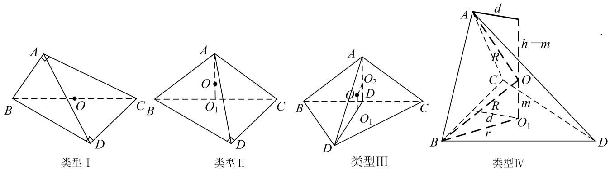
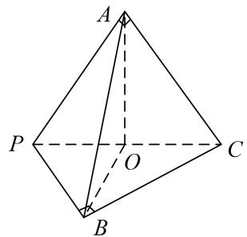
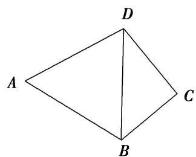
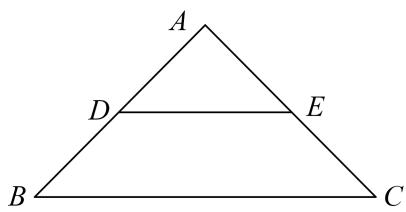
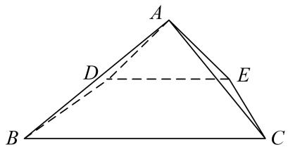
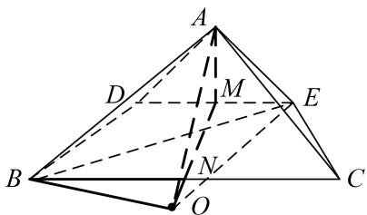
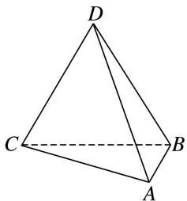
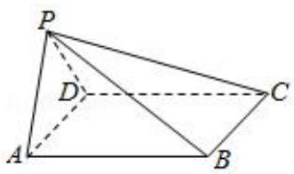

# 专题五 切瓜模型

# 【方法总结】

切瓜模型是有一侧面垂直底面的棱锥型，常见的是两个互相垂直的面都是特殊三角形且平面 $ABC \perp$ 平面 $BCD$ ，如类型 I， $\triangle ABC$ 与 $\triangle BCD$ 都是直角三角形，类型 II， $\triangle ABC$ 是等边三角形， $\triangle BCD$ 是直角三角形，类型 III， $\triangle ABC$ 与 $\triangle BCD$ 都是等边三角形，解决方法是分别过 $\triangle ABC$ 与 $\triangle BCD$ 的外心作该三角形所在平面的垂线，交点 O 即为球心。类型 IV， $\triangle ABC$ 与 $\triangle BCD$ 都一般三角形，解决方法是过 $\triangle BCD$ 的外心 $O_1$ 作该三角形所在平面的垂线，用代数方法即可解决问题。设三棱锥 A-BCD 的高为 h，外接球的半径为 R，球心为 O。 $\triangle BCD$ 的外心为 $O_1$ ， $O_1$ 到 BD 的距离为 d，O 与 $O_1$ 的距离为 m，则 $\begin{cases} R^2 = r^2 + m^2, \\ R^2 = d^2 + (h - m)^2, \end{cases}$ 解得 R。可用秒杀公式： $R^2 = r_1^2 + r_2^2 - \frac{l^2}{4}$ （其中 $r_1$ 、 $r_2$ 为两个面的外接圆的半径，l 为两个面的交线的长）。

# 【例题选讲】

[例] （1）已知在三棱锥 $P - ABC$ 中， $V_{P - ABC} = \frac{4\sqrt{3}}{3}$ ， $\angle APC = \frac{\pi}{4}$ ， $\angle BPC = \frac{\pi}{3}$ ， $PA \perp AC$ ， $PB \perp BC$ ，且平面 $PAC \perp$ 平面 $PBC$ ，那么三棱锥 $P - ABC$ 外接球的体积为 \_\_\_\_.
> 

> 
> |  |  |
> | --- | --- |
> | （2）如图, 已知平面四边形 $ABCD$ 满足 $AB = AD = 2$ , $\angle A = 60^{\circ}$ , $\angle C = 90^{\circ}$ , 将 $\triangle ABD$ 沿对角线 $BD$ 翻折,使平面 $ABD \perp$ 平面 $CBD$ , 则四面体 $ABCD$ 外接球的体积为 \_\_\_\_. | （3）已知三棱锥 A-BCD 中， $\triangle ABD$ 与 $\triangle BCD$ 是边长为 2 的等边三角形且二面角 A-BD-C 为直二面角，则三棱锥 A-BCD 的外接球的表面积为() |
> 

A. $\frac{10\pi}{3}$

B. $5 \pi$

C. $6\pi$

D. $\frac{20\pi}{3}$  
（4）已知 $\Delta ABC$ 是以 BC 为斜边的直角三角形，P 为平面 ABC 外一点，且平面 $PBC \perp$ 平面 ABC，BC = 3，
$PB = 2\sqrt{2}$ ， $PC = \sqrt{5}$ ，则三棱锥 $P - ABC$ 外接球的表面积为  
（5）已知等腰直角三角形 ABC 中，AB=AC=2，D，E 分别为 AB，AC 的中点，沿 DE 将 $\triangle ABC$ 折成直二面角(如图)，则四棱锥 A-DECB 的外接球的表面积为 \_\_\_\_.

# 【对点训练】

1. 把边长为 3 的正方 $ABCD$ 沿对角线 $AC$ 对折, 使得平面 $ABC \perp$ 平面 $ADC$ , 则三棱锥 $D-ABC$ 的外接球的表面积为 ( )

A. $32\pi$

B. $27\pi$

C. $18\pi$

D. $9\pi$

2. 在三棱锥 $A - BCD$ 中, $\triangle ACD$ 与 $\triangle BCD$ 都是边长为 4 的正三角形, 且平面 $ACD \perp$ 平面 $BCD$ , 则该三棱锥外接球的表面积为 \_\_\_\_.

3. 已知如图所示的三棱锥 $D - ABC$ 的四个顶点均在球 $O$ 的球面上， $\triangle ABC$ 和 $\triangle DBC$ 所在的平面互相垂直， $AB = 3$ ， $AC = \sqrt{3}$ ， $BC = CD = BD = 2\sqrt{3}$ ，则球 $O$ 的表面积为（）

A. $4\pi$

B. $12\pi$

C. $16\pi$

D. $36\pi$

4. 在三棱锥 $A - BCD$ 中, 平面 $ABC \perp$ 平面 $BCD$ , $\Delta ABC$ 是边长为 2 的正三角形, 若 $\angle BDC = \frac{\pi}{4}$ , 三棱锥的各个顶点均在球 $O$ 上, 则球 $O$ 的表面积为( ).

A. $\frac{52\pi}{3}$

B. $3\pi$

C. $4\pi$

D. $\frac{28\pi}{3}$

5. 已知空间四边形 $ABCD$ ， $\angle BAC = \frac{2}{3}\pi$ ， $AB = AC = 2\sqrt{3}$ ， $BD = 4$ ， $CD = 2\sqrt{5}$ ，且平面 $ABC \perp$ 平面 $BCD$ ，则该几何体的外接球的表面积为（）

A. $24\pi$

B. $48\pi$

C. $64\pi$

D. $96\pi$

6. 如图，已知四棱锥 $P - ABCD$ 的底面为矩形，平面 $PAD \perp$ 平面 $ABCD$ ， $AD = 2\sqrt{2}$ ， $PA = PD = AB = 2$ 则四棱锥 $P - ABCD$ 的外接球的表面积为（）

A. $2\pi$

B. $4\pi$

C. $8\pi$

D. $12\pi$

7. 在四棱锥 $A - BCDE$ 中, $\Delta ABC$ 是边长为 6 的正三角形, $BCDE$ 是正方形, 平面 $ABC \perp$ 平面 $BCDE$ , 则该四棱锥的外接球的体积为 ( )

A. $21 \sqrt{21} \pi$

B. $84\pi$

C. $7\sqrt{21}\pi$

D. $28\sqrt{21}\pi$

8. 已知空间四边形 $ABCD$ ， $\angle BAC = \frac{2\pi}{3}$ ， $AB = AC = 2\sqrt{3}$ ， $BD = CD = 6$ ，且平面 $ABC \perp$ 平面 $BCD$ ，则空间四边形 $ABCD$ 的外接球的表面积为（）

A. $60\pi$

B. $36\pi$

C. $24\pi$

D. $12\pi$

9. 在三棱锥 $P - ABC$ 中， $AB = AC = 4$ ， $\angle BAC = 120^{\circ}$ ， $PB = PC = 4\sqrt{3}$ ，平面 $PBC \perp$ 平面 $ABC$ ，则三棱锥 $P - ABC$ 外接球的表面积为 \_\_\_\_.

10. 在三棱锥 $P - ABC$ 中，平面 $PAB \perp$ 平面 $ABC$ ， $AP = 2\sqrt{5}$ ， $AB = 6$ ， $\angle ACB = \frac{\pi}{3}$ ，且直线 $PA$ 与平面 $ABC$ 所成角的正切值为 2，则该三棱锥的外接球的表面积为（）

A. $13\pi$

B. $52\pi$

C. $\frac{52\pi}{3}$

D. $\frac{52\sqrt{13}\pi}{3}$

