# 专题五 切瓜模型

# 【方法总结】

切瓜模型是有一侧面垂直底面的棱锥型，常见的是两个互相垂直的面都是特殊三角形且平面 $ABC \perp$ 平面 $BCD$ ，如类型 I， $\triangle ABC$ 与 $\triangle BCD$ 都是直角三角形，类型 II， $\triangle ABC$ 是等边三角形， $\triangle BCD$ 是直角三角形，类型 III， $\triangle ABC$ 与 $\triangle BCD$ 都是等边三角形，解决方法是分别过 $\triangle ABC$ 与 $\triangle BCD$ 的外心作该三角形所在平面的垂线，交点 O 即为球心。类型 IV， $\triangle ABC$ 与 $\triangle BCD$ 都一般三角形，解决方法是过 $\triangle BCD$ 的外心 $O_1$ 作该三角形所在平面的垂线，用代数方法即可解决问题。设三棱锥 A-BCD 的高为 h，外接球的半径为 R，球心为 O。 $\triangle BCD$ 的外心为 $O_1$ ， $O_1$ 到 BD 的距离为 d，O 与 $O_1$ 的距离为 m，则 $\begin{cases} R^2 = r^2 + m^2, \\ R^2 = d^2 + (h - m)^2, \end{cases}$ 解得 R。可用秒杀公式： $R^2 = r_1^2 + r_2^2 - \frac{l^2}{4}$ （其中 $r_1$ 、 $r_2$ 为两个面的外接圆的半径，l 为两个面的交线的长）。

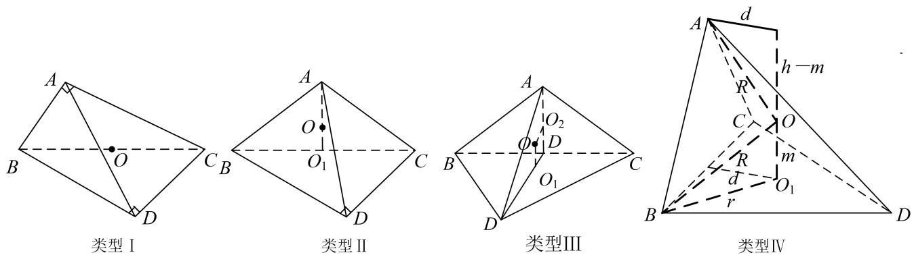

# 【例题选讲】

[例] （1）已知在三棱锥 $P - ABC$ 中， $V_{P - ABC} = \frac{4\sqrt{3}}{3}$ ， $\angle APC = \frac{\pi}{4}$ ， $\angle BPC = \frac{\pi}{3}$ ， $PA \perp AC$ ， $PB \perp BC$ ，且平面 $PAC \perp$ 平面 $PBC$ ，那么三棱锥 $P - ABC$ 外接球的体积为 \_\_\_\_.
答案 $\frac{32\pi}{3}$ 解析 如图，取 $PC$ 的中点 $O$ ，连接 $AO$ ， $BO$ ，设 $PC = 2R$ ，则 $OA = OB = OC = OP = R$ ∴ $O$ 是三棱锥 $P - ABC$ 外接球的球心，易知， $PB = R$ ， $BC = \sqrt{3} R$ ， $\because \angle APC = \frac{\pi}{4}$ ， $PA \perp AC$ ， $O$ 为 $PC$ 的中点，∴ $AO \perp PC$ ，又平面 $PAC \perp$ 平面 $PBC$ ，且平面 $PAC \cap$ 平面 $PBC = PC$ ，∴ $AO \perp$ 平面 $PBC$ ，∴ $V_{P - ABC} = V_{A - PBC} = \frac{1}{3} \times \frac{1}{2} \times PB \times BC \times AO = \frac{1}{3} \times \frac{1}{2} \times R \times \sqrt{3} R \times R = \frac{4\sqrt{3}}{3}$ ，解得 $R = 2$ ，∴三棱锥 $P - ABC$ 外接球的体积 $V = \frac{4}{3}\pi R^3 = \frac{32\pi}{3}$ .

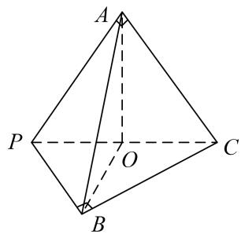  
（2）如图, 已知平面四边形 $ABCD$ 满足 $AB = AD = 2$ , $\angle A = 60^{\circ}$ , $\angle C = 90^{\circ}$ , 将 $\triangle ABD$ 沿对角线 $BD$ 翻折,使平面 $ABD \perp$ 平面 $CBD$ , 则四面体 $ABCD$ 外接球的体积为 \_\_\_\_.

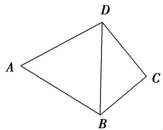
答案 $\frac{32\sqrt{3}\pi}{27}$ 解析 在四面体 $ABCD$ 中， $\because AB = AD = 2, \angle BAD = 60^\circ, \therefore \triangle ABD$ 为正三角形，设 $BD$ 的中点为 $M$ ，连接 $AM$ ，则 $AM \perp BD$ ，又平面 $ABD \perp$ 平面 $CBD$ ，平面 $ABD \cap$ 平面 $CBD = BD, \therefore AM \perp$ 平面 $CBD$ . $\because \triangle CBD$ 为直角三角形， $\therefore$ 其外接圆的圆心是斜边 $BD$ 的中点 $M$ ，由球的性质知，四面体 $ABCD$ 外接球的球心必在线段 $AM$ 上，又 $\triangle ABD$ 为正三角形， $\therefore$ 球心是 $\triangle ABD$ 的中心，则外接球的半径为 $\frac{2}{3} \times 2 \times \frac{\sqrt{3}}{2} = \frac{2\sqrt{3}}{3}, \therefore$ 四面体 $ABCD$ 外接球的体积为 $\frac{4}{3} \times \pi \times (\frac{2\sqrt{3}}{3})^3 = \frac{32\sqrt{3}\pi}{27}$ .  
（3）已知三棱锥 $A - BCD$ 中， $\triangle ABD$ 与 $\triangle BCD$ 是边长为2的等边三角形且二面角 $A - BD - C$ 为直二面角，则三棱锥 $A - BCD$ 的外接球的表面积为（）

A. $\frac{10\pi}{3}$

B. $5 \pi$

C. $6\pi$

D. $\frac{20\pi}{3}$
答案 D 解析 如图，取 BD 中点 M，连接 AM，CM，取 $\triangle ABD$ ， $\triangle CBD$ 的中心即 AM，CM 的三等分点 P，Q，过 P 作平面 ABD 的垂线，过 Q 作平面 CBD 的垂线，两垂线相交于点 O，则点 O 为外接球的球心，如图，其中 $OQ=\frac{\sqrt{3}}{3}$ ， $CQ=\frac{2\sqrt{3}}{3}$ ，连接 OC，则外接球的半径 $R=OC=\frac{\sqrt{15}}{3}$ ，表面积为 $4\pi R^{2}=\frac{20\pi}{3}$ ，故选 D.

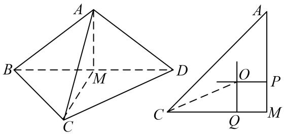  
（4）已知 $\Delta ABC$ 是以 $BC$ 为斜边的直角三角形， $P$ 为平面 $ABC$ 外一点，且平面 $PBC \perp$ 平面 $ABC$ ， $BC = 3$ ， $PB = 2\sqrt{2}$ ， $PC = \sqrt{5}$ ，则三棱锥 $P - ABC$ 外接球的表面积为 \_\_\_\_.
答案 $10\pi$ 解析 由题意知 $BC$ 的中点 $O$ 为 $\Delta ABC$ 外接圆的圆心，且平面 $PBC \perp$ 平面 $ABC$ ，过 $O$ 作面 $ABC$ 的垂线 $l$ ，则垂线 $l$ 一定在面 $ABC$ 内．根据球的性质，球心一定在垂线 $l$ 上， $\because$ 球心 $O_1$ 一定在平面 $PBC$ 内，且球心 $O_1$ 也是 $\Delta PBC$ 外接圆的圆心．在 $\Delta PBC$ 中，由余弦定理得 $\cos \angle PBC = \frac{PB^2 + BC^2 - PC^2}{2PB \cdot BC} = \frac{\sqrt{2}}{2}$ ， $\therefore \sin \angle PBC = \frac{\sqrt{2}}{2}$ ，由正弦定理得： $\frac{PC}{\sin \angle PBC} = 2R$ ，解得 $R = \frac{\sqrt{10}}{2}$ ， $\therefore$ 三棱锥的外接球的表面积 $= 4\pi R^2 = 10\pi$ ．  
（5）已知等腰直角三角形 ABC 中，AB=AC=2，D，E 分别为 AB，AC 的中点，沿 DE 将 $\triangle ABC$ 折成直二面角(如图)，则四棱锥 A-DECB 的外接球的表面积为 \_\_\_\_.

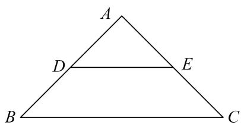

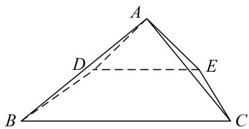
答案 $10\pi$ 解析 取 $DE$ 的中点 $M, BC$ 的中点 $N$ ，连接 $MN(\text{图略})$ ，由题意知， $MN \perp$ 平面 $ADE$ ，因为 $\triangle ADE$ 是等腰直角三角形，所以 $\triangle ADE$ 的外接圆的圆心是点 $M$ ，四棱锥 $A-DECB$ 的外接球的球心在直线 $MN$ 上，又等腰梯形 $DECB$ 的外接圆的圆心在 $MN$ 上，所以四棱锥 $A-DECB$ 的外接球的球心就是等腰梯形 $DECB$ 的外接圆的圆心。连接 $BE$ ，易知 $\triangle BEC$ 是钝角三角形，所以等腰梯形 $DECB$ 的外接圆的圆心在等腰梯形 $DECB$ 的外部。设四棱锥 $A-DECB$ 的外接球的半径为 $R$ ，球心到 $BC$ 的距离为 $d$ ，则 $\left\{\begin{aligned} R^{2}&=d^{2}+(\sqrt{2})^{2},\\ R^{2}&=(d+\frac{\sqrt{2}}{2})^{2}+(\frac{\sqrt{2}}{2})^{2},\end{aligned}\right.$ 解得 $R^{2}=\frac{5}{2}$ ，故四棱锥 $A-DECB$ 的外接球的表面积 $S=4\pi R^{2}=10\pi$ 。

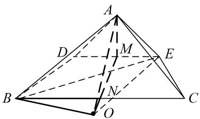

# 【对点训练】

1. 把边长为 3 的正方 $ABCD$ 沿对角线 $AC$ 对折, 使得平面 $ABC \perp$ 平面 $ADC$ , 则三棱锥 $D-ABC$ 的外接球的表面积为 ( )

A. $32\pi$

B. $27\pi$

C. $18\pi$

D. $9\pi$

1. 答案 C 解析 将边长为 1 的正方形 ABCD，沿对角线 AC 把 $\Delta ACD$ 折起，使平面 $ACD \perp$ 平面 ABC，则 $BC \perp CD$ ， $BA \perp AD$ ；三棱锥 C-ABD 的外接球直径为 $AC = 3\sqrt{2}$ ，外接球的表面积为 $4\pi R^{2} = 4\pi \times \left( \frac{3\sqrt{2}}{2} \right)^{2} = 18\pi$ 。

2. 在三棱锥 $A - BCD$ 中, $\triangle ACD$ 与 $\triangle BCD$ 都是边长为 4 的正三角形, 且平面 $ACD \perp$ 平面 $BCD$ , 则该三棱锥外接球的表面积为 \_\_\_\_.

2. 答案 $\frac{80}{3}\pi$ 解析 取 $AB, CD$ 的中点分别为 $E, F$ , 连接 $EF, AF, BF$ , 由题意知 $AF \perp BF$ , $AF = BF$ , $= 2\sqrt{3}$ , $EF = \frac{1}{2}\sqrt{AF^2 + BF^2} = \sqrt{6}$ , 易知三棱锥的外接球球心 $O$ 在线段 $EF$ 上, 所以 $OE + OF = \sqrt{6}$ , 设外接球的半径为 $R$ , 连接 $OA, OC$ , 则有 $R^2 = AE^2 + OE^2$ , $R^2 = CF^2 + OF^2$ , 所以 $AE^2 + OE^2 = CF^2 + OF^2$ , $(\sqrt{6})^2 + OE^2 = 2^2 + OF^2$ , 所以 $OF^2 - OE^2 = 2$ , 又 $OE + OF = \sqrt{6}$ , 则 $OF^2 = \frac{8}{3}$ , $R^2 = \frac{20}{3}$ , 所以该三棱锥外接球的表面积为 $4\pi R^2 = \frac{80}{3}\pi$ .

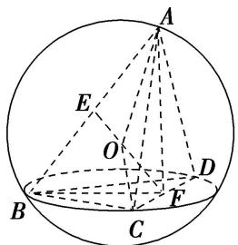

3. 已知如图所示的三棱锥 $D - ABC$ 的四个顶点均在球 $O$ 的球面上， $\triangle ABC$ 和 $\triangle DBC$ 所在的平面互相垂直， $AB = 3$ ， $AC = \sqrt{3}$ ， $BC = CD = BD = 2\sqrt{3}$ ，则球 $O$ 的表面积为（）

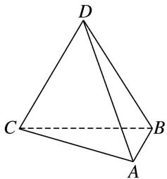

A. $4\pi$

B. $12\pi$

C. $16\pi$

D. $36\pi$

3. 答案 C 解析 如图所示, $\because AB^{2} + AC^{2} = BC^{2}$ , $\therefore \angle CAB$ 为直角, 即 $\triangle ABC$ 外接圆的圆心为 $BC$ 的中点 $O'$ . $\triangle ABC$ 和 $\triangle DBC$ 所在的平面互相垂直, 则球心在过 $\triangle DBC$ 的圆面上, 即 $\triangle DBC$ 的外接圆为球的大圆, 由等边三角形的重心和外心重合, 易得球半径 $R = 2$ , 球的表面积为 $S = 4\pi R^{2} = 16\pi$ , 故选 C.

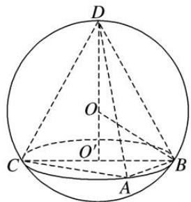

4. 在三棱锥 $A - BCD$ 中，平面 $ABC \perp$ 平面 $BCD$ ， $\Delta ABC$ 是边长为 2 的正三角形，若 $\angle BDC = \frac{\pi}{4}$ ，三棱锥的各个顶点均在球 $O$ 上，则球 $O$ 的表面积为（ ）.

A. $\frac{52\pi}{3}$

B. $3\pi$

C. $4\pi$

D. $\frac{28\pi}{3}$

4. 答案 D 解析 记 $\Delta BCD$ 外接圆圆心为 E， $\Delta ABC$ 外接圆圆心为 F，连结 OE，OF，则 $OE \perp$ 平面 BCD， $OF \perp$ 平面 ABC；取 BC 中点 N，连结 AN，EN，因为 $\Delta ABC$ 是边长为 2 的正三角形，所以 AN 过点 F，且 $AF = 2FN = \frac{2}{3}AN = \frac{2}{3}\sqrt{3}$ ；在 $\Delta BCD$ 中， $\angle BDC = \frac{\pi}{4}$ ，BC = 2，设 $\Delta BCD$ 外接圆为 r，则 $2r = \frac{BC}{\sin\angle BDC} = \frac{2}{\frac{\sqrt{2}}{2}} = 2\sqrt{2}$ ，所以 $r = \sqrt{2}$ ，故 $BE = EC = r = \sqrt{2}$ ，所以有 $BE^{2} + EC^{2} = BC^{2}$ ，因为 N 为 BC 中点，所以 $EN \perp BC$ ，且 $EN = \frac{1}{2}BC = 1$ ；又平面 $ABC \perp$ 平面 BCD，所以 $EN \perp$ 平面 ABC， $OE \perp$ 平面 ABC；因此 $EN \perp OF$ 且 EN = OF = 1，设三棱锥 A - BCD 外接球半径为 R，则 $R = OA = \sqrt{OF^{2} + AF^{2}}\sqrt{\frac{7}{3}}$ ，因此，球 O 的表面积为 $S = 4\pi R^{2} = \frac{28}{3}\pi$ 。故选 D.

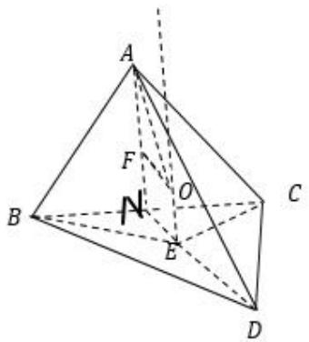

5. 已知空间四边形 $ABCD$ ， $\angle BAC = \frac{2}{3}\pi$ ， $AB = AC = 2\sqrt{3}$ ， $BD = 4$ ， $CD = 2\sqrt{5}$ ，且平面 $ABC \perp$ 平面 $BCD$ ，则该几何体的外接球的表面积为（）

A. $24\pi$

B. $48\pi$

C. $64\pi$

D. $96\pi$

5. 答案 B 解析 在三角形 ABC 中， $\angle BAC = \frac{2}{3}\pi$ ， $AB = AC = 2\sqrt{3}$ ，由余弦定理可得
$BC=\sqrt{AB^{2}+AC^{2}-2AB\cdot AC\cdot\cos\frac{2}{3}\pi}=6$ ，而在三角形BCD中， $BD=4, CD=2\sqrt{5}, \therefore BD^{2}+CD^{2}=BC^{2}$ ，即 $\Delta BCD$ 为直角三角形，且BC为斜边，因为平面 $ABC\perp$ 平面BCD，所以几何体的外接球的球心为为三角形ABC的外接圆的圆心，设外接球的半径为R，则 $2R=\frac{BC}{\sin\frac{2}{3}\pi}=4\sqrt{3}$ ，即 $R=2\sqrt{3}$ ，所以外接球的表面积 $S=4\pi R^{2}=48\pi$ ，

6. 如图，已知四棱锥 $P - ABCD$ 的底面为矩形，平面 $PAD \perp$ 平面 $ABCD$ ， $AD = 2\sqrt{2}$ ， $PA = PD = AB = 2$ 则四棱锥 $P - ABCD$ 的外接球的表面积为（）

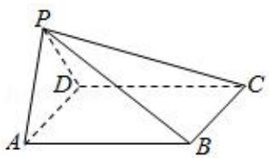

A. $2\pi$

B. $4\pi$

C. $8\pi$

D. $12\pi$

6. 答案 D 解析 取 $AD$ 的中点 $E$ ，连接 $PE$ ， $\Delta PAD$ 中， $PA = PD = 2$ ， $AD = 2\sqrt{2}$ ， $\therefore PA \perp PD$ ， $\therefore PE = \sqrt{2}$ ，设 $ABCD$ 的中心为 $O'$ ，球心为 $O$ ，则 $O'B = \frac{1}{2} BD = \sqrt{3}$ ，设 $O$ 到平面 $ABCD$ 的距离为 $d$ ，
则 $R^2 = d^2 + (\sqrt{3})^2 = 1^2 + (\sqrt{2} - d)^2$ ， $\therefore d = 0$ ， $R = \sqrt{3}$ ， $\therefore$ 四棱锥 $P - ABCD$ 的外接球的表面积为 $4\pi R^2 = 12\pi$ 。

7. 在四棱锥 $A - BCDE$ 中, $\Delta ABC$ 是边长为 6 的正三角形, $BCDE$ 是正方形, 平面 $ABC \perp$ 平面 $BCDE$ , 则该四棱锥的外接球的体积为 ( )

A. $21\sqrt{21}\pi$

B. $84\pi$

C. $7\sqrt{21}\pi$

D. $28\sqrt{21}\pi$

7. 答案 D 解析 四棱锥 A-BCDE 中， $\Delta ABC$ 是边长为 6 的正三角形，BCDE 是正方形，平面 ABC⊥平面 BCDE，如图所示： $\Delta ABC$ 是边长为 6 的正三角形，所以 $\Delta ABC$ 的中心到 BC 中点的距离为 $\frac{1}{3}\times\sqrt{6^{2}-3^{2}}=\sqrt{3}$ ，所以 $OB=\sqrt{(3\sqrt{2})^{2}+(\sqrt{3})^{2}}=\sqrt{21}$ ，所以 $V=\frac{4}{3}\times\pi\times(\sqrt{21})^{3}=28\sqrt{21}\pi$ ，

8. 已知空间四边形 $ABCD$ ， $\angle BAC = \frac{2\pi}{3}$ ， $AB = AC = 2\sqrt{3}$ ， $BD = CD = 6$ ，且平面 $ABC \perp$ 平面 $BCD$ ，则空间四边形 $ABCD$ 的外接球的表面积为（）

A. $60\pi$

B. $36\pi$

C. $24\pi$

D. $12\pi$

8. 答案 A 解析 借助长方体作出空间四边形 ABCD，取 BC 中点 P，在等腰 $\Delta ABC$ 中， $AB = AC = 2\sqrt{3}$ ， $\angle BAC = \frac{2\pi}{3}$ ，可求得 BC = 6， $AP = \sqrt{3}$ ，又 BD = CD = 6，∴ $\Delta BCD$ 为正三角形，外接球球心 O 在过其中心 M 垂直于平面 BCD 的直线上，如图：在 $\Delta BCD$ 中，求得 $PD = 3\sqrt{3}$ ，∴ $PM = \sqrt{3}$ ， $BM = 2\sqrt{3}$ ，设 OM = x，则 $ON = \sqrt{3} + x$ ，在 $\Delta OAN$ 中， $OA^{2} = AN^{2} + ON^{2} = 3 + (x + \sqrt{3})^{2}$ ，在 $\Delta OBM$ 中， $OB^{2} = BM^{2} + OM^{2} = 12 + x^{2}$ ，由 OA = OB 列方程解得 $x = \sqrt{3}$ ，从而 $OB^{2} = 15$ 即外接球半径 $r = \sqrt{15}$ ，∴ 外接球面积 $= 4\pi \times 15 = 60\pi$ ，

9. 在三棱锥 $P - ABC$ 中, $AB = AC = 4$ , $\angle BAC = 120^{\circ}$ , $PB = PC = 4\sqrt{3}$ , 平面 $PBC \perp$ 平面 $ABC$ , 则三棱锥 $P - ABC$ 外接球的表面积为 \_\_\_\_.

9. 答案 $80\pi$ 解析 如图，设 $\Delta ABC$ 的外接圆的圆心为 $O_{1}$ ，连接 $O_{1}C$ ， $O_{1}A$ ， $BC \cap O_{1}A = H$ ，连接 $PH$ 。由题意可得 $AH \perp BC$ ，且 $AH = \frac{1}{2} O_{1}A = 2$ ， $BH = \frac{1}{2} BC = 2\sqrt{3}$ 。因为平面 $PBC \perp$ 平面 $ABC$ ，且 $PB = PC$ ，所以 $PH \perp$ 平面 $ABC$ ，且 $PH = \sqrt{(4\sqrt{3})^{2} - (2\sqrt{3})^{2}} = 6$ 。设 $O$ 为三棱锥 $P - ABC$ 外接球的球心，连接 $OO_{1}$ ， $OP$ ， $OC$ ，过 $O$ 作 $OD \perp PH$ ，垂足为 $D$ ，则外接球的半径 $R$ 满足 $R^{2} = OO_{1}^{2} + 4^{2} = (6 - OO_{1})^{2} + O_{1}H^{2}$ ，即 $OO_{1}^{2} + 16 = (6 - OO_{1})^{2} + 4$ ，解得 $OO_{1} = 2$ ，从而 $R^{2} = 20$ ，故三棱锥 $P - ABC$ 外接球的表面积为 $4\pi R^{2} = 80\pi$ 。

10. 在三棱锥 $P - ABC$ 中，平面 $PAB \perp$ 平面 $ABC$ ， $AP = 2\sqrt{5}$ ， $AB = 6$ ， $\angle ACB = \frac{\pi}{3}$ ，且直线 $PA$ 与平面 $ABC$ 所成角的正切值为 2，则该三棱锥的外接球的表面积为（）

A. $13\pi$

B. $52\pi$

C. $\frac{52\pi}{3}$

D. $\frac{52\sqrt{13}\pi}{3}$

10. 答案 B 解析 如图，过点 P 作 $PE \perp AB$ 于 E，D 为 AB 的中点，设 $\Delta ABC$ 的外心是 $O_{1}$ ，半径是 r，连接 $O_{1}B$ ， $O_{1}E$ ， $O_{1}D$ ，由正弦定理得 $2r = \frac{AB}{\sin \angle ACB} = 4\sqrt{3}$ ，则 $O_{1}B = r = 2\sqrt{3}$ ，D 为 AB 的中点， $BD = AD = \frac{1}{2} AB = 3$ ， $O_{1}D \perp AB$ ，所以 $O_{1}D = \sqrt{O_{1}B^{2} - BD^{2}} = \sqrt{3}$ ，因为平面 $PAB \perp$ 平面 ABC， $PE \perp AB$ 于 E，平面 $PAB \cap$ 平面 ABC = AB，则 $PE \perp$ 平面 ABC，所以直线 PA 与平面 ABC 所成的角是 $\angle PAE$ ，则 $\tan \angle PAE = \frac{PE}{AE} = 2$ ，即 PE = 2AE，因为 $AP = \sqrt{PE^{2} + AE^{2}} = 2\sqrt{5}$ ，所以 PE = 2AE = 4，则 DE = 1，
故 $O_{1}E = 2$ ，设三棱锥 $P - ABC$ 外接球球心是 $O$ ，连接 $OO_{1}$ ， $OB$ ， $OP$ ，过 $O$ 作 $OH \perp PE$ 于 $H$ ，则 $OO_{1} \perp$ 平面 $ABC$ ，于是 $OO_{1} // PE$ ，从而 $O_{1}OHE$ 是矩形，所以外接球半径 $R$ 满足 $R^{2} = OO_{1}^{2} + O_{1}B^{2} = OH^{2} + (PE - HE)^{2} = O_{1}E^{2} + (PE - OO_{1})^{2}$ ，解得 $R = \sqrt{13}$ 。所以外接球的表面积为 $4\pi R^{2} = 52\pi$ 。

