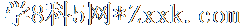
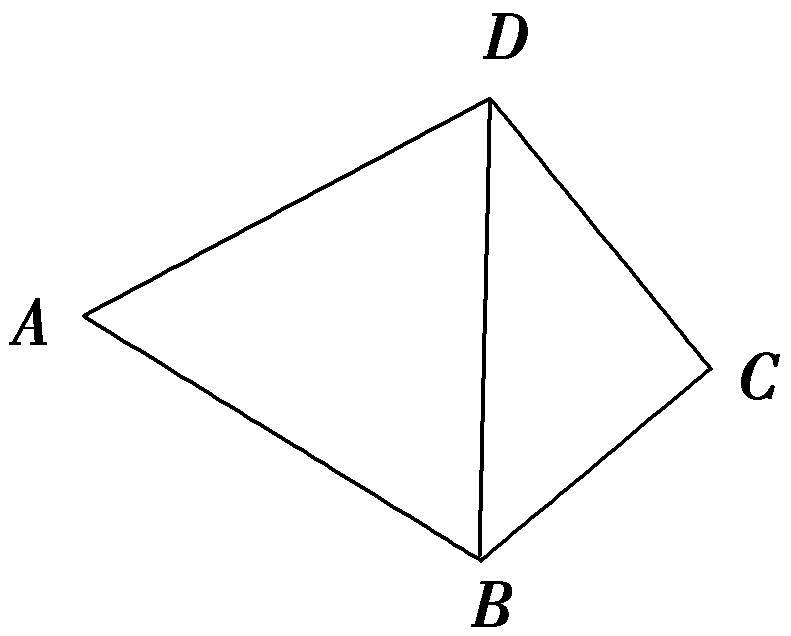
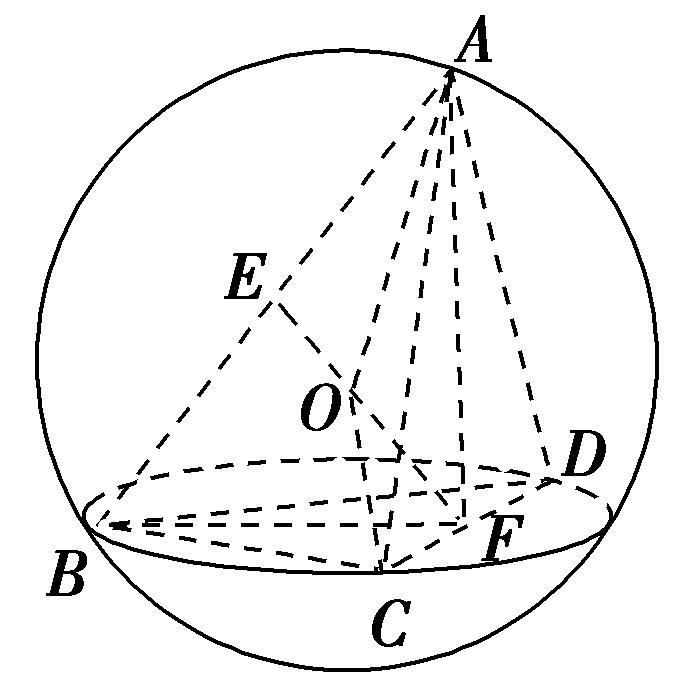
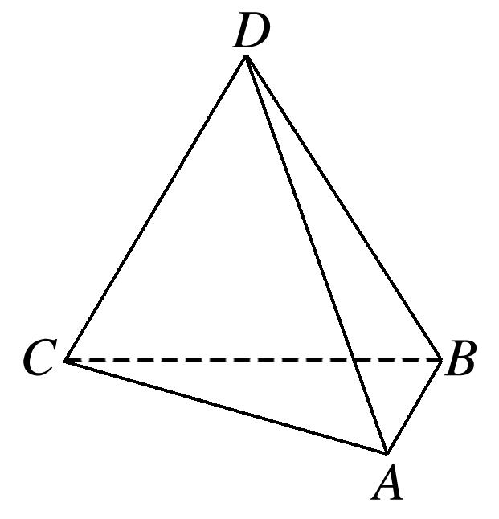
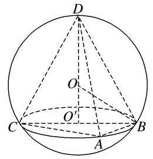
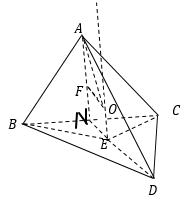
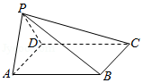

**专题五　切瓜模型**

**【方法总结】**

切瓜模型是有一侧面垂直底面的棱锥型，常见的是两个互相垂直的面都是特殊三角形且平面<em>ABC</em>⊥平面<em>BCD</em>，如类型Ⅰ，△<em>ABC</em>与△<em>BCD</em>都是直角三角形，类型Ⅱ，△<em>ABC</em>是等边三角形，△<em>BCD</em>是直角三角形，类型Ⅲ，△<em>ABC</em>与△<em>BCD</em>都是等边三角形，解决方法是分别过△<em>ABC</em>与△<em>BCD</em>的外心作该三角形所在平面的垂线，交点<em>O</em>即为球心．类型Ⅳ，△<em>ABC</em>与△<em>BCD</em>都一般三角形，解决方法是过△<em>BCD</em>的外心<em>O</em>1作该三角形所在平面的垂线，用代数方法即可解决问题．设三棱锥<em>A</em>－<em>BCD</em>的高为<em>h</em>，外接球的半径为<em>R</em>，球心为<em>O</em>．△<em>BCD</em>的外心为<em>O</em>1，<em>O</em>1到<em>BD</em>的距离为<em>d</em>，<em>O</em>与<em>O</em>1的距离为<em>m</em>，则解得<em>R</em>．可用秒杀公式：<em>R</em>2＝<em>r</em>12＋<em>r</em>22－(其中<em>r</em>1、<em>r</em>2为两个面的外接圆的半径，<em>l</em>为两个面的交线的长)

**【例题选讲】**

<strong>[例]</strong>　(1)已知在三棱锥<em>P</em>－<em>ABC</em>中，<em>VP</em>­<em>ABC</em>＝，∠<em>APC</em>＝，∠<em>BPC</em>＝，<em>PA</em>⊥<em>AC</em>，<em>PB</em>⊥<em>BC</em>，且平面<em>PAC</em>⊥平面<em>PBC</em>，那么三棱锥<em>P</em>－<em>ABC</em>外接球的体积为\_\_\_\_\_\_\_\_．

答案　　解析　如图，取<em>PC</em>的中点<em>O</em>，连接<em>AO</em>，<em>BO</em>，设<em>PC</em>＝2<em>R</em>，则<em>OA</em>＝<em>OB</em>＝<em>OC</em>＝<em>OP</em>＝<em>R</em>，∴<em>O</em>是三棱锥<em>P</em>－<em>ABC</em>外接球的球心，易知，<em>PB</em>＝<em>R</em>，<em>BC</em>＝<em>R</em>，∵∠<em>APC</em>＝，<em>PA</em>⊥<em>AC</em>，<em>O</em>为<em>PC</em>的中点，∴<em>AO</em>⊥<em>PC</em>，又平面<em>PAC</em>⊥平面<em>PBC</em>，且平面<em>PAC</em>∩平面<em>PBC</em>＝<em>PC</em>，∴<em>AO</em>⊥平面<em>PBC</em>，∴<em>VP</em>­<em>ABC</em>＝<em>VA</em>­<em>PBC</em>＝××<em>PB</em>×<em>BC</em>×<em>AO</em>＝××<em>R</em>×<em>R</em>×<em>R</em>＝，解得<em>R</em>＝2，∴三棱锥<em>P</em>－<em>ABC</em>外接球的体积<em>V</em>＝π<em>R</em>3＝．

(2)如图，已知平面四边形*ABCD*满足*AB*＝*AD*＝2，∠*A*＝60˚，∠*C*＝90˚，将△*ABD*沿对角线*BD*翻折，使平面*ABD*⊥平面*CBD*，则四面体*ABCD*外接球的体积为\_\_\_\_\_\_\_\_．

答案　　解析　在四面体<em>ABCD</em>中，∵<em>AB</em>＝<em>AD</em>＝2，∠<em>BAD</em>＝60˚，∴△<em>ABD</em>为正三角形，设<em>BD</em>的中点为<em>M</em>，连接<em>AM</em>，则<em>AM</em>⊥<em>BD</em>，又平面<em>ABD</em>⊥平面<em>CBD</em>，平面<em>ABD</em>∩平面<em>CBD</em>＝<em>BD</em>，∴<em>AM</em>⊥平面<em>CBD</em>．∵△<em>CBD</em>为直角三角形，∴其外接圆的圆心是斜边<em>BD</em>的中点<em>M</em>，由球的性质知，四面体<em>ABCD</em>外接球的球心必在线段<em>AM</em>上，又△<em>ABD</em>为正三角形，∴球心是△<em>ABD</em>的中心，则外接球的半径为×2×＝，∴四面体<em>ABCD</em>外接球的体积为×π×()3＝．

(3)已知三棱锥*A－BCD*中，△*ABD*与△*BCD*是边长为2的等边三角形且二面角*A－BD－C*为直二面角，则三棱锥*A－BCD*的外接球的表面积为(　　)

A．　　　　　　　　B．5π　　　　　　　　C．6π　　　　　　　　D．

答案　D　解析　如图，取<em>BD</em>中点<em>M</em>，连接<em>AM</em>，<em>CM</em>，取△<em>ABD</em>，△<em>CBD</em>的中心即<em>AM</em>，<em>CM</em>的三等分点<em>P</em>，<em>Q</em>，过<em>P</em>作平面<em>ABD</em>的垂线，过<em>Q</em>作平面<em>CBD</em>的垂线，两垂线相交于点<em>O</em>，则点<em>O</em>为外接球的球心，如图，其中<em>OQ</em>＝，<em>CQ</em>＝，连接<em>OC</em>，则外接球的半径<em>R</em>＝<em>OC</em>＝，表面积为4π<em>R</em>2＝，故选D．

(4)已知是以为斜边的直角三角形，为平面外一点，且平面平面，，，，则三棱锥外接球的表面积为\_\_\_\_\_\_\_\_．

答案　　解析　由题意知的中点为外接圆的圆心，且平面平面，过作面的垂线，则垂线一定在面内．根据球的性质，球心一定在垂线上，球心一定在平面内，且球心也是外接圆的圆心．在中，由余弦定理得，，由正弦定理得：，解得，三棱锥的外接球的表面积．

(5)已知等腰直角三角形*ABC*中，*AB*＝*AC*＝2，*D*，*E*分别为*AB*，*AC*的中点，沿*DE*将△*ABC*折成直二面角(如图)，则四棱锥*A*－*DECB*的外接球的表面积为\_\_\_\_\_\_\_\_．

答案　10π　解析　取<em>DE</em>的中点<em>M</em>，<em>BC</em>的中点<em>N</em>，连接<em>MN</em>(图略)，由题意知，<em>MN</em>⊥平面<em>ADE</em>，因为△<em>ADE</em>是等腰直角三角形，所以△<em>ADE</em>的外接圆的圆心是点<em>M</em>，四棱锥<em>A</em>－<em>DECB</em>的外接球的球心在直线<em>MN</em>上，又等腰梯形<em>DECB</em>的外接圆的圆心在<em>MN</em>上，所以四棱锥<em>A</em>－<em>DECB</em>的外接球的球心就是等腰梯形<em>DECB</em>的外接圆的圆心．连接<em>BE</em>，易知△<em>BEC</em>是钝角三角形，所以等腰梯形<em>DECB</em>的外接圆的圆心在等腰梯形<em>DECB</em>的外部．设四棱锥<em>A</em>－<em>DECB</em>的外接球的半径为<em>R</em>，球心到<em>BC</em>的距离为<em>d</em>，则解得<em>R</em>2＝，故四棱锥<em>A</em>－<em>DECB</em>的外接球的表面积<em>S</em>＝4π<em>R</em>2＝10π．

**【对点训练】**

1．把边长为3的正方沿对角线对折，使得平面平面，则三棱锥的外接球的表面积为

A．　　　　　　　　B．　　　　　　　　C．　　　　　　　　D．

1．答案　C　解析　将边长为1的正方形，沿对角线把折起，使平面平面，

则，；三棱锥的外接球直径为，外接球的表面积为．

2．在三棱锥*A*－*BCD*中，△*ACD*与△*BCD*都是边长为4的正三角形，且平面*ACD*⊥平面*BCD*，则该三

棱锥外接球的表面积为\_\_\_\_\_\_\_\_．

2．答案　π　解析　取*AB*，*CD*的中点分别为*E*，*F*，连接*EF*，*AF*，*BF*，由题意知*AF*⊥*BF*，*AF*＝*BF*

＝2，<em>EF</em>＝＝，易知三棱锥的外接球球心<em>O</em>在线段<em>EF</em>上，所以<em>OE</em>＋<em>OF</em>＝，设外接球的半径为<em>R</em>，连接<em>OA</em>，<em>OC</em>，则有<em>R</em>2＝<em>AE</em>2＋<em>OE</em>2，<em>R</em>2＝<em>CF</em>2＋<em>OF</em>2，所以<em>AE</em>2＋<em>OE</em>2＝<em>CF</em>2＋<em>OF</em>2，()2＋<em>OE</em>2＝22＋<em>OF</em>2，所以<em>OF</em>2－<em>OE</em>2＝2，又<em>OE</em>＋<em>OF</em>＝，则<em>OF</em>2＝，<em>R</em>2＝，所以该三棱锥外接球的表面积为4π<em>R</em>2＝π．

3．已知如图所示的三棱锥*D*－*ABC*的四个顶点均在球*O*的球面上，△*ABC*和△*DBC*所在的平面互相垂

直，*AB*＝3，*AC*＝，*BC*＝*CD*＝*BD*＝2，则球*O*的表面积为(　　)

A．4π　　　　　　　　B．12π　　　　　　　　C．16π　　　　　　　　D．36π

3．答案　C　解析　如图所示，∵<em>AB</em>2＋<em>AC</em>2＝<em>BC</em>2，∴∠<em>CAB</em>为直角，即△<em>ABC</em>外接圆的圆心为<em>BC</em>的中

点<em>O</em>′．△<em>ABC</em>和△<em>DBC</em>所在的平面互相垂直，则球心在过△<em>DBC</em>的圆面上，即△<em>DBC</em>的外接圆为球的大圆，由等边三角形的重心和外心重合，易得球半径<em>R</em>＝2，球的表面积为<em>S</em>＝4π<em>R</em>2＝16π，故选C．

4．在三棱锥中，平面平面，是边长为2的正三角形，若，三棱

锥的各个顶点均在球上，则球的表面积为(　　)．

A．　　　　　　　　B．　　　　　　　　C．　　　　　　　　D．

4．答案　D　解析　记外接圆圆心为，外接圆圆心为，连结，，则平面

，平面；取中点，连结，因为是边长为2的正三角形，所以过点，且；在中，，，设外接圆为，则，所以，故，所以有，因为为中点，所以，且；又平面平面，所以平面，平面；因此且，设三棱锥外接球半径为，则，因此，球的表面积为．故选D．

5．已知空间四边形，，，，，且平面平面

，则该几何体的外接球的表面积为

A．　　　　　　　　B．　　　　　　　　C．　　　　　　　　D．

5．答案　B　解析　在三角形中，，，由余弦定理可得

，而在三角形中，，，，即为直角三角形，且为斜边，因为平面平面，所以几何体的外接球的球心为为三角形 的外接圆的圆心，设外接球的半径为，则，即，所以外接球的表面积，

6．如图，已知四棱锥的底面为矩形，平面平面，，，则四棱锥的外接球的表面积为

A．　　　　　　　　B．　　　　　　　　C．　　　　　　　　D．

6．答案　D　解析　取的中点，连接，中，，，，

，设的中心为，球心为，则，设到平面的距离为，则，，，四棱锥的外接球的表面积为．

7．在四棱锥中，是边长为6的正三角形，是正方形，平面平面，

则该四棱锥的外接球的体积为

A．　　　　　　　B．　　　　　　　C．　　　　　　　D．

7．答案　D　解析　四棱锥中，是边长为6的正三角形，是正方形，平面

平面，如图所示：是边长为6的正三角形，所以的中心到中点的距离为，所以，所以，

8．已知空间四边形，，，，且平面平面，则

空间四边形的外接球的表面积为

A．　　　　　　　　B．　　　　　　　　C．　　　　　　　　D．

8．答案　A　解析　借助长方体作出空间四边形，取中点，在等腰中，

，，可求得，，又，为正三角形，外接球球心在过其中心垂直于平面的直线上，如图：在中，求得，，，设，则，在中，，在中，，由列方程解得，从而即外接球半径，外接球面积，

9．在三棱锥中，，，，平面平面，则三棱

锥外接球的表面积为\_\_\_\_\_\_\_\_．

9．答案　　解析　如图，设的外接圆的圆心为，连接，，，连接

．由题意可得，且，．因为平面平面，且，所以平面，且．设为三棱锥外接球的球心，连接，，，过作，垂足为，则外接球的半径满足，即，解得，从而，故三棱锥外接球的表面积为．

10．在三棱锥中，平面平面，，且直线与平面

所成角的正切值为2，则该三棱锥的外接球的表面积为

A．　　　　　　　　B．　　　　　　　　C．　　　　　　　　D．

10．答案　B　解析　如图，过点作于，为的中点，设的外心是，半径是，

连接，，，由正弦定理得，则，为的中点，，，所以，因为平面平面， 于，平面平面，则平面，所以直线与平面所成的角是，则，即，因为，所以，则，故，设三棱锥外接球球心是，连接，，，过作 于，则平面，于是，从而 是矩形，所以外接球半径满足，解得．所以外接球的表面积为．

