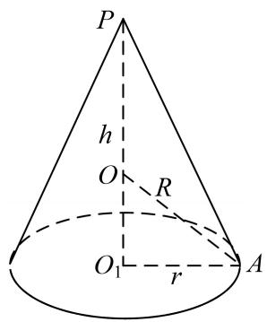
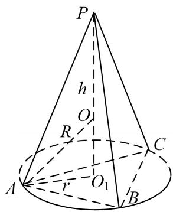
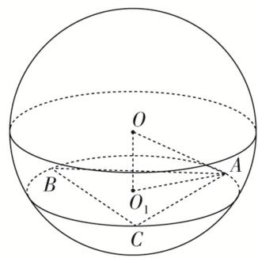
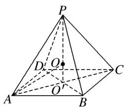
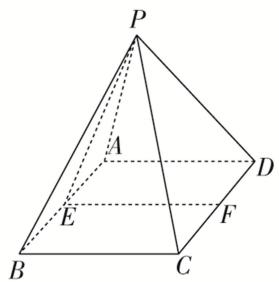
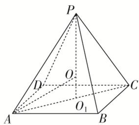

# 专题六 斗笠模型

# 【方法总结】

圆锥、顶点在底面的射影是底面外心的棱锥．秒杀公式： $R=\frac{h^{2}+r^{2}}{2h}$ （其中 h 为几何体的高，r 为几何体的底面半径或底面外接圆的圆心）

text_image

P
h
O
R
O₁
r
A

text_image

P
h
O
R
C
A
r
O₁
B

# 【例题选讲】

[例] (1)一个圆锥恰有三条母线两两夹角为 $60^{\circ}$ , 若该圆锥的侧面积为 $3 \sqrt{3} \pi$ , 则该圆锥外接球的表面积为 \_\_\_\_.

(2)(2020·全国I)已知 A, B, C 为球 O 的球面上的三个点， $\odot O_{1}$ 为 $\triangle ABC$ 的外接圆．若 $\odot O_{1}$ 的面积为 $4\pi$ ， $AB = BC = AC = OO_{1}$ ，则球 O 的表面积为()

A. $64\pi$

B. $48\pi$

C. $36\pi$

D. $32\pi$

text_image

O
B
O₁
A
C

(3)在三棱锥 P-ABC 中， $PA=PB=PC=2\sqrt{6}, AC=AB=4$ ，且 $AC \perp AB$ ，则该三棱锥外接球的表面积为 \_\_\_\_.

(4)正四棱锥的顶点都在同一球面上，若该棱锥的高为 4，底面边长为 2，则该球的表面积为( )

A. $\frac{81\pi}{4}$

B. $16\pi$

C. $9\pi$

D. $\frac{27\pi}{4}$

text_image

P
D O C
A O B

(5)如图所示, 在正四棱锥 $P - ABCD$ 中, 底面 $ABCD$ 是边长为 4 的正方形, $E$ , $F$ 分别是 $AB$ , $CD$ 的中点, $\cos \angle PEF = \frac{\sqrt{2}}{2}$ , 若 $A, B, C, D$ , $P$ 在同一球面上, 则此球的体积为 \_\_\_\_.

text_image

P
A
D
E
F
B
C

text_image

P
O
D
C
A
O₁
B

(6)在三棱锥 $P - ABC$ 中， $PA = PB = PC = \sqrt{2}$ ， $AB = AC = 1$ ， $BC = \sqrt{3}$ ，则该三棱锥外接球的体积为（）

A. $\frac{4\pi}{3}$

B. $\frac{8\sqrt{2}}{3}\pi$

C. $4\sqrt{3}\pi$

D. $\frac{32}{3}\pi$

# 【对点训练】

1. 已知圆锥的顶点为 $P$ ，母线 $PA$ 与底面所成的角为 $30^{\circ}$ ，底面圆心 $O$ 到 $PA$ 的距离为 1，则该圆锥外接球的表面积为 \_\_\_\_.

2. 在三棱锥 $P - ABC$ 中, $PA = PB = PC = \sqrt{3}$ , 侧棱 $PA$ 与底面 $ABC$ 所成的角为 $60^{\circ}$ , 则该三棱锥外接球的体积为( )

A. $\pi$

B. $\frac{\pi}{3}$

C. $4\pi$

D. $\frac{4\pi}{3}$

3. 在三棱锥 $P - ABC$ 中， $PA = PB = PC = \sqrt{6}$ ， $AC = AB = 2$ ，且 $AC \perp AB$ ，则该三棱锥外接球的表面积为（）

A. $4\pi$

B. $8\pi$

C. $16\pi$

D. $9\pi$

4. 已知体积为 $\sqrt{3}$ 的正三棱锥 $P - ABC$ 的外接球的球心为 $O$ ，若满足 $\overrightarrow{OA} + \overrightarrow{OB} + \overrightarrow{OC} = \overrightarrow{0}$ ，则此三棱锥外接球的半径是（ ）

A. 2

B. $\sqrt{2}$

C. $\sqrt[3]{2}$

D. $\sqrt[3]{4}$

5. 已知正四棱锥 $P - ABCD$ 的各顶点都在同一球面上, 底面正方形的边长为 $\sqrt{2}$ , 若该正四棱锥的体积为 2 , 则此球的体积为 ( )

A. $\frac{124\pi}{3}$

B. $\frac{625\pi}{81}$

C. $\frac{500\pi}{81}$

D. $\frac{256\pi}{9}$

6. 已知圆锥的顶点为 $S$ ，母线 $SA$ ， $SB$ 互相垂直， $SA$ 与圆锥底面所成角为 $30^{\circ}$ ，若 $\Delta SAB$ 的面积为 8，则该圆锥外接球的表面积是 \_\_\_\_.

7. 已知圆台 $O_{1}O_{2}$ 上底面圆 $O_{1}$ 的半径为 2，下底面圆 $O_{2}$ 的半径为 $2\sqrt{2}$ ，圆台的外接球的球心为 $O$ ，且球心在圆台的轴 $O_{1}O_{2}$ 上，满足 $|O_{1}O|=3|OO_{2}|$ ，则圆台 $O_{1}O_{2}$ 的外接球的表面积为 \_\_\_\_.

8. 在六棱锥 $P - ABCDEF$ 中, 底面是边长为 $\sqrt{2}$ 的正六边形, $PA = 2$ 且与底面垂直, 则该六棱锥外接球的体积等于 \_\_\_\_.

9. 在三棱锥 $P - ABC$ 中, $PA = PB = PC = 2$ , $AB = \sqrt{2}$ , $BC = \sqrt{10}$ , $\angle APC = \frac{\pi}{2}$ , 则三棱锥 $P - ABC$ 的外接球的表面积为 \_\_\_\_.

10. 在三棱锥 $P - ABC$ 中， $PA = PB = PC = 9\sqrt{2}$ ， $AB = 8$ ， $AC = 6$ 。顶点 $P$ 在平面 $ABC$ 内的射影为 $H$ ，若 $\overrightarrow{AH} = \lambda \overrightarrow{AB} + \mu \overrightarrow{AC}$ 且 $\mu + 2\lambda = 1$ ，则三棱锥 $P - ABC$ 的外接球的体积为 \_\_\_\_.

