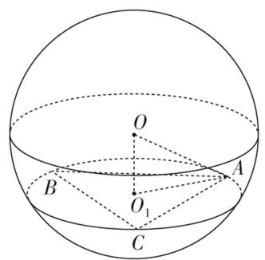
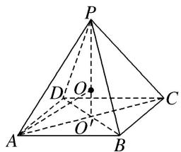
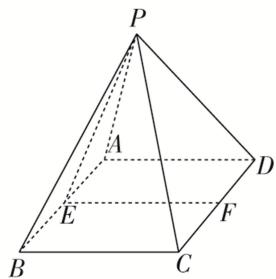
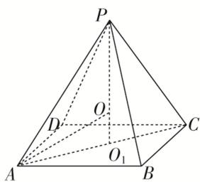
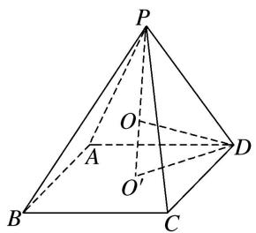

# 专题六 斗笠模型

# 【方法总结】

圆锥、顶点在底面的射影是底面外心的棱锥．秒杀公式： $R=\frac{h^{2}+r^{2}}{2h}$ （其中 h 为几何体的高，r 为几何体的底面半径或底面外接圆的圆心）

text_image

P
h
O
R
O₁
r
A

text_image

P
h
O
R
A
r
O₁
B
C

# 【例题选讲】

[例] (1)一个圆锥恰有三条母线两两夹角为 $60^{\circ}$ , 若该圆锥的侧面积为 $3 \sqrt{3} \pi$ , 则该圆锥外接球的表面积为 \_\_\_\_.

答案 $\frac{27\pi}{2}$ 解析 设 $\angle ASB = \angle BSC = \angle CSA = 60^{\circ}$ ，则 $SA = SB = SC = AB = AC = BC$ 。设 $AB = x$ ，则底面圆的直径为 $2r = \frac{x}{\sin 60^{\circ}} = \frac{2x}{\sqrt{3}}$ ，该圆锥的侧面积为 $\frac{1}{2}\pi \cdot \frac{2x}{\sqrt{3}} \cdot x = 3\sqrt{3}\pi$ ，解得 $x = 3$ ，高 $OS = \sqrt{3^{2} - (\sqrt{3})^{2}} = \sqrt{6}$ 。 $\therefore r = \frac{3}{\sqrt{3}} = \sqrt{3}$ 。设圆锥外接球的半径为 $R$ ，所以 $(\sqrt{6} - R)^{2} + r^{2} = R^{2}$ ，解得 $R = \frac{3\sqrt{6}}{4}$ ，则外接球的表面积为 $4\pi R^{2} = \frac{27\pi}{2}$ 。

(2)(2020·全国I)已知 A, B, C 为球 O 的球面上的三个点， $\odot O_{1}$ 为 $\triangle ABC$ 的外接圆．若 $\odot O_{1}$ 的面积为 $4\pi$ ， $AB = BC = AC = OO_{1}$ ，则球 O 的表面积为()

A. $64\pi$

B. $48\pi$

C. $36\pi$

D. $32\pi$

答案 A 解析 设 $\odot O_{1}$ 的半径为 $r$ ，球的半径为 $R$ ，依题意，得 $\pi r^{2} = 4\pi, \therefore r = 2$ 。由正弦定理可得 $\frac{AB}{\sin 60^{\circ}} = 2r, \therefore AB = 2r \sin 60^{\circ} = 2\sqrt{3}$ 。 $\therefore OO_{1} = AB = 2\sqrt{3}$ 。根据球的截面性质，得 $OO_{1} \perp$ 平面 $ABC, \therefore OO_{1} \perp O_{1}A, R = OA = \sqrt{OO_{1}^{2} + O_{1}A^{2}} = \sqrt{OO_{1}^{2} + r^{2}} = 4,$ 。 $\therefore$ 球 $O$ 的表面积 $S = 4\pi R^{2} = 64\pi$ 。故选 A.

text_image

O
B
O₁
A
C

(3)在三棱锥 $P - ABC$ 中， $PA = PB = PC = 2\sqrt{6}, AC = AB = 4$ ，且 $AC \perp AB$ ，则该三棱锥外接球的表

面积为\_\_\_\_。

答案 $36\pi$ 解析 设顶点 $P$ 在底面中的射影为 $O_{1}$ ，由于 $PA = PB = PC$ ，所以 $O_{1}A = O_{1}B = O_{1}C$ ，即点 $O_{1}$ 是底面 $\Delta ABC$ 的外心，又 $AC \perp AB$ ，所以 $O_{1}$ 为 $BC$ 的中点，因为 $PA = PB = PC = 2\sqrt{6}, AC = AB = 4$ ，所以 $BC = 4\sqrt{2}, AO_{1} = 2\sqrt{2}, PO_{1} = 4$ ，设外接球的球心为 $O$ ，半径为 $R$ ，则 $O$ 必在 $PO_{1}$ 上， $O_{1}O = 4 - R$ ，在 $Rt\Delta O_{1}OA$ 中， $(4 - R)^{2} + (2\sqrt{2})^{2} = R^{2}$ ，解得 $R = 3$ ，所以 $S_{2} = 4\pi R^{2} = 36\pi$ 。

(4)正四棱锥的顶点都在同一球面上，若该棱锥的高为4，底面边长为2，则该球的表面积为( )

A. $\frac{81\pi}{4}$

B. $16\pi$

C. $9\pi$

D. $\frac{27\pi}{4}$

答案 A 解析 如图所示，设球半径为 R，底面中心为 $O'$ 且球心为 O，∵ 正四棱锥 P-ABCD 中 AB = 2，∴ $AO' = \sqrt{2}$ ，∵ $PO' = 4$ ，∴ 在 Rt△AOO' 中， $AO^{2} = AO'^{2} + OO'^{2}$ ，∴ $R^{2} = (\sqrt{2})^{2} + (4 - R)^{2}$ ，解得 $R = \frac{9}{4}$ ，∴ 该球的表面积为 $4\pi R^{2} = 4\pi \times \left(\frac{9}{4}\right)^{2} = \frac{81\pi}{4}$ .

text_image

Geometric diagram of a pyramid with labeled vertices and internal points, used in spatial geometry problems.

(5)如图所示, 在正四棱锥 $P - ABCD$ 中, 底面 $ABCD$ 是边长为 4 的正方形, $E$ , $F$ 分别是 $AB$ , $CD$ 的中点, $\cos \angle PEF = \frac{\sqrt{2}}{2}$ , 若 $A, B, C, D, P$ 在同一球面上, 则此球的体积为 \_\_\_\_.

text_image

P
A
D
E
F
B
C

答案 $36\pi$ 解析 由题意，得底面ABCD是边长为4的正方形， $\cos \angle PEF = \frac{\sqrt{2}}{2}$ ，故高 $PO_{1}$ 为2．易知正四棱锥 $P - ABCD$ 的外接球的球心在它的高 $PO_{1}$ 上，记球心为 $O$ ，则 $AO_{1} = 2\sqrt{2}$ ， $PO = AO = R$ ， $PO_{1} = 2$ ， $OO_{1} = 2 - R$ 或 $OO_{1} = R - 2$ （此时 $O$ 在 $PO_{1}$ 的延长线上），在直角 $\triangle AO_{1}O$ 中， $R^{2} = AO_{1}^{2} + OO_{1}^{2} = (2\sqrt{2})^{2} + (2 - R)^{2}$ ，解得 $R = 3$ ，所以球的体积为 $V = \frac{4}{3}\pi R^{3} = \frac{4\pi}{3} \times 3^{3} = 36\pi$ ．

text_image

P
O
D
C
O₁
A
B

(6)在三棱锥 $P - ABC$ 中， $PA = PB = PC = \sqrt{2}$ ， $AB = AC = 1$ ， $BC = \sqrt{3}$ ，则该三棱锥外接球的体积为（）

A. $\frac{4\pi}{3}$

B. $\frac{8\sqrt{2}}{3}\pi$

C. $4 \sqrt{3} \pi$

D. $\frac{32}{3}\pi$

答案 A 解析 由 $PA = PB = PC = \sqrt{2}$ ，过 $P$ 作 $PG \perp$ 平面 $ABC$ ，垂足为 $G$ ，则 $G$ 为三角形 $ABC$ 的外心，在 $\Delta ABC$ 中，由 $AB = AC = 1$ ， $BC = \sqrt{3}$ ，可得 $\angle BAC = 120^\circ$ ，则由正弦定理可得： $\frac{\sqrt{3}}{\sin 120^\circ} = 2AG$ ，即 $AG = 1$ 。\$\therefore PG = \sqrt{PA^2 - AG^2} = 1\$。取 $PA$ 中点 $H$ ，作 $HO \perp PA$ 交 $PG$ 于 $O$ ，则 $O$ 为该三棱锥外接球的球心。由 $\Delta PHO \sim \Delta PGA$ ，可得 $\frac{PH}{PO} = \frac{PG}{PA}$ ，则 $PO = \frac{PH \cdot PA}{PG} = \frac{\frac{\sqrt{2}}{2} \times \sqrt{2}}{1} = 1$ 。可知 $O$ 与 $G$ 重合，即该棱锥外接球半径为 1。\$\therefore\$该三棱锥外接球的体积为 $\frac{4\pi}{3}$ 。

# 【对点训练】

1. 已知圆锥的顶点为 $P$ ，母线 $PA$ 与底面所成的角为 $30^{\circ}$ ，底面圆心 $O$ 到 $PA$ 的距离为 1，则该圆锥外接球的表面积为 \_\_\_\_.

1. 答案 $\frac{64\pi}{3}$ 解析 依题意得，圆锥底面半径 $r = \frac{1}{\sin 30^\circ} = 2$ ，高 $h = \frac{1}{\sin 60^\circ} = \frac{2\sqrt{3}}{3}$ 。设圆锥外接球半径为 $R$ ，则 $R^2 = r^2 + (R - h)^2$ ，即 $R^2 = 2^2 + (R - \frac{2\sqrt{3}}{3})^2$ ，解得： $R = \frac{4\sqrt{3}}{3}$ 。∴外接球的表面积为 $S = 4\pi R^2 = \frac{64\pi}{3}$ 。

2. 在三棱锥 $P - ABC$ 中， $PA = PB = PC = \sqrt{3}$ ，侧棱 $PA$ 与底面 $ABC$ 所成的角为 $60^{\circ}$ ，则该三棱锥外接球的体积为（）

A. $\pi$

B. $\frac{\pi}{3}$

C. $4\pi$

D. $\frac{4\pi}{3}$

2. 答案 解析 过 $P$ 点作底面 $ABC$ 的垂线，垂足为 $O$ ，设 $H$ 为外接球的球心，连接 $AH, AO$ ，因 $\angle PAO = 60^{\circ}$ ， $PA = \sqrt{3}$ ，故 $AO = \frac{\sqrt{3}}{2}$ ， $PO = \frac{3}{2}$ ，又 $\Delta AHO$ 为直角三角形， $AH = PH = r$ ， $\therefore$

$$
A H ^ {2} = A O ^ {2} + O H ^ {2}, \quad \therefore r ^ {2} = (\frac {\sqrt {3}}{2}) ^ {2} + (\frac {3}{2} - r) ^ {2}, \quad \therefore r = 1, \quad \therefore V = \frac {4}{3} \pi \times 1 ^ {3} = \frac {4}{3} \pi .
$$

3. 在三棱锥 $P - ABC$ 中， $PA = PB = PC = \sqrt{6}$ ， $AC = AB = 2$ ，且 $AC \perp AB$ ，则该三棱锥外接球的表面积为（）

A. $4\pi$

B. $8\pi$

C. $16\pi$

D. $9\pi$

3. 答案 D 解析 由题意，点 P 在底面上的射影 M 是 CB 的中点，是三角形 ABC 的外心，令球心为 O，
∵ AC = AB = 2，且 $AC \perp AB$ ，∴ $MB = MC = MA = \sqrt{2}$ ，又∵ PA = PB = PC = $\sqrt{6}$ ，∴ $PM = \sqrt{6 - 2} = 2$ 如图在直角三角形 OBM 中， $OB^{2}=OM^{2}+BM^{2}$ ，即 $R^{2}=2+(2-R)^{2}$ ，∴ $R=\frac{3}{2}$ ，则该三棱锥外接球的

表面积为 $4\pi R^{2} = 4\pi \times \frac{9}{4} = 9\pi$

4. 已知体积为 $\sqrt{3}$ 的正三棱锥 $P - ABC$ 的外接球的球心为 $O$ ，若满足 $\overrightarrow{OA} + \overrightarrow{OB} + \overrightarrow{OC} = \vec{0}$ ，则此三棱锥外接球的半径是（ ）

A. 2

B. $\sqrt{2}$

C. $\sqrt[3]{2}$

D. $\sqrt[3]{4}$

4. 答案 D 解析 正三棱锥 $D - ABC$ 的外接球的球心 $O$ 满足 $\overrightarrow{OA} + \overrightarrow{OB} = \overrightarrow{CO}$ ，说明三角形 $ABC$ 在球 $O$ 的大圆上，并且为正三角形，设球的半径为： $R$ ，棱锥的底面正三角形 $ABC$ 的高为 $\frac{3R}{2}$ ，底面三角形 $ABC$ 的边长为 $\sqrt{3} R$ ，正三棱锥的体积为 $\frac{1}{3} \times \frac{\sqrt{3}}{4} \times (\sqrt{3} R)^2 \times R = \sqrt{3}$ ，解得 $R^3 = 4$ ，则此三棱锥外接球的半径是 $R = \sqrt[3]{4}$ .

5. 已知正四棱锥 $P - ABCD$ 的各顶点都在同一球面上, 底面正方形的边长为 $\sqrt{2}$ , 若该正四棱锥的体积为 2 , 则此球的体积为 ( )

A. $\frac{124\pi}{3}$

B. $\frac{625\pi}{81}$

C. $\frac{500\pi}{81}$

D. $\frac{256\pi}{9}$

5. 答案 C 解析 如图所示, 设底面正方形 $ABCD$ 的中心为 $O'$ , 正四棱锥 $P-ABCD$ 的外接球的球心为 $O$ ,

text_image

P
O
A
O'
B
C
D

∵底面正方形的边长为 $\sqrt{2}$ ，∴ $O'D=1$ ，∵正四棱锥的体积为2，∴ $V_{P-ABCD}=\frac{1}{3}\times(\sqrt{2})^{2}\times PO'=2$ ，解得 $PO'=3$ ，∴ $OO'=|PO'-PO|=|3-R|$ ，在Rt△OO'D中，由勾股定理可得 $OO'^{2}+O'D^{2}=OD^{2}$ ，即 $(3-R)^{2}+1^{2}=R^{2}$ ，解得 $R=\frac{5}{3}$ ，∴ $V_{球}=\frac{4}{3}\pi R^{3}=\frac{4}{3}\pi\times\left(\frac{5}{3}\right)^{3}=\frac{500\pi}{81}$ .

6. 已知圆锥的顶点为 $S$ ，母线 $SA$ ， $SB$ 互相垂直， $SA$ 与圆锥底面所成角为 $30^{\circ}$ ，若 $\Delta SAB$ 的面积为 8，则该圆锥外接球的表面积是 \_\_\_\_.

6. 答案 $64\pi$ 解析 如图，设母线长为 $a$ ， $\because SA \perp SB$ ， $\therefore S_{\triangle SAB} = \frac{1}{2} a^2 = 8$ ， $\therefore a = 4$ ， $\because \angle SAM = 30^\circ$ ， $\therefore \angle ASC = 120^\circ$ ，延长 $SM$ 使 $MO = MS$ ，则 $O$ 为外接球球心，半径为 4， $\therefore$ 表面积为 $64\pi$ 。

7. 已知圆台 $O_{1}O_{2}$ 上底面圆 $O_{1}$ 的半径为 2，下底面圆 $O_{2}$ 的半径为 $2\sqrt{2}$ ，圆台的外接球的球心为 $O$ ，且球心在圆台的轴 $O_{1}O_{2}$ 上，满足 $|O_{1}O|=3|OO_{2}|$ ，则圆台 $O_{1}O_{2}$ 的外接球的表面积为 \_\_\_\_.

7. 答案 $34\pi$ 解析 设外接球的半径为 $R$ ， $|O_1O| = \sqrt{R^2 - 2^2}$ ， $|OO_2| = \sqrt{R^2 - (2\sqrt{2})^2}$ ，且 $|O_1O| = 3|OO_2|$ ，得 $R^2 - 4 = 9R^2 - 72$ ，解得 $R^2 = \frac{17}{2}$ ，球 $O$ 的表面积为 $4\pi R^2 = 34\pi$ 。

8. 在六棱锥 $P - ABCDEF$ 中, 底面是边长为 $\sqrt{2}$ 的正六边形, $PA = 2$ 且与底面垂直, 则该六棱锥外接球的体积等于 \_\_\_\_.

8. 答案 $4\sqrt{3}\pi$ 解析 六棱锥 $P - ABCDEF$ 中，底面是边长为 $\sqrt{2}$ 的正六边形， $PA = 2$ 且与底面垂直，可得 $PD$ 是该六棱锥外接球的直径，底面是边长为 $\sqrt{2}$ 的正六边形的对角线差为： $2\sqrt{2}$ ，可得 $PD = \sqrt{2^2 + (2\sqrt{2})^2} = \sqrt{12} = 2\sqrt{3}$ ，外接球的半径为 $\sqrt{3}$ ，外接球的体积为 $\frac{4}{3}\pi r^3 = \frac{4}{3} \times \pi \times (\sqrt{3})^3 = 4\sqrt{3}\pi$ 。

9. 在三棱锥 $P - ABC$ 中， $PA = PB = PC = 2$ ， $AB = \sqrt{2}$ ， $BC = \sqrt{10}$ ， $\angle APC = \frac{\pi}{2}$ ，则三棱锥 $P - ABC$ 的外接球的表面积为 \_\_\_\_.

9. 答案 $\frac{32\pi}{3}$ 解析 $\because PA = PC = 2, \angle APC = \frac{\pi}{2}, AC = \sqrt{PA^2 + PC^2} = 2\sqrt{2}$ , 又 $\because AB = \sqrt{2}, BC = \sqrt{10}, AC = 2\sqrt{2}$ , 则 $\angle BAC = 90^\circ$ , $\triangle ABC$ 为直角三角形, $\therefore Rt\triangle ABC$ 外接圆的圆心在 $BC$ 边的中点上, 设 Rt $\triangle ABC$ 外接圆的圆心为 $O_1$ , 所以三棱锥 $P - ABC$ 的外接球的球心 $O$ 在过 $O_1$ 且与平面 $ABC$ 垂直的直线上, 设外接球半径为 $R$ , 连接 $OA, OC$ , 则 $OA = OC = R$ , 所以要使 $OA = OC = OB = OP = R$ , 点 $O$ 在 $\triangle PBC$ 的外接圆圆心的位置即可, 又 $\because PB = PC = 2, BC = \sqrt{10}, \therefore \cos \angle BPC = \frac{PB^2 + PC^2 - BC^2}{2PB \cdot PC} = -\frac{1}{4}$ , 则 $\sin \angle BPC = \sqrt{1 - \cos^2 \angle BPC} = \frac{\sqrt{15}}{4}$ , 由正弦定理可得: $2R = \frac{BC}{\sin \angle BPC} = \frac{4\sqrt{6}}{3}$ , 解得, $R = \frac{2\sqrt{6}}{3}$ , $\therefore$ 三棱锥 $P - ABC$ 的外接球的表面积为 $4\pi R^2 = 4\pi \cdot (\frac{2\sqrt{6}}{3})^2 = \frac{32\pi}{3}$ .

10. 在三棱锥 $P - ABC$ 中， $PA = PB = PC = 9\sqrt{2}$ ， $AB = 8$ ， $AC = 6$ 。顶点 $P$ 在平面 $ABC$ 内的射影为 $H$ ，若 $\overrightarrow{AH} = \lambda \overrightarrow{AB} + \mu \overrightarrow{AC}$ 且 $\mu + 2\lambda = 1$ ，则三棱锥 $P - ABC$ 的外接球的体积为 \_\_\_\_.

10. 答案 $\frac{243}{2}\pi$ 解析 由于三棱锥 $P - ABC$ 的顶点 $P$ 在平面 $ABC$ 内的射影为点 $H$ ， $O$ 为球心， $OA = OB = OC = OP = R$ ， $\because \overrightarrow{AH} = \lambda \overrightarrow{AB} + \mu \overrightarrow{AC}$ ， $\therefore \overrightarrow{AH} \cdot \overrightarrow{AB} = \lambda \overrightarrow{AB}^2 + \mu \overrightarrow{AC} \cdot \overrightarrow{AB}$ ， $\frac{1}{2} |\overrightarrow{AB}|^2 = \lambda \overrightarrow{AB}^2$ ， $\therefore +\mu \overrightarrow{AC} \cdot \overrightarrow{AB}$ ，即 $32 = 64\lambda + \mu \overrightarrow{AC} \cdot \overrightarrow{AB}$ ，①，同理对①两边取点乘 $\overrightarrow{AC}$ ，可得， $18 = 36\mu + \lambda \overrightarrow{AC} \cdot \overrightarrow{AB}$ ，②，又 $\mu + 2\lambda = 1$ ③，由①②③解得， $\lambda = \frac{9}{20} (\frac{1}{2}$ 舍去）， $\mu = \frac{1}{10}$ ， $\overrightarrow{AC} \cdot \overrightarrow{AB} = 32$ ， $\therefore AH^2 = \frac{9}{20} \times 32 + \frac{1}{10} \times 18 = \frac{81}{5}$ ， $\because PA = PB = PC = 9\sqrt{2}$ ， $\therefore HP^2 = 81 \times 2 - \frac{81}{5} = \frac{81 \times 9}{5}$ ，又在直角三角形 $AOH$ 中， $R^2 = (HP - R)^2 + AH^2$ ，解得 $R = \frac{9}{2}$ ，则有球 $O$ 的体积 $V = \frac{4}{3}\pi R^3 = \frac{4}{3}\pi \cdot \frac{729}{8} = \frac{243}{2}\pi$ 。

