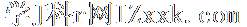
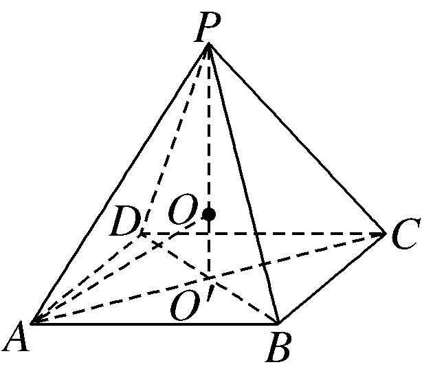
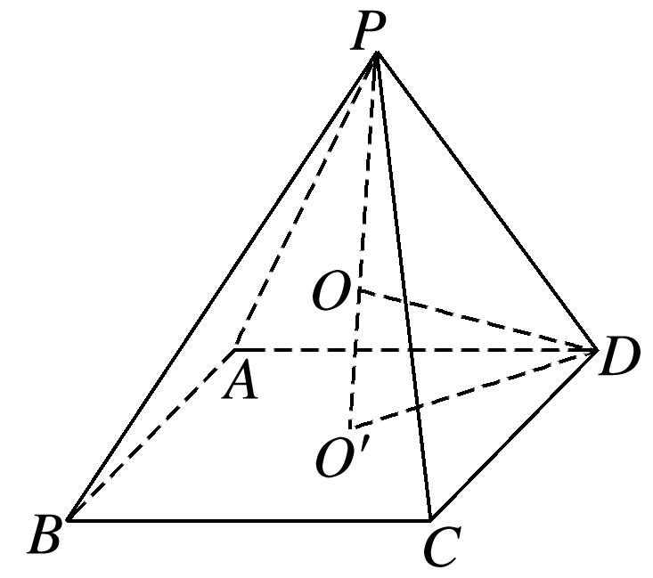

**专题六　斗笠模型**

**【方法总结】**

圆锥、顶点在底面的射影是底面外心的棱锥．秒杀公式：*R*＝(其中*h*为几何体的高，*r*为几何体的底面半径或底面外接圆的圆心)

**【例题选讲】**

**[例]**　(1)一个圆锥恰有三条母线两两夹角为，若该圆锥的侧面积为，则该圆锥外接球的表面积为\_\_\_\_\_\_\_\_．

答案　解析　设，则．设，则底面圆的直径为，该圆锥的侧面积为，解得，高．．设圆锥外接球的半径为，所以，解得，则外接球的表面积为．

(2)(2020·全国Ⅰ)已知<em>A</em>，<em>B</em>，<em>C</em>为球<em>O</em>的球面上的三个点，⊙<em>O</em>1为△<em>ABC</em>的外接圆．若⊙<em>O</em>1的面积为4π，<em>AB</em>＝<em>BC</em>＝<em>AC</em>＝<em>OO</em>1，则球<em>O</em>的表面积为(　　)

A．64π　　　　　　　　B．48π　　　　　　　　C．36π　　　　　　　　D．32π

答案　A　解析　设⊙<em>O</em>1的半径为<em>r</em>，球的半径为<em>R</em>，依题意，得π<em>r</em>2＝4π，∴<em>r</em>＝2．由正弦定理可得＝2<em>r</em>，∴<em>AB</em>＝2<em>r</em> sin 60°＝2．∴<em>OO</em>1＝<em>AB</em>＝2．根据球的截面性质，得<em>OO</em>1⊥平面<em>ABC</em>，∴<em>OO</em>1⊥<em>O</em>1<em>A</em>，<em>R</em>＝<em>OA</em>＝＝＝4，∴球<em>O</em>的表面积<em>S</em>＝4π<em>R</em>2＝64π．故选A．

(3)在三棱锥中，，且，则该三棱锥外接球的表面积为\_\_\_\_\_\_\_\_．

答案　36π　解析　设顶点在底面中的射影为，由于，所以，即点是底面的外心，又，所以为的中点，因为，所以，设外接球的球心为，半径为，则必在上，，在中，，解得，所以．

(4)正四棱锥的顶点都在同一球面上，若该棱锥的高为4，底面边长为2，则该球的表面积为(　　)

A．　　　　　　　　B．16π　　　　　　　　C．9π　　　　　　　　D．

答案　A　解析　如图所示，设球半径为<em>R</em>，底面中心为<em>O</em>′且球心为<em>O</em>，∵正四棱锥<em>P</em>­<em>ABCD</em>中<em>AB</em>＝2，∴<em>AO</em>′＝，∵<em>PO</em>′＝4，∴在Rt△<em>AOO</em>′中，<em>AO</em>2＝<em>AO</em>′2＋<em>OO</em>′2，∴<em>R</em>2＝()2＋(4－<em>R</em>)2，解得<em>R</em>＝，∴该球的表面积为4π<em>R</em>2＝4π×2＝.

(5)如图所示，在正四棱锥*P*－*ABCD*中，底面*ABCD*是边长为4的正方形，*E*，*F*分别是*AB*，*CD*的中点，cos∠*PEF*＝，若*A*，*B*，*C*，*D*，*P*在同一球面上，则此球的体积为\_\_\_\_\_\_\_\_．

答案　36π　解析　由题意，得底面<em>ABCD</em>是边长为4的正方形，cos ∠<em>PEF</em>＝，故高<em>PO</em>1为2．易知正四棱锥<em>P</em>－<em>ABCD</em>的外接球的球心在它的高<em>PO</em>1上，记球心为<em>O</em>，则<em>AO</em>1＝2，<em>PO</em>＝<em>AO</em>＝<em>R</em>，<em>PO</em>1＝2，<em>OO</em>1＝2－<em>R</em>或<em>OO</em>1＝<em>R</em>－2(此时<em>O</em>在<em>PO</em>1的延长线上)，在直角△<em>AO</em>1<em>O</em>中，<em>R</em>2＝<em>AO</em>＋<em>OO</em>＝(2)2＋(2－<em>R</em>)2，解得<em>R</em>＝3，所以球的体积为<em>V</em>＝π<em>R</em>3＝×33＝36π．

(6)在三棱锥中，，，，则该三棱锥外接球的体积为

A．　　　　　　　　B．　　　　　　　　C．　　　　　　　　D．

答案　A　解析　由，过作平面，垂足为，则为三角形的外心，在中，由，，可得，则由正弦定理可得：，即．．取中点，作交于，则为该三棱锥外接球的球心．由，可得，则．可知与重合，即该棱锥外接球半径为1．该三棱锥外接球的体积为．

**【对点训练】**

1．已知圆锥的顶点为，母线与底面所成的角为，底面圆心到的距离为1，则该圆锥外接

球的表面积为\_\_\_\_\_\_\_\_．

1．答案　　解析　依题意得，圆锥底面半径，高．设圆锥外接球半

径为，则，即，解得：．外接球的表面积为．

2．在三棱锥中，，侧棱与底面所成的角为，则该三棱锥外接球

的体积为(　　)

A．　　　　　　　　B．　　　　　　　　C．　　　　　　　　D．

2．答案　　解析　过点作底面*ABC*的垂线，垂足为，设为外接球的球心，连接，因

，，故，，又为直角三角形，，∴，∴，∴，∴．

3．在三棱锥中，，，且，则该三棱锥外接球的表面积为

A．　　　　　　　　B．　　　　　　　　C．　　　　　　　　D．

3．答案　D　解析　由题意，点在底面上的射影是的中点，是三角形的外心，令球心为，

，且，，又，

如图在直角三角形中，，即，，则该三棱锥外接球的表面积为．

4．已知体积为的正三棱锥的外接球的球心为，若满足，则此三棱锥外接

球的半径是

A．2　　　　　　　　B．　　　　　　　　C．　　　　　　　　D．

4．答案　D　解析　正三棱锥的外接球的球心满足，说明三角形在球的

大圆上，并且为正三角形，设球的半径为：，棱锥的底面正三角形的高为，底面三角形的边长为，正三棱锥的体积为，解得，则此三棱锥外接球的半径是．

5．已知正四棱锥*P*－*ABCD*的各顶点都在同一球面上，底面正方形的边长为，若该正四棱锥的体积为

2，则此球的体积为(　　)

A．　　　　　　　　B．　　　　　　　　C．　　　　　　　　D．

5．答案　C　解析　如图所示，设底面正方形*ABCD*的中心为*O*′，正四棱锥*P*－*ABCD*的外接球的球心为

*O*，

∵底面正方形的边长为，∴<em>O</em>′<em>D</em>＝1，∵正四棱锥的体积为2，∴<em>VP</em>－<em>ABCD</em>＝×()2×<em>PO</em>′＝2，解得<em>PO</em>′＝3，∴<em>OO</em>′＝|<em>PO</em>′－<em>PO</em>|＝|3－<em>R</em>|，在Rt△<em>OO</em>′<em>D</em>中，由勾股定理可得<em>OO</em>′2＋<em>O</em>′<em>D</em>2＝<em>OD</em>2，即(3－<em>R</em>)2＋12＝<em>R</em>2，解得<em>R</em>＝，∴<em>V</em>球＝π<em>R</em>3＝π×3＝．

6．已知圆锥的顶点为，母线，互相垂直，与圆锥底面所成角为，若的面积为8，则

该圆锥外接球的表面积是\_\_\_\_\_\_\_\_．

6．答案　　解析　如图，设母线长为，，，，，

，延长使，则为外接球球心，半径为4，表面积为．

7．已知圆台上底面圆的半径为2，下底面圆的半径为，圆台的外接球的球心为，且球心

在圆台的轴上，满足，则圆台的外接球的表面积为\_\_\_\_\_\_\_\_．

7．答案　　解析　设外接球的半径为，，，且

，得，解得，球的表面积为．

8．在六棱锥中，底面是边长为的正六边形，且与底面垂直，则该六棱锥外接球的

体积等于\_\_\_\_\_\_\_\_．

8．答案　　解析　六棱锥中，底面是边长为的正六边形，且与底面垂直，

可得是该六棱锥外接球的直径，底面是边长为的正六边形的对角线差为：，可得，外接球的半径为，外接球的体积为．

9．在三棱锥中，，，，，则三棱锥的

外接球的表面积为\_\_\_\_\_\_\_\_．

9．答案　　解析　，，，又，，

，则，为直角三角形，外接圆的圆心在边的中点上，设外接圆的圆心为，所以三棱锥的外接球的球心在过且与平面垂直的直线上，设外接球半径为，连接，，则，所以要使，点在的外接圆圆心的位置即可，又，，，则，由正弦定理可得：，解得，，三棱锥的外接球的表面积为．

10．在三棱锥中，，，．顶点在平面内的射影为，

若且，则三棱锥的外接球的体积为\_\_\_\_\_\_\_\_．

10．答案　　解析　由于三棱锥的顶点在平面内的射影为点，为球心，

，，，

，即，①，同理对①两边取点乘，可得，，

②，又③，由①②③解得，舍去），，，

，，，又在直角三角形中，

，解得，则有球的体积．

