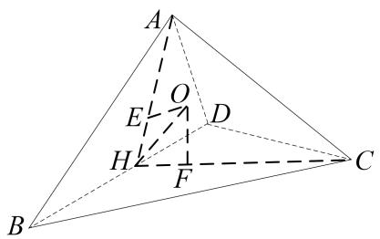

# 专题七 鳄鱼模型

# 【方法总结】

鳄鱼模型即普通三棱锥模型，用找球心法可以解决．如果已知其中两个面的二面角，则可用秒杀公式： $R^{2}=\frac{m^{2}+n^{2}-2mn\cos\alpha}{\sin^{2}\alpha}+\frac{l^{2}}{4}$ （其中 $l=|AB|$ ）解决．

# 【例题选讲】

[例] （1）在三棱锥 A-BCD 中， $\Delta ABD$ 和 $\Delta CBD$ 均为边长为 2 的等边三角形，且二面角 A-BD-C 的平面角为 $60^{\circ}$ ，则三棱锥的外接球的表面积为 \_\_\_\_.

  
（2）在等腰直角 $\Delta ABC$ 中， $AB = 2$ ， $\angle BAC = 90^{\circ}$ ， $AD$ 为斜边 $BC$ 的高，将 $\Delta ABC$ 沿 $AD$ 折叠，使二面角 $B - AD - C$ 为 $60^{\circ}$ ，则三棱锥 $A - BCD$ 的外接球的表面积为  
（3）在四面体ABCD中， $AB = AD = 2$ ， $\angle BAD = 60^{\circ}$ ， $\angle BCD = 90^{\circ}$ ，二面角 $A - BD - C$ 的大小为 $150^{\circ}$ 则四面体ABCD外接球的半径为  
（3）在三棱锥 $S - ABC$ 中， $AB \perp BC$ ， $AB = BC = \sqrt{2}$ ， $SA = SC = 2$ ，二面角 $S - AC - B$ 的余弦值是 $-\frac{\sqrt{3}}{3}$ ，若 $S, A, B, C$ 都在同一球面上，则该球的表面积是（）

A. $4\pi$

B. $6\pi$

C. $8\pi$

D. $9\pi$  
（4）已知三棱锥 $P - ABC$ 中， $AB \perp BC$ ， $AB = 2\sqrt{2}$ ， $BC = \sqrt{3}$ ， $PA = PB = 3\sqrt{2}$ ，且二面角 $P - AB - C$ 的大小为 $150^{\circ}$ ，则三棱锥 $P - ABC$ 外接球的表面积为（）

A. $100\pi$

B. $108\pi$

C. $110\pi$

D. $111\pi$  
（5）在三棱锥 P-ABC 中， $AB \perp BC$ ，三角形 PAC 为等边三角形，二面角 P-AC-B 的余弦值为 $-\frac{\sqrt{6}}{3}$ ，当三棱锥 P-ABC 的体积最大值为 $\frac{1}{3}$ 时，三棱锥 P-ABC 的外接球的表面积为 \_\_\_\_.  
（6）在体积为 $\frac{2\sqrt{3}}{3}$ 的四棱锥 $P - ABCD$ 中，底面 $ABCD$ 为边长为2的正方形， $\Delta PAB$ 为等边三角形，二

面角 P - AB - C 为锐角，则四棱锥 P - ABCD 外接球的半径为( )

A. $\frac{\sqrt{21}}{3}$

B. $\sqrt{2}$

C. $\sqrt{3}$

D. $\frac{3}{2}$

# 【对点训练】

1. 在三棱锥 $S - ABC$ 中， $SB = SC = AB = BC = AC = 2$ ，二面角 $S - BC - A$ 的大小为 $60^{\circ}$ ，则三棱锥 $S - AB$ $C$ 外接球的表面积是（）

A. $\frac{14\pi}{3}$

B. $\frac{16\pi}{3}$

C. $\frac{40\pi}{9}$

D. $\frac{52\pi}{9}$

2. 已知三棱锥 $A - BCD, BC = 6$ ，且 $\Delta ABC$ 、 $\Delta BCD$ 均为等边三角形，二面角 $A - BC - D$ 的平面角为 $60^\circ$ ，则三棱锥外接球的表面积是 \_\_\_\_.

3. 已知边长为 6 的菱形 $ABCD$ 中, $\angle BAD = 120^{\circ}$ , 沿对角线 $AC$ 折成二面角 $B - AC - D$ 的大小为 $\theta$ 的四面

体且 $\cos\theta=\frac{1}{3}$ ，则四面体 ABCD 的外接球的表面积为 \_\_\_\_.

4. 在三棱锥 $P - ABC$ 中, 顶点 $P$ 在底面 $ABC$ 的投影 $G$ 是 $\Delta ABC$ 的外心, $PB = BC = 2$ , 且面 $PBC$ 与底面 $ABC$ 所成的二面角的大小为 $60^{\circ}$ , 则三棱锥 $P - ABC$ 的外接球的表面积为 \_\_\_\_.

5. 直角三角形 $ABC$ ， $\angle ABC = \frac{\pi}{2}$ ， $AC + BC = 2$ ，将 $\triangle ABC$ 绕 $AB$ 边旋转至 $\triangle ABC'$ 位置，若二面角 $C - AB - C'$ 的大小为 $\frac{2\pi}{3}$ ，则四面体 $C' - ABC$ 的外接球的表面积的最小值为（）

A. $6\pi$

B. $3\pi$

C. $\frac{3}{2}\pi$

D. $2\pi$

6. 已知空间四边形 $ABCD$ 中, $AB = BD = AD = 2$ , $BC = 1$ , $CD = \sqrt{3}$ , 若二面角 $A - BD - C$ 的取值范围为 $[\frac{\pi}{4}, \frac{2\pi}{3}]$ , 则该几何体的外接球表面积的取值范围为 \_\_\_\_.

7. 在三棱锥 $S - ABC$ 中, 底面 $\Delta ABC$ 是边长为 3 的等边三角形, $SA = \sqrt{3}$ , $SB = 2\sqrt{3}$ , 二面角 $S - AB - C$ 的大小为 $60^\circ$ , 则此三棱锥的外接球的表面积为 \_\_\_\_.

8. 在四面体 $ABCD$ 中, $BC = CD = BD = AB = 2$ , $\angle ABC = 90^{\circ}$ , 二面角 $A - BC - D$ 的平面角为 $150^{\circ}$ , 则四面体 $ABCD$ 外接球的表面积为 ( )

A. $\frac{31}{3}\pi$

B. $\frac{124}{3}\pi$

C. $31\pi$

D. $124\pi$

9. 在三棱锥 $A - BCD$ 中, $AB = BC = CD = DA = \sqrt{7}$ , $BD = 2\sqrt{3}$ , 二面角 $A - BD - C$ 是钝角. 若三棱锥 $A - BCD$ 的体积为 2. 则三棱锥 $A - BCD$ 的外接球的表面积是 ( )

A. $12\pi$

B. $\frac{37}{3}\pi$

C. $13\pi$

D. $\frac{53}{4}\pi$

10. 在平面五边形 $ABCDE$ 中， $\angle A = 60^\circ$ ， $AB = AE = 6\sqrt{3}$ ， $BC \perp CD$ ， $DE \perp CD$ ，且 $BC = DE = 6$ 。将五边形 $ABCDE$ 沿对角线 $BE$ 折起，使平面 $ABE$ 与平面 $BCDE$ 所成的二面角为 $120^\circ$ ，则沿对角线 $BE$ 折起后所得几何体的外接球的表面积是 \_\_\_\_。

