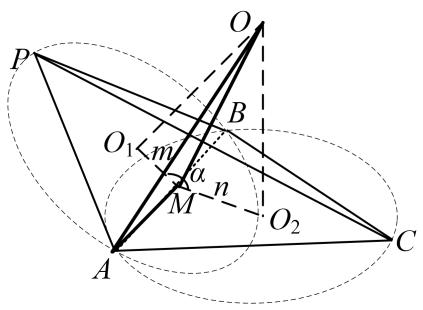
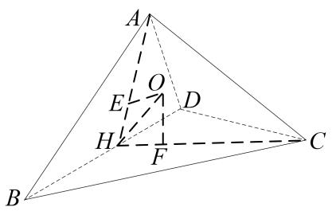
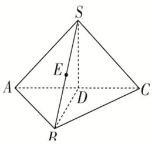

# 专题七 鳄鱼模型

# 【方法总结】

鳄鱼模型即普通三棱锥模型，用找球心法可以解决．如果已知其中两个面的二面角，则可用秒杀公式： $R^{2}=\frac{m^{2}+n^{2}-2mn\cos\alpha}{\sin^{2}\alpha}+\frac{l^{2}}{4}$ （其中 $l=|AB|$ )解决．

# 【例题选讲】

[例] （1）在三棱锥 A-BCD 中， $\Delta ABD$ 和 $\Delta CBD$ 均为边长为 2 的等边三角形，且二面角 A-BD-C 的平面角为 $60^{\circ}$ ，则三棱锥的外接球的表面积为 \_\_\_\_.
答案 $\frac{52\pi}{9}$ 解析 如图，取 $BD$ 中点 $H$ ，连接 $AH$ ， $CH$ ，因为 $\Delta ABD$ 与 $\Delta CBD$ 均为边长为2的等边三角形，所以 $AH \perp BD$ ， $CH \perp BD$ ，则 $\angle AHC$ 为二面角 $A-BD-C$ 的平面角，即 $\angle AHC = 60^\circ$ ，设 $\Delta ABD$ 与 $\Delta CBD$ 外接圆圆心分别为 $E$ ， $F$ ，则由 $AH = 2 \times \frac{\sqrt{3}}{2} = \sqrt{3}$ ，可得 $AE = \frac{2}{3}AH = \frac{2\sqrt{3}}{3}$ ， $EH = \frac{1}{3}AH = \frac{\sqrt{3}}{3}$ 分别过 $EF$ 作平面 $ABD$ ，平面 $BCD$ 的垂线，则三棱锥的外接球一定是两条垂线的交点，记为 $O$ ，连接 $AO$ ， $HO$ ，则由对称性可得 $\angle OHE = 30^\circ$ ，所以 $OE = \tan 30^\circ \cdot HE = \frac{1}{3}$ ，则 $R = OA = \sqrt{AE^2 + OE^2} = \sqrt{\frac{13}{9}}$ ，则三棱锥外接球的表面积 $4\pi R^2 = 4\pi \times \frac{13}{9} = \frac{52\pi}{9}$ ，

  
（2）在等腰直角 $\Delta ABC$ 中， $AB = 2$ ， $\angle BAC = 90^{\circ}$ ， $AD$ 为斜边 $BC$ 的高，将 $\Delta ABC$ 沿 $AD$ 折叠，使二面角 $B - AD - C$ 为 $60^{\circ}$ ，则三棱锥 $A - BCD$ 的外接球的表面积为
答案 $\frac{14}{3}\pi$ 解析沿 $AD$ 折叠后二面角 $B - AD - C$ 为 $60^{\circ}$ ，即折叠后 $\angle BDC = 60^{\circ}$ ，所以 $\Delta DBC$ 为等边三角形，又因为 $AB = 2$ ，所以折叠后 $AD = DB = BC = CD = \sqrt{2}$ ，设点 $O$ 为三棱锥 $A - BCD$ 外接球的球心， $O_{1}$ 为 $\Delta BDC$ 的外心，所以 $\frac{\sqrt{2}}{\sin 60^{\circ}} = 2DO_{1}$ ，所以 $DO_{1} = \frac{\sqrt{6}}{3}$ ，又 $OO_{1} = \frac{1}{2} AD = \frac{\sqrt{2}}{2}$ ，所以球心半径 $R^{2} = DO_{1}^{2} + OO_{1}^{2} = (\frac{\sqrt{6}}{3})^{2} + (\frac{\sqrt{2}}{2})^{2} = \frac{7}{6}$ ，所以 $S_{\text{球}} = 4\pi R^{2} = \frac{14}{3}\pi$ 。  
（3）在四面体ABCD中， $AB=AD=2$ ， $\angle BAD=60^{\circ}$ ， $\angle BCD=90^{\circ}$ ，二面角A-BD-C的大小为 $150^{\circ}$ ，则四面体ABCD外接球的半径为\_\_\_\_。
答案 $\frac{\sqrt{21}}{3}$ 解析 因为 $\angle BCD = 90^{\circ}$ ，所以 $BC \perp CD$ ，设 $BD$ 的中点为 $O_{2}$ ，则 $O_{2}$ 为 $\triangle BCD$ 外接圆的圆心，由 $AB = AD = 2$ ， $\angle BAD = 60^{\circ}$ 知， $\triangle ABD$ 为等边三角形，设 $\triangle ABD$ 的外接圆的圆心为 $O_{1}$ ，连接 $AO_{2}$ ，则 $O_{1}$ 在线段 $AO_{2}$ 上，过 $O_{1}$ ， $O_{2}$ 分别作平面 $ABD$ 与平面 $BDC$ 的垂线，交于点 $O$ ，则 $O$ 为四面体 $ABCD$ 外接球的球心，过 $O_{2}$ 在平面 $BCD$ 内作 $O_{2}E \perp BD$ ，交 $DC$ 于点 $E$ ，则 $\angle AO_{2}E = 150^{\circ}$ ，所以 $\angle AO_{2}O = 60^{\circ}$ ，又 $O_{1}O_{2} = \frac{\sqrt{3}}{3}$ ，所以 $OO_{1} = 1$ ，连接 $OA$ ，又 $AO_{1} = \frac{2\sqrt{3}}{3}$ ，所以 $OA = \sqrt{AO_{1}^{2} + OO_{1}^{2}} = \sqrt{\left[\frac{2\sqrt{3}}{3}\right]^{2} + 1} = \frac{\sqrt{21}}{3}$ .  
（3）在三棱锥 $S - ABC$ 中， $AB \perp BC$ ， $AB = BC = \sqrt{2}$ ， $SA = SC = 2$ ，二面角 $S - AC - B$ 的余弦值是 $-\frac{\sqrt{3}}{3}$ ，若 $S, A, B, C$ 都在同一球面上，则该球的表面积是（）

A. $4\pi$

B. $6\pi$

C. $8\pi$

D. $9\pi$
答案 B 解析 如图，取 AC 的中点 D，连接 SD，BD。因为 SA=SC，AB=BC，所以 $SD \perp AC$ ， $BD \perp AC$ ，可得 $\angle SDB$ 即为二面角 S-AC-B 的平面角，故 $\cos\angle SDB=-\frac{\sqrt{3}}{3}$ 。在 $\triangle ABC$ 中， $AB \perp BC$ ， $AB=BC=\sqrt{2}$ ，则 $AC=\sqrt{AB^{2}+BC^{2}}=2$ ，所以 CD=AD=1。在 Rt△SDC 中， $SD=\sqrt{SC^{2}-CD^{2}}=\sqrt{4-1}=\sqrt{3}$ ，同理可得 BD=1，由余弦定理得 $\cos\angle SDB=\frac{3+1-SB^{2}}{2\times\sqrt{3}\times1}=-\frac{\sqrt{3}}{3}$ ，解得 $SB=\sqrt{6}$ 。在 $\triangle SCB$ 中， $SC^{2}+CB^{2}=4+2=(\sqrt{6})^{2}=SB^{2}$ ，所以 $\triangle SCB$ 为直角三角形，同理可得 $\triangle SAB$ 为直角三角形，取 SB 的中点 E，则 $SE=EB=\frac{\sqrt{6}}{2}$ ，在 Rt△SCB 与 Rt△SAB 中， $EA=\frac{SB}{2}=\frac{\sqrt{6}}{2}$ ， $EC=\frac{SB}{2}=\frac{\sqrt{6}}{2}$ ，所以点 E 为该球的球心，半径为 $\frac{\sqrt{6}}{2}$ ，所以该球的表面积为 $S=4\times\pi\times\left(\frac{\sqrt{6}}{2}\right)^{2}=6\pi$ ，故选 B。

  
（4）已知三棱锥 $P - ABC$ 中， $AB \perp BC$ ， $AB = 2\sqrt{2}$ ， $BC = \sqrt{3}$ ， $PA = PB = 3\sqrt{2}$ ，且二面角 $P - AB - C$ 的大小为 $150^{\circ}$ ，则三棱锥 $P - ABC$ 外接球的表面积为（）

A. $100\pi$

B. $108\pi$

C. $110\pi$

D. $111\pi$
答案 D 解析 取 AB 中点 E，AC 中点 F，易知 $AB \perp EF$ ， $AB \perp EP$ ， $\therefore \angle PEF = 150^{\circ}$ ，且平面 $PEF \perp$ 平面 ABC，∴ 作 $PN \perp EF$ 交 FE 的延长线于 N，则 $PN \perp$ 平面 ABC，球心 O 在过 F 与平面 ABC 垂直的直线上如图：作 $OM \perp PN$ 于 M，设 OF = x，由已知条件可得 $FC = \frac{\sqrt{11}}{2}$ ， $EF = \frac{\sqrt{3}}{2}$ ， $EN = PE \cos 30^{\circ} = 2\sqrt{3}$ ， $PN = PE \sin 30^{\circ} = 2$ ，从而 PM = x - 2， $OM = EF + EN = \frac{5\sqrt{3}}{2}$ ，在直角三角形 OMP

中， $OP^{2}=(x-2)^{2}+(\frac{5\sqrt{3}}{2})^{2}$ ，在直角三角形 OFC 中， $OC^{2}=x^{2}+(\frac{\sqrt{11}}{2})^{2}$ ，由 $OP^{2}=OC^{2}$ 解得 x=5， $\therefore OC^{2}=\frac{111}{4},\quad\therefore S_{球}=4\pi OC^{2}=111\pi,$  
（5）在三棱锥 P-ABC 中， $AB \perp BC$ ，三角形 PAC 为等边三角形，二面角 P-AC-B 的余弦值为 $-\frac{\sqrt{6}}{3}$ ，当三棱锥 P-ABC 的体积最大值为 $\frac{1}{3}$ 时，三棱锥 P-ABC 的外接球的表面积为 \_\_\_\_.
答案 $8\pi$ 解析 如图所示，过点 $P$ 作 $PE \perp$ 面 $ABC$ ，垂足为 $E$ ，过点 $E$ 作 $DE \perp AC$ 交 $AC$ 于点 $D$ ，连接 $PD$ ，则 $\angle PDE$ 为二面角 $P - AC - B$ 的平面角的补角，即有 $\cos \angle PDE = \frac{\sqrt{6}}{3}$ ，易知 $AC \perp$ 面 $PDE$ ，则 $AC \perp PD$ ，而 $\Delta PAC$ 为等边三角形，所以 $D$ 为 $AC$ 中点，设 $AB = a$ ， $BC = b$ ， $AC = \sqrt{a^2 + b^2} = c$ ，则 $PE = PD \sin \angle PDE = \frac{\sqrt{3}}{2} \times c \times \frac{\sqrt{3}}{3} = \frac{c}{2}$ ，故三棱锥 $P - ABC$ 的体积为： $V = \frac{1}{3} \times \frac{1}{2} ab \times \frac{c}{2} = \frac{1}{12} abc \leqslant \frac{1}{12} c \times \frac{a^2 + b^2}{2} = \frac{c^3}{24}$ ，当且仅当 $a = b = \frac{\sqrt{2}}{2} c$ 时，体积最大，则 $\frac{c^3}{24} = \frac{1}{3}$ ，即 $a = b = \sqrt{2}$ ， $c = 2$ ，所以 $B$ 、 $D$ 、 $E$ 三点共线，设三棱锥 $P - ABC$ 的外接球的球心为 $O$ ，半径为 $R$ ，过点 $O$ 作 $OF \perp PE$ 于 $F$ ，则四边形 $ODEF$ 为矩形，则 $OD = EF = \sqrt{R^2 - 1}$ ， $ED = OF = PD \cos \angle PDE = \sqrt{3} \times \frac{\sqrt{6}}{3} = \sqrt{2}$ ， $PE = 1$ ，在 RtΔPFO 中， $R^2 = 2 + (1 - \sqrt{R^2 - 1})^2$ ，解得 $R^2 = 2$ ，三棱锥 $P - ABC$ 的外接球的表面积为 $S = 4\pi R^2 = 8\pi$ 。  
（6）在体积为 $\frac{2\sqrt{3}}{3}$ 的四棱锥 $P - ABCD$ 中，底面 $ABCD$ 为边长为2的正方形， $\Delta PAB$ 为等边三角形，二面角 $P - AB - C$ 为锐角，则四棱锥 $P - ABCD$ 外接球的半径为（）

A. $\frac{\sqrt{21}}{3}$

B. $\sqrt{2}$

C. $\sqrt{3}$

D. $\frac{3}{2}$
答案 A 解析 取 AB 的中点 E，CD 的中点 F，连接 PE，PF，EF，过 P 作 $PH \perp EF$ 于 H，由 AE = BE，CF = DF 可得 $AB \perp EP$ ， $AB \perp EF$ ，所以 $AB \perp$ 面 PEF，可得 $AB \perp PH$ ， $AB \cap EF = E$ ，所以 $PH \perp$ 面 AC，所以 $V_{四棱锥} = \frac{1}{3} S_{底} \times PH = \frac{1}{3} \times 2^{2} \times PH = \frac{2\sqrt{3}}{3}$ ，解得 $PH = \frac{\sqrt{3}}{2}$ ，而 $\Delta PAB$ 为等边三角形，所以 $PE = \frac{\sqrt{3}}{2} \times AB = \sqrt{3}$ ，所以 $\sin \angle PEF = \frac{PH}{PE} = \frac{\frac{\sqrt{3}}{2}}{\sqrt{3}} = \frac{1}{2}$ ，所以可得 $\angle PEF = 30^{\circ}$ ，可得 $EH = \frac{3}{2}$ ， $HF = 2 - EH = \frac{1}{2}$ ， $PF = \sqrt{PH^{2} + HF^{2}} = 1$ ，所以 $PE^{2} + PF^{2} = EF^{2}$ ，所以 $PE \perp PF$ ，取 EF 的中点 N，即四边形 ABCD 的对角线的交点， $AN = \frac{\sqrt{2}}{2} AB = \sqrt{2}$ ，过 N 作 NO 垂直于底面 ABCD，可得 NO // PH，取 O 为外接球的球心，设外接球的半径为 R，连接 OP，OA，则可得 R = OA = OP，过 O 作 OM $\perp PH$ 于 M，则四边形 ONHM 为矩形，所以 OM = NH = NF - HF = $1 - \frac{1}{2} = \frac{1}{2}$ ，ON = MF，(i) 当 O，P 在面 ABCD 的同侧时，在 $\Delta OPM$ 中， $R^{2} = OP^{2} = OM^{2} + PM^{2} = (\frac{1}{2})^{2} + (PH - MH)^{2} = \frac{1}{4} + (\frac{\sqrt{3}}{2} - MH)^{2}$ ①，在 $\Delta AON$ 中，
$R^2 = OA^2 = AN^2 +ON^2 = (\sqrt{2})^2 +MH^2$ ②，由 $①②$ 可得 $MH <   0$ （舍），(ii)当 $O$ ， $P$ 在面ABCD的两侧时，在 $\Delta OPM$ 中， $R^2 = OP^2 = OM^2 +PM^2 = (\frac{1}{2})^2 +(PH + MH)^2 = \frac{1}{4} +(\frac{\sqrt{3}}{2} +MH)^2$ ③，过在 $\Delta AON$ 中， $R^2 = OA^2 = AN^2 +ON^2 = (\sqrt{2})^2 +MH^2$ ②，由 $②③$ 可得 $MH = \frac{1}{\sqrt{3}}$ ， $R^2 = 2 + \frac{1}{3} = \frac{7}{3}$ ，所以 $R = \frac{\sqrt{21}}{3}$

# 【对点训练】

1. 在三棱锥 $S - ABC$ 中， $SB = SC = AB = BC = AC = 2$ ，二面角 $S - BC - A$ 的大小为 $60^{\circ}$ ，则三棱锥 $S - AB$ C 外接球的表面积是（）

A. $\frac{14\pi}{3}$

B. $\frac{16\pi}{3}$

C. $\frac{40\pi}{9}$

D. $\frac{52\pi}{9}$

1. 答案 D 解析 取 BC 的中点为 D，由三棱锥 S-ABC 中，SB=SC=AB=BC=AC=2，二面角 S-BC-A 的大小为 $60^{\circ}$ ，得到 $\Delta SBC$ 和 $\Delta ABC$ 都是正三角形，∴ $SD \perp BC$ ， $AD \perp BC$ ，∴ $\angle SDA$ 是二面角 S-BC-A 的平面角，即 $\angle SDA = 60^{\circ}$ ，设球心为 O， $\Delta ABC$ 和 $\Delta SBC$ 中心分别为 E，F，则 $OE \perp$ 平面 ABC， $OF \perp$ 平面 SBC， $DE = \frac{\sqrt{3}}{3} \cdot \tan \angle ODE = \frac{OE}{DE} = \tan 30^{\circ}$ ，∴ $OD = \frac{1}{3} \sqrt{OE^{2} + DE^{2}} = \frac{2}{3}$ ，∴ 外接球半径 $R = \sqrt{OD^{2} + BD^{2}} = \sqrt{\left(\frac{2}{3}\right)^{2} + 1^{2}} = \frac{\sqrt{13}}{3}$ ，∴ 外接球的表面积为 $4\pi R = 4\pi \left( \frac{\sqrt{13}}{3} \right)^{2} = \frac{52\pi}{9}$ .

2. 已知三棱锥 $A - BCD, BC = 6$ ，且 $\Delta ABC$ 、 $\Delta BCD$ 均为等边三角形，二面角 $A - BC - D$ 的平面角为 $60^\circ$ ，则三棱锥外接球的表面积是 \_\_\_\_.

2. 答案 $52 \pi$ 解析 取 $BC$ 的中点 $M$ , 连接 $AM$ 、 $DM$ , 则 $AM \perp BC$ , 且 $DM \perp BC$ , 所以, 二面角 $A - BC - D$ 的平面角为 $\angle AMD = 60^{\circ}$ , 且 $AM = DM = AB \sin 60^{\circ} = 3\sqrt{3}$ , 则 $\triangle ADM$ 是边长为 $3\sqrt{3}$ 的正三角形, 如下图所示, 设 $\triangle ABC$ 和 $\triangle BCD$ 的外心分别为点 $P$ 、 $Q$ , 则 $PM = QM = \frac{1}{3} AM = \sqrt{3}$ , 过点 $P$ 、 $Q$ 在平面 $ADM$ 内作 $AM$ 和 $DM$ 的垂线交于点 $O$ , 则 $O$ 为该三棱锥的外接球球心, 易知, $\angle OMP = 30^{\circ}$ , 所以, $OP = PM \cdot \tan 30^{\circ} = 1$ , $PA = \frac{2}{3} AM = 2\sqrt{3}$ , 所以, 球 $O$ 的半径为 $OA = \sqrt{OP^{2} + PA^{2}} = \sqrt{13}$ , 因此, 该三棱锥的外接球的表面积为 $4 \pi \times (\sqrt{13})^{2} = 52 \pi$ .

3. 已知边长为 6 的菱形 ABCD 中， $\angle BAD = 120^{\circ}$ ，沿对角线 AC 折成二面角 B - AC - D 的大小为 $\theta$ 的四面
体且 $\cos\theta=\frac{1}{3}$ ，则四面体 ABCD 的外接球的表面积为 \_\_\_\_.

3. 答案 $54\pi$ 解析 由边长为6的菱形ABCD中， $\angle BAD=120^{\circ}$ ，可知，AC=AB=BC=AD=CD=6，在折起的四面体中，取AC的中点E，连接BE，DE， $DE=BE=\frac{\sqrt{3}}{2}\times6=3\sqrt{3}$ ，则 $EB\perp AC$ ， $DE\perp AC$ ， $AC\cap BE=E$ ，∴ $AC\perp$ 面BED， $\angle BED$ 为二面角B-AC-D的大小为 $\theta$ ，在DE，BE上分别取 $DM=Bn=\frac{2}{3}DE=2\sqrt{3}$ ， $EM=\frac{1}{3}DE=\sqrt{3}$ ，则M，N分别为三角形ADC，ABC的外接圆的圆心，过M，N分别做两个三角形的外接圆的垂线，交于O，则O为四面体外接球的球心，连接OE，
$OD$ 为外接球的半径 $R$ 。则 $\angle OED = \frac{\theta}{2}$ ，所以 $\cos^2\frac{\theta}{2} = \frac{1 + \cos\theta}{2} = \frac{2}{3}$ ，所以 $\cos\frac{\theta}{2} = \frac{\sqrt{6}}{3}$ ，在三角形 $OEM$ ， $\cos\frac{\theta}{2} = \frac{EM}{OE}$ ，解得 $OE = \frac{EM}{\frac{\sqrt{6}}{3}} = \frac{3}{\sqrt{2}}$ ，在三角形 $OED$ 中，余弦定理可得 $OD^2 = DE^2 + OE^2 - 2DE \cdot OE \cdot \cos\frac{\theta}{2} = (3\sqrt{3})^2 + (\frac{3}{\sqrt{2}})^2 - 2 \cdot 3\sqrt{3} \cdot \frac{3}{\sqrt{2}} \cdot \frac{\sqrt{6}}{3} = \frac{27}{2}$ ，即 $R^2 = \frac{27}{2}$ ，所以外接球的表面积 $S = 4\pi R^2 = 54\pi$ 。

4. 在三棱锥 $P - ABC$ 中, 顶点 $P$ 在底面 $ABC$ 的投影 $G$ 是 $\Delta ABC$ 的外心, $PB = BC = 2$ , 且面 $PBC$ 与底面 $ABC$ 所成的二面角的大小为 $60^{\circ}$ , 则三棱锥 $P - ABC$ 的外接球的表面积为 \_\_\_\_.

4. 答案 $\frac{64\pi}{9}$ 解析 由于 $G$ 为 $\Delta ABC$ 的外心，则 $GA = GB = GC$ ，由题意知， $PG \perp$ 平面 $ABC$ ，由勾股定理易得 $PA = PB = PC$ ，取 $BC$ 的中点 $E$ ，由于 $G$ 为 $\Delta ABC$ 的外心，则 $GE \perp BC$ ，且 $BE = \frac{1}{2} BC = 1$ ， $\because PG \perp$ 平面 $ABC$ ， $BC \subset$ 平面 $ABC$ ，则 $BC \perp PG$ ，又 $GE \perp BC$ ， $PG \bigcap GE = G$ ， $\therefore BC \perp$ 平面 $PGE$ ， $\because PE \subset$ 平面 $PGE$ ， $\therefore PE \perp BC$ ，所以， $PE = \sqrt{PB^2 - BE^2} = \sqrt{3}$ ，且平面 $PBC$ 与平面 $ABC$ 所成的二面角的平面角为 $\angle PEG = 60^\circ$ ， $\therefore PG = PE \sin 60^\circ = \frac{3}{2}$ ，因此，三棱锥的外接球的直径为 $2R = \frac{PB^2}{PG} = \frac{4}{\frac{3}{2}} = \frac{8}{3}$ ，所以， $R = \frac{4}{3}$ ，因此，该三棱锥的外接球的表面积为 $4\pi R^2 = 4\pi \times (\frac{4}{3})^2 = \frac{64\pi}{9}$ .

5. 直角三角形 $ABC$ ， $\angle ABC = \frac{\pi}{2}$ ， $AC + BC = 2$ ，将 $\triangle ABC$ 绕 $AB$ 边旋转至 $\triangle ABC'$ 位置，若二面角 $C - AB - C'$ 的大小为 $\frac{2\pi}{3}$ ，则四面体 $C' - ABC$ 的外接球的表面积的最小值为（）

A. $6\pi$

B. $3\pi$

C. $\frac{3}{2}\pi$

D. $2\pi$

5. 答案 B 解析 如图， $AB \perp$ 平面 $CBC'$ ， $\Delta CBC'$ 是等腰三角形， $BC = BC'$ ， $\angle CBC' = \frac{2\pi}{3}$ 。设 $BC = x (0 < x < 1)$ ，则 $AC = 2 - x$ ， $AB = \sqrt{(2 - x)^2 - x^2} = \sqrt{4 - 4x} = 2\sqrt{1 - x}$ 。设 $\Delta CBC'$ 外接圆的半径为 $r$ ，则 $\frac{x}{\sin\frac{\pi}{6}} = 2r$ ，即 $r = x$ 。∴ 四面体 $C' - ABC$ 的外接球的半径 $R$ 满足 $R^2 = x^2 + (\sqrt{1 - x})^2 = x^2 - x + 1$ 。∴ 四面体 $C' - ABC$ 的外接球的表面积 $S = 4\pi R^2 = 4(x^2 - x + 1)\pi$ ，当 $x = \frac{1}{2}$ 时， $S_{min} = 3\pi$ 。

6. 已知空间四边形 $ABCD$ 中， $AB = BD = AD = 2$ ， $BC = 1$ ， $CD = \sqrt{3}$ ，若二面角 $A - BD - C$ 的取值范围为 $[\frac{\pi}{4}, \frac{2\pi}{3}]$ ，则该几何体的外接球表面积的取值范围为 \_\_\_\_.

6. 答案 $\left[\frac{16\pi}{3}, \frac{20\pi}{3}\right]$ . 解析 结合二面角 $A - BD - C$ 的取值范围为 $\left[\frac{\pi}{4}, \frac{2\pi}{3}\right]$ , 则有: ①当二面角 $A - BD - C$ 的取值范围为 $\frac{\pi}{2}$ 时, 面 $ABD \perp$ 面 $BCD$ , 此时外接圆的半径最小, 设为 $r$ , 则有
$r^{2}=1+(\sqrt{3}-r)^{2}$ ，解得 $r=\frac{2}{3}$ ，此时外接圆的表面积 $S_{1}=4\pi r^{2}=\frac{16\pi}{3}$ ，②当二面角A-BD-C的取值范围为 $\frac{\pi}{4}$ 或 $\frac{3\pi}{4}$ 时，此时外接圆的半径最大，设为R，设H为等边 $\Delta ADB$ 的中心，DB中点 $O_{1}$ 为 $\Delta BCD$ 外接圆的圆心，过H作面ABD的垂线，过 $O_{1}$ 作面DCB的垂线，两垂线的交点O为空间四边形ABCD外接球球心，在面BCD内作 $MO_{1}\perp BD$ ，则 $\angle MO_{1}A=135^{0}$ ， $\angle OO_{1}A=45^{0}$ ， $\therefore R=\sqrt{(\sqrt{3}\times\frac{1}{3}\times\sqrt{2})^{2}+1^{2}}=\sqrt{\frac{5}{3}}$ ，则外接球表面积 $S_{2}=4\pi R^{2}=\frac{20\pi}{2}$ 。

7. 在三棱锥 $S - ABC$ 中，底面 $\Delta ABC$ 是边长为 3 的等边三角形， $SA = \sqrt{3}$ ， $SB = 2\sqrt{3}$ ，二面角 $S - AB - C$ 的大小为 $60^\circ$ ，则此三棱锥的外接球的表面积为 \_\_\_\_.

7. 答案 $13\pi$ 解析 由题意得 $SA^2 + AB^2 = SB^2$ ，得到 $SA \perp AB$ ，取 $AB$ 中点为 $D$ ， $SB$ 中点为 $M$ ，得到 $\angle CDM$ 为 $S - AB - C$ 的二面角的平面角，得到 $\angle MDC = 60^\circ$ ，设三角形 $ABC$ 的外心为 $O'$ ，则 $CO' = \frac{3}{2\sin 60^\circ} = \sqrt{3} = BO'$ ， $DO' = \frac{\sqrt{3}}{2}$ ，球心为过 $M$ 的面 $ABS$ 的垂线与过 $O'$ 的面 $ABC$ 的垂线的交点，在四边形 $MDOO'$ 中， $OO' = \frac{1}{2}$ ，所以 $R^2 = OO'^2 + O'B^2 = \frac{1}{4} + 3 = \frac{13}{4}$ ，所以球的表面积为 $4\pi R^2 = 13\pi$ 。

8. 在四面体 $ABCD$ 中, $BC = CD = BD = AB = 2$ , $\angle ABC = 90^{\circ}$ , 二面角 $A - BC - D$ 的平面角为 $150^{\circ}$ , 则四面体 $ABCD$ 外接球的表面积为 ( )

A. $\frac{31}{3}\pi$

B. $\frac{124}{3}\pi$

C. $31\pi$

D. $124\pi$

8. 答案 B 解析 以 BC 中点 E 为原点，以过 E 垂直于平面 BCD 的垂线为 z 轴，EB 所在直线为 x 轴，EC 所在直线为 y 轴，建立空间直角坐标系，由题意可得， $B(1,0,0)$ ， $C(-1,0,0)$ ， $D(0,\sqrt{3}$ ，0）， $A(1,-\sqrt{3},1)$ ，设球心 $O(x,y,z)$ ，则由 OA=OB=OC=OD，可得 $(x-1)^{2}+(y+\sqrt{3})^{2}+(z-1)^{2}=(x-1)^{2}+y^{2}+z^{2}=(x+1)^{2}+y^{2}+z^{2}=x^{2}+(y-\sqrt{3})^{2}+z^{2}$ ，解可得，x=0， $y=\frac{\sqrt{3}}{3}$ ，z=3，所以四面体的外接球半径 $R=OA=\sqrt{1+(\sqrt{3}+\frac{\sqrt{3}}{3})^{2}+(3-1)^{2}}=\sqrt{\frac{31}{3}}$ ， $S=4\pi R^{2}=\frac{124\pi}{3}$ .

9. 在三棱锥 $A - BCD$ 中， $AB = BC = CD = DA = \sqrt{7}$ ， $BD = 2\sqrt{3}$ ，二面角 $A - BD - C$ 是钝角。若三棱锥 $A - BCD$ 的体积为 2，则三棱锥 $A - BCD$ 的外接球的表面积是（）

A. $12\pi$

B. $\frac{37}{3}\pi$

C. $13\pi$

D. $\frac{53}{4}\pi$

9. 答案 C 解析 取 BD 的中点 K，连结 AK，CK，由已知 $\Delta ABD$ 和 $\Delta BCD$ 是全等的等腰三角形，所以 $AK \perp BD$ ， $CK \perp BD$ ， $\therefore \angle AKC$ 为二面角 A-BD-C 的平面角，且 $BD \perp$ 平面 AKC，AK = CK，所以 $V = \frac{1}{3} \times \frac{1}{2} AK \times CK \times \sin \angle AKC \times BD = 2$ ，又 $AK = \sqrt{AD^{2} - KD^{2}} = 2$ ，故 $\sin \angle AKC = \frac{\sqrt{3}}{2}$ ，因为 $\angle AKC$

为钝角，所以 $\angle AKC = 120^{\circ}$ ，设 $\Delta ABD$ ， $\Delta BCD$ 的外接圆的圆心分别为 $M$ ， $N$ ，则 $M$ ， $N$ 分别在 $AK$ ， $CK$ 上且 $MK = NK$ ，连结 $DM$ ，由 $(2 - AM)^{2} + 3 = DM^{2}$ ，其中 $AM = DM$ ，解得 $AM = \frac{7}{4}$ ，同理 $CN = \frac{7}{4}$ 所以 $MK = NK = \frac{1}{4}$ ，过 $M$ ， $N$ 分别作平面 $ABD$ ，平面 $BCD$ 的垂线，两垂线的交点 $O$ 为四面体 $ABCD$ 的外接球的球心，连结 $OK$ ，则 $OK$ 平分 $\angle AKC$ ， $\therefore \angle OKN = 60^{\circ}$ ，从而 $ON = \frac{\sqrt{3}}{4}$ ， $OK = \frac{1}{2}$ ，在 RtΔONC 中， $ON = \frac{\sqrt{3}}{4}$ ， $CN = AM = \frac{7}{4}$ ，外接球的半径为 $OC = \sqrt{ON^{2} + CN^{2}} = \sqrt{\frac{3}{16} + \frac{49}{16}} = \frac{\sqrt{13}}{2}$ ，所以四面体 $ABCD$ 外接球的表面积 $S = 4\pi r^{2} = 4\pi \times \frac{13}{4} = 13\pi$ 。

10. 在平面五边形 $ABCDE$ 中， $\angle A = 60^\circ$ ， $AB = AE = 6\sqrt{3}$ ， $BC \perp CD$ ， $DE \perp CD$ ，且 $BC = DE = 6$ 。将五边形 $ABCDE$ 沿对角线 $BE$ 折起，使平面 $ABE$ 与平面 $BCDE$ 所成的二面角为 $120^\circ$ ，则沿对角线 $BE$ 折起后所得几何体的外接球的表面积是 \_\_\_\_。

10. 答案 $252\pi$ 解析 设 $\Delta ABE$ 的中心为 $O_{1}$ ， $\because BC \perp CD$ ， $DE \perp CD$ ，故四边形 $BCDE$ 为矩形，设矩形 $BCDE$ 的中心为 $O_{2}$ ，过 $O_{1}$ 作垂直于平面 $ABE$ 的直线 $l_{1}$ ，过 $O_{2}$ 作垂直于平面 $BCDE$ 的直线 $l_{2}$ ，则由球的性质可知，直线 $l_{1}$ 与 $l_{2}$ 的交点 $O$ 为几何体 $ABCDE$ 外接球的球心，取 $BE$ 的中点 $F$ ，连接 $O_{1}F$ ， $O_{2}F$ ，由条件得 $O_{1}F = O_{2}F = 3$ ， $\angle O_{1}FO_{2} = 120^{\circ}$ ，连接 $OF$ ， $\Delta OFO_{1} \cong \Delta OFO_{2}$ ，从而 $OO_{1} = 3\sqrt{3}$ ，连接 $OA$ ，则 $OA$ 为所得几何体外接球的半径，在直角 $\Delta AOO_{1}$ 中， $AO_{1} = 6$ ， $OO_{1} = 3\sqrt{3}$ ，可得 $OA^{2} = OO_{1}^{2} + O_{1}A^{2} = 27 + 36 = 63$ ，即外接球的半径为 $R = OA = 3\sqrt{7}$ ，故所得几何体外接球的表面积为 $S = 4\pi \times 63 = 252\pi$ 。

