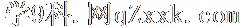

**专题七　鳄鱼模型**

**【方法总结】**

鳄鱼模型即普通三棱锥模型，用找球心法可以解决．如果已知其中两个面的二面角，则可用秒杀公式：<em>R</em>2＝＋(其中<em>l</em>＝|<em>AB</em>|)解决．

**【例题选讲】**

**[例]**　(1)在三棱锥中，和均为边长为2的等边三角形，且二面角的平面角为，则三棱锥的外接球的表面积为\_\_\_\_\_\_\_\_．

答案　　解析　如图，取中点，连接，，因为与均为边长为2的等边三角形，所以，，则为二面角的平面角，即，设与外接圆圆心分别为，，则由，可得，，分别过作平面，平面的垂线，则三棱锥的外接球一定是两条垂线的交点，记为，连接，，则由对称性可得，所以，则，则三棱锥外接球的表面积，

(2)在等腰直角中，，，为斜边的高，将沿折叠，使二面角为，则三棱锥的外接球的表面积为\_\_\_\_\_\_\_\_．

答案　　解析　沿折叠后二面角为，即折叠后，所以为等边三角形，又因为，所以折叠后，设点为三棱锥外接球的球心，为的外心，所以，所以，又，所以球心半径，所以．

(3)在四面体*ABCD*中，*AB*＝*AD*＝2，∠*BAD*＝60°，∠*BCD*＝90°，二面角*A*－*BD*－*C*的大小为150°，则四面体*ABCD*外接球的半径为\_\_\_\_\_\_\_\_．

答案　　解析　因为∠<em>BCD</em>＝90°，所以<em>BC</em>⊥<em>CD</em>，设<em>BD</em>的中点为<em>O</em>2，则<em>O</em>2为△<em>BCD</em>外接圆的圆心，由<em>AB</em>＝<em>AD</em>＝2，∠<em>BAD</em>＝60°知，△<em>ABD</em>为等边三角形，设△<em>ABD</em>的外接圆的圆心为<em>O</em>1，连接<em>AO</em>2，则<em>O</em>1在线段<em>AO</em>2上，过<em>O</em>1，<em>O</em>2分别作平面<em>ABD</em>与平面<em>BDC</em>的垂线，交于点<em>O</em>，则<em>O</em>为四面体<em>ABCD</em>外接球的球心，过<em>O</em>2在平面<em>BCD</em>内作<em>O</em>2<em>E</em>⊥<em>BD</em>，交<em>DC</em>于点<em>E</em>，则∠<em>AO</em>2<em>E</em>＝150°，所以∠<em>AO</em>2<em>O</em>＝60°，又<em>O</em>1<em>O</em>2＝，所以<em>OO</em>1＝1，连接<em>OA</em>，又<em>AO</em>1＝，所以<em>OA</em>＝＝＝．

(3)在三棱锥*S*－*ABC*中，*AB*⊥*BC*，*AB*＝*BC*＝，*SA*＝*SC*＝2，二面角*S*－*AC*－*B*的余弦值是－，若*S*，*A*，*B*，*C*都在同一球面上，则该球的表面积是(　　)

A．4π　　　　　　　　B．6π　　　　　　　　C．8π　　　　　　　　D．9π

答案　B　解析　如图，取<em>AC</em>的中点<em>D</em>，连接<em>SD</em>，<em>BD</em>．因为<em>SA</em>＝<em>SC</em>，<em>AB</em>＝<em>BC</em>，所以<em>SD</em>⊥<em>AC</em>，<em>BD</em>⊥<em>AC</em>，可得∠<em>SDB</em>即为二面角<em>S</em>－<em>AC</em>－<em>B</em>的平面角，故cos∠<em>SDB</em>＝－．在△<em>ABC</em>中，<em>AB</em>⊥<em>BC</em>，<em>AB</em>＝<em>BC</em>＝，则<em>AC</em>＝＝2，所以<em>CD</em>＝<em>AD</em>＝1．在Rt△<em>SDC</em>中，<em>SD</em>＝＝＝，同理可得<em>BD</em>＝1，由余弦定理得cos∠<em>SDB</em>＝＝－，解得<em>SB</em>＝．在△<em>SCB</em>中，<em>SC</em>2＋<em>CB</em>2＝4＋2＝()2＝<em>SB</em>2，所以△<em>SCB</em>为直角三角形，同理可得△<em>SAB</em>为直角三角形，取<em>SB</em>的中点<em>E</em>，则<em>SE</em>＝<em>EB</em>＝，在Rt△<em>SCB</em>与Rt△<em>SAB</em>中，<em>EA</em>＝＝，<em>EC</em>＝＝，所以点<em>E</em>为该球的球心，半径为，所以该球的表面积为<em>S</em>＝4×π×＝6π，故选B．

(4)已知三棱锥中，，，，，且二面角的大小为，则三棱锥外接球的表面积为

A．　　　　　　　　B．　　　　　　　　C．　　　　　　　　D．

答案　D　解析　取中点，中点，易知，，，且平面平面，作交的延长线于，则平面，球心在过与平面垂直的直线上如图：作于，设，由已知条件可得，，，，从而，，在直角三角形中，，在直角三角形中，，由解得，，，

(5)在三棱锥中，，三角形为等边三角形，二面角的余弦值为，当三棱锥的体积最大值为时，三棱锥的外接球的表面积为\_\_\_\_\_\_\_\_．

答案　　解析　如图所示，过点作面，垂足为，过点作交于点，连接，则为二面角的平面角的补角，即有，易知面，则，而为等边三角形，所以为中点，设，，，则，故三棱锥的体积为：，当且仅当时，体积最大，则，即，，所以、、三点共线，设三棱锥的外接球的球心为，半径为，过点作于，则四边形为矩形，则，，，在中，，解得，三棱锥的外接球的表面积为．

(6)在体积为的四棱锥中，底面为边长为2的正方形，为等边三角形，二面角为锐角，则四棱锥外接球的半径为

A．　　　　　　　　B．　　　　　　　　C．　　　　　　　　D．

答案　A　解析　取的中点，的中点，连接，，，过作于，由，可得，，所以面，可得，，所以面，所以，解得，而为等边三角形，所以，所以，所以可得，可得，，，所以，所以，取的中点，即四边形的对角线的交点，，过作垂直于底面，可得，取为外接球的球心，设外接球的半径为，连接，，则可得，过作于，则四边形为矩形，所以，，当，在面的同侧时，在中，①，在中，②，由①②可得（舍，当，在面的两侧时，在中，③，过在中，②，由②③可得，，所以，

**【对点训练】**

1．在三棱锥中，，二面角的大小为，则三棱锥

外接球的表面积是

A．　　　　　　　　B．　　　　　　　　C．　　　　　　　　D．

1．答案　D　解析　取的中点为，由三棱锥中，，二面角

的大小为，得到和都是正三角形，，，是二面角的平面角，即，设球心为，和中心分别为，，则平面，平面，，，外接球半径，外接球的表面积为．

2．已知三棱锥，，且、均为等边三角形，二面角的平面角为，

则三棱锥外接球的表面积是\_\_\_\_\_\_\_\_．

2．答案　　解析　取的中点，连接、，则，且，所以，二面角

的平面角为，且，则是边长为的正三角形，如下图所示，设和的外心分别为点、，则，过点、在平面内作和的垂线交于点，则为该三棱锥的外接球球心，易知，，所以，，，所以，球的半径为，因此，该三棱锥的外接球的表面积为．

3．已知边长为6的菱形中，，沿对角线折成二面角的大小为的四面

体且，则四面体的外接球的表面积为\_\_\_\_\_\_\_\_．

3．答案　　解析　由边长为6的菱形中，，可知，

，在折起的四面体中，取 的中点，连接，，，则，，，面，为二面角的大小为，在，上分别取，，则，分别为三角形，的外接圆的圆心，过，分别做两个三角形的外接圆的垂线，交于，则为四面体外接球的球心，连接， 为外接球的半径．则，所以，所以，在三角形，，解得，在三角形中，余弦定理可得，即，所以外接球的表面积．

4．在三棱锥中，顶点在底面的投影是的外心，，且面与底面

所成的二面角的大小为，则三棱锥的外接球的表面积为\_\_\_\_\_\_\_\_．

4．答案　　解析　由于为的外心，则，由题意知，平面，由勾股

定理易得，取的中点，由于为的外心，则，且，平面，平面，则，又，，平面，平面，，所以，，且平面与平面所成的二面角的平面角为，，因此，三棱锥的外接球的直径为，所以，，因此，该三棱锥的外接球的表面积为．

5．直角三角形，，，将绕边旋转至位置，若二面角

的大小为，则四面体的外接球的表面积的最小值为

A．　　　　　　　　B．　　　　　　　　C．　　　　　　　　D．

5．答案　B　解析　如图，平面，是等腰三角形，，．设

，则，．设外接圆的半径为，则，即．四面体的外接球的半径满足．四面体的外接球的表面积，当时，．

6．已知空间四边形中，，，，若二面角的取值范围

为，，则该几何体的外接球表面积的取值范围为\_\_\_\_\_\_\_\_．

6．答案　,　解析　结合二面角的取值范围为，，则有：①当二面角

的取值范围为时，面面，此时外接圆的半径最小，设为，则有，解得，此时外接圆的表面积，②当二面角的取值范围为或时，此时外接圆的半径最大，设为，设为等边的中心，中点为外接圆的圆心，过作面的垂线，过作面的垂线，两垂线的交点为空间四边形外接球球心，在面内作，则，，，则外接球表面积．

7．在三棱锥中，底面是边长为3的等边三角形，，，二面角

的大小为，则此三棱锥的外接球的表面积为\_\_\_\_\_\_\_\_．

7．答案　　解析　由题意得，得到，取中点为，中点为，得到

为的二面角的平面角，得到，设三角形的外心为，则，，球心为过的面的垂线与过的面的垂线的交点，在四边形中，，所以，所以球的表面积为．

8．在四面体中，，，二面角的平面角为，则

四面体外接球的表面积为

A．　　　　　　　　B．　　　　　　　　C．　　　　　　　　D．

8．答案　B　解析　以中点为原点，以过垂直于平面的垂线为轴，所在直线为轴，

所在直线为轴，建立空间直角坐标系，由题意可得，，0，，，0，，，，，，，，设球心，，，则由，可得，解可得，，，，所以四面体的外接球半径，．

9．在三棱锥中，，，二面角是钝角．若三棱锥

的体积为2．则三棱锥的外接球的表面积是

A．　　　　　　　　B．　　　　　　　　C．　　　　　　　　D．

9．答案　C　解析　取的中点，连结，，由已知和是全等的等腰三角形，所

以，，为二面角的平面角，且平面，，所以，又，故，因为为钝角，所以，设，的外接圆的圆心分别为，，则，分别在，上且，连结，由，其中，解得，同理，所以，过，分别作平面，平面的垂线，两垂线的交点为四面体的外接球的球心，连结，则平分，，从而，，在中，，，外接球的半径为，所以四面体外接球的表面积．

10．在平面五边形中，，，，，且．将

五边形沿对角线折起，使平面与平面所成的二面角为，则沿对角线折起后所得几何体的外接球的表面积是\_\_\_\_\_\_\_\_．

10．答案　252π　解析　设的中心为，，，故四边形为矩形，设矩

形的中心为，过作垂直于平面的直线，过作垂直于平面的直线，则由球的性质可知，直线与的交点为几何体外接球的球心，取的中点，连接，，由条件得，，连接，，从而，连接，则为所得几何体外接球的半径，在直角中，，，可得，即外接球的半径为，故所得几何体外接球的表面积为．

