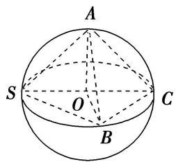
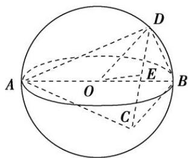
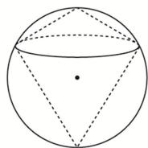
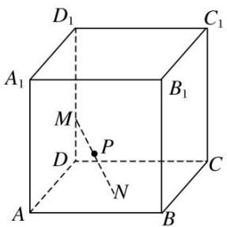

# 专题八 已知球心或球半径模型

# 【例题选讲】

[例] (1)(2017·全国 I)已知三棱锥 S-ABC 的所有顶点都在球 O 的球面上，SC 是球 O 的直径．若平面 SCA⊥平面 SCB，SA=AC，SB=BC，三棱锥 S-ABC 的体积为 9，则球 O 的表面积为 \_\_\_\_．

text_image

A
S O C
B

(2)已知三棱锥 A-BCD 的所有顶点都在球 O 的球面上，AB 为球 O 的直径，若该三棱锥的体积为 $\sqrt{3}$ ，BC=3， $BD=\sqrt{3}$ ， $\angle CBD=90^{\circ}$ ，则球 O 的体积为 \_\_\_\_。

text_image

Geometric diagram of a sphere with labeled points A, B, C, D, E, and O, showing internal and external projection lines.

(3)(2012 全国 I)已知三棱锥 $S - ABC$ 的所有顶点都在球 $O$ 的球面上, $\triangle ABC$ 是边长为 1 的正三角形, $SC$ 为球 $O$ 的直径, 且 $SC = 2$ , 则此棱锥的体积为 ( )

A. $\frac{\sqrt{2}}{6}$

B. $\frac{\sqrt{3}}{6}$

C. $\frac{\sqrt{2}}{3}$

D. $\frac{\sqrt{2}}{2}$

(4)(2020·新高考全国I)已知直四棱柱 $ABCD-A_{1}B_{1}C_{1}D_{1}$ 的棱长均为 2， $\angle BAD=60^{\circ}$ 。以 $D_{1}$ 为球心， $\sqrt{5}$ 为半径的球面与侧面 $BCC_{1}B_{1}$ 的交线长为 \_\_\_\_.

(5)三棱锥 $S - ABC$ 的底面各棱长均为 3，其外接球半径为 2，则三棱锥 $S - ABC$ 的体积最大时，点 $S$ 到平面 $ABC$ 的距离为（）

A. $2 + \sqrt{3}$

B. $2-\sqrt{3}$

C. 3

D. 2

# 【对点训练】

1. 已知三棱锥 $P - ABC$ 的所有顶点都在球 $O$ 的球面上, $\triangle ABC$ 满足 $AB = 2\sqrt{2}$ , $\angle ACB = 90^{\circ}$ , $PA$ 为球 $O$ 的直径且 $PA = 4$ , 则点 $P$ 到底面 $ABC$ 的距离为( )

A. $\sqrt{2}$

B. $2\sqrt{2}$

C. $\sqrt{3}$

D. $2\sqrt{3}$

2. 已知矩形 $ABCD$ 的顶点都在球心为 $O$ , 半径为 $R$ 的球面上, $AB = 6$ , $BC = 2\sqrt{3}$ , 且四棱锥 $O - ABCD$ 的体积为 $8\sqrt{3}$ , 则 $R$ 等于( )

A. 4

B. $2\sqrt{3}$

C. $\frac{4\sqrt{7}}{9}$

D. $\sqrt{13}$

3. 已知三棱锥 $P - ABC$ 的四个顶点均在某球面上, $PC$ 为该球的直径, $\triangle ABC$ 是边长为 4 的等边三角形,三棱锥 $P - ABC$ 的体积为 $\frac{16}{3}$ , 则此三棱锥的外接球的表面积为( )

A. $\frac{16\pi}{3}$

B. $\frac{40\pi}{3}$

C. $\frac{64\pi}{3}$

D. $\frac{80\pi}{3}$

4 已知三棱锥 A-SBC 的体积为 $\frac{2\sqrt{3}}{3}$ ，各顶点均在以 PA 为直径球面上， $AB = AC = \sqrt{2}$ ，BC = 2，则这个球的表面积为 \_\_\_\_.

5. (2017·全国III)已知圆柱的高为 1，它的两个底面的圆周在直径为 2 的同一个球的球面上，则该圆柱的体积为 \_\_\_\_.

6. (2020·全国I)已知 A, B, C 为球 O 的球面上的三个点， $\odot O_{1}$ 为 $\triangle ABC$ 的外接圆，若 $\odot O_{1}$ 的面积为 $4\pi$ ,

$AB = BC = AC = OO_{1}$ ，则球 $O$ 的表面积为( )

A. $64\pi$

B. $48\pi$

C. $36\pi$

D. $32\pi$

7. (2020·全国II)已知 $\triangle ABC$ 是面积为 $\frac{9\sqrt{3}}{4}$ 的等边三角形，且其顶点都在球 $O$ 的球面上．若球 $O$ 的表面积为 $16\pi$ ，则 $O$ 到平面 $ABC$ 的距离为( )

A. $\sqrt{3}$

B. $\frac{3}{2}$

C. 1

D. $\frac{\sqrt{3}}{2}$

8. 如图, 半径为 $R$ 的球的两个内接圆锥有公共的底面, 若两个圆锥的体积之和为球的体积的 $\frac{3}{8}$ , 则这两个圆锥高之差的绝对值为( )

A. $\frac{R}{2}$

B. $\frac{2R}{3}$

C. $\frac{4R}{3}$

D. R

9. 如图, 已知正方体 $ABCD-A_{1}B_{1}C_{1}D_{1}$ 的棱长为 2 , 长为 2 的线段 $MN$ 的一个端点 $M$ 在棱 $DD_{1}$ 上运动, 点 $N$ 在正方体的底面 $ABCD$ 内运动, 则 $MN$ 的中点 $P$ 的轨迹的面积是( )

text_image

D₁
C₁
A₁
M
B₁
P
D
N
A
B
C

A. $4\pi$

B. $\pi$

C. $2\pi$

D. $\frac{\pi}{2}$

10. 在三棱锥 $A - BCD$ 中, 底面为 $Rt \triangle$ , 且 $BC \perp CD$ , 斜边 $BD$ 上的高为 1 , 三棱锥 $A - BCD$ 的外接球的直径是 $AB$ , 若该外接球的表面积为 $16\pi$ , 则三棱锥 $A - BCD$ 的体积的最大值为 \_\_\_\_.

