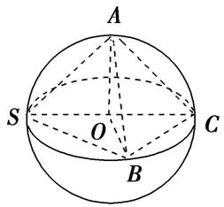
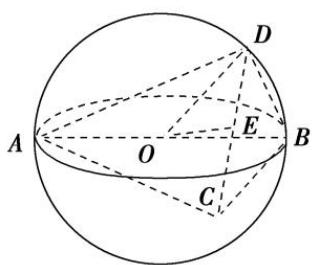
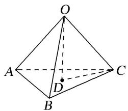
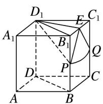
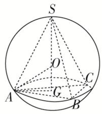
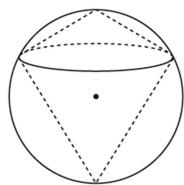
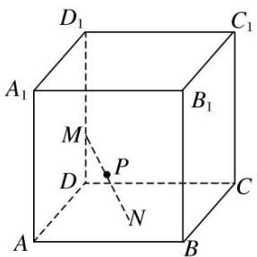

# 专题八 已知球心或球半径模型

# 【例题选讲】

[例] (1)(2017·全国 I)已知三棱锥 S-ABC 的所有顶点都在球 O 的球面上，SC 是球 O 的直径。若平面 SCA⊥平面 SCB，SA=AC，SB=BC，三棱锥 S-ABC 的体积为 9，则球 O 的表面积为 \_\_\_\_。

答案 $36\pi$ 解析 如图，连接 $AO, OB, \because SC$ 为球 $O$ 的直径，∴点 $O$ 为 $SC$ 的中点， $\because SA = AC, SB = BC,$

text_image

A
S O C
B

$\therefore AO \perp SC, BO \perp SC, \because$ 平面 $SCA \perp$ 平面 $SCB$ , 平面 $SCA \cap$ 平面 $SCB = SC, \therefore AO \perp$ 平面 $SCB$ , 设球 $O$ 的半径为 $R$ , 则 $OA = OB = R, SC = 2R$ . $\therefore V_{S-ABC} = V_{A-SBC} = \frac{1}{3} \times S_{\triangle SBC} \times AO = \frac{1}{3} \times \left(\frac{1}{2} \times SC \times OB\right) \times AO$ , 即 $9 = \frac{1}{3} \times \left(\frac{1}{2} \times 2R \times R\right) \times R$ , 解得 $R = 3, \therefore$ 球 $O$ 的表面积为 $S = 4\pi R^2 = 4\pi \times 3^2 = 36\pi$ .

(2)已知三棱锥 A-BCD 的所有顶点都在球 O 的球面上，AB 为球 O 的直径，若该三棱锥的体积为 $\sqrt{3}$ ，BC=3， $BD=\sqrt{3}$ ， $\angle CBD=90^{\circ}$ ，则球 O 的体积为 \_\_\_\_.

答案 $\frac{32\pi}{3}$ 解析 设 $A$ 到平面 $BCD$ 的距离为 $h$ , $\because$ 三棱锥的体积为 $\sqrt{3}$ , $BC = 3$ , $BD = \sqrt{3}$ , $\angle CBD = 90^\circ$ , $\therefore \frac{1}{3} \times \frac{1}{2} \times 3 \times \sqrt{3} \times h = \sqrt{3}$ , $\therefore h = 2$ , $\therefore$ 球心 $O$ 到平面 $BCD$ 的距离为 1. 设 $CD$ 的中点为 $E$ , 连接 $OE$ , 则由球的截面性质可得 $OE \perp$ 平面 $CBD$ , $\because \triangle BCD$ 外接圆的直径 $CD = 2\sqrt{3}$ , $\therefore$ 球 $O$ 的半径 $OD = 2$ , $\therefore$ 球 $O$ 的体积为 $\frac{32\pi}{3}$ .

text_image

Geometric diagram of a sphere with labeled points A, B, C, D, E, and O, showing internal line segments and dashed lines.

(3)(2012 全国 I)已知三棱锥 $S-ABC$ 的所有顶点都在球 $O$ 的球面上, $\triangle ABC$ 是边长为 1 的正三角形, $SC$ 为球 $O$ 的直径, 且 $SC=2$ , 则此棱锥的体积为( )

A. $\frac{\sqrt{2}}{6}$

B. $\frac{\sqrt{3}}{6}$

C. $\frac{\sqrt{2}}{3}$

D. $\frac{\sqrt{2}}{2}$

答案 A 解析 由于三棱锥 S-ABC 与三棱锥 O-ABC 底面都是 $\triangle ABC$ ，O 是 SC 的中点，因此三棱锥 S-ABC 的高是三棱锥 O-ABC 高的 2 倍，所以三棱锥 S-ABC 的体积也是三棱锥 O-ABC 体积的 2 倍。在三棱锥 O-ABC 中，其棱长都是 1，如图所示， $S_{\triangle ABC} = \frac{\sqrt{3}}{4} \times AB^{2} = \frac{\sqrt{3}}{4}$ ，高 $OD = \sqrt{1^{2} - \left(\frac{\sqrt{3}}{3}\right)^{2}} = \frac{\sqrt{6}}{3}$ ， $\therefore V_{S-ABC} = 2V_{O-ABC} = 2 \times \frac{1}{3} \times \frac{\sqrt{3}}{4} \times \frac{\sqrt{6}}{3} = \frac{\sqrt{2}}{6}$ 。故选 A.

text_image

Geometric diagram of a tetrahedron with labeled vertices O, A, B, C, and D, showing solid and dashed edges.

(4)(2020·新高考全国I)已知直四棱柱 $ABCD - A_{1}B_{1}C_{1}D_{1}$ 的棱长均为 2， $\angle BAD = 60^{\circ}$ 。以 $D_{1}$ 为球心， $\sqrt{5}$ 为半径的球面与侧面 $BCC_{1}B_{1}$ 的交线长为 \_\_\_\_.

答案 $\frac{\sqrt{2}\pi}{2}$ 解析 如图，设 $B_{1}C_{1}$ 的中点为 E，

text_image

D₁
E C₁
A₁ B₁ Q
P
D C
A B

球面与棱 $BB_{1}$ , $CC_{1}$ 的交点分别为 $P$ , $Q$ , 连接 $DB$ , $D_{1}B_{1}$ , $D_{1}P$ , $D_{1}E$ , $EP$ , $EQ$ , 由 $\angle BAD = 60^{\circ}$ , $AB = AD$ , 知 $\triangle ABD$ 为等边三角形, $\therefore D_{1}B_{1} = DB = 2$ , $\therefore \triangle D_{1}B_{1}C_{1}$ 为等边三角形, 则 $D_{1}E = \sqrt{3}$ 且 $D_{1}E \perp$ 平面 $BCC_{1}B_{1}$ , $\therefore E$ 为球面截侧面 $BCC_{1}B_{1}$ 所得截面圆的圆心, 设截面圆的半径为 $r$ , 则 $r = \sqrt{R_{\text{球}}^{2} - D_{1}E^{2}} = \sqrt{5 - 3} = \sqrt{2}$ . 又由题意可得 $EP = EQ = \sqrt{2}$ , $\therefore$ 球面与侧面 $BCC_{1}B_{1}$ 的交线为以 $E$ 为圆心的圆弧 $PQ$ . 又 $D_{1}P = \sqrt{5}$ , $\therefore B_{1}P = \sqrt{D_{1}P^{2} - D_{1}B_{1}^{2}} = 1$ , 同理 $C_{1}Q = 1$ , $\therefore P, Q$ 分别为 $BB_{1}$ , $CC_{1}$ 的中点, $\therefore \angle PEQ = \frac{\pi}{2}$ , 知 $\widehat{PQ}$ 的长为 $\frac{\pi}{2} \times \sqrt{2} = \frac{\sqrt{2}\pi}{2}$ , 即交线长为 $\frac{\sqrt{2}\pi}{2}$ .

(5)三棱锥 S-ABC 的底面各棱长均为 3，其外接球半径为 2，则三棱锥 S-ABC 的体积最大时，点 S 到平面 ABC 的距离为()

A. $2 + \sqrt{3}$

B. $2 - \sqrt{3}$

C. 3

D. 2

答案 C 解析 如图，设三棱锥 S-ABC 底面三角形 ABC 的外心为 G，三棱锥外接球的球心为 O，要使三棱锥 S-ABC 的体积最大，则 O 在 SG 上，由底面三角形的边长为 3，可得 $AG=\frac{3}{2\sin60^{\circ}}=\sqrt{3}$ 。连接 OA，在 Rt△OGA 中，由勾股定理求得 $OG=\sqrt{OA^{2}-GA^{2}}=\sqrt{2^{2}-(\sqrt{3})^{2}}=1$ 。∴ 点 S 到平面 ABC 的距离为 $OS+OG=2+1=3$ 。故选 C。

text_image

S
O
C
A
G
B

# 【对点训练】

1. 已知三棱锥 $P - ABC$ 的所有顶点都在球 $O$ 的球面上， $\triangle ABC$ 满足 $AB = 2\sqrt{2}$ ， $\angle ACB = 90^{\circ}$ ， $PA$ 为球 $O$ 的直径且 $PA = 4$ ，则点 $P$ 到底面 $ABC$ 的距离为（）

A. $\sqrt{2}$

B. $2\sqrt{2}$

C. $\sqrt{3}$

D. $2\sqrt{3}$

2. 已知矩形 $ABCD$ 的顶点都在球心为 $O$ , 半径为 $R$ 的球面上, $AB = 6$ , $BC = 2\sqrt{3}$ , 且四棱锥 $O - ABCD$ .

的体积为 $8\sqrt{3}$ ，则 R 等于()

A. 4

B. $2\sqrt{3}$

C. $\frac{4\sqrt{7}}{9}$

D. $\sqrt{13}$

3. 已知三棱锥 $P - ABC$ 的四个顶点均在某球面上, $PC$ 为该球的直径, $\triangle ABC$ 是边长为 4 的等边三角形,三棱锥 $P - ABC$ 的体积为 $\frac{16}{3}$ , 则此三棱锥的外接球的表面积为( )

A. $\frac{16\pi}{3}$

B. $\frac{40\pi}{3}$

C. $\frac{64\pi}{3}$

D. $\frac{80\pi}{3}$

4. 已知三棱锥 A-SBC 的体积为 $\frac{2\sqrt{3}}{3}$ ，各顶点均在以 PA 为直径球面上， $AB = AC = \sqrt{2}$ ，BC = 2，则这个球的表面积为 \_\_\_\_.

5. (2017·全国III)已知圆柱的高为 1，它的两个底面的圆周在直径为 2 的同一个球的球面上，则该圆柱的体积为 \_\_\_\_.

6. (2020·全国I)已知 A, B, C 为球 O 的球面上的三个点， $\odot O_{1}$ 为 $\triangle ABC$ 的外接圆，若 $\odot O_{1}$ 的面积为 $4\pi$ ,

$AB=BC=AC=OO_{1}$ ，则球 O 的表面积为()

A. $64\pi$

B. $48\pi$

C. $36\pi$

D. $32\pi$

7. (2020·全国II)已知 $\triangle ABC$ 是面积为 $\frac{9\sqrt{3}}{4}$ 的等边三角形，且其顶点都在球 $O$ 的球面上．若球 $O$ 的表面积为 $16\pi$ ，则 $O$ 到平面 $ABC$ 的距离为( )

A. $\sqrt{3}$

B. $\frac{3}{2}$

C. 1

D. $\frac{\sqrt{3}}{2}$

8. 如图, 半径为 $R$ 的球的两个内接圆锥有公共的底面, 若两个圆锥的体积之和为球的体积的 $\frac{3}{8}$ , 则这两个圆锥高之差的绝对值为( )

A. $\frac{R}{2}$

B. $\frac{2R}{3}$

C. $\frac{4R}{3}$

D. R

9. 如图, 已知正方体 $ABCD-A_{1}B_{1}C_{1}D_{1}$ 的棱长为 2 , 长为 2 的线段 $MN$ 的一个端点 $M$ 在棱 $DD_{1}$ 上运动, 点 $N$ 在正方体的底面 $ABCD$ 内运动, 则 $MN$ 的中点 $P$ 的轨迹的面积是( )

text_image

D₁
C₁
A₁
M
B₁
P
D
N
C
A
B

A. $4\pi$

B. $\pi$

C. $2\pi$

D. $\frac{\pi}{2}$

10. 在三棱锥 $A - BCD$ 中, 底面为 $Rt \triangle$ , 且 $BC \perp CD$ , 斜边 $BD$ 上的高为 1 , 三棱锥 $A - BCD$ 的外接球的直径是 $AB$ , 若该外接球的表面积为 $16\pi$ , 则三棱锥 $A - BCD$ 的体积的最大值为 \_\_\_\_.

