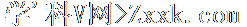
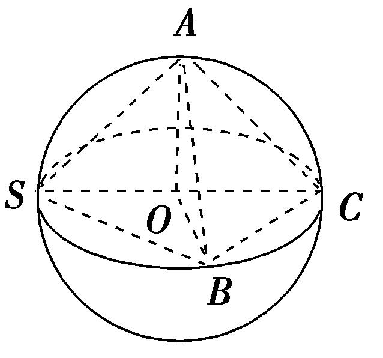
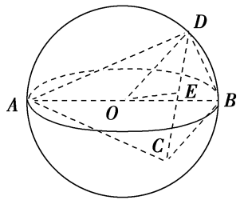
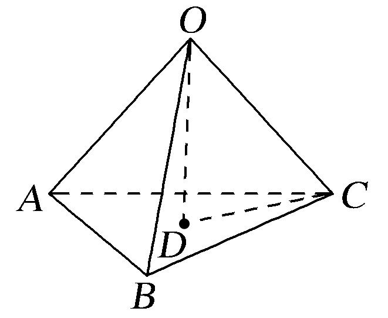
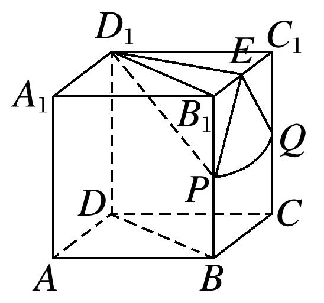
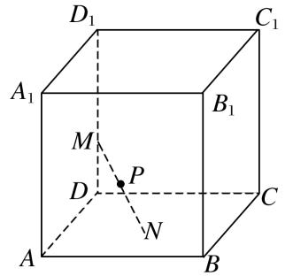

专题八　已知球心或球半径模型

【例题选讲】

<strong>[例]</strong>　（1）(2017·全国Ⅰ)已知三棱锥<em>S</em>－<em>ABC</em>的所有顶点都在球<em>O</em>的球面上，<em>SC</em>是球<em>O</em>的直径．若平面<em>SCA</em>⊥平面<em>SCB</em>，<em>SA</em>＝<em>AC</em>，<em>SB</em>＝<em>BC</em>，三棱锥<em>S</em>－<em>ABC</em>的体积为9，则球<em>O</em>的表面积为\_\_\_\_\_\_\_\_．

答案　36π　解析　如图，连接*AO*，*OB*，∵*SC*为球*O*的直径，∴点*O*为*SC*的中点，∵*SA*＝*AC*，*SB*＝*BC*，

∴<em>AO</em>⊥<em>SC</em>，<em>BO</em>⊥<em>SC</em>，∵平面<em>SCA</em>⊥平面<em>SCB</em>，平面<em>SCA</em>∩平面<em>SCB</em>＝<em>SC</em>，∴<em>AO</em>⊥平面<em>SCB</em>，设球<em>O</em>的半径为<em>R</em>，则<em>OA</em>＝<em>OB</em>＝<em>R</em>，<em>SC</em>＝2<em>R</em>．∴<em>VS</em>­<em>ABC</em>＝<em>VA</em>­<em>SBC</em>＝×<em>S</em>△<em>SBC</em>×<em>AO</em>＝××<em>AO</em>，即9＝××<em>R</em>，解得<em>R</em>＝3，∴球<em>O</em>的表面积为<em>S</em>＝4π<em>R</em>2＝4π×32＝36π．

  
（2）已知三棱锥*A*－*BCD*的所有顶点都在球*O*的球面上，*AB*为球*O*的直径，若该三棱锥的体积为，*BC*＝3，*BD*＝，∠*CBD*＝90˚，则球*O*的体积为\_\_\_\_\_\_\_\_．

答案　　解析　设*A*到平面*BCD*的距离为*h*，∵三棱锥的体积为，*BC*＝3，*BD*＝，∠*CBD*＝90˚，∴××3××*h*＝，∴*h*＝2，∴球心*O*到平面*BCD*的距离为1．设*CD*的中点为*E*，连接*OE*，则由球的截面性质可得*OE*⊥平面*CBD*，∵△*BCD*外接圆的直径*CD*＝2，∴球*O*的半径*OD*＝2，∴球*O*的体积为．

  
（3）(2012全国Ⅰ)已知三棱锥*S*－*ABC*的所有顶点都在球*O*的球面上，△*ABC*是边长为1的正三角形，*SC*为球*O*的直径，且*SC*＝2，则此棱锥的体积为(　　)

A．　　　　　　　　
B．　　　　　　　　
C．　　　　　　　　
D．

答案　A　解析　由于三棱锥<em>S</em>－<em>ABC</em>与三棱锥<em>O</em>－<em>ABC</em>底面都是△<em>ABC</em>，<em>O</em>是<em>SC</em>的中点，因此三棱锥<em>S</em>－<em>ABC</em>的高是三棱锥<em>O</em>－<em>ABC</em>高的2倍，所以三棱锥<em>S</em>－<em>ABC</em>的体积也是三棱锥<em>O</em>－<em>ABC</em>体积的2倍．在三棱锥<em>O</em>－<em>ABC</em>中，其棱长都是1，如图所示，<em>S</em>△<em>ABC</em>＝×<em>AB</em>2＝，高<em>OD</em>＝＝，∴<em>VS</em>－<em>ABC</em>＝2<em>VO</em>－<em>ABC</em>＝2×××＝．故选A．

  
（4）(2020·新高考全国Ⅰ)已知直四棱柱<em>ABCD</em>－<em>A</em>1<em>B</em>1<em>C</em>1<em>D</em>1的棱长均为2，∠<em>BAD</em>＝60°．以<em>D</em>1为球心，为半径的球面与侧面<em>BCC</em>1<em>B</em>1的交线长为\_\_\_\_\_\_\_\_．

答案　　解析　如图，设<em>B</em>1<em>C</em>1的中点为<em>E</em>，

球面与棱<em>BB</em>1，<em>CC</em>1的交点分别为<em>P</em>，<em>Q</em>，连接<em>DB</em>，<em>D</em>1<em>B</em>1，<em>D</em>1<em>P</em>，<em>D</em>1<em>E</em>，<em>EP</em>，<em>EQ</em>，由∠<em>BAD</em>＝60°，<em>AB</em>＝<em>AD</em>，知△<em>ABD</em>为等边三角形，∴<em>D</em>1<em>B</em>1＝<em>DB</em>＝2，∴△<em>D</em>1<em>B</em>1<em>C</em>1为等边三角形，则<em>D</em>1<em>E</em>＝且<em>D</em>1<em>E</em>⊥平面<em>BCC</em>1<em>B</em>1，∴<em>E</em>为球面截侧面<em>BCC</em>1<em>B</em>1所得截面圆的圆心，设截面圆的半径为<em>r</em>，则<em>r</em>＝＝＝．又由题意可得<em>EP</em>＝<em>EQ</em>＝，∴球面与侧面<em>BCC</em>1<em>B</em>1的交线为以<em>E</em>为圆心的圆弧<em>PQ</em>．又<em>D</em>1<em>P</em>＝，∴<em>B</em>1<em>P</em>＝＝1，同理<em>C</em>1<em>Q</em>＝1，∴<em>P</em>，<em>Q</em>分别为<em>BB</em>1，<em>CC</em>1的中点，∴∠<em>PEQ</em>＝，知的长为×＝，即交线长为．

  
（5）三棱锥*S*－*ABC*的底面各棱长均为3，其外接球半径为2，则三棱锥*S*－*ABC*的体积最大时，点*S*到平面*ABC*的距离为(　　)

A．2＋　　　　　　
B．2－　　　　　　
C．3　　　　　　
D．2

答案　C　解析　如图，设三棱锥*S*－*ABC*底面三角形*ABC*的外心为*G*，三棱锥外接球的球心为*O*，要使三棱锥*S*－*ABC*的体积最大，则*O*在*SG*上，由底面三角形的边长为3，可得*AG*＝＝．连接*OA*，在Rt△*OGA*中，由勾股定理求得*OG*＝＝ ＝1．∴点*S*到平面*ABC*的距离为*OS*＋*OG*＝2＋1＝3．故选C．

【对点训练】

1．已知三棱锥*P*－*ABC*的所有顶点都在球*O*的球面上，△*ABC*满足*AB*＝2，∠*ACB*＝90°，*PA*为球*O*

的直径且*PA*＝4，则点*P*到底面*ABC*的距离为(　　)

A．　　　　　　　　
B．2　　　　　　　　
C． 　　　　　　　　
D．2

2．已知矩形*ABCD*的顶点都在球心为*O*，半径为*R*的球面上，*AB*＝6，*BC*＝2，且四棱锥*O*－*ABCD*

的体积为8，则*R*等于(　　)

A．4　　　　　　　　
B．2　　　　　　　　
C．　　　　　　　　
D．

3．已知三棱锥*P*－*ABC*的四个顶点均在某球面上，*PC*为该球的直径，△*ABC*是边长为4的等边三角形，

三棱锥*P*－*ABC*的体积为，则此三棱锥的外接球的表面积为(　　)

A．　　　　　　　　
B．　　　　　　　　
C．　　　　　　　　
D．

4．已知三棱锥的体积为，各顶点均在以为直径球面上，，则这

个球的表面积为\_\_\_\_\_\_\_\_\_\_\_\_\_．

5．(2017·全国Ⅲ)已知圆柱的高为1，它的两个底面的圆周在直径为2的同一个球的球面上，则该圆柱的

体积为\_\_\_\_\_\_\_\_．

6．(2020·全国Ⅰ)已知<em>A</em>，<em>B</em>，<em>C</em>为球<em>O</em>的球面上的三个点，⊙<em>O</em>1为△<em>ABC</em>的外接圆，若⊙<em>O</em>1的面积为4π，

<em>AB</em>＝<em>BC</em>＝<em>AC</em>＝<em>OO</em>1，则球<em>O</em>的表面积为(　　)

A．64π　　　　　　　　
B．48π　　　　　　　　
C．36π　　　　　　　　
D．32π

7．(2020·全国Ⅱ)已知△*ABC*是面积为的等边三角形，且其顶点都在球*O*的球面上．若球*O*的表面积

为16π，则*O*到平面*ABC*的距离为(　　)

A．　　　　　　　　
B．　　　　　　　　
C．1　　　　　　　　
D．

8．如图，半径为*R*的球的两个内接圆锥有公共的底面，若两个圆锥的体积之和为球的体积的，则这两个

圆锥高之差的绝对值为(　　)

A．　　　　　　　　
B．　　　　　　　　
C．　　　　　　　　
D．*R*

9．如图，已知正方体<em>ABCD</em>—<em>A</em>1<em>B</em>1<em>C</em>1<em>D</em>1的棱长为2，长为2的线段<em>MN</em>的一个端点<em>M</em>在棱<em>DD</em>1上运动，

点*N*在正方体的底面*ABCD*内运动，则*MN*的中点*P*的轨迹的面积是(　　)

A．4π　　　　　　　　
B．π　　　　　　　　
C．2π　　　　　　　　
D．

10．在三棱锥中，底面为△，且，斜边上的高为1，三棱锥的外接球的

直径是，若该外接球的表面积为，则三棱锥的体积的最大值为\_\_\_\_\_\_\_\_．

