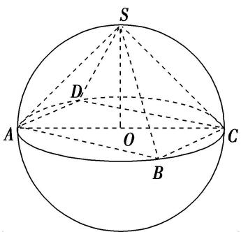
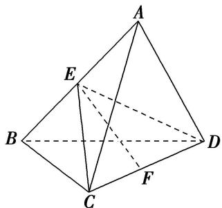
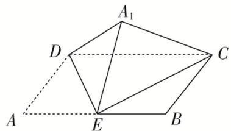

# 专题九 最值模型

# 【方法总结】

最值问题的解法有两种方法：一种是几何法，即在运动变化过程中得到最值，从而转化为定值问题求解．另一种是代数方法，即建立目标函数，从而求目标函数的最值．

# 【例题选讲】

[例] (1)已知三棱锥 P-ABC 的顶点 P, A, B, C 在球 O 的球面上， $\triangle ABC$ 是边长为 $\sqrt{3}$ 的等边三角形，如果球 O 的表面积为 $36\pi$ ，那么 P 到平面 ABC 距离的最大值为 \_\_\_\_.

(2)在四面体 ABCD 中，AB=1， $BC=CD=\sqrt{3}$ ， $AC=\sqrt{2}$ ，当四面体 ABCD 的体积最大时，其外接球的表面积为()

A. $2\pi$

B. $3\pi$

C. $6\pi$

D. $8\pi$

(3)已知四棱锥 S-ABCD 的所有顶点在同一球面上，底面 ABCD 是正方形且球心 O 在此平面内，当四棱锥的体积取得最大值时，其表面积等于 $16+16\sqrt{3}$ ，则球 O 的体积等于()

A. $\frac{4\sqrt{2}\pi}{3}$

B. $\frac{16\sqrt{2}\pi}{3}$

C. $\frac{32\sqrt{2}\pi}{3}$

D. $\frac{64\sqrt{2}\pi}{3}$

text_image

S
D
A
O
C
B

(4)三棱锥 $A - BCD$ 内接于半径为 $\sqrt{5}$ 的球 $O$ 中， $AB = CD = 4$ ，则三棱锥 $A - BCD$ 的体积的最大值为（）

A. $\frac{4}{3}$

B. $\frac{8}{3}$

C. $\frac{16}{3}$

D. $\frac{32}{3}$

text_image

Geometric diagram of a tetrahedron with labeled vertices A, B, C, D and internal points E, F, showing solid and dashed edges.

(5)已知正四棱柱的顶点在同一个球面上，且球的表面积为 $12\pi$ ，当正四棱柱的体积最大时，正四棱柱的高为\_\_\_\_。

# 【对点训练】

1. 三棱锥 $P - ABC$ 的四个顶点都在体积为 $\frac{500\pi}{3}$ 的球的表面上, 底面 $ABC$ 所在的小圆面积为 $16\pi$ , 则该三棱锥的高的最大值为( )

A. 4

B. 6

C. 8

D. 10

2. (2015·全国Ⅱ)已知 A, B 是球 O 的球面上两点， $\angle AOB=90^{\circ}$ ，C 为该球面上的动点．若三棱锥 O-ABC 体积的最大值为 36，则球 O 的表面积为()

A. $36\pi$

B. $64\pi$

C. $144\pi$

D. $256\pi$

3. 已知点 $A, B, C, D$ 均在球 $O$ 上， $AB = BC = \sqrt{6}, AC = 2\sqrt{3}$ 。若三棱锥 $D - ABC$ 体积的最大值为 3，则球 $O$ 的表面积为 \_\_\_\_.

4. 在三棱锥 $A - BCD$ 中, $AB = 1$ , $BC = \sqrt{2}$ , $CD = AC = \sqrt{3}$ , 当三棱锥 $A - BCD$ 的体积最大时, 其外接球的表面积为 \_\_\_\_.

5. 已知三棱锥 $D - ABC$ 的所有顶点都在球 $O$ 的球面上, $AB = BC = 2$ , $AC = 2\sqrt{2}$ , 若三棱锥 $D - ABC$ 体积的最大值为 2, 则球 $O$ 的表面积为 ( )

A. $8\pi$

B. $9\pi$

C. $\frac{25\pi}{3}$

D. $\frac{121\pi}{9}$

6. 三棱锥 $A - BCD$ 的一条棱长为 $a$ , 其余棱长均为 2, 当三棱锥 $A - BCD$ 的体积最大时, 它的外接球的表面积为( )

A. $\frac{21\pi}{4}$

B. $\frac{20\pi}{3}$

C. $\frac{5\pi}{4}$

D. $\frac{5\pi}{3}$

7. 已知三棱锥 $O - ABC$ 的顶点 $A, B, C$ 都在半径为 2 的球面上， $O$ 是球心， $\angle AOB = 120^{\circ}$ ，当 $\triangle AOC$ 与 $\triangle BOC$ 的面积之和最大时，三棱锥 $O - ABC$ 的体积为（）

A. $\frac{\sqrt{3}}{2}$

B. $\frac{2\sqrt{3}}{3}$

C. $\frac{2}{3}$

D. $\frac{1}{3}$

8. (2018·全国III)设 A, B, C, D 是同一个半径为 4 的球的球面上四点， $\triangle ABC$ 为等边三角形且其面积为 $9\sqrt{3}$ ，则三棱锥 D-ABC 体积的最大值为()

A. $12\sqrt{3}$

B. $18\sqrt{3}$

C. $24\sqrt{3}$

D. $54\sqrt{3}$

9. 已知球的直径 $SC = 4, A, B$ 是该球球面上的两点， $\angle ASC = \angle BSC = 30^{\circ}$ ，则棱锥 $S - ABC$ 的体积最大为（）

A. 2

B. $\frac{8}{3}$

C. $\sqrt{3}$

D. $2\sqrt{3}$

10. 四棱锥 $P - ABCD$ 的底面为矩形, 矩形的四个顶点 $A, B, C, D$ 在球 $O$ 的同一个大圆上, 且球的表面积为 $16 \pi$ , 点 $P$ 在球面上, 则四棱锥 $P - ABCD$ 体积的最大值为 ( )

A. 8

B. $\frac{8}{3}$

C. 16

D. $\frac{16}{3}$

11. (2016·全国III)在封闭的直三棱柱 $ABC - A_{1}B_{1}C_{1}$ 内有一个体积为 $V$ 的球．若 $AB \perp BC, AB = 6, BC = 8,$ $AA_{1} = 3$ ，则 $V$ 的最大值是（）

A. $4\pi$

B. $\frac{9\pi}{2}$

C. $6\pi$

D. $\frac{32\pi}{3}$

12. 已知半径为 1 的球 $O$ 中内接一个圆柱, 当圆柱的侧面积最大时, 球的体积与圆柱的体积的比值为 \_\_\_\_.

13. 如图, 在矩形 $ABCD$ 中, 已知 $AB = 2AD = 2a$ , $E$ 是 $AB$ 的中点, 将 $\triangle ADE$ 沿直线 $DE$ 翻折成 $\triangle A_{1}DE$ , 连接 $A_{1}C$ . 若当三棱锥 $A_{1}-CDE$ 的体积取得最大值时, 三棱锥 $A_{1}-CDE$ 外接球的体积为 $\frac{8\sqrt{2}\pi}{3}$ , 则 $a=(\quad)$

text_image

A₁
D
C
A
E
B

A. 2

B. $\sqrt{2}$

C. $2\sqrt{2}$

D. 4

14. 已知三棱锥 $S - ABC$ 的顶点都在球 $O$ 的球面上，且该三棱锥的体积为 $2\sqrt{3}$ ， $SA \perp$ 平面 $ABC$ ， $SA = 4$ ， $\angle ABC = 120^\circ$ ，则球 $O$ 的体积的最小值为 \_\_\_\_.

