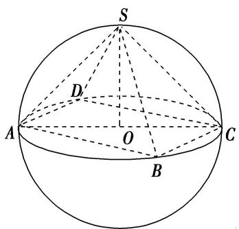
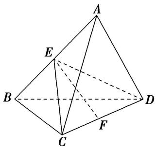
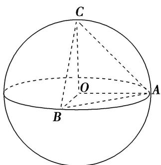
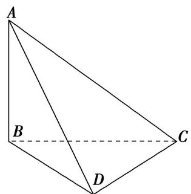
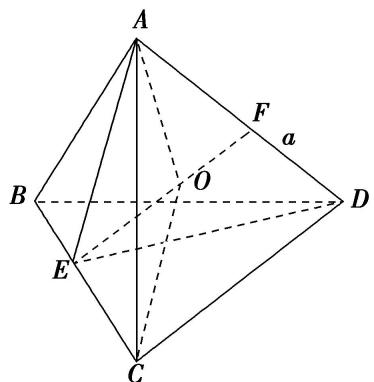
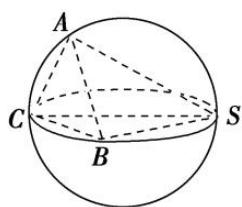
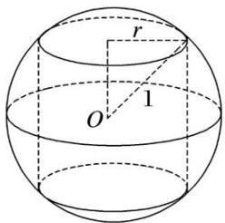
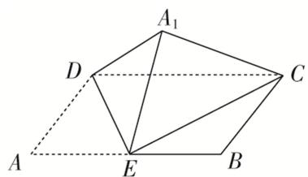
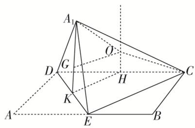
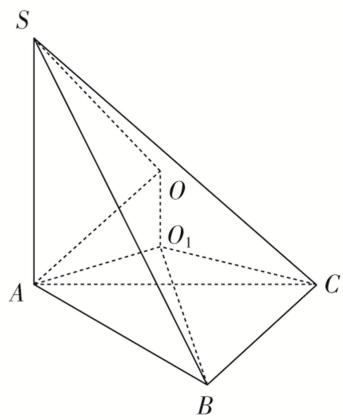

# 专题九 最值模型

# 【方法总结】

最值问题的解法有两种方法：一种是几何法，即在运动变化过程中得到最值，从而转化为定值问题求解．另一种是代数方法，即建立目标函数，从而求目标函数的最值．

# 【例题选讲】

[例] （1）已知三棱锥 P-ABC 的顶点 P, A, B, C 在球 O 的球面上， $\triangle ABC$ 是边长为 $\sqrt{3}$ 的等边三角形，如果球 O 的表面积为 $36\pi$ ，那么 P 到平面 ABC 距离的最大值为 \_\_\_\_.
答案 $3 + 2\sqrt{2}$ 解析 依题意，边长是 $\sqrt{3}$ 的等边 $\triangle ABC$ 的外接圆半径 $r = \frac{1}{2} \cdot \frac{\sqrt{3}}{\sin 60^\circ} = 1$ . ∵ 球 $O$ 的表面积为 $36\pi = 4\pi R^2$ ，∴ 球 $O$ 的半径 $R = 3$ ，∴ 球心 $O$ 到平面 $ABC$ 的距离 $d = \sqrt{R^2 - r^2} = 2\sqrt{2}$ ，∴ 球面上的点 $P$ 到平面 $ABC$ 距离的最大值为 $R + d = 3 + 2\sqrt{2}$ .  
（2）在四面体 $ABCD$ 中， $AB = 1$ ， $BC = CD = \sqrt{3}$ ， $AC = \sqrt{2}$ ，当四面体 $ABCD$ 的体积最大时，其外接球的表面积为（）

A. $2\pi$

B. $3\pi$

C. $6\pi$

D. $8\pi$
答案 C 解析 $\because AB = 1, BC = \sqrt{3}, AC = \sqrt{2}$ ，由勾股定理可得 $AB^2 + AC^2 = BC^2$ ，所以 $\triangle ABC$ 是以 $BC$ 为斜边的直角三角形，且该三角形的外接圆直径为 $BC = \sqrt{3}$ ，当 $CD \perp$ 平面 $ABC$ 时，四面体 $ABCD$ 的体积取最大值，此时，其外接球的直径为 $2R = \sqrt{BC^2 + CD^2} = \sqrt{6}$ ，因此，四面体 $ABCD$ 的外接球的表面积为 $4\pi R^2 = \pi \times (2R)^2 = 6\pi$ 。故选 C.  
（3）已知四棱锥 $S - ABCD$ 的所有顶点在同一球面上，底面ABCD是正方形且球心 $O$ 在此平面内，当四棱锥的体积取得最大值时，其表面积等于 $16 + 16\sqrt{3}$ ，则球 $O$ 的体积等于（）

A. $\frac{4\sqrt{2}\pi}{3}$

B. $\frac{16\sqrt{2}\pi}{3}$

C. $\frac{32\sqrt{2}\pi}{3}$

D. $\frac{64\sqrt{2}\pi}{3}$
答案 D 解析 由题意得，当四棱锥的体积取得最大值时，该四棱锥为正四棱锥。因为该四棱锥的表面积等于 $16 + 16\sqrt{3}$ ，设球 $O$ 的半径为 $R$ ，则 $AC = 2R, SO = R$ ，如图，所以该四棱锥的底面边长 $AB = \sqrt{2} R$ ，则有 $(\sqrt{2} R)^2 + 4 \times \frac{1}{2} \times \sqrt{2} R \times \sqrt{(\sqrt{2} R)^2 - \left(\frac{\sqrt{2}}{2} R\right)^2} = 16 + 16\sqrt{3}$ ，解得 $R = 2\sqrt{2}$ ，所以球 $O$ 的体积是 $\frac{4}{3}\pi R^3 = \frac{64\sqrt{2}}{3}\pi$ 。故选 D.

  
（4）三棱锥 $A - BCD$ 内接于半径为 $\sqrt{5}$ 的球 $O$ 中， $AB = CD = 4$ ，则三棱锥 $A - BCD$ 的体积的最大值为（）

A. $\frac{4}{3}$

B. $\frac{8}{3}$

C. $\frac{16}{3}$

D. $\frac{32}{3}$
答案 C 解析 如图，过 CD 作平面 ECD，使 $AB \perp$ 平面 ECD，交 AB 于点 E，设点 E 到 CD 的距离为 EF，当球心在 EF 上时，EF 最大，此时 E，F 分别为 AB，CD 的中点，且球心 O 为 EF 的中点，所以

EF=2，所以 $V_{\max}=\frac{1}{3}\times\frac{1}{2}\times4\times2\times4=\frac{16}{3}$ ，故选 C.

  
（5）已知正四棱柱的顶点在同一个球面上，且球的表面积为 $12\pi$ ，当正四棱柱的体积最大时，正四棱柱的高为\_\_\_\_。
答案 8 解析 设正四棱柱的底面边长为 a，高为 h，球的半径为 r，由题意知 $4\pi r^{2}=12\pi$ ，所以 $r^{2}=3$ ，又 $2a^{2}+h^{2}=(2r)^{2}=12$ ，所以 $a^{2}=6-\frac{h^{2}}{2}$ ，所以正四棱柱的体积 $V=a^{2}h=\left(6-\frac{h^{2}}{2}\right)h$ ，则 $V'=6-\frac{3}{2}h^{2}$ ，由 $V'>0$ ，得 0<h<2，由 $V'<0$ ，得 h>2，所以当 h=2 时，正四棱柱的体积最大， $V_{max}=8$ 。

# 【对点训练】

1. 三棱锥 $P - ABC$ 的四个顶点都在体积为 $\frac{500\pi}{3}$ 的球的表面上, 底面 $ABC$ 所在的小圆面积为 $16\pi$ , 则该三棱锥的高的最大值为( )

A. 4

B. 6

C. 8

D. 10

1. 答案 C 解析 依题意, 设题中球的球心为 $O$ 、半径为 $R$ , $\triangle ABC$ 的外接圆半径为 $r$ , 则 $\frac{4\pi R^3}{3} = \frac{500\pi}{3}$ , 解得 $R = 5$ , 由 $\pi r^2 = 16\pi$ , 解得 $r = 4$ , 又球心 $O$ 到平面 $ABC$ 的距离为 $\sqrt{R^2 - r^2} = 3$ , 因此三棱锥 $P - ABC$ 的高的最大值为 $5 + 3 = 8$ .

2. (2015·全国Ⅱ)已知 A, B 是球 O 的球面上两点， $\angle AOB=90^{\circ}$ ，C 为该球面上的动点．若三棱锥 O-ABC 体积的最大值为 36，则球 O 的表面积为()

A. $36\pi$

B. $64\pi$

C. $144\pi$

D. $256\pi$

2. 答案 C 解析 $\because S_{\triangle OAB}$ 是定值，且 $V_{O - ABC} = V_{C - OAB}$ ， $\therefore$ 当 $OC \perp$ 平面 $OAB$ 时， $V_{C - OAB}$ 最大，即 $V_{O - ABC}$ 最大。设球 $O$ 的半径为 $R$ ，则 $(V_{O - ABC})_{\max} = \frac{1}{3} \times \frac{1}{2} R^2 \times R = \frac{1}{6} R^3 = 36, \therefore R = 6, \therefore$ 球 $O$ 的表面积 $S = 4\pi R^2 = 4\pi \times 6^2 = 144\pi$ .

3. 已知点 $A, B, C, D$ 均在球 $O$ 上， $AB = BC = \sqrt{6}, AC = 2\sqrt{3}$ 。若三棱锥 $D - ABC$ 体积的最大值为 3，则球 $O$ 的表面积为 \_\_\_\_.

3. 答案 $16\pi$ 解析 由题意可得， $\angle ABC = \frac{\pi}{2}$ ， $\triangle ABC$ 的外接圆半径 $r = \sqrt{3}$ ，当三棱锥的体积最大时，
$V_{D-ABC}=\frac{1}{3}S_{\triangle ABC}\cdot h(h \text{ 为 } D \text{ 到底面 } ABC \text{ 的距离})$ ，即 $3=\frac{1}{3}\times\frac{1}{2}\times\sqrt{6}\times\sqrt{6}h\Rightarrow h=3$ ，即 $R+\sqrt{R^{2}-r^{2}}=3(R \text{ 为外接球半径})$ ，解得 R=2，∴球 O 的表面积为 $4\pi\times2^{2}=16\pi$ .

4. 在三棱锥 $A - BCD$ 中, $AB = 1$ , $BC = \sqrt{2}$ , $CD = AC = \sqrt{3}$ , 当三棱锥 $A - BCD$ 的体积最大时, 其外接球的表面积为 \_\_\_\_.

4. 答案 $6\pi$ 解析 $\because AB=1, BC=\sqrt{2}, AC=\sqrt{3}, \therefore AB^{2}+BC^{2}=AC^{2}$ ，即 $\triangle ABC$ 为直角三角形，当 CD 上面 ABC 时，三棱锥 A-BCD 的体积最大，又 $\because CD=\sqrt{3}, \triangle ABC$ 外接圆的半径为 $\frac{\sqrt{3}}{2}$ ，故外接球的半径 R 满足 $R^{2}=\left(\frac{\sqrt{3}}{2}\right)^{2}+\left(\frac{\sqrt{3}}{2}\right)^{2}=\frac{3}{2}$ ，∴ 外接球的表面积为 $4\pi R^{2}=6\pi$ .

5. 已知三棱锥 $D - ABC$ 的所有顶点都在球 $O$ 的球面上, $AB = BC = 2$ , $AC = 2\sqrt{2}$ , 若三棱锥 $D - ABC$ 体积的最大值为 2, 则球 $O$ 的表面积为 ( )

A. $8\pi$

B. $9\pi$

C. $\frac{25\pi}{3}$

D. $\frac{121\pi}{9}$

5. 答案 D 解析 由 $AB = BC = 2, AC = 2\sqrt{2}$ , 可得 $AB^2 + BC^2 = AC^2$ , 所以 $\triangle ABC$ 为直角三角形, 且 $AC$ 为斜边, 所以过 $\triangle ABC$ 的截面圆的圆心为斜边 $AC$ 的中点 $E$ . 当 $DE \perp$ 平面 $ABC$ , 且球心 $O$ 在 $DE$ 上时, 三棱锥 $D - ABC$ 的体积取最大值, 因为三棱锥 $D - ABC$ 体积的最大值为 2, 所以 $\frac{1}{3} S_{\triangle ABC} \cdot DE = 2$ , 即 $\frac{1}{3} \times \frac{1}{2} \times 2^2 \times DE = 2$ , 解得 $DE = 3$ . 设球的半径为 $R$ , 则 $AE^2 + OE^2 = AO^2$ , 即 $(\sqrt{2})^2 + (3 - R)^2 = R^2$ , 解得 $R = \frac{11}{6}$ . 所以球 $O$ 的表面积为 $4\pi R^2 = 4\pi \times \left(\frac{11}{6}\right)^2 = \frac{121\pi}{9}$ .

6. 三棱锥 $A - BCD$ 的一条棱长为 $a$ , 其余棱长均为 2, 当三棱锥 $A - BCD$ 的体积最大时, 它的外接球的表面积为 ( )

A. $\frac{21\pi}{4}$

B. $\frac{20\pi}{3}$

C. $\frac{5\pi}{4}$

D. $\frac{5\pi}{3}$

6. 答案 B 解析 由题意画出三棱锥的图形,

其中 $AB = BC = CD = BD = AC = 2$ ， $AD = a$ ，取 $BC$ ， $AD$ 的中点分别为 $E$ ， $F$ ，可知 $AE \perp BC$ ， $DE \perp BC$ 且 $AE \cap DE = E$ ， $\therefore BC \perp$ 平面 $AED$ ， $\therefore$ 平面 $ABC \perp$ 平面 $BCD$ 时，三棱锥 $A - BCD$ 的体积最大，此时 $AD = a = \sqrt{2} AE = \sqrt{2} \times \sqrt{3} = \sqrt{6}$ 。设三棱锥外接球的球心为 $O$ ，半径为 $R$ ，由球体的对称性知，球心 $O$ 在线段 $EF$ 上， $\therefore OA = OC = R$ ，又 $EF = \sqrt{AE^2 - AF^2} = \sqrt{(\sqrt{3})^2 - \left(\frac{\sqrt{6}}{2}\right)^2} = \frac{\sqrt{6}}{2}$ ，设 $OF = x$ ， $OE = \frac{\sqrt{6}}{2} - x$ ， $\therefore R^2 = \left(\frac{\sqrt{6}}{2}\right)^2 + x^2 = \left(\frac{\sqrt{6}}{2} - x\right)^2 + 1$ ，解得 $x = \frac{\sqrt{6}}{6}$ 。 $\therefore$ 球的半径 $R$ 满足 $R^2 = \frac{5}{3}$ ， $\therefore$ 三棱锥外接球的表面积为 $4\pi R^2 = 4\pi \times \frac{5}{3} = \frac{20\pi}{3}$ ，故选 B.

7. 已知三棱锥 $O - ABC$ 的顶点 $A, B, C$ 都在半径为 2 的球面上， $O$ 是球心， $\angle AOB = 120^{\circ}$ ，当 $\triangle AOC$ 与 $\triangle BOC$ 的面积之和最大时，三棱锥 $O - ABC$ 的体积为（）

A. $\frac{\sqrt{3}}{2}$

B. $\frac{2\sqrt{3}}{3}$

C. $\frac{2}{3}$

D. $\frac{1}{3}$

7. 答案 B 解析 设球 O 的半径为 R，因为 $S_{\triangle AOC} + S_{\triangle BOC} = \frac{1}{2} R^{2} (\sin \angle AOC + \sin \angle BOC)$ ，所以当 $\angle AOC = \angle BOC = 90^{\circ}$ 时， $S_{\triangle AOC} + S_{\triangle BOC}$ 取得最大值，此时 $OA \perp OC, OB \perp OC$ ，又 $OB \cap OA = O, OA, OB \subset$ 平面 AOB，所以 $OC \perp$ 平面 AOB，所以 $V_{三棱锥 O-ABC} = V_{三棱锥 C-OAB} = \frac{1}{3} OC \cdot \frac{1}{2} OA \cdot OB \sin \angle AOB = \frac{1}{6} R^{3} \sin \angle AOB = \frac{2\sqrt{3}}{3}$ ，故选 B.

8. (2018·全国III)设 A, B, C, D 是同一个半径为 4 的球的球面上四点， $\triangle ABC$ 为等边三角形且其面积为 $9\sqrt{3}$ ，则三棱锥 D-ABC 体积的最大值为()

A. $12 \sqrt{3}$

B. $18\sqrt{3}$

C. $24\sqrt{3}$

D. $54\sqrt{3}$

8. 答案 B 解析 设等边三角形 ABC 的边长为 x，则 $\frac{1}{2}x^{2}\sin60^{\circ}=9\sqrt{3}$ ，得 x=6。设 $\triangle ABC$ 的外接圆半径为 r，则 $2r=\frac{6}{\sin60^{\circ}}$ ，解得 $r=2\sqrt{3}$ ，所以球心到 $\triangle ABC$ 所在平面的距离 $d=\sqrt{4^{2}-(2\sqrt{3})^{2}}=2$ ，则点 D 到平面 ABC 的最大距离 $d_{1}=d+4=6$ ，所以三棱锥 D-ABC 体积的最大值 $V_{\max}=\frac{1}{3}S_{\triangle ABC\times6}=\frac{1}{3}\times9\sqrt{3}\times6=18\sqrt{3}$ 。

9. 已知球的直径 $SC = 4, A, B$ 是该球球面上的两点, $\angle ASC = \angle BSC = 30^{\circ}$ , 则棱锥 $S - ABC$ 的体积最大为( )

A. 2

B. $\frac{8}{3}$

C. $\sqrt{3}$

D. $2\sqrt{3}$

9. 答案 A 解析 如图，因为球的直径为 SC，且 SC=4， $\angle ASC=\angle BSC=30^{\circ}$ ，所以 $\angle SAC=\angle SBC=90^{\circ}$ ，AC=BC=2， $SA=SB=2\sqrt{3}$ ，所以 $S_{\triangle SBC}=\frac{1}{2}\times2\times2\sqrt{3}=2\sqrt{3}$ ，则当点 A 到平面 SBC 的距离最大时，棱锥 A-SBC 即 S-ABC 的体积最大，此时平面 $SAC \perp$ 平面 SBC，点 A 到平面 SBC 的距离为 $2\sqrt{3}\sin30^{\circ}=\sqrt{3}$ ，所以棱锥 S-ABC 的体积最大为 $\frac{1}{3}\times2\sqrt{3}\times\sqrt{3}=2$ ，故选 A.

10. 四棱锥 $P - ABCD$ 的底面为矩形, 矩形的四个顶点 $A, B, C, D$ 在球 $O$ 的同一个大圆上, 且球的表面积为 $16 \pi$ , 点 $P$ 在球面上, 则四棱锥 $P - ABCD$ 体积的最大值为 ( )

A. 8

B. $\frac{8}{3}$

C. 16

D. $\frac{16}{3}$

10. 答案 D 解析 因为球 O 的表面积是 $16\pi$ ，所以 $S=4\pi R^{2}=16\pi$ ，解得 R=2，如题图，四棱锥 P-ABCD 底面为矩形且矩形的四个顶点 A, B, C, D 在球 O 的同一个大圆上。设矩形的长、宽分别为 x, y，则 $x^{2}+y^{2}=(2R)^{2}\geq2xy$ ，当且仅当 x=y 时上式取等号，即底面为正方形时，底面面积最大，此时 $S_{正方形ABCD}=2R^{2}=8$ 。点 P 在球面上，当 $PO\perp$ 底面 ABCD 时，PO=R，即 $h_{max}=R$ ，则四棱锥 P-ABCD 体积的最大值为 $\frac{16}{3}$ 。

11. (2016·全国III)在封闭的直三棱柱 $ABC - A_{1}B_{1}C_{1}$ 内有一个体积为 $V$ 的球．若 $AB \perp BC, AB = 6, BC = 8,$ $AA_{1} = 3$ ，则 $V$ 的最大值是（）

A. $4\pi$

B. $\frac{9\pi}{2}$

C. $6\pi$

D. $\frac{32\pi}{3}$

11. 答案 B 解析 由 $AB \perp BC, AB = 6, BC = 8$ ，得 $AC = 10$ 。要使球的体积 $V$ 最大，则球与直三棱柱的部分面相切，若球与三个侧面相切，设底面 $\triangle ABC$ 的内切圆的半径为 $r$ 。则 $\frac{1}{2} \times 6 \times 8 = \frac{1}{2} \times (6 + 8 + 10) \cdot r$ ，所以 $r = 2$ 。 $2r = 4 > 3$ ，不合题意。球与三棱柱的上、下底面相切时，球的半径 $R$ 最大。由 $2R = 3$ ，即 $R = \frac{3}{2}$ 。故球的最大体积 $V = \frac{4}{3} \pi R^3 = \frac{9}{2} \pi$ 。

12. 已知半径为 1 的球 $O$ 中内接一个圆柱, 当圆柱的侧面积最大时, 球的体积与圆柱的体积的比值为 \_\_\_\_.

12. 答案 $\frac{4\sqrt{2}}{3}$ 解析 如图所示，设圆柱的底面半径为 $r$ ，则圆柱的侧面积为

$S=2\pi r\times2\sqrt{1-r^{2}}=4\pi r\sqrt{1-r^{2}}\leq4\pi\times\frac{r^{2}+(1-r^{2})}{2}=2\pi\left(\text{当且仅当 }r^{2}=1-r^{2},\text{ 即 }r=\frac{\sqrt{2}}{2}\text{ 时取等号}\right),\text{ 所以当 }r=\frac{\sqrt{2}}{2}\text{ 时, }\frac{V_{\text{球}}}{V_{\text{圆柱}}}=\frac{\frac{4\pi}{3}\times1^{3}}{\pi\left(\frac{\sqrt{2}}{2}\right)_{2}\times\sqrt{2}}=\frac{4\sqrt{2}}{3}.$

13. 如图，在矩形 $ABCD$ 中，已知 $AB = 2AD = 2a$ ， $E$ 是 $AB$ 的中点，将 $\triangle ADE$ 沿直线 $DE$ 翻折成 $\triangle A_{1}DE$

连接 $A_{1}C$ 。若当三棱锥 $A_{1}-CDE$ 的体积取得最大值时，三棱锥 $A_{1}-CDE$ 外接球的体积为 $\frac{8\sqrt{2}\pi}{3}$ ，则 $a=(\quad)$

A. 2

B. $\sqrt{2}$

C. $2\sqrt{2}$

D. 4

13. 答案 B 解析 在矩形 $ABCD$ 中，已知 $AB = 2AD = 2a$ ， $E$ 是 $AB$ 的中点，所以 $\triangle A_{1}DE$ 为等腰直角三

角形，斜边 $DE$ 上的高为 $A_{1}K = \frac{1}{2} DE = \frac{1}{2}\sqrt{a^{2} + a^{2}} = \frac{\sqrt{2}}{2} a$ 。要想三棱锥 $A_{1}-CDE$ 的体积最大，需高最大，则当 $\triangle A_{1}DE \perp$ 面 $BCDE$ 时体积最大，此时三棱锥 $A_{1}-CDE$ 的高等于 $A_{1}K = \frac{\sqrt{2}}{2} a$ ，取 $DC$ 的中点 $H$ ，过 $H$ 作下底面的垂线，此时三棱锥 $A_{1}-CDE$ 的外接球球心 $O$ 在此垂线上。因为三棱锥 $A_{1}-CDE$ 外接球的体积为 $\frac{8\sqrt{2}\pi}{3}$ ，所以球半径 $R = \sqrt{2}$ ，如图， $OH^{2} = OC^{2} - CH^{2}$ ，①， $A_{1}O^{2} = A_{1}G^{2} + GO^{2}$ ，②，即 $OH^{2} = R^{2} - a^{2}$ ，③， $R^{2} = \left(\frac{\sqrt{2}}{2} a - OH\right)^{2} + \left(\frac{\sqrt{2}}{2} a\right)^{2}$ ，④，联立③④可得 $a = \sqrt{2}$ 。故选 B.

14. 已知三棱锥 $S - ABC$ 的顶点都在球 $O$ 的球面上，且该三棱锥的体积为 $2\sqrt{3}$ ， $SA \perp$ 平面 $ABC$ ， $SA = 4$ ， $\angle ABC = 120^\circ$ ，则球 $O$ 的体积的最小值为 \_\_\_\_.

14. 答案 $\frac{40\sqrt{10}\pi}{3}$ 解析 $V_{S - ABC} = \frac{1}{3} S_{\triangle ABC} \cdot SA = \frac{1}{3} \times \frac{1}{2} \times \frac{\sqrt{3}}{2} BA \cdot BC \times 4 = 2\sqrt{3}$ , 故 $BA \cdot BC = 6$ . 根据余弦定理 $AC^2 = BA^2 + BC^2 - 2BA \cdot BC \cos B = BA^2 + BC^2 + BA \cdot BC \geq 3BA \cdot BC$ , 即 $AC \geq 3\sqrt{2}$ , 当 $BA = BC$ 时等号成立. 设 $\triangle ABC$ 的外接圆半径为 $r$ , 故 $2r = \frac{b}{\sin B} \geq 2\sqrt{6}$ , 即 $r \geq \sqrt{6}$ . 设球 $O$ 的半径为 $R$ , 球心 $O$ 在平面 $ABC$ 的投影 $O_1$ 为 $\triangle ABC$ 外心, 则 $R^2 = r^2 + \left(\frac{SA}{2}\right)^2 \geq 6 + 4 = 10$ , $R \geq \sqrt{10}$ , $V = \frac{4}{3}\pi R^3 \geq \frac{40\sqrt{10}\pi}{3}$ .

