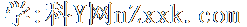
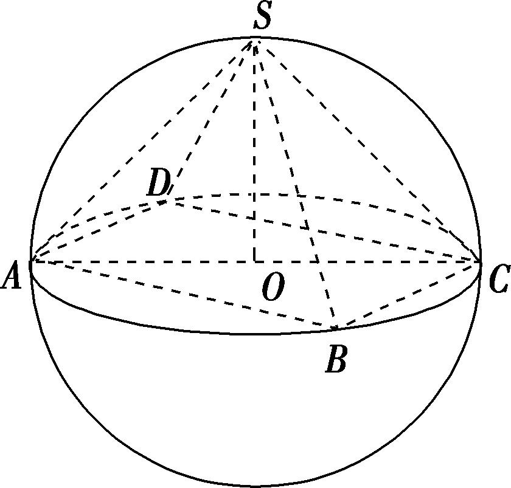
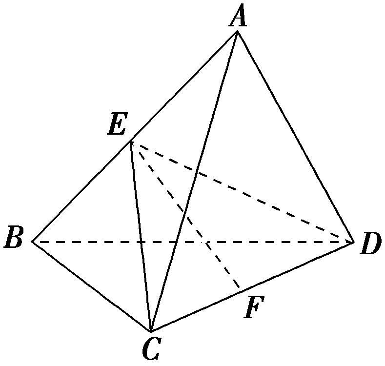
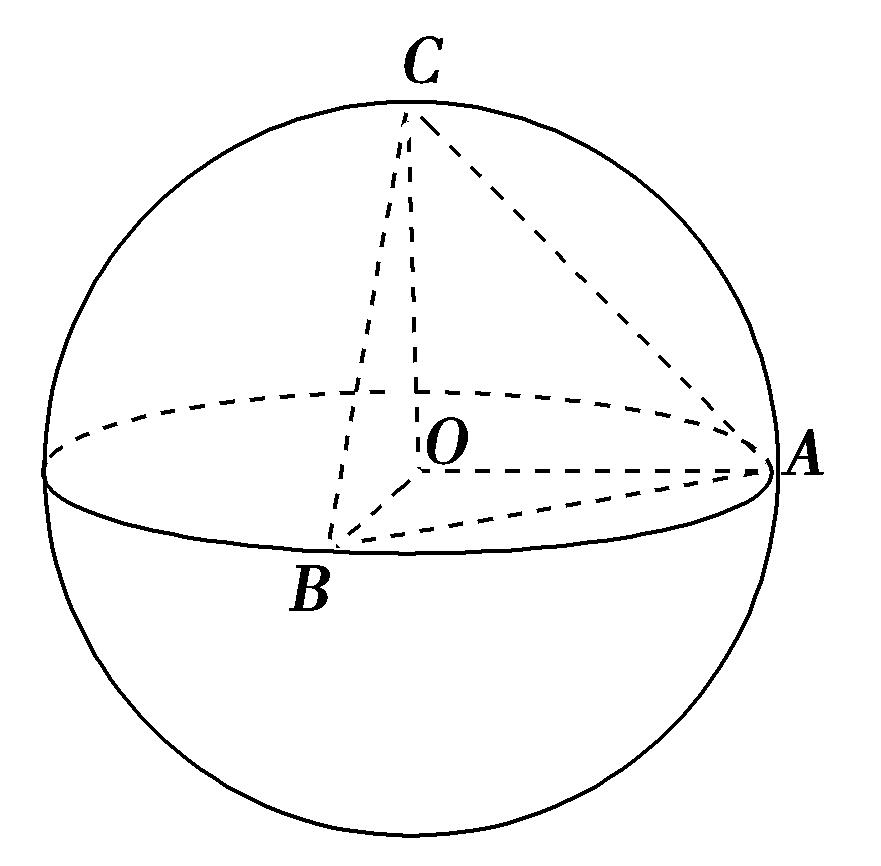
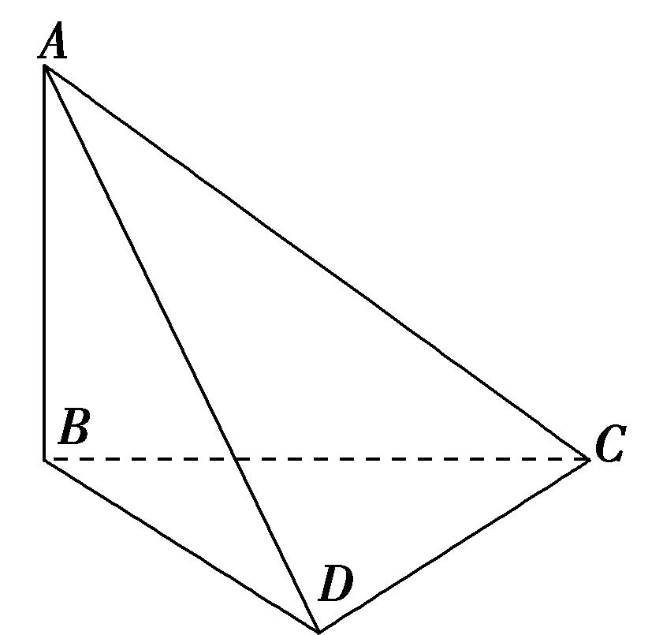
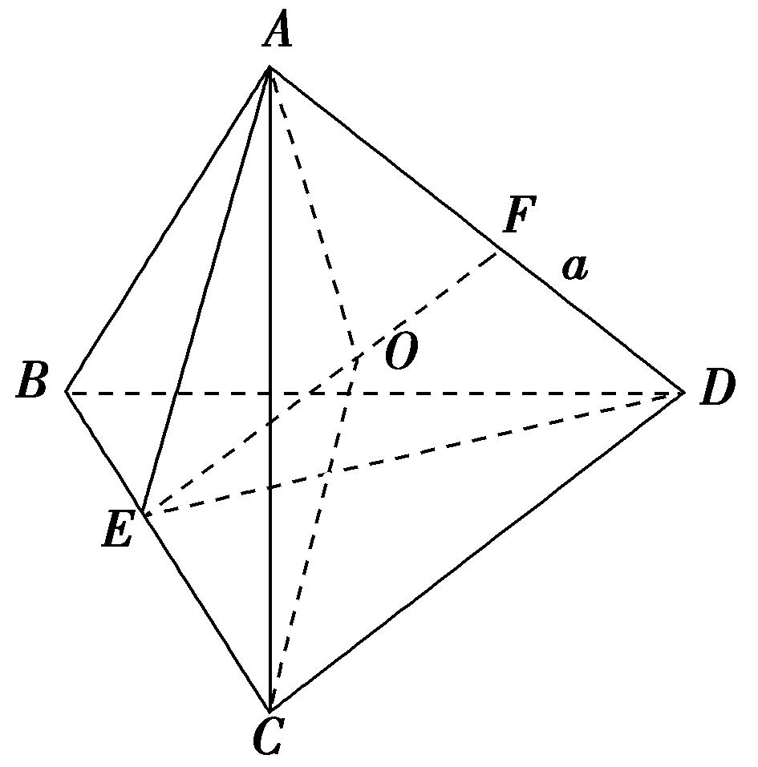
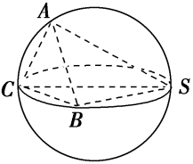
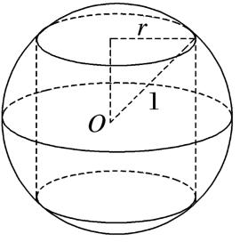

**专题九　最值模型**

**【方法总结】**

最值问题的解法有两种方法：一种是几何法，即在运动变化过程中得到最值，从而转化为定值问题求解．另一种是代数方法，即建立目标函数，从而求目标函数的最值．

**【例题选讲】**

<strong>[例]</strong>　(1)已知三棱锥<em>P</em>－<em>ABC</em>的顶点<em>P</em>，<em>A</em>，<em>B</em>，<em>C</em>在球<em>O</em>的球面上，△<em>ABC</em>是边长为的等边三角形，如果球<em>O</em>的表面积为36π，那么<em>P</em>到平面<em>ABC</em>距离的最大值为\_\_\_\_\_\_\_\_．

答案　3＋2　解析　依题意，边长是的等边△<em>ABC</em>的外接圆半径<em>r</em>＝·＝1.∵球<em>O</em>的表面积为36π＝4π<em>R</em>2，∴球<em>O</em>的半径<em>R</em>＝3，∴球心<em>O</em>到平面<em>ABC</em>的距离<em>d</em>＝＝2，∴球面上的点<em>P</em>到平面<em>ABC</em>距离的最大值为<em>R</em>＋<em>d</em>＝3＋2．

(2)在四面体*ABCD*中，*AB*＝1，*BC*＝*CD*＝，*AC*＝，当四面体*ABCD*的体积最大时，其外接球的表面积为(　　)

A．2π　　　　　　　　B．3π　　　　　　　　C．6π　　　　　　　　D．8π

答案　C　解析　∵<em>AB</em>＝1，<em>BC</em>＝，<em>AC</em>＝，由勾股定理可得<em>AB</em>2＋<em>AC</em>2＝<em>BC</em>2，所以△<em>ABC</em>是以<em>BC</em>为斜边的直角三角形，且该三角形的外接圆直径为<em>BC</em>＝，当<em>CD</em>⊥平面<em>ABC</em>时，四面体<em>ABCD</em>的体积取最大值，此时，其外接球的直径为2<em>R</em>＝＝，因此，四面体<em>ABCD</em>的外接球的表面积为4π<em>R</em>2＝π×(2<em>R</em>)2＝6π．故选C．

(3)已知四棱锥*S*－*ABCD*的所有顶点在同一球面上，底面*ABCD*是正方形且球心*O*在此平面内，当四棱锥的体积取得最大值时，其表面积等于16＋16，则球*O*的体积等于(　　)

A．　　　　　　　　B．　　　　　　　　C．　　　　　　　　D．

答案　D　解析　由题意得，当四棱锥的体积取得最大值时，该四棱锥为正四棱锥．因为该四棱锥的表面积等于16＋16，设球<em>O</em>的半径为<em>R</em>，则<em>AC</em>＝2<em>R</em>，<em>SO</em>＝<em>R</em>，如图，所以该四棱锥的底面边长<em>AB</em>＝<em>R</em>，则有(<em>R</em>)2＋4××<em>R</em>× ＝16＋16，解得<em>R</em>＝2，所以球<em>O</em>的体积是π<em>R</em>3＝π．故选D．

(4)三棱锥*A*－*BCD*内接于半径为的球*O*中，*AB*＝*CD*＝4，则三棱锥*A*－*BCD*的体积的最大值为(　　)

A．　　　　　　　　B．　　　　　　　　C．　　　　　　　　D．

答案　C　解析　如图，过<em>CD</em>作平面<em>ECD</em>，使<em>AB</em>⊥平面<em>ECD</em>，交<em>AB</em>于点<em>E</em>，设点<em>E</em>到<em>CD</em>的距离为<em>EF</em>，当球心在<em>EF</em>上时，<em>EF</em>最大，此时<em>E</em>，<em>F</em>分别为<em>AB</em>，<em>CD</em>的中点，且球心<em>O</em>为<em>EF</em>的中点，所以<em>EF</em>＝2，所以<em>V</em>max＝××4×2×4＝，故选C．

(5)已知正四棱柱的顶点在同一个球面上，且球的表面积为12π，当正四棱柱的体积最大时，正四棱柱的高为\_\_\_\_\_\_\_\_．

答案　8　解析　设正四棱柱的底面边长为<em>a</em>，高为<em>h</em>，球的半径为<em>r</em>，由题意知4π<em>r</em>2＝12π，所以<em>r</em>2＝3，又2<em>a</em>2＋<em>h</em>2＝(2<em>r</em>)2＝12，所以<em>a</em>2＝6－，所以正四棱柱的体积<em>V</em>＝<em>a</em>2<em>h</em>＝<em>h</em>，则<em>V</em>′＝6－<em>h</em>2，由<em>V</em>′&gt;0，得0&lt;<em>h</em>&lt;2，由<em>V</em>′&lt;0，得<em>h</em>&gt;2，所以当<em>h</em>＝2时，正四棱柱的体积最大，<em>V</em>max＝8．

**【对点训练】**

1．三棱锥*P*－*ABC*的四个顶点都在体积为的球的表面上，底面*ABC*所在的小圆面积为16π，则该三

棱锥的高的最大值为(　　)

A．4　　　　　　　　B．6　　　　　　　　C．8　　　　　　　　D．10

1．答案　C　解析　依题意，设题中球的球心为*O*、半径为*R*，△*ABC*的外接圆半径为*r*，则＝，

解得<em>R</em>＝5，由π<em>r</em>2＝16π，解得<em>r</em>＝4，又球心<em>O</em>到平面<em>ABC</em>的距离为＝3，因此三棱锥<em>P</em>－<em>ABC</em>的高的最大值为5＋3＝8.

2．(2015·全国Ⅱ)已知*A*，*B*是球*O*的球面上两点，∠*AOB*＝90°，*C*为该球面上的动点．若三棱锥*O*－*ABC*

体积的最大值为36，则球*O*的表面积为(　　)

A．36π　　　　　　　　B．64π　　　　　　　　C．144π　　　　　　　　D．256π

2．答案　C　解析　∵<em>S</em>△<em>OAB</em>是定值，且<em>VO</em>-<em>ABC</em>＝<em>VC</em>-<em>OAB</em>，∴当<em>OC</em>⊥平面<em>OAB</em>时，<em>VC</em>-<em>OAB</em>最大，即<em>VO</em>-<em>ABC</em>

最大．设球<em>O</em>的半径为<em>R</em>，则(<em>VO</em>-<em>ABC</em>)max＝×<em>R</em>2×<em>R</em>＝<em>R</em>3＝36，∴<em>R</em>＝6，∴球<em>O</em>的表面积<em>S</em>＝4π<em>R</em>2＝4π×62＝144π．

3．已知点*A*，*B*，*C*，*D*均在球*O*上，*AB*＝*BC*＝，*AC*＝2．若三棱锥*D*－*ABC*体积的最大值为3，

则球*O*的表面积为\_\_\_\_\_\_\_\_．

3．答案　16π　解析　由题意可得，∠*ABC*＝，△*ABC*的外接圆半径*r*＝，当三棱锥的体积最大时，

<em>VD</em>­<em>ABC</em>＝<em>S</em>△<em>ABC</em>·<em>h</em>(<em>h</em>为<em>D</em>到底面<em>ABC</em>的距离)，即3＝×××<em>h</em>⇒<em>h</em>＝3，即<em>R</em>＋＝3(<em>R</em>为外接球半径)，解得<em>R</em>＝2，∴球<em>O</em>的表面积为4π×22＝16π．

4．在三棱锥*A*－*BCD*中，*AB*＝1，*BC*＝，*CD*＝*AC*＝，当三棱锥*A*－*BCD*的体积最大时，其外接球

的表面积为\_\_\_\_\_\_\_\_．

4．答案　6π　解析　∵<em>AB</em>＝1，<em>BC</em>＝，<em>AC</em>＝，∴<em>AB</em>2＋<em>BC</em>2＝<em>AC</em>2，即△<em>ABC</em>为直角三角形，当<em>CD</em>

⊥面<em>ABC</em>时，三棱锥<em>A</em>－<em>BCD</em>的体积最大，又∵<em>CD</em>＝，△<em>ABC</em>外接圆的半径为，故外接球的半径<em>R</em>满足<em>R</em>2＝＋＝，∴外接球的表面积为4π<em>R</em>2＝6π．

5．已知三棱锥*D*－*ABC*的所有顶点都在球*O*的球面上，*AB*＝*BC*＝2，*AC*＝2，若三棱锥*D*－*ABC*体

积的最大值为2，则球*O*的表面积为(　　)

A．8π　　　　　　　　B．9π　　　　　　　　C．　　　　　　　　D．

5．答案　D　解析　由<em>AB</em>＝<em>BC</em>＝2，<em>AC</em>＝2，可得<em>AB</em>2＋<em>BC</em>2＝<em>AC</em>2，所以△<em>ABC</em>为直角三角形，且<em>AC</em>

为斜边，所以过△<em>ABC</em>的截面圆的圆心为斜边<em>AC</em>的中点<em>E</em>．当<em>DE</em>⊥平面<em>ABC</em>，且球心<em>O</em>在<em>DE</em>上时，三棱锥<em>D</em>－<em>ABC</em>的体积取最大值，因为三棱锥<em>D</em>－<em>ABC</em>体积的最大值为2，所以<em>S</em>△<em>ABC</em>·<em>DE</em>＝2，即××22×<em>DE</em>＝2，解得<em>DE</em>＝3．设球的半径为<em>R</em>，则<em>AE</em>2＋<em>OE</em>2＝<em>AO</em>2，即()2＋(3－<em>R</em>)2＝<em>R</em>2，解得<em>R</em>＝．所以球<em>O</em>的表面积为4π<em>R</em>2＝4π×2＝．

6．三棱锥*A*－*BCD*的一条棱长为*a*，其余棱长均为2，当三棱锥*A*－*BCD*的体积最大时，它的外接球的

表面积为(　　)

A．　　　　　　　　B．　　　　　　　　C．　　　　　　　　D．

6．答案　B　解析　由题意画出三棱锥的图形，

其中<em>AB</em>＝<em>BC</em>＝<em>CD</em>＝<em>BD</em>＝<em>AC</em>＝2，<em>AD</em>＝<em>a</em>，取<em>BC</em>，<em>AD</em>的中点分别为<em>E</em>，<em>F</em>，可知<em>AE</em>⊥<em>BC</em>，<em>DE</em>⊥<em>BC</em>，且<em>AE</em>∩<em>DE</em>＝<em>E</em>，∴<em>BC</em>⊥平面<em>AED</em>，∴平面<em>ABC</em>⊥平面<em>BCD</em>时，三棱锥<em>A</em>－<em>BCD</em>的体积最大，此时<em>AD</em>＝<em>a</em>＝<em>AE</em>＝×＝．设三棱锥外接球的球心为<em>O</em>，半径为<em>R</em>，由球体的对称性知，球心<em>O</em>在线段<em>EF</em>上，∴<em>OA</em>＝<em>OC</em>＝<em>R</em>，又<em>EF</em>＝＝＝，设<em>OF</em>＝<em>x</em>，<em>OE</em>＝－<em>x</em>，∴<em>R</em>2＝＋<em>x</em>2＝＋1，解得<em>x</em>＝．∴球的半径<em>R</em>满足<em>R</em>2＝，∴三棱锥外接球的表面积为4π<em>R</em>2＝4π×＝，故选B．

7．已知三棱锥*O*－*ABC*的顶点*A*，*B*，*C*都在半径为2的球面上，*O*是球心，∠*AOB*＝120°，当△*AOC*

与△*BOC*的面积之和最大时，三棱锥*O－ABC*的体积为(　　)

A．　　　　　　　　B．　　　　　　　　C．　　　　　　　　D．

7．答案　B　解析　设球<em>O</em>的半径为<em>R</em>，因为<em>S</em>△<em>AOC</em>＋<em>S</em>△<em>BOC</em>＝<em>R</em>2(sin∠<em>AOC</em>＋sin∠<em>BOC</em>)，所以当∠<em>AOC</em>

＝∠<em>BOC</em>＝90°时，<em>S</em>△<em>AOC</em>＋<em>S</em>△<em>BOC</em>取得最大值，此时<em>OA</em>⊥<em>OC</em>，<em>OB</em>⊥<em>OC</em>，又<em>OB</em>∩<em>OA</em>＝<em>O</em>，<em>OA</em>，<em>OB</em>⊂平面<em>AOB</em>，所以<em>OC</em>⊥平面<em>AOB</em>，所以<em>V</em>三棱锥<em>O</em>-<em>ABC</em>＝<em>V</em>三棱锥<em>C</em>-<em>OAB</em>＝<em>OC</em>·<em>OA</em>·<em>OB</em>sin∠<em>AOB</em>＝<em>R</em>3sin∠<em>AOB</em>＝，故选B．

8．(2018·全国Ⅲ)设*A*，*B*，*C*，*D*是同一个半径为4的球的球面上四点，△*ABC*为等边三角形且其面积为

9，则三棱锥*D*－*ABC*体积的最大值为(　　)

A．12　　　　　　　　B．18　　　　　　　　C．24　　　　　　　　D．54

8．答案　B　解析　设等边三角形<em>ABC</em>的边长为<em>x</em>，则<em>x</em>2sin 60°＝9，得<em>x</em>＝6．设△<em>ABC</em>的外接圆半

径为<em>r</em>，则2<em>r</em>＝，解得<em>r</em>＝2，所以球心到△<em>ABC</em>所在平面的距离<em>d</em>＝＝2，则点<em>D</em>到平面<em>ABC</em>的最大距离<em>d</em>1＝<em>d</em>＋4＝6，所以三棱锥<em>D</em>－<em>ABC</em>体积的最大值<em>V</em>max＝<em>S</em>△<em>ABC</em>×6＝×9×6＝18．

9．已知球的直径*SC*＝4，*A*，*B*是该球球面上的两点，∠*ASC*＝∠*BSC*＝30˚，则棱锥*S*－*ABC*的体积最大

为(　　)

A．2　　　　　　　　B．　　　　　　　　C．　　　　　　　　D．2

9．答案　A　解析　如图，因为球的直径为*SC*，且*SC*＝4，∠*ASC*＝∠*BSC*＝30˚，所以∠*SAC*＝∠*SBC*

＝90˚，<em>AC</em>＝<em>BC</em>＝2，<em>SA</em>＝<em>SB</em>＝2，所以<em>S</em>△<em>SBC</em>＝×2×2＝2，则当点<em>A</em>到平面<em>SBC</em>的距离最大时，棱锥<em>A</em>­<em>SBC</em>即<em>S</em>­<em>ABC</em>的体积最大，此时平面<em>SAC</em>⊥平面<em>SBC</em>，点<em>A</em>到平面<em>SBC</em>的距离为2sin30˚＝，所以棱锥<em>S</em>－<em>ABC</em>的体积最大为×2×＝2，故选A．

10．四棱锥*P*－*ABCD*的底面为矩形，矩形的四个顶点*A*，*B*，*C*，*D*在球*O*的同一个大圆上，且球的表面

积为16π，点*P*在球面上，则四棱锥*P*－*ABCD*体积的最大值为(　　)

A．8　　　　　　　　B．　　　　　　　　C．16　　　　　　　　D．

10．答案　D　解析　因为球<em>O</em>的表面积是16π，所以<em>S</em>＝4π<em>R</em>2＝16π，解得<em>R</em>＝2，如题图，四棱锥<em>P</em>－<em>ABC</em>

<em>D</em>底面为矩形且矩形的四个顶点<em>A</em>，<em>B</em>，<em>C</em>，<em>D</em>在球<em>O</em>的同一个大圆上．设矩形的长、宽分别为<em>x</em>，<em>y</em>，则<em>x</em>2＋<em>y</em>2＝(2<em>R</em>)2≥2<em>xy</em>，当且仅当<em>x</em>＝<em>y</em>时上式取等号，即底面为正方形时，底面面积最大，此时<em>S</em>正方形<em>ABCD</em>＝2<em>R</em>2＝8.点<em>P</em>在球面上，当<em>PO</em>⊥底面<em>ABCD</em>时，<em>PO</em>＝<em>R</em>，即<em>h</em>max＝<em>R</em>，则四棱锥<em>P</em>－<em>ABCD</em>体积的最大值为．

11．(2016·全国Ⅲ)在封闭的直三棱柱<em>ABC</em>－<em>A</em>1<em>B</em>1<em>C</em>1内有一个体积为<em>V</em>的球．若<em>AB</em>⊥<em>BC</em>，<em>AB</em>＝6，<em>BC</em>＝8，

<em>AA</em>1＝3，则<em>V</em>的最大值是(　　)

A．4π　　　　　　　　B．　　　　　　　　C．6π　　　　　　　　D．

11．答案　B　解析　由*AB*⊥*BC*，*AB*＝6，*BC*＝8，得*AC*＝10．要使球的体积*V*最大，则球与直三棱柱

的部分面相切，若球与三个侧面相切，设底面△<em>ABC</em>的内切圆的半径为<em>r</em>．则×6×8＝×(6＋8＋10)·<em>r</em>，所以<em>r</em>＝2．2<em>r</em>＝4＞3，不合题意．球与三棱柱的上、下底面相切时，球的半径<em>R</em>最大．由2<em>R</em>＝3，即<em>R</em>＝．故球的最大体积<em>V</em>＝π<em>R</em>3＝π．

12．已知半径为1的球*O*中内接一个圆柱，当圆柱的侧面积最大时，球的体积与圆柱的体积的比值为

\_\_\_\_\_\_\_\_．

12．答案　　解析　如图所示，设圆柱的底面半径为*r*，则圆柱的侧面积为

*S*＝2π*r*×2＝4π*r*≤4π×＝2π，所以当*r*＝时，＝＝．

13．如图，在矩形<em>ABCD</em>中，已知<em>AB</em>＝2<em>AD</em>＝2<em>a</em>，<em>E</em>是<em>AB</em>的中点，将△<em>ADE</em>沿直线<em>DE</em>翻折成△<em>A</em>1<em>DE</em>，

连接<em>A</em>1<em>C</em>．若当三棱锥<em>A</em>1－<em>CDE</em>的体积取得最大值时，三棱锥<em>A</em>1－<em>CDE</em>外接球的体积为，则<em>a</em>＝(　　)

A．2　　　　　　　　B．　　　　　　　　C．2　　　　　　　　D．4

13．答案　B　解析　在矩形<em>ABCD</em>中，已知<em>AB</em>＝2<em>AD</em>＝2<em>a</em>，<em>E</em>是<em>AB</em>的中点，所以△<em>A</em>1<em>DE</em>为等腰直角三

角形，斜边<em>DE</em>上的高为<em>A</em>1<em>K</em>＝<em>DE</em>＝ ＝<em>a</em>．要想三棱锥<em>A</em>1－<em>CDE</em>的体积最大，需高最大，则当△<em>A</em>1<em>DE</em>⊥面<em>BCDE</em>时体积最大，此时三棱锥<em>A</em>1－<em>CDE</em>的高等于<em>A</em>1<em>K</em>＝<em>a</em>，取<em>DC</em>的中点<em>H</em>，过<em>H</em>作下底面的垂线，此时三棱锥<em>A</em>1－<em>CDE</em>的外接球球心<em>O</em>在此垂线上．因为三棱锥<em>A</em>1－<em>CDE</em>外接球的体积为，所以球半径<em>R</em>＝，如图，<em>OH</em>2＝<em>OC</em>2－<em>CH</em>2，①，<em>A</em>1<em>O</em>2＝<em>A</em>1<em>G</em>2＋<em>GO</em>2，②，即<em>OH</em>2＝<em>R</em>2－<em>a</em>2，③，<em>R</em>2＝＋，④，联立③④可得<em>a</em>＝．故选B．

14．已知三棱锥*S*－*ABC*的顶点都在球*O*的球面上，且该三棱锥的体积为2，*SA*⊥平面*ABC*，*SA*＝4，

∠*ABC*＝120°，则球*O*的体积的最小值为\_\_\_\_\_\_\_\_．

14．答案　　解析　<em>VS</em>－<em>ABC</em>＝<em>S</em>△<em>ABC</em>·<em>SA</em>＝××<em>BA</em>·<em>BC</em>×4＝2，故<em>BA</em>·<em>BC</em>＝6．根据余弦定理<em>AC</em>2

＝<em>BA</em>2＋<em>BC</em>2－2<em>BA</em>·<em>BC</em> cos <em>B</em>＝<em>BA</em>2＋<em>BC</em>2＋<em>BA</em>·<em>BC</em>≥3<em>BA</em>·<em>BC</em>，即<em>AC</em>≥3，当<em>BA</em>＝<em>BC</em>时等号成立．设△<em>ABC</em>的外接圆半径为<em>r</em>，故2<em>r</em>＝≥2，即<em>r</em>≥．设球<em>O</em>的半径为<em>R</em>，球心<em>O</em>在平面<em>ABC</em>的投影<em>O</em>1为△<em>ABC</em>外心，则<em>R</em>2＝<em>r</em>2＋≥6＋4＝10，<em>R</em>≥，<em>V</em>＝π<em>R</em>3≥．

