# 专题十 函数图象的应用

# 考点一 利用函数图象研究函数的性质

# 【方法总结】

# 利用图象研究函数性质问题的思路

对于已知或解析式易画出其在给定区间上图象的函数，其性质常借助图象研究：

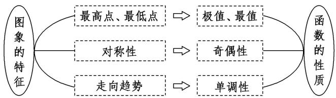

# 【例题选讲】

[例 1] （1） 已知函数 $f(x)=x|x|-2x$ ，则下列结论正确的是()

A. $f(x)$ 是偶函数，递增区间是 $(0, +\infty)$

B. $f(x)$ 是偶函数，递减区间是 $(-∞, 1)$

C. $f(x)$ 是奇函数，递减区间是 $(-1, 1)$

D. $f(x)$ 是奇函数，递增区间是 $(-\infty, 0)$

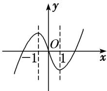  
（2） 设函数 $y=\frac{2x-1}{x-2}$ ，关于该函数图象的命题如下：

①一定存在两点，这两点的连线平行于 x 轴；②任意两点的连线都不平行于 y 轴；③关于直线 y=x 对称；④关于原点中心对称.
其中正确的是()

A. ①②

B. ②③

C. ③④

D. ①④
> 

> 
> | 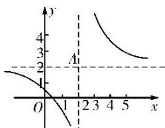 | 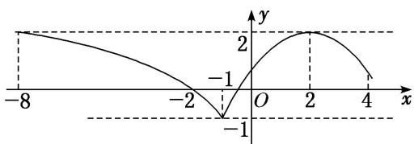 | 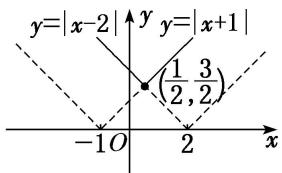 |
> | --- | --- | --- |
> | （3）已知函数 $f(x) = \begin{cases} \log_2\left(-\frac{x}{2}\right), & x \leq -1, \\ -\frac{1}{3}x^2 + \frac{4}{3}x + \frac{2}{3}, & x > -1, \end{cases}$ 若 $f(x)$ 在区间 $[m, 4]$ 上的值域为 $[-1, 2]$ ，则实数 $m$ 的取值范围为 \_\_\_\_. | （4）对 $a, b \in \mathbf{R}$ , 记 $\max\{a, b\} = \begin{cases} a, & a \geq b, \\ b, & a < b, \end{cases}$ 函数 $f(x) = \max\{|x + 1|, |x - 2|\}(x \in \mathbf{R})$ 的最小值是 \_\_\_\_. | （5）设函数 $f(x)$ 是定义在 $\mathbf{R}$ 上的偶函数，且对任意的 $x \in \mathbb{R}$ 恒有 $f(x + 1) = f(x - 1)$ ，已知当 $x \in [0, 1]$ 时， $f(x) = \left(\frac{1}{2}\right)^{1 - x}$ ，则说法：①2 是函数 $f(x)$ 的周期；②函数 $f(x)$ 在 (1, 2) 上递减，在 (2, 3) 上递增；③函数 $f(x)$ 的最大值是 1，最小值是 0；④当 $x \in (3, 4)$ 时， $f(x) = \left(\frac{1}{2}\right)^{x - 3}$ . |
> 

其中所有正确说法的序号是\_\_\_\_。

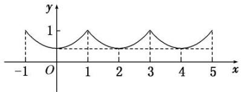

# 考点二 利用函数图象解决方程根的问题

# 【方法总结】

# 利用函数的图象解决方程根问题的思路
当方程与基本函数有关时，可以通过函数图象来研究方程的根，方程 $f(x) = 0$ 的根就是函数 $f(x)$ 图象与 $x$ 轴交点的横坐标，方程 $f(x) = g(x)$ 的根就是函数 $f(x)$ 与 $g(x)$ 图象交点的横坐标.

# 【例题选讲】

[例 2] （1） 已知函数 $f(x)=2\ln x$ ， $g(x)=x^{2}-4x+5$ ，则方程 $f(x)=g(x)$ 的根的个数为()

A. 0

B. 1

C. 2

D. 3  
（2） 已知函数 $f(x)$ 满足: ①定义域为 $\mathbf{R}$ ; ② $\forall x \in \mathbb{R}$ , 都有 $f(x + 2) = f(x)$ ; ③当 $x \in [-1, 1]$ 时, $f(x) = -|x| + 1$ . 则方程 $f(x) = \frac{1}{2} \log_2 |x|$ 在区间 $[-3, 5]$ 内解的个数是 ( )

A. 5

B. 6

C. 7

D. 8
> 

> 
> | 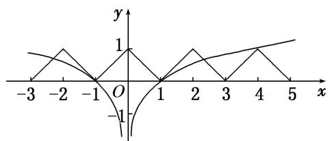 | 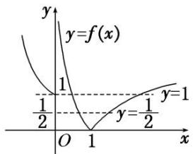 |
> | --- | --- |
> | （3）已知 $f(x)=\left\{\begin{aligned}&|\lg x|,&x>0,\\ &2^{|x|},&x\leq0,\end{aligned}\right.$ 则方程 $2f^{2}(x)-3f(x)+1=0$ 的解的个数为 \_\_\_\_. | （4）已知函数 $f(x) = |x - 2| + 1$ ， $g(x) = kx$ 。若方程 $f(x) = g(x)$ 有两个不相等的实根，则实数 $k$ 的取值范围是（） |
> 

A. $\left(0,\frac{1}{2}\right)$

B. $\left(\frac{1}{2},\ 1\right)$

C. $(1, 2)$

D. $(2, +\infty)$

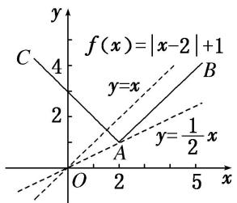  
（5） 对任意实数 $a$ ， $b$ 定义运算“ $\odot$ ”: $a \odot b = \begin{cases} b, & a - b \geq 1, \\ a, & a - b < 1, \end{cases}$ 设 $f(x) = (x^2 - 1) \odot (4 + x) + k$ ，若函数 $f(x)$ 的图象与 $x$ 轴恰有三个交点，则 $k$ 的取值范围是（）

A. $(-2,1)$

B. $[0, 1]$

C. $[-2, 0)$

D. $[-2, 1)$

# 考点三 利用函数图象解不等式

# 【方法总结】

# 利用函数图象求解不等式的思路
当不等式问题不能用代数法求解但其与函数有关时，常将不等式问题转化为两函数图象的上、下关系问题，从而利用数形结合求解.

# 【例题选讲】

[例 3] （1） 设奇函数 $f(x)$ 在 $(0, +\infty)$ 上为增函数，且 $f(1)=0$ ，则不等式 $\frac{f(x)-f(-x)}{x}<0$ 的解集为()

A. $(-1, 0) \cup (1, +\infty)$

B. $(-\infty, -1) \cup (0, 1)$

C. $(-∞, -1)∪(1, +∞)$

D. $(-1, 0) \cup (0, 1)$

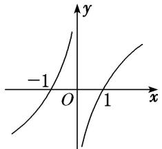  
（2） 如图, 函数 $f(x)$ 的图象为折线 $ACB$ , 则不等式 $f(x) \geq \log_2(x + 1)$ 的解集为 \_\_\_\_.

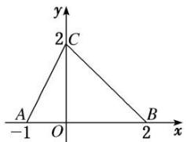

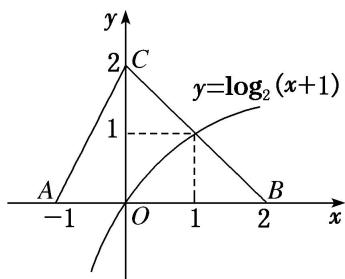  
（3） 若函数 $f(x)$ 是周期为 4 的偶函数，当 $x \in [0, 2]$ 时， $f(x) = x - 1$ ，则不等式 $xf(x) > 0$ 在 $(-1, 3)$ 上的解集为（）

A. $(1, 3)$

B. $(-1, 1)$

C. $(-1, 0) \cup (1, 3)$

D. $(-1, 0) \cup (0, 1)$  
（4） 若不等式 $(x - 1)^2 < \log_a x (a > 0$ ，且 $a \neq 1)$ 在 $x \in (1, 2)$ 内恒成立，则实数 $a$ 的取值范围为（）

A. (1, 2]

B. $\left(\frac{\sqrt{2}}{2},1\right)$

C. $(1, \sqrt{2})$

D. $(\sqrt{2}, 2)$  
（5） 若关于 $x$ 的不等式 $4a^{x-1} < 3x - 4 (a > 0$ , 且 $a \neq 1)$ 对于任意的 $x > 2$ 恒成立, 则实数 $a$ 的取值范围为 \_\_\_\_.

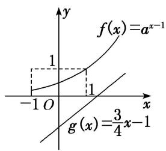

图（1）

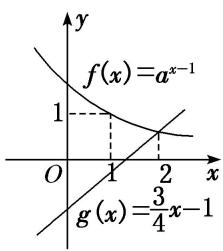

图（2）

# 【对点训练】

1. 对于函数 $f(x) = \lg (|x - 2| + 1)$ ，给出如下三个命题：① $f(x + 2)$ 是偶函数；② $f(x)$ 在区间 $(- \infty, 2)$ 上是减函数，在区间 $(2, +\infty)$ 上是增函数；③ $f(x)$ 没有最小值．其中正确的个数为（）

A. 1

B. 2

C. 3

D. 0

2. 若函数 $f(x) = \frac{ax - 2}{x - 1}$ 的图象关于点(1, 1)对称，则实数 $a =$ \_\_\_\_.

3. 给定 $\min\{a, b\}=\begin{cases}a,&a\leq b,\\b,&b<a,\end{cases}$ 已知函数 $f(x)=\min\{x,x^{2}-4x+4\}+4$ ，若动直线 y=m 与函数 $y=f(x)$ 的图象有 3 个交点，则实数 m 的取值范围为 \_\_\_\_.

4. 用 $\min\{a, b, c\}$ 表示 $a, b, c$ 中的最小值. 设 $f(x)=\min\{2^x, x+2, 10-x\}(x \geq 0)$ , 则 $f(x)$ 的最大值为 \_\_\_\_.

5. 已知函数 $f(x) = x^{2} + \mathrm{e}^{x} - \frac{1}{2} (x < 0)$ 与 $g(x) = x^{2} + \ln (x + a)$ 的图象上存在关于 $y$ 轴对称的点，则实数 $a$ 的取值范围是（）

A. $\left(-\infty,\frac{1}{\sqrt{e}}\right)$

B. $(-∞, \sqrt{e})$

C. $\left(\frac{1}{\sqrt{e}},+\infty\right)$

D. $(\sqrt{e}, +\infty)$

6. 已知函数 $f(x) = \begin{cases} -x^2 - 2x, & x \geq 0, \\ x^2 - 2x, & x < 0, \end{cases}$ 若 $f(3 - a^2) < f(2a)$ ，则实数 $a$ 的取值范围是 \_\_\_\_.

7. 函数 $f(x)$ 是定义在 $[-4, 4]$ 上的偶函数，其在 $[0, 4]$ 上的图象如图所示，那么不等式 $\frac{f(x)}{\cos x} < 0$ 的解集为 \_\_\_\_.

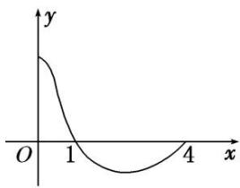

8. 如图, 函数 $f(x)$ 的图象为两条射线 $CA$ , $CB$ 组成的折线, 如果不等式 $f(x) \geq x^{2} - x - a$ 的解集中有且仅有 1 个整数, 则实数 $a$ 的取值范围是 ( )

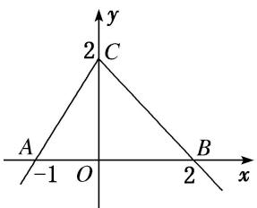

A. $\{a| - 2 < a < -1\}$

B. $\{a\mid -2\leq a <   - 1\}$

C. $\{a| - 2\leq a <   2\}$

D. $\{a|a\geq-2\}$

9. 设函数 $f(x) = |x + a|$ ， $g(x) = x - 1$ ，对于任意的 $x \in \mathbf{R}$ ，不等式 $f(x) \geq g(x)$ 恒成立，则实数 $a$ 的取值范围是 \_\_\_\_.

10. 设函数 $f(x) = ax + \cos x, x \in [0, \pi]$ . 设 $f(x) \leq 1 + \sin x$ ，则 $a$ 的取值范围为 \_\_\_\_.

11. 已知函数 $f(x) = \begin{cases} \log_2 x, & x > 0, \\ 2^x, & x \leq 0, \end{cases}$ 且关于 $x$ 的方程 $f(x) - a = 0$ 有两个实根，则实数 $a$ 的取值范围是 \_\_\_\_.

12. 已知函数 $f(x) = \begin{cases} |2^x - 1|, & x < 2, \\ \frac{3}{x - 1}, & x \geq 2. \end{cases}$ 若方程 $f(x) - a = 0$ 有三个不同的实数根，则实数 $a$ 的取值范围是 \_\_\_\_.

13. 定义在 R 上的函数 $f(x)=\left\{\begin{aligned}\lg|x|,&x\neq0,\\ 1,&x=0,\end{aligned}\right.$ 关于 x 的方程 $f(x)=c$ (c 为常数) 恰有三个不同的实数根 $x_{1}, x_{2}, x_{3}$ ，则 $x_{1}+x_{2}+x_{3}=$ \_\_\_\_.

14. 已知函数 $y=f(x)$ 及 $y=g(x)$ 的图象分别如图所示, 方程 $f(g(x))=0$ 和 $g(f(x))=0$ 的实根个数分别为 a 和 b, 则 $ab=(\quad)$

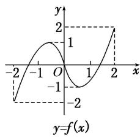

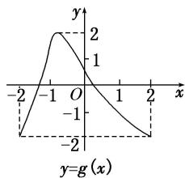

A. 24

B. 15

C. 6

D. 4

