# 专题十 函数图象的应用

# 考点一 利用函数图象研究函数的性质

# 【方法总结】

# 利用图象研究函数性质问题的思路

对于已知或解析式易画出其在给定区间上图象的函数，其性质常借助图象研究：

# 【例题选讲】

[例 1] （1） 已知函数 $f(x)=x|x|-2x$ ，则下列结论正确的是()

A. $f(x)$ 是偶函数，递增区间是 $(0, +\infty)$

B. $f(x)$ 是偶函数，递减区间是 $(-∞, 1)$

C. $f(x)$ 是奇函数，递减区间是 $(-1, 1)$

D. $f(x)$ 是奇函数，递增区间是 $(-∞, 0)$
答案 C 解析 将函数 $f(x)=x|x|-2x$ 去掉绝对值得 $f(x)=\left\{\begin{aligned}x^{2}-2x,&x\geq0,\\ -x^{2}-2x,&x<0,\end{aligned}\right.$ 画出函数 $f(x)$ 的图象，如图，

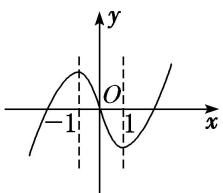

观察图象可知，函数 $f(x)$ 的图象关于原点对称，故函数 $f(x)$ 为奇函数，且在 $(-1, 1)$ 上单调递减.  
（2） 设函数 $y=\frac{2x-1}{x-2}$ ，关于该函数图象的命题如下：

①一定存在两点，这两点的连线平行于 x 轴；②任意两点的连线都不平行于 y 轴；③关于直线 y=x 对称；④关于原点中心对称.
其中正确的是()

A. ①②

B. ②③

C. ③④

D. ①④
答案 B 解析 $y=\frac{2x-1}{x-2}=\frac{2(x-2)+3}{x-2}=2+\frac{3}{x-2}$ ，图象如图所示，可知②③正确.

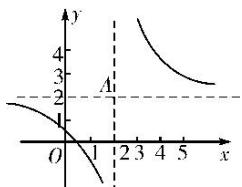  
（3） 已知函数 $f(x) = \begin{cases} \log_2\left(-\frac{x}{2}\right), & x \leq -1, \\ -\frac{1}{3}x^2 + \frac{4}{3}x + \frac{2}{3}, & x > -1, \end{cases}$ 若 $f(x)$ 在区间 $[m, 4]$ 上的值域为 $[-1, 2]$ ，则实数 $m$ 的取值范围为 \_\_\_\_.
答案 $[-8, -1]$ 解析 作出函数 $f(x)$ 的图象，当 $x \leq -1$ 时，函数 $f(x) = \log_2\left(-\frac{x}{2}\right)$ 单调递减，且最小值为 $f(-1) = -1$ ，则令 $\log_2\left(-\frac{x}{2}\right) = 2$ ，解得 $x = -8$ ；当 $x > -1$ 时，函数 $f(x) = -\frac{1}{3} x^2 + \frac{4}{3} x + \frac{2}{3}$ 在 $(-1, 2)$ 上单调递增，在 $[2, +\infty)$ 上单调递减，则最大值为 $f(2) = 2$ ，又 $f(4) = \frac{2}{3} < 2$ ， $f(-1) = -1$ ，故所求实数 $m$ 的取值范围为 $[-8, -1]$ .

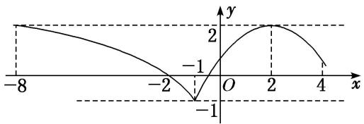  
（4） 对 $a, b \in \mathbf{R}$ , 记 $\max\{a, b\} = \begin{cases} a, & a \geq b, \\ b, & a < b, \end{cases}$ 函数 $f(x) = \max\{|x + 1|, |x - 2|\}(x \in \mathbf{R})$ 的最小值是 \_\_\_\_.
答案 $\frac{3}{2}$ 解析 函数 $f(x)=\max\{|x+1|,\ |x-2|\}(x\in\mathbf{R})$ 的图象如图所示，由图象可得，其最小值为 $\frac{3}{2}$ .

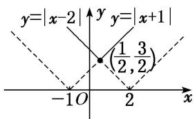  
（5） 设函数 $f(x)$ 是定义在 $\mathbf{R}$ 上的偶函数，且对任意的 $x \in \mathbb{R}$ 恒有 $f(x + 1) = f(x - 1)$ ，已知当 $x \in [0, 1]$ 时， $f(x) = \left(\frac{1}{2}\right)^{1 - x}$ ，则说法：①2 是函数 $f(x)$ 的周期；②函数 $f(x)$ 在 (1, 2) 上递减，在 (2, 3) 上递增；③函数 $f(x)$ 的最大值是 1，最小值是 0；④当 $x \in (3, 4)$ 时， $f(x) = \left(\frac{1}{2}\right)^{x - 3}$ .
其中所有正确说法的序号是\_\_\_\_。
答案 ①②④ 解析 由已知条件得 $f(x + 2) = f(x)$ ，所以 $y = f(x)$ 是以2为周期的周期函数，①正确；当 $-1 \leq x \leq 0$ 时， $0 \leq -x \leq 1$ ， $f(x) = f(-x) = \left(\frac{1}{2}\right)^{1 + x}$ ，函数 $y = f(x)$ 的图象如图所示：

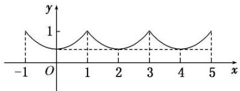
当 3<x<4 时，-1<x-4<0， $f(x)=f(x-4)=\left(\frac{1}{2}\right)x^{-3}$ ，因此②④正确，③不正确.

# 考点二 利用函数图象解决方程根的问题

# 【方法总结】

# 利用函数的图象解决方程根问题的思路
当方程与基本函数有关时，可以通过函数图象来研究方程的根，方程 $f(x) = 0$ 的根就是函数 $f(x)$ 图象与 $x$ 轴交点的横坐标，方程 $f(x) = g(x)$ 的根就是函数 $f(x)$ 与 $g(x)$ 图象交点的横坐标.

# 【例题选讲】

[例 2] （1） 已知函数 $f(x)=2\ln x$ ， $g(x)=x^{2}-4x+5$ ，则方程 $f(x)=g(x)$ 的根的个数为()

A. 0

B. 1

C. 2

D. 3
答案 C 解析 由已知 $g(x) = (x - 2)^2 + 1$ ，得其顶点为(2, 1)，又 $f(2) = 2\ln 2 \in (1, 2)$ ，可知点(2, 1)位于函数 $f(x) = 2\ln x$ 图象的下方，故函数 $f(x) = 2\ln x$ 的图象与函数 $g(x) = x^2 - 4x + 5$ 的图象有2个交点.

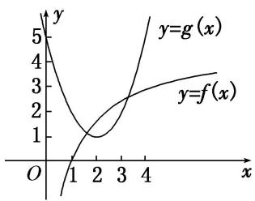  
（2） 已知函数 $f(x)$ 满足：①定义域为 $\mathbf{R}$ ；② $\forall x \in \mathbb{R}$ ，都有 $f(x + 2) = f(x)$ ；③当 $x \in [-1, 1]$ 时， $f(x) = -|x| + 1$ 。则方程 $f(x) = \frac{1}{2}\log_2|x|$ 在区间 $[-3, 5]$ 内解的个数是（）

A. 5

B. 6

C. 7

D. 8
答案 A 解析 依题意画出 $y = f(x)$ 与 $y = \frac{1}{2}\log_2|x|$ 的图象如图所示，由图可知，解的个数为5.

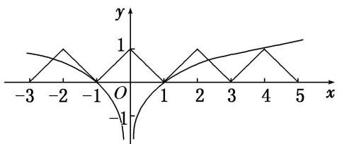  
（3） 已知 $f(x)=\left\{\begin{aligned}&|\lg x|,&x>0,\\ &2^{|x|},&x\leq0,\end{aligned}\right.$ 则方程 $2f^{2}(x)-3f(x)+1=0$ 的解的个数为 \_\_\_\_.
答案 5 解析 方程 $2f^{2}(x)-3f(x)+1=0$ 的解为 $f(x)=\frac{1}{2}$ 或 $f(x)=1$ . 作出 $y=f(x)$ 的图象, 由图象知直线 $y=\frac{1}{2}$ 与函数 $y=f(x)$ 的图象有 2 个公共点; 直线 y=1 与函数 $y=f(x)$ 的图象有 3 个公共点. 故方程 $2f^{2}(x)-3f(x)+1=0$ 有 5 个解.

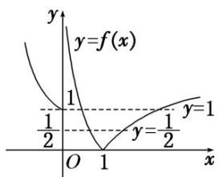  
（4） 已知函数 $f(x) = |x - 2| + 1$ ， $g(x) = kx$ 。若方程 $f(x) = g(x)$ 有两个不相等的实根，则实数 $k$ 的取值范围是（）

A. $\left(0,\frac{1}{2}\right)$

B. $\left(\frac{1}{2},\ 1\right)$

C. $(1, 2)$

D. $(2, +\infty)$
答案 B 解析 先作出函数 $f(x)=|x-2|+1$ 的图象，如图所示，当直线 $g(x)=kx$ 与直线 AB 平行时斜率为 1，当直线 $g(x)=kx$ 过 A 点时斜率为 $\frac{1}{2}$ ，故 $f(x)=g(x)$ 有两个不相等的实根时，k 的取值范围为 $\left(\frac{1}{2}, 1\right)$ .

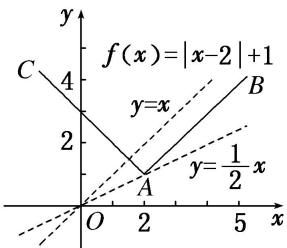  
（5） 对任意实数 $a$ ， $b$ 定义运算“ $\odot$ ”: $a \odot b = \begin{cases} b, & a - b \geq 1, \\ a, & a - b < 1, \end{cases}$ 设 $f(x) = (x^2 - 1) \odot (4 + x) + k$ ，若函数 $f(x)$ 的图象与 $x$ 轴恰有三个交点，则 $k$ 的取值范围是（）

A. $(-2,1)$

B. $[0, 1]$

C. $[-2, 0)$

D. $[-2, 1)$
答案 D 解析 令 $g(x) = (x^{2} - 1)\odot (4 + x) = \begin{cases} 4 + x, & x\leq -2 \text{ 或 } x\geq 3,\\ x^{2} - 1, & -2 <   x <   3, \end{cases}$ 其图象如图所示.

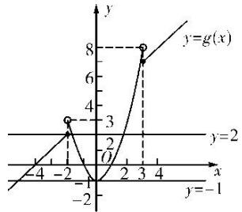
$f(x) = g(x) + k$ 的图象与 $x$ 轴恰有三个交点，即 $y = g(x)$ 与 $y = -k$ 的图象恰有三个交点，由图可知 $-1 < -k \leq 2$ ，即 $-2 \leq k < 1$ 。故选D.

# 考点三 利用函数图象解不等式

# 【方法总结】

# 利用函数图象求解不等式的思路
当不等式问题不能用代数法求解但其与函数有关时，常将不等式问题转化为两函数图象的上、下关系问题，从而利用数形结合求解.

# 【例题选讲】

[例 3] （1） 设奇函数 $f(x)$ 在 $(0, +\infty)$ 上为增函数，且 $f(1)=0$ ，则不等式 $\frac{f(x)-f(-x)}{x}<0$ 的解集为()

A. $(-1, 0) \cup (1, +\infty)$

B. $(-\infty, -1) \cup (0, 1)$

C. $(- \infty, -1) \cup (1, +\infty)$

D. $(-1, 0) \cup (0, 1)$
答案 D 解析 因为 $f(x)$ 为奇函数，所以不等式 $\frac{f(x)-f(-x)}{x}<0$ 可化为 $\frac{f(x)}{x}<0$ ，即 $xf(x)<0$ ， $f(x)$ 的大致图象如图所示．所以 $xf(x)<0$ 的解集为 $(-1,0)\cup(0,1)$ .

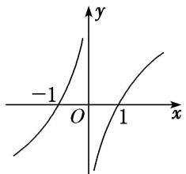  
（2） 如图, 函数 $f(x)$ 的图象为折线 $ACB$ , 则不等式 $f(x) \geq \log_2 (x + 1)$ 的解集为 \_\_\_\_.

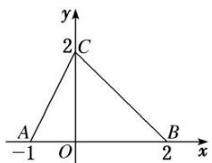
答案 $\{x| - 1 < x \leq 1\}$ 解析令 $y = \log_2(x + 1)$ ，作出函数 $y = \log_2(x + 1)$ 图象如图所示。由 $\left\{ \begin{array}{l} x + y = 2, \\ y = \log_2(x + 1) \end{array} \right.$ 得 $\left\{ \begin{array}{l} x = 1, \\ y = 1. \end{array} \right.$ ∴结合图象知不等式 $f(x) \geq \log_2(x + 1)$ 的解集为 $\{x | -1 < x \leq 1\}$ 。

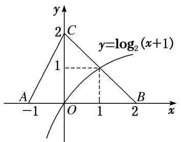  
（3） 若函数 $f(x)$ 是周期为 4 的偶函数，当 $x \in [0, 2]$ 时， $f(x) = x - 1$ ，则不等式 $xf(x) > 0$ 在 $(-1, 3)$ 上的解集为（）

A. $(1, 3)$

B. $(-1, 1)$

C. $(-1, 0) \cup (1, 3)$

D. $(-1, 0) \cup (0, 1)$
答案 C 解析 作出函数 $f(x)$ 的图象如图所示．当 $x \in (-1, 0)$ 时，由 $xf(x) > 0$ 得 $x \in (-1, 0)$ ；当 $x \in (0, 1)$ 时，由 $xf(x) > 0$ 得 $x \in \emptyset$ ；当 $x \in (1, 3)$ 时，由 $xf(x) > 0$ 得 $x \in (1, 3)$ ．故 $x \in (-1, 0) \cup (1, 3)$ .

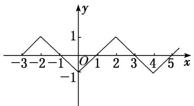  
（4） 若不等式 $(x - 1)^{2} < \log_{a} x (a > 0$ ，且 $a \neq 1$ 在 $x \in (1, 2)$ 内恒成立，则实数 $a$ 的取值范围为（）

A. (1, 2]

B. $\left(\frac{\sqrt{2}}{2},1\right)$

C. $(1, \sqrt{2})$

D. $(\sqrt{2}, 2)$
答案 A 解析 要使当 $x \in (1, 2)$ 时，不等式 $(x - 1)^{2} < \log_{a} x$ 恒成立，只需函数 $y = (x - 1)^{2}$ 在 $(1, 2)$ 上的图象在 $y = \log_{a} x$ 的图象的下方即可。当 $0 < a < 1$ 时，显然不成立；当 $a > 1$ 时，如图，要使 $x \in (1, 2)$ 时， $y = (x - 1)^{2}$ 的图象在 $y = \log_{a} x$ 的图象的下方，只需 $(2 - 1)^{2} \leq \log_{a} 2$ ，即 $\log_{a} 2 \geq 1$ ，解得 $1 < a \leq 2$ ，故实数 $a$ 的取值范围是 $(1, 2]$ 。  
（5） 若关于 $x$ 的不等式 $4a^{x-1} < 3x - 4 (a > 0$ , 且 $a \neq 1)$ 对于任意的 $x > 2$ 恒成立, 则实数 $a$ 的取值范围为 \_\_\_\_.
答案 $\left[0, \frac{1}{2}\right]$ 解析 不等式 $4a^{x-1} < 3x - 4$ 等价于 $a^{x-1} < \frac{3}{4}x - 1$ . 令 $f(x) = a^{x-1}$ , $g(x) = \frac{3}{4}x - 1$ , 当 $a > 1$ 时, 在同一坐标系中作出两个函数的图象如图（1）所示, 由图知不满足条件; 当 $0 < a < 1$ 时, 在同一坐标系中作出两个函数的图象如图（2）所示, 当 $x \geq 2$ 时, $f(2) \leq g(2)$ , 即 $a^{2-1} \leq \frac{3}{4} \times 2 - 1$ , 解得 $a \leq \frac{1}{2}$ , 所以 $a$ 的取值范围是 $\left[0, \frac{1}{2}\right]$ .

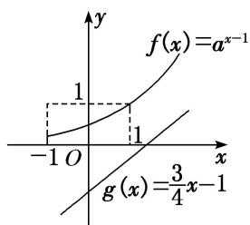

图（1）

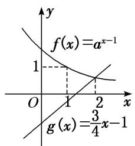

图（2）

# 【对点训练】

1. 对于函数 $f(x) = \lg (|x - 2| + 1)$ ，给出如下三个命题：① $f(x + 2)$ 是偶函数；② $f(x)$ 在区间 $(- \infty, 2)$ 上是减函数，在区间 $(2, +\infty)$ 上是增函数；③ $f(x)$ 没有最小值．其中正确的个数为（）

A. 1

B. 2

C. 3

D. 0

1. 答案 B 解析 因为函数 $f(x) = \lg (|x - 2| + 1)$ ，所以函数 $f(x + 2) = \lg (|x| + 1)$ 是偶函数；由 $y = \lg x$ 图象向左平移 1 个单位长度 $y = \lg (x + 1)$ 去掉 $y$ 轴左侧的图象，以 $y$ 轴为对称轴，作 $y$ 轴右侧图象的对称图象 $y = \lg (|x| + 1)$ 图象向右平移 2 个单位长度 $y = \lg (|x - 2| + 1)$ ，如图，可知 $f(x)$ 在 $(- \infty, 2)$ 上是减函数，在 $(2, +\infty)$ 上是增函数；由图象可知函数存在最小值为 0。所以①②正确。

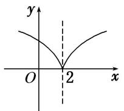

2. 若函数 $f(x) = \frac{ax - 2}{x - 1}$ 的图象关于点(1, 1)对称，则实数 $a =$ \_\_\_\_.

2. 答案 1 解析 函数 $f(x) = \frac{ax - 2}{x - 1} = a + \frac{a - 2}{x - 1} (x \neq 1)$ ，当 $a = 2$ 时， $f(x) = 2$ ，函数 $f(x)$ 的图象不关于点(1, 1)对称，故 $a \neq 2$ ，其图象的对称中心为(1, a)，即 $a = 1$ .

3. 给定 $\min\{a, b\}=\begin{cases}a,&a\leq b,\\b,&b<a,\end{cases}$ 已知函数 $f(x)=\min\{x,x^{2}-4x+4\}+4$ ，若动直线 y=m 与函数 $y=f(x)$ 的图象有 3 个交点，则实数 m 的取值范围为 \_\_\_\_.

3. 答案 (4, 5) 解析 设 $g(x) = \min \{x, x^2 - 4x + 4\}$ ，则 $f(x) = g(x) + 4$ ，故把 $g(x)$ 的图象向上平移 4 个单位长度，可得 $f(x)$ 的图象，函数 $f(x) = \min \{x, x^2 - 4x + 4\} + 4$ 的图象如图所示，由于直线 $y = m$ 与函数 $y = f(x)$ 的图象有 3 个交点，数形结合可得 $m$ 的取值范围为 (4, 5).

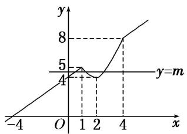

4. 用 $\min\{a, b, c\}$ 表示 $a, b, c$ 中的最小值. 设 $f(x)=\min\{2^x, x+2, 10-x\}(x \geq 0)$ , 则 $f(x)$ 的最大值为 \_\_\_\_.

4. 答案 6 解析 $f(x) = \min \{2^x, x + 2, 10 - x\} (x \geq 0)$ 的图象如图中实线所示。令 $x + 2 = 10 - x$ ，得 $x = 4$ 。故当 $x = 4$ 时， $f(x)$ 取最大值，又 $f(4) = 6$ ，所以 $f(x)$ 的最大值为 6。

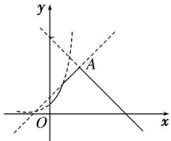

5. 已知函数 $f(x) = x^{2} + \mathrm{e}^{x} - \frac{1}{2} (x < 0)$ 与 $g(x) = x^{2} + \ln (x + a)$ 的图象上存在关于 $y$ 轴对称的点，则实数 $a$ 的取值范围是（）

A. $\left(-\infty,\frac{1}{\sqrt{e}}\right)$

B. $(-∞, √e)$

C. $\left(\frac{1}{\sqrt{e}},+\infty\right)$

D. $(\sqrt{e}, +\infty)$

5. 答案 B 解析 原命题等价于在 $x < 0$ 时， $f(x)$ 与 $g(-x)$ 的图象有交点，即方程 $\mathrm{e}^x - \frac{1}{2} - \ln (-x + a) = 0$ 在 $(- \infty, 0)$ 上有解，令 $m(x) = \mathrm{e}^x - \frac{1}{2} - \ln (-x + a)$ ，显然 $m(x)$ 在 $(- \infty, 0)$ 上为增函数。当 $a > 0$ 时，只需 $m(0)$
$= \mathrm{e}^{0} - \frac{1}{2} -\ln a > 0$ ，解得 $0 <   a <   \sqrt{\mathrm{e}}$ ；当 $a\leq 0$ 时， $x$ 趋于一元， $m(x) <   0$ ， $x$ 趋于 $a$ ， $m(x) > 0$ ，即 $m(x) = 0$ 在 $(-\infty ,$ a)上有解．综上，实数 $a$ 的取值范围是 $(-\infty ,\sqrt{\mathrm{e}})$

6. 已知函数 $f(x) = \begin{cases} -x^2 - 2x, & x \geq 0, \\ x^2 - 2x, & x < 0, \end{cases}$ 若 $f(3 - a^2) < f(2a)$ ，则实数 $a$ 的取值范围是 \_\_\_\_.

6. 答案 $(-3, 1)$ 解析 如图，画出 $f(x)$ 的图象，由图象易得 $f(x)$ 在 $\mathbf{R}$ 上单调递减， $\because f(3 - a^2) < f(2a)$ ， $\therefore 3 - a^2 > 2a$ ，解得 $-3 < a < 1$ .

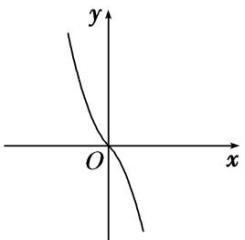

7. 函数 $f(x)$ 是定义在 $[-4, 4]$ 上的偶函数，其在 $[0, 4]$ 上的图象如图所示，那么不等式 $\frac{f(x)}{\cos x} < 0$ 的解集为 \_\_\_\_.

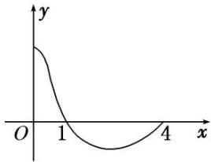

7. 答案 $\left[-\frac{\pi}{2}, -1\right]_{\cup}\left[1, \frac{\pi}{2}\right]$ 解析 在 $\left[0, \frac{\pi}{2}\right]$ 上 $y = \cos x > 0$ ，在 $\left[\frac{\pi}{2}, 4\right]$ 上 $y = \cos x < 0$ 。由 $f(x)$ 的图象知在 $\left[1, \frac{\pi}{2}\right]$ 上 $\frac{f(x)}{\cos x} < 0$ ，因为 $f(x)$ 为偶函数， $y = \cos x$ 也是偶函数，所以 $y = \frac{f(x)}{\cos x}$ 为偶函数，所以 $\frac{f(x)}{\cos x} < 0$ 的解集为 $\left[-\frac{\pi}{2}, -1\right]_{\cup}\left[1, \frac{\pi}{2}\right]$ .

8. 如图, 函数 $f(x)$ 的图象为两条射线 $CA$ , $CB$ 组成的折线, 如果不等式 $f(x) \geq x^2 - x - a$ 的解集中有且仅有 1 个整数, 则实数 $a$ 的取值范围是 ( )

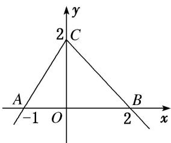

A. $\{a| - 2 < a < -1\}$

B. $\{a| - 2\leq a <   - 1\}$

C. $\{a| - 2\leq a <   2\}$

D. $\{a|a\geq -2\}$

8. 答案 B 解析 根据题意可知 $f(x)=\left\{\begin{aligned}&2x+2,&x\leq0,\\&-x+2,&x>0,\end{aligned}\right.$ 不等式 $f(x)\geq x^{2}-x-a$ 等价于 $a\geq x^{2}-x-f(x)$ ，令 $g(x)=x^{2}-x-f(x)=\left\{\begin{aligned}&x^{2}-3x-2,&x\leq0,\\&x^{2}-2,&x>0,\end{aligned}\right.$

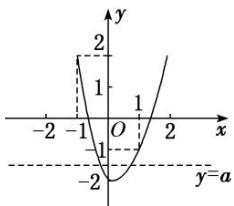

作出 $g(x)$ 的大致图象，如图所示，又 $g(0) = -2, g(1) = -1, g(-1) = 2, \therefore$ 要使不等式的解集中有且仅有 1 个整数，则 $-2 \leq a < -1$ ，则实数 a 的取值范围是 $\{a \mid -2 \leq a < -1\}$ 。故选 B.

9. 设函数 $f(x) = |x + a|$ ， $g(x) = x - 1$ ，对于任意的 $x \in \mathbf{R}$ ，不等式 $f(x) \geq g(x)$ 恒成立，则实数 $a$ 的取值范围是 \_\_\_\_.

9. 答案 $a \geq -1$ 解析 如图，要使 $f(x) \geq g(x)$ 恒成立，则 $-a \leq 1$ ，所以 $a \geq -1$ .

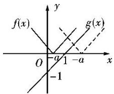

10. 设函数 $f(x) = ax + \cos x, x \in [0, \pi]$ . 设 $f(x) \leq 1 + \sin x$ ，则 $a$ 的取值范围为 \_\_\_\_.

10. 答案 $\left(-\infty, \frac{2}{\pi}\right]$ 解析 由 $f(x) \leq 1 + \sin x$ ，得 $ax + \cos x \leq 1 + \sin x$ ，即 $ax \leq \sqrt{2} \sin \left(x - \frac{\pi}{4}\right) + 1$ ，构造函数 $g_{1}(x) = ax$ ， $g_{2}(x) = \sqrt{2} \sin \left(x - \frac{\pi}{4}\right) + 1$ ，如图所示，若使 $ax \leq \sqrt{2} \sin \left(x - \frac{\pi}{4}\right) + 1$ 恒成立，

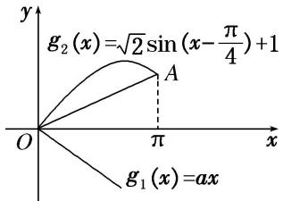
则函数 $g_{1}(x)=ax$ 的图象总在函数 $g_{2}(x)=\sqrt{2}\sin\left(x-\frac{\pi}{4}\right)+1$ 的图象的下方．因为 $x\in[0,\pi]$ ， $A(\pi,2)$ ， $k_{OA}=\frac{2}{\pi}$ ，所以 a 的取值范围为 $\left[-\infty,\frac{2}{\pi}\right]$ .

11. 已知函数 $f(x)=\left\{\begin{aligned}\log_{2}x, & x>0, \\ 2^{x}, & x\leq0,\end{aligned}\right.$ 且关于 x 的方程 $f(x)-a=0$ 有两个实根，则实数 a 的取值范围是 \_\_\_\_.

11. 答案 (0, 1] 解析 当 $x \leq 0$ 时, $0 < 2^{x} \leq 1$ , 所以由图象可知要使方程 $f(x) - a = 0$ 有两个实根, 即 $f(x) = a$ 有两个根, 则 $0 < a \leq 1$ .

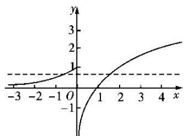

12. 已知函数 $f(x) = \begin{cases} |2^x - 1|, & x < 2, \\ \frac{3}{x - 1}, & x \geq 2. \end{cases}$ 若方程 $f(x) - a = 0$ 有三个不同的实数根，则实数 $a$ 的取值范围是 \_\_\_\_.

12. 答案 (0, 1) 解析 画出函数 $f(x)$ 的图象如图所示，观察图象可知，若方程 $f(x) - a = 0$ 有三个不同的实数根，

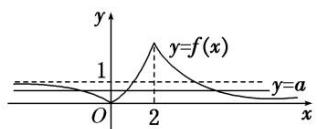
即函数 $y=f(x)$ 的图象与直线 y=a 有 3 个不同的交点，此时需满足 0<a<1.

13. 定义在 $\mathbf{R}$ 上的函数 $f(x) = \begin{cases} \lg |x|, & x \neq 0, \\ 1, & x = 0, \end{cases}$ 关于 $x$ 的方程 $f(x) = c$ (c 为常数) 恰有三个不同的实数根 $x_1, x_2, x_3$ ，则 $x_1 + x_2 + x_3 =$ \_\_\_\_.

13. 答案 0 解析 函数 $f(x)$ 的图象如图，方程 $f(x) = c$ 有三个根，即 $y = f(x)$ 与 $y = c$ 的图象有三个交点，易知 $c = 1$ ，且一根为 0，由 $\lg |x| = 1$ 知另两根为 -10 和 10，所以 $x_{1} + x_{2} + x_{3} = 0$ .

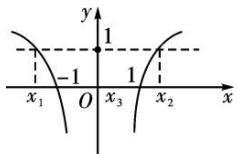

14. 已知函数 $y = f(x)$ 及 $y = g(x)$ 的图象分别如图所示, 方程 $f(g(x)) = 0$ 和 $g(f(x)) = 0$ 的实根个数分别为 $a$ 和 $b$ , 则 $ab = (\quad)$

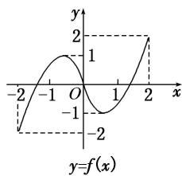

A. 24

B. 15

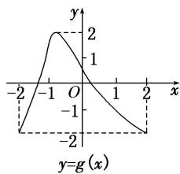

C. 6

D. 4

14. 答案 A 解析 由图象知， $f(x)=0$ 有 3 个根，分别为 0， $\pm m(m>0)$ ，其中 1<m<2， $g(x)=0$ 有 2 个根 n，p，-2<n<-1，0<p<1，由 $f(g(x))=0$ ，得 $g(x)=0$ 或 $\pm m$ ，由图象可知当 $g(x)$ 所对应的值为 0， $\pm m$ 时，其都有 2 个根，因而 a=6；由 $g(f(x))=0$ ，知 $f(x)=n$ 或 p，由图象可以看出当 $f(x)=n$ 时，有 1 个根，而当 $f(x)=p$ 时，有 3 个根，即 $b=1+3=4$ 。所以 ab=24。

