**专题十　函数图象的应用**

**考点一　利用函数图象研究函数的性质**

【**方法总结**】

利用图象研究函数性质问题的思路

对于已知或解析式易画出其在给定区间上图象的函数，其性质常借助图象研究：

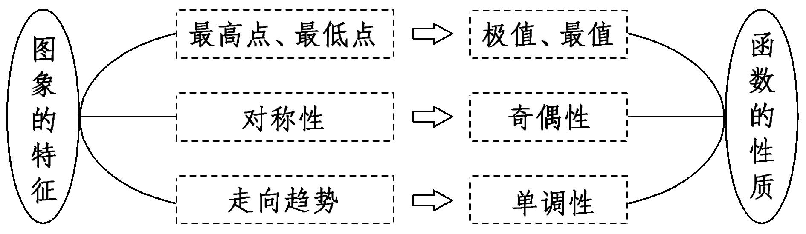

**【例题选讲】**

<strong>[例1]</strong> (1) 已知函数<em>f</em>(<em>x</em>)＝<em>x</em>|<em>x</em>|－2<em>x</em>，则下列结论正确的是(　　)

A．*f*(*x*)是偶函数，递增区间是(0，＋∞)　　　B．*f*(*x*)是偶函数，递减区间是(－∞，1)

C．*f*(*x*)是奇函数，递减区间是(－1，1)　　　D．*f*(*x*)是奇函数，递增区间是(－∞，0)

答案　C　解析　将函数*f*(*x*)＝*x*|*x*|－2*x*去掉绝对值得*f*(*x*)＝画出函数*f*(*x*)的图象，如图，

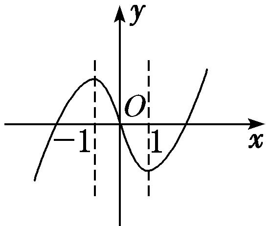

观察图象可知，函数*f*(*x*)的图象关于原点对称，故函数*f*(*x*)为奇函数，且在(－1，1)上单调递减．

(2) 设函数*y*＝，关于该函数图象的命题如下：

①一定存在两点，这两点的连线平行于*x*轴；②任意两点的连线都不平行于*y*轴；③关于直线*y*＝*x*对称；④关于原点中心对称．

其中正确的是(　　)

A．①②　　　　　　　　B．②③　　　　　　　　C．③④　　　　　　　　D．①④

答案　B　解析　*y*＝＝＝2＋，图象如图所示，可知②③正确．

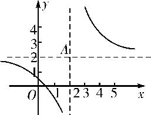

(3) 已知函数*f*(*x*)＝若*f*(*x*)在区间[*m，* 4]上的值域为[－1，2]，则实数*m*的取值范围为\_\_\_\_\_\_\_\_．

答案　[－8，－1]　解析　作出函数<em>f</em>(<em>x</em>)的图象，当<em>x</em>≤－1时，函数<em>f</em>(<em>x</em>)＝log2单调递减，且最小值为<em>f</em>(－1)＝－1，则令log2＝2，解得<em>x</em>＝－8；当<em>x</em>&gt;－1时，函数<em>f</em>(<em>x</em>)＝－<em>x</em>2＋<em>x</em>＋在(－1，2)上单调递增，在[2，＋∞)上单调递减，则最大值为<em>f</em>(2)＝2，又<em>f</em>(4)＝&lt;2，<em>f</em>(－1)＝－1，故所求实数<em>m</em>的取值范围为[－8，－1]．

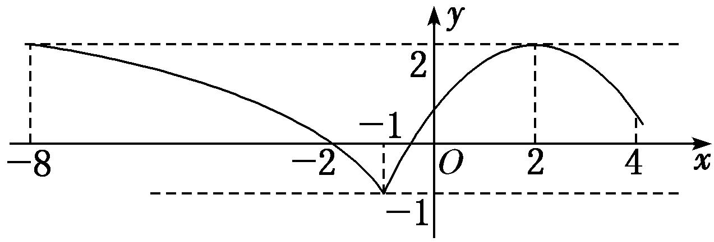

(4) 对<em>a</em>，<em>b</em>∈<strong>R</strong>，记max{<em>a</em>，<em>b</em>}＝函数<em>f</em>(<em>x</em>)＝max{|<em>x</em>＋1|，|<em>x</em>－2|}(<em>x</em>∈<strong>R</strong>)的最小值是\_\_\_\_\_\_\_\_．

答案　　解析　函数<em>f</em>(<em>x</em>)＝max{|<em>x</em>＋1|，|<em>x</em>－2|}(<em>x</em>∈<strong>R</strong>)的图象如图所示，由图象可得，其最小值为．

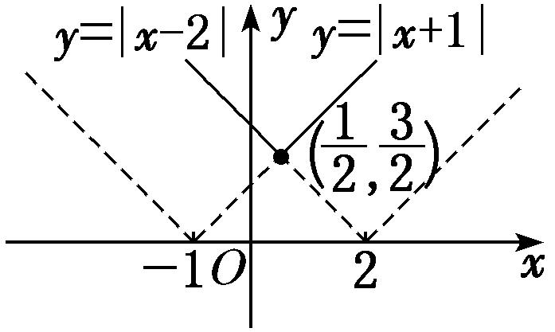

(5) 设函数<em>f</em>(<em>x</em>)是定义在<strong>R</strong>上的偶函数，且对任意的<em>x</em>∈<strong>R</strong>恒有<em>f</em>(<em>x</em>＋1)＝<em>f</em>(<em>x</em>－1)，已知当<em>x</em>∈[0，1]时，<em>f</em>(<em>x</em>)＝1－<em>x</em>，则说法：①2是函数<em>f</em>(<em>x</em>)的周期；②函数<em>f</em>(<em>x</em>)在(1，2)上递减，在(2，3)上递增；③函数<em>f</em>(<em>x</em>)的最大值是1，最小值是0；④当<em>x</em>∈(3，4)时，<em>f</em>(<em>x</em>)＝<em>x</em>－3．

其中所有正确说法的序号是\_\_\_\_\_\_\_\_．

答案　①②④　解析　由已知条件得<em>f</em>(<em>x</em>＋2)＝<em>f</em>(<em>x</em>)，所以<em>y</em>＝<em>f</em>(<em>x</em>)是以2为周期的周期函数，①正确；当－1≤<em>x</em>≤0时，0≤－<em>x</em>≤1，<em>f</em>(<em>x</em>)＝<em>f</em>(－<em>x</em>)＝1＋<em>x</em>，函数<em>y</em>＝<em>f</em>(<em>x</em>)的图象如图所示：

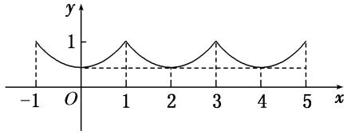

当3&lt;<em>x</em>&lt;4时，－1&lt;<em>x</em>－4&lt;0，<em>f</em>(<em>x</em>)＝<em>f</em>(<em>x</em>－4)＝<em>x</em>－3，因此②④正确，③不正确．

**考点二　利用函数图象解决方程根的问题**

【**方法总结**】

利用函数的图象解决方程根问题的思路

当方程与基本函数有关时，可以通过函数图象来研究方程的根，方程*f*(*x*)＝0的根就是函数*f*(*x*)图象与*x*轴交点的横坐标，方程*f*(*x*)＝*g*(*x*)的根就是函数*f*(*x*)与*g*(*x*)图象交点的横坐标．

**【例题选讲】**

<strong>[例2]</strong> (1)已知函数<em>f</em>(<em>x</em>)＝2ln <em>x</em>，<em>g</em>(<em>x</em>)＝<em>x</em>2－4<em>x</em>＋5，则方程<em>f</em>(<em>x</em>)＝<em>g</em>(<em>x</em>)的根的个数为(　　)

A．0　　　　　　　　B．1　　　　　　　　C．2　　　　　　　　D．3

答案　C　解析　由已知<em>g</em>(<em>x</em>)＝(<em>x</em>－2)2＋1，得其顶点为(2，1)，又<em>f</em>(2)＝2ln 2∈(1，2)，可知点(2，1)位于函数<em>f</em>(<em>x</em>)＝2ln <em>x</em>图象的下方，故函数<em>f</em>(<em>x</em>)＝2ln <em>x</em>的图象与函数<em>g</em>(<em>x</em>)＝<em>x</em>2－4<em>x</em>＋5的图象有2个交点．

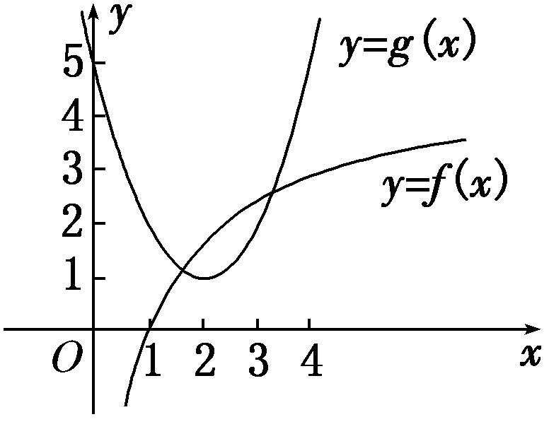

(2) 已知函数<em>f</em>(<em>x</em>)满足：①定义域为<strong>R</strong>；②∀<em>x</em>∈R，都有<em>f</em>(<em>x</em>＋2)＝<em>f</em>(<em>x</em>)；③当<em>x</em>∈[－1，1]时，<em>f</em>(<em>x</em>)＝－|<em>x</em>|＋1．则方程<em>f</em>(<em>x</em>)＝log2|<em>x</em>|在区间[－3，5]内解的个数是(　　)

A．5　　　　　　　　B．6　　　　　　　　C．7　　　　　　　　D．8

答案　A　解析　依题意画出<em>y</em>＝<em>f</em>(<em>x</em>)与<em>y</em>＝log2|<em>x</em>|的图象如图所示，由图可知，解的个数为5．

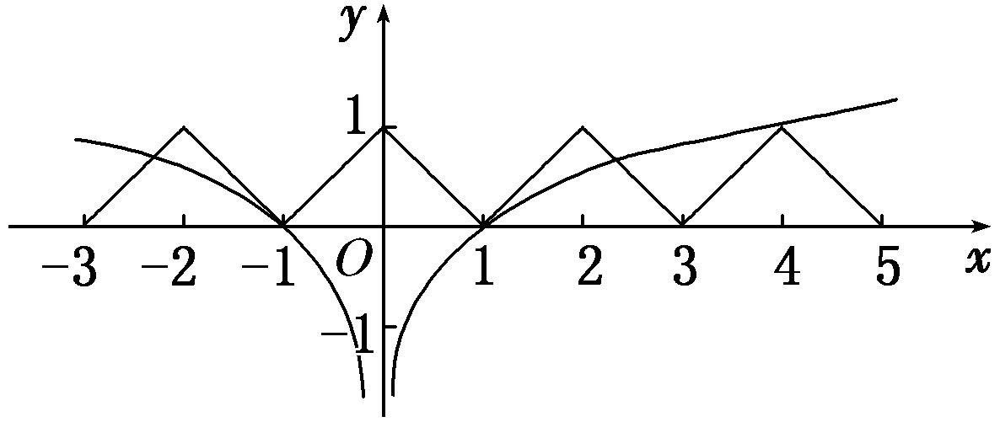

(3) 已知<em>f</em>(<em>x</em>)＝则方程2<em>f</em>2(<em>x</em>)－3<em>f</em>(<em>x</em>)＋1＝0的解的个数为\_\_\_\_\_\_\_\_．

答案　5　解析　方程2<em>f</em>2(<em>x</em>)－3<em>f</em>(<em>x</em>)＋1＝0的解为<em>f</em>(<em>x</em>)＝或<em>f</em>(<em>x</em>)＝1.作出<em>y</em>＝<em>f</em>(<em>x</em>) 的图象，由图象知直线<em>y</em>＝与函数<em>y</em>＝<em>f</em>(<em>x</em>)的图象有2个公共点；直线<em>y</em>＝1与函数<em>y</em>＝<em>f</em>(<em>x</em>)的图象有3个公共点．故方程2<em>f</em>2(<em>x</em>)－3<em>f</em>(<em>x</em>)＋1＝0有5个解．

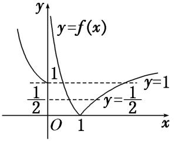

(4) 已知函数*f*(*x*)＝|*x*－2|＋1，*g*(*x*)＝*kx*．若方程*f*(*x*)＝*g*(*x*)有两个不相等的实根，则实数*k*的取值范围是(　　)

A．　　　　　　B．　　　　　　C．(1，2)　　　　　　　D．(2，＋∞)

答案　B　解析　先作出函数*f*(*x*)＝|*x*－2|＋1的图象，如图所示，当直线*g*(*x*)＝*kx*与直线*AB*平行时斜率为1，当直线*g*(*x*)＝*kx*过*A*点时斜率为，故*f*(*x*)＝*g*(*x*)有两个不相等的实根时，*k*的取值范围为．

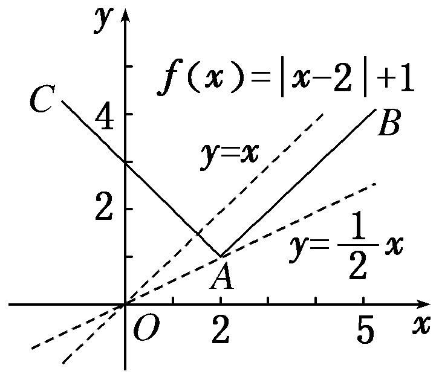

(5) 对任意实数<em>a</em>，<em>b</em>定义运算“⊙”：<em>a</em>⊙<em>b</em>＝设<em>f</em>(<em>x</em>)＝(<em>x</em>2－1)⊙(4＋<em>x</em>)＋<em>k</em>，若函数<em>f</em>(<em>x</em>)的图象与<em>x</em>轴恰有三个交点，则<em>k</em>的取值范围是(　　)

A．(－2，1)　　　　　B．[0，1]　　　　　C．[－2，0)　　　　　D．[－2，1)

答案　D　解析　令<em>g</em>(<em>x</em>)＝(<em>x</em>2－1)⊙(4＋<em>x</em>)＝其图象如图所示．

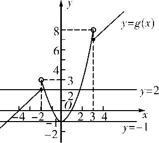

*f*(*x*)＝*g*(*x*)＋*k*的图象与*x*轴恰有三个交点，即*y*＝*g*(*x*)与*y*＝－*k*的图象恰有三个交点，由图可知－1<－*k*≤2，即－2≤*k*<1．故选D．

**考点三　利用函数图象解不等式**

【**方法总结**】

利用函数图象求解不等式的思路

当不等式问题不能用代数法求解但其与函数有关时，常将不等式问题转化为两函数图象的上、下关系问题，从而利用数形结合求解．

**【例题选讲】**

<strong>[例3]</strong> (1) 设奇函数<em>f</em>(<em>x</em>)在(0，＋∞)上为增函数，且<em>f</em>(1)＝0，则不等式&lt;0的解集为(　　)

A．(－1，0)∪(1，＋∞)　　　　　　　　B．(－∞，－1)∪(0，1)

C．(－∞，－1)∪(1，＋∞)　　　　　　　　D．(－1，0)∪(0，1)

答案　D　解析　因为*f*(*x*)为奇函数，所以不等式<0可化为<0，即*xf*(*x*)<0，*f*(*x*)的大致图象如图所示．所以*xf*(*x*)<0的解集为(－1，0)∪(0，1)．

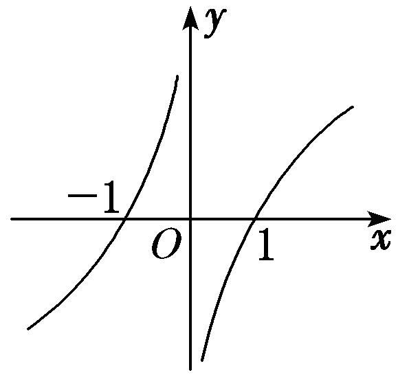

(2) 如图，函数<em>f</em>(<em>x</em>)的图象为折线<em>ACB</em>，则不等式<em>f</em>(<em>x</em>)≥log2(<em>x</em>＋1)的解集为\_\_\_\_\_\_\_\_．

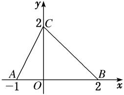

答案　{<em>x</em>|－1&lt;<em>x</em>≤1}　解析　令<em>y</em>＝log2(<em>x</em>＋1)，作出函数<em>y</em>＝log2(<em>x</em>＋1)图象如图所示．由得∴结合图象知不等式<em>f</em>(<em>x</em>)≥log2(<em>x</em>＋1)的解集为{<em>x</em>|－1&lt;<em>x</em>≤1}．

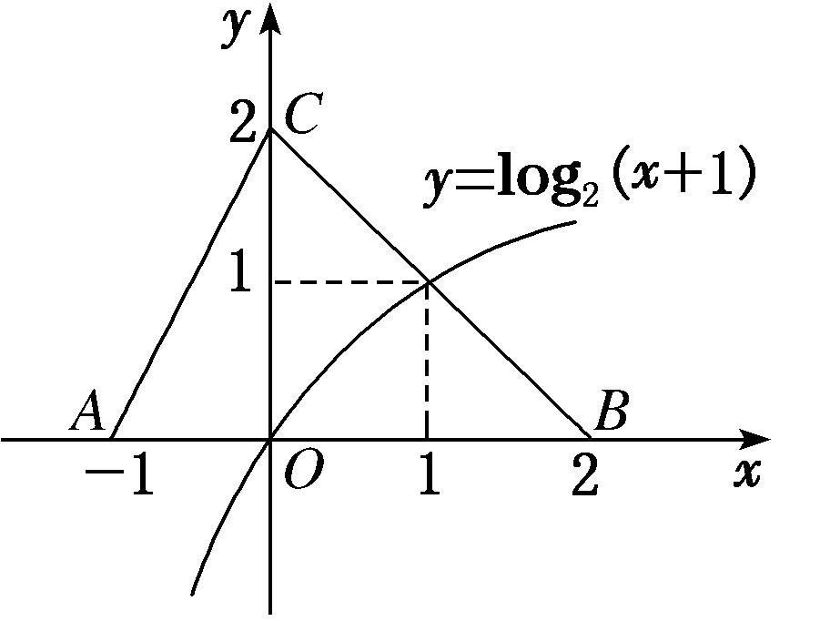

(3) 若函数*f*(*x*)是周期为4的偶函数，当*x*∈[0，2]时，*f*(*x*)＝*x*－1，则不等式*xf*(*x*)>0在(－1，3)上的解集为(　　)

A．(1，3)　　　　B．(－1，1)　　　　C．(－1，0)∪(1，3)　　　　D．(－1，0)∪(0，1)

答案　C　解析　作出函数*f*(*x*)的图象如图所示．当*x*∈(－1，0)时，由*xf*(*x*)>0得*x*∈(－1，0)；当*x*∈(0，1)时，由*xf*(*x*)>0得*x*∈∅；当*x*∈(1，3)时，由*xf*(*x*)>0得*x*∈(1，3)．故*x*∈(－1，0)∪(1，3)．

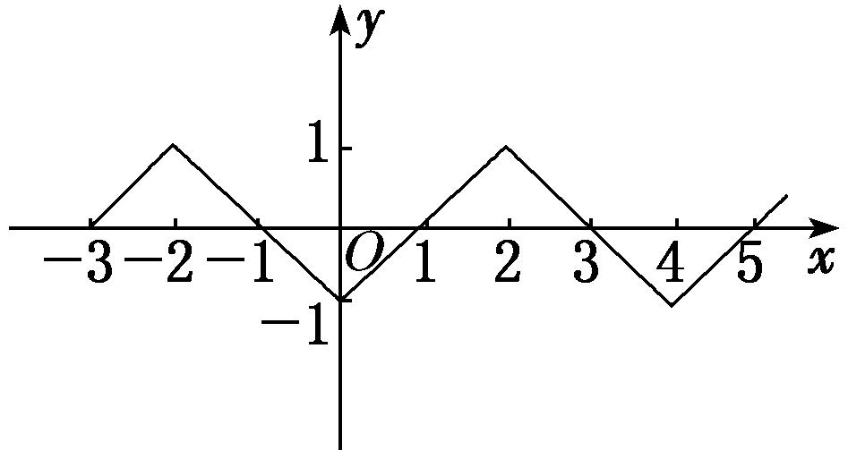

(4) 若不等式(<em>x</em>－1)2&lt;log<em>ax</em>(<em>a</em>&gt;0，且<em>a</em>≠1)在<em>x</em>∈(1，2)内恒成立，则实数<em>a</em>的取值范围为(　　)

A．(1，2]　　　　　B．　　　　　C．(1，)　　　　　D．(，2)

答案　A　解析　要使当<em>x</em>∈(1，2)时，不等式(<em>x</em>－1)2&lt;log<em>ax</em>恒成立，只需函数<em>y</em>＝(<em>x</em>－1)2在(1，2)上的图象在<em>y</em>＝log<em>ax</em>的图象的下方即可．当0&lt;<em>a</em>&lt;1时，显然不成立；当<em>a</em>&gt;1时，如图，要使<em>x</em>∈(1，2)时，<em>y</em>＝(<em>x</em>－1)2的图象在<em>y</em>＝log<em>ax</em>的图象的下方，只需(2－1)2≤log<em>a</em>2，即log<em>a</em>2≥1，解得1&lt;<em>a</em>≤2，故实数<em>a</em>的取值范围是(1，2]．

(5) 若关于<em>x</em>的不等式4<em>ax</em>－1&lt;3<em>x</em>－4(<em>a</em>&gt;0，且<em>a</em>≠1)对于任意的<em>x</em>&gt;2恒成立，则实数<em>a</em>的取值范围为\_\_\_\_\_\_\_\_．

答案　　解析　不等式4<em>ax</em>－1&lt;3<em>x</em>－4等价于<em>ax</em>－1&lt;<em>x</em>－1．令<em>f</em>(<em>x</em>)＝<em>ax</em>－1，<em>g</em>(<em>x</em>)＝<em>x</em>－1，当<em>a</em>&gt;1时，在同一坐标系中作出两个函数的图象如图(1)所示，由图知不满足条件；当0&lt;<em>a</em>&lt;1时，在同一坐标系中作出两个函数的图象如图(2)所示，当<em>x</em>≥2时，<em>f</em>(2)≤<em>g</em>(2)，即<em>a</em>2－1≤×2－1，解得<em>a</em>≤，所以<em>a</em>的取值范围是．

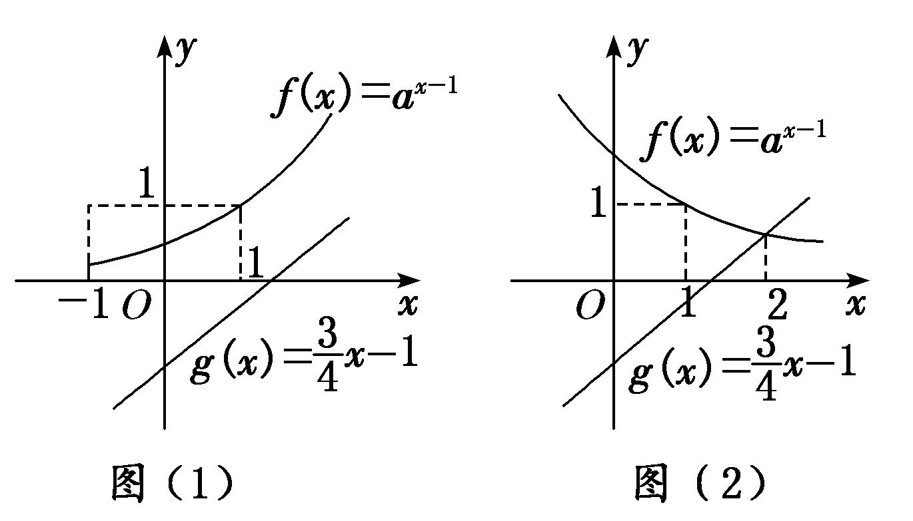

【**对点训练**】

1．对于函数*f*(*x*)＝lg(|*x*－2|＋1)，给出如下三个命题：①*f*(*x*＋2)是偶函数；②*f*(*x*)在区间(－∞，2)上是减函

数，在区间(2，＋∞)上是增函数；③*f*(*x*)没有最小值．其中正确的个数为(　　)

A．1　　　　　　　　B．2　　　　　　　　C．3　　　　　　　　D．0

1．答案　B　解析　因为函数*f*(*x*)＝lg(|*x*－2|＋1)，所以函数*f*(*x*＋2)＝lg(|*x*|＋1)是偶函数；由*y*＝lg

*x*图象向左平移1个单位长度*y*＝lg(*x*＋1) 去掉*y*轴左侧的图象，以*y*轴为对称轴，作*y*轴右侧图象的对称图象*y*＝lg(|*x*|＋1) 图象向右平移2个单位长度*y*＝lg(|*x*－2|＋1)，如图，可知*f*(*x*)在(－∞，2)上是减函数，在(2，＋∞)上是增函数；由图象可知函数存在最小值为0．所以①②正确．

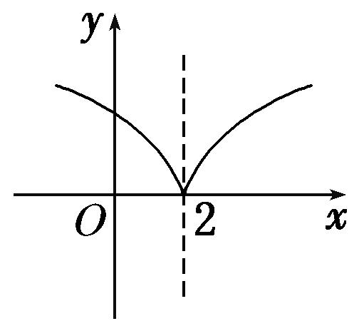

2．若函数*f*(*x*)＝的图象关于点(1，1)对称，则实数*a*＝\_\_\_\_\_\_\_\_．

2．答案　1　解析　函数*f*(*x*)＝＝*a*＋(*x*≠1)，当*a*＝2时，*f*(*x*)＝2，函数*f*(*x*)的图象不关于点(1，

1)对称，故*a*≠2，其图象的对称中心为(1，*a*)，即*a*＝1．

3．给定min{<em>a</em>，<em>b</em>}＝已知函数<em>f</em>(<em>x</em>)＝min{<em>x</em>，<em>x</em>2－4<em>x</em>＋4}＋4，若动直线<em>y</em>＝<em>m</em>与函数<em>y</em>＝<em>f</em>(<em>x</em>)的

图象有3个交点，则实数*m*的取值范围为\_\_\_\_\_\_\_\_．

3．答案　(4，5)　解析　设<em>g</em>(<em>x</em>)＝min{<em>x</em>，<em>x</em>2－4<em>x</em>＋4}，则<em>f</em>(<em>x</em>)＝<em>g</em>(<em>x</em>)＋4，故把<em>g</em>(<em>x</em>)的图象向上平移4个单

位长度，可得<em>f</em>(<em>x</em>)的图象，函数<em>f</em>(<em>x</em>)＝min{<em>x</em>，<em>x</em>2－4<em>x</em>＋4}＋4的图象如图所示，由于直线<em>y</em>＝<em>m</em>与函数<em>y</em>＝<em>f</em>(<em>x</em>)的图象有3个交点，数形结合可得<em>m</em>的取值范围为(4，5)．

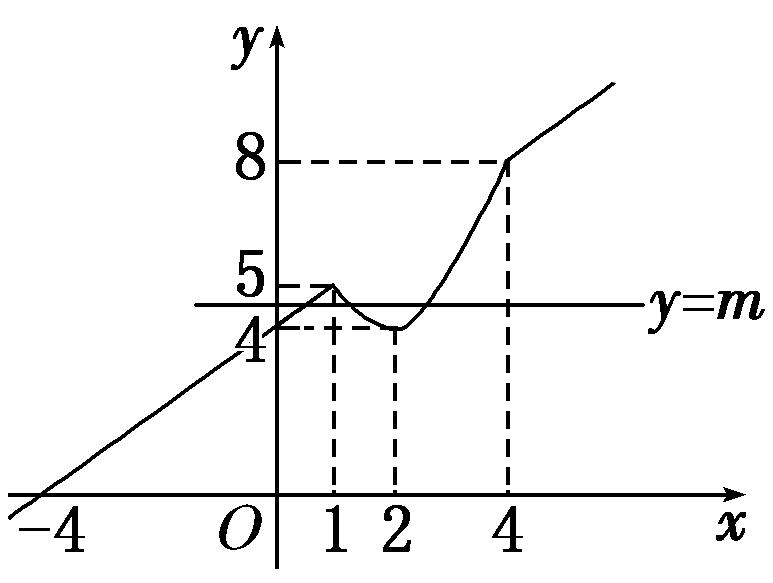

4．用min{<em>a</em>，<em>b</em>，<em>c</em>}表示<em>a</em>，<em>b</em>，<em>c</em>中的最小值．设<em>f</em>(<em>x</em>)＝min{2<em>x</em>，<em>x</em>＋2，10－<em>x</em>}(<em>x</em>≥0)，则<em>f</em>(<em>x</em>)的最大值为\_\_\_\_\_\_\_\_．

4．答案　6　解析　<em>f</em>(<em>x</em>)＝min{2<em>x</em>，<em>x</em>＋2，10－<em>x</em>}(<em>x</em>≥0)的图象如图中实线所示．令<em>x</em>＋2＝10－<em>x</em>，得<em>x</em>＝4．故

当*x*＝4时，*f*(*x*)取最大值，又*f*(4)＝6，所以*f*(*x*)的最大值为6．

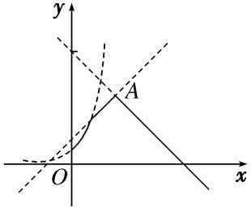

5．已知函数<em>f</em>(<em>x</em>)＝<em>x</em>2＋e<em>x</em>－(<em>x</em>&lt;0)与<em>g</em>(<em>x</em>)＝<em>x</em>2＋ln(<em>x</em>＋<em>a</em>)的图象上存在关于<em>y</em>轴对称的点，则实数<em>a</em>的取值范

围是(　　)

A．　　　　B．(－∞， )　　　　C．　　　　D．( ，＋∞)

5．答案　B　解析　原命题等价于在<em>x</em>&lt;0时，<em>f</em>(<em>x</em>)与<em>g</em>(－<em>x</em>)的图象有交点，即方程e<em>x</em>－－ln(－<em>x</em>＋<em>a</em>)＝0在

(－∞，0)上有解，令<em>m</em>(<em>x</em>)＝e<em>x</em>－－ln(－<em>x</em>＋<em>a</em>)，显然<em>m</em>(<em>x</em>)在(－∞，0)上为增函数．当<em>a</em>&gt;0时，只需<em>m</em>(0)＝e0－－ln <em>a</em>&gt;0，解得0&lt;<em>a</em>&lt;；当<em>a</em>≤0时，<em>x</em>趋于－∞，<em>m</em>(<em>x</em>)&lt;0，<em>x</em>趋于<em>a</em>，<em>m</em>(<em>x</em>)&gt;0，即<em>m</em>(<em>x</em>)＝0在(－∞，<em>a</em>)上有解．综上，实数<em>a</em>的取值范围是(－∞，)．

6．已知函数<em>f</em>(<em>x</em>)＝若<em>f</em>(3－<em>a</em>2)&lt;<em>f</em>(2<em>a</em>)，则实数<em>a</em>的取值范围是\_\_\_\_\_\_\_\_．

6．答案　(－3，1)　解析　如图，画出<em>f</em>(<em>x</em>)的图象，由图象易得<em>f</em>(<em>x</em>)在<strong>R</strong>上单调递减，∵<em>f</em>(3－<em>a</em>2)&lt;<em>f</em>(2<em>a</em>)，

∴3－<em>a</em>2&gt;2<em>a</em>，解得－3&lt;<em>a</em>&lt;1．

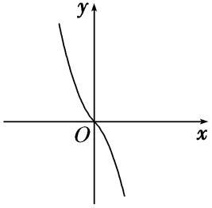

7．函数*f*(*x*)是定义在[－4，4]上的偶函数，其在[0，4]上的图象如图所示，那么不等式<0的解集为

\_\_\_\_\_\_\_\_．

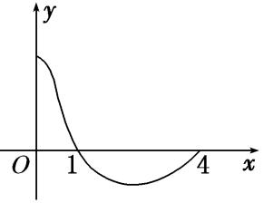

7．答案　∪　解析　在上*y*＝cos *x*>0，在上*y*＝cos *x*<0．由*f*(*x*)的图象知在

上<0，因为*f*(*x*)为偶函数，*y*＝cos *x*也是偶函数，所以*y*＝为偶函数，所以<0的解集为∪.

8．如图，函数<em>f</em>(<em>x</em>)的图象为两条射线<em>CA</em>，<em>CB</em>组成的折线，如果不等式<em>f</em>(<em>x</em>)≥<em>x</em>2－<em>x</em>－<em>a</em>的解集中有且仅有1

个整数，则实数*a*的取值范围是(　　)

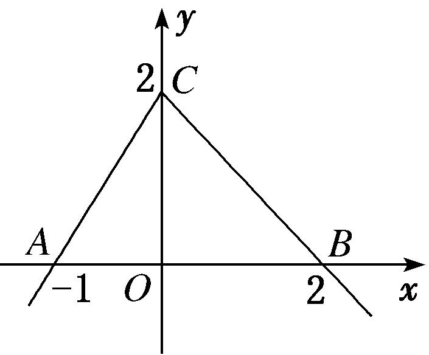

A．{*a*|－2<*a*<－1}　　B．{*a*|－2≤*a*<－1}　　C．{*a*|－2≤*a*<2}　　D．{*a*|*a*≥－2}

8．答案　B　解析　根据题意可知<em>f</em>(<em>x</em>)＝不等式<em>f</em>(<em>x</em>)≥<em>x</em>2－<em>x</em>－<em>a</em>等价于<em>a</em>≥<em>x</em>2－<em>x</em>－<em>f</em>(<em>x</em>)，令<em>g</em>(<em>x</em>)

＝<em>x</em>2－<em>x</em>－<em>f</em>(<em>x</em>)＝

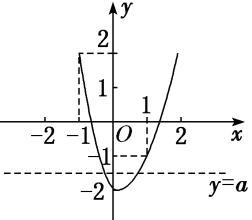

作出*g*(*x*)的大致图象，如图所示，又*g*(0)＝－2，*g*(1)＝－1，*g*(－1)＝2，∴要使不等式的解集中有且仅有1个整数，则－2≤*a*<－1，则实数*a*的取值范围是{*a*|－2≤*a*<－1}．故选B．

9．设函数<em>f</em>(<em>x</em>)＝|<em>x</em>＋<em>a</em>|，<em>g</em>(<em>x</em>)＝<em>x</em>－1，对于任意的<em>x</em>∈<strong>R</strong>，不等式<em>f</em>(<em>x</em>)≥<em>g</em>(<em>x</em>)恒成立，则实数<em>a</em>的取值范围是

\_\_\_\_\_\_\_\_\_\_．

9．答案　*a*≥－1　解析　如图，要使*f*(*x*)≥*g*(*x*)恒成立，则－*a*≤1，所以*a*≥－1．

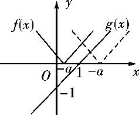

10．设函数*f*(*x*)＝*ax*＋cos *x*，*x*∈[0，π]．设*f*(*x*)≤1＋sin *x*，则*a*的取值范围为\_\_\_\_\_\_\_\_．

10．答案　　解析　由*f*(*x*)≤1＋sin *x*，得*ax*＋cos *x*≤1＋sin *x*，即*ax*≤sin＋1，构造函数

<em>g</em>1(<em>x</em>)＝<em>ax</em>，<em>g</em>2(<em>x</em>)＝sin＋1，如图所示，若使<em>ax</em>≤sin＋1恒成立，

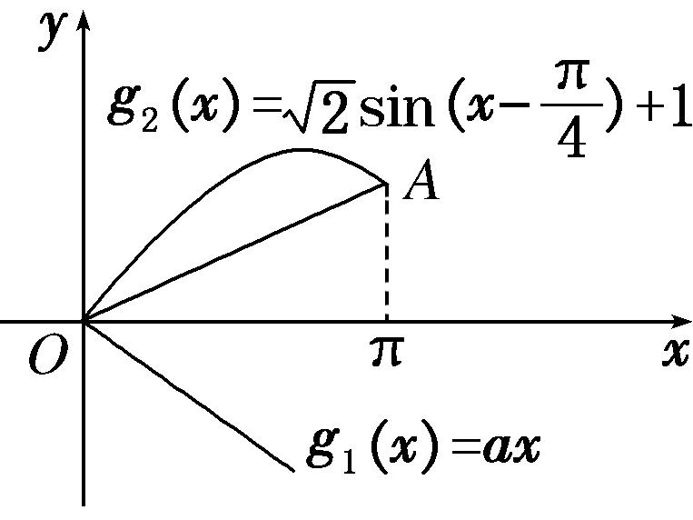

则函数<em>g</em>1(<em>x</em>)＝<em>ax</em>的图象总在函数<em>g</em>2(<em>x</em>)＝sin＋1的图象的下方．因为<em>x</em>∈[0，π]，<em>A</em>(π，2)，<em>kOA</em>＝，所以<em>a</em>的取值范围为.

11．已知函数*f*(*x*)＝且关于*x*的方程*f*(*x*)－*a*＝0有两个实根，则实数*a*的取值范围是\_\_\_\_\_\_\_\_．

11．答案　(0，1]　解析　当<em>x</em>≤0时，0&lt;2<em>x</em>≤1，所以由图象可知要使方程<em>f</em>(<em>x</em>)－<em>a</em>＝0有两个实根，即<em>f</em>(<em>x</em>)＝

*a*有两个根，则0<*a*≤1．

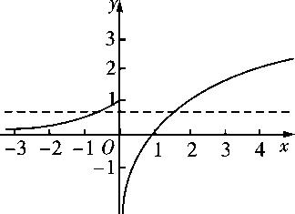

12．已知函数*f*(*x*)＝若方程*f*(*x*)－*a*＝0有三个不同的实数根，则实数*a*的取值范围是

\_\_\_\_\_\_\_\_．

12．答案　(0，1)　解析　画出函数*f*(*x*)的图象如图所示，观察图象可知，若方程*f*(*x*)－*a*＝0有三个不同的

实数根，

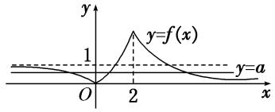

即函数*y*＝*f*(*x*)的图象与直线*y*＝*a*有3个不同的交点，此时需满足0<*a*<1．

13．定义在<strong>R</strong>上的函数<em>f</em>(<em>x</em>)＝关于<em>x</em>的方程<em>f</em>(<em>x</em>)＝<em>c</em>(<em>c</em>为常数)恰有三个不同的实数根<em>x</em>1，<em>x</em>2，

<em>x</em>3，则<em>x</em>1＋<em>x</em>2＋<em>x</em>3＝\_\_\_\_\_\_\_\_．

13．答案　0　解析　函数*f*(*x*)的图象如图，方程*f*(*x*)＝*c*有三个根，即*y*＝*f*(*x*)与*y*＝*c*的图象有三个交点，

易知<em>c</em>＝1，且一根为0，由lg|<em>x</em>|＝1知另两根为－10和10，所以<em>x</em>1＋<em>x</em>2＋<em>x</em>3＝0．

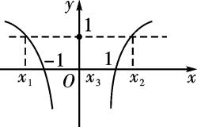

14．已知函数*y*＝*f*(*x*)及*y*＝*g*(*x*)的图象分别如图所示，方程*f*(*g*(*x*))＝0和*g*(*f*(*x*))＝0的实根个数分别为*a*和*b*，

则*ab*＝(　　)

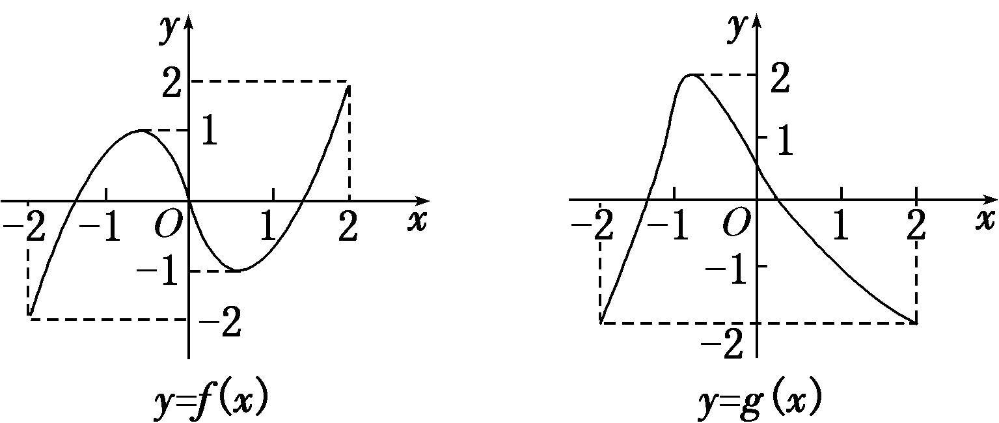

A．24　　　　　　　　B．15　　　　　　　　C．6　　　　　　　　D．4

14．答案　A　解析　由图象知，*f*(*x*)＝0有3个根，分别为0，±*m*(*m*>0)，其中1<*m*<2，*g*(*x*)＝0有2个根

*n*，*p*，－2<*n*<－1，0<*p*<1，由*f*(*g*(*x*))＝0，得*g*(*x*)＝0或±*m*，由图象可知当*g*(*x*)所对应的值为0，±*m*时，其都有2个根，因而*a*＝6；由*g*(*f*(*x*))＝0，知*f*(*x*)＝*n*或*p*，由图象可以看出当*f*(*x*)＝*n*时，有1个根，而当*f*(*x*)＝*p*时，有3个根，即*b*＝1＋3＝4．所以*ab*＝24．

