# 专题十 函数的图象

# 一、基础知识

# 1. 做草图需要注意的信息点

做草图的原则是：速度快且能提供所需要的信息，通过草图能够显示出函数的性质。在作图中草图框架的核心要素是函数的单调性，对于一个陌生的可导函数，可通过对导函数的符号分析得到单调区间，图像形状依赖于函数的凹凸性，可由二阶导数的符号决定(详见“知识点讲解与分析”的第3点)，这两部分确定下来，则函数大致轮廓可定，但为了方便数形结合，让图像更好体现函数的性质，有一些信息点也要在图像中通过计算体现出来，下面以常见函数为例，来说明作图时常体现的几个信息点。

(1)一次函数： $y = kx + b$ ，若直线不与坐标轴平行，通常可利用直线与坐标轴的交点来确定直线.

特点：两点确定一条直线.

信息点：与坐标轴的交点.

(2)二次函数: $y = a(x - h)^2 + k$ ，其特点在于存在对称轴，故作图时只需做出对称轴一侧的图像，另一侧由对称性可得。函数先减再增，存在极值点——顶点，若与坐标轴相交，则标出交点坐标可使图像更为精确。

特点：对称性.

信息点：对称轴，极值点，坐标轴交点.

(3)反比例函数： $y=\frac{1}{x}$ ，其定义域为 $(-∞,0)∪(0,+∞)$ ，是奇函数，只需做出正版轴图像即可(负半轴依靠对称做出)，坐标轴为函数的渐近线.

特点：奇函数（图像关于原点中心对称），渐近线.

信息点：渐近线.

注：

(1)所谓渐近线：是指若曲线无限接近一条直线但不相交，则称这条直线为渐近线．渐近线在作图中的作用体现为对曲线变化给予了一些限制，例如在反比例函数中，x轴是渐近线，那么当 $x\to+\infty$ ，曲线无限向x轴接近，但不相交，则函数在x正半轴就不会有x轴下方的部分.

(2)水平渐近线的判定：需要对函数值进行估计：若 $x \to +\infty$ （或 $-\infty$ ）时， $f(x) \to \text{常数 } C$ ，则称直线 $y = C$ 为函数 $f(x)$ 的水平渐近线.

例如： $y=2^{x}$ ，当 $x\to+\infty$ 时， $y\to+\infty$ ，故在 x 轴正方向不存在渐近线。当 $x\to-\infty$ 时， $y\to0$ ，故在 x 轴负方向存在渐近线 y=0。

(3)竖直渐近线的判定: 首先 $f(x)$ 在 x=a 处无定义, 且当 $x \to a$ 时, $f(x) \to +\infty$ (或 $-\infty$ ), 那么称 x=a 为 $f(x)$ 的竖直渐近线

例如： $y=\log_{2}x$ 在 x=0 处无定义，当 $x\to0$ 时， $f(x)\to-\infty$ ，所以 x=0 为 $y=\log_{2}x$ 的一条渐近线.

综上所述：在作图时以下信息点值得通过计算后体现在图像中：与坐标轴的交点；对称轴与对称中心；极值点；渐近线.

例：作出函数 $f(x)=x-\frac{1}{x}$ 的图像.

分析：定义域为 $(- \infty, 0) \cup (0, +\infty)$ ，且 $f(x)$ 为奇函数，故先考虑 $x$ 正半轴情况.

$f'(x)=1+\frac{1}{x^{2}}>0$ 故函数单调递增， $f''(x)=-\frac{2}{x^{3}}<0$ ，故函数为上凸函数，当 $x\to+\infty$ 时， $f(x)\to+\infty$ 无水平渐近线， $x\to0$ 时， $f(x)\to-\infty$ ，所以 y 轴为 $f(x)$ 的竖直渐近线。零点： $(1,0)$ ，由这些信息可做出正半轴的草图，在根据对称性得到 $f(x)$ 完整图像：

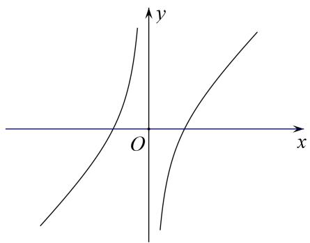

text_image

y
O
x

# 2. 函数图象变换

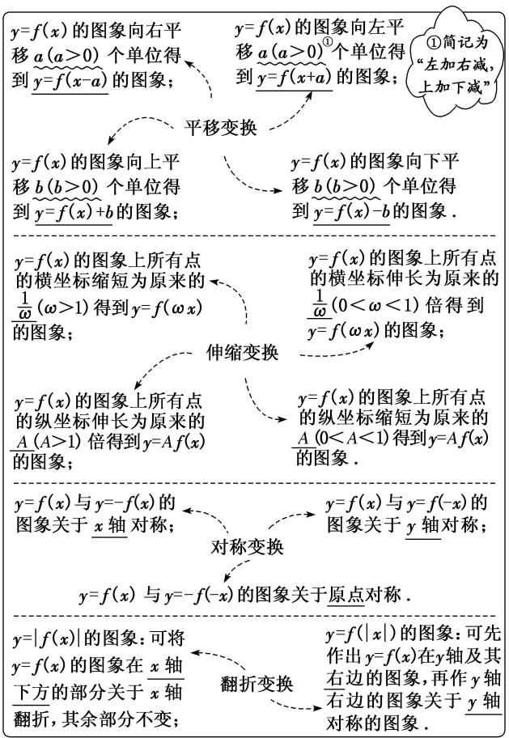

flowchart

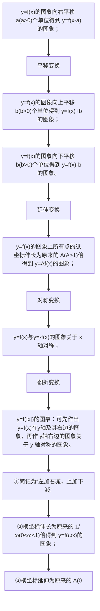

# 3. 二阶导函数与函数的凹凸性:

(1) 下凸函数(如图 1)与上凸函数(如图 2)

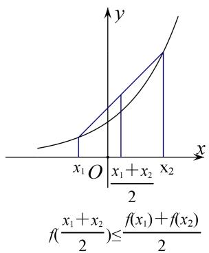

text_image

x
O
x₁ + x₂
2
x₂
y
f(x₁ + x₂) ≤ f(x₁) + f(x₂)
2

图1

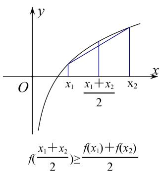

text_image

y
x
O
x₁
x₁+x₂
2
x₂
f(x₁+x₂)≥f(x₁)+f(x₂)
2

图2

(2)上凸函数特点：增区间增长速度越来越慢，减区间下降速度越来越快

下凸函数特点：增区间增长速度越来越快，减区间下降速度越来越慢

(3)与导数的关系：设 $f'(x)$ 的导函数为 $f''(x)$ （即 $f(x)$ 的二阶导函数），如图所示：增长速度受每一点切线斜率的变化情况的影响，下凸函数斜率随 $x$ 的增大而增大，即 $f'(x)$ 为增函数 $\Rightarrow f''(x) \geq 0$ ；上凸函数随 $x$ 的增大而减小，即 $f'(x)$ 为减函数 $\Rightarrow f''(x) \leq 0$ ；

综上所述：函数是上凸下凸可由导函数的增减性决定，进而能用二阶导函数的符号进行求解.

# 二、方法与技巧：

1. 在处理有关判断正确图像的选择题中，常用的方法是排除法，通过寻找四个选项的不同，再结合函数的性质即可进行排除，常见的区分要素如下：

(1)单调性：导函数的符号决定原函数的单调性，导函数图像位于 $x$ 轴上方的区域表示原函数的单调增区间，位于 $x$ 轴下方的区域表示原函数的单调减区间.

(2)函数零点周围的函数值符号：可通过带入零点附近的特殊点来进行区分.

(3)极值点

(4)对称性（奇偶性）——易于判断，进而优先观察.

(5)函数的凹凸性: 导函数的单调性决定原函数的凹凸性, 导函数增区间即为函数的下凸部分, 减区间为函数的上凸部分. 其单调性可由二阶导函数确定.

2. 利用图像变换作图的步骤

(1)寻找到模板函数 $f(x)$ (以此函数作为基础进行图像变换).

(2)找到所求函数与 $f(x)$ 的联系.

(3)根据联系制定变换策略，对图像进行变换.

例如：作图： $y=\left|\ln(x+1)\right|$

第一步寻找模板函数为： $f(x)=\ln x$ ;

第二步寻找联系：可得 $y=\left|f(x+1)\right|$ ;

第三步制定策略：由 $\left|f(x+1)\right|$ 特点可得：先将 $f(x)$ 图像向左平移一个单位，再将x轴下方图像向上进行翻折，然后按照方案作图即可.

3. 如何制定图象变换的策略

(1)在寻找到联系后可根据函数的形式了解变换所需要的步骤，其规律如下：

①若变换发生在“括号”内部，则属于横坐标的变换；

②若变换发生在“括号”外部，则属于纵坐标的变换.

例如： $y = f(3x + 1)$ ：可判断出属于横坐标的变换：有放缩与平移两个步骤.

$y=f(-x)+2$ ：可判断出横纵坐标均需变换，其中横坐标的为对称变换，纵坐标的为平移变换.

(2)多个步骤的顺序问题：在判断了需要几步变换以及属于横坐标还是纵坐标的变换后，在安排顺序时注意以下原则：

①横坐标的变换与纵坐标的变换互不影响，无先后要求；

②横坐标的多次变换中，每次变换只有 x 发生相应变化.

例如： $y = f(x) \rightarrow y = f(2x + 1)$ 可有两种方案

方案一：先平移（向左平移1个单位），此时 $f(x) \rightarrow f(x + 1)$ 。再放缩（横坐标变为原来的 $\frac{1}{2}$ ），此时系数2只是添给x，即 $f(x + 1) \rightarrow f(2x + 1)$ 。

方案二：先放缩（横坐标变为原来的 $\frac{1}{2}$ ），此时 $f(x) \to f(2x)$ ，再平移时，若平移 $a$ 个单位，则 $f(2x) \to f(2(x + a)) = f(2x + 2a)$ (只对 $x$ 加 $a$ )，可解得 $a = \frac{1}{2}$ ，故向左平移 $\frac{1}{2}$ 个单位.

③纵坐标的多次变换中，每次变换将解析式看做一个整体进行.

例如： $y = f(x) \rightarrow y = 2f(x) + 1$ 有两种方案

方案一：先放缩： $y = f(x) \to y = 2f(x)$ ，再平移时，将解析式看做一个整体，整体加1，即 $y = 2f(x) \to y = (2f(x)) + 1$ .

方案二：先平移： $y = f(x) \rightarrow y = f(x) + 1$ ，则再放缩时，若纵坐标变为原来的 $a$ 倍，那么 $y = f(x) + 1 \rightarrow y = a(f(x) + 1)$ ，无论 $a$ 取何值，也无法达到 $y = 2f(x) + 1$ ，所以需要对前一步进行调整：平移 $\frac{1}{2}$ 个单位，再进行放缩即可 $(a = 2)$ .

# 4. 变换作图的技巧

(1)图像变换时可抓住对称轴, 零点, 渐近线. 在某一方向上他们会随着平移而进行相同方向的移动. 先把握住这些关键要素的位置, 有助于提高图像的精确性.

(2)图像变换后要将一些关键点标出：如边界点，新的零点与极值点，与 y 轴的交点等.

# 三、常用结论

# 1. 函数图象自身的轴对称

(1) $f(-x)=f(x)\Leftrightarrow$ 函数 $y=f(x)$ 的图象关于y轴对称;  
(2)函数 $y=f(x)$ 的图象关于 x=a 对称 $\Leftrightarrow f(a+x)=f(a-x)\Leftrightarrow f(x)=f(2a-x)\Leftrightarrow f(-x)=f(2a+x)$ ;  
(3)若函数 $y=f(x)$ 的定义域为 R，且有 $f(a+x)=f(b-x)$ ，则函数 $y=f(x)$ 的图象关于直线 $x=\frac{a+b}{2}$ 对称.

# 2. 函数图象自身的中心对称

(1) $f(-x)=-f(x)\Leftrightarrow$ 函数 $y=f(x)$ 的图象关于原点对称;  
(2)函数 $y = f(x)$ 的图象关于(a, 0)对称 $\Leftrightarrow f(a + x) = -f(a - x) \Leftrightarrow f(x) = -f(2a - x) \Leftrightarrow f(-x) = -f(2a + x)$ ;  
(3)函数 $y=f(x)$ 的图象关于点 $(a, b)$ 成中心对称 $\Leftrightarrow f(a+x)=2b-f(a-x)\Leftrightarrow f(x)=2b-f(2a-x)$ .

# 3. 两个函数图象之间的对称关系

(1)函数 $y=f(a+x)$ 与 $y=f(b-x)$ 的图象关于直线 $x=\frac{b-a}{2}$ 对称(由 $a+x=b-x$ 得对称轴方程);  
(2)函数 $y=f(x)$ 与 $y=f(2a-x)$ 的图象关于直线 x=a 对称；  
(3)函数 $y=f(x)$ 与 $y=2b-f(-x)$ 的图象关于点 $(0, b)$ 对称；  
(4)函数 $y=f(x)$ 与 $y=2b-f(2a-x)$ 的图象关于点 $(a, b)$ 对称.

# 考点一 作函数的图象

# 【方法总结】

# 函数图象的作法

(1)直接法: 当函数表达式是基本函数或函数图象是解析几何中熟悉的曲线(如圆、椭圆、双曲线、抛物线的一部分)时, 就可根据这些函数或曲线的特征直接作出.  
(2)转化法：含有绝对值符号的函数，可去掉绝对值符号，转化为分段函数来画图象.   
(3)图象变换法：若函数图象可由某个基本函数的图象经过平移、翻折、对称变换得到，可利用图象变换作出，但要注意变换顺序。对不能直接找到熟悉的基本函数的要先变形，并应注意平移变换的顺序对变

换单位及解析式的影响.

# 【例题选讲】

[例 1] 作出下列函数的图象

(1) $y = |x - 2| \cdot (x + 1)$ ; (2) $y = \frac{2x - 1}{x - 1}$ ; (3) $y = x^2 - 2|x| - 1$ ; (4) $y = (\frac{1}{2})^{|x|}$ ; (5) $y = |\log_2(x + 1)|$ .

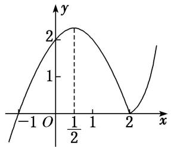

line

| x | y |
|---|---|
| -1 | 0 |
| 0 | 2 |
| 1/2 | 2 |
| 2 | 0 |

# 考点二 函数图象的识别

# 【方法总结】

# 识别函数图象的方法

(1)直接根据函数解析式作出函数图象，或者是根据图象变换作出函数的图象.  
(2)间接法筛选错误与正确的选项可从如下几个方面入手:

①从函数的定义域判断图象的左右位置，从函数的值域判断图象的上下位置；  
②从函数的单调性判断图象的上升、下降趋势；  
③从函数的奇偶性判断图象的对称性；  
④从函数的周期性判断图象的循环往复；  
⑤从特殊点出发排除不符合要求的选项.  
(3)求解因动点变化而形成的函数图象问题，既可以根据题意求出函数解析式后判断图象，也可以将动点处于某特殊位置时考查图象的变化特征后作出选择.

注意：应用极限思想来处理，达到巧解妙算的效果，使解题过程费时少，准确率高.

# 【例题选讲】

[例 2] (1) (2018·全国II) 函数 $f(x)=\frac{e^{x}-e^{-x}}{x^{2}}$ 的图象大致为()

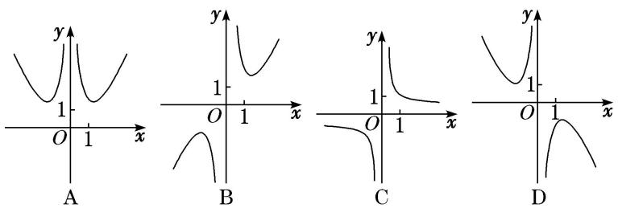

(2) (2018·浙江) 函数 $y=2^{|x|}\sin 2x$ 的图象可能是()

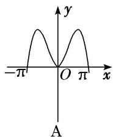

text_image

-π
O
π
x
y
A

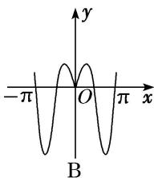

text_image

-π
O
B
π
x
y

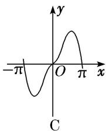

text_image

-π
O
π
x
y
C

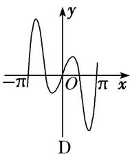

text_image

-π
O
π
x
y
D

(3) 已知定义在区间 $[0, 4]$ 上的函数 $y = f(x)$ 的图象如图所示，则 $y = -f(2 - x)$ 的图象为（）

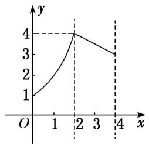

line

| x | y |
|---|---|
| 0 | 1 |
| 1 | 2 |
| 2 | 4 |
| 3 | 3 |
| 4 | 2 |

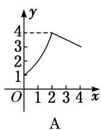

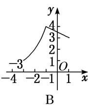

line

| x | y |
|---|---|
| -4 | -3 |
| -2 | 1 |
| -1 | 4 |
| 1 | 3 |
The chart displays a single curve with no explicit title or axis labels. The x-axis ranges from -4 to 1 and the y-axis ranges from -3 to 4. The label 'B' appears below the graph.

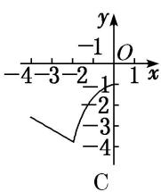

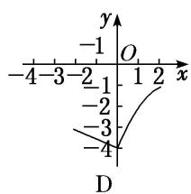

line

| x | y |
|---|---|
| -4 | -1 |
| -3 | -2 |
| -2 | -1 |
| -1 | 0 |
| 0 | 1 |
| 1 | 2 |
| 2 | 3 |
| 3 | 4 |
| 4 | -4 |
D

(4) 已知函数 $f(x)$ 的图象如图所示，则 $f(x)$ 的解析式可以是()

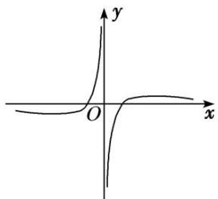

text_image

y
O
x

A. $f(x)=\frac{\ln|x|}{x}$

B. $f(x)=\frac{e^{x}}{x}$

C. $f(x) = \frac{1}{x^2} - 1$

D. $f(x)=x-\frac{1}{x}$

(5) 如图, 有四个平面图形分别是三角形、平行四边形、直角梯形、圆. 垂直于 $x$ 轴的直线 $l: x = t (0 \leq t \leq a)$ 经过原点 $O$ 向右平行移动, $l$ 在移动过程中扫过平面图形的面积为 $y$ (图中阴影部分), 若函数 $y = f(x)$ 的大致图象如右图所示, 那么平面图形的形状不可能是( )

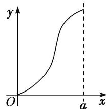

text_image

y
O
a x

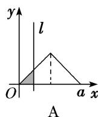

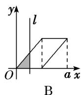

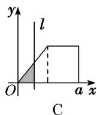

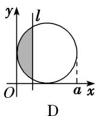

# 【对点训练】

1. (2019·全国III)函数 $y = \frac{2x^3}{2^x + 2^{-x}}$ 在 $[-6, 6]$ 的图象大致为( )

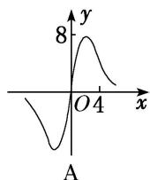

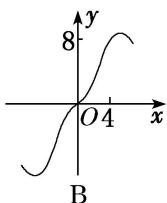

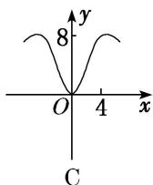

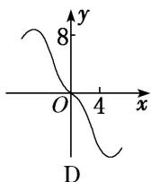

2. (2018·全国III)函数 $y = -x^{4} + x^{2} + 2$ 的图象大致为()

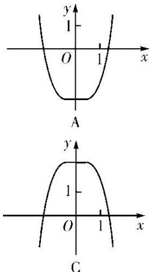

text_image

y
1
O 1 x
A
y
1
O 1 x
C

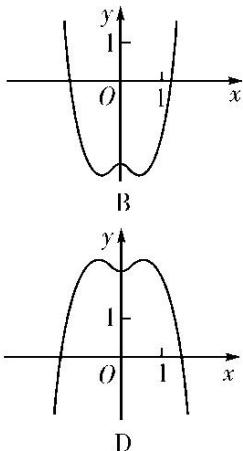

text_image

y
1
O
1
x
B
y
1
O
1
x
D

3. 函数 $y=\frac{x^{2}}{8}-\ln|x|$ 的图象大致为()

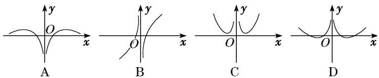

4. 函数 $y=(x^{3}-x)2^{|x|}$ 的图象大致是()

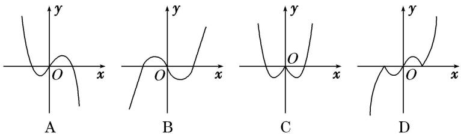

5. 函数 $y = \frac{\sin x}{x}$ , $x \in (-\pi, 0) \cup (0, \pi)$ 的图象大致是( )

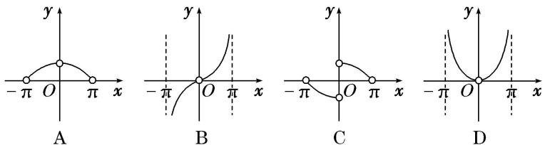

6. 函数 $f(x) = \ln \left( x - \frac{1}{x} \right)$ 的图象是（）

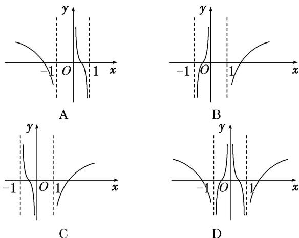

7. 函数 $f(x) = \frac{\sin 3x}{3^x - 3^-x}$ 的图象大致为( )

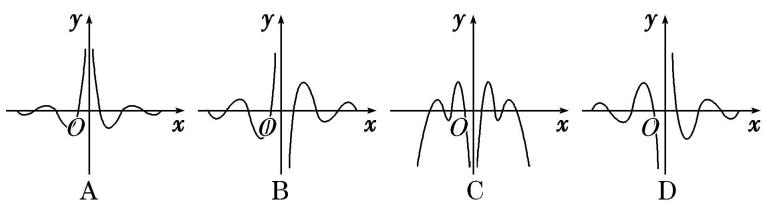

8. 函数 $f(x) = \left( x - \frac{1}{x} \right) \sin x$ 的图象大致是（）

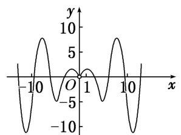

line

| x    | y     |
| ---- | ----- |
| -10  | -10   |
| 0    | 0     |
| 10   | -10   |

A

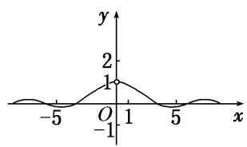

line

| x | y |
|---|---|
| -5 | 0 |
| 0 | 1 |
| 1 | 0 |
| 5 | 0 |

B

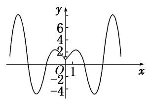

line

| x    | y    |
| ---- | ---- |
| -6   | 6    |
| -4   | 0    |
| -2   | -6   |
| 0    | 0    |
| 2    | 6    |
| 4    | 0    |
| 6    | -6   |

C

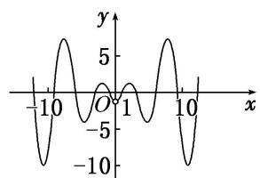

line

| x  | y  |
|----|----|
| -10| -10|
| 0  | 0  |
| 10 | 5  |

D

9. 已知函数 $f(x) = -x^2 + 2$ ， $g(x) = \log_2 |x|$ ，则函数 $F(x) = f(x) \cdot g(x)$ 的图象大致为（）

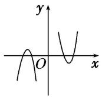  
A

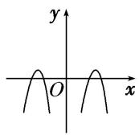  
B

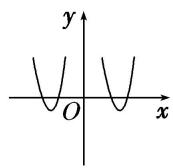  
C

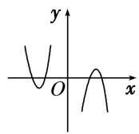  
D

10. 已知函数 $y = f(x)$ 的定义域为 $\{x \mid x \in \mathbf{R}$ ，且 $x \neq 0\}$ ，且满足 $f(x) - f(-x) = 0$ ，当 $x > 0$ 时， $f(x) = \ln x - x + 1$ ，则函数 $y = f(x)$ 的大致图象为（）

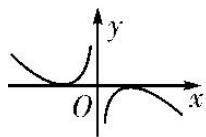  
A

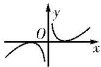  
B

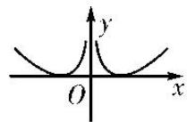  
C

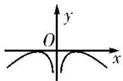  
D

11. 已知图①中的图象是函数 $y = f(x)$ 的图象，则图②中的图象对应的函数可能是( )

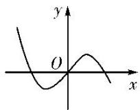  
①

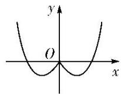  
②

A. $y=f(|x|)$

B. $y=|f(x)|$

C. $y=f(-|x|)$

D. $y = -f(-|x|)$

12. 为了得到函数 $y = \log_2\sqrt{x - 1}$ 的图象，可将函数 $y = \log_2x$ 图象上所有点的（）

A. 纵坐标缩短为原来的 $\frac{1}{2}$ , 横坐标不变, 再向右平移 1 个单位  
B. 纵坐标缩短为原来的 $\frac{1}{2}$ , 横坐标不变, 再向左平移 1 个单位  
C. 横坐标伸长为原来的 2 倍, 纵坐标不变, 再向左平移 1 个单位  
D. 横坐标伸长为原来的 2 倍, 纵坐标不变, 再向右平移 1 个单位

13. 已知函数 $f(x) = \begin{cases} x^2, & x \geq 0 \\ \frac{1}{x}, & x < 0 \end{cases}$ ， $g(x) = -f(-x)$ ，则函数 $g(x)$ 的图象是（）

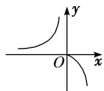  
A

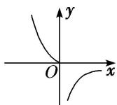  
B

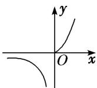  
C

  
D

14. 若函数 $y = f(x)$ 的图象如图所示，则函数 $y = -f(x + 1)$ 的图象大致为（）

text_image

y
O
1
x
y=f(x)

text_image

y
O 1 x
A

text_image

-2
-1 O
B

text_image

y
-1 O x
C

text_image

y
O 1 2 x
D

15. 如图所示的图象对应的函数解析式可能是( )

text_image

y
O
x

A. $y = 2^{x} - x^{2} - 1$

B. $y=\frac{2^{x}\sin x}{4x+1}$

C. $y=\frac{x}{\ln x}$

D. $y=(x^{2}-2x)e^{x}$

16. 函数 $f(x)$ 的大致图象如图所示，则函数 $f(x)$ 的解析式可以是()

text_image

-1
O
1
x
y

A. $f(x)=x^{2}\cdot\sin|x|$

B. $f(x)=\left(x-\frac{1}{x}\right)\cdot\cos2x$

C. $f(x)=(\mathrm{e}^{x}-\mathrm{e}^{-x})\cos\left(\frac{\pi}{2}x\right)$

D. $f(x)=\frac{x\ln|x|}{|x|}$

17. 如图, 矩形 $ABCD$ 的周长为 4 , 设 $AB = x$ , $AC = y$ , 则 $y = f(x)$ 的大致图象为 ( )

18. 如图, 不规则四边形 $ABCD$ 中, $AB$ 和 $CD$ 是线段, $AD$ 和 $BC$ 是圆弧, 直线 $l \perp AB$ 交 $AB$ 于 $E$ , 当 $l$ 从左至右移动 (与线段 $AB$ 有公共点) 时, 把四边形 $ABCD$ 分成两部分, 设 $AE = x$ , 左侧部分的面积为 $y$ , 则 $y$ 关于 $x$ 的图象大致是 ( )

text_image

l
D C
A E B

19. (2015·全国II)如图, 长方形 $ABCD$ 的边 $AB = 2$ , $BC = 1$ , $O$ 是 $AB$ 的中点, 点 $P$ 沿着边 $BC$ , $CD$ 与 $DA$ 运动, 记 $\angle BOP = x$ . 将动点 $P$ 到 $A$ , $B$ 两点距离之和表示为 $x$ 的函数 $f(x)$ , 则 $y = f(x)$ 的图象大致为 ( )

  
A

  
B

  
C

  
D

20. (2014·全国I)如图，圆 O 的半径为 1，A 是圆上的定点，P 是圆上的动点，角 x 的始边为射线 OA，终边为射线 OP，过点 P 作直线 OA 的垂线，垂足为 M．将点 M 到直线 OP 的距离表示成 x 的函数 $f(x)$ ，则 $y=f(x)$ 在 $[0, \pi]$ 的图象大致为（）

text_image

P
x
O
M
A

  
A

  
B

  
C

  
D

