**专题十　函数的图象**

**一、基础知识**

1．做草图需要注意的信息点

做草图的原则是：速度快且能提供所需要的信息，通过草图能够显示出函数的性质．在作图中草图框架的核心要素是函数的单调性，对于一个陌生的可导函数，可通过对导函数的符号分析得到单调区间，图像形状依赖于函数的凹凸性，可由二阶导数的符号决定(详见“知识点讲解与分析”的第3点)，这两部分确定下来，则函数大致轮廓可定，但为了方便数形结合，让图像更好体现函数的性质，有一些信息点也要在图像中通过计算体现出来，下面以常见函数为例，来说明作图时常体现的几个信息点．

(1)一次函数：，若直线不与坐标轴平行，通常可利用直线与坐标轴的交点来确定直线．

特点：两点确定一条直线．

信息点：与坐标轴的交点．

(2)二次函数：，其特点在于存在对称轴，故作图时只需做出对称轴一侧的图像，另一侧由对称性可得．函数先减再增，存在极值点——顶点，若与坐标轴相交，则标出交点坐标可使图像更为精确．

特点：对称性．

信息点：对称轴，极值点，坐标轴交点．

(3)反比例函数：，其定义域为，是奇函数，只需做出正版轴图像即可(负半轴依靠对称做出)，坐标轴为函数的渐近线．

特点：奇函数（图像关于原点中心对称），渐近线．

信息点：渐近线．

注：

(1)所谓渐近线：是指若曲线无限接近一条直线但不相交，则称这条直线为渐近线．渐近线在作图中的作用体现为对曲线变化给予了一些限制，例如在反比例函数中，轴是渐近线，那么当，曲线无限向轴接近，但不相交，则函数在正半轴就不会有轴下方的部分．

(2)水平渐近线的判定：需要对函数值进行估计：若（或）时，常数，则称直线为函数的水平渐近线．

例如：，当时，，故在轴正方向不存在渐近线．当时，，故在轴负方向存在渐近线．

(3)竖直渐近线的判定：首先在处无定义，且当时，（或），那么称为的竖直渐近线

例如：在处无定义，当时，，所以为的一条渐近线．

综上所述：在作图时以下信息点值得通过计算后体现在图像中：与坐标轴的交点；对称轴与对称中心；极值点；渐近线．

例：作出函数的图像．

分析：定义域为，且为奇函数，故先考虑正半轴情况．

故函数单调递增，，故函数为上凸函数，当时，无水平渐近线，时，，所以轴为的竖直渐近线。零点：，由这些信息可做出正半轴的草图，在根据对称性得到完整图像：

2．函数图象变换

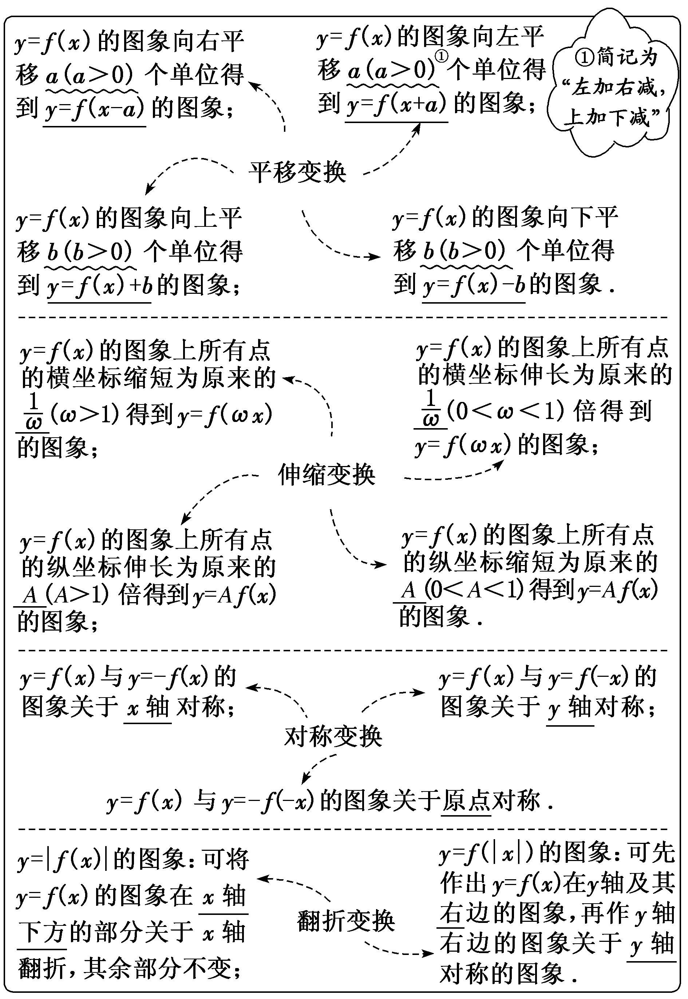

3．二阶导函数与函数的凹凸性：

(1) 下凸函数(如图1)与上凸函数(如图2)

(2)上凸函数特点：增区间增长速度越来越慢，减区间下降速度越来越快

下凸函数特点：增区间增长速度越来越快，减区间下降速度越来越慢

(3)与导数的关系：设的导函数为（即的二阶导函数），如图所示：增长速度受每一点切线斜率的变化情况的影响，下凸函数斜率随的增大而增大，即为增函数；上凸函数随的增大而减小，即为减函数；

综上所述：函数是上凸下凸可由导函数的增减性决定，进而能用二阶导函数的符号进行求解．

**二、方法与技巧：**

1．在处理有关判断正确图像的选择题中，常用的方法是排除法，通过寻找四个选项的不同，再结合函数的性质即可进行排除，常见的区分要素如下：

(1)单调性：导函数的符号决定原函数的单调性，导函数图像位于轴上方的区域表示原函数的单调增区间，位于轴下方的区域表示原函数的单调减区间．

(2)函数零点周围的函数值符号：可通过带入零点附近的特殊点来进行区分．

(3)极值点

(4)对称性（奇偶性）——易于判断，进而优先观察．

(5)函数的凹凸性：导函数的单调性决定原函数的凹凸性，导函数增区间即为函数的下凸部分，减区间为函数的上凸部分．其单调性可由二阶导函数确定．

2．利用图像变换作图的步骤

(1)寻找到模板函数(以此函数作为基础进行图像变换)．

(2)找到所求函数与的联系．

(3)根据联系制定变换策略，对图像进行变换．

例如：作图：

第一步寻找模板函数为：；

第二步寻找联系：可得；

第三步制定策略：由特点可得：先将图像向左平移一个单位，再将轴下方图像向上进行翻折，然后按照方案作图即可．

3．如何制定图象变换的策略

(1)在寻找到联系后可根据函数的形式了解变换所需要的步骤，其规律如下：

①若变换发生在“括号”内部，则属于横坐标的变换；

②若变换发生在“括号”外部，则属于纵坐标的变换．

例如：：可判断出属于横坐标的变换：有放缩与平移两个步骤．

：可判断出横纵坐标均需变换，其中横坐标的为对称变换，纵坐标的为平移变换．

(2)多个步骤的顺序问题：在判断了需要几步变换以及属于横坐标还是纵坐标的变换后，在安排顺序时注意以下原则：

①横坐标的变换与纵坐标的变换互不影响，无先后要求；

②横坐标的多次变换中，每次变换只有发生相应变化．

例如：可有两种方案

方案一：先平移（向左平移1个单位），此时．再放缩（横坐标变为原来的），此时系数2只是添给*x*，即．

方案二：先放缩（横坐标变为原来的），此时，再平移时，若平移*a*个单位，则(只对*x*加*a*)，可解得，故向左平移个单位．

③纵坐标的多次变换中，每次变换将解析式看做一个整体进行．

例如：有两种方案

方案一：先放缩：，再平移时，将解析式看做一个整体，整体加1，即

．

方案二：先平移：，则再放缩时，若纵坐标变为原来的倍，那么

，无论取何值，也无法达到，所以需要对前一步进行调整：平移个单位，再进行放缩即可()．

4．变换作图的技巧

(1)图像变换时可抓住对称轴，零点，渐近线．在某一方向上他们会随着平移而进行相同方向的移动．先把握住这些关键要素的位置，有助于提高图像的精确性．

(2)图像变换后要将一些关键点标出：如边界点，新的零点与极值点，与轴的交点等．

**三、常用结论**

1．函数图象自身的轴对称

(1)*f*(－*x*)＝*f*(*x*)⇔函数*y*＝*f*(*x*)的图象关于*y*轴对称；

(2)函数*y*＝*f*(*x*)的图象关于*x*＝*a*对称⇔*f*(*a*＋*x*)＝*f*(*a*－*x*)⇔*f*(*x*)＝*f*(2*a*－*x*)⇔*f*(－*x*)＝*f*(2*a*＋*x*)；

(3)若函数<em>y</em>＝<em>f</em>(<em>x</em>)的定义域为<strong>R</strong>，且有<em>f</em>(<em>a</em>＋<em>x</em>)＝<em>f</em>(<em>b</em>－<em>x</em>)，则函数<em>y</em>＝<em>f</em>(<em>x</em>)的图象关于直线<em>x</em>＝对称．

2．函数图象自身的中心对称

(1)*f*(－*x*)＝－*f*(*x*)⇔函数*y*＝*f*(*x*)的图象关于原点对称；

(2)函数*y*＝*f*(*x*)的图象关于(*a*，0)对称⇔*f*(*a*＋*x*)＝－*f*(*a*－*x*)⇔*f*(*x*)＝－*f*(2*a*－*x*)⇔*f*(－*x*)＝－*f*(2*a*＋*x*)；

(3)函数*y*＝*f*(*x*)的图象关于点(*a*，*b*)成中心对称⇔*f*(*a*＋*x*)＝2*b*－*f*(*a*－*x*)⇔*f*(*x*)＝2*b*－*f*(2*a*－*x*)．

3．两个函数图象之间的对称关系

(1)函数*y*＝*f*(*a*＋*x*)与*y*＝*f*(*b*－*x*)的图象关于直线*x*＝对称(由*a*＋*x*＝*b*－*x*得对称轴方程)；

(2)函数*y*＝*f*(*x*)与*y*＝*f*(2*a*－*x*)的图象关于直线*x*＝*a*对称；

(3)函数*y*＝*f*(*x*)与*y*＝2*b*－*f*(－*x*)的图象关于点(0，*b*)对称；

(4)函数*y*＝*f*(*x*)与*y*＝2*b*－*f*(2*a*－*x*)的图象关于点(*a*，*b*)对称．

**考点一　作函数的图象**

【**方法总结**】

函数图象的作法

(1)直接法：当函数表达式是基本函数或函数图象是解析几何中熟悉的曲线(如圆、椭圆、双曲线、抛物线的一部分)时，就可根据这些函数或曲线的特征直接作出．

(2)转化法：含有绝对值符号的函数，可去掉绝对值符号，转化为分段函数来画图象．

(3)图象变换法：若函数图象可由某个基本函数的图象经过平移、翻折、对称变换得到，可利用图象变换作出，但要注意变换顺序．对不能直接找到熟悉的基本函数的要先变形，并应注意平移变换的顺序对变换单位及解析式的影响．

**【例题选讲】**

**[例1]** 作出下列函数的图象

(1) <em>y</em>＝|<em>x</em>－2|·(<em>x</em>＋1)；(2) <em>y</em>＝；(3) <em>y</em>＝<em>x</em>2－2|<em>x</em>|－1；(4) <em>y</em>＝；(5) <em>y</em>＝|log2(<em>x</em>＋1)|．

[解析](1) 当<em>x</em>≥2，即<em>x</em>－2≥0时，<em>y</em>＝(<em>x</em>－2)(<em>x</em>＋1)＝<em>x</em>2－<em>x</em>－2＝2－；当<em>x</em>&lt;2，即<em>x</em>－2&lt;0时，<em>y</em>＝－(<em>x</em>－2)(<em>x</em>＋1)＝－<em>x</em>2＋<em>x</em>＋2＝－2＋．所以<em>y</em>＝

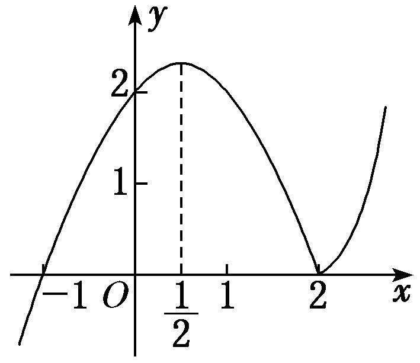

这是分段函数，每段函数的图象可根据二次函数图象作出(其图象如图所示)．

(2) 因为*y*＝＝2＋，故函数图象可由*y*＝的图象向右平移1个单位，再向上平移2个单位得到，如图．

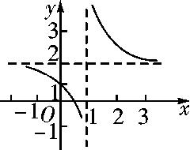

(3) 因为<em>y</em>＝且函数为偶函数，先用描点法作出[0，＋∞)上的图象，再根据对称性作出(－∞，0)上的图象，即得函数<em>y</em>＝<em>x</em>2－2|<em>x</em>|－1的图象，如图．

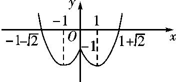

(4) 作出*y*＝的图象，保留*y*＝图象中*x*≥0的部分，加上*y*＝的图象中*x*>0部分关于*y*轴的对称部分，即得*y*＝的图象，如图中实线部分．

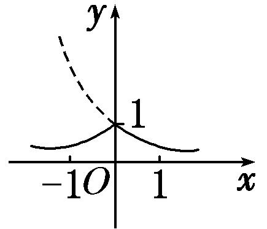

(5) 将函数<em>y</em>＝log2<em>x</em>的图象向左平移1个单位，再将<em>x</em>轴下方的部分沿<em>x</em>轴翻折上去，即可得到函数<em>y</em>＝|log2(<em>x</em>＋1)|的图象，如图中实线部分．

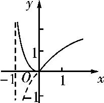

**考点二　函数图象的识别**

【**方法总结**】

识别函数图象的方法

(1)直接根据函数解析式作出函数图象，或者是根据图象变换作出函数的图象．

(2)间接法筛选错误与正确的选项可从如下几个方面入手：

①从函数的定义域判断图象的左右位置，从函数的值域判断图象的上下位置；

②从函数的单调性判断图象的上升、下降趋势；

③从函数的奇偶性判断图象的对称性；

④从函数的周期性判断图象的循环往复；

⑤从特殊点出发排除不符合要求的选项．

(3)求解因动点变化而形成的函数图象问题，既可以根据题意求出函数解析式后判断图象，也可以将动点处于某特殊位置时考查图象的变化特征后作出选择．

注意：应用极限思想来处理，达到巧解妙算的效果，使解题过程费时少，准确率高．

**【例题选讲】**

<strong>[例2]</strong> (1) (2018·全国Ⅱ)函数<em>f</em>(<em>x</em>)＝的图象大致为(　　)

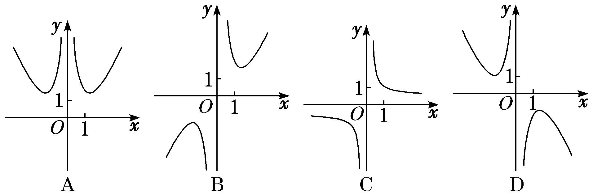

答案　B　解析　∵<em>y</em>＝e<em>x</em>－e－<em>x</em>是奇函数，<em>y</em>＝<em>x</em>2是偶函数，∴<em>f</em>(<em>x</em>)＝是奇函数，图象关于原点对称，排除A选项；当<em>x</em>＝1时，<em>f</em>(1)＝e－&gt;0，排除D选项；又e&gt;2，∴&lt;，∴e－&gt;1，排除C选项．故选B．

(2) (2018·浙江)函数<em>y</em>＝2|<em>x</em>|sin 2<em>x</em>的图象可能是(　　)

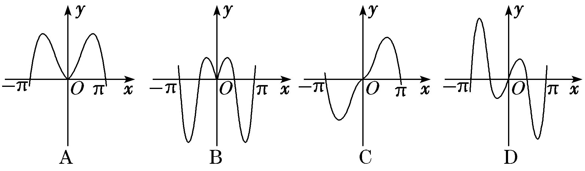

答案　D　解析　由<em>y</em>＝2|<em>x</em>|sin 2<em>x</em>知函数的定义域为<strong>R</strong>，令<em>f</em>(<em>x</em>)＝2|<em>x</em>|sin 2<em>x</em>，则<em>f</em>(－<em>x</em>)＝2|－<em>x</em>|sin(－2<em>x</em>)＝－2|<em>x</em>|sin2<em>x</em>．∵<em>f</em>(<em>x</em>)＝－<em>f</em>(－<em>x</em>)，∴<em>f</em>(<em>x</em>)为奇函数．∴<em>f</em>(<em>x</em>)的图象关于原点对称，故排除A、B．令<em>f</em>(<em>x</em>)＝2|<em>x</em>|sin 2<em>x</em>＝0，解得<em>x</em>＝(<em>k</em>∈Z)，∴当<em>k</em>＝1时，<em>x</em>＝，故排除C，选D．

(3) 已知定义在区间[0，4]上的函数*y*＝*f*(*x*)的图象如图所示，则*y*＝－*f*(2－*x*)的图象为(　　)

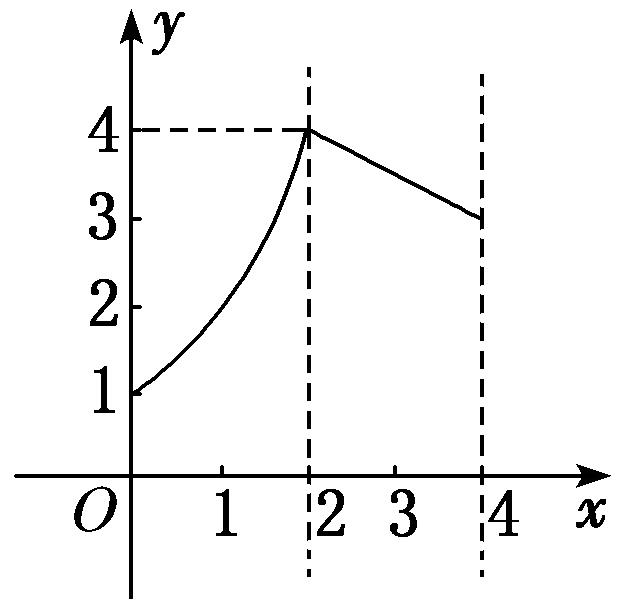

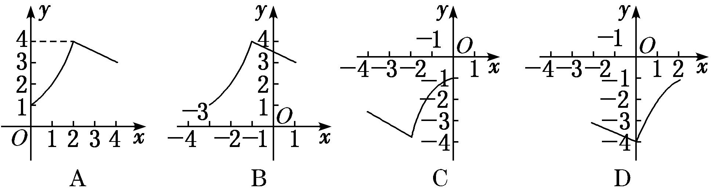

答案　D　解析　法一：先作出函数*y*＝*f*(*x*)的图象关于*y*轴的对称图象，得到*y*＝*f*(－*x*)的图象；然后将*y*＝*f*(－*x*)的图象向右平移2个单位，得到*y*＝*f*(2－*x*)的图象；再作*y*＝*f*(2－*x*)的图象关于*x*轴的对称图象，得到*y*＝－*f*(2－*x*)的图象．故选D．

法二：先作出函数*y*＝*f*(*x*)的图象关于原点的对称图象，得到*y*＝－*f*(－*x*)的图象；然后将*y*＝－*f*(－*x*)的图象向右平移2个单位，得到*y*＝－*f*(2－*x*)的图象．故选D．

(4) 已知函数*f*(*x*)的图象如图所示，则*f*(*x*)的解析式可以是(　　)

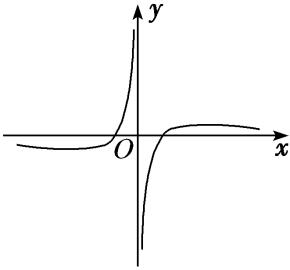

A．*f*(*x*)＝　　　　B．*f*(*x*)＝　　　　C．*f*(*x*)＝－1　　　　D．*f*(*x*)＝*x*－

答案　A　解析　由函数图象可知，函数*f*(*x*)为奇函数，应排除B、C．若函数为*f*(*x*)＝*x*－，则*x*→＋∞时，*f*(*x*)→＋∞，排除D．

(5) 如图，有四个平面图形分别是三角形、平行四边形、直角梯形、圆．垂直于*x*轴的直线*l*：*x*＝*t*(0≤*t*≤*a*)经过原点*O*向右平行移动，*l*在移动过程中扫过平面图形的面积为*y*(图中阴影部分)，若函数*y*＝*f*(*x*)的大致图象如右图所示，那么平面图形的形状不可能是(　　)

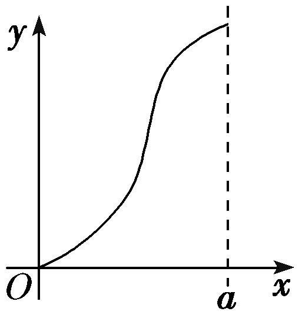

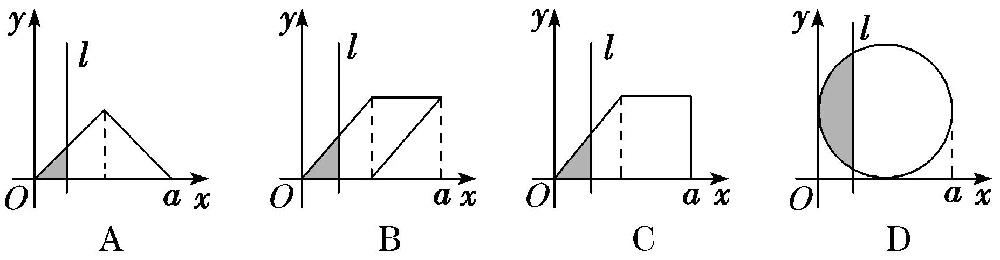

答案　C　解析　由*y*＝*f*(*x*)的图象可知面积递增的速度先快后慢，对于选项C，后半程是匀速递增，所以平面图形的形状不可能是C．故选C．

【**对点训练**】

1．(2019·全国Ⅲ)函数*y*＝在[－6，6]的图象大致为(　　)

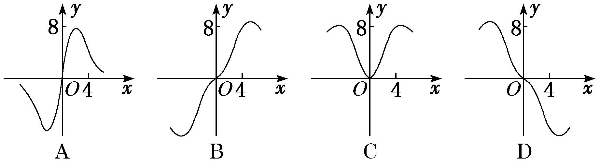

1．答案　B　解析　∵ *y*＝*f*(*x*)＝，*x*∈[－6，6]，∴ *f*(－*x*)＝＝－＝－*f*(*x*)，∴ *f*(*x*)

是奇函数，排除选项C．当*x*＝4时，*y*＝＝∈(7，8)，排除选项A、D．故选B．

2．(2018·全国Ⅲ)函数<em>y</em>＝－<em>x</em>4＋<em>x</em>2＋2的图象大致为(　　)

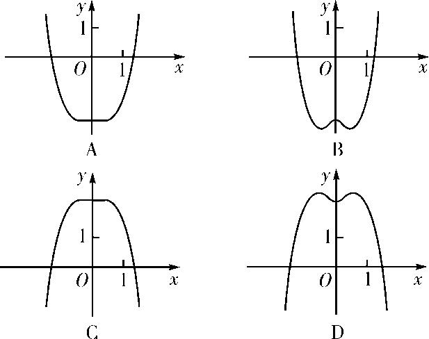

2．答案　D　解析　当*x*＝0时，*y*＝2，所以排除A，B项；当*x*＝时，*y*＝－＋＋2＝>2，所以排除

C项．故选D．

3．函数*y*＝－ln|*x*|的图象大致为(　　)

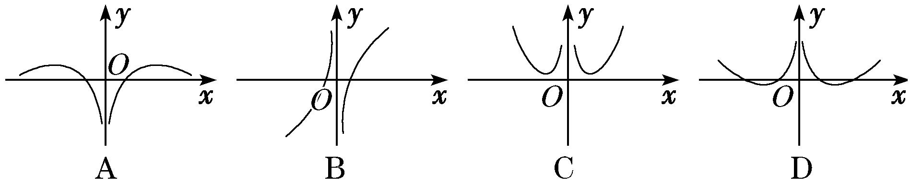

3．答案　D　解析　令*f*(*x*)＝*y*＝－ln|*x*|，则*f*(－*x*)＝*f*(*x*)，故函数为偶函数，排除选项B；当*x*>0且*x*→0

时，*y*→＋∞，排除选项A；当*x*＝2时，*y*＝1－ln(2)<1－ln e＝0，排除选项C．故选D．

4．函数<em>y</em>＝(<em>x</em>3－<em>x</em>)2|<em>x</em>|的图象大致是(　　)

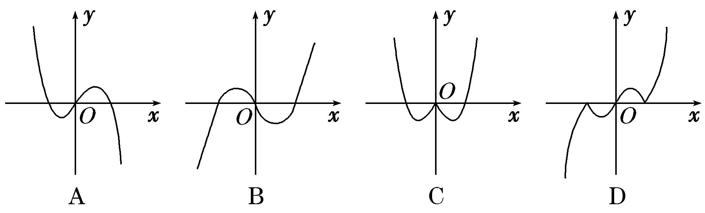

4．答案　B　解析　易判断函数为奇函数，由*y*＝0得*x*＝±1或*x*＝0.且当0<*x*<1时，*y*<0；当*x*>1时，*y*>

0，故选B.

5．函数*y*＝，*x*∈(－π，0)∪(0，π)的图象大致是(　　)

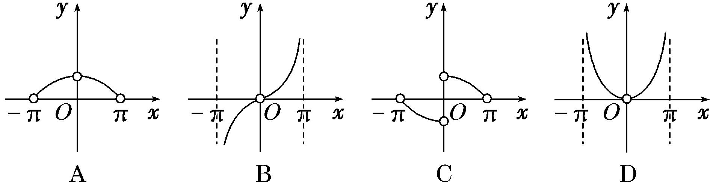

5．答案　A　解析　函数*y*＝，*x*∈(－π，0)∪(0，π)为偶函数，所以图象关于*y*轴对称，排除B，C，

又当*x*→π时，*y*＝→0，故选A．

6．函数*f*(*x*)＝ln的图象是(　　)

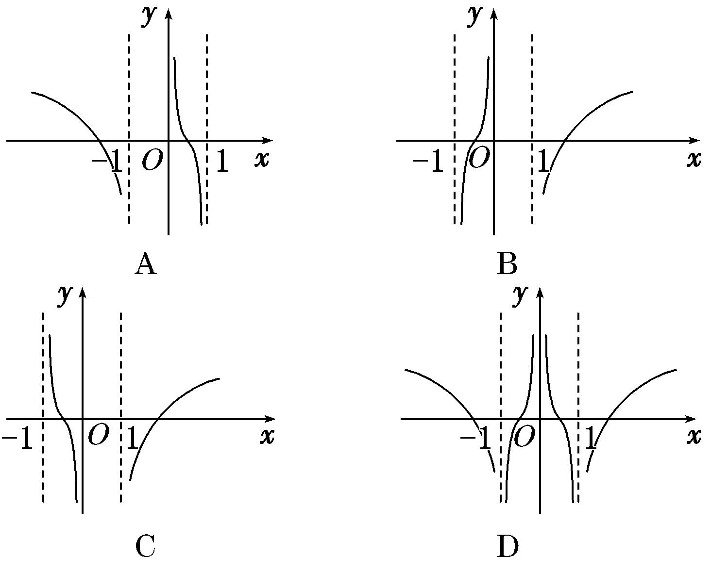

6．答案　B　解析　自变量*x*满足*x*－＝>0，当*x*>0时，可得*x*>1，当*x*<0时，可得－1<*x*<0，即函

数*f*(*x*)的定义域是(－1,0)∪(1，＋∞)，据此排除选项A、D.函数*y*＝*x*－单调递增，故函数*f*(*x*)＝ln在(－1,0)，(1，＋∞)上单调递增，故选B．

7．函数*f*(*x*)＝的图象大致为(　　)

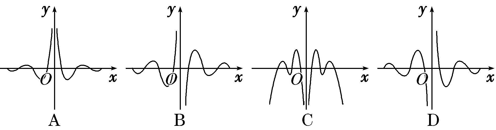

7．答案　A　解析　*f*(－*x*)＝＝*f*(*x*)，故函数*f*(*x*)为偶函数，即函数的图象关于*y*轴对称，排除B、

D；当<em>x</em>&gt;0且趋于原点时，<em>f</em>(<em>x</em>)&gt;0，又当<em>x</em>&gt;0且趋于无限大时，3<em>x</em>＋趋于无穷大，sin 3<em>x</em>∈[－1，1]，则|<em>f</em>(<em>x</em>)|趋于0．故选A．

8．函数*f*(*x*)＝sin *x*的图象大致是(　　)

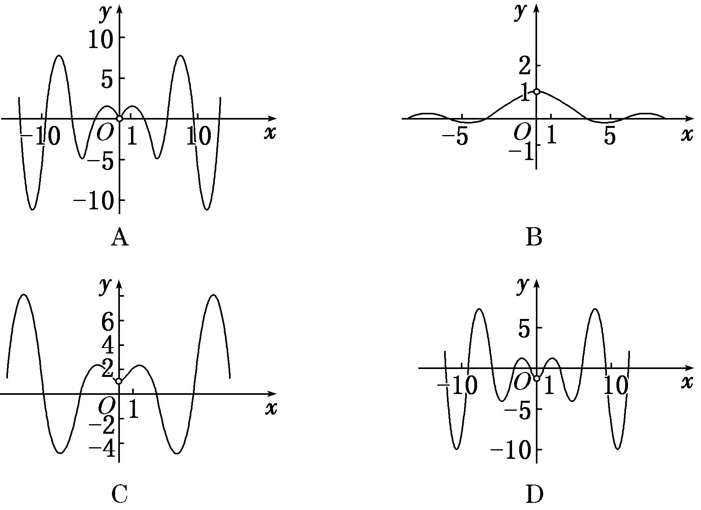

8．答案　D　解析　令<em>f</em>(<em>x</em>)＝0可得<em>x</em>＝±1，或<em>x</em>＝<em>k</em>π(<em>k</em>≠0，<em>k</em>∈<strong>Z</strong>)，又<em>f</em>(－<em>x</em>)＝sin(－<em>x</em>)＝sin

*x*＝*f*(*x*)，即函数*f*(*x*)＝sin *x*是偶函数，且经过点(1，0)，(π，0)，(2π，0)，(3π，0)，…，故选D．

9．已知函数<em>f</em>(<em>x</em>)＝－<em>x</em>2＋2，<em>g</em>(<em>x</em>)＝log2|<em>x</em>|，则函数<em>F</em>(<em>x</em>)＝<em>f</em>(<em>x</em>)·<em>g</em>(<em>x</em>)的图象大致为(　　)

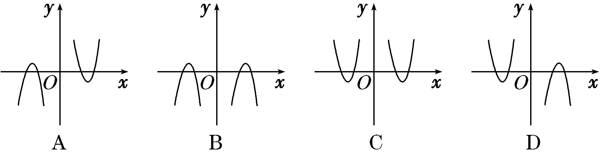

9．答案　B　解析　<em>f</em>(<em>x</em>)，<em>g</em>(<em>x</em>)均为偶函数，则<em>F</em>(<em>x</em>)也为偶函数，由此排除A，D．当<em>x</em>&gt;2时，－ <em>x</em>2＋2&lt;0，

log2|<em>x</em>|&gt;0，所以<em>F</em>(<em>x</em>)&lt;0，排除C，故选B．

10．已知函数<em>y</em>＝<em>f</em>(<em>x</em>)的定义域为{<em>x</em>|<em>x</em>∈<strong>R</strong>，且<em>x</em>≠0}，且满足<em>f</em>(<em>x</em>)－<em>f</em>(－<em>x</em>)＝0，当<em>x</em>＞0时，<em>f</em>(<em>x</em>)＝ln <em>x</em>－<em>x</em>＋1，

则函数*y*＝*f*(*x*)的大致图象为(　　)

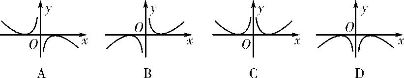

10．答案　D　解析　由*f*(*x*)－*f*(－*x*)＝0得函数*f*(*x*)为偶函数，排除A，B项；又当*x*>0时，*f*(*x*)＝ln *x*－*x*

＋1，所以*f*(1)＝0，*f*(e)＝2－e<0．故选D．

11．已知图①中的图象是函数*y*＝*f*(*x*)的图象，则图②中的图象对应的函数可能是(　　)

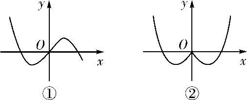

A．*y*＝*f*(|*x*|)　　　　　B．*y*＝|*f*(*x*)|　　　　　C．*y*＝*f*(－|*x*|)　　　　　D．*y*＝－*f*(－|*x*|)

11．答案　C　解析　图②中的图象是在图①的基础上，去掉函数*y*＝*f*(*x*)的图象在*y*轴右侧的部分，然后

将*y*轴左侧图象翻折到*y*轴右侧，*y*轴左侧图象不变得来的，所以图②中的图象对应的函数可能是*y*＝*f*(－|*x*|)．故选C．

12．为了得到函数<em>y</em>＝log2的图象，可将函数<em>y</em>＝log2<em>x</em>图象上所有点的(　　)

A．纵坐标缩短为原来的，横坐标不变，再向右平移1个单位

B．纵坐标缩短为原来的，横坐标不变，再向左平移1个单位

C．横坐标伸长为原来的2倍，纵坐标不变，再向左平移1个单位

D．横坐标伸长为原来的2倍，纵坐标不变，再向右平移1个单位

12．答案　A　解析　把函数<em>y</em>＝log2<em>x</em>的图象上所有点的纵坐标缩短为原来的，横坐标不变，得到函数<em>y</em>

＝log2<em>x</em>的图象，再向右平移1个单位，得到函数<em>y</em>＝log2(<em>x</em>－1)的图象，即函数<em>y</em>＝log2的图象．

13．已知函数*f*(*x*)＝，*g*(*x*)＝－*f*(－*x*)，则函数*g*(*x*)的图象是(　　)

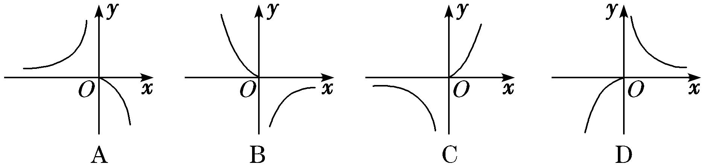

13．答案　D　解析　法一：由题设得函数*g*(*x*)＝－*f*(－*x*)＝据此可画出该函数的图象，如

题图选项D中图象．故选D．

法二：先画出函数*f*(*x*)的图象，如图1所示，再根据函数*f*(*x*)与－*f*(－*x*)的图象关于坐标原点对称，即可画出函数－*f*(－*x*)，即*g*(*x*)的图象，如图2所示．故选D．

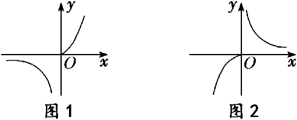

14．若函数*y*＝*f*(*x*)的图象如图所示，则函数*y*＝－*f*(*x*＋1)的图象大致为(　　)

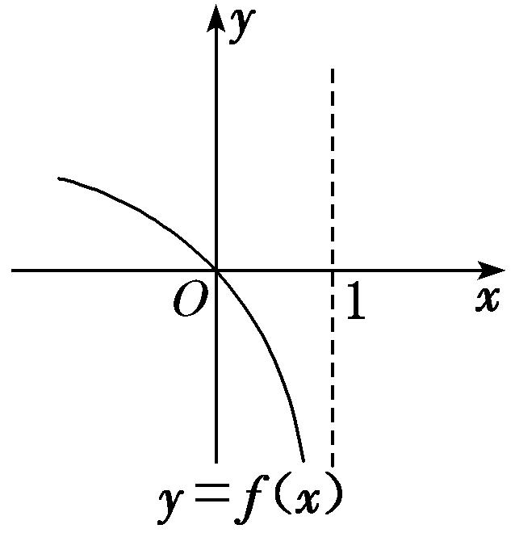

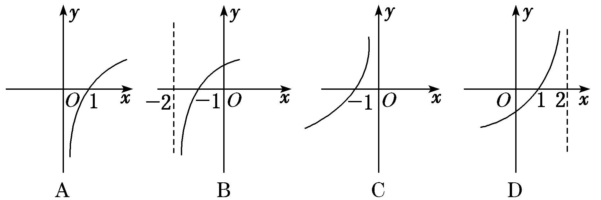

14．答案　C　解析　要想由*y*＝*f*(*x*)的图象得到*y*＝－*f*(*x*＋1)的图象，需要先将*y*＝*f*(*x*)的图象关于*x*轴对称

得到*y*＝－*f*(*x*)的图象，然后向左平移1个单位长度得到*y*＝－*f*(*x*＋1)的图象，根据上述步骤可知C正确．

15．如图所示的图象对应的函数解析式可能是(　　)

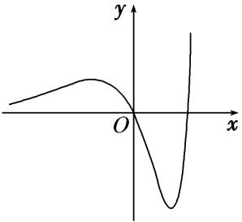

A．<em>y</em>＝2<em>x</em>－<em>x</em>2－1　　　　B．<em>y</em>＝　　　　C．<em>y</em>＝　　　　D．<em>y</em>＝(<em>x</em>2－2<em>x</em>)e<em>x</em>

15．答案　D　解析　A中，<em>y</em>＝2<em>x</em>－<em>x</em>2－1，当<em>x</em>趋于－∞时，函数<em>y</em>＝2<em>x</em>的值趋于0，<em>y</em>＝<em>x</em>2＋1的值趋于＋

∞，所以函数<em>y</em>＝2<em>x</em>－<em>x</em>2－1的值小于0，故A中的函数不满足．B中，<em>y</em>＝sin <em>x</em>是周期函数，所以函数<em>y</em>＝的图象是以<em>x</em>轴为中心的波浪线，故B中的函数不满足．C中，函数<em>y</em>＝的定义域为(0，1)∪(1，＋∞)，故C中的函数不满足．D中，<em>y</em>＝<em>x</em>2－2<em>x</em>，当<em>x</em>&lt;0或<em>x</em>&gt;2时，<em>y</em>&gt;0，当0&lt;<em>x</em>&lt;2时，<em>y</em>&lt;0，且<em>y</em>＝e<em>x</em>&gt;0恒成立，所以<em>y</em>＝(<em>x</em>2－2<em>x</em>)e<em>x</em>的图象在<em>x</em>趋于＋∞时，<em>y</em>趋于＋∞，故D中的函数满足．

16．函数*f*(*x*)的大致图象如图所示，则函数*f*(*x*)的解析式可以是(　　)

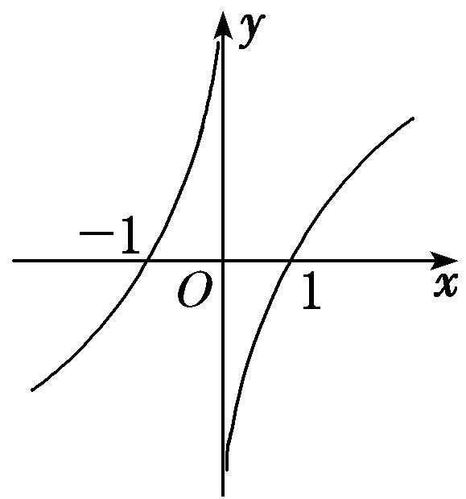

A．<em>f</em>(<em>x</em>)＝<em>x</em>2·sin|<em>x</em>|　　B．<em>f</em>(<em>x</em>)＝·cos 2<em>x</em>　　C．<em>f</em>(<em>x</em>)＝(e<em>x</em>－e－<em>x</em>)cos　　D．<em>f</em>(<em>x</em>)＝

16．答案　D　解析　由题中图象可知，函数在原点处没有图象，故函数的定义域为{*x*|*x*≠0}，故排除选项

A、C；又函数图象与*x*轴只有两个交点，*f*(*x*)＝cos 2*x*中cos 2*x*＝0有无数个根，故排除选项B，正确选项是D．

17．如图，矩形*ABCD*的周长为4，设*AB*＝*x*，*AC*＝*y*，则*y*＝*f*(*x*)的大致图象为(　　)

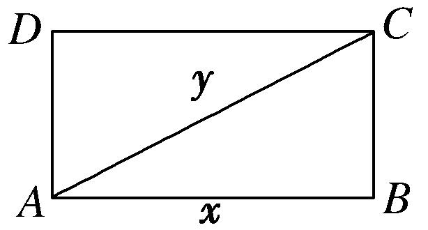

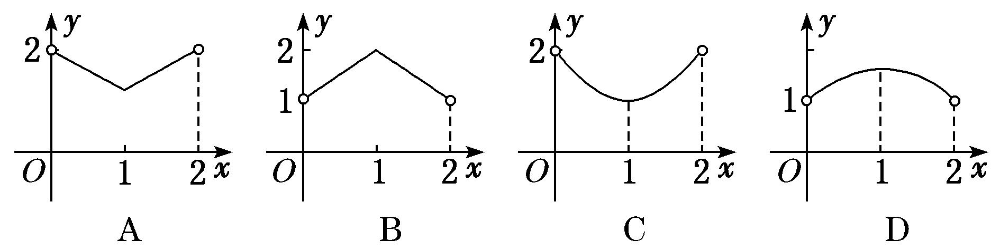

17．答案　C　解析　由题意得*y*＝＝，*x*∈(0，2)不是一次函数，排除A、B；

当*x*→0时，*y*→2，故选C．

18．如图，不规则四边形*ABCD*中，*AB*和*CD*是线段，*AD*和*BC*是圆弧，直线*l*⊥*AB*交*AB*于*E*，当*l*

从左至右移动(与线段*AB*有公共点)时，把四边形*ABCD*分成两部分，设*AE*＝*x*，左侧部分的面积为*y*，则*y*关于*x*的图象大致是(　　)

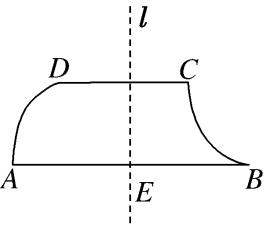

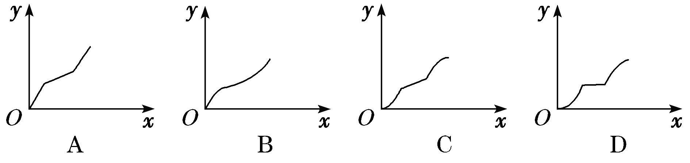

18．答案　C　解析　当*l*从左至右移动时，一开始面积的增加速度越来越快，过了*D*点后面积保持匀速

增加，图象呈直线变化，过了*C*点后面积的增加速度又逐渐减慢．故选C．

19．(2015·全国Ⅱ)如图，长方形*ABCD*的边*AB*＝2，*BC*＝1，*O*是*AB*的中点，点*P*沿着边*BC*，*CD*与*DA*

运动，记∠*BOP*＝*x*．将动点*P*到*A*，*B*两点距离之和表示为*x*的函数*f*(*x*)，则*y*＝*f*(*x*)的图象大致为(　　)

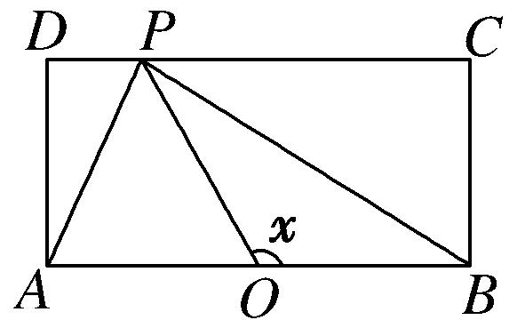

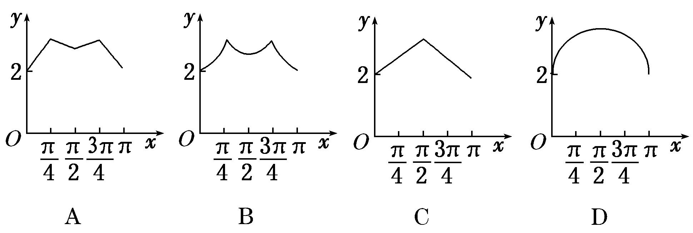

19．答案　B　解析　当*x*∈时，*f*(*x*)＝tan *x*＋，图象不会是直线段，从而排除A、C．当*x*

∈时，*f*＝*f*＝1＋，*f*＝2．∵2<1＋，∴*f*<*f*＝*f*，从而排除D，故选B．

20．(2014·全国Ⅰ)如图，圆*O*的半径为1，*A*是圆上的定点，*P*是圆上的动点，角*x*的始边为射线*OA*，终

边为射线*OP*，过点*P*作直线*OA*的垂线，垂足为*M*．将点*M*到直线*OP*的距离表示成*x*的函数*f*(*x*)，则*y*＝*f*(*x*)在[0，π]的图象大致为(　　)

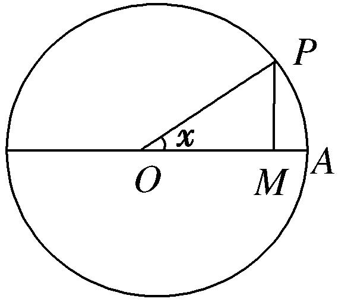

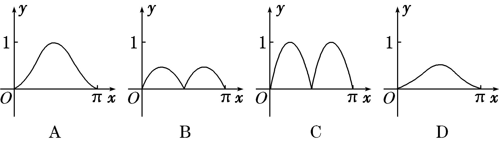

20．答案　B　解析　由题意知，*f*(*x*)＝|cos *x*|·sin *x*，当*x*∈时，*f*(*x*)＝cos *x*·sin *x*＝sin 2*x*；当*x*∈

时，*f*(*x*)＝－cos *x*·sin *x*＝－sin 2*x*，故选B．

