# 专题十一 幂函数

#### 1. 幂函数的概念

一般地，形如 $y=x^{\alpha}(\alpha\in\mathbf{R})$ 的函数称为幂函数，其中底数 x 是自变量， $\alpha$ 为常数.

#### 2. 五种常见幂函数的图象与性质

<table><tr><td>函数特征性质</td><td> $y=x$ </td><td> $y=x^{2}$ </td><td> $y=x^{3}$ </td><td> $y=x\frac{1}{2}$ </td><td> $y=x^{-1}$ </td></tr><tr><td>图象</td><td>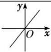</td><td>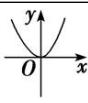</td><td>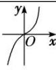</td><td>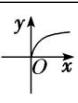</td><td>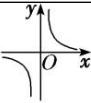</td></tr><tr><td>定义域</td><td>R</td><td>R</td><td>R</td><td> $\{x|x\geq0\}$ </td><td> $\{x|x\neq0\}$ </td></tr><tr><td>值域</td><td>R</td><td> $\{y|y\geq0\}$ </td><td>R</td><td> $\{y|y\geq0\}$ </td><td> $\{y|y\neq0\}$ </td></tr><tr><td>奇偶性</td><td>奇</td><td>偶</td><td>奇</td><td>非奇非偶</td><td>奇</td></tr><tr><td>单调性</td><td>增</td><td> $(-∞, 0)减,(0, +∞)增$ </td><td>增</td><td>增</td><td> $(-∞, 0)和(0, +∞)减$ </td></tr><tr><td>公共点</td><td colspan="5">(1, 1)</td></tr></table>

#### 3. 常用结论

# 幂函数的图象特征与性质

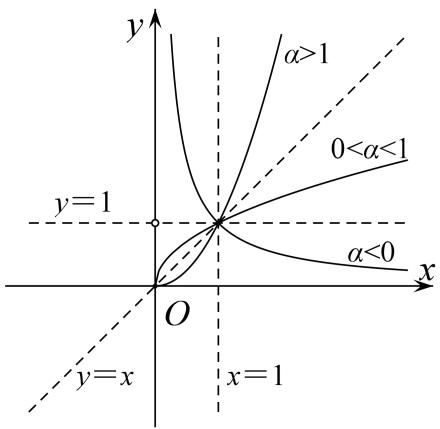

对于幂函数图象的掌握只要抓住在第一象限内三条线分第一象限为六个区域，即 $x = 1$ ， $y = 1$ ， $y = x$ 分区域．根据 $\alpha < 0$ ， $0 < \alpha < 1$ ， $\alpha = 1$ ， $\alpha > 1$ 的取值确定位置后，其余象限部分由奇偶性决定.  
（1）幂函数在 $(0, +\infty)$ 上都有定义；  
（2）幂函数的图象过定点(1, 1);   
（3）当 $\alpha>0$ 时，幂函数的图象都过点(1,1)和(0,0)，且在 $(0,+\infty)$ 上单调递增，特别地，当 $\alpha>1$ 时，幂函数的图象下凸；当 $0<\alpha<1$ 时，幂函数的图象上凸；  
（4）当 $\alpha<0$ 时，幂函数的图象都过点(1,1)，且在 $(0,+\infty)$ 上单调递减；  
（5）幂指数互为倒数的幂函数在第一象限内的图象关于直线 y=x 对称.  
（6）在第一象限，作直线 $x = a(a > 1)$ ，它同各幂函数图象相交，按交点从下到上的顺序，幂指数按从小到大的顺序排列.  
（7）对于形如 $f(x) = x^{\alpha}$ (其中 $\alpha \in Z$ )，当 $\alpha$ 为奇数时，幂函数为奇函数，图象关于原点对称；当 $\alpha$ 为偶数时，

幂函数为偶函数，图象关于 y 轴对称.  
（8）对于形如 $f(x) = x_{m}^{\underline{n}}$ (其中 $m \in \mathbf{N}^{*}$ , $n \in \mathbf{Z}$ , $m$ 与 $n$ 互质)的幂函数的奇偶性:

①当 n 为偶数时， $f(x)$ 为偶函数，图象关于 y 轴对称；  
②当 m，n 都为奇数时， $f(x)$ 为奇函数，图象关于原点对称；  
③当 m 为偶数时， $x>0$ （或 $x\geq0$ ）， $f(x)$ 是非奇非偶函数，图象只在第一象限（或第一象限及原点处）.

# 考点一 幂函数的图象及其应用

# 【方法总结】

# 幂函数图象的规律  
（1）幂函数的图象一定会出现在第一象限，一定不会出现在第四象限，至于是否出现在第二、三象限，要看函数的奇偶性；  
（2）幂函数的图象最多能同时出现在两个象限内；  
（3）如果幂函数图象与坐标轴相交，则交点一定是原点；  
（4）当 $\alpha$ 为奇数时，幂函数的图象关于原点对称；当 $\alpha$ 为偶数时，幂函数的图象关于 $y$ 轴对称.

# 【例题选讲】

[例 1] （1） 若幂函数 $y=(m^{2}-3m+3)\cdot x^{m2-m-2}$ 的图象不过原点，则 m 的取值是()

A. $-1 \leq m \leq 2$

B. $m = 1$ 或 $m = 2$

C. $m = 2$

D. $m = 1$  
（2）幂函数 $y=f(x)$ 的图象过点 (4, 2)，则幂函数 $y=f(x)$ 的图象是()

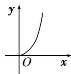  
A

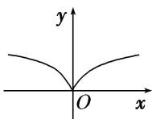  
B

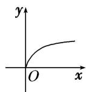  
C

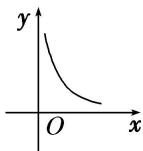  
D  
（3） 若幂函数 $y=x^{-1}$ ， $y=x^{m}$ 与 $y=x^{n}$ 在第一象限内的图象如图所示，则 m 与 n 的取值情况为()

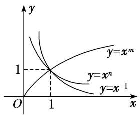

A. $-1 < m < 0 < n < 1$

B. -1 < n < 0 < m

C. -1<m<0<n

D. -1<n<0<m<1  
（4）如图所示, 图中的曲线是幂函数 $y = x^n$ 在第一象限的图象, 已知 $n$ 取 $\pm 2$ , $\pm \frac{1}{2}$ 四个值, 则相应于 $C_1$ , $C_2$ , $C_3$ , $C_4$ 的 $n$ 依次为 ( )

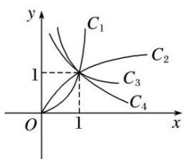

A. -2, $-\frac{1}{2}$ , $\frac{1}{2}$ , 2

B. $2, \frac{1}{2}, -\frac{1}{2}, -2$

C. $-\frac{1}{2}, -2, 2, \frac{1}{2}$

D. $2, \frac{1}{2}, -2, -\frac{1}{2}$  
（5）幂函数 $y = x^{-1}$ 及直线 $y = x, y = 1, x = 1$ 将平面直角坐标系的第一象限分成八个“卦限”：①，②，③，④，⑤，⑥，⑦，⑧(如图所示)，则幂函数 $y = x^{\frac{1}{2}}$ 的图象经过的“卦限”是（）

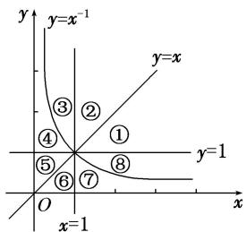

A. ④，⑦

B. ④，⑧

C. ③，⑧

D. ①, ⑤  
（6） 当 0 < x < 1 时， $f(x) = x^{2}$ ， $g(x) = x^{\frac{1}{2}}$ ， $h(x) = x^{-2}$ ，则 $f(x)$ ， $g(x)$ ， $h(x)$ 的大小关系是 \_\_\_\_.

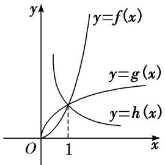

# 【对点训练】

1. 已知幂函数 $f(x) = k^2 \cdot x^{a + 1}$ 的图象过点 $\left(\frac{1}{2}, \frac{\sqrt{2}}{2}\right)$ ，则 $k + a = (\quad)$

A. $\frac{1}{2}$

B. $-\frac{3}{2}$

C. $\frac{1}{2}$ 或 $-\frac{3}{2}$

D. 2

2. 函数 $y = x^{\frac{1}{3}}$ 的图象是( )

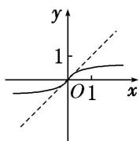  
A

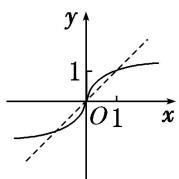  
B

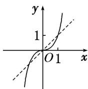  
C

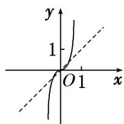  
D

3. 函数 $y = x^{\frac{5}{4}}$ 的图象是()

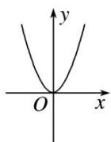  
A

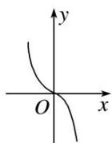  
B

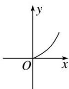  
C

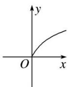  
D

4. 幂函数 $y = x^{m^2 - 2m - 3} (m \in \mathbf{Z})$ 的图象如图所示，则 $m$ 的值为（）

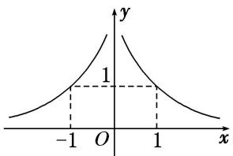

A. -1

B. 0

C. 1

D. 2

5. 函数 $y = x^{\frac{1}{2}} - 1$ 的图象关于 $x$ 轴对称的图象大致是( )

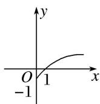  
A

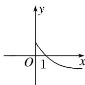  
B

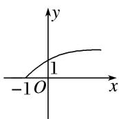  
C

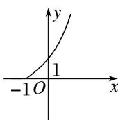  
D

6. 图中 $C_1, C_2, C_3$ 为三个幂函数 $y = x^k$ 在第一象限内的图象，则解析式中指数 $k$ 的值依次可以是( )

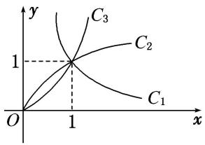

A. $-1,\frac{1}{2},\quad3$

B. -1, 3, $\frac{1}{2}$

C. $\frac{1}{2}$ , -1, 3

D. $\frac{1}{2}$ , 3, -1

7. 若四个幂函数 $y = x^{a}$ , $y = x^{b}$ , $y = x^{c}$ , $y = x^{d}$ 在同一坐标系中的图象如图所示, 则 $a, b, c, d$ 的大小关系是( )

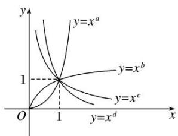

A. d>c>b>a

B. a>b>c>d

C. d>c>a>b

D. a>b>d>c

8. 在同一坐标系内，函数 $y = x^{a} (a \neq 0)$ 和 $y = ax - \frac{1}{a}$ 的图象可能是（）

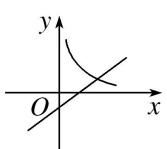  
A

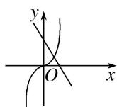  
B

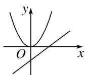  
C

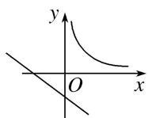  
D

# 考点二 幂函数性质的综合应用

# 考向1 比较幂值大小

# 【方法总结】

# 比较幂值大小的常见类型及解决方法  
（1）同底不同指：利用指数函数单调性进行比较  
（2）同指不同底：利用幂函数单调性进行比较  
（3）既不同底又不同指：常常找到一个中间值，通过比较两个幂值与中间值的大小来判断两个幂值的大小

# 【例题选讲】

[例 2] （1） 已知 $a=3^{\frac{4}{5}}$ , $b=4^{\frac{2}{5}}$ , $c=12^{\frac{1}{5}}$ ，则 a, b, c 的大小关系为()

A. b<a<c

B. a<b<c

C. c<b<a

D. c<a<b  
（2） (2016·全国III)已知 $a=2^{\frac{4}{3}}$ ， $b=4^{\frac{2}{5}}$ ， $c=25^{\frac{1}{3}}$ ，则()

A. b<a<c

B. a<b<c

C. b<c<a

D. c<a<b  
（3） 若 $a = \left(\frac{1}{2}\right)_{3}^{2}$ , $b = \left(\frac{1}{5}\right)_{3}^{2}$ , $c = \left(\frac{1}{2}\right)_{3}^{1}$ , 则 $a, b, c$ 的大小关系是( )

A. a<b<c

B. c<a<b

C. b<c<a

D. b<a<c  
（4） 设 $a = 0.6^{0.6}$ , $b = 0.6^{1.5}$ , $c = 1.5^{0.6}$ , 则 $a, b, c$ 的大小关系是( )

A. a<b<c

B. a<c<b

C. b<a<c

D. b<c<a

# 【对点训练】

9. 若 $a = 2^{-\frac{3}{2}}$ ， $b = \left(\frac{2}{5}\right)^3$ ， $c = \left(\frac{1}{2}\right)^3$ ，则 $a, b, c$ 的大小关系是（）

A. a<b<c

B. c<a<b

C. b<c<a

D. b<a<c

10. 若 $a = \left(\frac{3}{5}\right)\frac{2}{5}$ , $b = \left(\frac{2}{5}\right)\frac{3}{5}$ , $c = \left(\frac{2}{5}\right)\frac{2}{5}$ , 则 $a, b, c$ 的大小关系是( )

A. a>b>c

B. a>c>b

C. c>a>b

D. b>c>a

11. 设 $x = 0.2^{0.3}$ , $y = 0.3^{0.2}$ , $z = 0.3^{0.3}$ , 则 $x, y, z$ 的大小关系为( )

A. x<z<y

B. y<x<z

C. y<z<x

D. z<y<x

12. 设 $a = \left(\frac{2}{3}\right)^{\frac{1}{3}}$ , $b = \left(\frac{1}{3}\right)^{\frac{2}{3}}$ , $c = \left(\frac{1}{3}\right)^{\frac{1}{3}}$ , 则 $a, b, c$ 的大小关系为( )

A. a>c>b

B. a>b>c

C. c>a>b

D. b>c>a

13. 已知 $a = 2^{0.2}$ , $b = 0.4^{0.2}$ , $c = 0.4^{0.75}$ , 则( )

A. a>b>c

B. a>c>b

C. c>a>b

D. b>c>a

# 考向 2 幂函数的性质及其应用

# 【方法总结】

# 幂函数 $y = x^{\alpha}$ 的主要性质及解题策略  
（1）幂函数在 $(0, +\infty)$ 内都有定义，幂函数的图象都过定点 $(1, 1)$ .  
（2）当 $\alpha>0$ 时，幂函数的图象经过点(1,1)和(0,0)，且在 $(0,+\infty)$ 内单调递增；当 $\alpha<0$ 时，幂函数的图象经过点(1,1)，且在 $(0,+\infty)$ 内单调递减.  
（3）当 $\alpha$ 为奇数时，幂函数为奇函数；当 $\alpha$ 为偶数时，幂函数为偶函数.  
（4）幂函数的性质因幂指数大于零、等于零或小于零而不同，解题中要善于根据幂指数的符号和其他性质确定幂函数的解析式、参数取值等.

# 【例题选讲】

[例 3]（1） 函数 $f(x)=(m^{2}-m-1)x^{m}$ 是幂函数，且在 $x\in(0,+\infty)$ 上为增函数，则实数 m 的值是 \_\_\_\_.  
（2） 已知幂函数 $f(x)=(m^{2}-3m+3)x^{m+1}$ 为偶函数，则 $m=(\quad)$

A. 1

B. 2

C. 1 或 2

D. 3  
（3）幂函数 $y=f(x)$ 的图象经过点 $(3, \sqrt[3]{3})$ ，则 $f(x)$ 是()

A. 偶函数，且在 $(0, +\infty)$ 上是增函数

B. 偶函数，且在 $(0, +\infty)$ 上是减函数

C. 奇函数，且在 $(0, +\infty)$ 上是增函数

D. 非奇非偶函数，且在 $(0, +\infty)$ 上是减函数  
（4） 已知幂函数 $f(x) = (n^2 + 2n - 2)x^{n^2 - 3n}$ ( $n \in \mathbf{Z}$ ) 的图象关于 $y$ 轴对称，且在 $(0, +\infty)$ 上是减函数，则 $n$ 的值为（）

A.-3

B. 1

C. 2

D. 1 或 2  
（5） 已知幂函数 $f(x) = x^{-\frac{1}{2}}$ ，若 $f(a + 1) < f(10 - 2a)$ ，则 $a$ 的取值范围是 \_\_\_\_.  
（6） 若 $(a+1)^{-\frac{1}{3}}<(3-2a)^{-\frac{1}{3}}$ ，则实数 a 的取值范围是 \_\_\_\_.  
（7） 已知幂函数 $f(x)$ 的图象过点 $\left\{2, \frac{1}{4}\right\}$ , 则函数 $g(x) = f(x) + \frac{x^2}{4}$ 的最小值为 ( )

A. 1

B. 2

C. 4

D. 6  
（8）对于幂函数 $f(x)=x^{\frac{4}{5}}$ ，若 $0<x_{1}<x_{2}$ ，则 $f\left(\frac{x_{1}+x_{2}}{2}\right)$ ， $\frac{f(x_{1})+f(x_{2})}{2}$ 的大小关系是()

A. $f\left(\frac{x_{1}+x_{2}}{2}\right) \times \frac{f(x_{1})+f(x_{2})}{2}$

B. $f\left(\frac{x_{1}+x_{2}}{2}\right)<\frac{f(x_{1})+f(x_{2})}{2}$

C. $f\left(\frac{x_1 + x_2}{2}\right) = \frac{f(x_1) + f(x_2)}{2}$

D. 无法确定

# 【对点训练】

14. 已知函数 $f(x) = (m^2 - m - 1)x^{m^2 + m - 3}$ ( $m \in \mathbf{Z}$ ) 是幂函数，且 $x \in (0, +\infty)$ 时， $f(x)$ 是增函数，则 $m$ 的值为（）

A.-1

B. 2

C. -1 或 2

D. 3

15. 已知幂函数 $f(x)=(n^{2}+2n-2)\cdot x^{n^{2}-3n}(n\in\mathbf{Z})$ 在 $(0,+\infty)$ 上是减函数，则 n 的值为()

A.-3

B. 1

C. 2

D. 1 或 2

16. 若幂函数的图象经过点 $\left(2, \frac{1}{4}\right)$ , 则它的单调递增区间是 ( )

A. $(0, +\infty)$

B. $[0, +\infty)$

C. $(-\infty, +\infty)$

D. $(-∞, 0)$

17. 已知函数 $f(x) = x^{2 - m}$ 是定义在区间 $[-3 - m, m^2 - m]$ 上的奇函数，则下列成立的是()

A. $f(m) <   f(0)$

B. $f(m)=f(0)$

C. $f(m) > f(0)$

D. $f(m)$ 与 $f(0)$ 大小不确定

18. 设 $\alpha \in \left\{-2, -1, -\frac{1}{2}, \frac{1}{2}, 1, 2\right\}$ ，则使 $f(x) = x^{\alpha}$ 为奇函数，且在 $(0, +\infty)$ 上单调递减的 $\alpha$ 的值的个数是（）

A. 1

B. 2

C. 3

D. 4

19. 幂函数 $f(x)=x^{a^{2}-10a+23}(a\in\mathbf{Z})$ 为偶函数，且 $f(x)$ 在区间 $(0,+\infty)$ 上是减函数，则 a 等于()

A. 3

B. 4

C. 5

D. 6

20. 已知幂函数 $y = x^{m^2 - 2m - 3}$ ( $m \in \mathbf{Z}$ ) 的图象与 $x$ 轴和 $y$ 轴没有交点，且关于 $y$ 轴对称，则 $m$ 等于（）

A. 1

B. 0, 2

C. -1, 1, 3

D. 0, 1, 2

21. 给出幂函数: ① $f(x) = x$ ; ② $f(x) = x^2$ ; ③ $f(x) = x^3$ ; ④ $f(x) = \sqrt{x}$ ; ⑤ $f(x) = \frac{1}{x}$ . 其中满足条件 $f\left(\frac{x_1 + x_2}{2}\right) > \frac{f(x_1) + f(x_2)}{2}$ ( $x_1 > x_2 > 0$ ) 的函数的个数是 ( )

A. 1

B. 2

C. 3

D. 4

22. 若 $(a+1)^{\frac{1}{2}}<(3-2a)^{\frac{1}{2}}$ ，则实数a的取值范围是\_\_\_\_。

23. 已知幂函数 $y = x^{3m-9} (m \in \mathbb{N}^*)$ 的图象关于 y 轴对称且在 $(0, +\infty)$ 上单调递减，求满足 $(a + 1)^{-\frac{m}{3}} < (3 - 2a)^{-\frac{m}{3}}$ 的 a 的取值范围.

24. 已知幂函数 $f(x)=x^{(m^{2}+m)^{-1}}(m\in\mathbf{N}^{*})$ 的图象经过点 $(2,\sqrt{2})$ .  
（1）试确定 m 的值;  
（2）求满足条件 $f(2 - a) > f(a - 1)$ 的实数 $a$ 的取值范围.

25. 已知函数 $h(x)=(m^{2}-5m+1)x^{m+1}$ 为幂函数，且为奇函数.  
（1）求 m 的值;  
（2）求函数 $g(x) = h(x) + \sqrt{1 - 2h(x)}$ ， $x\in \left[0,\frac{1}{2}\right]$ 的值域.

26. 已知幂函数 $f(x)=(-2m^{2}+m+2)x^{m+1}$ 为偶函数.  
（1）求 $f(x)$ 的解析式;  
（2）若函数 $h(x)=f(x)+ax+3-a\geqslant0$ 在区间 $[-2,2]$ 上恒成立，求实数 a 的取值范围.

