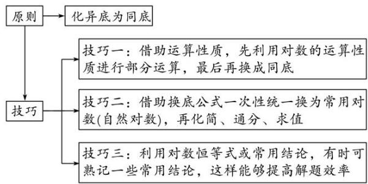

# 专题十二 指数式、对数式的运算

# 考点一 指数式的运算

# 【基本知识】

#### 1. 根式  
（1）根式的概念
若 $x^n = a$ ，则 $x$ 叫做 $a$ 的 $n$ 次方根，其中 $n > 1$ 且 $n \in \mathbf{N}^*$ 。式子 $\sqrt[n]{a}$ 叫做根式，这里 $n$ 叫做根指数， $a$ 叫做被开方数。  
（2）a 的 n 次方根的表示
$x ^ {n} = a \Rightarrow \left\{ \begin{array}{l l} x = \sqrt [ n ]{a} & \text {当} n \text {为奇数且} n > 1 \text {时,} \\ x = \pm \sqrt [ n ]{a} & \text {当} n \text {为偶数且} n > 1 \text {时.} \end{array} \right.$  
（3）根式的性质

① $(\sqrt[n]{a})^{n}=a(a$ 使 $\sqrt[n]{a}$ 有意义).  
②当 n 是奇数时， $\sqrt[n]{a^{n}}=a$ ；当 n 是偶数时， $\sqrt[n]{a^{n}}=|a|=\begin{cases}a,&a\geq0,\\-a,&a<0.\end{cases}$

#### 2. 有理数指数幂  
（1）分数指数幂的意义

①正分数指数幂： $a^{\frac{m}{n}}=\sqrt[n]{a^{m}}(a>0,\ m,\ n\in\mathbf{N}^{*},\ \text{且}\ n>1).$   
②负分数指数幂： $a^{-\frac{m}{n}} = \frac{\frac{m}{n}}{a} = \frac{1}{\sqrt[n]{a^m}} (a > 0, m, n \in \mathbf{N}^*$ ，且 $n > 1)$ .  
③0 的正分数指数幂等于 0, 0 的负分数指数幂没有意义.  
（2）有理数指数幂的运算性质

① $a^{r}\cdot a^{s}=a^{r+s}(a>0,\ r,\ s\in\mathbf{Q})$ ; ② $\frac{a^{r}}{a^{s}}=a^{r-s}(a>0,\ r,\ s\in\mathbf{Q})$ ;   
③ $(a^{r})^{s}=a^{rs}(a>0,\ r,\ s\in\mathbf{Q});$ ④ $(ab)^{r}=a^{r}b^{r}(a>0,\ b>0,\ r\in\mathbf{Q}).$

注意：（1）有理数指数幂的运算性质中，要求指数的底数都大于0，否则不能用性质来运算.  
（2）有理数指数幂的运算性质也适用于无理数指数幂.

# 【方法总结】

# 指数幂运算的一般原则  
（1）有括号的先算括号里的，无括号的先做指数运算.   
（2）先乘除后加减，负指数幂化成正指数幂的倒数.   
（3）底数是负数，先确定符号；底数是小数，先化成分数；底数是带分数的，先化成假分数.   
（4）若是根式，应化为分数指数幂，尽可能用幂的形式表示，运用指数幂的运算性质来解答.  
（5）运算结果不能同时含有根号和分数指数，也不能既有分母又含有负指数，形式力求统一.

# 【例题选讲】

[例 1] 计算：（1） $\left(\frac{2\frac{3}{5}}{5}\right)^{0}+2^{-2}\cdot\left(\frac{2\frac{1}{4}}{4}\right)^{-\frac{1}{2}}-(0.01)^{0.5}=$ \_\_\_\_；  
（2） $(0.027)^{-\frac{1}{3}} - \left(\frac{1}{7}\right)^{-2} + \left(2\frac{7}{9}\right)\frac{1}{2} - (\sqrt{2} - 1)^{0} =$  
（3） $\sqrt[3]{a_{2}^{\frac{9}{2}}\sqrt{a^{-3}}}\div\sqrt[3]{\sqrt{a^{-7}}\sqrt[3]{a^{13}}}=$ \_\_\_\_；  
（4） $\frac{5}{6} a_{3}^{\frac{1}{2}} b^{-2} \cdot (-3a^{-\frac{1}{2}} b^{-1}) \div (4a_{3}^{\frac{2}{2}} b^{-3})_{2}^{\frac{1}{2}} (a, b > 0) =$ \_\_\_\_;  
（5） 若 $x^{\frac{1}{2}} + x^{-\frac{1}{2}} = 3$ ，则 $\frac{\frac{3}{x^2} + x^- + 2}{x^2 + x^{-2} + 3} =$ \_\_\_\_.

# 【对点训练】

1. 若实数 $a > 0$ ，则下列等式成立的是（）

A. $(-2)^{-2} = 4$

B. $2a^{-3} = \frac{1}{2a^3}$

C. $(-2)^{0} = -1$

D. $(a^{-\frac{1}{4}})^4 = \frac{1}{a}$

2. 化简 $4a^{\frac{2}{3}} \cdot b^{-\frac{1}{3} \div (-\frac{2}{3})} a^{-\frac{1}{3}} \cdot b^{\frac{2}{3}}$ 的结果为( )

A. $-\frac{2a}{3b}$

B. $-\frac{8a}{b}$

C. $-\frac{6a}{b}$

D. -6ab

3. $(\sqrt[3]{\sqrt[6]{a^9}})^4 (\sqrt[6]{\sqrt[3]{a^9}})^4 (a > 0)$ 等于( )

A. $a^{16}$

B. $a^{8}$

C. $a^{4}$

D. $a^{2}$

4. 已知 $2^{a}=5^{b}=m$ ，且 $\frac{1}{a}+\frac{1}{b}=2$ ，则 m 等于()

A. $\sqrt{10}$

B. 10

C. 20

D. 100

5. 计算： $-\left(\frac{3}{2}\right)^{-2}+\left(-\frac{27}{8}\right)^{-\frac{2}{3}}+(0.002)^{-\frac{1}{2}}=$ \_\_\_\_.

6. 化简： $\left(\frac{1}{4}\right)^{-\frac{1}{2}}\cdot\frac{\left(\sqrt{4ab^{-1}}\right)^{3}}{(0.1)^{-1}\cdot(a^{3}\cdot b^{-3})\frac{1}{2}}(a>0,\quad b>0)=$ \_\_\_\_.

7. $\left(-\frac{27}{8}\right)^{-\frac{2}{3}} + 0.002 - \frac{1}{2} - 10(\sqrt{5} - 2)^{-1} + \pi^0 =$

8. 若 $x > 0$ ，则 $(2x^{\frac{1}{4}} + 3^{\frac{3}{2}})(2x^{\frac{1}{4}} - 3^{\frac{3}{2}}) - 4x^{-\frac{1}{2}} (x - x^{\frac{1}{2}}) =$ \_\_\_\_.

9. $\left[0.064\right]^{-2.5}\frac{2}{3} -\sqrt[3]{9\times\frac{3}{8}}-\pi^{0} =$

10. 已知 $\frac{3a}{2} + b = 1$ ，则 $\frac{9^a \times 3^b}{\sqrt{3^a}} =$ \_\_\_\_.

11. 计算下列各式:  
（1） $\left(-x^{\frac{1}{3}}y^{-\frac{1}{3}}\right)\left(3x^{-\frac{1}{2}}y^{\frac{2}{3}}\right)\left(-2x^{\frac{1}{6}}y^{\frac{2}{3}}\right);$  
（2） $2x^{\frac{1}{4}}\left(-3x^{\frac{1}{4}}y^{-\frac{1}{3}}\right)\div\left(-6x^{-\frac{3}{2}}y^{-\frac{4}{3}}\right).$

12. 计算:  
（1） $7\sqrt[3]{3} - 3\sqrt[3]{24} - 6\sqrt[3]{\frac{1}{9}} + \sqrt[4]{3\sqrt[3]{3}};$
$0. 0 0 8 1 ^ {- \frac {1}{4}} - \left[ 3 \times \left(\frac {7}{8}\right) ^ {0} \right] ^ {- 1} \times \left[ 8 1 ^ {- 0. 2 5} + \left(3 \frac {3}{8}\right) ^ {- \frac {1}{3}} \right] ^ {- \frac {1}{2}} - 1 0 \times 0. 0 2 7 ^ {\frac {1}{3}}.$

# 考点二 对数式的运算

# 【知识梳理】

#### 1. 对数的概念  
（1）对数的定义
如果 $a^x = N(a > 0$ ，且 $a\neq 1)$ ，那么数 $x$ 叫做以 $a$ 为底 $N$ 的对数，记作 $x = \log_aN$ ，其中 $a$ 叫做对数的底数， $N$ 叫做真数.  
（2）几种常见对数

<table><tr><td>对数形式</td><td>特点</td><td>记法</td></tr><tr><td>一般对数</td><td>底数为a(a&gt;0,且a≠1)</td><td> $\log_a N$ </td></tr><tr><td>常用对数</td><td>底数为10</td><td>lgN</td></tr><tr><td>自然对数</td><td>底数为e</td><td>lnN</td></tr></table>

#### 2. 对数恒等式
$a ^ {\log_ {a} N} = N (a > 0 \text {且} a \neq 1, N > 0).$

#### 3. 对数的性质  
（1）1 的对数是零，即 $\log_{a}1=0(a>0$ 且 $a\neq1)$ ;  
（2）底数的对数等于1，即 $\log_{a}a=1(a>0$ 且 $a\neq1)$ ;   
（3）负数和零没有对数.

#### 4. 对数的运算法则
如果 a>0，且 $a\neq1$ ，M>0，N>0，那么
$① \log_ {a} (M N) = \log_ {a} M + \log_ {a} N; ② \log_ {a} \frac {M}{N} = \log_ {a} M - \log_ {a} N; ③ \log_ {a} M ^ {n} = n \log_ {a} M (n \in \mathbf {R});$

#### 5. 对数的换底公式及推广

换底公式： $\log_{b}N=\frac{\log_{a}N}{\log_{a}b}(a,\ b\text{均大于零，且不等于1});$

推广： $（1）\log_{a}b\cdot\log_{b}a=1$ ，即 $\log_{a}b=\frac{1}{\log_{b}a}(a,\ b\text{ 均大于 }0\text{ 且不等于 }1)$ ;  
（2） $\log_{a}^{m}b^{n}=\frac{n}{m}\log_{a}b(a,\ b\text{均大于}0\text{且不等于}1,\ m\neq0,\ n\in\mathbf{R});$

# 【方法总结】

# 对数运算问题的基本原则和方法  
（1）基本原则：对数的化简求值一般是正用或逆用公式，对真数进行处理，选哪种策略化简，取决于问题的实际情况，一般本着便于真数化简的原则进行.  
（2）两种常用的方法：①“收”，将同底的两对数的和(差)收成积(商)的对数；  
② “拆”，将积(商)的对数拆成同底的两对数的和(差).   
（3）利用换底公式进行化简求值的原则和技巧

# 【例题选讲】

[例 2] 计算下列各式:  
（1） $\frac{\lg 2+\lg 5-\lg 8}{\lg 50-\lg 40}=$ \_\_\_\_;   
（2） $\frac{\lg 3 + \frac{2}{5}\lg 9 + \frac{3}{5}\lg\sqrt{27} - \lg\sqrt{3}}{\lg 81 - \lg 27} =$ \_\_\_\_;   
（3） $\lg 25 + \lg 2 \cdot \lg 50 + (\lg 2)^{2} =$ \_\_\_\_ ;   
（4） $\frac{\sqrt{(\lg 3)^2 - \lg 9 + 1} (\lg \sqrt{27} + \lg 8 - \lg \sqrt{1000})}{\lg 0.3 \cdot \lg 1.2} =$ \_\_\_\_;   
（5） $\log_23\cdot \log_38 + (\sqrt{3})\log_34 =$   
（6） $(\log_{3}2+\log_{9}2)\cdot(\log_{4}3+\log_{8}3)=$ \_\_\_\_.

# 【对点训练】

13. $(\log_29)\cdot (\log_34) = ()$

A. $\frac{1}{4}$

B. $\frac{1}{2}$

C. 2

D. 4

14. $(\log_29)(\log_32) + \log_a\frac{5}{4} +\log_a\left(\frac{4}{5} a\right)$ $a > 0$ ，且 $a\neq 1)$ 的值为（

A. 2

B. 3

C. 4

D. 5

15. 如果 $2\log_{a}(P-2Q)=\log_{a}P+\log_{a}Q(a>0$ ，且 $a\neq1)$ ，那么 $\frac{P}{Q}$ 的值为()

A. $\frac{1}{4}$

B. 4

C. 1

D. 4 或 1

16. $\sqrt{(\log_23)^2 - 4\log_23 + 4} +\log_2\frac{1}{3} = (\quad)$

A. 2

B. $2 - 2\log_{2}3$

C. -2

D. $2\log_{2}3 - 2$

17. 计算： $1+\lg 2\cdot\lg 5-\lg 2\cdot\lg 50-\log_{3}5\cdot\log_{25}9\cdot\lg 5=($

A. 1

B. 0

C. 2

D. 4

18. 已知 $\lg a, \lg b$ 是方程 $2x^{2} - 4x + 1 = 0$ 的两个实根，则 $\lg (ab) \cdot \left[\frac{\lg a}{b}\right]^{2} = (\quad)$

A. 2

B. 4

C. 6

D. 8

19. $\log_{2}25\cdot\log_{3}(2\sqrt{2})\cdot\log_{5}9=$ \_\_\_\_.

20. 已知 $2^{x}=12$ ， $\log_{2}\frac{1}{3}=y$ ，则 $x+y$ 的值为 \_\_\_\_.

21. $\frac{(1 - \log_63)^2 + \log_62\cdot\log_618}{\log_64} =$

22. 计算： $\log_{5}[4\frac{1}{2}\log_{2}10-(3\sqrt{3})^{\frac{2}{3}}-7\log_{7}2]=$ \_\_\_\_.

23. 化简与求值:  
（1） $\log_{3}27+\lg\frac{1}{100}+\ln\sqrt{e}+2^{-1+\log_{2}3}$ ; （2） $\left(-\frac{1}{27}\right)^{-\frac{1}{3}}+(\log_{3}16)\times\left(\log_{2}\frac{1}{9}\right)$ .

24. 计算下列各式的值:  
（1） $\log_535 + 2\log_{\frac{1}{2}}\sqrt{2} -\log_5\frac{1}{50} -\log_514;$   
（2） $(\log_{2}125+\log_{4}25+\log_{8}5)\cdot(\log_{5}2+\log_{25}4+\log_{125}8)$ .

