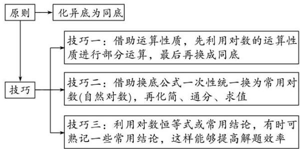

# 专题十二 指数式、对数式的运算

# 考点一 指数式的运算

# 【基本知识】

#### 1. 根式  
（1）根式的概念
若 $x^n = a$ ，则 $x$ 叫做 $a$ 的 $n$ 次方根，其中 $n > 1$ 且 $n \in \mathbf{N}^*$ 。式子 $\sqrt[n]{a}$ 叫做根式，这里 $n$ 叫做根指数， $a$ 叫做被开方数。  
（2）a 的 n 次方根的表示
$x ^ {n} = a \Rightarrow \left\{ \begin{array}{l l} x = \sqrt [ n ]{a} & \text {当} n \text {为奇数且} n > 1 \text {时,} \\ x = \pm \sqrt [ n ]{a} & \text {当} n \text {为偶数且} n > 1 \text {时.} \end{array} \right.$  
（3）根式的性质

① $(\sqrt[n]{a})^{n}=a(a$ 使 $\sqrt[n]{a}$ 有意义).  
②当 n 是奇数时， $\sqrt[n]{a^{n}}=a$ ；当 n 是偶数时， $\sqrt[n]{a^{n}}=|a|=\begin{cases}a,&a\geq0,\\-a,&a<0.\end{cases}$

#### 2. 有理数指数幂  
（1）分数指数幂的意义

①正分数指数幂： $a^{\frac{m}{n}}=\sqrt[n]{a^{m}}(a>0,\ m,\ n\in\mathbf{N}^{*},\ \text{且}\ n>1).$   
②负分数指数幂： $a^{-\frac{m}{n}} = \frac{\frac{m}{n}}{a} = \frac{1}{\sqrt[n]{a^m}} (a > 0, m, n \in \mathbf{N}^*$ ，且 $n > 1)$ .  
③0 的正分数指数幂等于 0, 0 的负分数指数幂没有意义.  
（2）有理数指数幂的运算性质

① $a^{r}\cdot a^{s}=a^{r+s}(a>0,\ r,\ s\in\mathbf{Q})$ ; ② $\frac{a^{r}}{a^{s}}=a^{r-s}(a>0,\ r,\ s\in\mathbf{Q})$ ;   
③ $(a^{r})^{s}=a^{rs}(a>0,\ r,\ s\in\mathbf{Q});$ ④ $(ab)^{r}=a^{r}b^{r}(a>0,\ b>0,\ r\in\mathbf{Q}).$

注意：（1）有理数指数幂的运算性质中，要求指数的底数都大于0，否则不能用性质来运算.  
（2）有理数指数幂的运算性质也适用于无理数指数幂.

# 【方法总结】

# 指数幂运算的一般原则  
（1）有括号的先算括号里的，无括号的先做指数运算.   
（2）先乘除后加减，负指数幂化成正指数幂的倒数.   
（3）底数是负数，先确定符号；底数是小数，先化成分数；底数是带分数的，先化成假分数.   
（4）若是根式，应化为分数指数幂，尽可能用幂的形式表示，运用指数幂的运算性质来解答.  
（5）运算结果不能同时含有根号和分数指数，也不能既有分母又含有负指数，形式力求统一.

# 【例题选讲】

[例 1] 计算：（1） $\left(\frac{2\frac{3}{5}}{5}\right)^{0}+2^{-2}\cdot\left(\frac{2\frac{1}{4}}{4}\right)^{-\frac{1}{2}}-(0.01)^{0.5}=$ \_\_\_\_；
答案 $\frac{16}{15}$ 解析 原式= $1+\frac{1}{4}\times\left(\frac{4}{9}\right)\frac{1}{2}-\left(\frac{1}{100}\right)\frac{1}{2}=1+\frac{1}{4}\times\frac{2}{3}-\frac{1}{10}=1+\frac{1}{6}-\frac{1}{10}=\frac{16}{15}.$  
（2） $(0.027)^{-\frac{1}{3}} - \left(\frac{1}{7}\right)^{-2} + \left(2\frac{7}{9}\right)\frac{1}{2} - (\sqrt{2} - 1)^{0} =$
答案 -45 解析 原式= $\left(\frac{27}{1000}\right)-\frac{1}{3}-7^{2}+\left(\frac{25}{9}\right)\frac{1}{2}-1=\frac{10}{3}-49+\frac{5}{3}-1=-45.$  
（3） $\sqrt[3]{a_{2}^{\frac{9}{2}}\sqrt{a^{-3}}}\div\sqrt[3]{\sqrt{a^{-7}}\sqrt[3]{a^{13}}}=$ \_\_\_\_；
答案 1 解析 原式 $= (a_{2}^{9} a^{-\frac{3}{2}})^{\frac{1}{3}} \div (a^{-\frac{7}{3}} a^{\frac{13}{3}})^{\frac{1}{2}} = (a^{3})^{\frac{1}{3}} \div (a^{2})^{\frac{1}{2}} = a \div a = 1.$  
（4） $\frac{5}{6} a_{3}^{\frac{1}{2}} b^{-2} \cdot (-3a^{-\frac{1}{2}} b^{-1}) \div (4a_{3}^{\frac{2}{2}} b^{-3})_{2}^{\frac{1}{2}} (a, b > 0) =$ \_\_\_\_;
答案 $-\frac{5\sqrt{ab}}{4ab^{2}}$ 解析 原式 $=-\frac{5}{2}a^{-\frac{1}{6}}b^{-3}\div(4a_{3}^{\frac{2}{3}}\cdot b^{-3})_{2}^{\frac{1}{2}}=-\frac{5}{4}a^{-\frac{1}{6}}b^{-3}\div(a_{3}^{\frac{1}{3}}b^{-\frac{3}{2}})=-\frac{5}{4}a^{-\frac{1}{2}}\cdot b^{-\frac{3}{2}}=-\frac{5}{4}\cdot\frac{1}{\sqrt{ab^{3}}}=-\frac{5\sqrt{ab}}{4ab^{2}}.$  
（5） 若 $x^{\frac{1}{2}} + x^{-\frac{1}{2}} = 3$ ，则 $\frac{\frac{3}{x^2} + x^- + 2}{x^2 + x^{-2} + 3} =$ \_\_\_\_.
答案 $\frac{2}{5}$ 解析 由 $x^{\frac{1}{2}} + x^{-\frac{1}{2}} = 3$ ，得 $x + x^{-1} + 2 = 9$ ，所以 $x + x^{-1} = 7$ ，所以 $x^{2} + x^{-2} + 2 = 49$ ，所以 $x^{2} + x^{-2} = 47$ 。因为 $x^{\frac{3}{2}} + x^{-\frac{3}{2}} = (x^{\frac{1}{2}} + x^{-\frac{1}{2}})^{3} - 3(x^{\frac{1}{2}} + x^{-\frac{1}{2}}) = 27 - 9 = 18$ ，所以原式 $= \frac{18 + 2}{47 + 3} = \frac{2}{5}$ 。

# 【对点训练】

1. 若实数 $a > 0$ ，则下列等式成立的是( )

A. $(-2)^{-2} = 4$

B. $2a^{-3} = \frac{1}{2a^3}$

C. $(-2)^{0} = -1$

D. $(a^{-\frac{1}{4}})^4 = \frac{1}{a}$

1. 答案 D 解析 对于 A, $(-2)^{-2}=\frac{1}{4}$ ，故 A 错误；对于 B, $2a^{-3}=\frac{2}{a^{3}}$ ，故 B 错误；对于 C, $(-2)^{0}=1$ ，故 C 错误；对于 D, $(a^{-\frac{1}{4}})^{4}=\frac{1}{a}$ ，故 D 正确.

2. 化简 $4a_{3}^{\frac{2}{3}} \cdot b^{-\frac{1}{3}} \div (-\frac{2}{3})a^{-\frac{1}{3}} \cdot b^{\frac{2}{3}}$ 的结果为( )

A. $-\frac{2a}{3b}$

B. $-\frac{8a}{b}$

C. $-\frac{6a}{b}$

D. -6ab

2. 答案 C 解析 原式 $= -6a^{\frac{2}{3} - \left(-\frac{1}{3}\right)}b^{-\frac{1}{3} - \frac{2}{3}} = -6ab^{-1} = -\frac{6a}{b}$ .

3. $(\sqrt[3]{\sqrt[6]{a^9}})^4 (\sqrt[6]{\sqrt[3]{a^9}})^4 (a > 0)$ 等于( )

A. $a^{16}$

B. $a^{8}$

C. $a^{4}$

D. $a^{2}$

3. 答案 C 解析 原式= $a^{\frac{9}{6}\times\frac{1}{3}\times4}a^{\frac{9}{3}\times\frac{1}{6}\times4}=a^{2}a^{2}=a^{2+2}=a^{4}$ .

4. 已知 $2^{a} = 5^{b} = m$ ，且 $\frac{1}{a} + \frac{1}{b} = 2$ ，则 $m$ 等于（）

A. $\sqrt{10}$

B. 10

C. 20

D. 100

4. 解析 A 解析 由题意得 m>0，∵ $2^{a}=m$ ， $5^{b}=m$ ，∴ $2=m^{\frac{1}{a}}$ ， $5=m^{\frac{1}{b}}$ ，∵ $2\times5=m^{\frac{1}{a}}\cdot m^{\frac{1}{b}}=m^{\frac{1}{a}+\frac{1}{b}}$ ，∴ $m^{2}=10$ ，∴ $m=\sqrt{10}$ .

5. 计算： $-\left(\frac{3}{2}\right)^{-2}+\left(-\frac{27}{8}\right)^{-\frac{2}{3}}+(0.002)^{-\frac{1}{2}}=$ \_\_\_\_.

5. 答案 $10\sqrt{5}$ 解析 原式 $= -\left(\frac{2}{3}\right)^{2} + \left[\left(-\frac{3}{2}\right)^{3}\right] - \frac{2}{3} + \left(\frac{1}{500}\right) - \frac{1}{2} = -\frac{4}{9} + \frac{4}{9} + 10\sqrt{5} = 10\sqrt{5}$ .

6. 化简： $\left(\frac{1}{4}\right)^{-\frac{1}{2}}\cdot\frac{\left(\sqrt{4ab^{-1}}\right)^{3}}{\left(0.1\right)^{-1}\cdot\left(a^{3}\cdot b^{-3}\right)\frac{1}{2}}(a>0,\quad b>0)=$ \_\_\_\_.

6. 答案 $\frac{8}{5}$ 解析 原式 $= 2 \times \frac{2^3 \cdot a^{\frac{3}{2}} \cdot b - \frac{3}{2}}{10 \cdot a^{\frac{3}{2}} \cdot b - \frac{3}{2}} = 2^{1 + 3} \times 10^{-1} = \frac{8}{5}$ .

7. $\left(-\frac{27}{8}\right)^{-\frac{2}{3}} + 0.002 - \frac{1}{2} - 10(\sqrt{5} - 2)^{-1} + \pi^0 =$

7. 答案 $-\frac{167}{9}$ 解析 原式= $\left(-\frac{3}{2}\right)^{-2}+500^{\frac{1}{2}}-\frac{10(\sqrt{5}+2)}{(\sqrt{5}-2)(\sqrt{5}+2)}+1=\frac{4}{9}+10\sqrt{5}-10\sqrt{5}-20+1=-\frac{167}{9}.$

8. 若 $x > 0$ ，则 $(2x^{\frac{1}{4}} + 3^{\frac{3}{2}})(2x^{\frac{1}{4}} - 3^{\frac{3}{2}}) - 4x^{-\frac{1}{2}} (x - x^{\frac{1}{2}}) =$ \_\_\_\_.

8. 答案 -23 解析 因为 $x > 0$ ，所以原式 $= (2x^{\frac{1}{4}})^2 - (3^{\frac{3}{2}})^2 - 4x^{-\frac{1}{2}} \cdot x + 4x^{-\frac{1}{2}} \cdot x^{\frac{1}{2}} = 4x^{\frac{1}{4 \times 2}} \times 2 - 3^{\frac{3}{2 \times 2}} - 4x^{-\frac{1}{2} + 1} + 4x^{-\frac{1}{2} + \frac{1}{2}} = 4x^{\frac{1}{2}} - 3^3 - 4x^{\frac{1}{2}} + 4x^0 = -27 + 4 = -23.$

9. $\left[ \begin{array}{c} \frac{1}{5} \\ 0.064 \end{array} \right]^{-2.5}$ $\frac{2}{3} - \sqrt[3]{9 \times \frac{3}{8}} - \pi^0 =$ \_\_\_\_.

9. 答案 0 解析 原式 $= \left[\left(\frac{4}{10}\right)^3\right]\frac{1}{5} \times \left(-\frac{5}{2}\right) \times \frac{2}{3} - \left[\left(\frac{3}{2}\right)^3\right]\frac{1}{3} - 1 = \frac{5}{2} - \frac{3}{2} - 1 = 0.$

10. 已知 $\frac{3a}{2} + b = 1$ ，则 $\frac{9^a \times 3^b}{\sqrt{3^a}} =$ \_\_\_\_.

10. 答案 3 解析 由 $\frac{3a}{2} + b = 1$ ，得 $\frac{9^a \times 3^b}{\sqrt{3^a}} = 3^{2a} \times 3^{-\frac{3a}{2}} \times 3^{-\frac{a}{2}} = 3^{2a+1 - \frac{3a}{2} - \frac{a}{2}} = 3.$

11. 计算下列各式:  
（1） $\left(-x^{\frac{1}{3}}y^{-\frac{1}{3}}\right)\left(3x^{-\frac{1}{2}}y^{\frac{2}{3}}\right)\left(-2x^{\frac{1}{6}}y^{\frac{2}{3}}\right)$ ; （2） $2x^{\frac{1}{4}}\left(-3x^{\frac{1}{4}}y^{-\frac{1}{3}}\right)\div\left(-6x^{-\frac{3}{2}}y^{-\frac{4}{3}}\right)$ .

11. 解 （1） $\left(-x^{\frac{1}{3}}y^{-\frac{1}{3}}\right)\left(3x^{-\frac{1}{2}}y^{\frac{2}{3}}\right)\left(-2x^{\frac{1}{6}}y^{\frac{2}{3}}\right) = [-1\times 3\times (-2)]x^{\frac{1}{3} -\frac{1}{2} +\frac{1}{6}}y^{-\frac{1}{3} +\frac{2}{3} +\frac{2}{3}} = 6x^{0}y^{1} = 6y.$  
（2） $2x^{\frac{1}{4}}\left(-3x^{\frac{1}{4}}y^{-\frac{1}{3}}\right)\div\left(-6x^{-\frac{3}{2}}y^{-\frac{4}{3}}\right)=[2\times(-3)\div(-6)]x^{\frac{1}{4}+\frac{1}{4}+\frac{3}{2}}y^{-\frac{1}{3}+\frac{4}{3}}=x^{2}y.$

12. 计算:  
（1） $7\sqrt[3]{3} - 3\sqrt[3]{24} - 6\sqrt[3]{\frac{1}{9}} + \sqrt[4]{3\sqrt[3]{3}};$  
（2） $0.0081^{-\frac{1}{4}} - \left[3 \times \left(\frac{7}{8}\right)^{0}\right]^{-1} \times \left[81^{-0.25} + \left(3\frac{3}{8}\right)^{-\frac{1}{3}}\right]^{\frac{1}{2}} - 10 \times 0.027^{\frac{1}{3}}.$

12. 解 （1） 原式 $= 7 \times 3^{\frac{1}{3}} - 3 \times 3^{\frac{1}{3}} \times 2 - 6 \times 3^{-\frac{2}{3}} + \left(3 \times 3^{\frac{1}{3}}\right)^{\frac{1}{4}} = 3^{\frac{1}{3}} - 6 \times 3^{-\frac{2}{3}} + 3^{\frac{1}{3}}$
$= 2 \times 3 ^ {\frac {1}{3}} - 2 \times 3 \times 3 ^ {- \frac {2}{3}} = 2 \times 3 ^ {\frac {1}{3}} - 2 \times 3 ^ {\frac {1}{3}} = 0.$  
（2）原式 $= \left[\left(\frac{3}{10}\right)^4\right]^{-\frac{1}{4}} - (3\times 1)^{-1}\times \left[3^{-1} + \left(\frac{3}{2}\right)^{-1}\right]^{\frac{1}{2}} - 10\times \left(0.3^{3}\right)^{\frac{1}{3}}$
$= \left(\frac {3}{1 0}\right) ^ {- 1} - \frac {1}{3} \times \left(\frac {1}{3} + \frac {2}{3}\right) ^ {- \frac {1}{2}} - 1 0 \times 0. 3 = \frac {1 0}{3} - \frac {1}{3} - 3 = 0.$

# 考点二 对数式的运算

# 【知识梳理】

#### 1. 对数的概念  
（1）对数的定义
如果 $a^x = N(a > 0$ ，且 $a \neq 1)$ ，那么数 $x$ 叫做以 $a$ 为底 $N$ 的对数，记作 $x = \log_a N$ ，其中 $a$ 叫做对数的底数， $N$ 叫做真数.  
（2）几种常见对数

<table><tr><td>对数形式</td><td>特点</td><td>记法</td></tr><tr><td>一般对数</td><td>底数为a(a&gt;0,且a≠1)</td><td> $\log_a N$ </td></tr><tr><td>常用对数</td><td>底数为10</td><td>lgN</td></tr><tr><td>自然对数</td><td>底数为e</td><td>lnN</td></tr></table>

#### 2. 对数恒等式
$a ^ {\log_ {a} N} = N (a > 0 \text {且} a \neq 1, N > 0).$

#### 3. 对数的性质  
（1）1 的对数是零，即 $\log_{a}1=0(a>0$ 且 $a\neq1)$ ;  
（2）底数的对数等于1，即 $\log_{a}a=1(a>0$ 且 $a\neq1)$ ;   
（3）负数和零没有对数.

#### 4. 对数的运算法则
如果 a>0，且 $a\neq1$ ，M>0，N>0，那么
$① \log_ {a} (M N) = \log_ {a} M + \log_ {a} N; ② \log_ {a} \frac {M}{N} = \log_ {a} M - \log_ {a} N; ③ \log_ {a} M ^ {n} = n \log_ {a} M (n \in \mathbf {R});$

#### 5. 对数的换底公式及推广

换底公式： $\log_{b}N=\frac{\log_{a}N}{\log_{a}b}(a,\ b\text{均大于零，且不等于1});$

推广：（1） $\log_{a}b\cdot\log_{b}a=1$ ，即 $\log_{a}b=\frac{1}{\log_{b}a}(a,\ b$ 均大于0且不等于1);  
（2） $\log_{a}^{m}b^{n}=\frac{n}{m}\log_{a}b(a,\ b\text{均大于0且不等于1，}m\neq0,\ n\in\mathbf{R});$

# 【方法总结】

# 对数运算问题的基本原则和方法  
（1）基本原则：对数的化简求值一般是正用或逆用公式，对真数进行处理，选哪种策略化简，取决于问题的实际情况，一般本着便于真数化简的原则进行.  
（2）两种常用的方法: ① “收”, 将同底的两对数的和(差)收成积(商)的对数;

② “拆”，将积(商)的对数拆成同底的两对数的和(差).  
（3）利用换底公式进行化简求值的原则和技巧

# 【例题选讲】

[例 2] 计算下列各式:  
（1） $\frac{\lg 2+\lg 5-\lg 8}{\lg 50-\lg 40}=$ \_\_\_\_;
答案 1 解析 原式= $\frac{\lg\frac{2\times5}{8}}{\lg\frac{50}{40}}=\frac{\lg\frac{5}{4}}{\lg\frac{5}{4}}=1;$  
（2） $\frac{\lg 3 + \frac{2}{5}\lg 9 + \frac{3}{5}\lg\sqrt{27} - \lg\sqrt{3}}{\lg 81 - \lg 27} =$ \_\_\_\_;
答案 $\frac{11}{5}$ 解析 法一：原式= $\frac{\lg 3+\frac{4}{5}\lg 3+\frac{9}{10}\lg 3-\frac{1}{2}\lg 3}{4\lg 3-3\lg 3}=\frac{\left(1+\frac{4}{5}+\frac{9}{10}-\frac{1}{2}\right)\lg 3}{4-3\lg 3}=\frac{11}{5}$ ;

法二：原式= $\frac{\frac{213}{\lg\frac{25}{3}}3\times9\times27\times3}{\lg\frac{81}{27}}=\frac{\frac{11}{\lg3}}{\lg3}=\frac{11}{5};$  
（3） $\lg 25 + \lg 2 \cdot \lg 50 + (\lg 2)^{2} =$ \_\_\_\_ ;
答案 2 解析 原式 $=(lg 2)^{2}+(1+lg 5)lg 2+lg 5^{2}=(lg 2+lg 5+1)lg 2+2lg 5=(1+1)lg 2+2lg 5=2(lg 2+lg 5)=2;$  
（4） $\frac{\sqrt{(\lg 3)^2 - \lg 9 + 1} (\lg \sqrt{27} + \lg 8 - \lg \sqrt{1000})}{\lg 0.3 \cdot \lg 1.2} =$ \_\_\_\_；
答案 $-\frac{3}{2}$ 解析 原式= $\frac{\sqrt{(\lg 3)^{2}-2\lg 3+1}\left(\frac{3}{2}\lg 3+3\lg 2-\frac{3}{2}\right)}{(\lg 3-1)\cdot(\lg 3+2\lg 2-1)}=\frac{(1-\lg 3)\cdot\frac{3}{2}(\lg 3+2\lg 2-1)}{(\lg 3-1)\cdot(\lg 3+2\lg 2-1)}=-\frac{3}{2};$  
（5） $\log_23\cdot \log_38 + (\sqrt{3})\log_34 =$
答案 5 解析 原式= $\frac{\lg 3}{\lg 2}.\frac{3\lg 2}{\lg 3}+3^{\frac{1}{2}\log_{3}4}=3+3^{\log_{3}2}=3+2=5;$  
（6） $(\log_32 + \log_92) \cdot (\log_43 + \log_83) =$ \_\_\_\_.
答案 $\frac{5}{4}$ 解析 原式 $= \left(\frac{\lg 2}{\lg 3} +\frac{\lg 2}{\lg 9}\right)\cdot \left(\frac{\lg 3}{\lg 4} +\frac{\lg 3}{\lg 8}\right) = \left(\frac{\lg 2}{\lg 3} +\frac{\lg 2}{2\lg 3}\right)\cdot \left(\frac{\lg 3}{2\lg 2} +\frac{\lg 3}{3\lg 2}\right) = \frac{3\lg 2}{2\lg 3}\cdot \frac{5\lg 3}{6\lg 2} = \frac{5}{4}.$

# 【对点训练】

13. $(\log_29)\cdot (\log_34) = ()$

A. $\frac{1}{4}$

B. $\frac{1}{2}$

C. 2

D. 4

13. 答案 D 解析 法一：原式 $= \frac{\lg 9}{\lg 2} \cdot \frac{\lg 4}{\lg 3} = \frac{2\lg 3 \cdot 2\lg 2}{\lg 2 \cdot \lg 3} = 4$ 。法二：原式 $= 2\log_23 \cdot \frac{\log_24}{\log_23} = 2 \times 2 = 4$ .

14. $(\log_29)(\log_32) + \log_{a}\frac{5}{4} +\log_a\left(\frac{4}{5} a\right)$ $(a > 0$ ，且 $a\neq 1)$ 的值为（

A. 2

B. 3

C. 4

D. 5

14. 答案 B 解析 原式 $= (2\log_23)(\log_32) + \log_a\left(\frac{5}{4} \times \frac{4}{5} a\right) = 2 \times 1 + \log_a a = 3.$

15. 如果 $2\log_a(P - 2Q) = \log_aP + \log_aQ(a > 0$ ，且 $a \neq 1$ ，那么 $\frac{P}{Q}$ 的值为（）

A. $\frac{1}{4}$

B. 4

C. 1

D. 4 或 1

15. 答案 B 解析 由 $2\log_a(P - 2Q) = \log_aP + \log_aQ$ ，得 $\log_a(P - 2Q)^2 = \log_a(PQ)$ . 由对数运算性质得 $(P - 2Q)^2 = PQ$ ，即 $P^2 - 5PQ + 4Q^2 = 0$ ，所以 $P = Q$ （舍去）或 $P = 4Q$ ，解得 $\frac{P}{Q} = 4$ .

16. $\sqrt{(\log_23)^2 - 4\log_23 + 4} +\log_2\frac{1}{3} = (\quad)$

A. 2

B. $2-2\log_{2}3$

C.-2

D. $2\log_{2}3 - 2$

16. 答案 B 解析 $\sqrt{(\log_23)^2 - 4\log_23 + 4} = \sqrt{(\log_23 - 2)^2} = 2 - \log_23$ ，又 $\log_2\frac{1}{3} = -\log_23$ ，两者相加即为 B.

17. 计算： $1+\lg 2\cdot\lg 5-\lg 2\cdot\lg 50-\log_{3}5\cdot\log_{25}9\cdot\lg 5=($

A. 1

B. 0

C. 2

D. 4

17. 答案 B 解析 原式 $= 1 + \lg 2 \cdot \lg 5 - \lg 2(1 + \lg 5) - \frac{\lg 5}{\lg 3} \cdot \frac{2 \lg 3}{2 \lg 5} \cdot \lg 5 = 1 + \lg 2 \cdot \lg 5 - \lg 2 - \lg 2 \cdot \lg 5 - \lg 5 = 1 - (\lg 2 + \lg 5) = 1 - \lg 10 = 1 - 1 = 0.$

18. 已知 $\lg a, \lg b$ 是方程 $2x^{2} - 4x + 1 = 0$ 的两个实根，则 $\lg (ab) \cdot \left[\frac{\lg a}{b}\right]^{2} = (\quad)$

A. 2

B. 4

C. 6

D. 8

18. 答案 B 解析 由已知，得 $\lg a + \lg b = 2$ ，即 $\lg (ab) = 2$ 。又 $\lg a \cdot \lg b = \frac{1}{2}$ ，所以 $\lg (ab) \cdot \left( \frac{\lg a}{b} \right)^2 = 2 (\lg a - \lg b)^2 = 2 [(\lg a + \lg b)^2 - 4 \lg a \cdot \lg b] = 2 \times \left( 2^2 - 4 \times \frac{1}{2} \right) = 2 \times 2 = 4$ ，故选 B.

19. $\log_{2}25\cdot\log_{3}(2\sqrt{2})\cdot\log_{5}9=$ \_\_\_\_.

19. 答案 6 解析 法一： $\log_225 \cdot \log_3(2\sqrt{2}) \cdot \log_59 = \log_25^2 \cdot \log_32^{\frac{3}{2}} \cdot \log_53^2 = 6\log_25 \cdot \log_32 \cdot \log_53 = 6.$

法二： $\log_225\cdot \log_3(2\sqrt{2})\cdot \log_59 = \frac{\lg 25}{\lg 2}\cdot \frac{\lg (2\sqrt{2})}{\lg 3}\cdot \frac{\lg 9}{\lg 5} = \frac{\lg 5^2}{\lg 2}\cdot \frac{\lg 2^{\frac{3}{2}}}{\lg 3}\cdot \frac{\lg 3^2}{\lg 5} = 6.$

20. 已知 $2^{x} = 12, \log_{2}\frac{1}{3} = y$ ，则 $x + y$ 的值为 \_\_\_\_.

20. 答案 2 解析 因为 $2^{x} = 12$ ，所以 $x = \log_{2}12$ ，所以 $x + y = \log_{2}12 + \log_{2}\frac{1}{3} = \log_{2}4 = 2$ .

21. $\frac{(1 - \log_63)^2 + \log_62\cdot\log_618}{\log_64} =$

21. 答案 1 解析 原式 $= \frac{(\log_66 - \log_63)^2 + \log_62 \cdot \log_618}{\log_62^2} = \frac{(\log_62)^2 + \log_62 \cdot \log_618}{2\log_62} = \frac{\log_62(\log_62 + \log_618)}{2\log_62} = \frac{\log_62 \cdot \log_6(2 \times 18)}{2\log_62} = \frac{\log_62 \cdot \log_636}{2\log_62} = \frac{2\log_62}{2\log_62} = 1.$

22. 计算： $\log_{5}[4\frac{1}{2}\log_{2}10-(3\sqrt{3})^{\frac{2}{3}}-7\log_{7}2]=$ \_\_\_\_.

22. 答案 1 解析 原式 $= \log_5[2\log_210 - (3\frac{3}{2})\frac{2}{3} - 2] = \log_5(10 - 3 - 2) = \log_55 = 1.$

23. 化简与求值:  
（1） $\log_{3}27+\lg\frac{1}{100}+\ln\sqrt{e}+2^{-1+\log_{2}3}$ ; （2） $\left(-\frac{1}{27}\right)^{-\frac{1}{3}}+(\log_{3}16)\times\left(\log_{2}\frac{1}{9}\right)$ .

23. 解 （1） $\log_3 27 + \lg \frac{1}{100} + \ln \sqrt{e} + 2^{-1 + \log_2 3} = \log_3 3^3 + \lg 10^{-2} + \ln e^{\frac{1}{2}} + \frac{1}{2} \times 2^{\log_2 3} = 3\log_3 3 - \lg 10^2 + \frac{1}{2} + \frac{1}{2} \times 3 = 3 - 2 + \frac{1}{2} + \frac{3}{2} = 3.$  
（2） $\left(-\frac{1}{27}\right)^{-\frac{1}{3}}+(\log_{3}16)\times\left(\log_{2}\frac{1}{9}\right)=\left(-\frac{1}{3}\right)^{3\times\left(-\frac{1}{3}\right)}+\frac{\lg 16}{\lg 3}\times\frac{\lg\frac{1}{9}}{\lg 2}=\left(-\frac{1}{3}\right)^{-1}+\frac{4\lg 2}{\lg 3}\times\frac{-2\lg 3}{\lg 2}=-3-8=-11.$

24. 计算下列各式的值:  
（1） $\log_{5}35+2\log_{\frac{1}{2}}\sqrt{2}-\log_{5}\frac{1}{50}-\log_{5}14;$  
（2） $(\log_2125 + \log_425 + \log_85)\cdot (\log_52 + \log_{25}4 + \log_{125}8)$ .

24. 解 （1） 原式 $= \log_{5} 35 + \log_{5} 50 - \log_{5} 14 + 2 \log_{\frac{1}{2}} 2^{\frac{1}{2}} = \log_{5} \frac{35 \times 50}{14} + \log_{\frac{1}{2}} 2 = \log_{5} 5^{3} - 1 = 2.$  
（2）方法一 原式= $\left(\log_{2}5^{3}+\frac{\log_{2}25}{\log_{2}4}+\frac{\log_{2}5}{\log_{2}8}\right)\left(\log_{5}2+\frac{\log_{5}4}{\log_{5}25}+\frac{\log_{5}8}{\log_{5}125}\right)=\left(3\log_{2}5+\frac{2\log_{2}5}{2\log_{2}2}+\frac{\log_{2}5}{3\log_{2}2}\right)$
$\left(\log_ {5} 2 + \frac {2 \log_ {5} 2}{2 \log_ {5} 5} + \frac {3 \log_ {5} 2}{3 \log_ {5} 5}\right) = \left(3 + 1 + \frac {1}{3}\right) \log_ {2} 5 \cdot (3 \log_ {5} 2) = 1 3 \log_ {2} 5 \cdot \frac {\log_ {2} 2}{\log_ {2} 5} = 1 3.$
方法二 原式 $= \left(\frac{\lg 125}{\lg 2} + \frac{\lg 25}{\lg 4} + \frac{\lg 5}{\lg 8}\right)\left(\frac{\lg 2}{\lg 5} + \frac{\lg 4}{\lg 25} + \frac{\lg 8}{\lg 125}\right) = \left(\frac{3\lg 5}{\lg 2} + \frac{2\lg 5}{2\lg 2} + \frac{\lg 5}{3\lg 2}\right)\left(\frac{\lg 2}{\lg 5} + \frac{2\lg 2}{2\lg 5} + \frac{3\lg 2}{3\lg 5}\right) =$ $\left(\frac{13\lg 5}{3\lg 2}\right)\left(3\frac{\lg 2}{\lg 5}\right) = 13.$

