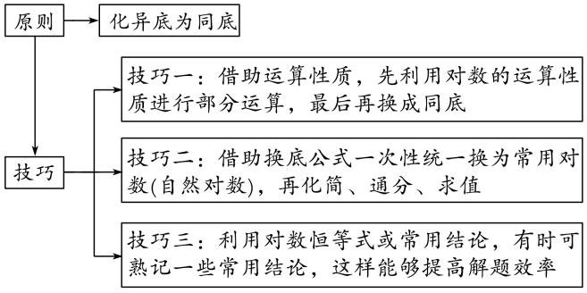

**专题十二　指数式、对数式的运算**

**考点一　指数式的运算**

【**基本知识**】

1．根式

(1)根式的概念

若<em>xn</em>＝<em>a</em>，则<em>x</em>叫做<em>a</em>的<em>n</em>次方根，其中<em>n</em>＞1且<em>n</em>∈<strong>N</strong>\*．式子叫做根式，这里<em>n</em>叫做根指数，<em>a</em>叫做被开方数．

(2)*a*的*n*次方根的表示

<em>xn</em>＝<em>a</em>⇒

(3)根式的性质

①()<em>n</em>＝<em>a</em>(<em>a</em>使有意义)．

②当*n*是奇数时，＝；当*n*是偶数时，＝|*a*|＝

2．有理数指数幂

(1)分数指数幂的意义

①正分数指数幂：<em>a</em>＝(<em>a</em>&gt;0，<em>m</em>，<em>n</em>∈<strong>N</strong>\*，且<em>n</em>&gt;1)．

②负分数指数幂：<em>a</em>＝＝(<em>a</em>&gt;0，<em>m</em>，<em>n</em>∈<strong>N</strong>\*，且<em>n</em>&gt;1)．

③0的正分数指数幂等于0，0的负分数指数幂没有意义．

(2)有理数指数幂的运算性质

①<em>ar</em>·<em>as</em>＝<em>ar</em>＋<em>s</em>(<em>a</em>&gt;0，<em>r</em>，<em>s</em>∈<strong>Q</strong>)；②＝<em>ar</em>－<em>s</em>(<em>a</em>&gt;0，<em>r</em>，<em>s</em>∈<strong>Q</strong>)；

③(<em>ar</em>)<em>s</em>＝<em>ars</em>(<em>a</em>&gt;0，<em>r</em>，<em>s</em>∈<strong>Q</strong>)；④(<em>ab</em>)<em>r</em>＝<em>arbr</em>(<em>a</em>&gt;0，<em>b</em>&gt;0，<em>r</em>∈<strong>Q</strong>)．

注意：(1)有理数指数幂的运算性质中，要求指数的底数都大于0，否则不能用性质来运算．

(2)有理数指数幂的运算性质也适用于无理数指数幂．

【**方法总结**】

指数幂运算的一般原则

(1)有括号的先算括号里的，无括号的先做指数运算．

(2)先乘除后加减，负指数幂化成正指数幂的倒数．

(3)底数是负数，先确定符号；底数是小数，先化成分数；底数是带分数的，先化成假分数．

(4)若是根式，应化为分数指数幂，尽可能用幂的形式表示，运用指数幂的运算性质来解答．

(5)运算结果不能同时含有根号和分数指数，也不能既有分母又含有负指数，形式力求统一．

**【例题选讲】**

<strong>[例1]</strong> 计算：(1) 0＋2－2·－(0.01)0.5＝\_\_\_\_\_\_\_\_；

答案　　解析　原式＝1＋×－＝1＋×－＝1＋－＝．

(2) (0.027)－－－2＋－(－1)0＝\_\_\_\_\_\_\_\_；

答案　－45　解析　原式＝－－72＋－1＝－49＋－1＝－45．

(3) ÷＝\_\_\_\_\_\_\_\_；

答案　1　解析　原式＝(<em>aa</em>－)÷(<em>a</em>－<em>a</em>)＝(<em>a</em>3)÷(<em>a</em>2)＝<em>a</em>÷<em>a</em>＝1．

(4) <em>ab</em>－2·(－3<em>a</em>－<em>b</em>－1)÷(4<em>ab</em>－3)(<em>a</em>，<em>b</em>&gt;0) ＝\_\_\_\_\_\_\_\_；

答案　－　解析　原式＝－<em>a</em>－<em>b</em>－3÷(4<em>a</em>·<em>b</em>－3)＝－<em>a</em>－<em>b</em>－3÷(<em>ab</em>－)＝－<em>a</em>－·<em>b</em>－＝－·＝－．

(5) 若*x*＋*x*＝3，则＝\_\_\_\_\_\_\_\_．

答案　　解析　由<em>x</em>＋<em>x</em>＝3，得<em>x</em>＋<em>x</em>－1＋2＝9，所以<em>x</em>＋<em>x</em>－1＝7，所以<em>x</em>2＋<em>x</em>－2＋2＝49，所以<em>x</em>2＋<em>x</em>－2＝47．因为<em>x</em>＋<em>x</em>＝(<em>x</em>＋<em>x</em>)3－3(<em>x</em>＋<em>x</em>)＝27－9＝18，所以原式＝＝．

【**对点训练**】

1．若实数*a*>0，则下列等式成立的是(　　)

A．(－2)－2＝4　　　　B．2<em>a</em>－3＝　　　　C．(－2)0＝－1　　　　D．(<em>a</em>)4＝

1．答案　D　解析　对于A，(－2)－2＝，故A错误；对于B，2<em>a</em>－3＝，故B错误；对于C，(－2)0＝1，

故C错误；对于D，(<em>a</em>)4＝，故D正确．

2．化简4<em>a</em>·<em>b</em>－÷(－)<em>a</em>－·<em>b</em>的结果为(　　)

A．－　　　　　　　　B．－　　　　　　　　C．－　　　　　　　　D．－6*ab*

2．答案　C　解析　原式＝－6<em>a</em>－(－) <em>b</em>－－＝－6<em>ab</em>－1＝－．

3．()4()4(<em>a</em>&gt;0)等于(　　)

A．<em>a</em>16　　　　　　　　B．<em>a</em>8　　　　　　　　C．<em>a</em>4　　　　　　　　D．<em>a</em>2

3．答案　C　解析　原式＝＝<em>a</em>2<em>a</em>2＝<em>a</em>2＋2＝<em>a</em>4．

4．已知2<em>a</em>＝5<em>b</em>＝<em>m</em>，且＋＝2，则<em>m</em>等于(　　)

A．　　　　　　　　B．10　　　　　　　　C．20　　　　　　　　D．100

4．解析　A　解析　由题意得<em>m</em>&gt;0，∵2<em>a</em>＝<em>m，</em>5<em>b</em>＝<em>m</em>，∴2＝，5＝，∵2×5＝·＝，

∴<em>m</em>2＝10，∴<em>m</em>＝．

5．计算：－－2＋＋(0.002)＝\_\_\_\_\_\_\_\_．

5．答案　10　解析　原式＝－2＋＋＝－＋＋10＝10．

6．化简：·(*a*＞0，*b*＞0)＝\_\_\_\_\_\_\_\_．

6．答案　　解析　原式＝2×＝21＋3×10－1＝．

7．＋0.002－－10(－2)－1＋π0＝\_\_\_\_\_\_\_\_．

7．答案　－　解析　原式＝＋500－＋1＝＋10－10－20＋1＝－

．

8．若*x*>0，则(2*x*＋3)(2*x*－3)－4*x* (*x*－*x*)＝\_\_\_\_\_\_\_\_．

8．答案　－23　解析　因为<em>x</em>&gt;0，所以原式＝(2<em>x</em>)2－(3)2－4<em>x</em>·<em>x</em>＋4<em>x</em>·<em>x</em>＝4<em>x</em>×2－3－4<em>x</em>

＋4<em>x</em>＝4<em>x</em>－33－4<em>x</em>＋4<em>x</em>0＝－27＋4＝－23．

9． －－π0＝\_\_\_\_\_\_\_\_．

9．答案　0　解析　　原式＝－－1＝－－1＝0．

10．已知＋*b*＝1，则＝\_\_\_\_\_\_\_\_．

10．答案　3　解析　　由＋<em>b</em>＝1，得＝32<em>a</em>×3 ×3＝3＝3．

11．计算下列各式：

(1)；(2) ÷．

11．解　(1)＝[－1×3×(－2)]＝6<em>x</em>0<em>y</em>1＝6<em>y</em>．

(2)÷＝[2×(－3)÷(－6)] ＝<em>x</em>2<em>y</em>．

12．计算：

(1)7－3－6＋；

(2)－－1×－10× ．

12．解　(1)原式＝7× －3××2－6×＋＝－6×＋

＝2×－2×3×＝2×－2×＝0．

(2)原式＝ －(3×1)－1× －10×

＝－1－× －10×0.3＝－－3＝0．

**考点二　对数式的运算**

【**知识梳理**】

1．对数的概念

(1)对数的定义

如果<em>ax</em>＝<em>N</em>(<em>a</em>&gt;0，且<em>a</em>≠1)，那么数<em>x</em>叫做以<em>a</em>为底<em>N</em>的对数，记作<em>x</em>＝log<em>aN</em>，其中<em>a</em>叫做对数的底数，<em>N</em>叫做真数．

(2)几种常见对数

<table><tr><td>
对数形式
</td><td>
特点
</td><td>
记法
</td></tr><tr><td>
一般对数
</td><td>
底数为<em>a</em>(<em>a</em>&gt;0，且<em>a</em>≠1)
</td><td>
log<em>aN</em>
</td></tr><tr><td>
常用对数
</td><td>
底数为10
</td><td>
lg<em>N</em>
</td></tr><tr><td>
自然对数
</td><td>
底数为e
</td><td>
ln<em>N</em>
</td></tr></table>

2．对数恒等式

<em>a</em>log<em>aN</em>＝<em>N</em> (<em>a</em>&gt;0且<em>a</em>≠1，<em>N</em>&gt;0)．

3．对数的性质

(1)1的对数是零，即log<em>a</em>1＝0(<em>a</em>&gt;0且<em>a</em>≠1)；

(2)底数的对数等于，即log<em>aa</em>＝1(<em>a</em>&gt;0且<em>a</em>≠1)；

(3)负数和零没有对数．

4．对数的运算法则

如果*a*>0，且*a*≠1，*M*>0，*N*>0，那么

①log<em>a</em>(<em>MN</em>)＝log<em>aM</em>＋log<em>aN</em>；②log<em>a</em>＝log<em>aM</em>－log<em>aN</em>；③log<em>aMn</em>＝<em>n</em>log<em>aM</em>(<em>n</em>∈<strong>R</strong>)；

5．对数的换底公式及推广

换底公式：log<em>bN</em>＝(<em>a</em>，<em>b</em>均大于零，且不等于1)；

推广：(1)log<em>ab</em>·log<em>ba</em>＝1，即log<em>ab</em>＝(<em>a</em>，<em>b</em>均大于0且不等于1)；

(2)log<em>ambn</em>＝log<em>ab</em>(<em>a</em>，<em>b</em>均大于0且不等于1，<em>m</em>≠0，<em>n</em>∈<strong>R</strong>)；

【**方法总结**】

对数运算问题的基本原则和方法

(1)基本原则：对数的化简求值一般是正用或逆用公式，对真数进行处理，选哪种策略化简，取决于问题的实际情况，一般本着便于真数化简的原则进行．

(2)两种常用的方法：①“收”，将同底的两对数的和(差)收成积(商)的对数；

②“拆”，将积(商)的对数拆成同底的两对数的和(差)．

(3)利用换底公式进行化简求值的原则和技巧

**【例题选讲】**

**[例2]** 计算下列各式：

(1)＝\_\_\_\_\_\_\_\_；

答案　1　解析　原式＝＝＝1；

(2) ＝\_\_\_\_\_\_\_\_；

答案　　解析　法一：原式＝＝＝；

法二：原式＝＝＝；

(3) lg 25＋lg 2·lg 50＋(lg 2)2＝\_\_\_\_\_\_\_\_；

答案　2　解析　原式＝(lg 2)2＋(1＋lg 5)lg 2＋lg 52＝(lg 2＋lg 5＋1)lg 2＋2lg 5＝(1＋1)lg 2＋2lg 5＝2(lg 2＋lg 5)＝2；

(4) ＝\_\_\_\_\_\_\_\_；

答案　－　解析　原式＝＝＝－；

(5) log23·log38＋()log34＝\_\_\_\_\_\_\_\_；

答案　5　解析　原式＝·＋3＝3＋3＝3＋2＝5；

(6)(log32＋log92)·(log43＋log83)＝\_\_\_\_\_\_\_\_．

答案　　解析　原式＝·＝·＝·＝．

【**对点训练**】

13．(log29)·(log34)＝(　　)

A．　　　　　　　　B．　　　　　　　　C．2　　　　　　　　D．4

13．答案　D　解析　法一：原式＝·＝＝4．法二：原式＝2log23·＝2×2＝4．

14．(log29)(log32)＋log<em>a</em>＋log<em>a</em>(<em>a</em>&gt;0，且<em>a</em>≠1)的值为(　　)

A．2　　　　　　　　B．3　　　　　　　　C．4　　　　　　　　D．5

14．答案　B　解析　原式＝(2log23)(log32)＋log<em>a</em>＝2×1＋log<em>aa</em>＝3．

15．如果2log<em>a</em>(<em>P</em>－2Q)＝log<em>aP</em>＋log<em>a</em>Q(<em>a</em>&gt;0，且<em>a</em>≠1)，那么的值为(　　)

A．　　　　　　　　B．4　　　　　　　　C．1　　　　　　　　D．4或1

15．答案　B　解析　由2log<em>a</em>(<em>P</em>－2Q)＝log<em>aP</em>＋log<em>a</em>Q，得log<em>a</em>(<em>P</em>－2Q)2＝log<em>a</em>(<em>P</em>Q)．由对数运算性质得(<em>P</em>

－2Q)2＝<em>P</em>Q，即<em>P</em>2－5<em>P</em>Q＋4Q2＝0，所以<em>P</em>＝Q(舍去)或<em>P</em>＝4Q，解得＝4．

16．＋log2＝(　　)

A．2　　　　　　　　B．2－2log23　　　　　　　　C．－2　　　　　　　　D．2log23－2

16．答案　B　解析　＝＝2－log23，又log2＝－log23，两者相加即为B．

17．计算：1＋lg 2·lg 5－lg 2·lg 50－log35·log259·lg 5＝(　　)

A．1　　　　　　　　B．0　　　　　　　　C．2　　　　　　　　D．4

17．答案　B　解析　原式＝1＋lg 2·lg 5－lg 2(1＋lg 5)－··lg 5＝1＋lg 2·lg 5－lg 2－lg 2·lg 5－lg 5

＝1－(lg 2＋lg 5)＝1－lg 10＝1－1＝0．

18．已知lg <em>a</em>，lg <em>b</em>是方程2<em>x</em>2－4<em>x</em>＋1＝0的两个实根，则lg(<em>ab</em>)·2＝(　　)

A．2　　　　　　　　B．4　　　　　　　　C．6　　　　　　　　D．8

18．答案　B　解析　由已知，得lg <em>a</em>＋lg <em>b</em>＝2，即lg(<em>ab</em>)＝2．又lg <em>a</em>·lg <em>b</em>＝，所以lg(<em>ab</em>)·2＝2(lg <em>a</em>

－lg <em>b</em>)2＝2[(lg <em>a</em>＋lg <em>b</em>)2－4lg <em>a</em>·lg <em>b</em>]＝2×＝2×2＝4，故选B．

19．log225·log3(2)·log59＝\_\_\_\_\_\_\_\_．

19．答案　6　解析　法一：log225·log3(2)·log59＝log252·log32·log532＝6log25·log32·log53＝6．

法二：log225·log3(2)·log59＝··＝··＝6．

20．已知2<em>x</em>＝12，log2＝<em>y</em>，则<em>x</em>＋<em>y</em>的值为\_\_\_\_\_\_\_\_．

20．答案　2　解析　因为2<em>x</em>＝12，所以<em>x</em>＝log212，所以<em>x</em>＋<em>y</em>＝log212＋log2＝log24＝2．

21．＝\_\_\_\_\_\_\_\_．

21．答案　1　解析　原式＝＝＝＝

＝＝＝1．

22．计算：log5[4log210－(3)－7log72]＝\_\_\_\_\_\_\_\_．

22．答案　1　解析　原式＝log5[2log210－(3)－2]＝log5(10－3－2)＝log55＝1．

23．化简与求值：

(1)log327＋lg＋ln＋；(2)＋(log316)×．

23．解　(1)log327＋lg＋ln ＋＝log333＋lg 10－2＋＋×＝3log33－lg 102＋＋×3

＝3－2＋＋＝3．

(2)＋(log316)×＝＋×＝－1＋×＝－3－8＝－11．

24．计算下列各式的值：

(1)log535＋－log5－log514；

(2)(log2125＋log425＋log85)·(log52＋log254＋log1258)．

24．解　(1)原式＝log535＋log550－log514＋＝log5＋＝log553－1＝2．

(2)方法一　原式＝＝

＝log25·(3log52)＝13log25·＝13．

方法二　原式＝＝＝＝13．

