# 专题十三 对数函数

# 考点一 对数函数图象辨析

# 【基本知识】

#### 1. 对数函数的概念

函数 $y=\log_{a}x(a>0$ ，且 $a\neq1)$ 叫做对数函数，其中 x 是自变量，函数的定义域是 $(0,+\infty)$ .

#### 2. 对数函数的图象

<table><tr><td>函数</td><td> $y=\log_{a}x, a>1$ </td><td>\( y=\log_{a}x, 0</td></tr><tr><td>图象</td><td></td><td></td></tr><tr><td rowspan="2">图象特征</td><td colspan="2">在y轴右侧,过定点(1,0)</td></tr><tr><td>当x逐渐增大时,图象是上升的</td><td>当x逐渐增大时,图象是下降的</td></tr></table>

#### 3. 指数函数与对数函数的关系

指数函数 $y = a^{x} (a > 0$ ，且 $a \neq 1$ 与对数函数 $y = \log_{a} x (a > 0$ ，且 $a \neq 1$ 互为反函数，它们的图象关于直线 $y = x$ 对称.

# 【常用结论】  
（1）对数函数图象的画法

画对数函数 $y = \log_a x (a > 0$ ，且 $a \neq 1)$ 的图象，应抓住三个关键点：(1, 0)，(a, 1)， $\begin{bmatrix} 1, & -1 \\ a & \end{bmatrix}$ 和一条渐近线 $x = 0$ .  
（2）底数 a 与 1 的大小关系决定了对数函数图象的“升降”: 当 a>1 时, 对数函数的图象“上升”; 当 0<a<1 时, 对数函数的图象“下降”.  
（3）函数 $y=\log_{a}x$ 与 $y=\log_{a}^{1}x(a>0, \text{且 } a\neq1)$ 的图象关于 x 轴对称.  
（4）对数函数的图象与底数大小的比较
如图是对数函数（1） $y=\log_{a}x$ ，（2） $y=\log_{b}x$ ，（3） $y=\log_{c}x$ ，（4） $y=\log_{d}x$ 的图象，底数a，b，c，d与1之间的大小关系为 $c>d>1>a>b>0$ ．由此我们可得到以下规律：在第一象限内，对数函数 $y=\log_{a}x(a>0$ ，且 $a\neq1)$ 的图象越右，底数越大．简称“底大图右”.

# 【方法总结】

# 有关对数函数图象辨析的解题思路  
（1）已知函数解析式判断其图象, 一般是取特殊点, 判断选项中的图象是否过这些点, 若不满足则排除. （2）对于有关对数型函数的图象问题, 一般是从最基本的对数函数的图象入手, 通过平移、伸缩、对称变换而得到. 特别地, 当底数 $a$ 与 1 的大小关系不确定时应注意分类讨论.  
（3）根据对数函数图象判断底数大小的问题，可以通过底大图右进行判断.

# 【例题选讲】

[例 1] （1） 函数 $y=\lg|x-1|$ 的图象是()

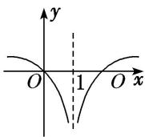  
A

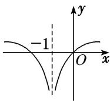  
B

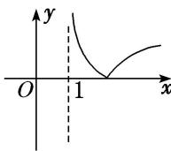  
C

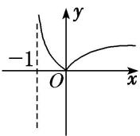  
D  
（2） 函数 $f(x)=|\log_{a}(x+1)|(a>0, \text{且 } a\neq1)$ 的大致图象是()

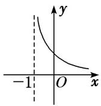  
A

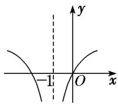  
B

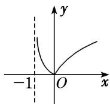  
C

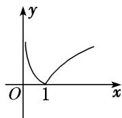  
D  
（3） 函数 $y=\log_{a}x$ 与 $y=-x+a$ 在同一坐标系中的图象可能是()

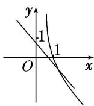  
A

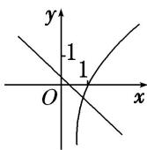  
B

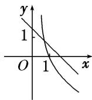  
C

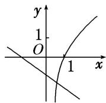  
D  
（4） 在同一直角坐标系中，函数 $f(x)=x^{a}(x\geq0)$ ， $g(x)=\log_{a}x(a>0$ 且 $a\neq1)$ 的图象可能是()

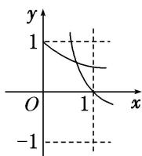  
A

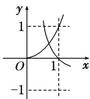  
B

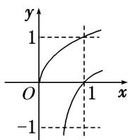  
C

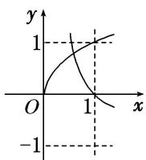  
D  
（5） (2019·浙江) 在同一直角坐标系中，函数 $y=\frac{1}{a^{x}}$ ， $y=\log_{a}\left(x+\frac{1}{2}\right)(a>0$ ，且 $a\neq1)$ 的图象可能是()

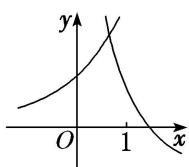  
A

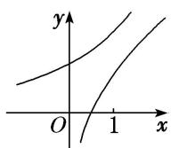  
B

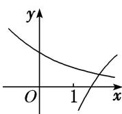  
C

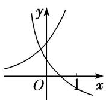  
D

# 【对点训练】

1. 函数 $f(x) = 2\log_4(1 - x)$ ，则函数 $f(x)$ 的大致图象是（）

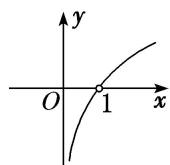  
A

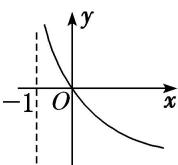  
B

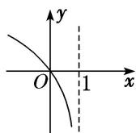  
C

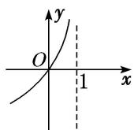  
D

2. 函数 $y = \ln (2 - |x|)$ 的大致图象为( )

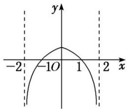

A

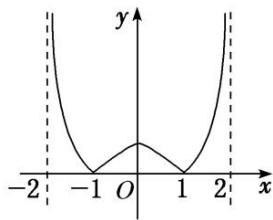

B

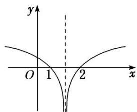

C

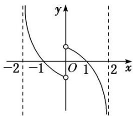

D

3. 函数 $f(x) = \lg \frac{1}{|x + 1|}$ 的大致图象是( )

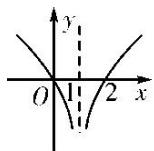  
A

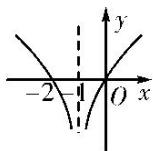  
B

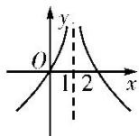  
C

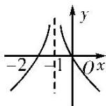  
D

4. 已知 $\lg a + \lg b = 0 (a > 0$ ，且 $a \neq 1, b > 0$ ，且 $b \neq 1$ ），则函数 $f(x) = a^x$ 与 $g(x) = -\log_b x$ 的图象可能是（）

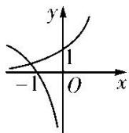  
A

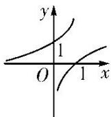  
B

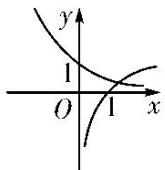  
C

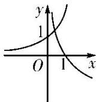  
D

5. 若函数 $y=a^{|x|}(a>0$ ，且 $a\neq1)$ 的值域为 $\{y|y\geq1\}$ ，则函数 $y=\log_{a}|x|$ 的图象大致是()

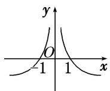  
A

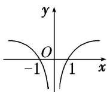  
B

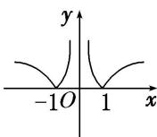  
C

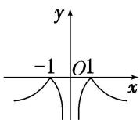  
D

# 考点二 对数函数图象的应用

# 【方法总结】

一些对数型方程、不等式问题常转化为相应的函数图象问题，利用数形结合法求解.

# 【例题选讲】

[例 2] （1） 已知当 $0 < x \leq \frac{1}{4}$ 时，有 $\sqrt{x} < \log_{a} x$ ，则实数 a 的取值范围为 \_\_\_\_.

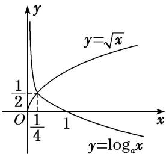  
（2） 当 $0 < x \leq \frac{1}{2}$ 时， $4^x < \log_a x$ ，则 $a$ 的取值范围是（）

A. $\left(0,\frac{\sqrt{2}}{2}\right)$

B. $\left(\frac{\sqrt{2}}{2},1\right)$

C. $(1, \sqrt{2})$

D. $(\sqrt{2}, 2)$

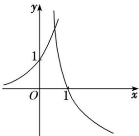  
（3） 设方程 $10^{x} = |\lg (-x)|$ 的两个根分别为 $x_{1}, x_{2}$ , 则( )

A. $x_{1}x_{2} < 0$

B. $x_{1}x_{2}=0$

C. $x_{1}x_{2}>1$

D. $0 < x_{1}x_{2} < 1$
> 

> 
> | 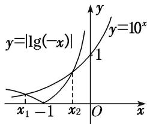 |  |
> | --- | --- |
> | （4）已知函数 $f(x) = \begin{cases} \log_2 x, & x > 0, \\ 3^x, & x \leq 0, \end{cases}$ 关于 $x$ 的方程 $f(x) + x - a = 0$ 有且只有一个实根，则实数 $a$ 的取值范围是 \_\_\_\_. | （5）(2018·全国III)下列函数中，其图象与函数 $y=\ln x$ 的图象关于直线 x=1 对称的是() |
> 

A. $y=\ln(1-x)$

B. $y=\ln(2-x)$

C. $y=\ln(1+x)$

D. $y=\ln(2+x)$

# 【对点训练】

6. 已知函数 $f(x) = \ln x$ , $g(x) = \lg x$ , $h(x) = \log_3 x$ ，直线 $y = a (a < 0)$ 与这三个函数图象的交点的横坐标分别是 $x_1, x_2, x_3$ ，则 $x_1, x_2, x_3$ 的大小关系是（）

A. $x_{2}<x_{3}<x_{1}$

B. $x_{1} <   x_{3} <   x_{2}$

C. $x_{1} <   x_{2} <   x_{3}$

D. $x_{3}<x_{2}<x_{1}$

7. 已知函数 $f(x) = \log_a 2^x + b - 1 (a > 0, a \neq 1)$ 的图象如图所示，则 $a, b$ 满足的关系是（）

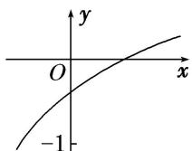

A. $0 < a^{-1} < b < 1$

B. $0 < b < a^{-1} < 1$

C. $0 < b^{-1} < a < 1$

D. $0 < a^{-1} < b^{-1} < 1$

8. 不等式 $x^{2} < \log_{a} x (a > 0$ ，且 $a \neq 1)$ 对 $x \in \left(0, \frac{1}{2}\right)$ 恒成立，求实数 $a$ 的取值范围.

9. 设 $f(x)=|\ln(x+1)|$ ，已知 $f(a)=f(b)(a<b)$ ，则()

A. $a+b>0$

B. $a+b>1$

C. $2a+b>0$

D. $2a+b>1$

10. 若 $f(x)=\lg x$ , $g(x)=f(|x|)$ ，则 $g(\lg x)>g(1)$ 时，x 的取值范围是()

A. $\left(0,\frac{1}{10}\right)\cup(10,+\infty)$

B. [1, 2)

C. $\left[0, \frac{1}{10}\right] \cup [10, +\infty)$

D. $(10, +\infty)$

11. 已知函数 $f(x) = |\lg x|$ . 若 $0 < a < b$ ，且 $f(a) = f(b)$ ，则 $a + 2b$ 的取值范围是（）

A. $(2\sqrt{2}, +\infty)$

B. $[2\sqrt{2}, +\infty)$

C. $(3, +\infty)$

D. $[3, +\infty)$

12. 设平行于 $y$ 轴的直线分别与函数 $y_{1} = \log_{2} x$ 及函数 $y_{2} = \log_{2} x + 2$ 的图象交于 $B, C$ 两点，点 $A(m, n)$ 位于函数 $y_{2} = \log_{2} x + 2$ 的图象上，如图，若 $\triangle ABC$ 为正三角形，则 $m \cdot 2^{n} =$ \_\_\_\_.

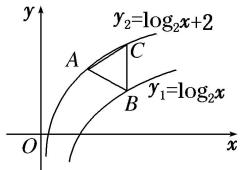

# 考点三 对数函数的性质及应用

# 【基本知识】

对数函数的性质

<table><tr><td rowspan="2" colspan="2">函数</td><td colspan="2"> $y=\log_{ax}(a>0, \text{且 } a\neq1)$ </td></tr><tr><td> $a>1$ </td><td> $0</td></tr><tr><td rowspan="5">性质</td><td>定义域</td><td colspan="2">\( (0, +\infty)$ </td></tr><tr><td>值域</td><td colspan="2"> $\mathbf{R}$ </td></tr><tr><td>单调性</td><td>在 $(0, +\infty)$ 上是增函数</td><td>在 $(0, +\infty)$ 上是减函数</td></tr><tr><td rowspan="2">函数值变化规律</td><td colspan="2">当 $x=1$ 时, $y=0$ </td></tr><tr><td>当 $x>1$ 时, $y>0$ ;当 $01时,\( y<0$ ;当 $00</td><td>当\( x>1$ 时, $y<0$ ;当\( 00</td></tr></table>

# 考向1 比较对数式的大小

# 【方法总结】

# 对数函数值大小比较的方法

单调性法：在同底的情况下直接得到大小关系，若不同底，先化为同底.

中间量过渡法：寻找中间数联系要比较的两个数，一般是用 “0”，“1” 或其他特殊值进行 “比较传递”

图象法：根据图象观察得出大小关系

# 【例题选讲】

[例 3] （1） 设 $a=\log_{3}2$ , $b=\log_{5}2$ , $c=\log_{2}3$ ，则 a, b, c 的大小关系为()

A. a>c>b

B. b>c>a

C. c>b>a

D. c>a>b  
（2） (2013·全国II) 设 $a=\log_{3}6,\quad b=\log_{5}10,\quad c=\log_{7}14$ ，则()

A. c>b>a

B. b>c>a

C. a>c>b

D. a > b > c  
（3） (2018·天津) 已知 $a = \log_{3} \frac{7}{2}$ , $b = \left(\frac{1}{4}\right)_{\frac{1}{3}}$ , $c = \log_{\frac{1}{3}} \frac{1}{5}$ , 则 $a, b, c$ 的大小关系为 ( )

A. a>b>c

B. b>a>c

C. c>b>a

D. c>a>b  
（4） 设 $a=0.3^{6}$ ， $b=\log_{3}6$ ， $c=\log_{5}10$ ，则()

A. c>b>a

B. a>c>b

C. b>c>a

D. a>b>c  
（5） (2016·全国I)若 a > b > 1，0 < c < 1，则()

A. $a^{c}<b^{c}$

B. $ab^{c}<ba^{c}$

C. $a\log_b c < b\log_a c$

D. $\log_{a}c < \log_{b}c$

# 考向2 与对数有关的不等式问题

# 【方法总结】

# 简单对数不等式问题的求解策略  
（1）解决简单的对数不等式，应先利用对数的运算性质化为同底数的对数值，再利用对数函数的单调性转化为一般不等式求解.  
（2）对数函数的单调性和底数 a 的值有关，在研究对数函数的单调性时，要按 0<a<1 和 a>1 进行分类讨论.  
（3）某些对数不等式可转化为相应的函数图象问题，利用数形结合法求解.

# 【例题选讲】

[例 4] （1） 设函数 $f(x)=\left\{\begin{aligned}\log_{2}x,&x>0,\\ \log(-x)&x<0,\end{aligned}\right.$ 若 $f(a)>f(-a)$ ，则实数 a 的取值范围是()

A. $(-1, 0) \cup (0, 1)$

B. $(-\infty, -1) \cup (1, +\infty)$

C. $(-1, 0) \cup (1, +\infty)$

D. $(-∞,-1)∪(0,1)$  
（2） 已知不等式 $\log_x(2x^2 + 1) < \log_x(3x) < 0$ 成立，则实数 $x$ 的取值范围是 \_\_\_\_.  
（3） 已知函数 $f(x)$ 是定义在 $\mathbf{R}$ 上的奇函数，且在 $[0, +\infty)$ 上单调递增，若 $f(\lg 2 \cdot \lg 50 + (\lg 5)^2) + f(\lg x - 2) < 0$ ，则 $x$ 的取值范围为 \_\_\_\_.  
（4） 已知函数 $f(x) = \log_a (8 - ax) (a > 0$ ，且 $a \neq 1$ ，若 $f(x) > 1$ 在区间[1，2]上恒成立，则实数 $a$ 的取值范围为 \_\_\_\_.  
（5） 已知函数 $f(x)=\left\{\begin{aligned}-x^{2}+2x,&x\leq0,\\ \ln x+1,&x>0,\end{aligned}\right.$ 若 $|f(x)|\geq ax$ ，则 a 的取值范围是 \_\_\_\_.

# 考向3 与对数有关的复合函数性质应用问题

# 【方法总结】

# 与对数有关的单调性问题的解题策略  
（1）求出函数的定义域.  
（2）判断对数函数的底数与1的关系，当底数是含字母的代数式(包含单独一个字母)时，要考查其单调性，就必须对底数进行分类讨论.  
（3）判断内层函数和外层函数的单调性，运用复合函数“同增异减”原则判断函数的单调性.

# 【例题选讲】

[例 5] （1） 函数 $y=\log_{4}(7+6x-x^{2})$ 的单调递增区间是 \_\_\_\_.  
（2） 函数 $f(x)=\log_{a}(ax-3)(a>0$ ，且 $a\neq1)$ 在 $[1,3]$ 上单调递增，则 a 的取值范围是()

A. $(1, +\infty)$

B. $(0, 1)$

C. $\left(0,\frac{1}{3}\right)$

D. $(3, +\infty)$  
（3） 若函数 $f(x)=\log_{a}(x^{2}-ax+5)(a>0$ 且 $a\neq1)$ 满足对任意的 $x_{1}$ ， $x_{2}$ ，当 $x_{1}<x_{2}\leq\frac{a}{2}$ 时， $f(x_{2})-f(x_{1})<0$ ，则实

数 a 的取值范围为 \_\_\_\_.  
（4） 设函数 $f(x) = |\log_a x| (0 < a < 1)$ 的定义域为 $[m, n](m < n)$ ，值域为 $[0, 1]$ ，若 $n - m$ 的最小值为 $\frac{1}{3}$ ，则实数 $a$ 的值为（）

A. $\frac{1}{4}$

B. $\frac{1}{4}$ 或 $\frac{2}{3}$

C. $\frac{2}{3}$

D. $\frac{2}{3}$ 或 $\frac{3}{4}$

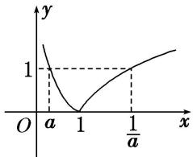  
（5） 已知函数 $f(x)=\ln(x+\sqrt{x^{2}+1})$ ， $g(x)=f(x)+2017$ ，下列命题：

① $f(x)$ 的定义域为 $(-∞, +∞)$ ;  
② $f(x)$ 是奇函数；  
③ $f(x)$ 在 $(-∞, +∞)$ 上单调递增；  
④若实数 a, b 满足 $f(a)+f(b-1)=0$ ，则 $a+b=1$ ;  
⑤设函数 $g(x)$ 在 $[-2\ 017, 2\ 017]$ 上的最大值为 M，最小值为 m，则 $M + m = 2\ 017$ .
其中真命题的序号是\_\_\_\_．(写出所有真命题的序号)

# 【对点题组】

13. 设 $a = 6^{0.4}$ , $b = \log_{0.4}0.5$ , $c = \log_80.4$ , 则 $a, b, c$ 的大小关系是( )

A. $a < b < c$

B. c<b<a

C. c<a<b

D. b<c<a

14. 已知 $a = \log_{\frac{1}{2}}\frac{1}{3}$ , $b = \log_{\frac{1}{3}}\frac{1}{2}$ , $c = \log_2\frac{1}{3}$ , 则( )

A. a>b>c

B. b>c>a

C. c>b>a

D. b>a>c

15. 已知 $a = \log_2 3 + \log_2 \sqrt{3}$ , $b = \log_2 9 - \log_2 \sqrt{3}$ , $c = \log_3 2$ , 则 $a, b, c$ 的大小关系是( )

A. a=b<c

B. $a = b > c$

C. a<b<c

D. a>b>c

16. (2019·天津)已知 $a = \log_5 2, b = \log_{0.5} 0.2, c = 0.5^{0.2}$ , 则 $a, b, c$ 的大小关系为( )

A. a<c<b

B. a<b<c

C. b<c<a

D. c<a<b

17. 函数 $f(x) = \sqrt{4 - |x|} + \lg \frac{x^2 - 5x + 6}{x - 3}$ 的定义域为( )

A. (2, 3)

B. $(2, 4]$

C. $(2, 3) \cup (3, 4]$

D. $(-1, 3) \cup (3, 6]$

18. 若 $\log_a\frac{2}{3} < 1 (a > 0$ ，且 $a \neq 1$ ），则实数 $a$ 的取值范围是（）

A. $\begin{pmatrix}0,\frac{2}{3}\end{pmatrix}$

B. $(1, +\infty)$

C. $\left(0, \frac{2}{3}\right) \cup (1, +\infty)$

D. $\left(\frac{2}{3},1\right)$

19. 设函数 $f(x)=\left\{\begin{aligned}4^{1-x}, & x\leq1,\\ 1-\log_{\frac{1}{4}}x, & x>1,\end{aligned}\right.$ 则满足不等式 $f(x)\leq2$ 的实数 x 的取值集合为 \_\_\_\_.

20. 若 $f(x) = \lg (x^2 - 2ax + 1 + a)$ 在区间 $(- \infty, 1]$ 上单调递减，则 $a$ 的取值范围为（）

A. [1, 2)

B. $[1, 2]$

C. $[1, +\infty)$

D. $[2, +\infty)$

21. 若函数 $y = \log_{a} x$ 在区间 $[2, +\infty)$ 上总有 $|y| > 1$ ，则实数 $a$ 的取值范围是（）

A. $\left(0,\frac{1}{2}\right)\cup(1,2)$

B. $\left(\frac{1}{2},\ 1\right)\cup(1,\ 2)$

C. $(1, 2)$

D. $\left(0,\frac{1}{2}\right)\cup(2,+\infty)$

22. 已知函数 $f(x) = |\log_3 x|$ ，实数 $m, n$ 满足 $0 < m < n$ ，且 $f(m) = f(n)$ ，若 $f(x)$ 在 $[m^2, n]$ 上的最大值为 2，则 $\frac{n}{m} =$ \_\_\_\_.

23. 设 $x \in [2, 8]$ 时，函数 $f(x) = \frac{1}{2} \log_a(ax) \cdot \log_a(a^2 x) (a > 0$ ，且 $a \neq 1$ 的最大值是 1，最小值是 $-\frac{1}{8}$ ，求实数 $a$ 的值.

24. 已知函数 $f(x) = \log_a x + m (a > 0 \text{且 } a \neq 1)$ 的图象过点(8, 2)，点 $P(3, -1)$ 关于直线 $x = 2$ 的对称点 $Q$ 在 $f(x)$ 的图象上.  
（1）求函数 $f(x)$ 的解析式;  
（2）令 $g(x)=2f(x)-f(x-1)$ ，求 $g(x)$ 的最小值及取得最小值时 x 的值.

