# 专题十三 对数函数

# 考点一 对数函数图象辨析

# 【基本知识】

#### 1. 对数函数的概念

函数 $y=\log_{a}x(a>0$ ，且 $a\neq1)$ 叫做对数函数，其中 x 是自变量，函数的定义域是 $(0,+\infty)$ .

#### 2. 对数函数的图象

<table><tr><td>函数</td><td> $y=\log_{a}x, a>1$ </td><td>\( y=\log_{a}x, 0</td></tr><tr><td>图象</td><td>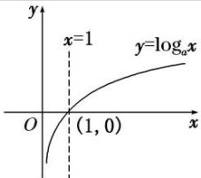</td><td>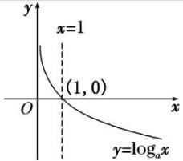</td></tr><tr><td rowspan="2">图象特征</td><td colspan="2">在y轴右侧,过定点(1,0)</td></tr><tr><td>当x逐渐增大时,图象是上升的</td><td>当x逐渐增大时,图象是下降的</td></tr></table>

#### 3. 指数函数与对数函数的关系

指数函数 $y = a^{x} (a > 0$ ，且 $a \neq 1$ 与对数函数 $y = \log_{a} x (a > 0$ ，且 $a \neq 1$ 互为反函数，它们的图象关于直线 $y = x$ 对称.

# 【常用结论】  
（1）对数函数图象的画法

画对数函数 $y = \log_a x (a > 0$ ，且 $a \neq 1)$ 的图象，应抓住三个关键点：(1, 0)，(a, 1)， $\begin{bmatrix} 1, & -1 \\ a & \end{bmatrix}$ 和一条渐近线 $x = 0$ .  
（2）底数 a 与 1 的大小关系决定了对数函数图象的“升降”: 当 a>1 时, 对数函数的图象“上升”; 当 0<a<1 时, 对数函数的图象“下降”.  
（3）函数 $y=\log_{a}x$ 与 $y=\log_{a}^{1}x(a>0, \text{且 } a\neq1)$ 的图象关于 x 轴对称.  
（4）对数函数的图象与底数大小的比较
如图是对数函数（1） $y=\log_{ax}$ ，（2） $y=\log_{bx}$ ，（3） $y=\log_{cx}$ ，（4） $y=\log_{dx}$ 的图象，底数a，b，c，d与1之间的大小关系为c>d>1>a>b>0。由此我们可得到以下规律：在第一象限内，对数函数 $y=\log_{ax}(a>0$ ，且 $a\neq1)$ 的图象越右，底数越大。简称“底大图右”。

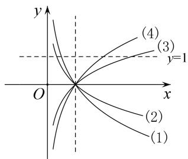

# 【方法总结】

# 有关对数函数图象辨析的解题思路  
（1）已知函数解析式判断其图象，一般是取特殊点，判断选项中的图象是否过这些点，若不满足则排除.  
（2）对于有关对数型函数的图象问题，一般是从最基本的对数函数的图象入手，通过平移、伸缩、对称变换而得到．特别地，当底数 a 与 1 的大小关系不确定时应注意分类讨论.  
（3）根据对数函数图象判断底数大小的问题, 可以通过底大图右进行判断.

# 【例题选讲】

[例 1] （1） 函数 $y=\lg|x-1|$ 的图象是()

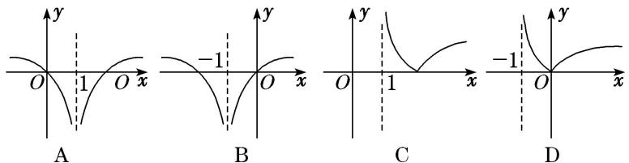
答案 A 解析 因为 $y=\lg|x-1|=\left\{\begin{aligned}\lg(x-1),&x>1,\\ \lg(1-x),&x<1.\end{aligned}\right.$ 当 x=1 时，函数无意义，故排除 B、D。又当 x=2 或 0 时，y=0，所以 A 项符合题意。  
（2） 函数 $f(x)=|\log_{a}(x+1)|(a>0, \text{且 } a\neq1)$ 的大致图象是()

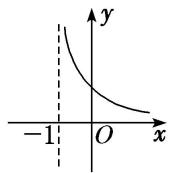  
A

  
B

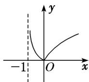  
C

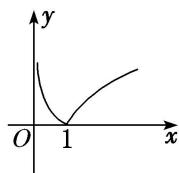  
D
答案 C 解析 函数 $f(x) = |\log_a (x + 1)|$ 的定义域为 $\{x|x > -1\}$ ，且对任意的 $x$ ，均有 $f(x) \geq 0$ ，结合对数函数的图象可知选 C.  
（3） 函数 $y=\log_{a}x$ 与 $y=-x+a$ 在同一坐标系中的图象可能是()

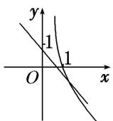  
A

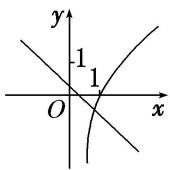  
B

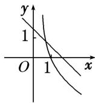  
C

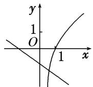  
D
答案 A 解析 当 a>1 时，函数 $y=\log_{a}x$ 的图象为选项 B、D 中过点 $(1,0)$ 的曲线，此时函数 $y=-x+a$ 的图象与 y 轴的交点的纵坐标 a 应满足 a>1，选项 B、D 中的图象都不符合要求；当 0<a<1 时，函数 $y=\log_{a}x$ 的图象为选项 A、C 中过点 $(1,0)$ 的曲线，此时函数 $y=-x+a$ 的图象与 y 轴的交点的纵坐标 a 应满足 0<a<1，选项 A 中的图象符合要求，选项 C 中的图象不符合要求.  
（4） 在同一直角坐标系中，函数 $f(x) = x^{a}(x \geq 0)$ ， $g(x) = \log_{a} x (a > 0 \text{ 且 } a \neq 1)$ 的图象可能是（）

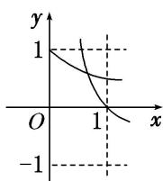  
A

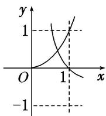  
B

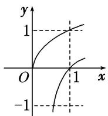  
C

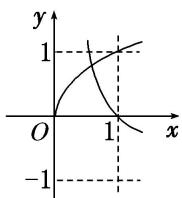  
D
答案 D 解析 当 a>1 时，函数 $f(x)=x^{a}(x\geq0)$ 单调递增，函数 $g(x)=\log_{a}x$ 单调递增，且过点 $(1,0)$ ，由幂函数的图象性质可知 C 错；当 0<a<1 时，函数 $f(x)=x^{a}(x\geq0)$ 单调递增，且过点 $(1,1)$ ，函数 $g(x)=\log_{a}x$ 单调递减，且过点 $(1,0)$ ，排除 A，又由幂函数的图象性质可知 B 错．故选 D.  
（5）(2019·浙江)在同一直角坐标系中，函数 $y=\frac{1}{a^{x}}$ ， $y=\log_{a}\left(\frac{x+\frac{1}{2}}{2}\right)$ (a>0，且 $a\neq1$ ) 的图象可能是()

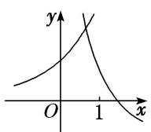  
A

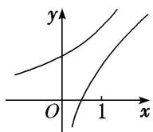  
B

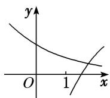  
C

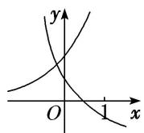  
D
答案 D 解析 对于函数 $y = \log_a\left(x + \frac{1}{2}\right)$ ，当 $y = 0$ 时，有 $x + \frac{1}{2} = 1$ ，得 $x = \frac{1}{2}$ ，即 $y = \log_a\left(x + \frac{1}{2}\right)$ 的图象恒过定点 $\left(\frac{1}{2}, 0\right)$ ，排除选项 A、C；函数 $y = \frac{1}{a^x}$ 与 $y = \log_a\left(x + \frac{1}{2}\right)$ 在各自定义域上单调性相反，排除选项 B，故选 D.

# 【对点训练】

1. 函数 $f(x)=2\log_{4}(1-x)$ ，则函数 $f(x)$ 的大致图象是()

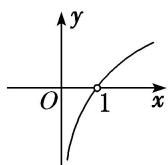  
A

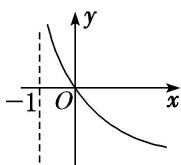  
B

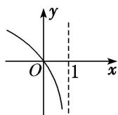  
C

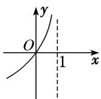  
D

1. 答案 C 解析 函数 $f(x) = 2\log_4(1 - x)$ 的定义域为 $(- \infty, 1)$ ，排除 A、B；函数 $f(x) = 2\log_4(1 - x)$ 在定义域上单调递减，排除 D。故选 C。

2. 函数 $y=\ln(2-|x|)$ 的大致图象为()

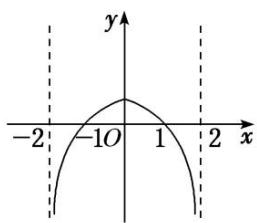

A

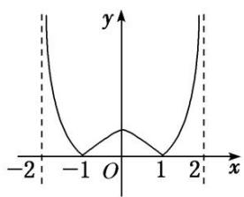

B

C

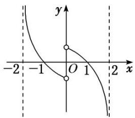

D

2. 答案 A 解析 令 $f(x) = \ln (2 - |x|)$ ，易知函数 $f(x)$ 的定义域为 $\{x| - 2 < x < 2\}$ ，且 $f(-x) = \ln (2 - |-x|) = \ln (2 - |x|) = f(x)$ ，所以函数 $f(x)$ 为偶函数，排除选项 C、D。由对数函数的单调性及函数 $y = 2 - |x|$ 的单调性知 A 正确。

3. 函数 $f(x)=\lg \frac{1}{|x+1|}$ 的大致图象是()

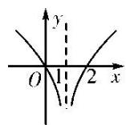  
A

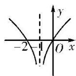  
B

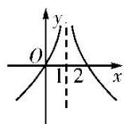  
C

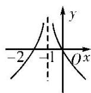  
D

3. 答案 D 解析 $f(x)=\lg\frac{1}{|x+1|}=-\lg|x+1|$ 的图象可由偶函数 $y=-\lg|x|$ 的图象左移 1 个单位得到。由 $y=-\lg|x|$ 的图象可知 D 项正确。

4. 已知 $\lg a + \lg b = 0 (a > 0$ ，且 $a \neq 1$ ， $b > 0$ ，且 $b \neq 1$ ），则函数 $f(x) = a^x$ 与 $g(x) = -\log_b x$ 的图象可能是（）

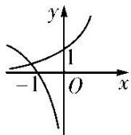  
A

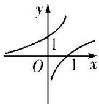  
B

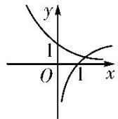  
C

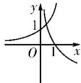  
D

4. 答案 B 解析 因为 $\lg a + \lg b = 0$ ，所以 $\lg (ab) = 0$ ，所以 $ab = 1$ ，即 $b = \frac{1}{a}$ ，故 $g(x) = -\log_b x = -\log_{\frac{1}{a}} x = \log_a x$ ，则 $f(x)$ 与 $g(x)$ 互为反函数，其图象关于直线 $y = x$ 对称，结合图象知 B 项正确。故选 B.

5. 若函数 $y = a^{|x|} (a > 0$ ，且 $a \neq 1$ 的值域为 $\{y | y \geq 1\}$ ，则函数 $y = \log_a |x|$ 的图象大致是（）

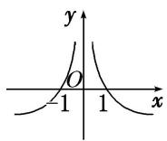  
A

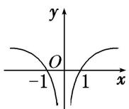  
B

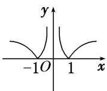  
C

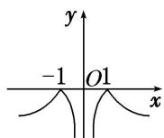  
D

5. 答案 B 解析 若函数 $y = a^{|x|} (a > 0$ ，且 $a \neq 1$ 的值域为 $\{y | y \geq 1\}$ ，则 $a > 1$ ，故函数 $y = \log_a |x|$ 的大致图象如选项 B 中图所示.

# 考点二 对数函数图象的应用

# 【方法总结】

一些对数型方程、不等式问题常转化为相应的函数图象问题，利用数形结合法求解.

# 【例题选讲】

[例 2] （1） 已知当 $0 < x \leq \frac{1}{4}$ 时，有 $\sqrt{x} < \log_{a} x$ ，则实数 a 的取值范围为 \_\_\_\_.
答案 $\left(\frac{1}{16}, 1\right)$ 解析 若 $\sqrt{x} < \log_{a}x$ 在 $x \in \left[0, \frac{1}{4}\right]$ 时成立，则 0 < a < 1，且 $y = \sqrt{x}$ 的图象在 $y = \log_{a}x$ 图象的下方，作出图象如图所示。由图象知 $\sqrt{\frac{1}{4}} < \log_{a}\frac{1}{4}$ ，所以 $\left\{\begin{aligned}&0 < a < 1,\\ &a > \frac{1}{4},\end{aligned}\right.$ 解得 $\frac{1}{16} < a < 1$ 。即实数 a 的取值范围是 $\left(\frac{1}{16}, 1\right)$ 。

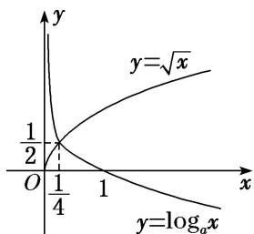  
（2） 当 $0 < x \leq \frac{1}{2}$ 时， $4^x < \log_a x$ ，则 $a$ 的取值范围是（）

A. $\left(0,\frac{\sqrt{2}}{2}\right)$

B. $\left(\frac{\sqrt{2}}{2},1\right)$

C. $(1, \sqrt{2})$

D. $(\sqrt{2}, 2)$
答案 B 解析 易知 $0 < a < 1$ ，函数 $y = 4^x$ 与 $y = \log_a x$ 的大致图象如图，则由题意可知只需满足 $\log_a \frac{1}{2} > 4\frac{1}{2}$ ，解得 $a > \frac{\sqrt{2}}{2}$ ， $\therefore \frac{\sqrt{2}}{2} < a < 1$ ，故选 B.

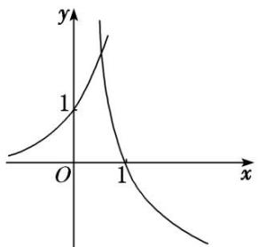  
（3） 设方程 $10^{x} = |\lg (-x)|$ 的两个根分别为 $x_{1}, x_{2}$ , 则( )

A. $x_{1}x_{2} < 0$

B. $x_{1}x_{2} = 0$

C. $x_{1}x_{2}>1$

D. $0 < x_{1}x_{2} < 1$
答案 D 解析 作出 $y = 10^{x}$ 与 $y = |\lg(-x)|$ 的大致图象，如图．显然 $x_{1} < 0, x_{2} < 0$ ．不妨令 $x_{1} < x_{2}$ ，则 $x_{1} < -1 < x_{2} < 0$ ，所以 $10^{x_{1}} = \lg(-x_{1})$ ， $10^{x_{2}} = -\lg(-x_{2})$ ，此时 $10^{x_{1}} < 10^{x_{2}}$ ，即 $\lg(-x_{1}) < -\lg(-x_{2})$ ，由此得 $\lg(x_{1}x_{2}) < 0$ ，所以 $0 < x_{1}x_{2} < 1$ ，故选 D.

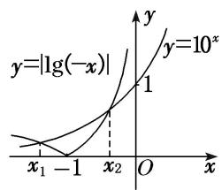  
（4） 已知函数 $f(x) = \begin{cases} \log_2 x, & x > 0, \\ 3^x, & x \leq 0, \end{cases}$ 关于 $x$ 的方程 $f(x) + x - a = 0$ 有且只有一个实根，则实数 $a$ 的取值范围是 \_\_\_\_.
答案 $a > 1$ 解析 问题等价于函数 $y = f(x)$ 与 $y = -x + a$ 的图象有且只有一个交点，结合函数图象可知 $a > 1$ .

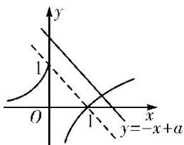  
（5） (2018·全国III)下列函数中，其图象与函数 $y=\ln x$ 的图象关于直线 x=1 对称的是()

A. $y=\ln(1-x)$

B. $y=\ln(2-x)$

C. $y=\ln(1+x)$

D. $y=\ln(2+x)$
答案 B 解析 易知 $y=\ln x$ 与 $y=\ln(-x)$ 的图象关于 y 轴对称．而 $y=\ln(2-x)=\ln[-(x-2)]$ ，由此可知 $y=\ln(2-x)$ 的图象只需将 $y=\ln(-x)$ 的图象向右平移 2 个单位即可得到．因此 $y=\ln x$ 与 $y=\ln(2-x)$ 的图象关于直线 x=1 对称．

# 【对点训练】

6. 已知函数 $f(x) = \ln x$ , $g(x) = \lg x$ , $h(x) = \log_3 x$ ，直线 $y = a (a < 0)$ 与这三个函数图象的交点的横坐标分别是 $x_1, x_2, x_3$ ，则 $x_1, x_2, x_3$ 的大小关系是（）

A. $x_{2} <   x_{3} <   x_{1}$

B. $x_{1}<x_{3}<x_{2}$

C. $x_{1}<x_{2}<x_{3}$

D. $x_{3}<x_{2}<x_{1}$

6. 答案 A 解析 分别作出三个函数的图象，如图所示，由图可知 $x_{2}<x_{3}<x_{1}$ .

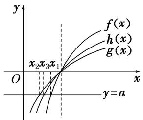

7. 已知函数 $f(x) = \log_a 2^x + b - 1 (a > 0, a \neq 1)$ 的图象如图所示，则 $a, b$ 满足的关系是（）

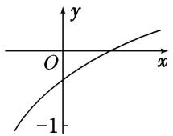

A. $0 < a^{-1} < b < 1$

B. $0 < b < a^{-1} < 1$

C. $0 < b^{-1} < a < 1$

D. $0 < a^{-1} < b^{-1} < 1$

7. 答案 A 解析 由函数图象可知, $f(x)$ 在 $\mathbf{R}$ 上单调递增, 故 $a > 1$ . 函数图象与 $y$ 轴的交点坐标为 $(0, \log_{a} b)$ , 由函数图象可知 $-1 < \log_{a} b < 0$ , 解得 $\frac{1}{a} < b < 1$ . 综上有 $0 < \frac{1}{a} < b < 1$ .

8. 不等式 $x^{2} < \log_{a} x (a > 0$ ，且 $a \neq 1)$ 对 $x \in \begin{bmatrix} 0, & \frac{1}{2} \end{bmatrix}$ 恒成立，求实数 $a$ 的取值范围.

8. 答案 $\left[\frac{1}{16}, 1\right]$ 解析 设 $f_{1}(x) = x^{2}$ , $f_{2}(x) = \log_{a}x$ , 要使 $x \in \left(0, \frac{1}{2}\right)$ 时, 不等式 $x^{2} < \log_{a}x$ 恒成立, 只需 $f_{1}(x) = x^{2}$ 在 $\left(0, \frac{1}{2}\right)$ 上的图象在 $f_{2}(x) = \log_{a}x$ 图象的下方即可. 当 $a > 1$ 时, 显然不成立; 当 $0 < a < 1$ 时, 如图所示, 要使 $x^{2} < \log_{a}x$ 在 $x \in \left(0, \frac{1}{2}\right)$ 上恒成立, 需 $f_{1}\left(\frac{1}{2}\right) \leq f_{2}\left(\frac{1}{2}\right)$ ,

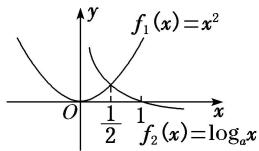
所以有 $\left(\frac{1}{2}\right)^{2}\leq\log_{a}\frac{1}{2}$ ，解得 $a\geq\frac{1}{16}$ ，所以 $\frac{1}{16}\leq a<1$ ．即实数a的取值范围是 $\left[\frac{1}{16},1\right]$ .

9. 设 $f(x) = |\ln (x + 1)|$ ，已知 $f(a) = f(b)(a < b)$ ，则（）

A. $a+b>0$

B. $a+b>1$

C. $2a+b>0$

D. $2a+b>1$

9. 答案 A 解析 作出函数 $f(x)=|\ln(x+1)|$ 的图象如图所示,

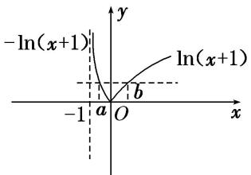
由 $f(a)=f(b)$ ，得 $-\ln(a+1)=\ln(b+1)$ ，即 $ab+a+b=0$ 。所以 $0=ab+a+b<\frac{(a+b)^{2}}{4}+a+b$ ，即 $(a+b)(a+b+4)>0$ ，显然 -1<a<0，b>0，∴ $a+b+4>0$ 。∴ $a+b>0$ 。故选 A.

10. 若 $f(x) = \lg x$ ， $g(x) = f(|x|)$ ，则 $g(\lg x) > g(1)$ 时， $x$ 的取值范围是（）

A. $\left(0,\frac{1}{10}\right)\cup(10,+\infty)$

B. $[1, 2)$

C. $\left[0, \frac{1}{10}\right] \cup [10, +\infty)$

D. $(10, +\infty)$

10. 答案 A 解析 作出 $g(x)$ 的图象如图所示, 若使 $g(\lg x) > g(1)$ , 则 $\lg x > 1$ 或 $\lg x < -1$ , 解得 x > 10 或 $0 < x < \frac{1}{10}$ .

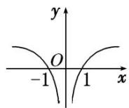

11. 已知函数 $f(x) = |\lg x|$ . 若 $0 < a < b$ ，且 $f(a) = f(b)$ ，则 $a + 2b$ 的取值范围是（）

A. $(2\sqrt{2}, +\infty)$

B. $[2\sqrt{2}, +\infty)$

C. $(3, +\infty)$

D. $[3, +\infty)$

11. 答案 C 解析 $f(x) = |\lg x|$ 的图象如图所示，由题知 $f(a) = f(b)$ ，则有 $0 < a < 1 < b$ ， $\therefore f(a) = |\lg a| = -\lg a$ ， $f(b) = |\lg b| = \lg b$ ，即 $-\lg a = \lg b$ ，则 $a = \frac{1}{b}$ ， $\therefore a + 2b = 2b + \frac{1}{b}$ . 令 $g(b) = 2b + \frac{1}{b}$ ， $g'(b) = 2 - \frac{1}{b^2}$ ，显然当 $b \in (1, +\infty)$ 时， $g'(b) > 0$ ， $\therefore g(b)$ 在 $(1, +\infty)$ 上为增函数， $\therefore g(b) = 2b + \frac{1}{b} > 3$ ，故选 C.

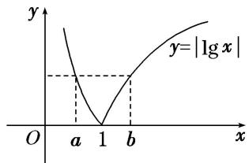

12. 设平行于 $y$ 轴的直线分别与函数 $y_{1} = \log_{2}x$ 及函数 $y_{2} = \log_{2}x + 2$ 的图象交于 $B, C$ 两点，点 $A(m, n)$ 位于函数 $y_{2} = \log_{2}x + 2$ 的图象上，如图，若 $\triangle ABC$ 为正三角形，则 $m \cdot 2^{n} =$ \_\_\_\_.

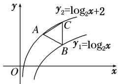

12. 答案 12 解析 由题意知， $n=\log_{2}m+2$ ，所以 $m=2^{n-2}$ 。又 $BC=y_{2}-y_{1}=2$ ，且 $\triangle ABC$ 为正三角形，所以可知 $B(m+\sqrt{3}, n-1)$ 在 $y_{1}=\log_{2}x$ 的图象上，所以 $n-1=\log_{2}(m+\sqrt{3})$ ，即 $m=2^{n-1}-\sqrt{3}$ ，所以 $2^{n}=4\sqrt{3}$ ，所以 $m=\sqrt{3}$ ，所以 $m\cdot2^{n}=\sqrt{3}\times4\sqrt{3}=12$ 。

# 考点三 对数函数的性质及应用

# 【基本知识】

对数函数的性质

<table><tr><td rowspan="2" colspan="2">函数</td><td colspan="2"> $y=\log_{a}x(a>0, \text{且 } a\neq1)$ </td></tr><tr><td> $a>1$ </td><td> $0</td></tr><tr><td rowspan="5">性质</td><td>定义域</td><td colspan="2">\( (0, +\infty)$ </td></tr><tr><td>值域</td><td colspan="2"> $\mathbf{R}$ </td></tr><tr><td>单调性</td><td>在 $(0, +\infty)$ 上是增函数</td><td>在 $(0, +\infty)$ 上是减函数</td></tr><tr><td rowspan="2">函数值变化规律</td><td colspan="2">当 $x=1$ 时, $y=0$ </td></tr><tr><td>当 $x>1$ 时, $y>0$ ;当 $01时,\( y<0$ ;当 $00</td><td>当\( x>1$ 时, $y<0$ ;当\( 00</td></tr></table>

# 考向1 比较对数式的大小

# 【方法总结】

# 对数函数值大小比较的方法

单调性法：在同底的情况下直接得到大小关系，若不同底，先化为同底.

中间量过渡法：寻找中间数联系要比较的两个数，一般是用 “0”，“1” 或其他特殊值进行 “比较传递”

图象法：根据图象观察得出大小关系

# 【例题选讲】

[例 3] （1） 设 $a=\log_{3}2$ , $b=\log_{5}2$ , $c=\log_{2}3$ ，则 a, b, c 的大小关系为()

A. a>c>b

B. b>c>a

C. c>b>a

D. c>a>b
答案 D 解析 $\because \log_{3}\sqrt{3}<\log_{3}2<\log_{3}3,\quad\log_{5}1<\log_{5}2<\log_{5}\sqrt{5},\quad\log_{2}3>\log_{2}2,\quad\therefore\frac{1}{2}<a<1,\quad0<b<\frac{1}{2},\quad c>1,\quad\therefore c>a>b.$  
（2） (2013·全国II) 设 $a=\log_{3}6,\quad b=\log_{5}10,\quad c=\log_{7}14$ ，则()

A. $c > b > a$

B. b>c>a

C. a>c>b

D. a > b > c
答案 D 解析 $a=\log_{3}6=1+\log_{3}2,\quad b=\log_{5}10=1+\log_{5}2,\quad c=\log_{7}14=1+\log_{7}2$ ，则只要比较 $\log_{3}2,\quad \log_{5}2,\quad \log_{7}2$ 的大小即可，在同一坐标系中作出函数 $y=\log_{3}x,\quad y=\log_{5}x,\quad y=\log_{7}x$ 的图象，由三个图象的相对位置关系，可知 a>b>c，故选 D.  
（3） (2018·天津)已知 $a=\log_{3}\frac{7}{2}$ ， $b=\left(\frac{1}{4}\right)\frac{1}{3}$ ， $c=\log_{\frac{1}{3}}\frac{1}{5}$ ，则 a, b, c 的大小关系为()

A. a>b>c

B. b>a>c

C. c>b>a

D. c>a>b
答案 D 解析 因为 $c = \log_{\frac{1}{3}}\frac{1}{5} = \log_35 > \log_3\frac{7}{2} > \log_33 = 1$ ，所以 $c > a$ ，又 $b = \left(\frac{1}{4}\right)_{3}^{\frac{1}{2}} < 1$ ，所以 $b < a < c$ 。故选 D  
（4） 设 $a=0.3^{6}$ ， $b=\log_{3}6$ ， $c=\log_{5}10$ ，则()

A. c>b>a

B. a>c>b

C. b>c>a

D. a>b>c
答案 C 解析 由 $a = 0.3^{6} < 1$ ， $b = \frac{\lg 6}{\lg 3} = 1 + \frac{\lg 2}{\lg 3}$ ， $c = 1 + \frac{\lg 2}{\lg 5}$ ，又 $\lg 5 > \lg 3 > \lg 2$ ，则 $0 < \frac{\lg 2}{\lg 5} < \frac{\lg 2}{\lg 3}$ ，则 $b > c > 1$ 。故 $b > c > a$ 。故选 C.  
（5） (2016·全国I)若 a>b>1，0<c<1，则()

A. $a^{c}<b^{c}$

B. $ab^{c}<ba^{c}$

C. $a \log_{b} c < b \log_{a} c$

D. $\log_a c < \log_b c$
答案 C 解析 $\because y = x^a, a \in (0, 1)$ 在 $(0, +\infty)$ 上是增函数， $\therefore$ 当 $a > b > 1, 0 < c < 1$ 时， $a^c > b^c$ ，选项 A 不正确。 $\because y = x^a, a \in (-1, 0)$ 在 $(0, +\infty)$ 上是减函数， $\therefore$ 当 $a > b > 1, 0 < c < 1$ ，即 $-1 < c - 1 < 0$ 时， $a^{c-1} < b^{c-1}$ ，即 $ab^c > ba^c$ ，选项 B 不正确。 $\because a > b > 1, \therefore \lg a > \lg b > 0, \therefore \lg a > \lg b > 0, \therefore \frac{a}{\lg b} > \frac{b}{\lg a}$ 。又 $\because 0 < c < 1, \therefore \lg c < 0.\therefore \frac{a \lg c}{\lg b} < \frac{b \lg c}{\lg a}$ ， $\therefore a \log_b c < b \log_a c$ ，选项 C 正确。同理可证 $\log_a c > \log_b c$ ，选项 D 不正确。

# 考向2 与对数有关的不等式问题

# 【方法总结】

# 简单对数不等式问题的求解策略  
（1）解决简单的对数不等式，应先利用对数的运算性质化为同底数的对数值，再利用对数函数的单调性转化为一般不等式求解.  
（2）对数函数的单调性和底数 $a$ 的值有关，在研究对数函数的单调性时，要按 $0 < a < 1$ 和 $a > 1$ 进行分类讨论.  
（3）某些对数不等式可转化为相应的函数图象问题，利用数形结合法求解.

# 【例题选讲】

[例 4] （1） 设函数 $f(x)=\left\{\begin{aligned}\log_{2}x,&x>0,\\ \log&(-x),&x<0,\end{aligned}\right.$ 若 $f(a)>f(-a)$ ，则实数 a 的取值范围是()

A. $(-1, 0) \cup (0, 1)$   
B. $(- \infty, -1) \cup (1, +\infty)$   
C. $(-1, 0) \cup (1, +\infty)$   
D. $(-\infty, -1) \cup (0, 1)$
答案 C 解析 由题意可得 $\left\{ \begin{array}{l} a > 0, \\ \log_{2}a > \log a \end{array} \right.\Rightarrow a > 1$ 或 $\left\{ \begin{array}{l} a < 0, \\ \log (-a) > \log_{2}(-a) \end{array} \right.\Rightarrow -1 < a < 0.$ 故选 C.  
（2） 已知不等式 $\log_{x}(2x^{2}+1)<\log_{x}(3x)<0$ 成立，则实数 x 的取值范围是 \_\_\_\_.
答案 $\left(\frac{1}{3},\frac{1}{2}\right)$ 解析 原不等式 $\Leftrightarrow\left\{\begin{aligned}0<x<1,\\ 2x^{2}+1>3x>1\end{aligned}\right.$ 或 $\left\{\begin{aligned}x>1,\\ 2x^{2}+1<3x<1,\end{aligned}\right.$ 解得 $\frac{1}{3}<x<\frac{1}{2}$ ，所以实数 x 的取值范围为 $\left(\frac{1}{3},\frac{1}{2}\right)$ .  
（3） 已知函数 $f(x)$ 是定义在 $\mathbf{R}$ 上的奇函数，且在 $[0, +\infty)$ 上单调递增，若 $f(\lg 2 \cdot \lg 50 + (\lg 5)^2) + f(\lg x - 2) < 0$ ，则 $x$ 的取值范围为 \_\_\_\_.
答案 (0, 10) 解析 $\because \lg 2 \cdot \lg 50 + (\lg 5)^{2} = (1 - \lg 5)(1 + \lg 5) + (\lg 5)^{2} = 1, \therefore f(\lg 2 \cdot \lg 50 + (\lg 5)^{2}) + f(\lg x - 2) < 0$ 可化为 $f(1) + f(\lg x - 2) < 0$ , 即 $f(\lg x - 2) < -f(1)$ . $\because$ 函数 $f(x)$ 是定义在 $\mathbf{R}$ 上的奇函数, $\therefore f(\lg x - 2) < f(-1)$ . 又函数 $f(x)$ 在 $[0, +\infty)$ 上单调递增, $\therefore$ 函数 $f(x)$ 在 $\mathbf{R}$ 上也单调递增, $\therefore \lg x - 2 < -1, \therefore \lg x < 1, \therefore 0 < x < 10$ .  
（4） 已知函数 $f(x) = \log_a (8 - ax) (a > 0$ ，且 $a \neq 1$ ，若 $f(x) > 1$ 在区间[1，2]上恒成立，则实数 $a$ 的取值范围为 \_\_\_\_.
答案 $\left(1, \frac{8}{3}\right)$ 解析 当 $a > 1$ 时， $f(x) = \log_a(8 - ax)$ 在[1, 2]上是减函数，因为 $f(x) > 1$ 在[1, 2]上恒成立，则 $f(x)_{\min} = \log_a(8 - 2a) > 1$ ，解得 $1 < a < \frac{8}{3}$ ；当 $0 < a < 1$ 时， $f(x)$ 在[1, 2]上是增函数，因为 $f(x) > 1$ 在[1, 2]上恒成立，则 $f(x)_{\min} = \log_a(8 - a) > 1$ ，即 $a > 4$ ，故不存在实数 $a$ 满足题意。综上可知，实数 $a$ 的取值范围是 $\left(1, \frac{8}{3}\right)$ .  
（5） 已知函数 $f(x) = \begin{cases} -x^2 + 2x, & x \leq 0, \\ \ln x + 1, & x > 0, \end{cases}$ 若 $|f(x)| \geq ax$ ，则 $a$ 的取值范围是 \_\_\_\_.
答案 $[-2, 0]$ 解析 因为 $|f(x)| = \begin{cases} x^2 - 2x, & x \leq 0, \\ \ln x + 1, & x > 0, \end{cases}$ 所以由 $|f(x)| \geq ax$ ，分两种情况：①由 $\left\{ \begin{array}{l} x \leq 0, \\ x^2 - 2x \geq ax \end{array} \right.$ 恒成立，可得 $a \geq x - 2$ 恒成立，则 $a \geq (x - 2)_{\max}$ ，即 $a \geq -2$ ；②由 $\left\{ \begin{array}{l} x > 0, \\ \ln x + 1 \geq ax \end{array} \right.$ 恒成立，并根据函数图象可知 $a \leq 0$ 。综上，得 $-2 \leq a \leq 0$ 。

# 考向3 与对数有关的复合函数性质应用问题

# 【方法总结】

# 与对数有关的单调性问题的解题策略  
（1）求出函数的定义域.   
（2）判断对数函数的底数与1的关系，当底数是含字母的代数式(包含单独一个字母)时，要考查其单调性，就必须对底数进行分类讨论.  
（3）判断内层函数和外层函数的单调性，运用复合函数“同增异减”原则判断函数的单调性.

# 【例题选讲】

[例 5] （1） 函数 $y=\log_{4}(7+6x-x^{2})$ 的单调递增区间是 \_\_\_\_.
答案 $(-1, 3]$ 解析 设 $y=\log_{4}u,\quad u=g(x)=7+6x-x^{2}=-(x-3)^{2}+16$ ，则对于二次函数 $u=g(x)$ ，当 $x\leq3$ 时为增函数，当 $x\geq3$ 时为减函数。又 $y=\log_{4}u$ 是增函数，且由 $7+6x-x^{2}>0$ 得函数的定义域为 $(-1, 7)$ ，于是函数 $f(x)$ 的单调递增区间为 $(-1, 3]$ 。  
（2） 函数 $f(x) = \log_a(ax - 3) (a > 0$ ，且 $a \neq 1$ 在[1, 3]上单调递增，则 $a$ 的取值范围是（）

A. $(1, +\infty)$

B. $(0, 1)$

C. $\left(0,\frac{1}{3}\right)$

D. $(3, +\infty)$
答案 D 解析 由于 a>0，且 $a\neq1$ ，∴u=ax-3 为增函数，∴若函数 $f(x)$ 为增函数，则 $f(x)=\log_{a}u$ 必为增函数，因此 a>1。又 u=ax-3 在 [1, 3] 上恒为正，∴a-3>0，即 a>3。  
（3） 若函数 $f(x) = \log_a (x^2 - ax + 5) (a > 0 \text{且 } a \neq 1)$ 满足对任意的 $x_1, x_2$ ，当 $x_1 < x_2 \leq \frac{a}{2}$ 时， $f(x_2) - f(x_1) < 0$ ，则实数 $a$ 的取值范围为 \_\_\_\_.
答案 $(1, 2\sqrt{5})$ 解析 当 $x_{1} < x_{2} \leq \frac{a}{2}$ 时， $f(x_{2}) - f(x_{1}) < 0$ ，即函数 $f(x)$ 在区间 $\left[-\infty, \frac{a}{2}\right]$ 上为减函数，设 $g(x) = x^{2} - ax + 5$ ，则 $\left\{ \begin{array}{l} a > 1, \\ g\left(\frac{a}{2}\right) > 0, \end{array} \right.$ 解得 $1 < a < 2\sqrt{5}$ .  
（4） 设函数 $f(x) = |\log_a x| (0 < a < 1)$ 的定义域为 $[m, n](m < n)$ ，值域为 $[0, 1]$ ，若 $n - m$ 的最小值为 $\frac{1}{3}$ ，则实数 $a$ 的值为（）

A. $\frac{1}{4}$

B. $\frac{1}{4}$ 或 $\frac{2}{3}$

C. $\frac{2}{3}$

D. $\frac{2}{3}$ 或 $\frac{3}{4}$
答案 C 解析 作出 $y = |\log_a x|(0 < a < 1)$ 的大致图象如图，令 $|\log_a x| = 1$ ，得 $x = a$ 或 $x = \frac{1}{a}$ ，又 $1 - a - \left(\frac{1}{a} - 1\right) = 1 - a - \frac{1 - a}{a} = \frac{(1 - a)(a - 1)}{a} < 0$ ，故 $1 - a < \frac{1}{a} - 1$ ，所以 $n - m$ 的最小值为 $1 - a = \frac{1}{3}$ ，即 $a = \frac{2}{3}$ .

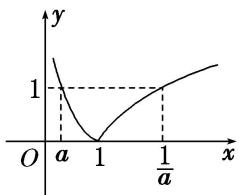  
（5） 已知函数 $f(x)=\ln(x+\sqrt{x^{2}+1})$ ， $g(x)=f(x)+2017$ ，下列命题：

① $f(x)$ 的定义域为 $(-∞, +∞)$ ;  
② $f(x)$ 是奇函数；  
③ $f(x)$ 在 $(-∞, +∞)$ 上单调递增；  
④若实数 a, b 满足 $f(a)+f(b-1)=0$ ，则 $a+b=1$ ;  
⑤设函数 $g(x)$ 在 $[-2017, 2017]$ 上的最大值为 M，最小值为 m，则 $M + m = 2017$ .
其中真命题的序号是\_\_\_\_．(写出所有真命题的序号)
答案 ①②③④ 解析 对于①， $\because \sqrt{x^2 + 1} > \sqrt{x^2} = |x| \geq -x$ ， $\therefore \sqrt{x^2 + 1} + x > 0$ ， $\therefore f(x)$ 的定义域为 R， $\therefore$ ① 正确．对于②， $f(x) + f(-x) = \ln (x + \sqrt{x^2 + 1}) + \ln (-x + \sqrt{(-x)^2 + 1}) = \ln [(x^2 + 1) - x^2] = \ln 1 = 0$ ． $\therefore f(x)$ 是奇函数， $\therefore$ ② 正确．对于③，令 $u(x) = x + \sqrt{x^2 + 1}$ ，则 $u(x)$ 在 $[0, +\infty)$ 上单调递增．当 $x \in (-\infty, 0]$ 时， $u(x) = x + \sqrt{x^2 + 1} = \frac{1}{\sqrt{x^2 + 1} - x}$ ，而 $y = \sqrt{x^2 + 1} - x$ 在 $(- \infty, 0]$ 上单调递减，且 $\sqrt{x^2 + 1} - x > 0$ ． $\therefore u(x) = \frac{1}{\sqrt{x^2 + 1} - x}$ 在
$(-\infty, 0]$ 上单调递增，又 $u(0) = 1$ ， $\therefore u(x)$ 在 $\mathbf{R}$ 上单调递增， $\therefore f(x) = \ln (x + \sqrt{x^2 + 1})$ 在 $\mathbf{R}$ 上单调递增， $\therefore ③$ 正确．对于④， $\because f(x)$ 是奇函数，而 $f(a) + f(b - 1) = 0$ ， $\therefore a + (b - 1) = 0$ ， $\therefore a + b = 1$ ， $\therefore ④$ 正确．对于⑤， $f(x) = g(x) - 2017$ 是奇函数，当 $x \in [-2017, 2017]$ 时， $f(x)_{\max} = M - 2017, f(x)_{\min} = m - 2017$ ， $\therefore (M - 2017) + (m - 2017) = 0$ ， $\therefore M + m = 4034$ ， $\therefore ⑤$ 不正确.

# 【对点题组】

13. 设 $a = 6^{0.4}$ , $b = \log_{0.4}0.5$ , $c = \log_80.4$ , 则 $a, b, c$ 的大小关系是( )

A. a<b<c

B. c<b<a

C. c<a<b

D. b<c<a

13. 答案 B 解析 $\because a=6^{0.4}>1,\quad b=\log_{0.4}0.5\in(0,1),\quad c=\log_{8}0.4<0,\quad \therefore a>b>c.$ 故选 B.

14. 已知 $a = \log_{\frac{1}{2}}\frac{1}{3}$ , $b = \log_{\frac{1}{3}}\frac{1}{2}$ , $c = \log_2\frac{1}{3}$ , 则( )

A. a>b>c

B. b>c>a

C. c>b>a

D. b>a>c

14. 答案 A 解析 $\because a=\log_{\frac{1}{2}}\frac{1}{3}>1,\quad0<b=\log_{\frac{1}{3}}\frac{1}{2}=\log_{3}2<1,\quad c=\log_{2}\frac{1}{3}=-\log_{2}3<0,\quad\therefore a>b>c.$

15. 已知 $a = \log_23 + \log_2\sqrt{3}$ , $b = \log_29 - \log_2\sqrt{3}$ , $c = \log_32$ , 则 $a, b, c$ 的大小关系是( )

A. a=b<c

B. $a = b > c$

C. a<b<c

D. a>b>c

15. 答案 B 解析 因为 $a = \log_23 + \log_2\sqrt{3} = \log_23\sqrt{3} = \frac{3}{2}\log_23 > 1$ ， $b = \log_29 - \log_2\sqrt{3} = \log_23\sqrt{3} = a$ ， $c = \log_32 < \log_33 = 1$ ，所以 $a = b > c$ .

16. (2019·天津)已知 $a = \log_52$ ， $b = \log_{0.5}0.2$ ， $c = 0.5^{0.2}$ ，则 $a$ ， $b$ ， $c$ 的大小关系为( )

A. a<c<b

B. a<b<c

C. b<c<a

D. c<a<b

16. 答案 A 解析 因为 $y = \log_5 x$ 是增函数，所以 $a = \log_5 2 < \log_5 \sqrt{5} = 0.5$ 。因为 $y = \log_{0.5} x$ 是减函数，所以 $b = \log_{0.5} 0.2 > \log_{0.5} 0.5 = 1$ 。因为 $y = 0.5^x$ 是减函数，所以 $0.5 = 0.5^1 < c = 0.5^{0.2} < 0.5^0 = 1$ ，即 $0.5 < c < 1$ 。所以 $a < c < b$ 。故选 A.

17. 函数 $f(x)=\sqrt{4-|x|}+\lg\frac{x^{2}-5x+6}{x-3}$ 的定义域为()

A. $(2, 3)$

B. $(2, 4]$

C. $(2, 3) \cup (3, 4]$

D. $(-1, 3) \cup (3, 6]$

17. 答案 C 解析 由 $\left\{\begin{aligned}&4-|x|\geq0,\\ &\frac{x^{2}-5x+6}{x-3}>0,\end{aligned}\right.$ 得 $\left\{\begin{aligned}&-4\leq x\leq4,\\ &x>2\text{且}x\neq3,\end{aligned}\right.$ 故函数定义域为 $(2,3)\cup(3,4]$ ，故选 C.

18. 若 $\log_{a}\frac{2}{3} < 1 (a > 0$ ，且 $a \neq 1$ ），则实数 $a$ 的取值范围是（）

A. $\left(0,\frac{2}{3}\right)$

B. $(1, +\infty)$

C. $\left(0, \frac{2}{3}\right) \cup (1, +\infty)$

D. $\begin{pmatrix}\frac{2}{3},&1\end{pmatrix}$

18. 答案 C 解析 当 0<a<1 时， $\log_{a}\frac{2}{3}<\log_{a}a=1,\quad\therefore0<a<\frac{2}{3}$ ; 当 a>1 时， $\log_{a}\frac{2}{3}<\log_{a}a=1,\quad\therefore a>1$ . ∴实数 a 的取值范围是 $\left(0,\frac{2}{3}\right)\cup(1,+\infty)$ .

19. 设函数 $f(x) = \begin{cases} 4^{1 - x}, & x \leq 1, \\ 1 - \log_{\frac{1}{4}} x, & x > 1, \end{cases}$ 则满足不等式 $f(x) \leq 2$ 的实数 $x$ 的取值集合为 \_\_\_\_.

19. 答案 $\left\{x\mid\frac{1}{2}\leq x\leq4\right\}$ 解析 原不等式等价于 $\left\{\begin{aligned}&x\leq1,\\ &4^{1-x}\leq2\end{aligned}\right.$ 或 $\left\{\begin{aligned}&x>1,\\ &1-\log_{\frac{1}{4}}x\leq2,\end{aligned}\right.$ 解得 $\frac{1}{2}\leq x\leq1$ 或 $1<x\leq4$ ，即实数

x

的取值集合为 $\{x\mid\frac{1}{2}\leq x\leq4\}$ .

20. 若 $f(x) = \lg (x^2 - 2ax + 1 + a)$ 在区间 $(- \infty, 1]$ 上单调递减，则 $a$ 的取值范围为（）

A. $[1, 2)$

B. $[1, 2]$

C. $[1, +\infty)$

D. $[2, +\infty)$

20. 答案 A 解析 令函数 $g(x) = x^2 - 2ax + 1 + a = (x - a)^2 + 1 + a - a^2$ ，其图象的对称轴为 $x = a$ ，要使函数 $f(x)$ 在 $(- \infty, 1]$ 上单调递减，则 $\left\{ \begin{array}{l} g(1) > 0, \\ a \geq 1, \end{array} \right.$ 即 $\left\{ \begin{array}{l} 2 - a > 0, \\ a \geq 1, \end{array} \right.$ 解得 $1 \leq a < 2$ ，即 $a \in [1, 2)$ ，故选 A.

21. 若函数 $y = \log_{a} x$ 在区间 $[2, +\infty)$ 上总有 $|y| > 1$ ，则实数 $a$ 的取值范围是( )

A. $\left(0,\frac{1}{2}\right)\cup(1,2)$

B. $\left( \begin{array}{cc}\frac{1}{2}, & 1 \end{array} \right)_{\cup (1,2)}$

C. $(1, 2)$

D. $\left(0, \frac{1}{2}\right) \cup (2, +\infty)$

21. 答案 B 解析 因为函数 $y = \log_{ax}$ 在 $[2, +\infty)$ 上总有 $|y| > 1$ ，当 $0 < a < 1$ 时， $y = \log_{ax}$ 在 $[2, +\infty)$ 上总有 $y < -1$ ，则 $a > \frac{1}{2}$ ，即 $\frac{1}{2} < a < 1$ ；当 $a > 1$ 时， $y = \log_{ax}$ 在 $[2, +\infty)$ 上总有 $y > 1$ ，则 $a < 2$ ，即 $1 < a < 2$ ，综上，实数 $a$ 的取值范围是 $\left( \begin{array}{cc}\frac{1}{2}, & 1 \\ 2 & 1 \end{array} \right) \cup (1, 2)$ . 故选 B.

22. 已知函数 $f(x) = |\log_3 x|$ ，实数 $m, n$ 满足 $0 < m < n$ ，且 $f(m) = f(n)$ ，若 $f(x)$ 在 $[m^2, n]$ 上的最大值为 2，则 $\frac{n}{m} =$ \_\_\_\_.

22. 答案 9 解析 $\because f(x) = |\log_3 x|$ ，正实数 $m, n$ 满足 $m < n$ ，且 $f(m) = f(n)$ ， $\therefore -\log_3 m = \log_3 n$ ， $\therefore mn = 1$ 。 $\because f(x)$ 在区间 $[m^2, n]$ 上的最大值为 2，函数 $f(x)$ 在 $[m^2, 1)$ 上是减函数，在 $(1, n]$ 上是增函数， $\therefore -\log_3 m^2 = 2$ 或 $\log_3 n = 2$ 。若 $-\log_3 m^2 = 2$ ，得 $m = \frac{1}{3}$ ，则 $n = 3$ ，此时 $\log_3 n = 1$ ，满足题意。那么 $\frac{n}{m} = 3 \div \frac{1}{3} = 9$ 。同理，若 $\log_3 n = 2$ ，得 $n = 9$ ，则 $m = \frac{1}{9}$ ，此时 $-\log_3 m^2 = 4 > 2$ ，不满足题意。综上可得 $\frac{n}{m} = 9$ 。

23. 设 $x \in [2, 8]$ 时，函数 $f(x) = \frac{1}{2} \log_a(ax) \cdot \log_a(a^2 x) (a > 0$ ，且 $a \neq 1$ 的最大值是 1，最小值是 $-\frac{1}{8}$ ，求实数 $a$ 的值.

23. 解 $f(x) = \frac{1}{2} (\log_a x + 1)(\log_a x + 2) = \frac{1}{2} [(\log_a x)^2 + 3\log_a x + 2] = \frac{1}{2}\left(\log_a x + \frac{3}{2}\right)^2 - \frac{1}{8}$ .
当 $f(x)$ 取最小值 $-\frac{1}{8}$ 时， $\log_a x = -\frac{3}{2}$ . $\because x \in [2, 8]$ ， $\therefore a \in (0, 1)$ . $\because f(x)$ 是关于 $\log_a x$ 的二次函数， $\therefore f(x)$ 的最大值必在 $x = 2$ 或 $x = 8$ 处取得.
若 $\frac{1}{2}\left(\log_a 2 + \frac{3}{2}\right)^2 - \frac{1}{8} = 1$ ，则 $a = 2^{-\frac{1}{3}}$ ，此时 $f(x)$ 取得最小值时， $x = \left(2^{-\frac{1}{3}}\right)^{-\frac{2}{3}} = \sqrt{2} \notin [2, 8]$ ，舍去；
若 $\frac{1}{2}\left(\log_a8 + \frac{3}{2}\right)^2 -\frac{1}{8} = 1$ ，则 $a = \frac{1}{2}$ ，此时 $f(x)$ 取得最小值时， $x = \left(\frac{1}{2}\right) - \frac{3}{2} = 2\sqrt{2}\in [2,8]$ ，符合题意.
$\therefore a = \frac {1}{2}.$

24. 已知函数 $f(x) = \log_a x + m (a > 0 \text{且} a \neq 1)$ 的图象过点(8, 2)，点 $P(3, -1)$ 关于直线 $x = 2$ 的对称点 $Q$ 在 $f(x)$ 的图象上.  
（1）求函数 $f(x)$ 的解析式;  
（2）令 $g(x)=2f(x)-f(x-1)$ ，求 $g(x)$ 的最小值及取得最小值时 x 的值.

24. 解 （1） 点 $P(3, -1)$ 关于直线 x=2 的对称点 Q 的坐标为 $(1, -1)$ .
由 $\left\{\begin{aligned}f(8)&=2,\\ f(1)&=-1,\end{aligned}\right.$ 得 $\left\{\begin{aligned}m+\log_{a}8&=2,\\ m+\log_{a}1&=-1,\end{aligned}\right.$ 解得 m=-1, a=2,
故函数 $f(x)$ 的解析式为 $f(x) = -1 + \log_{2}x$ .  
（2） $g(x)=2f(x)-f(x-1)=2(-1+\log_{2}x)-[-1+\log_{2}(x-1)]=\log_{2}\frac{x^{2}}{x-1}-1(x>1),$
$\because \frac {x ^ {2}}{x - 1} = \frac {(x - 1) ^ {2} + 2 (x - 1) + 1}{x - 1} = (x - 1) + \frac {1}{x - 1} + 2 \geq 2 \sqrt {(x - 1) \cdot \frac {1}{x - 1}} + 2 = 4,$
当且仅当 $x-1=\frac{1}{x-1}$ ，即 x=2 时，“=”成立，而函数 $y=\log_{2}x$ 在 $(0,+\infty)$ 上单调递增，
则 $\log_2\frac{x^2}{x - 1} - 1 \geq \log_24 - 1 = 1$ ，故当 $x = 2$ 时，函数 $g(x)$ 取得最小值 1.

