**专题十三　对数函数**

**考点一　对数函数图象辨析**

【**基本知识**】

1．对数函数的概念

函数<em>y</em>＝log<em>ax</em>(<em>a</em>&gt;0，且<em>a</em>≠1)叫做对数函数，其中<em>x</em>是自变量，函数的定义域是(0，＋∞)．

2．对数函数的图象

<table><tr><td>
函数
</td><td>
<em>y</em>＝log<em>ax</em>，<em>a</em>&gt;1
</td><td>
<em>y</em>＝log<em>ax，</em>0&lt;<em>a</em>&lt;1
</td></tr><tr><td>
图象
</td><td>
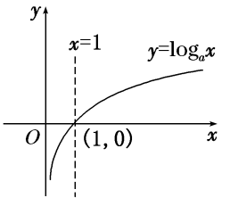
</td><td>
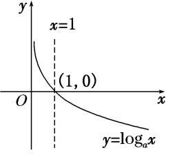
</td></tr><tr><td rowspan="2">
图象特征
</td><td colspan="2">
在<em>y</em>轴右侧，过定点(1，0)
</td></tr><tr><td>
当<em>x</em>逐渐增大时，图象是上升的
</td><td>
当<em>x</em>逐渐增大时，图象是下降的
</td></tr></table>

3．指数函数与对数函数的关系

指数函数<em>y</em>＝<em>ax</em>(<em>a</em>&gt;0，且<em>a</em>≠1)与对数函数<em>y</em>＝log<em>ax</em>(<em>a</em>&gt;0，且<em>a</em>≠1)互为反函数，它们的图象关于直线<em>y</em>＝<em>x</em>对称．

**【常用结论】**

(1)对数函数图象的画法

画对数函数<em>y</em>＝log<em>ax</em>(<em>a</em>&gt;0，且<em>a</em>≠1)的图象，应抓住三个关键点：(1，0)，(<em>a，</em>1)，和一条渐近线<em>x</em>＝0．

(2)底数*a*与1的大小关系决定了对数函数图象的“升降”：当*a*>1时，对数函数的图象“上升”；当0<*a*<1时，对数函数的图象“下降”．

(3)函数<em>y</em>＝log<em>ax</em>与<em>y</em>＝log<em>x</em>(<em>a</em>&gt;0，且<em>a</em>≠1)的图象关于<em>x</em>轴对称．

(4)对数函数的图象与底数大小的比较

如图是对数函数(1)<em>y</em>＝log<em>ax</em>，(2)<em>y</em>＝log<em>bx</em>，(3)<em>y</em>＝log<em>cx</em>，(4)<em>y</em>＝log<em>dx</em>的图象，底数<em>a</em>，<em>b</em>，<em>c</em>，<em>d</em>与1之间的大小关系为<em>c</em>＞<em>d</em>＞1＞<em>a</em>＞<em>b</em>＞0．由此我们可得到以下规律：在第一象限内，对数函数<em>y</em>＝log<em>ax</em>(<em>a</em>&gt;0，且<em>a</em>≠1)的图象越右，底数越大．简称“底大图右”．

【**方法总结**】

有关对数函数图象辨析的解题思路

(1)已知函数解析式判断其图象，一般是取特殊点，判断选项中的图象是否过这些点，若不满足则排除．

(2)对于有关对数型函数的图象问题，一般是从最基本的对数函数的图象入手，通过平移、伸缩、对称变换而得到．特别地，当底数*a*与1的大小关系不确定时应注意分类讨论．

(3)根据对数函数图象判断底数大小的问题，可以通过底大图右进行判断．

**【例题选讲】**

<strong>[例1]</strong> (1) 函数<em>y</em>＝lg|<em>x</em>－1|的图象是(　　)

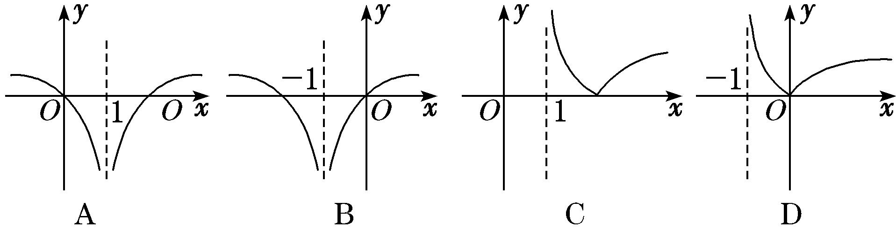

答案　A　解析　因为*y*＝lg|*x*－1|＝当*x*＝1时，函数无意义，故排除B、D．又当*x*＝2或0时，*y*＝0，所以A项符合题意．

(2) 函数<em>f</em>(<em>x</em>)＝|log<em>a</em>(<em>x</em>＋1)|(<em>a</em>&gt;0，且<em>a</em>≠1)的大致图象是(　　)

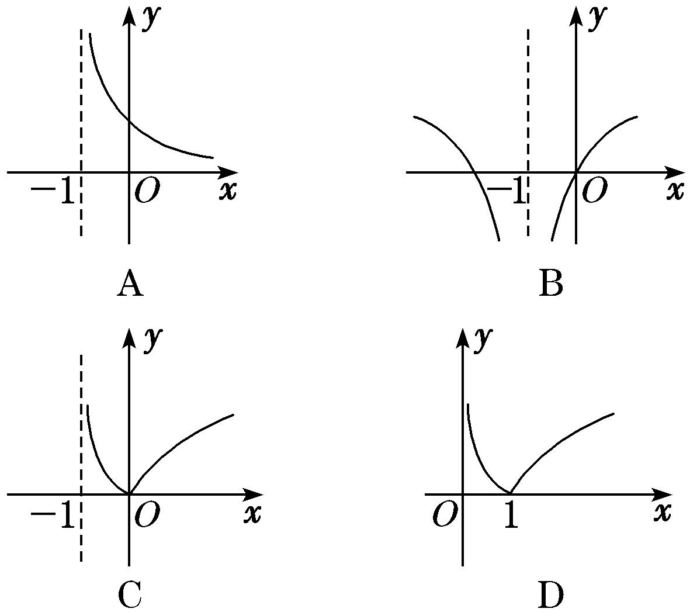

答案　C　解析　函数<em>f</em>(<em>x</em>)＝|log<em>a</em>(<em>x</em>＋1)|的定义域为{<em>x</em>|<em>x</em>&gt;－1}，且对任意的<em>x</em>，均有<em>f</em>(<em>x</em>)≥0，结合对数函数的图象可知选C．

(3) 函数<em>y</em>＝log<em>ax</em>与<em>y</em>＝－<em>x</em>＋<em>a</em>在同一坐标系中的图象可能是(　　)

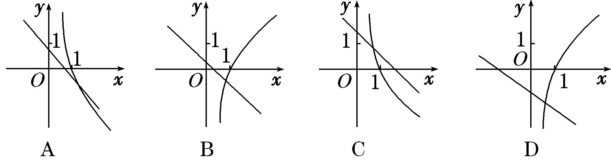

答案　A　解析　当<em>a</em>＞1时，函数<em>y</em>＝log<em>ax</em>的图象为选项B、D中过点(1，0)的曲线，此时函数<em>y</em>＝－<em>x</em>＋<em>a</em>的图象与<em>y</em>轴的交点的纵坐标<em>a</em>应满足<em>a</em>＞1，选项B、D中的图象都不符合要求；当0＜<em>a</em>＜1时，函数<em>y</em>＝log<em>ax</em>的图象为选项A、C中过点(1，0)的曲线，此时函数<em>y</em>＝－<em>x</em>＋<em>a</em>的图象与<em>y</em>轴的交点的纵坐标<em>a</em>应满足0＜<em>a</em>＜1，选项A中的图象符合要求，选项C中的图象不符合要求．

(4) 在同一直角坐标系中，函数<em>f</em>(<em>x</em>)＝<em>xa</em>(<em>x</em>≥0)，<em>g</em>(<em>x</em>)＝log<em>ax</em>(<em>a</em>&gt;0且<em>a</em>≠1)的图象可能是(　　)

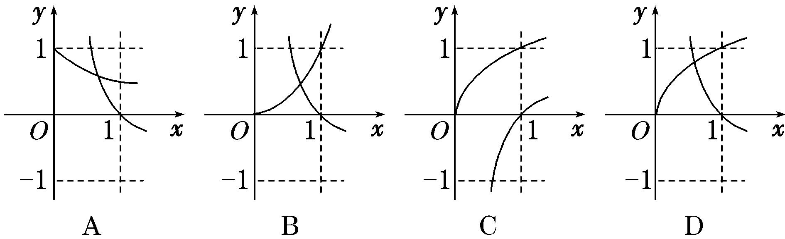

答案　D　解析　当<em>a</em>&gt;1时，函数<em>f</em>(<em>x</em>)＝<em>xa</em>(<em>x</em>≥0)单调递增，函数<em>g</em>(<em>x</em>)＝log<em>ax</em>单调递增，且过点(1，0)，由幂函数的图象性质可知C错；当0&lt;<em>a</em>&lt;1时，函数<em>f</em>(<em>x</em>)＝<em>xa</em>(<em>x</em>≥0)单调递增，且过点(1，1)，函数<em>g</em>(<em>x</em>)＝log<em>ax</em>单调递减，且过点(1，0)，排除A，又由幂函数的图象性质可知B错．故选D．

(5) (2019·浙江)在同一直角坐标系中，函数 <em>y</em>＝，<em>y</em>＝log<em>a</em>(<em>a</em>&gt;0，且<em>a</em>≠1)的图象可能是(　　)

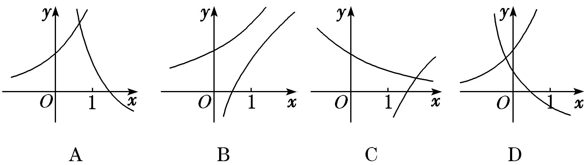

答案　D　解析　对于函数<em>y</em>＝log<em>a</em>，当<em>y</em>＝0时，有<em>x</em>＋＝1，得<em>x</em>＝，即<em>y</em>＝log<em>a</em>的图象恒过定点，排除选项A、C；函数<em>y</em>＝与<em>y</em>＝log<em>a</em>在各自定义域上单调性相反，排除选项B，故选D．

**【对点训练】**

1．函数<em>f</em>(<em>x</em>)＝2log4(1－<em>x</em>)，则函数<em>f</em>(<em>x</em>)的大致图象是(　　)

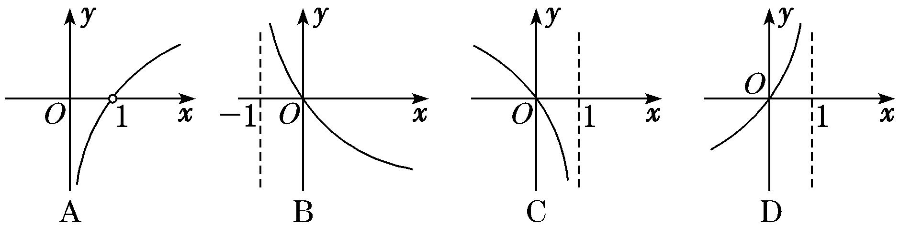

1．答案　C　解析　函数<em>f</em>(<em>x</em>)＝2log4(1－<em>x</em>)的定义域为(－∞，1)，排除A、B；函数<em>f</em>(<em>x</em>)＝2log4(1－<em>x</em>)在定

义域上单调递减，排除D．故选C．

2．函数*y*＝ln(2－|*x*|)的大致图象为(　　)

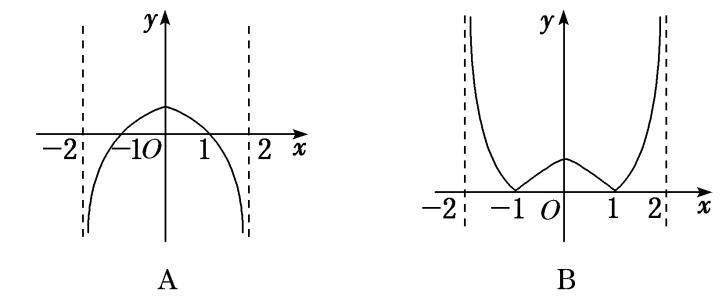

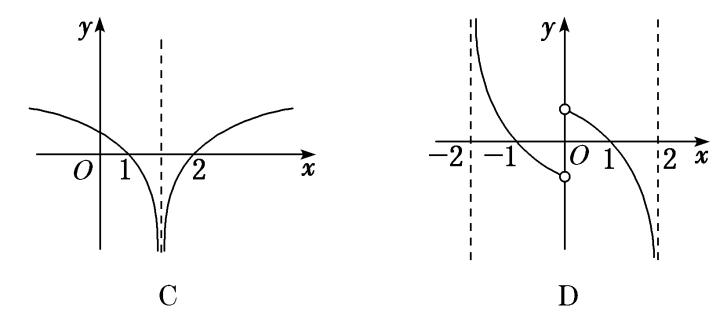

2．答案　A　解析　令*f*(*x*)＝ln(2－|*x*|)，易知函数*f*(*x*)的定义域为{*x*|－2＜*x*＜2}，且*f*(－*x*)＝ln(2－|－*x*|)＝

ln(2－|*x*|)＝*f*(*x*)，所以函数*f*(*x*)为偶函数，排除选项C、D．由对数函数的单调性及函数*y*＝2－|*x*|的单调性知A正确．

3．函数*f*(*x*)＝lg的大致图象是(　　)

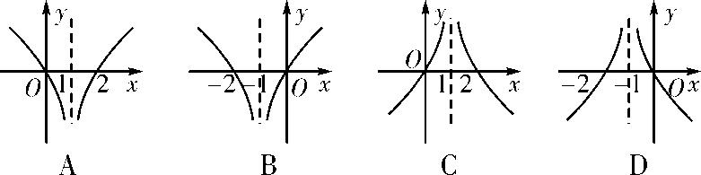

3．答案　D　解析　*f*(*x*)＝lg＝－lg|*x*＋1|的图象可由偶函数*y*＝－lg|*x*|的图象左移1个单位得到．由*y*

＝－lg|*x*|的图象可知D项正确．

4．已知lg <em>a</em>＋lg <em>b</em>＝0(<em>a</em>＞0，且<em>a</em>≠1，<em>b</em>＞0，且<em>b</em>≠1)，则函数<em>f</em>(<em>x</em>)＝<em>ax</em>与<em>g</em>(<em>x</em>)＝－log<em>bx</em>的图象可能是(　　)

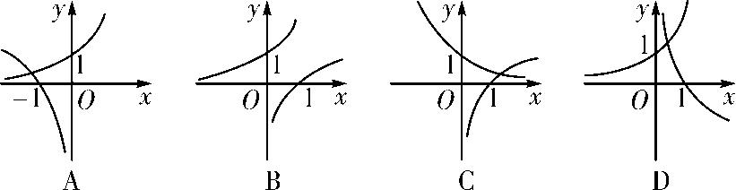

4．答案　B　解析　因为lg <em>a</em>＋lg <em>b</em>＝0，所以lg (<em>ab</em>)＝0，所以<em>ab</em>＝1，即<em>b</em>＝，故<em>g</em>(<em>x</em>)＝－log<em>bx</em>＝－

<em>x</em>＝log<em>ax</em>，则<em>f</em>(<em>x</em>)与<em>g</em>(<em>x</em>)互为反函数，其图象关于直线<em>y</em>＝<em>x</em>对称，结合图象知B项正确．故选B．

5．若函数<em>y</em>＝<em>a</em>|<em>x</em>|(<em>a</em>&gt;0，且<em>a</em>≠1)的值域为{<em>y</em>|<em>y</em>≥1}，则函数<em>y</em>＝log<em>a</em>|<em>x</em>|的图象大致是(　　)

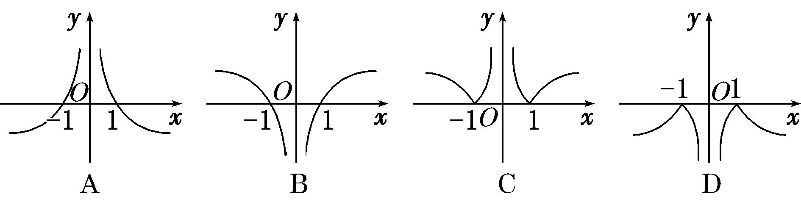

5．答案　B　解析　若函数<em>y</em>＝<em>a</em>|<em>x</em>|(<em>a</em>&gt;0，且<em>a</em>≠1)的值域为{<em>y</em>|<em>y</em>≥1}，则<em>a</em>&gt;1，故函数<em>y</em>＝log<em>a</em>|<em>x</em>|的大致图象如

选项B中图所示．

**考点二　对数函数图象的应用**

【**方法总结**】

一些对数型方程、不等式问题常转化为相应的函数图象问题，利用数形结合法求解．

**【例题选讲】**

<strong>[例2]</strong> (1) 已知当0&lt;<em>x</em>≤时，有&lt;log<em>ax</em>，则实数<em>a</em>的取值范围为\_\_\_\_\_\_\_\_．

答案　　解析　若&lt;log<em>ax</em>在<em>x</em>∈时成立，则0&lt;<em>a</em>&lt;1，且<em>y</em>＝的图象在<em>y</em>＝log<em>ax</em>图象的下方，作出图象如图所示．由图象知 &lt;log<em>a</em>，所以解得&lt;<em>a</em>&lt;1．即实数<em>a</em>的取值范围是．

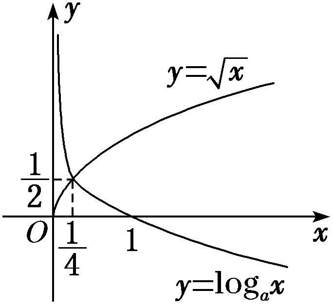

(2) 当0＜<em>x</em>≤时，4<em>x</em>＜log<em>ax</em>，则<em>a</em>的取值范围是(　　)

A．　　　　　B．　　　　　C．(1，)　　　　　D．(，2)

答案　B　解析　易知0＜<em>a</em>＜1，函数<em>y</em>＝4<em>x</em>与<em>y</em>＝log<em>ax</em>的大致图象如图，则由题意可知只需满足log<em>a</em>＞4，解得<em>a</em>＞，∴＜<em>a</em>＜1，故选B．

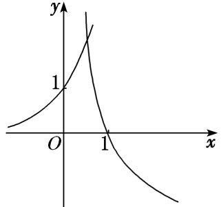

(3) 设方程10<em>x</em>＝|lg(－<em>x</em>)|的两个根分别为<em>x</em>1，<em>x</em>2，则(　　)

A．<em>x</em>1<em>x</em>2＜0　　　　　B．<em>x</em>1<em>x</em>2＝0　　　　　C．<em>x</em>1<em>x</em>2＞1　　　　　D．0＜<em>x</em>1<em>x</em>2＜1

答案　D　解析　作出<em>y</em>＝10<em>x</em>与<em>y</em>＝|lg(－<em>x</em>)|的大致图象，如图．显然<em>x</em>1＜0，<em>x</em>2＜0．不妨令<em>x</em>1＜<em>x</em>2，则<em>x</em>1＜－1＜<em>x</em>2＜0，所以10<em>x</em>1＝lg(－<em>x</em>1)，10<em>x</em>2＝－lg(－<em>x</em>2)，此时10<em>x</em>1＜10<em>x</em>2，即lg(－<em>x</em>1)＜－lg(－<em>x</em>2)，由此得lg(<em>x</em>1<em>x</em>2)＜0，所以0＜<em>x</em>1<em>x</em>2＜1，故选D．

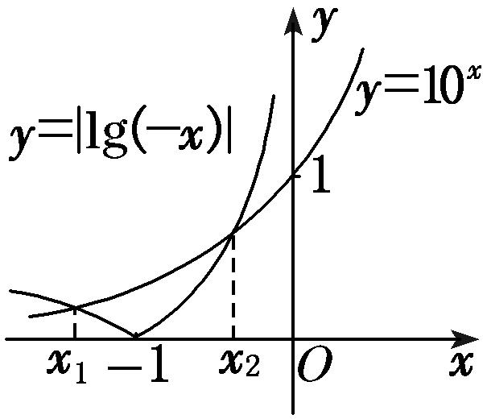

(4) 已知函数*f*(*x*)＝关于*x*的方程*f*(*x*)＋*x*－*a*＝0有且只有一个实根，则实数*a*的取值范围是\_\_\_\_\_\_\_\_\_\_．

答案　*a*>1　解析　问题等价于函数*y*＝*f*(*x*)与*y*＝－*x*＋*a*的图象有且只有一个交点，结合函数图象可知*a*>1．

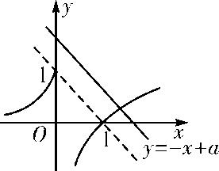

(5) (2018·全国Ⅲ)下列函数中，其图象与函数*y*＝ln *x*的图象关于直线*x*＝1对称的是(　　)

A．*y*＝ln(1－*x*)　　　　B．*y*＝ln(2－*x*)　　　　C．*y*＝ln(1＋*x*)　　　　D．*y*＝ln(2＋*x*)

答案　B　解析　易知*y*＝ln *x*与*y*＝ln(－*x*)的图象关于*y*轴对称．而*y*＝ln(2－*x*)＝ln[－(*x*－2)]，由此可知*y*＝ln(2－*x*)的图象只需将*y*＝ln(－*x*)的图象向右平移2个单位即可得到．因此*y*＝ln *x*与*y*＝ln(2－*x*)的图象关于直线*x*＝1对称．

**【对点训练】**

6．已知函数<em>f</em>(<em>x</em>)＝ln <em>x</em>，<em>g</em>(<em>x</em>)＝lg <em>x</em>，<em>h</em>(<em>x</em>)＝log3<em>x</em>，直线<em>y</em>＝<em>a</em>(<em>a</em>&lt;0)与这三个函数图象的交点的横坐标分别是

<em>x</em>1，<em>x</em>2，<em>x</em>3，则<em>x</em>1，<em>x</em>2，<em>x</em>3的大小关系是(　　)

A．<em>x</em>2&lt;<em>x</em>3&lt;<em>x</em>1　　　　　　B．<em>x</em>1&lt;<em>x</em>3&lt;<em>x</em>2　　　　　C．<em>x</em>1&lt;<em>x</em>2&lt;<em>x</em>3　　　　　D．<em>x</em>3&lt;<em>x</em>2&lt;<em>x</em>1

6．答案　A　解析　分别作出三个函数的图象，如图所示，由图可知<em>x</em>2&lt;<em>x</em>3&lt;<em>x</em>1．

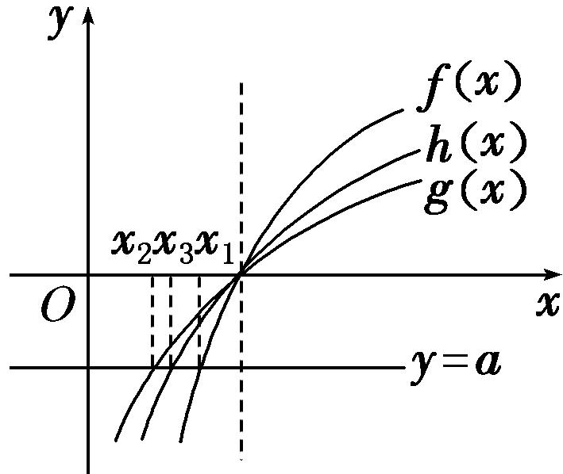

7．已知函数<em>f</em>(<em>x</em>)＝log<em>a</em>2<em>x</em>＋<em>b</em>－1(<em>a</em>&gt;0，<em>a</em>≠1)的图象如图所示，则<em>a</em>，<em>b</em>满足的关系是(　　)

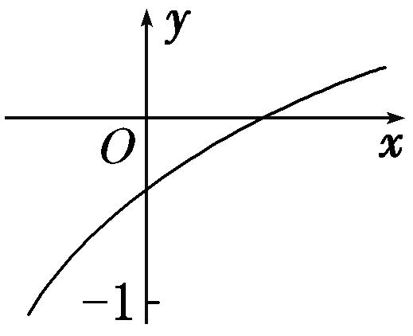

A．0&lt;<em>a</em>－1&lt;<em>b</em>&lt;1　　　　B．0&lt;<em>b</em>&lt;<em>a</em>－1&lt;1　　　　C．0&lt;<em>b</em>－1&lt;<em>a</em>&lt;1　　　　D．0&lt;<em>a</em>－1&lt;<em>b</em>－1&lt;1

7．答案　A　解析　由函数图象可知，<em>f</em>(<em>x</em>)在<strong>R</strong>上单调递增，故<em>a</em>&gt;1．函数图象与<em>y</em>轴的交点坐标为(0，log

<em>ab</em>)，由函数图象可知－1&lt;log<em>ab</em>&lt;0，解得&lt;<em>b</em>&lt;1．综上有0&lt;&lt;<em>b</em>&lt;1．

8．不等式<em>x</em>2&lt;log<em>ax</em>(<em>a</em>&gt;0，且<em>a</em>≠1)对<em>x</em>∈恒成立，求实数<em>a</em>的取值范围．

8．答案　　解析　设<em>f</em>1(<em>x</em>)＝<em>x</em>2，<em>f</em>2(<em>x</em>)＝log<em>ax</em>，要使<em>x</em>∈时，不等式<em>x</em>2&lt;log<em>ax</em>恒成立，只需<em>f</em>1(<em>x</em>)

＝<em>x</em>2在上的图象在<em>f</em>2(<em>x</em>)＝log<em>ax</em>图象的下方即可．当<em>a</em>&gt;1时，显然不成立；当0&lt;<em>a</em>&lt;1时，如图所示，要使<em>x</em>2&lt;log<em>ax</em>在<em>x</em>∈上恒成立，需<em>f</em>1≤<em>f</em>2，

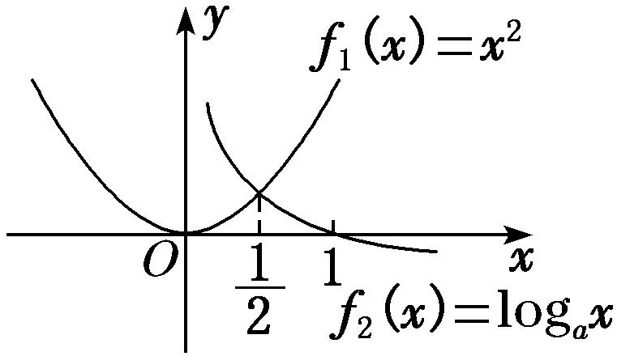

所以有2≤log<em>a</em>，解得<em>a</em>≥，所以≤<em>a</em>&lt;1．即实数<em>a</em>的取值范围是．

9．设*f*(*x*)＝|ln(*x*＋1)|，已知*f*(*a*)＝*f*(*b*)(*a*<*b*)，则(　　)

A．*a*＋*b*>0　　　　　B．*a*＋*b*>1　　　　　C．2*a*＋*b*>0　　　　　D．2*a*＋*b*>1

9．答案　A　解析　作出函数*f*(*x*)＝|ln(*x*＋1)|的图象如图所示，

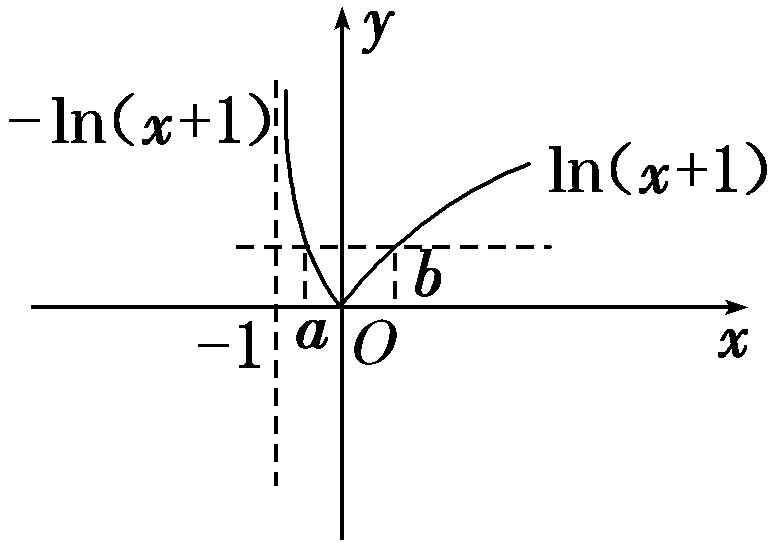

由*f*(*a*)＝*f*(*b*)，得－ln(*a*＋1)＝ln(*b*＋1)，即*ab*＋*a*＋*b*＝0．所以0＝*ab*＋*a*＋*b*<＋*a*＋*b*，即(*a*＋*b*)(*a*＋*b*＋4)>0，显然－1<*a*<0，*b*>0，∴*a*＋*b*＋4>0．∴*a*＋*b*>0．故选A．

10．若*f*(*x*)＝lg *x*，*g*(*x*)＝*f*(|*x*|)，则*g*(lg*x*)>*g*(1)时，*x*的取值范围是(　　)

A．∪(10，＋∞)　　　B．[1，2)　　　C．∪[10，＋∞)　　　D．(10，＋∞)

10．答案　A　解析　作出*g*(*x*)的图象如图所示，若使*g*(lg *x*)>*g*(1)，则lg*x*>1或lg *x*<－1，解得*x*>10或0<*x*<．

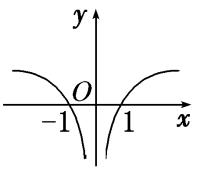

11．已知函数*f*(*x*)＝|lg*x*|．若0<*a*<*b*，且*f*(*a*)＝*f*(*b*)，则*a*＋2*b*的取值范围是(　　)

A．(2，＋∞)　　　　B．[2，＋∞)　　　　C．(3，＋∞)　　　　D．[3，＋∞)

11．答案　C　解析　*f*(*x*)＝|lg *x*|的图象如图所示，由题知*f*(*a*)＝*f*(*b*)，则有0<*a*<1<*b*，∴*f*(*a*)＝|lg *a*|＝－lg *a*，

*f*(*b*)＝|lg *b*|＝lg *b*，即－lg *a*＝lg *b*，则*a*＝，∴*a*＋2*b*＝2*b*＋．令*g*(*b*)＝2*b*＋，*g*′(*b*)＝2－，显然当*b*∈(1，＋∞)时，*g*′(*b*)>0，∴*g*(*b*)在(1，＋∞)上为增函数，∴*g*(*b*)＝2*b*＋>3，故选C．

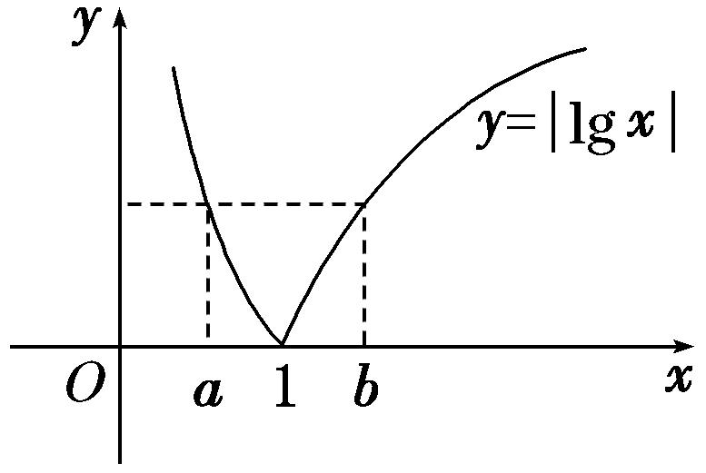

12．设平行于<em>y</em>轴的直线分别与函数<em>y</em>1＝log2<em>x</em>及函数<em>y</em>2＝log2<em>x</em>＋2的图象交于<em>B</em>，<em>C</em>两点，点<em>A</em>(<em>m</em>，<em>n</em>)位

于函数<em>y</em>2＝log2<em>x</em>＋2的图象上，如图，若△<em>ABC</em>为正三角形，则<em>m</em>·2<em>n</em>＝\_\_\_\_\_\_\_\_．

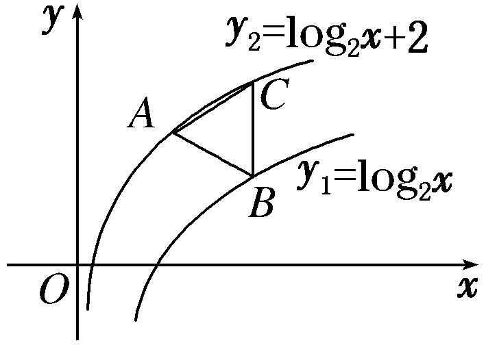

12．答案　12　解析　由题意知，<em>n</em>＝log2<em>m</em>＋2，所以<em>m</em>＝2<em>n</em>－2．又<em>BC</em>＝<em>y</em>2－<em>y</em>1＝2，且△<em>ABC</em>为正三角形，

所以可知<em>B</em>(<em>m</em>＋，<em>n</em>－1)在<em>y</em>1＝log2<em>x</em>的图象上，所以<em>n</em>－1＝log2(<em>m</em>＋)，即<em>m</em>＝2<em>n</em>－1－，所以2<em>n</em>＝4，所以<em>m</em>＝，所以<em>m</em>·2<em>n</em>＝×4＝12．

**考点三　对数函数的性质及应用**

【**基本知识**】

对数函数的性质

<table><tr><td colspan="2" rowspan="2">
函数
</td><td colspan="2">
<em>y</em>＝log<em>ax</em>(<em>a</em>&gt;0，且<em>a</em>≠1)
</td></tr><tr><td>
<em>a</em>&gt;1
</td><td>
0&lt;<em>a</em>&lt;1
</td></tr><tr><td rowspan="5">
性质
</td><td>
定义域
</td><td colspan="2">
(0，＋∞)
</td></tr><tr><td>
值域
</td><td colspan="2">
<strong>R</strong>
</td></tr><tr><td>
单调性
</td><td>
在(0，＋∞)上是增函数
</td><td>
在(0，＋∞)上是减函数
</td></tr><tr><td rowspan="2">
函数值变

化规律
</td><td colspan="2">
当<em>x</em>＝1时，<em>y</em>＝0
</td></tr><tr><td>
当<em>x</em>&gt;1时，<em>y</em>&gt;0；当0&lt;<em>x</em>&lt;1时，<em>y</em>&lt;0
</td><td>
当<em>x</em>&gt;1时，<em>y</em>&lt;0；当0&lt;<em>x</em>&lt;1时，<em>y</em>&gt;0
</td></tr></table>

**考向1　比较对数式的大小**

【**方法总结**】

对数函数值大小比较的方法

单调性法：在同底的情况下直接得到大小关系，若不同底，先化为同底．

中间量过渡法：寻找中间数联系要比较的两个数，一般是用“0”，“1”或其他特殊值进行“比较传递”

图象法：根据图象观察得出大小关系

**【例题选讲】**

<strong>[例3]</strong> (1) 设<em>a</em>＝log32，<em>b</em>＝log52，<em>c</em>＝log23，则<em>a</em>，<em>b</em>，<em>c</em>的大小关系为(　　)

A．*a*>*c*>*b*　　　　　B．*b*>*c*>*a*　　　　　C．*c*>*b*>*a*　　　　　D．*c*>*a*>*b*

答案　D　解析　∵log3&lt;log32&lt;log33，log51&lt;log52&lt;log5，log23&gt;log22，∴&lt;<em>a</em>&lt;1，0&lt;<em>b</em>&lt;，<em>c</em>&gt;1，∴<em>c</em>&gt;<em>a</em>&gt;<em>b</em>．

(2) (2013·全国Ⅱ)设<em>a</em>＝log36，<em>b</em>＝log510，<em>c</em>＝log714，则(　　)

A．*c*＞*b*＞*a*　　　　　B．*b*＞*c*＞*a*　　　　　   C．*a*＞*c*＞*b*　　　　　D．*a*＞*b*＞*c*

答案　D　解析　<em>a</em>＝log36＝1＋log32，<em>b</em>＝log510＝1＋log52，<em>c</em>＝log714＝1＋log72，则只要比较log32，log52，log72的大小即可，在同一坐标系中作出函数<em>y</em>＝log3<em>x</em>，<em>y</em>＝log5<em>x</em>，<em>y</em>＝log7<em>x</em>的图象，由三个图象的相对位置关系，可知<em>a</em>＞<em>b</em>＞<em>c</em>，故选D．

(3) (2018·天津)已知<em>a</em>＝log3，<em>b</em>＝，<em>c</em>＝，则<em>a</em>，<em>b</em>，<em>c</em>的大小关系为(　　)

A．*a*>*b*>*c*　　　　B．*b*>*a*>*c*　　　　C．*c*>*b*>*a*　　　　D．*c*>*a*>*b*

答案　D　解析　因为<em>c</em>＝＝log35&gt;log3&gt;log33＝1，所以<em>c</em>&gt;<em>a</em>，又<em>b</em>＝&lt;1，所以<em>b</em>&lt;<em>a</em>&lt;<em>c</em>．故选D

(4) 设<em>a</em>＝0.36，<em>b</em>＝log36，<em>c</em>＝log510，则(　　)

A．*c*>*b*>*a*　　　　　B．*a*>*c*>*b*　　　　　C．*b*>*c*>*a*　　　　　D．*a*>*b*>*c*

答案　C　解析　由<em>a</em>＝0.36&lt;1，<em>b</em>＝＝1＋，<em>c</em>＝1＋，又lg 5&gt;lg 3&gt;lg 2，则0&lt;&lt;，则<em>b</em>&gt;<em>c</em>&gt;1．故<em>b</em>&gt;<em>c</em>&gt;<em>a</em>．故选C．

(5) (2016·全国Ⅰ)若*a*>*b*>1，0<*c*<1，则(　　)

A．<em>ac</em>&lt;<em>bc</em>　　　　　B．<em>abc</em>&lt;<em>bac</em>　　　　　C．<em>a</em>log<em>bc</em>&lt;<em>b</em>log<em>ac</em>　　　　　D．log<em>ac</em>&lt;log<em>bc</em>

答案　C　解析　∵<em>y</em>＝<em>xα</em>，<em>α</em>∈(0，1)在(0，＋∞)上是增函数，∴当<em>a</em>&gt;<em>b</em>&gt;1，0&lt;<em>c</em>&lt;1时，<em>ac</em>&gt;<em>bc</em>，选项A不正确．∵<em>y</em>＝<em>xα</em>，<em>α</em>∈(－1，0)在(0，＋∞)上是减函数，∴当<em>a</em>&gt;<em>b</em>&gt;1，0&lt;<em>c</em>&lt;1，即－1&lt;<em>c</em>－1&lt;0时，<em>ac</em>－1&lt;<em>bc</em>－1，即<em>abc</em>&gt;<em>bac</em>，选项B不正确．∵<em>a</em>&gt;<em>b</em>&gt;1，∴lg <em>a</em>&gt;lg <em>b</em>&gt;0，∴<em>a</em>lg <em>a</em>&gt;<em>b</em>lg <em>b</em>&gt;0，∴&gt;．又∵0&lt;<em>c</em>&lt;1，∴lg <em>c</em>&lt;0．∴&lt;，∴<em>a</em>log<em>bc</em>&lt;<em>b</em>log<em>ac</em>，选项C正确．同理可证log<em>ac</em>&gt;log<em>bc</em>，选项D不正确．

**考向2　与对数有关的不等式问题**

【**方法总结**】

简单对数不等式问题的求解策略

(1)解决简单的对数不等式，应先利用对数的运算性质化为同底数的对数值，再利用对数函数的单调性转化为一般不等式求解．

(2)对数函数的单调性和底数*a*的值有关，在研究对数函数的单调性时，要按0<*a*<1和*a*>1进行分类讨论．

(3)某些对数不等式可转化为相应的函数图象问题，利用数形结合法求解．

**【例题选讲】**

<strong>[例4]</strong> (1) 设函数<em>f</em>(<em>x</em>)＝若<em>f</em>(<em>a</em>)&gt;<em>f</em>(－<em>a</em>)，则实数<em>a</em>的取值范围是(　　)

A．(－1，0)∪(0，1)　　　　　　　　　　B．(－∞，－1)∪(1，＋∞)

C．(－1，0)∪(1，＋∞)　　　　　　　　　D．(－∞，－1)∪(0，1)

答案　C　解析　由题意可得⇒*a*>1或⇒－1<*a*<0．故选C．

(2) 已知不等式log<em>x</em>(2<em>x</em>2＋1)&lt;log<em>x</em>(3<em>x</em>)&lt;0成立，则实数<em>x</em>的取值范围是\_\_\_\_\_\_\_\_．

答案　　解析　原不等式⇔或解得<*x*<，所以实数*x*的取值范围为．

(3) 已知函数<em>f</em>(<em>x</em>)是定义在<strong>R</strong>上的奇函数，且在[0，＋∞)上单调递增，若<em>f</em>(lg 2·lg 50＋(lg 5)2)＋<em>f</em>(lg <em>x</em>－2)&lt;0，则<em>x</em>的取值范围为\_\_\_\_\_\_\_\_．

答案　(0，10)　解析　∵lg 2·lg 50＋(lg 5)2＝(1－lg 5)(1＋lg 5)＋(lg 5)2＝1，∴<em>f</em>(lg 2·lg 50＋(lg 5)2)＋<em>f</em>(lg <em>x</em>－2)&lt;0可化为<em>f</em>(1)＋<em>f</em>(lg <em>x</em>－2)&lt;0，即<em>f</em>(lg <em>x</em>－2)&lt;－<em>f</em>(1)．∵函数<em>f</em>(<em>x</em>)是定义在<strong>R</strong>上的奇函数，∴<em>f</em>(lg <em>x</em>－2)&lt;<em>f</em>(－1)．又函数<em>f</em>(<em>x</em>)在[0，＋∞)上单调递增，∴函数<em>f</em>(<em>x</em>)在<strong>R</strong>上也单调递增，∴lg <em>x</em>－2&lt;－1，∴lg <em>x</em>&lt;1，∴0&lt;<em>x</em>&lt;10．

(4) 已知函数<em>f</em>(<em>x</em>)＝log<em>a</em>(8－<em>ax</em>)(<em>a</em>&gt;0，且<em>a</em>≠1)，若<em>f</em>(<em>x</em>)&gt;1在区间[1，2]上恒成立，则实数<em>a</em>的取值范围为\_\_\_\_\_\_\_\_\_\_．

答案　　解析　当<em>a</em>&gt;1时，<em>f</em>(<em>x</em>)＝log<em>a</em>(8－<em>ax</em>)在[1，2]上是减函数，因为<em>f</em>(<em>x</em>)&gt;1在[1，2]上恒成立，则<em>f</em>(<em>x</em>)min＝log<em>a</em>(8－2<em>a</em>)&gt;1，解得1&lt;<em>a</em>&lt;；当0&lt;<em>a</em>&lt;1时，<em>f</em>(<em>x</em>)在[1，2]上是增函数，因为<em>f</em>(<em>x</em>)&gt;1在[1，2]上恒成立，则<em>f</em>(<em>x</em>)min＝log<em>a</em>(8－<em>a</em>)&gt;1，即<em>a</em>＞4，故不存在实数<em>a</em>满足题意．综上可知，实数<em>a</em>的取值范围是．

(5) 已知函数*f*(*x*)＝若|*f*(*x*)|≥*ax*，则*a*的取值范围是\_\_\_\_\_\_\_\_\_\_．

答案　[－2，0]　解析　因为|<em>f</em>(<em>x</em>)|＝所以由|<em>f</em>(<em>x</em>)|≥<em>ax</em>，分两种情况：①由恒成立，可得<em>a</em>≥<em>x</em>－2恒成立，则<em>a</em>≥(<em>x</em>－2)max，即<em>a</em>≥－2；②由恒成立，并根据函数图象可知<em>a</em>≤0．综上，得－2≤<em>a</em>≤0．

**考向3　与对数有关的复合函数性质应用问题**

【**方法总结**】

与对数有关的单调性问题的解题策略

(1)求出函数的定义域．

(2)判断对数函数的底数与1的关系，当底数是含字母的代数式(包含单独一个字母)时，要考查其单调性，就必须对底数进行分类讨论．

(3)判断内层函数和外层函数的单调性，运用复合函数“同增异减”原则判断函数的单调性．

**【例题选讲】**

<strong>[例5]</strong> (1) 函数<em>y</em>＝log4(7＋6<em>x</em>－<em>x</em>2)的单调递增区间是\_\_\_\_\_\_\_\_\_\_．

答案　(－1，3]　解析　设<em>y</em>＝log4<em>u</em>，<em>u</em>＝<em>g</em>(<em>x</em>)＝7＋6<em>x</em>－<em>x</em>2＝－(<em>x</em>－3)2＋16，则对于二次函数<em>u</em>＝<em>g</em>(<em>x</em>)，当<em>x</em> ≤3时为增函数，当<em>x</em>≥3时为减函数．又<em>y</em>＝log4<em>u</em>是增函数，且由7＋6<em>x</em>－<em>x</em>2＞0得函数的定义域为(－1，7)，于是函数<em>f</em>(<em>x</em>)的单调递增区间为(－1，3]．

(2) 函数<em>f</em>(<em>x</em>)＝log<em>a</em>(<em>ax</em>－3)(<em>a</em>&gt;0，且<em>a</em>≠1)在[1，3]上单调递增，则<em>a</em>的取值范围是(　　)

A．(1，＋∞)　　　　　B．(0，1)　　　　　C．　　　　　D．(3，＋∞)

答案　D　解析　由于<em>a</em>&gt;0，且<em>a</em>≠1，∴<em>u</em>＝<em>ax</em>－3为增函数，∴若函数<em>f</em>(<em>x</em>)为增函数，则<em>f</em>(<em>x</em>)＝log<em>au</em>必为增函数，因此<em>a</em>&gt;1．又<em>u</em>＝<em>ax</em>－3在[1，3]上恒为正，∴<em>a</em>－3&gt;0，即<em>a</em>&gt;3．

(3) 若函数<em>f</em>(<em>x</em>)＝log<em>a</em>(<em>x</em>2－<em>ax</em>＋5)(<em>a</em>&gt;0且<em>a</em>≠1)满足对任意的<em>x</em>1，<em>x</em>2，当<em>x</em>1&lt;<em>x</em>2≤时，<em>f</em>(<em>x</em>2)－<em>f</em>(<em>x</em>1)&lt;0，则实数<em>a</em>的取值范围为\_\_\_\_\_\_\_\_．

答案　(1，2)　解析　当<em>x</em>1&lt;<em>x</em>2≤时，<em>f</em>(<em>x</em>2)－<em>f</em>(<em>x</em>1)&lt;0，即函数<em>f</em>(<em>x</em>)在区间上为减函数，设<em>g</em>(<em>x</em>)＝<em>x</em>2－<em>ax</em>＋5，则解得1&lt;<em>a</em>&lt;2．

(4) 设函数<em>f</em>(<em>x</em>)＝|log<em>ax</em>|(0&lt;<em>a</em>&lt;1)的定义域为[<em>m</em>，<em>n</em>](<em>m</em>&lt;<em>n</em>)，值域为[0，1]，若<em>n</em>－<em>m</em>的最小值为，则实数<em>a</em>的值为(　　)

A．　　　　　　B．或　　　　　　C．　　　　　　D．或

答案　C　解析　作出<em>y</em>＝|log<em>ax</em>|(0&lt;<em>a</em>&lt;1)的大致图象如图，令|log<em>ax</em>|＝1，得<em>x</em>＝<em>a</em>或<em>x</em>＝，又1－<em>a</em>－＝1－<em>a</em>－＝&lt;0，故1－<em>a</em>&lt;－1，所以<em>n</em>－<em>m</em>的最小值为1－<em>a</em>＝，即<em>a</em>＝．

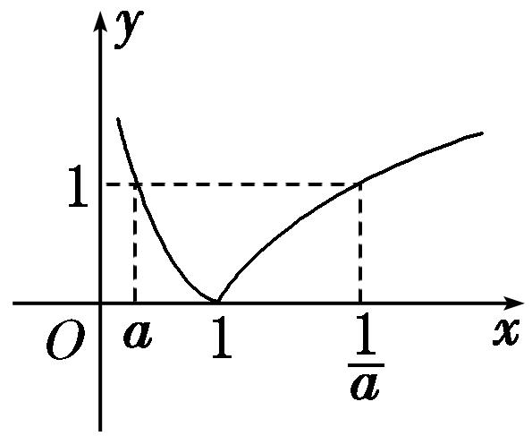

(5) 已知函数*f*(*x*)＝ln(*x*＋)，*g*(*x*)＝*f*(*x*)＋2 017，下列命题：

①*f*(*x*)的定义域为(－∞，＋∞)；

②*f*(*x*)是奇函数；

③*f*(*x*)在(－∞，＋∞)上单调递增；

④若实数*a*，*b*满足*f*(*a*)＋*f*(*b*－1)＝0，则*a*＋*b*＝1；

⑤设函数*g*(*x*)在[－2 017，2 017]上的最大值为*M*，最小值为*m*，则*M*＋*m*＝2 017．

其中真命题的序号是\_\_\_\_\_\_\_\_．(写出所有真命题的序号)

答案　①②③④　解析　对于①，∵&gt;＝|<em>x</em>|≥－<em>x</em>，∴＋<em>x</em>&gt;0， ∴<em>f</em>(<em>x</em>)的定义域为<strong>R</strong>，∴①正确．对于②，<em>f</em>(<em>x</em>)＋<em>f</em>(－<em>x</em>)＝ln(<em>x</em>＋)＋ln(－<em>x</em>＋)＝ln[(<em>x</em>2＋1)－<em>x</em>2]＝ln 1＝0．∴<em>f</em>(<em>x</em>)是奇函数，∴②正确．对于③，令<em>u</em>(<em>x</em>)＝<em>x</em>＋，则<em>u</em>(<em>x</em>)在[0，＋∞)上单调递增．当<em>x</em>∈(－∞，0]时，<em>u</em>(<em>x</em>)＝<em>x</em>＋＝，而<em>y</em>＝－<em>x</em>在(－∞，0]上单调递减，且－<em>x</em>&gt;0．∴<em>u</em>(<em>x</em>)＝在(－∞，0]上单调递增，又<em>u</em>(0)＝1，∴<em>u</em>(<em>x</em>)在<strong>R</strong>上单调递增，∴<em>f</em>(<em>x</em>)＝ln (<em>x</em>＋)在<strong>R</strong>上单调递增，∴③正确．对于④，∵<em>f</em>(<em>x</em>)是奇函数，而<em>f</em>(<em>a</em>)＋<em>f</em>(<em>b</em>－1)＝0，∴<em>a</em>＋(<em>b</em>－1)＝0，∴<em>a</em>＋<em>b</em>＝1，∴④正确．对于⑤，<em>f</em>(<em>x</em>)＝<em>g</em>(<em>x</em>)－2 017是奇函数，当<em>x</em>∈[－2 017，2 017]时，<em>f</em>(<em>x</em>)max＝<em>M</em>－2 017，<em>f</em>(<em>x</em>)min＝<em>m</em>－2 017，∴(<em>M</em>－2 017)＋(<em>m</em>－2 017)＝0，∴<em>M</em>＋<em>m</em>＝4 034，∴⑤不正确．

【**对点题组**】

13．设<em>a</em>＝60.4，<em>b</em>＝log0.40.5，<em>c</em>＝log80.4，则<em>a</em>，<em>b</em>，<em>c</em>的大小关系是(　　)

A．*a*<*b*<*c*　　　　　B．*c*<*b*<*a*　　　　　C．*c*<*a*<*b*　　　　　D．*b*<*c*<*a*

13．答案　B　解析　∵<em>a</em>＝60.4&gt;1，<em>b</em>＝log0.40.5∈(0，1)，<em>c</em>＝log80.4&lt;0，∴<em>a</em>&gt;<em>b</em>&gt;<em>c</em>．故选B．

14．已知<em>a</em>＝，<em>b</em>＝，<em>c</em>＝log2，则(　　)

A．*a*>*b*>*c*　　　　　B．*b*>*c*>*a*　　　　　C．*c*>*b*>*a*　　　　　D．*b*>*a*>*c*

14．答案　A　解析　∵<em>a</em>＝&gt;1，0&lt;<em>b</em>＝＝log32&lt;1，<em>c</em>＝log2 ＝－log23&lt;0，∴<em>a</em>&gt;<em>b</em>&gt;<em>c</em>．

15．已知<em>a</em>＝log23＋log2，<em>b</em>＝log29－log2，<em>c</em>＝log32，则<em>a</em>，<em>b</em>，<em>c</em>的大小关系是(　　)

A．*a*＝*b*<*c*　　　　　　B．*a*＝*b*>*c*　　　　　　C．*a*<*b*<*c*　　　　　　D．*a*>*b*>*c*

15．答案　B　解析　因为<em>a</em>＝log23＋log2＝log23＝log23&gt;1，<em>b</em>＝log29－log2＝log23＝<em>a</em>，<em>c</em>＝

log32&lt;log33＝1，所以<em>a</em>＝<em>b</em>&gt;<em>c</em>．

16．(2019·天津)已知<em>a</em>＝log52，<em>b</em>＝log0.50.2，<em>c</em>＝0.50.2，则<em>a</em>，<em>b</em>，<em>c</em>的大小关系为(　　)

A．*a*<*c*<*b*　　　　　B．*a*<*b*<*c*　　　　　C．*b*<*c*<*a*　　　　　D．*c*<*a*<*b*

16．答案　A　解析　因为<em>y</em>＝log5<em>x</em>是增函数，所以<em>a</em>＝log52&lt;log5＝0.5．因为<em>y</em>＝log0.5<em>x</em>是减函数，所

以<em>b</em>＝log0.50.2&gt;log0.50.5＝1．因为<em>y</em>＝0.5<em>x</em>是减函数，所以0.5＝0.51&lt;<em>c</em>＝0.50.2&lt;0.50＝1，即0.5&lt;<em>c</em>&lt;1．所以<em>a</em>&lt;<em>c</em>&lt;<em>b</em>．故选A．

17．函数*f*(*x*)＝＋lg的定义域为(　　)

A．(2，3)　　　　　B．(2，4]　　　　　C．(2，3)∪(3，4]　　　　　D．(－1，3)∪(3，6]

17．答案　C　解析　由得故函数定义域为(2，3)∪(3，4]，故选C．

18．若log<em>a</em>&lt;1(<em>a</em>&gt;0，且<em>a</em>≠1)，则实数<em>a</em>的取值范围是(　　)

A．　　　　B．(1，＋∞)　　　　C．∪(1，＋∞)　　　　D．

18．答案　C　解析　当0&lt;<em>a</em>&lt;1时，log<em>a</em>&lt;log<em>aa</em>＝1，∴0&lt;<em>a</em>&lt;；当<em>a</em>&gt;1时，log<em>a</em>&lt;log<em>aa</em>＝1，∴<em>a</em>&gt;1．∴实

数*a*的取值范围是∪(1，＋∞)．

19．设函数*f*(*x*)＝则满足不等式*f*(*x*)≤2的实数*x*的取值集合为\_\_\_\_\_\_\_\_\_\_．

19．答案　{*x*　解析　原不等式等价于或解得≤*x*≤1或1<*x*≤4，即实数*x*

的取值集合为{*x*．

20．若<em>f</em>(<em>x</em>)＝lg(<em>x</em>2－2<em>ax</em>＋1＋<em>a</em>)在区间(－∞，1]上单调递减，则<em>a</em>的取值范围为(　　)

A．[1，2)　　　　　B．[1，2]　　　　　C．[1，＋∞)　　　　　D．[2，＋∞)

20．答案　A　解析　令函数<em>g</em>(<em>x</em>)＝<em>x</em>2－2<em>ax</em>＋1＋<em>a</em>＝(<em>x</em>－<em>a</em>)2＋1＋<em>a</em>－<em>a</em>2，其图象的对称轴为<em>x</em>＝<em>a</em>，要使函

数*f*(*x*)在(－∞，1]上单调递减，则即解得1≤*a*<2，即*a*∈[1，2)，故选A．

21．若函数<em>y</em>＝log<em>ax</em>在区间[2，＋∞)上总有|<em>y</em>|＞1，则实数<em>a</em>的取值范围是(　　)

A．∪(1，2)　　　B．∪(1，2)　　　C．(1，2)　　　D．∪(2，＋∞)

21．答案　B　解析　因为函数<em>y</em>＝log<em>ax</em>在[2，＋∞)上总有|<em>y</em>|＞1，当0＜<em>a</em>＜1时，<em>y</em>＝log<em>ax</em>在[2，＋∞)上

总有<em>y</em>＜－1，则<em>a</em>＞，即＜<em>a</em>＜1；当<em>a</em>＞1时，<em>y</em>＝log<em>ax</em>在[2，＋∞)上总有<em>y</em>＞1，则<em>a</em>＜2，即1＜<em>a</em>＜2，综上，实数<em>a</em>的取值范围是∪(1，2)．故选B．

22．已知函数<em>f</em>(<em>x</em>)＝|log3<em>x</em>|，实数<em>m</em>，<em>n</em>满足0&lt;<em>m</em>&lt;<em>n</em>，且<em>f</em>(<em>m</em>)＝<em>f</em>(<em>n</em>)，若<em>f</em>(<em>x</em>)在[<em>m</em>2，<em>n</em>]上的最大值为2，则＝

\_\_\_\_\_\_\_\_．

22．答案　9　解析　∵<em>f</em>(<em>x</em>)＝|log3<em>x</em>|，正实数<em>m</em>，<em>n</em>满足<em>m</em>&lt;<em>n</em>，且<em>f</em>(<em>m</em>)＝<em>f</em>(<em>n</em>)，∴－log3<em>m</em>＝log3<em>n</em>，∴<em>mn</em>＝1．∵

<em>f</em>(<em>x</em>)在区间[<em>m</em>2，<em>n</em>]上的最大值为2，函数<em>f</em>(<em>x</em>)在[<em>m</em>2，1)上是减函数，在(1，<em>n</em>]上是增函数，∴－log3<em>m</em>2＝2或log3<em>n</em>＝2．若－log3<em>m</em>2＝2，得<em>m</em>＝，则<em>n</em>＝3，此时log3<em>n</em>＝1，满足题意．那么＝3÷＝9．同理，若log3<em>n</em>＝2，得<em>n</em>＝9，则<em>m</em>＝，此时－log3<em>m</em>2＝4&gt;2，不满足题意．综上可得＝9．

23．设<em>x</em>∈[2，8]时，函数<em>f</em>(<em>x</em>)＝log<em>a</em>(<em>ax</em>)·log<em>a</em>(<em>a</em>2<em>x</em>)(<em>a</em>&gt;0，且<em>a</em>≠1)的最大值是1，最小值是－，求实数<em>a</em>的

值．

23．解　<em>f</em>(<em>x</em>)＝(log<em>ax</em>＋1)(log<em>ax</em>＋2)＝[(log<em>ax</em>)2＋3log<em>ax</em>＋2]＝2－．

当<em>f</em>(<em>x</em>)取最小值－时，log<em>ax</em>＝－．∵<em>x</em>∈[2，8]，∴<em>a</em>∈(0，1)．∵<em>f</em>(<em>x</em>)是关于log<em>ax</em>的二次函数，

∴*f*(*x*)的最大值必在*x*＝2或*x*＝8处取得．

若2－＝1，则<em>a</em>＝2，此时<em>f</em>(<em>x</em>)取得最小值时，<em>x</em>＝(2)＝∉[2，8]，舍去；

若2－＝1，则<em>a</em>＝，此时<em>f</em>(<em>x</em>)取得最小值时，<em>x</em>＝－＝2∈[2，8]，符合题意．

∴*a*＝．

24．已知函数<em>f</em>(<em>x</em>)＝log<em>ax</em>＋<em>m</em>(<em>a</em>&gt;0且<em>a</em>≠1)的图象过点(8，2)，点<em>P</em>(3，－1)关于直线<em>x</em>＝2的对称点<em>Q</em>在<em>f</em>(<em>x</em>)

的图象上．

(1)求函数*f*(*x*)的解析式；

(2)令*g*(*x*)＝2*f*(*x*)－*f*(*x*－1)，求*g*(*x*)的最小值及取得最小值时*x*的值．

24．解　(1)点*P*(3，－1)关于直线*x*＝2的对称点*Q*的坐标为(1，－1)．

由得解得*m*＝－1，*a*＝2，

故函数<em>f</em>(<em>x</em>)的解析式为<em>f</em>(<em>x</em>)＝－1＋log2<em>x</em>．

(2)<em>g</em>(<em>x</em>)＝2<em>f</em>(<em>x</em>)－<em>f</em>(<em>x</em>－1)＝2(－1＋log2<em>x</em>)－[－1＋log2(<em>x</em>－1)]＝log2－1(<em>x</em>&gt;1)，

∵＝＝(*x*－1)＋＋2≥2 ＋2＝4，

当且仅当<em>x</em>－1＝，即<em>x</em>＝2时，“＝”成立，而函数<em>y</em>＝log2<em>x</em>在(0，＋∞)上单调递增，

则log2－1≥log24－1＝1，故当<em>x</em>＝2时，函数<em>g</em>(<em>x</em>)取得最小值1．

