# 专题十三 指数函数

# 考点一 指数函数的图象及应用

# 【基本知识】

#### 1. 指数函数的定义

函数 $y=a^{x}(a>0$ ，且 $a\neq1)$ 叫做指数函数，其中指数 x 是自变量，函数的定义域是 R，a 是底数.

#### 2. 指数函数的图象

<table><tr><td rowspan="2">函数</td><td colspan="2"> $y = a^{x}(a > 0$ ,且  $a \neq 1)$ </td></tr><tr><td> $0 < a < 1$ </td><td> $a > 1$ </td></tr><tr><td>图象</td><td>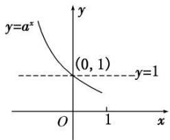</td><td>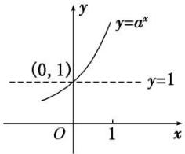</td></tr><tr><td rowspan="2">图象特征</td><td colspan="2">在  $x$  轴上方,过定点(0,1)</td></tr><tr><td>当  $x$  逐渐增大时,图象逐渐下降</td><td>当  $x$  逐渐增大时,图象逐渐上升</td></tr></table>

# 【常用结论】

#### 1. 指数函数图象的画法

画指数函数 $y = a^{x} (a > 0$ ，且 $a \neq 1$ 的图象，应抓住三个关键点： $(1, a), (0, 1)$ ， $\left(-1, \frac{1}{a}\right)$ 和一条渐近线 $y = 0$ .

2. 底数 a 与 1 的大小关系决定了指数函数图象的“升降”: 当 a > 1 时, 指数函数的图象“上升”; 当 0 < a < 1 时, 指数函数的图象“下降”.

3. 函数 $y = a^x$ 与 $y = \left(\frac{1}{a}\right)^x (a > 0$ ，且 $a \neq 1$ ) 的图象关于 $y$ 轴对称.

#### 4. 指数函数的图象与底数大小的比较
如图是指数函数（1） $y=a^{x}$ ，（2） $y=b^{x}$ ，（3） $y=c^{x}$ ，（4） $y=d^{x}$ 的图象，底数a，b，c，d与1之间的大小关系为c>d>1>a>b>0。由此我们可得到以下规律：在第一象限内，指数函数 $y=a^{x}(a>0,a\neq1)$ 的图象越高，底数越大。简称“底大图高”。

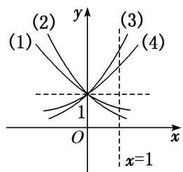

# 考向1 指数函数图象辨析

# 【方法总结】

# 有关指数函数图象辨析及图象应用的解题思路  
（1）已知函数解析式判断其图象，一般是取特殊点，判断选项中的图象是否过这些点，若不满足则排除.  
（2）对于有关指数型函数的图象问题，一般是从最基本的指数函数的图象入手，通过平移、伸缩、对称

变换而得到．特别地，当底数 a 与 1 的大小关系不确定时应注意分类讨论.  
（3）根据指数函数图象判断底数大小的问题，可以通过底大图高进行判断.

# 【例题选讲】

[例 1] （1） 函数 $f(x)=2^{1-x}$ 的大致图象为()

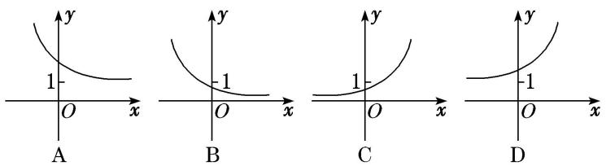  
（2） 函数 $f(x)=1-\mathrm{e}^{|x|}$ 的图象大致是()

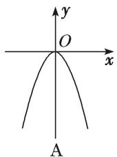

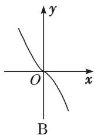

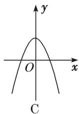

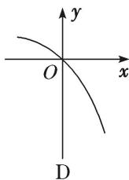  
（3） 函数 $f(x)=a^{x-b}$ 的图象如图所示，其中 a, b 为常数，则下列结论正确的是()

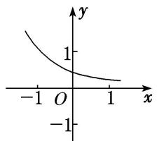

A. a>1, b<0

B. a>1, b>0

C. 0<a<1, b>0

D. 0<a<1, b<0  
（4） 已知函数 $f(x)=(x-a)(x-b)$ (其中 a>b) 的图象如图所示，则函数 $g(x)=a^{x}+b$ 的图象是()

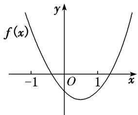

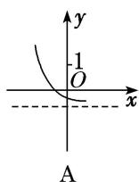

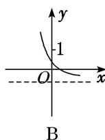

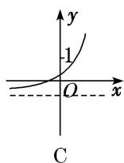

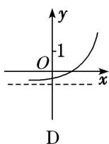  
（5） 已知函数 $f(x)=2^{x}-2$ ，则函数 $y=|f(x)|$ 的图象可能是()

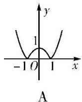

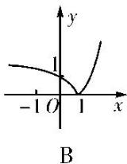

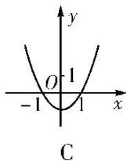

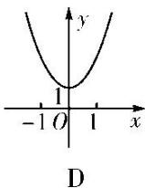

# 考向2 指数函数图象的应用

# 【方法总结】

一些指数方程、不等式问题的求解，往往利用相应的指数型函数图象数形结合求解.

[例 2] （1） 若函数 $y=|3^{x}-1|$ 在 $(-∞, k]$ 上单调递减，则 k 的取值范围为 \_\_\_\_.
> 

> 
> | 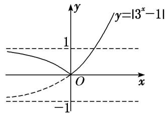 | 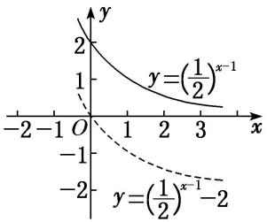 |
> | --- | --- |
> | （2）若函数 $y=2^{1-x}+m$ 的图象不经过第一象限，则 m 的取值范围为 \_\_\_\_. | （3）已知 $a > 0$ ，且 $a \neq 1$ ，若函数 $y = |a^x - 2|$ 与 $y = 3a$ 的图象有两个交点，则实数 $a$ 的取值范围是 \_\_\_\_. |
> 
  
（4） 若存在负实数使得方程 $2^{x} - a = \frac{1}{x - 1}$ 成立，则实数 $a$ 的取值范围是（）

A. $(2, +\infty)$

B. $(0, +\infty)$

C. $(0, 2)$

D. $(0, 1)$  
（5） 已知函数 $a$ ， $b$ 满足等式 $\left(\frac{1}{2}\right)^a = \left(\frac{1}{3}\right)^b$ ，下列五个关系式：

①0<b<a; ②a<b<0; ③0<a<b; ④b<a<0; ⑤a=b.
其中不可能成立的关系式有( )

A. 1 个

B. 2 个

C. 3 个

D. 4 个

# 【对点训练】

1. 函数 $f(x)=2^{|x-1|}$ 的大致图象是()

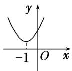  
A

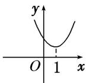  
B

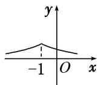  
C

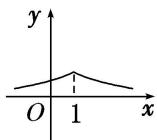  
D

2. 已知函数 $y = kx + a$ 的图象如图所示，则函数 $y = a^{x + k}$ 的图象可能是( )

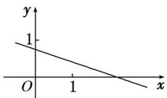

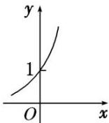  
A

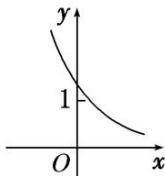  
B

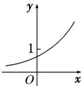  
C

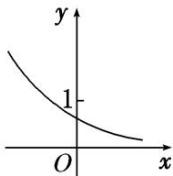  
D

3. 函数 $y=a^{x}-a^{-1}(a>0$ ，且 $a\neq1)$ 的图象可能是()

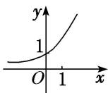  
A

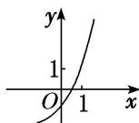  
B

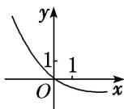  
C

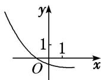  
D

4. 已知 $0 < m < n < 1$ ，则指数函数① $y = m^x$ ，② $y = n^x$ 的图象为（）

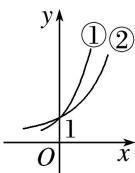  
A

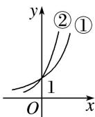  
B

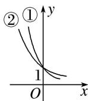  
C

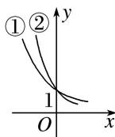  
D

5. 定义一种运算: $a \otimes b = \begin{cases} a, & a \geq b, \\ b, & a < b, \end{cases}$ 已知函数 $f(x) = 2^x \otimes (3 - x)$ , 那么函数 $y = f(x + 1)$ 的大致图象是( )

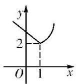  
A

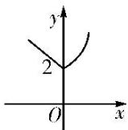  
B

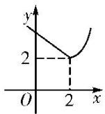  
C

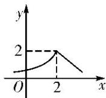  
D

6. 已知函数 $f(x) = 4 + 2a^{x - 1}$ 的图象恒过定点 $P$ ，则点 $P$ 的坐标是( )

A. $(1, 6)$

B. $(1, 5)$

C. $(0, 5)$

D. $(5, 0)$

7. 若函数 $y = |2^x - 1|$ 的图象与直线 $y = b$ 有两个公共点，则 $b$ 的取值范围为 \_\_\_\_.

8. 已知 $f(x) = |2^x - 1|$ ，当 $a < b < c$ 时，有 $f(a) > f(c) > f(b)$ ，则必有（）

A. $a <   0$ ， $b <   0$ ， $c <   0$

B. a<0, b>0, c>0

C. $2^{-a} < 2^{c}$

D. $1<2^{a}+2^{c}<2$

9. 若曲线 $|y|=2^{x}+1$ 与直线 y=b 没有公共点，则 b 的取值范围是 \_\_\_\_.

10. 如图，在面积为 8 的平行四边形 OABC 中， $AC \perp CO$ ，AC 与 BO 交于点 E．若指数函数 $y = a^{x} (a > 0$ ，且 $a \neq 1)$ 经过点 E，B，则 a 的值为（）

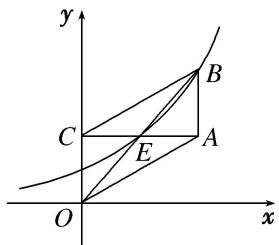

A. $\sqrt{2}$

B. $\sqrt{3}$

C. 2

D. 3

# 考点二 指数函数的性质及应用

# 【知识梳理】

指数函数的性质

<table><tr><td rowspan="2" colspan="2">函数</td><td colspan="2"> $y = a^{x} (a > 0$ ,且  $a \neq 1)$ </td></tr><tr><td> $0 < a < 1$ </td><td> $a > 1$ </td></tr><tr><td rowspan="5">性质</td><td>定义域</td><td colspan="2">R</td></tr><tr><td>值域</td><td colspan="2"> $(0, +\infty)$ </td></tr><tr><td>单调性</td><td>在 R 上是减函数</td><td>在 R 上是增函数</td></tr><tr><td rowspan="2">函数值变化规律</td><td colspan="2">当 x=0 时,y=1</td></tr><tr><td>当 x&lt;0 时,y&gt;1;当 x&gt;0 时,0&lt; y&lt;1</td><td>当 x&lt;0 时,0&lt;y&lt;1;当 x&gt;0 时,y&gt;1</td></tr></table>

# 考向1 比较指数式的大小与解不等式

# 【方法总结】

#### 1. 比较指数式大小的方法
比较两个指数式大小时，尽量化同底或同指.  
（1）当底数相同，指数不同时，构造同一指数函数，然后利用指数函数性质比较大小.  
（2）当指数相同，底数不同时，构造两个指数函数，利用图象比较大小.  
（3）当底数不同，指数也不同时，常借助1，0等中间量进行比较.

#### 2. 简单的指数方程或不等式问题的求解策略  
（1） $a^{f(x)}=a^{g(x)}\Leftrightarrow f(x)=g(x).$   
（2） $a^{f(x)}>a^{g(x)}$ ，当a>1时，等价于 $f(x)>g(x)$ ；当0<a<1时，等价于 $f(x)<g(x)$ .  
（3）解决简单的指数不等式的问题主要利用指数函数的单调性，要特别注意底数 $a$ 的取值范围，并在必要时进行分类讨论.

# 【例题选讲】

[例 3] （1） 设 $a=0.6^{0.6}$ ， $b=0.6^{1.5}$ ， $c=1.5^{0.6}$ ，则 a, b, c 的大小关系是()

A. a<b<c

B. a<c<b

C. b<a<c

D. b<c<a  
（2） (2016·全国III)已知 $a=2^{\frac{4}{3}}$ ， $b=4^{\frac{2}{5}}$ ， $c=25^{\frac{1}{3}}$ ，则()

A. b<a<c

B. a<b<c

C. b<c<a

D. c<a<b  
（3） 已知 $f(x) = 2^x - 2^{-x}$ , $a = \left(\frac{7}{9}\right)^{-\frac{1}{4}}$ , $b = \left(\frac{9}{7}\right)\frac{1}{5}$ , $c = \log_2\frac{7}{9}$ , 则 $f(a), f(b), f(c)$ 的大小关系为 ( )

A. $f(b) < f(a) < f(c)$

B. $f(c) <   f(b) <   f(a)$

C. $f(c) <   f(a) <   f(b)$

D. $f(b) <   f(c) <   f(a)$  
（4） 若偶函数 $f(x)$ 满足 $f(x)=2^{x}-4(x\geq0)$ ，则不等式 $f(x-2)>0$ 的解集为 \_\_\_\_.  
（5） 已知函数 $f(x) = \mathrm{e}^{x} - \frac{1}{\mathrm{e}^{x}}$ ，其中 $\mathbf{e}$ 是自然对数的底数，则关于 $x$ 的不等式 $f(2x - 1) + f(-x - 1) > 0$ 的解集为（）

A. $\left(-\infty,-\frac{4}{3}\right)\cup(2,+\infty)$

B. $(2, +\infty)$

C. $\left(-\infty,\frac{4}{3}\right)\cup(2,+\infty)$

D. $(-∞, 2)$

# 考向2 与指数函数有关的复合函数的值域

# 【方法总结】  
（1） $y=a^{f(x)}$ 的定义域与 $f(x)$ 的定义域相同.  
（2）先确定 $f(x)$ 的值域，再根据指数函数的值域、单调性确定函数 $y=a^{f(x)}$ 的值域.

# 【例题选讲】

[例4] （1） 函数 $y = \left(\frac{1}{2}\right)x^2 + 2x - 1$ 的值域是（）

A. $(-∞, 4)$

B. $(0, +\infty)$

C. $(0, 4]$

D. $[4, +\infty)$  
（2） 函数 $y=\left(\frac{1}{4}\right)x-\left(\frac{1}{2}\right)x+1$ 在 $[-3,2]$ 上的值域是 \_\_\_\_.  
（3） 已知 $\max(a, b)$ 表示 $a, b$ 两数中的最大值．若 $f(x) = \max\{e^{|x|}, e^{|x-2|}\}$ ，则 $f(x)$ 的最小值为 \_\_\_\_.  
（4） 若函数 $y = 4^{x} - 2^{x + 1} + b$ 在 $[-1, 1]$ 上的最大值是3，则实数 $b = (\quad)$

A. 3

B. 2

C. 1

D. 0  
（5） 如果函数 $y=a^{2x}+2a^{x}-1(a>0$ ，且 $a\neq1)$ 在 $[-1,1]$ 上有最大值 14，则 a 的值为 \_\_\_\_.

# 考向3 与指数函数有关的复合函数的单调性

# 【方法总结】

# 与指数函数有关的单调区间的求解步骤  
（1）求复合函数的定义域;   
（2）弄清函数是由哪些基本函数复合而成的;  
（3）分层逐一求解函数的单调性;   
（4）求出复合函数的单调区间(注意“同增异减”).

# 【例题选讲】

[例 5] （1） 已知函数 $f(x)=\left\{\begin{aligned}1-2^{-x},&x\geq0,\\ 2^{x}-1,&x<0,\end{aligned}\right.$ 则函数 $f(x)$ 是()

A. 偶函数，在 $[0, +\infty)$ 上单调递增

B. 偶函数，在 $[0, +\infty)$ 上单调递减

C. 奇函数，且单调递增

D. 奇函数，且单调递减  
（2） 若函数 $f(x)=a^{|2x-4|}(a>0$ ，且 $a\neq1)$ ，满足 $f(1)=\frac{1}{9}$ ，则 $f(x)$ 的单调递减区间是()

A. $(-\infty, 2]$

B. $[2, +\infty)$

C. $[-2, +\infty)$

D. $(-\infty, -2]$  
（3） 函数 $f(x)=\left(\frac{1}{2}\right)\sqrt{x-x^{2}}$ 的单调递增区间是()

A. $\left(-\infty,\frac{1}{2}\right]$

B. $\left[0,\frac{1}{2}\right]$

C. $\left[\frac{1}{2}, +\infty\right]$

D. $\left[\frac{1}{2},\quad1\right]$  
（4） 已知函数 $f(x) = 2^{|2x^{-m}|}$ ( $m$ 为常数), 若 $f(x)$ 在区间 $[2, +\infty)$ 上是增函数, 则 $m$ 的取值范围是 \_\_\_\_.  
（5） 若函数 $f(x) = a^{x}(a^{x} - 3a^{2} - 1)(a > 0 \text{ 且 } a \neq 1)$ 在区间 $[0, +\infty)$ 上是增函数，则实数 $a$ 的取值范围是（）

A. $\left[0,\frac{2}{3}\right]$

B. $\left[\frac{\sqrt{3}}{3},1\right]$

C. $(1, \sqrt{3}]$

D. $\left[\frac{3}{2}, +\infty\right]$

# 【对点训练】

11. 设 $a = 0.6^{0.6}$ , $b = 0.6^{1.5}$ , $c = 1.5^{0.6}$ , 则 $a, b, c$ 的大小关系是( )

A. a<b<c

B. a<c<b

C. b<a<c

D. b<c<a

12. 已知 $a = 2^{0.2}$ , $b = 0.4^{0.2}$ , $c = 0.4^{0.75}$ , 则( )

A. a>b>c

B. a>c>b

C. c>a>b

D. b>c>a

13. 设 $a = \left(\frac{3}{5}\right)^{\frac{2}{5}}$ , $b = \left(\frac{2}{5}\right)^{\frac{3}{5}}$ , $c = \left(\frac{2}{5}\right)^{\frac{2}{5}}$ , 则 $a, b, c$ 的大小关系是( )

A. a>c>b

B. a>b>c

C. c>a>b

D. b>c>a

14. 设函数 $f(x) = \begin{cases} \left(\frac{1}{2}\right)^x - 7, & x < 0, \\ \sqrt{x}, & x \geq 0, \end{cases}$ 若 $f(a) < 1$ ，则实数 $a$ 的取值范围是 \_\_\_\_.

15. 不等式 $2^{3 - 2x} < 0$ . $5^{3x - 4}$ 的解集为

16. 已知函数 $y = 2^{-x^2 + ax + 1}$ 在区间 $(- \infty, 3)$ 内单调递增，则 $a$ 的取值范围为 \_\_\_\_.

17. 函数 $y = 4^{x} + 2^{x + 1} + 1$ 的值域为( )

A. $(0, +\infty)$

B. $(1, +\infty)$

C. $[1, +\infty)$

D. $(-∞,+∞)$

18. 函数 $f(x) = \left(\frac{1}{4}\right)x^2 - 2x$ 的值域为 \_\_\_\_.

19. 若函数 $f(x) = a^x - 1 (a > 0, a \neq 1)$ 的定义域和值域都是[0, 2]，则实数 $a =$ \_\_\_\_.

20. 若存在正数 $x$ 使 $2^{x}(x - a) < 1$ 成立, 则 $a$ 的取值范围是

21. 已知定义在 $\mathbf{R}$ 上的函数 $f(x) = 2^{x} - \frac{1}{2^{|x|}}$ .  
（1）若 $f(x)=\frac{3}{2}$ ，求x的值；  
（2）若 $2^{t}f(2t) + mf(t)\geq 0$ 对于 $t\in [1,2]$ 恒成立，求实数 $m$ 的取值范围.

22. 已知定义域为 $\mathbf{R}$ 的函数 $f(x) = \frac{-2^x + b}{2^{x + 1} + a}$ 是奇函数.  
（1）求 a, b 的值;  
（2）若对任意的 $t \in \mathbf{R}$ , 不等式 $f(t^2 - 2t) + f(2t^2 - k) < 0$ 恒成立, 求 $k$ 的取值范围.

