# 专题十三 指数函数

# 考点一 指数函数的图象及应用

# 【基本知识】

# 1. 指数函数的定义

函数 $y=a^{x}(a>0$ ，且 $a\neq1)$ 叫做指数函数，其中指数 x 是自变量，函数的定义域是 R，a 是底数.

# 2. 指数函数的图象

<table><tr><td rowspan="2">函数</td><td colspan="2"> $y = a^{x}(a > 0$ ,且  $a \neq 1)$ </td></tr><tr><td> $0 < a < 1$ </td><td> $a > 1$ </td></tr><tr><td>图象</td><td></td><td></td></tr><tr><td rowspan="2">图象特征</td><td colspan="2">在  $x$  轴上方,过定点(0,1)</td></tr><tr><td>当  $x$  逐渐增大时,图象逐渐下降</td><td>当  $x$  逐渐增大时,图象逐渐上升</td></tr></table>

# 【常用结论】

# 1. 指数函数图象的画法

画指数函数 $y = a^{x} (a > 0$ ，且 $a \neq 1$ 的图象，应抓住三个关键点： $(1, a), (0, 1)$ ， $\left(-1, \frac{1}{a}\right)$ 和一条渐近线 $y = 0$ .

2. 底数 a 与 1 的大小关系决定了指数函数图象的“升降”: 当 a > 1 时, 指数函数的图象“上升”; 当 0 < a < 1 时, 指数函数的图象“下降”.

3. 函数 $y = a^x$ 与 $y = \left(\frac{1}{a}\right)^x (a > 0$ ，且 $a \neq 1$ ) 的图象关于 $y$ 轴对称.

# 4. 指数函数的图象与底数大小的比较

如图是指数函数(1) $y=a^{x}$ ，(2) $y=b^{x}$ ，(3) $y=c^{x}$ ，(4) $y=d^{x}$ 的图象，底数a，b，c，d与1之间的大小关系为c>d>1>a>b>0。由此我们可得到以下规律：在第一象限内，指数函数 $y=a^{x}(a>0,a\neq1)$ 的图象越高，底数越大。简称“底大图高”。

text_image

(1)
(2)
(3)
(4)
1
O
x=1
y

# 考向1 指数函数图象辨析

# 【方法总结】

# 有关指数函数图象辨析及图象应用的解题思路

(1)已知函数解析式判断其图象，一般是取特殊点，判断选项中的图象是否过这些点，若不满足则排除.  
(2)对于有关指数型函数的图象问题，一般是从最基本的指数函数的图象入手，通过平移、伸缩、对称

变换而得到．特别地，当底数 a 与 1 的大小关系不确定时应注意分类讨论.

(3)根据指数函数图象判断底数大小的问题, 可以通过底大图高进行判断.

# 【例题选讲】

[例 1] (1) 函数 $f(x)=2^{1-x}$ 的大致图象为()

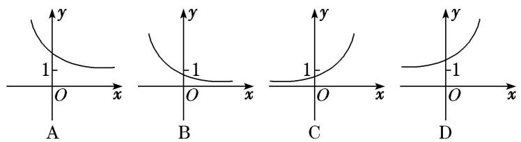

答案 A 解析 函数 $f(x)=2^{1-x}=2\times\left(\frac{1}{2}\right)x$ ，单调递减且过点(0,2)，选项 A 中的图象符合要求.

(2) 函数 $f(x)=1-\mathrm{e}^{|x|}$ 的图象大致是()

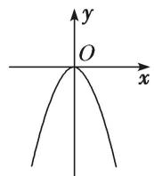  
A

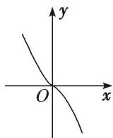  
B

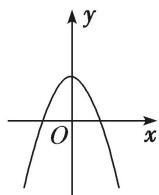  
C

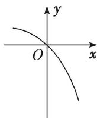  
D

答案 A 解析 因为函数 $f(x)=1-\mathrm{e}^{|x|}$ 是偶函数，且值域是 $(-∞,0]$ ，只有 A 满足上述两个性质.

(3) 函数 $f(x)=a^{x-b}$ 的图象如图所示，其中 a, b 为常数，则下列结论正确的是()

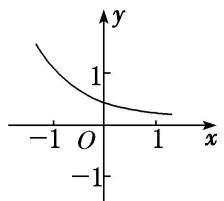

line

| x | y |
|---|---|
| -1 | 1 |
| 0 | 0 |
| 1 | -1 |

A. a>1, b<0

B. a>1, b>0

C. 0<a<1, b>0

D. $0 < a < 1, b < 0$

答案 D 解析 由 $f(x) = a^{x - b}$ 的图象可以观察出函数 $f(x) = a^{x - b}$ 在定义域上单调递减，所以 $0 < a < 1$ ，函数 $f(x) = a^{x - b}$ 的图象是在 $y = a^x$ 的图象的基础上向左平移得到的，所以 $b < 0$ .

(4) 已知函数 $f(x) = (x - a)(x - b)$ (其中 $a > b$ ) 的图象如图所示，则函数 $g(x) = a^x + b$ 的图象是()

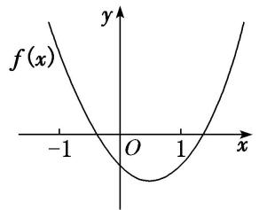

text_image

f(x)
y
-1 O 1 x

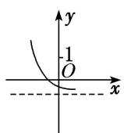  
A

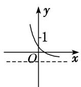  
B

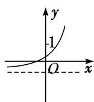  
C

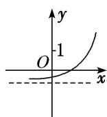  
D

答案 C 解析 由函数 $f(x)$ 的图象可知， $-1 < b < 0$ ， $a > 1$ ，则 $g(x) = a^x + b$ 为增函数，当 $x = 0$ 时， $g(0) = 1 + b > 0$ ，故选 C.

(5) 已知函数 $f(x)=2^{x}-2$ ，则函数 $y=|f(x)|$ 的图象可能是()

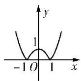  
A

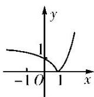  
B

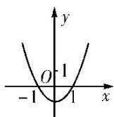  
C

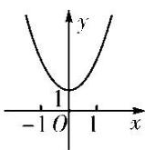  
D

答案 B 解析 $|f(x)|=|2^{x}-2|=\begin{cases}2^{x}-2,&x\geq1,\\2-2^{x},&x<1,\end{cases}$ 易知函数 $y=|f(x)|$ 的图象的分段点是 x=1，且过点 (1,

0), (0, 1), $\left(-1, \frac{3}{2}\right)$ . 又 $|f(x)| \geq 0$ ，所以 B 项正确．故选 B.

# 考向2 指数函数图象的应用

# 【方法总结】

一些指数方程、不等式问题的求解，往往利用相应的指数型函数图象数形结合求解.

[例 2] (1) 若函数 $y=|3^{x}-1|$ 在 $(-∞, k]$ 上单调递减，则 k 的取值范围为 \_\_\_\_.

答案 $(- \infty, 0]$ 解析 函数 $y = |3^x - 1|$ 的图象是由函数 $y = 3^x$ 的图象向下平移一个单位后，再把位于 $x$ 轴下方的图象沿 $x$ 轴翻折到 $x$ 轴上方得到的，函数图象如图所示.

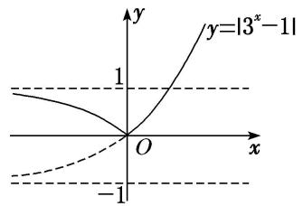

text_image

y
y=|3^x-1|
1
O
x
-1

由图象知，其在 $(-∞, 0]$ 上单调递减，所以k的取值范围为 $(-∞, 0]$ .

(2) 若函数 $y=2^{1-x}+m$ 的图象不经过第一象限，则 m 的取值范围为 \_\_\_\_.

答案 $(- \infty, -2]$ 解析 $y = 2^{1 - x} + m = \left(\frac{1}{2}\right)^{x - 1} + m$ ，函数 $y = \left(\frac{1}{2}\right)^{x - 1}$ 的图象如图所示，则要使其图象不经过第一象限，则 $m \leq -2$ 。故 $m$ 的取值范围为 $(- \infty, -2]$ .

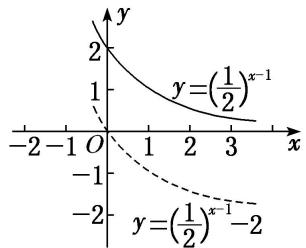

line

| x | y = (1/2)^(x-1) | y = (1/2)^x-1 |
|---|---|---|
| -2 | 0 | 0 |
| -1 | 0.57 | -0.57 |
| 0 | 1 | -1 |
| 1 | 0.57 | -0.57 |
| 2 | 0.25 | -0.25 |
| 3 | 0 | -0.25 |

(3) 已知 $a > 0$ , 且 $a \neq 1$ , 若函数 $y = |a^x - 2|$ 与 $y = 3a$ 的图象有两个交点, 则实数 $a$ 的取值范围是 \_\_\_\_.

答案 $\left(0, \frac{2}{3}\right)$ 解析 ①当 $0 < a < 1$ 时，作出函数 $y = |a^x - 2|$ 的图象如图(1). 若直线 $y = 3a$ 与函数 $y = |a^x - 2| (0 < a < 1)$ 的图象有两个交点，则由图象可知 $0 < 3a < 2$ ，所以 $0 < a < \frac{2}{3}$ .

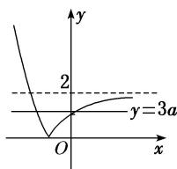

text_image

y
2
y=3a
O
x

图(1)

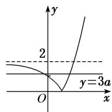  
图(2)

②当 a>1 时，作出函数 $y=|a^{x}-2|$ 的图象如图(2)，若直线 y=3a 与函数 $y=|a^{x}-2|(a>1)$ 的图象有两个交点，则由图象可知 0<3a<2，此时无解．所以实数 a 的取值范围是 $\left(0, \frac{2}{3}\right)$ .

(4) 若存在负实数使得方程 $2^{x} - a = \frac{1}{x - 1}$ 成立，则实数 $a$ 的取值范围是（）

A. $(2, +\infty)$

B. $(0, +\infty)$

C. $(0, 2)$

D. $(0, 1)$

答案 C 解析 在同一坐标系内分别作出函数 $y = \frac{1}{x - 1}$ 和 $y = 2^x - a$ 的图象，则由图知，当 $a \in (0, 2)$ 时符合要求.

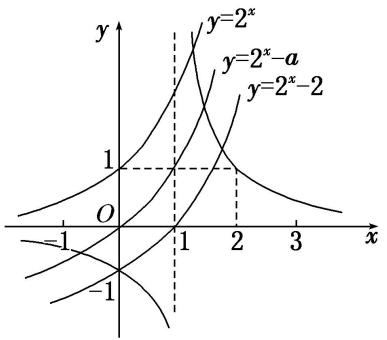

line

| x | y=2^x | y=2^x-a | y=2^x-2 |
|---|---|---|---|
| -1 | 0 | 0 | 0 |
| 0 | 0 | 0 | 0 |
| 1 | 1 | 1 | 1 |
| 2 | 0 | 0 | 0 |
| 3 | -1 | -1 | -1 |

(5) 已知函数 $a$ ， $b$ 满足等式 $\left(\frac{1}{2}\right)^a = \left(\frac{1}{3}\right)^b$ ，下列五个关系式：

①0<b<a; ②a<b<0; ③0<a<b; ④b<a<0; ⑤a=b.

其中不可能成立的关系式有( )

A. 1 个

B. 2 个

C. 3 个

D. 4 个

答案 B 解析 函数 $y_{1}=\left(\frac{1}{2}\right)x$ 与 $y_{2}=\left(\frac{1}{3}\right)x$ 的图象如图所示.

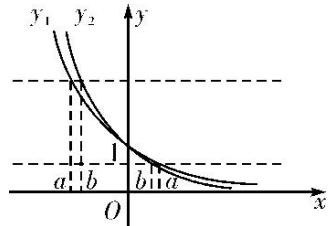

text_image

y₁ y₂
a b b a
O x

由 $\left(\frac{1}{2}\right)_{a}=\left(\frac{1}{3}\right)_{b}$ 得 a<b<0 或 0<b<a 或 a=b=0。故①②⑤可能成立，③④不可能成立。

# 【对点训练】

1. 函数 $f(x)=2^{|x-1|}$ 的大致图象是()

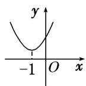  
A

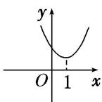  
B

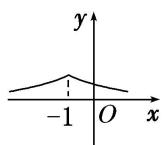  
C

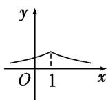  
D

1. 答案 B 解析 $f(x)=\left\{\begin{aligned}&2^{x-1},&x\geq1,\\ &\left(\frac{1}{2}\right)_{x^{-1}},&x<1,\end{aligned}\right.$ 易知 $f(x)$ 在 $[1,+\infty)$ 上单调递增，在 $(-∞,1)$ 上单调递减，故选 B.

2. 已知函数 $y=kx+a$ 的图象如图所示，则函数 $y=a^{x+k}$ 的图象可能是()

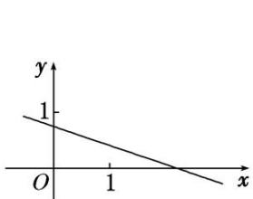

text_image

y
1
O 1 x

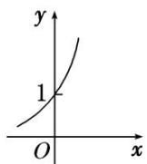  
A

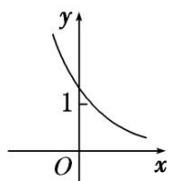  
B

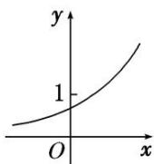  
C

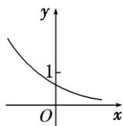  
D

2. 答案 B 解析 由函数 $y = kx + a$ 的图象可得 $k < 0, 0 < a < 1$ ，又因为与 $x$ 轴交点的横坐标大于 1，所以 $-1 < k < 0$ . 函数 $y = a^{x + k}$ 的图象可以看成把 $y = a^x$ 的图象向右平移 $-k$ 个单位得到的，且函数 $y = a^{x + k}$ 是减函数，故此函数与 $y$ 轴交点的纵坐标大于 1，结合所给的选项，应该选 B.

3. 函数 $y=a^{x}-a^{-1}(a>0$ ，且 $a\neq1)$ 的图象可能是()

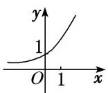  
A

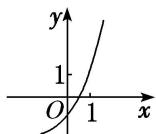  
B

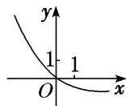  
C

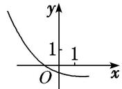  
D

3. 答案 D 解析 函数 $y = a^{x} - \frac{1}{a}$ 是由函数 $y = a^{x}$ 的图象向下平移 $\frac{1}{a}$ 个单位长度得到的，A项显然错误；当 $a > 1$ 时， $0 < \frac{1}{a} < 1$ ，平移距离小于1，所以B项错误；当 $0 < a < 1$ 时， $\frac{1}{a} > 1$ ，平移距离大于1，所以C项错误．故选D.

4. 已知 $0 < m < n < 1$ ，则指数函数① $y = m^x$ ，② $y = n^x$ 的图象为（）

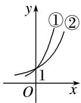  
A

  
B

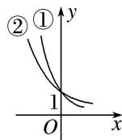  
C

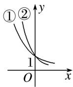  
D

4. 答案 C 解析 由于 $0 < m < n < 1$ ，所以 $y = m^x$ 与 $y = n^x$ 都是减函数，故排除 A，B，作直线 $x = 1$ 与两个曲线相交，交点在下面的是函数 $y = m^x$ 的图象。

5. 定义一种运算: $a \otimes b = \begin{cases} a, & a \geq b, \\ b, & a < b, \end{cases}$ 已知函数 $f(x) = 2^x \otimes (3 - x)$ , 那么函数 $y = f(x + 1)$ 的大致图象是( )

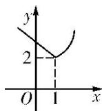  
Λ

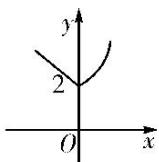  
B

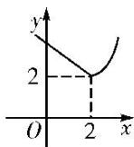  
C

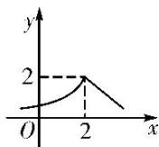  
D

5. 答案 B 解析 由题意可得 $f(x) = 2^x \quad (3 - x) = \begin{cases} 2^x, & x \geq 1, \\ 3 - x, & x < 1, \end{cases}$ 所以 $f(x + 1) = \begin{cases} 2^{x + 1}, & x \geq 0, \\ 2 - x, & x < 0, \end{cases}$ 则大致图象为B项.

6. 已知函数 $f(x) = 4 + 2a^{x - 1}$ 的图象恒过定点 $P$ ，则点 $P$ 的坐标是（）

A. $(1, 6)$

B. $(1, 5)$

C. $(0, 5)$

D. $(5, 0)$

6. 答案 A 解析 由于函数 $y = a^x$ 的图象过定点(0, 1)，当 $x = 1$ 时， $f(x) = 4 + 2 = 6$ ，故函数 $f(x) = 4 + 2a^x$ 的图象恒过定点 $P(1, 6)$ .

7. 若函数 $y = |2^x - 1|$ 的图象与直线 $y = b$ 有两个公共点，则 $b$ 的取值范围为 \_\_\_\_.

7. 答案 (0, 1) 解析 作出曲线 $y = |2^x - 1|$ 的图象与直线 $y = b$ 如图所示。由图象可得 $b$ 的取值范围是(0, 1).

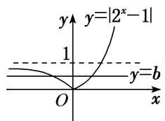

text_image

y
y=|2^x-1|
1
y=b
O
x

8. 已知 $f(x)=|2^{x}-1|$ ，当 a<b<c 时，有 $f(a)>f(c)>f(b)$ ，则必有()

A. a<0, b<0, c<0

B. $a <   0$ ， $b > 0$ ， $c > 0$

C. $2^{-a}<2^{c}$

D. $1<2^{a}+2^{c}<2$

8. 答案 D 解析 作出函数 $f(x) = |2^x - 1|$ 的图象如图所示，因为 $a < b < c$ ，且有 $f(a) > f(c) > f(b)$ ，所以必有 $a < 0$ ， $0 < c < 1$ ，且 $|2^a - 1| > |2^c - 1|$ ，所以 $1 - 2^a > 2^c - 1$ ，则 $2^a + 2^c < 2$ ，且 $2^a + 2^c > 1$ 。故选 D.

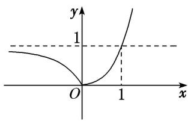

text_image

y
1
O
1
x

9. 若曲线 $|y|=2^{x}+1$ 与直线 $y=b$ 没有公共点，则 $b$ 的取值范围是 \_\_\_\_.  
9. 答案 $[-1, 1]$ 解析 曲线 $|y| = 2^x + 1$ 与直线 $y = b$ 的图象如图所示，由图可知：如果 $|y| = 2^x + 1$ 与直线 $y = b$ 没有公共点，则 $b$ 应满足的条件是 $b \in [-1, 1]$ .

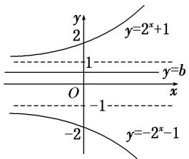

text_image

y
2
y=2^x+1
1
y=b
O
x
-1
-2
y=-2^x-1

10. 如图, 在面积为 8 的平行四边形 $OABC$ 中, $AC \perp CO$ , $AC$ 与 $BO$ 交于点 $E$ . 若指数函数 $y = a^{x} (a > 0$ , 且 $a \neq 1)$ 经过点 $E$ , $B$ , 则 $a$ 的值为( )

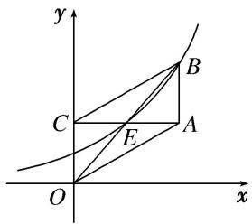

text_image

y
B
C
E
A
O
x

A. $\sqrt{2}$

B. $\sqrt{3}$

C. 2

D. 3

10. 答案 A 解析 设点 $E(t, a^t)$ ，则点 $B$ 的坐标为 $(2t, 2a^t)$ 。因为 $2a^t = a^{2t}$ ，所以 $a^t = 2$ 。因为平行四边形 $OABC$ 的面积 $= OC \times AC = a^t \times 2t = 4t$ ，又平行四边形 $OABC$ 的面积为 8，所以 $4t = 8$ ， $t = 2$ ，所以 $a^2 = 2$ ， $a = \sqrt{2}$ 。故选 A.

# 考点二 指数函数的性质及应用

# 【知识梳理】

指数函数的性质

<table><tr><td rowspan="2" colspan="2">函数</td><td colspan="2"> $y=a^{x}(a>0$ ,且 $a\neq1)$ </td></tr><tr><td> $0a>1</td><td>\( a>1$ </td></tr><tr><td rowspan="5">性质</td><td>定义域</td><td colspan="2">R</td></tr><tr><td>值域</td><td colspan="2"> $(0,+\infty)$ </td></tr><tr><td>单调性</td><td>在R上是减函数</td><td>在R上是增函数</td></tr><tr><td rowspan="2">函数值变化规律</td><td colspan="2">当x=0时,y=1</td></tr><tr><td>当x&lt;0时,y&gt;1;当x&gt;0时,0当x&lt;0时,0当x&gt;0时,y&gt;1</td><td>当x&lt;0时,0当x&gt;0时,y&gt;1</td></tr></table>

# 考向1 比较指数式的大小与解不等式

# 【方法总结】

# 1. 比较指数式大小的方法

比较两个指数式大小时，尽量化同底或同指.

(1)当底数相同，指数不同时，构造同一指数函数，然后利用指数函数性质比较大小.  
(2)当指数相同，底数不同时，构造两个指数函数，利用图象比较大小.

(3)当底数不同，指数也不同时，常借助1，0等中间量进行比较.

# 2. 简单的指数方程或不等式问题的求解策略

(1) $a^{f(x)}=a^{g(x)}\Leftrightarrow f(x)=g(x).$

(2) $a^{f(x)}>a^{g(x)}$ ，当a>1时，等价于 $f(x)>g(x)$ ；当0<a<1时，等价于 $f(x)<g(x)$ .

(3)解决简单的指数不等式的问题主要利用指数函数的单调性, 要特别注意底数 $a$ 的取值范围, 并在必要时进行分类讨论.

# 【例题选讲】

[例 3] (1) 设 $a=0.6^{0.6}$ ， $b=0.6^{1.5}$ ， $c=1.5^{0.6}$ ，则 a, b, c 的大小关系是()

A. a<b<c

B. a<c<b

C. b<a<c

D. b<c<a

答案 C 解析 因为函数 $y = 0.6^x$ 在 $\mathbf{R}$ 上单调递减，所以 $b = 0.6^{1.5} < a = 0.6^{0.6} < 1$ ，又 $c = 1.5^{0.6} > 1$ ，所以 $b < a < c$ .

(2) (2016·全国III)已知 $a = 2^{\frac{4}{3}}$ , $b = 4^{\frac{2}{5}}$ , $c = 25^{\frac{1}{3}}$ , 则()

A. b<a<c

B. a<b<c

C. b<c<a

D. c<a<b

答案 A 解析 因为 $a = 2^{\frac{4}{3}}$ , $b = 4^{\frac{2}{5}} = 2^{\frac{4}{5}}$ , 由函数 $y = 2^{x}$ 在 $\mathbf{R}$ 上为增函数知, $b < a$ ; 又因为 $a = 2^{\frac{4}{3}} = 4^{\frac{2}{3}}$ , $c = 25^{\frac{1}{3}} = 5^{\frac{2}{3}}$ , 由函数 $y = x^{\frac{2}{3}}$ 在 $(0, +\infty)$ 上为增函数知, $a < c$ . 综上得 $b < a < c$ . 故选 A.

(3) 已知 $f(x)=2^{x}-2^{-x}$ ， $a=\left(\frac{7}{9}\right)^{-\frac{1}{4}}$ ， $b=\left(\frac{9}{7}\right)\frac{1}{5}$ ， $c=\log_{2}\frac{7}{9}$ ，则 $f(a)$ ， $f(b)$ ， $f(c)$ 的大小关系为()

A. $f(b) < f(a) < f(c)$

B. $f(c) <   f(b) <   f(a)$

C. $f(c) < f(a) < f(b)$

D. $f(b) <   f(c) <   f(a)$

答案 B 解析 易知 $f(x)=2^{x}-2^{-x}$ 在 R 上为增函数，又 $a=\left(\frac{7}{9}\right)^{-\frac{1}{4}}=\left(\frac{9}{7}\right)^{\frac{1}{4}}>\left(\frac{9}{7}\right)^{\frac{1}{5}}=b>0,\quad c=\log_{2}\frac{7}{9}<0$ ，则 a>b>c，所以 $f(c)<f(b)<f(a)$ .

(4) 若偶函数 $f(x)$ 满足 $f(x)=2^{x}-4(x\geq0)$ ，则不等式 $f(x-2)>0$ 的解集为 \_\_\_\_.

答案 $\{x|x > 4$ 或 $x < 0\}$ 解析 $\because f(x)$ 为偶函数，当 $x < 0$ 时， $-x > 0$ ，则 $f(x) = f(-x) = 2^{-x} - 4$ 。 $\therefore f(x) = \begin{cases} 2^x - 4, & x \geq 0, \\ 2^{-x} - 4, & x < 0, \end{cases}$ 当 $f(x - 2) > 0$ 时，有 $\begin{cases} x - 2 \geq 0, \\ 2^{x - 2} - 4 > 0 \end{cases}$ 或 $\begin{cases} x - 2 < 0, \\ 2^{-x + 2} - 4 > 0, \end{cases}$ 解得 $x > 4$ 或 $x < 0$ 。 $\therefore$ 不等式的解集为 $\{x|x > 4$ 或 $x < 0\}$ .

(5) 已知函数 $f(x) = \mathrm{e}^{x} - \frac{1}{\mathrm{e}^{x}}$ ，其中 $\mathbf{e}$ 是自然对数的底数，则关于 $x$ 的不等式 $f(2x - 1) + f(-x - 1) > 0$ 的解集为（）

A. $\left(-\infty,-\frac{4}{3}\right)\cup(2,+\infty)$

B. $(2, +\infty)$

C. $\left(-\infty, \frac{4}{3}\right) \cup (2, +\infty)$

D. $(-\infty, 2)$

答案 B 解析 函数 $f(x)=\mathrm{e}^{x}-\frac{1}{\mathrm{e}^{x}}$ 的定义域为 R，∵ $f(-x)=\mathrm{e}^{-x}-\frac{1}{\mathrm{e}^{-x}}=\frac{1}{\mathrm{e}^{x}}-\mathrm{e}^{x}=-f(x)$ ，∴ $f(x)$ 是奇函数，那么不等式 $f(2x-1)+f(-x-1)>0$ 等价于 $f(2x-1)>-f(-x-1)=f(1+x)$ ，易证 $f(x)$ 是 R 上的单调递增函数，∴ $2x-1>x+1$ ，解得 x>2，∴ 不等式 $f(2x-1)+f(-x-1)>0$ 的解集为 $(2,+\infty)$ .

# 考向2 与指数函数有关的复合函数的值域

# 【方法总结】

(1) $y=a^{f(x)}$ 的定义域与 $f(x)$ 的定义域相同.

(2)先确定 $f(x)$ 的值域，再根据指数函数的值域、单调性确定函数 $y=a^{f(x)}$ 的值域.

# 【例题选讲】

[例 4] (1) 函数 $y=\left(\frac{1}{2}\right)x^{2}+2x-1$ 的值域是()

A. $(-\infty, 4)$

B. $(0, +\infty)$

C. $(0, 4]$

D. $[4, +\infty)$

答案 C 解析 设 $t=x^{2}+2x-1$ ，则 $y=\left(\frac{1}{2}\right)t$ 。因为 $0<\frac{1}{2}<1$ ，所以 $y=\left(\frac{1}{2}\right)t$ 为关于 t 的减函数。因为 $t=(x+1)^{2}-2\geq-2$ ，所以 $0<y=\left(\frac{1}{2}\right)t\leq\left(\frac{1}{2}\right)^{-2}=4$ ，故所求函数的值域为 $(0,4]$ 。

(2) 函数 $y=\left(\frac{1}{4}\right)x-\left(\frac{1}{2}\right)x+1$ 在 $[-3,2]$ 上的值域是 \_\_\_\_.

答案 $\left[\frac{3}{4}, 57\right]$ 解析 令 $t = \left(\frac{1}{2}\right)x$ ，由 $x \in [-3, 2]$ ，得 $t \in \left[\frac{1}{4}, 8\right]$ . 则 $y = t^2 - t + 1 = \left(t - \frac{1}{2}\right)^2 + \frac{3}{4} \left(t \in \left[\frac{1}{4}, 8\right]\right)$ . 当 $t = \frac{1}{2}$ 时， $y_{\min} = \frac{3}{4}$ ；当 $t = 8$ 时， $y_{\max} = 57$ 。故所求函数的值域是 $\left[\frac{3}{4}, 57\right]$ .

(3) 已知 $\max(a, b)$ 表示 $a, b$ 两数中的最大值．若 $f(x)=\max\{e^{|x|}, e^{|x-2|}\}$ ，则 $f(x)$ 的最小值为 \_\_\_\_.

答案 解析 由于 $f(x) = \max \{e^{|x|}, e^{|x - 2|}\} = \begin{cases} e^x, & x \geq 1, \\ e^{2 - x}, & x < 1. \end{cases}$ 当 $x \geq 1$ 时， $f(x) \geq e$ ，且当 $x = 1$ 时，取得最小值 $e$ ；当 $x < 1$ 时， $f(x) > e$ 。故 $f(x)$ 的最小值为 $f(1) = e$ 。

(4) 若函数 $y=4^{x}-2^{x+1}+b$ 在 $[-1,1]$ 上的最大值是 3，则实数 $b=(\quad)$

A. 3

B. 2

C. 1

D. 0

答案 A 解析 $y=4^{x}-2^{x+1}+b=(2^{x})^{2}-2\cdot2^{x}+b$ 。设 $2^{x}=t$ ，则 $y=t^{2}-2t+b=(t-1)^{2}+b-1$ 。因为 $x\in[-1,1]$ ，所以 $t\in\left[\frac{1}{2},2\right]$ 。当 t=2 时， $y_{max}=3$ ，即 $1+b-1=3$ ，b=3 。故选 A。

(5) 如果函数 $y=a^{2x}+2a^{x}-1(a>0$ ，且 $a\neq1)$ 在 $[-1,1]$ 上有最大值 14，则 a 的值为 \_\_\_\_.

答案 $\frac{1}{3}$ 或 3 解析 设 $t = a^x > 0$ ，则原函数可化为 $y = (t + 1)^2 - 2$ ，其对称轴为 $t = -1$ 。①若 $a > 1$ ，因为 $t = a^x$ 在 $[-1, 1]$ 上递增，所以 $t \in \left[\frac{1}{a}, a\right]$ 。因为 $-1 < 0 < \frac{1}{a}$ ，所以 $y = (t + 1)^2 - 2$ 在 $t \in \left[\frac{1}{a}, a\right]$ 上递增，由复合函数单调性知原函数在 $[-1, 1]$ 上递增，故当 $x = 1$ 时， $y_{\max} = a^2 + 2a - 1$ ，由 $a^2 + 2a - 1 = 14$ ，解得 $a = 3$ 或 $a = -5$ （舍），所以 $a = 3$ 。②若 $0 < a < 1$ ，同理可得当 $x = -1$ 时， $y_{\max} = a^{-2} + 2a^{-1} - 1 = 14$ ，解得 $a = \frac{1}{3}$ 或 $a = -\frac{1}{5}$ （舍），所以 $a = \frac{1}{3}$ 。综上可知， $a = \frac{1}{3}$ 或 $a = 3$ 。

# 考向3 与指数函数有关的复合函数的单调性

# 【方法总结】

# 与指数函数有关的单调区间的求解步骤

(1)求复合函数的定义域;   
(2)弄清函数是由哪些基本函数复合而成的;

(3)分层逐一求解函数的单调性;

(4)求出复合函数的单调区间(注意“同增异减”).

# 【例题选讲】

[例 5] (1) 已知函数 $f(x)=\left\{\begin{aligned}1-2^{-x},&x\geq0,\\ 2^{x}-1,&x<0,\end{aligned}\right.$ 则函数 $f(x)$ 是()

A. 偶函数，在 $[0, +\infty)$ 上单调递增

B. 偶函数，在 $[0, +\infty)$ 上单调递减

C. 奇函数，且单调递增

D. 奇函数，且单调递减

答案 C 解析 易知 $f(0)=0$ ，当 x>0 时， $f(x)=1-2^{-x}$ ， $-f(x)=2^{-x}-1$ ，此时 -x<0，则 $f(-x)=2^{-x}-1=-f(x)$ ；当 x<0 时， $f(x)=2^{x}-1$ ， $-f(x)=1-2^{x}$ ，此时 -x>0，则 $f(-x)=1-2^{-(x)}=1-2^{x}=-f(x)$ 。即函数 $f(x)$ 是奇函数，且单调递增，故选 C.

(2) 若函数 $f(x)=a^{|2x-4|}(a>0$ ，且 $a\neq1)$ ，满足 $f(1)=\frac{1}{9}$ ，则 $f(x)$ 的单调递减区间是()

A. $(-∞, 2]$

B. $[2, +\infty)$

C. $[-2, +\infty)$

D. $(-\infty, -2]$

答案 B 解析 由 $f(1) = \frac{1}{9}$ ，得 $a^2 = \frac{1}{9}$ ，解得 $a = \frac{1}{3}$ 或 $a = -\frac{1}{3}$ (舍去)，即 $f(x) = \left(\frac{1}{3}\right)^{|2x - 4|}$ . 由于 $y = |2x - 4|$ 在 $(-\infty, 2]$ 上递减，在 $[2, +\infty)$ 上递增，所以 $f(x)$ 在 $(-\infty, 2]$ 上递增，在 $[2, +\infty)$ 上递减，故选 B.

(3) 函数 $f(x)=\left(\frac{1}{2}\right)\sqrt{x-x^{2}}$ 的单调递增区间是()

A. $\left(-\infty,\frac{1}{2}\right]$

B. $\left[0,\frac{1}{2}\right]$

C. $\left[\frac{1}{2}, +\infty\right]$

D. $\left[\frac{1}{2},\quad1\right]$

答案 D 解析 令 $x - x^2 \geq 0$ ，得 $0 \leq x \leq 1$ ，所以函数 $f(x)$ 的定义域为 $[0, 1]$ ，因为 $y = \begin{bmatrix} \frac{1}{2} \\ 1 \end{bmatrix}$ 是减函数，所以函数 $f(x)$ 的增区间就是函数 $y = -x^2 + x$ 在 $[0, 1]$ 上的减区间 $\begin{bmatrix} \frac{1}{2}, & 1 \end{bmatrix}$ ，故选 D.

(4) 已知函数 $f(x)=2^{|2x^{-m}|}$ (m 为常数)，若 $f(x)$ 在区间 $[2,+\infty)$ 上是增函数，则 m 的取值范围是 \_\_\_\_.

答案 $(- \infty, 4]$ 解析 令 $t = |2x - m|$ ，则 $t = |2x - m|$ 在区间 $\left[\frac{m}{2}, +\infty\right]$ 上单调递增，在区间 $\left[-\infty, \frac{m}{2}\right]$ 上单调递减，而 $y = 2^t$ 为 $\mathbf{R}$ 上的增函数，所以要使函数 $f(x) = 2^{|2x - m|}$ 在 $[2, +\infty)$ 上单调递增，则有 $\frac{m}{2} \leq 2$ ，即 $m \leq 4$ ，所以 $m$ 的取值范围是 $(- \infty, 4]$ .

(5) 若函数 $f(x) = a^{x}(a^{x} - 3a^{2} - 1)(a > 0 \text{ 且 } a \neq 1)$ 在区间 $[0, +\infty)$ 上是增函数，则实数 $a$ 的取值范围是（）

A. $\left\{0,\frac{2}{3}\right]$

B. $\left[\frac{\sqrt{3}}{3},1\right]$

C. $(1, \sqrt{3}]$

D. $\left[\frac{3}{2},+\infty\right]$

答案 B 解析 令 $t = a^x$ ，则原函数转化为 $y = t^2 - (3a^2 + 1)t$ ，其图象的对称轴为直线 $t = \frac{3a^2 + 1}{2}$ 。若 $a > 1$ ，则 $t = a^x \geq 1$ ，由于原函数在区间 $[0, +\infty)$ 上是增函数，则 $\frac{3a^2 + 1}{2} \leq 1$ ，解得 $-\frac{\sqrt{3}}{3} \leq a \leq \frac{\sqrt{3}}{3}$ ，与 $a > 1$ 矛盾；若 $0 < a < 1$ ，则 $0 < t \leq 1$ ，由于原函数在区间 $[0, +\infty)$ 上是增函数，则 $\frac{3a^2 + 1}{2} \geq 1$ ，解得 $a \geq \frac{\sqrt{3}}{3}$ 或 $a \leq -\frac{\sqrt{3}}{3}$ ，所以实数 $a$ 的取值范围是 $\left[\frac{\sqrt{3}}{3}, 1\right]$ 。故选 B.

# 【对点训练】

11. 设 $a = 0.6^{0.6}$ , $b = 0.6^{1.5}$ , $c = 1.5^{0.6}$ , 则 $a, b, c$ 的大小关系是( )

A. $a < b < c$

B. $a < c < b$

C. b<a<c

D. b<c<a

11. 答案 A 解析 由 $0.2 < 0.6, 0.4 < 1$ ，并结合指数函数的图象可知 $0.4^{0.2} > 0.4^{0.6}$ ，即 $b > c$ ；因为 $a = 2^{0.2} > 1, b = 0.4^{0.2} < 1$ ，所以 $a > b$ 。综上， $a > b > c$ 。

12. 已知 $a = 2^{0.2}$ , $b = 0.4^{0.2}$ , $c = 0.4^{0.75}$ , 则( )

A. $a > b > c$

B. a>c>b

C. c>a>b

D. b>c>a

12. 答案 A 解析 由 $0.2 < 0.75 < 1$ ，并结合指数函数的图象可知 $0.4^{0.2} > 0.4^{0.75}$ ，即 $b > c$ ；因为 $a = 2^{0.2} > 1$ ， $b = 0.4^{0.2} < 1$ ，所以 $a > b$ 。综上， $a > b > c$ 。

13. 设 $a = \left(\frac{3}{5}\right)^{\frac{2}{5}}$ , $b = \left(\frac{2}{5}\right)^{\frac{3}{5}}$ , $c = \left(\frac{2}{5}\right)^{\frac{2}{5}}$ , 则 $a, b, c$ 的大小关系是( )

A. $a > c > b$

B. a>b>c

C. c>a>b

D. b>c>a

13. 解析 A 解析 因为 $y = x^{\frac{2}{5}} (x > 0)$ 为增函数，所以 a > c。因为 $y = \left(\frac{2}{5}\right)^x (x \in \mathbb{R})$ 为减函数，所以 c > b，所以 a > c > b。

14. 设函数 $f(x)=\left\{\begin{aligned}\left(\frac{1}{2}\right)^{x}-7, & x<0, \\ \sqrt{x}, & x\geq0,\end{aligned}\right.$ 若 $f(a)<1$ ，则实数 a 的取值范围是 \_\_\_\_.

14. 答案 $(-3, 1)$ 解析 若 $a < 0$ ，则 $f(a) < 1 \Leftrightarrow \left(\frac{1}{2}\right)^a - 7 < 1 \Leftrightarrow \left(\frac{1}{2}\right)^a < 8$ ，解得 $a > -3$ ，故 $-3 < a < 0$ ；若 $a \geq 0$ ，则 $f(a) < 1 \Leftrightarrow \sqrt{a} < 1$ ，解得 $a < 1$ ，故 $0 \leq a < 1$ 。综合可得 $-3 < a < 1$ 。

15. 不等式 $2^{3 - 2x} < 0$ . $5^{3x - 4}$ 的解集为

15. 解析 $\{x | x < 1\}$ 解析 原不等式可化为 $2^{3 - 2x} < 2^{4 - 3x}$ , 因为函数 $y = 2^x$ 是 $\mathbf{R}$ 上的增函数, 所以 $3 - 2x < 4 - 3x$ , 解得 $x < 1$ , 则不等式的解集为 $\{x | x < 1\}$ .

16. 已知函数 $y = 2^{-x^2 + ax + 1}$ 在区间 $(- \infty, 3)$ 内单调递增，则 $a$ 的取值范围为 \_\_\_\_.

16. 答案 [6, +∞) 解析 函数 $y=2^{-x^{2}+ax+1}$ 是由函数 $y=2^{t}$ 和 $t=-x^{2}+ax+1$ 复合而成。因为函数 $t=-x^{2}+ax+1$ 在区间 $\left[-\infty, \frac{a}{2}\right]$ 上单调递增，在区间 $\left[\frac{a}{2}, +\infty\right]$ 上单调递减，且函数 $y=2^{t}$ 在 R 上单调递增，所以函数 $y=2^{-x^{2}+ax+1}$ 在区间 $\left[-\infty, \frac{a}{2}\right]$ 上单调递增，在区间 $\left[\frac{a}{2}, +\infty\right]$ 上单调递减。又因为函数 $y=2^{-x^{2}+ax+1}$ 在区间 $(-∞, 3)$ 内单调递增，所以 $3≤\frac{a}{2}$ ，即 $a≥6$ 。

17. 函数 $y=4^{x}+2^{x+1}+1$ 的值域为()

A. $(0, +\infty)$

B. $(1, +\infty)$

C. $[1, +\infty)$

D. $(-\infty, +\infty)$

17. 答案 B 解析 令 $2^{x} = t$ ，则函数 $y = 4^{x} + 2^{x + 1} + 1$ 可化为 $y = t^{2} + 2t + 1 = (t + 1)^{2}(t > 0)$ 。\$\because\$ 函数 $y = (t + 1)^{2}$ 在 $(0, +\infty)$ 上递增，\$\therefore y > 1\$。 $\therefore$ 所求值域为 $(1, +\infty)$ 。故选 B.

18. 函数 $f(x)=\left(\frac{1}{4}\right)x^{2}-2x$ 的值域为 \_\_\_\_.

18. 答案 (0, 4] 解析 令 $t = x^2 - 2x$ ，则有 $y = \left(\frac{1}{4}\right)^t$ ，根据二次函数的图象可求得 $t \geq -1$ ，结合指数函数 $y = \left(\frac{1}{4}\right)^x$ 的图象可得 $0 < y \leq \left(\frac{1}{4}\right)^{-1}$ ，即 $0 < y \leq 4$ .

19. 若函数 $f(x) = a^x - 1 (a > 0, a \neq 1)$ 的定义域和值域都是[0, 2]，则实数 $a =$ \_\_\_\_.

19. 答案 $\sqrt{3}$ 解析 当 $a > 1$ 时， $f(x) = a^x - 1$ 在[0, 2]上为增函数，则 $a^2 - 1 = 2$ ， $\therefore a = \pm \sqrt{3}$ . 又 $\because a > 1$ $\therefore a = \sqrt{3}$ . 当 $0 < a < 1$ 时, $f(x) = a^x - 1$ 在 $[0, 2]$ 上为减函数, 又 $\because f(0) = 0 \neq 2$ , $\therefore 0 < a < 1$ 不成立. 综上可知, $a = \sqrt{3}$ .

20. 若存在正数 $x$ 使 $2^{x}(x - a) < 1$ 成立，则 $a$ 的取值范围是

20. 答案 $(-1, +\infty)$ 解析 不等式 $2^{x}(x - a) < 1$ 可变形为 $x - a < \left(\frac{1}{2}\right)x$ . 在同一平面直角坐标系内作出直线 $y = x - a$ 与 $y = \left(\frac{1}{2}\right)^{x}$ 的图象. 由题意, 在 $(0, +\infty)$ 上, 直线有一部分在曲线的下方. 观察可知, 有 $-a < 1$ , 所以 $a > -1$ .

21. 已知定义在 $\mathbf{R}$ 上的函数 $f(x) = 2^{x} - \frac{1}{2^{|x|}}$ .

(1)若 $f(x)=\frac{3}{2}$ ，求x的值；

(2)若 $2^{t}f(2t) + mf(t)\geq 0$ 对于 $t\in [1,2]$ 恒成立，求实数 $m$ 的取值范围.

21. 解 (1) 当 $x < 0$ 时, $f(x) = 0$ , 无解; 当 $x \geq 0$ 时, $f(x) = 2^x - \frac{1}{2^x}$ ,

由 $2^{x} - \frac{1}{2^{x}} = \frac{3}{2}$ 得 $2\cdot 2^{2x} - 3\cdot 2^{x} - 2 = 0,$

将上式看成关于 $2^{x}$ 的一元二次方程，解得 $2^{x}=2$ 或 $2^{x}=-\frac{1}{2}$ ，∵ $2^{x}>0$ ，∴ x=1.

(2) 当 $t \in [1, 2]$ 时， $2^{t}\left(2^{2t} - \frac{1}{2^{2t}}\right) + m\left(2^{t} - \frac{1}{2^{t}}\right) \geq 0$ ，即 $m(2^{2t} - 1) \geq -(2^{4t} - 1)$ ， $\because 2^{2t} - 1 > 0$ ， $\therefore m \geq -(2^{2t} + 1)$ ， $\because t \in [1, 2]$ ， $\therefore -(2^{2t} + 1) \in [-17, -5]$ ，故实数 $m$ 的取值范围是 $[-5, +\infty)$ .

22. 已知定义域为 $\mathbf{R}$ 的函数 $f(x) = \frac{-2^x + b}{2^{x + 1} + a}$ 是奇函数.

(1)求 a, b 的值;

(2)若对任意的 $t \in R$ ，不等式 $f(t^{2}-2t)+f(2t^{2}-k)<0$ 恒成立，求 k 的取值范围.

22. 解 (1) 因为 $f(x)$ 是 R 上的奇函数，所以 $f(0)=0$ ，即 $\frac{-1+b}{2+a}=0$ ，解得 b=1。

从而有 $f(x) = \frac{-2^x + 1}{2^{x + 1} + a}$ . 又由 $f(1) = -f(-1)$ 知 $\frac{-2 + 1}{4 + a} = -\frac{-\frac{1}{2} + 1}{1 + a}$ ，解得 $a = 2$ .

(2)由(1)知 $f(x)=\frac{-2^{x}+1}{2^{x+1}+2}=-\frac{1}{2}+\frac{1}{2^{x}+1}$ ，由上式易知 $f(x)$ 在R上为减函数，又因为 $f(x)$ 是奇函数，从而不等式 $f(t^{2}-2t)+f(2t^{2}-k)<0$ 等价于 $f(t^{2}-2t)<-f(2t^{2}-k)=f(-2t^{2}+k)$ .

因为 $f(x)$ 是 R 上的减函数，由上式推得 $t^{2}-2t>-2t^{2}+k$ .

即对一切 $t \in R$ 有 $3t^{2}-2t-k>0$ ，从而 $\Delta=4+12k<0$ ，解得 $k<-\frac{1}{3}$ .

故 k 的取值范围为 $\left(-\infty, -\frac{1}{3}\right)$ .

