**专题十三　指数函数**

**考点一　指数函数的图象及应用**

【**基本知识**】

1．指数函数的定义

函数<em>y</em>＝<em>ax</em>(<em>a</em>&gt;0，且<em>a</em>≠1)叫做指数函数，其中指数<em>x</em>是自变量，函数的定义域是<strong>R</strong>，<em>a</em>是底数．

2．指数函数的图象

<table><tr><td rowspan="2">
函数
</td><td colspan="2">
<em>y</em>＝<em>ax</em>(<em>a</em>&gt;0，且<em>a</em>≠1)
</td></tr><tr><td>
0&lt;<em>a</em>&lt;1
</td><td>
<em>a</em>&gt;1
</td></tr><tr><td>
图象
</td><td>
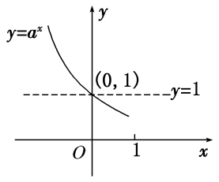
</td><td>
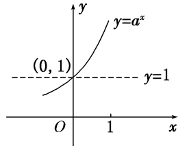
</td></tr><tr><td rowspan="2">
图象特征
</td><td colspan="2">
在<em>x</em>轴上方，过定点(0，1)
</td></tr><tr><td>
当<em>x</em>逐渐增大时，图象逐渐下降
</td><td>
当<em>x</em>逐渐增大时，图象逐渐上升
</td></tr></table>

**【常用结论】**

1．指数函数图象的画法

画指数函数<em>y</em>＝<em>ax</em>(<em>a</em>＞0，且<em>a</em>≠1)的图象，应抓住三个关键点：(1，<em>a</em>)，(0，1)，和一条渐近线<em>y</em>＝0．

2．底数*a*与1的大小关系决定了指数函数图象的“升降”：当*a*>1时，指数函数的图象“上升”；当0<*a*<1时，指数函数的图象“下降”．

3．函数<em>y</em>＝<em>ax</em>与<em>y</em>＝<em>x</em>(<em>a</em>&gt;0，且<em>a</em>≠1)的图象关于<em>y</em>轴对称．

4．指数函数的图象与底数大小的比较

如图是指数函数(1)<em>y</em>＝<em>ax</em>，(2)<em>y</em>＝<em>bx</em>，(3)<em>y</em>＝<em>cx</em>，(4)<em>y</em>＝<em>dx</em>的图象，底数<em>a</em>，<em>b</em>，<em>c</em>，<em>d</em>与1之间的大小关系为<em>c</em>＞<em>d</em>＞1＞<em>a</em>＞<em>b</em>＞0．由此我们可得到以下规律：在第一象限内，指数函数<em>y</em>＝<em>ax</em>(<em>a</em>＞0，<em>a</em>≠1)的图象越高，底数越大．简称“底大图高”．

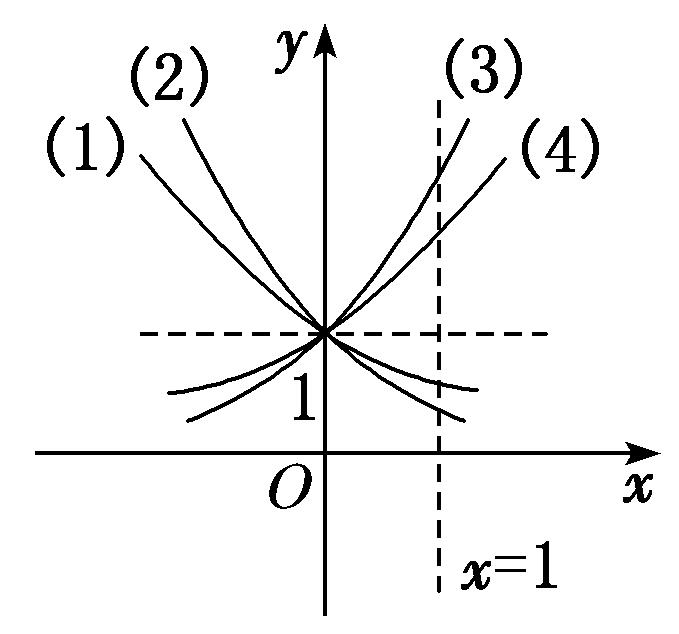

**考向1　指数函数图象辨析**

【**方法总结**】

有关指数函数图象辨析及图象应用的解题思路

(1)已知函数解析式判断其图象，一般是取特殊点，判断选项中的图象是否过这些点，若不满足则排除．

(2)对于有关指数型函数的图象问题，一般是从最基本的指数函数的图象入手，通过平移、伸缩、对称变换而得到．特别地，当底数*a*与1的大小关系不确定时应注意分类讨论．

(3)根据指数函数图象判断底数大小的问题，可以通过底大图高进行判断．

**【例题选讲】**

<strong>[例1]</strong> (1) 函数<em>f</em>(<em>x</em>)＝21－<em>x</em>的大致图象为(　　)

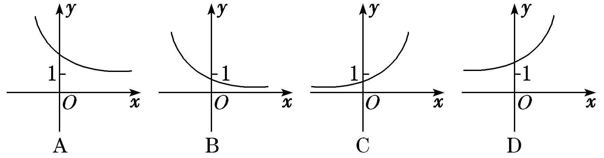

答案　A　解析　函数<em>f</em>(<em>x</em>)＝21－<em>x</em>＝2×<em>x</em>，单调递减且过点(0，2)，选项A中的图象符合要求．

(2) 函数<em>f</em>(<em>x</em>)＝1－e|<em>x</em>|的图象大致是(　　)

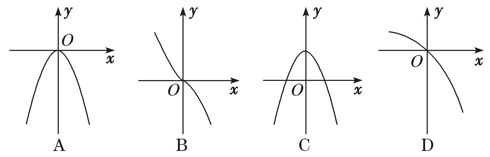

答案　A　解析　因为函数<em>f</em>(<em>x</em>)＝1－e|<em>x</em>|是偶函数，且值域是(－∞，0]，只有A满足上述两个性质．

(3) 函数<em>f</em>(<em>x</em>)＝<em>ax</em>－<em>b</em>的图象如图所示，其中<em>a</em>，<em>b</em>为常数，则下列结论正确的是(　　)

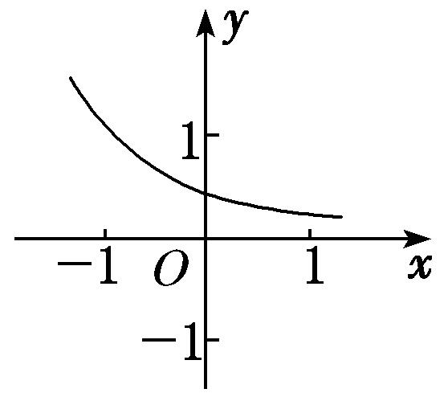

A．*a*>1，*b*<0　　　　B．*a*>1，*b*>0　　　　C．0<*a*<1，*b*>0　　　　D．0<*a*<1，*b*<0

答案　D　解析　由<em>f</em>(<em>x</em>)＝<em>ax</em>－<em>b</em>的图象可以观察出函数<em>f</em>(<em>x</em>)＝<em>ax</em>－<em>b</em>在定义域上单调递减，所以0&lt;<em>a</em>&lt;1，函数<em>f</em>(<em>x</em>)＝<em>ax</em>－<em>b</em>的图象是在<em>y</em>＝<em>ax</em>的图象的基础上向左平移得到的，所以<em>b</em>&lt;0．

(4) 已知函数<em>f</em>(<em>x</em>)＝(<em>x</em>－<em>a</em>)(<em>x</em>－<em>b</em>)(其中<em>a</em>＞<em>b</em>)的图象如图所示，则函数<em>g</em>(<em>x</em>)＝<em>ax</em>＋<em>b</em>的图象是(　　)

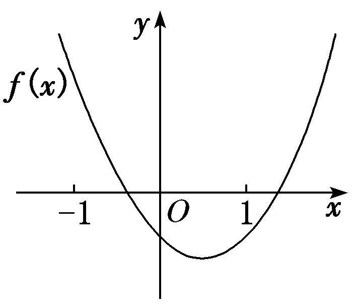

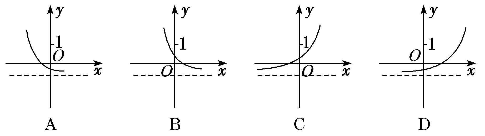

答案　C　解析　由函数<em>f</em>(<em>x</em>)的图象可知，－1＜<em>b</em>＜0，<em>a</em>＞1，则<em>g</em>(<em>x</em>)＝<em>ax</em>＋<em>b</em>为增函数，当<em>x</em>＝0时，<em>g</em>(0)＝1＋<em>b</em>＞0，故选C．

(5) 已知函数<em>f</em>(<em>x</em>)＝2<em>x</em>－2，则函数<em>y</em>＝|<em>f</em>(<em>x</em>)|的图象可能是(　　)

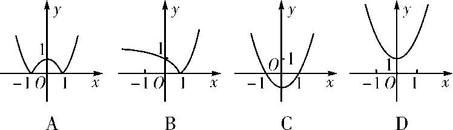

答案　B　解析　|<em>f</em>(<em>x</em>)|＝|2<em>x</em>－2|＝易知函数<em>y</em>＝|<em>f</em>(<em>x</em>)|的图象的分段点是<em>x</em>＝1，且过点(1，0)，(0，1)，．又|<em>f</em>(<em>x</em>)|≥0，所以B项正确．故选B．

**考向2　指数函数图象的应用**

【**方法总结**】

一些指数方程、不等式问题的求解，往往利用相应的指数型函数图象数形结合求解．

<strong>[例2]</strong> (1) 若函数<em>y</em>＝|3<em>x</em>－1|在(－∞，<em>k</em>]上单调递减，则<em>k</em>的取值范围为\_\_\_\_\_\_\_\_．

答案　(－∞，0]　解析　函数<em>y</em>＝|3<em>x</em>－1|的图象是由函数<em>y</em>＝3<em>x</em>的图象向下平移一个单位后，再把位于<em>x</em>轴下方的图象沿<em>x</em>轴翻折到<em>x</em>轴上方得到的，函数图象如图所示．

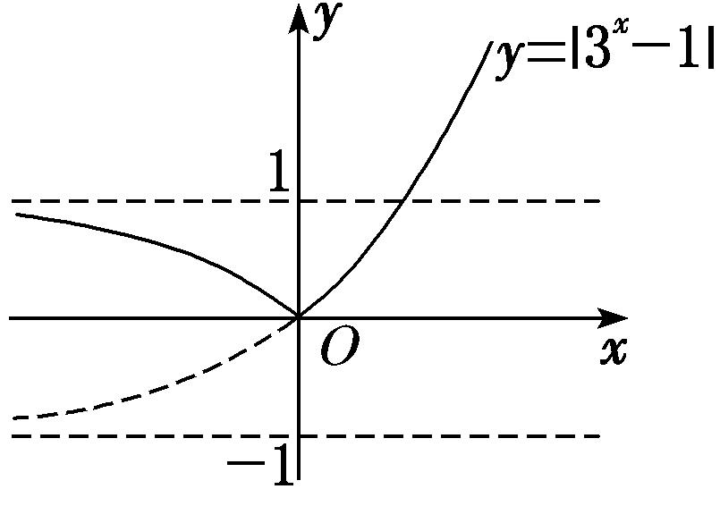

由图象知，其在(－∞，0]上单调递减，所以*k*的取值范围为(－∞，0]．

(2) 若函数<em>y</em>＝21－<em>x</em>＋<em>m</em>的图象不经过第一象限，则<em>m</em>的取值范围为\_\_\_\_\_\_\_\_．

答案　(－∞，－2]　解析　<em>y</em>＝21－<em>x</em>＋<em>m</em>＝<em>x</em>－1＋<em>m</em>，函数<em>y</em>＝<em>x</em>－1的图象如图所示，则要使其图象不经过第一象限，则<em>m</em>≤－2．故<em>m</em>的取值范围为(－∞，－2]．

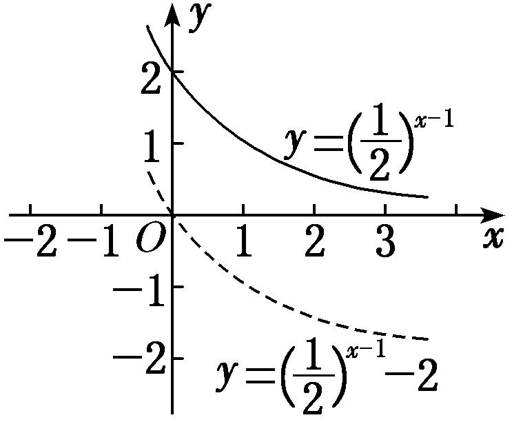

(3) 已知<em>a</em>&gt;0，且<em>a</em>≠1，若函数<em>y</em>＝|<em>ax</em>－2|与<em>y</em>＝3<em>a</em>的图象有两个交点，则实数<em>a</em>的取值范围是\_\_\_\_\_\_\_\_．

答案　　解析　①当0&lt;<em>a</em>&lt;1时，作出函数<em>y</em>＝|<em>ax</em>－2|的图象如图(1)．若直线<em>y</em>＝3<em>a</em>与函数<em>y</em>＝|<em>ax</em>－2|(0&lt;<em>a</em>&lt;1)的图象有两个交点，则由图象可知0&lt;3<em>a</em>&lt;2，所以0&lt;<em>a</em>&lt;．

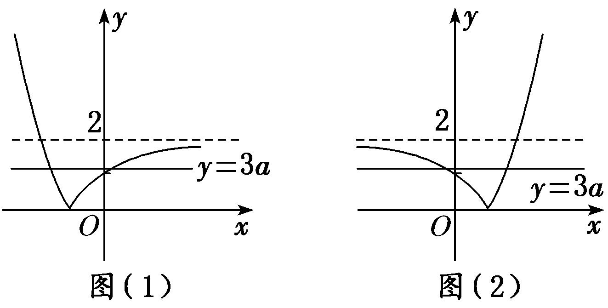

②当<em>a</em>&gt;1时，作出函数<em>y</em>＝|<em>ax</em>－2|的图象如图(2)，若直线<em>y</em>＝3<em>a</em>与函数<em>y</em>＝|<em>ax</em>－2|(<em>a</em>&gt;1)的图象有两个交点，则由图象可知0&lt;3<em>a</em>&lt;2，此时无解．所以实数<em>a</em>的取值范围是．

(4) 若存在负实数使得方程2<em>x</em>－<em>a</em>＝成立，则实数<em>a</em>的取值范围是(　　)

A．(2，＋∞)　　　　B．(0，＋∞)　　　　C．(0，2)　　　　D．(0，1)

答案　C　解析　在同一坐标系内分别作出函数<em>y</em>＝和<em>y</em>＝2<em>x</em>－<em>a</em>的图象，则由图知，当<em>a</em>∈(0，2)时符合要求．

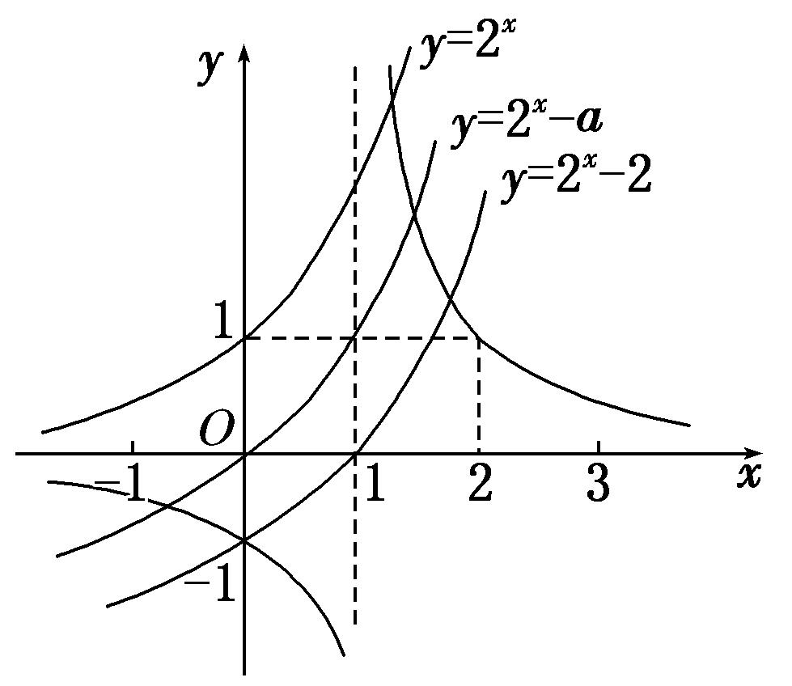

(5) 已知函数<em>a</em>，<em>b</em>满足等式<em>a</em>＝<em>b</em>，下列五个关系式：

①0＜*b*＜*a*；②*a*＜*b*＜0；③0＜*a*＜*b*；④*b*＜*a*＜0；⑤*a*＝*b*．

其中不可能成立的关系式有(　　)

A．1个　　　　　　　　B．2个　　　　　　　　C．3个　　　　　　　　D．4个

答案　B　解析　函数<em>y</em>1＝<em>x</em>与<em>y</em>2＝<em>x</em>的图象如图所示．

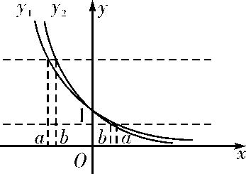

由<em>a</em>＝<em>b</em>得<em>a</em>&lt;<em>b</em>&lt;0或0&lt;<em>b</em>&lt;<em>a</em>或<em>a</em>＝<em>b</em>＝0．故①②⑤可能成立，③④不可能成立．

【**对点训练**】

1．函数<em>f</em>(<em>x</em>)＝2|<em>x</em>－1|的大致图象是(　　)

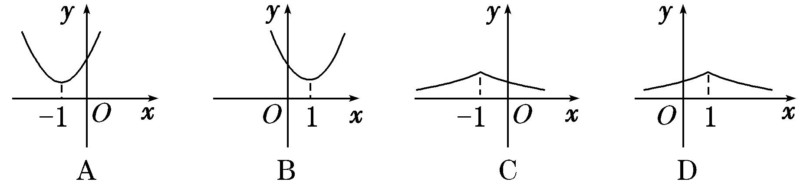

1．答案　B　解析　*f*(*x*)＝易知*f*(*x*)在[1，＋∞)上单调递增，在(－∞，1)上单调递减，故

选B．

2．已知函数<em>y</em>＝<em>kx</em>＋<em>a</em>的图象如图所示，则函数<em>y</em>＝<em>ax</em>＋<em>k</em>的图象可能是(　　)

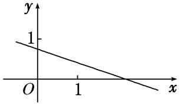

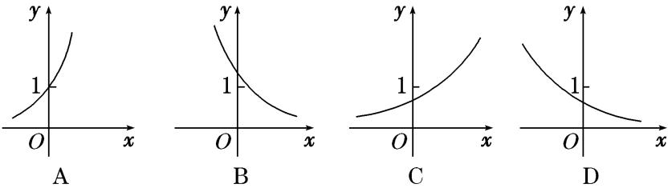

2．答案　B　解析　由函数*y*＝*kx*＋*a*的图象可得*k*<0，0<*a*<1，又因为与*x*轴交点的横坐标大于1，所以

－1&lt;<em>k</em>&lt;0．函数<em>y</em>＝<em>ax</em>＋<em>k</em>的图象可以看成把<em>y</em>＝<em>ax</em>的图象向右平移－<em>k</em>个单位得到的，且函数<em>y</em>＝<em>ax</em>＋<em>k</em>是减函数，故此函数与<em>y</em>轴交点的纵坐标大于1，结合所给的选项，应该选B．

3．函数<em>y</em>＝<em>ax</em>－<em>a</em>－1(<em>a</em>&gt;0，且<em>a</em>≠1)的图象可能是(　　)

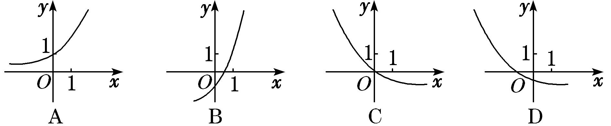

3．答案　D　解析　函数<em>y</em>＝<em>ax</em>－是由函数<em>y</em>＝<em>ax</em>的图象向下平移个单位长度得到的，A项显然错误；当

*a*>1时，0<<1，平移距离小于1，所以B项错误；当0<*a*<1时，>1，平移距离大于1，所以C项错误．故选D．

4．已知0&lt;<em>m</em>&lt;<em>n</em>&lt;1，则指数函数①<em>y</em>＝<em>mx</em>，②<em>y</em>＝<em>nx</em>的图象为(　　)

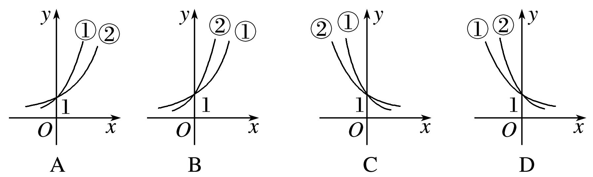

4．答案　C　解析　由于0&lt;<em>m</em>&lt;<em>n</em>&lt;1，所以<em>y</em>＝<em>mx</em>与<em>y</em>＝<em>nx</em>都是减函数，故排除A，B，作直线<em>x</em>＝1与两个

曲线相交，交点在下面的是函数<em>y</em>＝<em>mx</em>的图象．

5．定义一种运算：<em>a</em>⊗<em>b</em>＝已知函数<em>f</em>(<em>x</em>)＝2<em>x</em>⊗(3－<em>x</em>)，那么函数<em>y</em>＝<em>f</em>(<em>x</em>＋1)的大致图象是(　　)

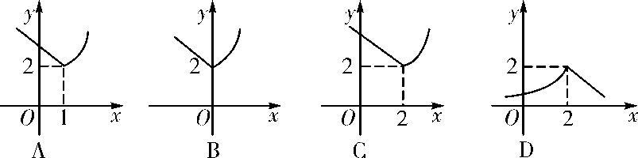

5．答案　<strong>B</strong>　解析　由题意可得<em>f</em>(<em>x</em>)＝2<em>x</em>(3－<em>x</em>)＝所以<em>f</em>(<em>x</em>＋1)＝则大致

图象为B项．

6．已知函数<em>f</em>(<em>x</em>)＝4＋2<em>ax</em>－1的图象恒过定点<em>P</em>，则点<em>P</em>的坐标是(　　)

A．(1，6)　　　　　　B．(1，5)　　　　　　C．(0，5)　　　　　　D．(5，0)

6．答案　A　解析　由于函数<em>y</em>＝<em>ax</em>的图象过定点(0，1)，当<em>x</em>＝1时，<em>f</em>(<em>x</em>)＝4＋2＝6，故函数<em>f</em>(<em>x</em>)＝4＋2<em>ax</em>

－1的图象恒过定点<em>P</em>(1，6)．

7．若函数<em>y</em>＝|2<em>x</em>－1|的图象与直线<em>y</em>＝<em>b</em>有两个公共点，则<em>b</em>的取值范围为\_\_\_\_\_\_\_\_\_\_．

7．答案　(0，1)　解析　作出曲线<em>y</em>＝|2<em>x</em>－1|的图象与直线<em>y</em>＝<em>b</em>如图所示．由图象可得<em>b</em>的取值范围是(0，

1)．

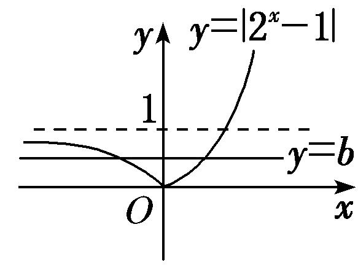

8．已知<em>f</em>(<em>x</em>)＝|2<em>x</em>－1|，当<em>a</em>&lt;<em>b</em>&lt;<em>c</em>时，有<em>f</em>(<em>a</em>)&gt;<em>f</em>(<em>c</em>)&gt;<em>f</em>(<em>b</em>)，则必有(　　)

A．<em>a</em>&lt;0，<em>b</em>&lt;0，<em>c</em>&lt;0　　　　B．<em>a</em>&lt;0，<em>b</em>&gt;0，<em>c</em>&gt;0　　　　C．2－<em>a</em>&lt;2<em>c</em>　　　　D．1&lt;2<em>a</em>＋2<em>c</em>&lt;2

8．答案　D　解析　作出函数<em>f</em>(<em>x</em>)＝|2<em>x</em>－1|的图象如图所示，因为<em>a</em>&lt;<em>b</em>&lt;<em>c</em>，且有<em>f</em>(<em>a</em>)&gt;<em>f</em>(<em>c</em>)&gt;<em>f</em>(<em>b</em>)，所以必有<em>a</em>&lt;

0，0&lt;<em>c</em>&lt;1，且|2<em>a</em>－1|&gt;|2<em>c</em>－1|，所以1－2<em>a</em>&gt;2<em>c</em>－1，则2<em>a</em>＋2<em>c</em>&lt;2，且2<em>a</em>＋2<em>c</em>&gt;1．故选D．

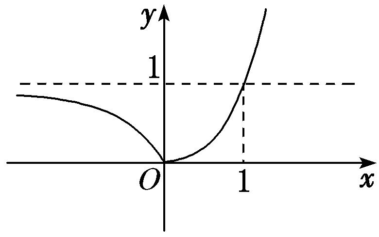

9．若曲线|<em>y</em>|＝2<em>x</em>＋1与直线<em>y</em>＝<em>b</em>没有公共点，则<em>b</em>的取值范围是\_\_\_\_\_\_\_\_．

9．答案　[－1，1]　解析　曲线|<em>y</em>|＝2<em>x</em>＋1与直线<em>y</em>＝<em>b</em>的图象如图所示，由图可知：如果|<em>y</em>|＝2<em>x</em>＋1与直线

*y*＝*b*没有公共点，则*b*应满足的条件是*b*∈[－1，1]．

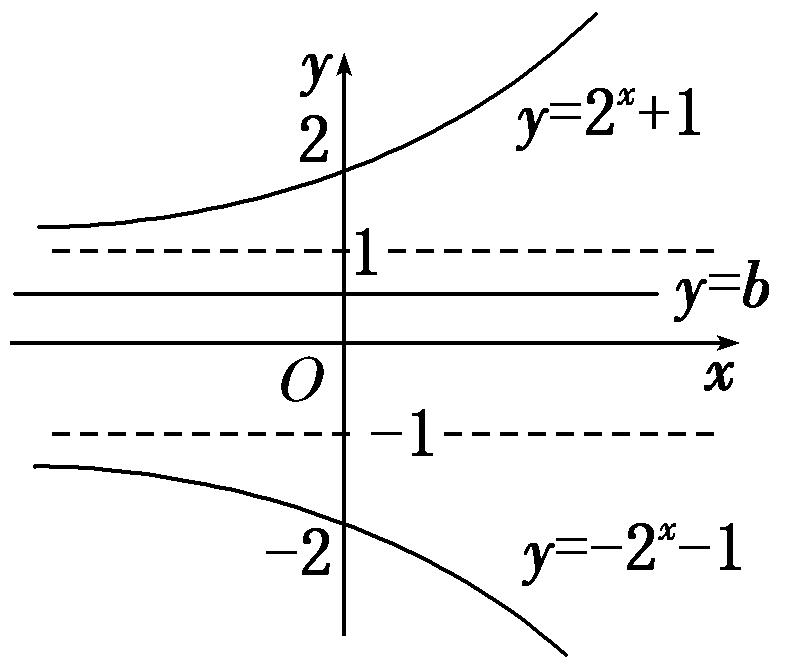

10．如图，在面积为8的平行四边形<em>OABC</em>中，<em>AC</em>⊥<em>CO</em>，<em>AC</em>与<em>BO</em>交于点<em>E</em>．若指数函数<em>y</em>＝<em>ax</em>(<em>a</em>&gt;0，且

*a*≠1)经过点*E*，*B*，则*a*的值为(　　)

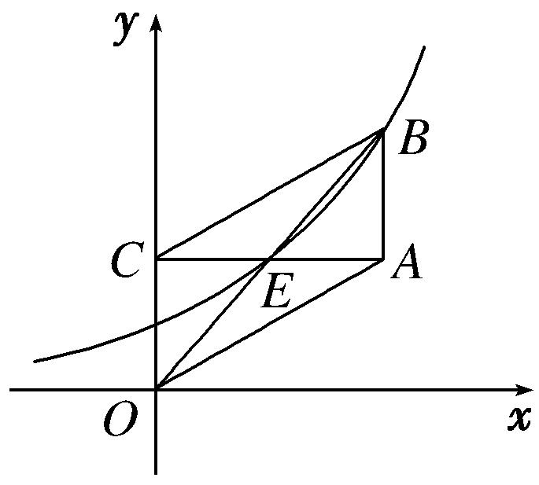

A．　　　　　　　　B．　　　　　　　　C．2　　　　　　　　D．3

10．答案　A　解析　设点<em>E</em>(<em>t</em>，<em>at</em>)，则点<em>B</em>的坐标为(2<em>t，</em>2<em>at</em>)．因为2<em>at</em>＝<em>a</em>2<em>t</em>，所以<em>at</em>＝2．因为平行四边

形<em>OABC</em>的面积＝<em>OC</em>×<em>AC</em>＝<em>at</em>×2<em>t</em>＝4<em>t</em>，又平行四边形<em>OABC</em>的面积为8，所以4<em>t</em>＝8，<em>t</em>＝2，所以<em>a</em>2＝2，<em>a</em>＝．故选A．

**考点二　指数函数的性质及应用**

【**知识梳理**】

指数函数的性质

<table><tr><td colspan="2" rowspan="2">
函数
</td><td colspan="2">
<em>y</em>＝<em>ax</em>(<em>a</em>&gt;0，且<em>a</em>≠1)
</td></tr><tr><td>
0&lt;<em>a</em>&lt;1
</td><td>
<em>a</em>&gt;1
</td></tr><tr><td rowspan="5">
性

质
</td><td>
定义域
</td><td colspan="2">
<strong>R</strong>
</td></tr><tr><td>
值域
</td><td colspan="2">
(0，＋∞)
</td></tr><tr><td>
单调性
</td><td>
在<strong>R</strong>上是减函数
</td><td>
在<strong>R</strong>上是增函数
</td></tr><tr><td rowspan="2">
函数值

变化规律
</td><td colspan="2">
当<em>x</em>＝0时，<em>y</em>＝1
</td></tr><tr><td>
当<em>x</em>&lt;0时，<em>y</em>&gt;1；当<em>x</em>&gt;0时，0&lt;<em>y</em>&lt;1
</td><td>
当<em>x</em>&lt;0时，0&lt;<em>y</em>&lt;1；当<em>x</em>&gt;0时，<em>y</em>&gt;1
</td></tr></table>

**考向1　比较指数式的大小与解不等式**

【**方法总结**】

1．比较指数式大小的方法

比较两个指数式大小时，尽量化同底或同指．

(1)当底数相同，指数不同时，构造同一指数函数，然后利用指数函数性质比较大小．

(2)当指数相同，底数不同时，构造两个指数函数，利用图象比较大小．

(3)当底数不同，指数也不同时，常借助1，0等中间量进行比较．

2．简单的指数方程或不等式问题的求解策略

(1)<em>af</em>(<em>x</em>)＝<em>ag</em>(<em>x</em>)⇔<em>f</em>(<em>x</em>)＝<em>g</em>(<em>x</em>)．

(2)<em>af</em>(<em>x</em>)&gt;<em>ag</em>(<em>x</em>)，当<em>a</em>&gt;1时，等价于<em>f</em>(<em>x</em>)&gt;<em>g</em>(<em>x</em>)；当0&lt;<em>a</em>&lt;1时，等价于<em>f</em>(<em>x</em>)&lt;<em>g</em>(<em>x</em>)．

(3)解决简单的指数不等式的问题主要利用指数函数的单调性，要特别注意底数*a*的取值范围，并在必要时进行分类讨论．

**【例题选讲】**

<strong>[例3]</strong> (1) 设<em>a</em>＝0.60.6，<em>b</em>＝0.61.5，<em>c</em>＝1.50.6，则<em>a</em>，<em>b</em>，<em>c</em>的大小关系是(　　)

A．*a*<*b*<*c*　　　　　B．*a*<*c*<*b*　　　　　C．*b*<*a*<*c*　　　　　D．*b*<*c*<*a*

答案　C　解析　因为函数<em>y</em>＝0.6<em>x</em>在<strong>R</strong>上单调递减，所以<em>b</em>＝0.61.5&lt;<em>a</em>＝0.60.6&lt;1．又<em>c</em>＝1.50.6&gt;1，所以<em>b</em>&lt;<em>a</em>&lt;<em>c</em>．

(2) (2016·全国Ⅲ)已知*a*＝2，*b*＝4，*c*＝25，则(　　)

A．*b*<*a*<*c*　　　　　B．*a*<*b*<*c*　　　　　C．*b*<*c*<*a*　　　　　D．*c*<*a*<*b*

答案　A　解析　因为<em>a</em>＝2，<em>b</em>＝4＝2，由函数<em>y</em>＝2<em>x</em>在<strong>R</strong>上为增函数知，<em>b</em>&lt;<em>a</em>；又因为<em>a</em>＝2＝4，<em>c</em>＝25＝5，由函数<em>y</em>＝<em>x</em>在(0，＋∞)上为增函数知，<em>a</em>&lt;<em>c</em>．综上得<em>b</em>&lt;<em>a</em>&lt;<em>c</em>．故选A．

(3) 已知<em>f</em>(<em>x</em>)＝2<em>x</em>－2－<em>x</em>，<em>a</em>＝，<em>b</em>＝，<em>c</em>＝log2，则<em>f</em>(<em>a</em>)，<em>f</em>(<em>b</em>)，<em>f</em>(<em>c</em>)的大小关系为(　　)

A．*f*(*b*)<*f*(*a*)<*f*(*c*)　　　　B．*f*(*c*)<*f*(*b*)<*f*(*a*)　　　　C．*f*(*c*)<*f*(*a*)<*f*(*b*)　　　　D．*f*(*b*)<*f*(*c*)<*f*(*a*)

答案　B　解析　易知<em>f</em>(<em>x</em>)＝2<em>x</em>－2－<em>x</em>在<strong>R</strong>上为增函数，又<em>a</em>＝＝&gt;＝<em>b</em>&gt;0，<em>c</em>＝log2&lt;0，则<em>a</em>&gt;<em>b</em>&gt;<em>c</em>，所以<em>f</em>(<em>c</em>)&lt;<em>f</em>(<em>b</em>)&lt;<em>f</em>(<em>a</em>)．

(4) 若偶函数<em>f</em>(<em>x</em>)满足<em>f</em>(<em>x</em>)＝2<em>x</em>－4(<em>x</em>≥0)，则不等式<em>f</em>(<em>x</em>－2)&gt;0的解集为\_\_\_\_\_\_\_\_．

答案　{<em>x</em>|<em>x</em>&gt;4或<em>x</em>&lt;0}　解析　∵<em>f</em>(<em>x</em>)为偶函数，当<em>x</em>＜0时，－<em>x</em>&gt;0，则<em>f</em>(<em>x</em>)＝<em>f</em>(－<em>x</em>)＝2－<em>x</em>－4．∴<em>f</em>(<em>x</em>)＝当<em>f</em>(<em>x</em>－2)＞0时，有或解得<em>x</em>＞4或<em>x</em>＜0．∴不等式的解集为{<em>x</em>|<em>x</em>&gt;4或<em>x</em>&lt;0}．

(5) 已知函数<em>f</em>(<em>x</em>)＝e<em>x</em>－，其中e是自然对数的底数，则关于<em>x</em>的不等式<em>f</em>(2<em>x</em>－1)＋<em>f</em>(－<em>x</em>－1)&gt;0的解集为(　　)

A．∪(2，＋∞)　　B．(2，＋∞)　　C．∪(2，＋∞)　　D．(－∞，2)

答案　B　解析　函数<em>f</em>(<em>x</em>)＝e<em>x</em>－的定义域为<strong>R</strong>，∵<em>f</em>(－<em>x</em>)＝e－<em>x</em>－＝－e<em>x</em>＝－<em>f</em>(<em>x</em>)，∴<em>f</em>(<em>x</em>)是奇函数，那么不等式<em>f</em>(2<em>x</em>－1)＋<em>f</em>(－<em>x</em>－1)&gt;0等价于<em>f</em>(2<em>x</em>－1)&gt;－<em>f</em>(－<em>x</em>－1)＝<em>f</em>(1＋<em>x</em>)，易证<em>f</em>(<em>x</em>)是<strong>R</strong>上的单调递增函数，∴2<em>x</em>－1&gt;<em>x</em>＋1，解得<em>x</em>&gt;2，∴不等式<em>f</em>(2<em>x</em>－1)＋<em>f</em>(－<em>x</em>－1)&gt;0的解集为(2，＋∞)．

**考向2　与指数函数有关的复合函数的值域**

【**方法总结**】

(1)<em>y</em>＝<em>af</em>(<em>x</em>)的定义域与<em>f</em>(<em>x</em>)的定义域相同．

(2)先确定<em>f</em>(<em>x</em>)的值域，再根据指数函数的值域、单调性确定函数<em>y</em>＝<em>af</em>(<em>x</em>)的值域．

**【例题选讲】**

<strong>[例4]</strong> (1) 函数<em>y</em>＝的值域是(　　)

A．(－∞，4)　　　　　　B．(0，＋∞)　　　　　　C．(0，4]　　　　　　D．[4，＋∞)

答案　C　解析　设<em>t</em>＝<em>x</em>2＋2<em>x</em>－1，则<em>y</em>＝<em>t</em>．因为0&lt;&lt;1，所以<em>y</em>＝<em>t</em>为关于<em>t</em>的减函数．因为<em>t</em>＝2－2≥－2，所以0&lt;<em>y</em>＝<em>t</em>≤－2＝4，故所求函数的值域为(0，4]．

(2) 函数<em>y</em>＝<em>x</em>－<em>x</em>＋1在[－3，2]上的值域是\_\_\_\_\_\_\_\_．

答案　　解析　令<em>t</em>＝<em>x</em>，由<em>x</em>∈[－3，2]，得<em>t</em>∈．则<em>y</em>＝<em>t</em>2－<em>t</em>＋1＝2＋．当<em>t</em>＝时，<em>y</em>min＝；当<em>t</em>＝8时，<em>y</em>max＝57．故所求函数的值域是．

(3) 已知max(<em>a</em>，<em>b</em>)表示<em>a</em>，<em>b</em>两数中的最大值．若<em>f</em>(<em>x</em>)＝max{e|<em>x</em>|，e|<em>x</em>－2|}，则<em>f</em>(<em>x</em>)的最小值为\_\_\_\_\_\_\_\_．

答案　　解析　由于<em>f</em>(<em>x</em>)＝max{e|<em>x</em>|，e|<em>x</em>－2|}＝当<em>x</em>≥1时，<em>f</em>(<em>x</em>)≥e，且当<em>x</em>＝1时，取得最小值e；当<em>x</em>&lt;1时，<em>f</em>(<em>x</em>)&gt;e．故<em>f</em>(<em>x</em>)的最小值为<em>f</em>(1)＝e．

(4) 若函数<em>y</em>＝4<em>x</em>－2<em>x</em>＋1＋<em>b</em>在[－1，1]上的最大值是3，则实数<em>b</em>＝(　　)

A．3　　　　　　　　B．2　　　　　　　　C．1　　　　　　　　D．0

答案　A　解析　<em>y</em>＝4<em>x</em>－2<em>x</em>＋1＋<em>b</em>＝(2<em>x</em>)2－2·2<em>x</em>＋<em>b</em>．设2<em>x</em>＝<em>t</em>，则<em>y</em>＝<em>t</em>2－2<em>t</em>＋<em>b</em>＝(<em>t</em>－1)2＋<em>b</em>－1．因为<em>x</em>∈[－1，1]，所以<em>t</em>∈．当<em>t</em>＝2时，<em>y</em>max＝3，即1＋<em>b</em>－1＝3，<em>b</em>＝3．故选A．

(5) 如果函数<em>y</em>＝<em>a</em>2<em>x</em>＋2<em>ax</em>－1(<em>a</em>&gt;0，且<em>a</em>≠1)在[－1，1]上有最大值14，则<em>a</em>的值为\_\_\_\_\_\_\_\_\_\_．

答案　或3　解析　设<em>t</em>＝<em>ax</em>&gt;0，则原函数可化为<em>y</em>＝(<em>t</em>＋1)2－2，其对称轴为<em>t</em>＝－1．①若<em>a</em>&gt;1，因为<em>t</em>＝<em>ax</em>在[－1，1]上递增，所以<em>t</em>∈．因为－1&lt;0&lt;，所以<em>y</em>＝(<em>t</em>＋1)2－2在<em>t</em>∈上递增，由复合函数单调性知原函数在[－1，1]上递增，故当<em>x</em>＝1时，<em>y</em>max＝<em>a</em>2＋2<em>a</em>－1，由<em>a</em>2＋2<em>a</em>－1＝14，解得<em>a</em>＝3或<em>a</em>＝－5(舍)，所以<em>a</em>＝3．②若0&lt;<em>a</em>&lt;1，同理可得当<em>x</em>＝－1时，<em>y</em>max＝<em>a</em>－2＋2<em>a</em>－1－1＝14，解得<em>a</em>＝或<em>a</em>＝－(舍)，所以<em>a</em>＝．综上可知，<em>a</em>＝或<em>a</em>＝3．

**考向3　与指数函数有关的复合函数的单调性**

【**方法总结**】

与指数函数有关的单调区间的求解步骤

(1)求复合函数的定义域；

(2)弄清函数是由哪些基本函数复合而成的；

(3)分层逐一求解函数的单调性；

(4)求出复合函数的单调区间(注意“同增异减”)．

**【例题选讲】**

<strong>[例5]</strong> (1) 已知函数<em>f</em>(<em>x</em>)＝则函数<em>f</em>(<em>x</em>)是(　　)

A．偶函数，在[0，＋∞)上单调递增　　　　　　　　B．偶函数，在[0，＋∞)上单调递减

C．奇函数，且单调递增　　　　　　　　　　　　　D．奇函数，且单调递减

答案　C　解析　易知<em>f</em>(0)＝0，当<em>x</em>&gt;0时，<em>f</em>(<em>x</em>)＝1－2－<em>x</em>，－<em>f</em>(<em>x</em>)＝2－<em>x</em>－1，此时－<em>x</em>&lt;0，则<em>f</em>(－<em>x</em>)＝2－<em>x</em>－1＝－<em>f</em>(<em>x</em>)；当<em>x</em>&lt;0时，<em>f</em>(<em>x</em>)＝2<em>x</em>－1，－<em>f</em>(<em>x</em>)＝1－2<em>x</em>，此时－<em>x</em>&gt;0，则<em>f</em>(－<em>x</em>)＝1－2－(－<em>x</em>)＝1－2<em>x</em>＝－<em>f</em>(<em>x</em>)．即函数<em>f</em>(<em>x</em>)是奇函数，且单调递增，故选C．

(2) 若函数<em>f</em>(<em>x</em>)＝<em>a</em>|2<em>x</em>－4|(<em>a</em>&gt;0，且<em>a</em>≠1)，满足<em>f</em>(1)＝，则<em>f</em>(<em>x</em>)的单调递减区间是(　　)

A．(－∞，2]　　　　B．[2，＋∞)　　　　C．[－2，＋∞)　　　　D．(－∞，－2]

答案　B　解析　由<em>f</em>(1)＝，得<em>a</em>2＝，解得<em>a</em>＝或<em>a</em>＝－(舍去)，即<em>f</em>(<em>x</em>)＝|2<em>x</em>－4|．由于<em>y</em>＝|2<em>x</em>－4|在(－∞，2]上递减，在[2，＋∞)上递增，所以<em>f</em>(<em>x</em>)在(－∞，2]上递增，在[2，＋∞)上递减，故选B．

(3) 函数*f*(*x*)＝的单调递增区间是(　　)

A．　　　　　B．　　　　　C．　　　　　D．

答案　D　解析　令<em>x</em>－<em>x</em>2≥0，得0≤<em>x</em>≤1，所以函数<em>f</em>(<em>x</em>)的定义域为[0，1]，因为<em>y</em>＝<em>t</em>是减函数，所以函数<em>f</em>(<em>x</em>)的增区间就是函数<em>y</em>＝－<em>x</em>2＋<em>x</em>在[0，1]上的减区间，故选D．

(4) 已知函数<em>f</em>(<em>x</em>)＝2|2<em>x</em>－<em>m</em>|(<em>m</em>为常数)，若<em>f</em>(<em>x</em>)在区间[2，＋∞)上是增函数，则<em>m</em>的取值范围是\_\_\_\_\_\_\_\_\_\_．

答案　(－∞，4]　解析　令<em>t</em>＝|2<em>x</em>－<em>m</em>|，则<em>t</em>＝|2<em>x</em>－<em>m</em>|在区间上单调递增，在区间上单调递减，而<em>y</em>＝2<em>t</em>为<strong>R</strong>上的增函数，所以要使函数<em>f</em>(<em>x</em>)＝2|2<em>x</em>－<em>m</em>|在[2，＋∞)上单调递增，则有≤2，即<em>m</em>≤4，所以<em>m</em>的取值范围是(－∞，4]．

(5) 若函数<em>f</em>(<em>x</em>)＝<em>ax</em>(<em>ax</em>－3<em>a</em>2－1)(<em>a</em>&gt;0且<em>a</em>≠1)在区间[0，＋∞)上是增函数，则实数<em>a</em>的取值范围是(　　)

A．　　　　B．　　　　C．(1， ]　　　　D．

答案　B　解析　令<em>t</em>＝<em>ax</em>，则原函数转化为<em>y</em>＝<em>t</em>2－(3<em>a</em>2＋1)<em>t</em>，其图象的对称轴为直线<em>t</em>＝．若<em>a</em>&gt;1，则<em>t</em>＝<em>ax</em>≥1，由于原函数在区间[0，＋∞)上是增函数，则≤1，解得－≤<em>a</em>≤，与<em>a</em>&gt;1矛盾；若0&lt;<em>a</em>&lt;1，则0&lt;<em>t</em>≤1，由于原函数在区间[0，＋∞)上是增函数，则≥1，解得<em>a</em>≥或<em>a</em>≤－，所以实数<em>a</em>的取值范围是．故选B．

【**对点训练**】

11．设<em>a</em>＝0.60.6，<em>b</em>＝0.61.5，<em>c</em>＝1.50.6，则<em>a</em>，<em>b</em>，<em>c</em>的大小关系是(　　)

A．*a*<*b*<*c*　　　　　B．*a*<*c*<*b*　　　　　C．*b*<*a*<*c*　　　　　D．*b*<*c*<*a*

11．答案　A　解析　由0.2＜0.6，0.4＜1，并结合指数函数的图象可知0.40.2＞0.40.6，即<em>b</em>＞<em>c</em>；因为<em>a</em>＝

20.2＞1，<em>b</em>＝0.40.2＜1，所以<em>a</em>＞<em>b</em>．综上，<em>a</em>＞<em>b</em>＞<em>c</em>．

12．已知<em>a</em>＝20.2，<em>b</em>＝0.40.2，<em>c</em>＝0.40.75，则(　　)

A．*a*>*b*>*c*　　　　　B．*a*>*c*>*b*　　　　　C．*c*>*a*>*b*　　　　　D．*b*>*c*>*a*

12．答案　A　解析　由0.2&lt;0.75&lt;1，并结合指数函数的图象可知0.40.2&gt;0.40.75，即<em>b</em>&gt;<em>c</em>；因为<em>a</em>＝20.2&gt;1，<em>b</em>

＝0.40.2&lt;1，所以<em>a</em>&gt;<em>b</em>．综上，<em>a</em>&gt;<em>b</em>&gt;<em>c</em>．

13．设*a*＝，*b*＝，*c*＝，则*a*，*b*，*c*的大小关系是(　　)

A．*a*>*c*>*b*　　　　　B．*a*>*b*>*c*　　　　　C．*c*>*a*>*b*　　　　　D．*b*>*c*>*a*

13．解析　A　解析　因为<em>y</em>＝(<em>x</em>&gt;0)为增函数，所以<em>a</em>&gt;<em>c</em>．因为<em>y</em>＝<em>x</em>(<em>x</em>∈<strong>R</strong>)为减函数，所以<em>c</em>&gt;<em>b</em>，所

以*a*>*c*>*b*．

14．设函数*f*(*x*)＝若*f*(*a*)<1，则实数*a*的取值范围是\_\_\_\_\_\_\_\_．

14．答案　(－3，1)　解析　若*a*<0，则*f*(*a*)<1⇔－7<1⇔<8，解得*a*>－3，故－3<*a*<0；若*a*≥0，

则*f*(*a*)<1⇔<1，解得*a*<1，故0≤*a*<1．综合可得－3<*a*<1．

15．不等式23－2<em>x</em>&lt;0．53<em>x</em>－4的解集为\_\_\_\_\_\_\_\_．

15．解析　{<em>x</em>|<em>x</em>&lt;1}　解析　原不等式可化为23－2<em>x</em>&lt;24－3<em>x</em>，因为函数<em>y</em>＝2<em>x</em>是<strong>R</strong>上的增函数，所以3－2<em>x</em>&lt;4

－3*x*，解得*x*<1，则不等式的解集为{*x*|*x*<1}．

16．已知函数*y*＝2在区间(－∞，3)内单调递增，则*a*的取值范围为\_\_\_\_\_\_\_\_．

16．答案　[6，＋∞)　解析　函数<em>y</em>＝2是由函数<em>y</em>＝2<em>t</em>和<em>t</em>＝－<em>x</em>2＋<em>ax</em>＋1复合而成．因为函数<em>t</em>＝

－<em>x</em>2＋<em>ax</em>＋1在区间上单调递增，在区间上单调递减，且函数<em>y</em>＝2<em>t</em>在<strong>R</strong>上单调递增，所以函数<em>y</em>＝2在区间上单调递增，在区间上单调递减．又因为函数<em>y</em>＝2在区间(－∞，3)内单调递增，所以3≤，即<em>a</em>≥6．

17．函数<em>y</em>＝4<em>x</em>＋2<em>x</em>＋1＋1的值域为(　　)

A．(0，＋∞)　　　　B．(1，＋∞)　　　　C．[1，＋∞)　　　　D．(－∞，＋∞)

17．答案　B　解析　令2<em>x</em>＝<em>t</em>，则函数<em>y</em>＝4<em>x</em>＋2<em>x</em>＋1＋1可化为<em>y</em>＝<em>t</em>2＋2<em>t</em>＋1＝(<em>t</em>＋1)2(<em>t</em>&gt;0)．∵函数<em>y</em>＝(<em>t</em>＋

1)2在(0，＋∞)上递增，∴<em>y</em>&gt;1．∴所求值域为(1，＋∞)．故选B．

18．函数*f*(*x*)＝的值域为\_\_\_\_\_\_\_\_．

18．答案　(0，4]　解析　令<em>t</em>＝<em>x</em>2－2<em>x</em>，则有<em>y</em>＝<em>t</em>，根据二次函数的图象可求得<em>t</em>≥－1，结合指数函数

<em>y</em>＝<em>x</em>的图象可得0&lt;<em>y</em>≤－1，即0&lt;<em>y</em>≤4．

19．若函数<em>f</em>(<em>x</em>)＝<em>ax</em>－1(<em>a</em>&gt;0，<em>a</em>≠1)的定义域和值域都是[0，2]，则实数<em>a</em>＝\_\_\_\_\_\_\_\_．

19．答案　　解析　当<em>a</em>&gt;1时，<em>f</em>(<em>x</em>)＝<em>ax</em>－1在[0，2]上为增函数，则<em>a</em>2－1＝2，∴<em>a</em>＝±．又∵<em>a</em>&gt;1，

∴<em>a</em>＝．当0&lt;<em>a</em>&lt;1时，<em>f</em>(<em>x</em>)＝<em>ax</em>－1在[0，2]上为减函数，又∵<em>f</em>(0)＝0≠2，∴0&lt;<em>a</em>&lt;1不成立．综上可知，<em>a</em>＝．

20．若存在正数<em>x</em>使2<em>x</em>(<em>x</em>－<em>a</em>)&lt;1成立，则<em>a</em>的取值范围是\_\_\_\_\_\_\_\_．

20．答案　(－1，＋∞)　解析　不等式2<em>x</em>(<em>x</em>－<em>a</em>)&lt;1可变形为<em>x</em>－<em>a</em>&lt;<em>x</em>．在同一平面直角坐标系内作出直线

<em>y</em>＝<em>x</em>－<em>a</em>与<em>y</em>＝<em>x</em>的图象．由题意，在(0，＋∞)上，直线有一部分在曲线的下方．观察可知，有－<em>a</em>&lt;1，所以<em>a</em>&gt;－1．

21．已知定义在<strong>R</strong>上的函数<em>f</em>(<em>x</em>)＝2<em>x</em>－．

(1)若*f*(*x*)＝，求*x*的值；

(2)若2<em>tf</em>(2<em>t</em>)＋<em>mf</em>(<em>t</em>)≥0对于<em>t</em>∈[1，2]恒成立，求实数<em>m</em>的取值范围．

21．解　(1)当<em>x</em>＜0时，<em>f</em>(<em>x</em>)＝0，无解；当<em>x</em>≥0时，<em>f</em>(<em>x</em>)＝2<em>x</em>－，

由2<em>x</em>－＝，得2·22<em>x</em>－3·2<em>x</em>－2＝0，

将上式看成关于2<em>x</em>的一元二次方程，解得2<em>x</em>＝2或2<em>x</em>＝－，∵2<em>x</em>＞0，∴<em>x</em>＝1．

(2)当<em>t</em>∈[1，2]时，2<em>t</em>＋<em>m</em>≥0，即<em>m</em>(22<em>t</em>－1)≥－(24<em>t</em>－1)，∵22<em>t</em>－1＞0，∴<em>m</em>≥－(22<em>t</em>＋1)，

∵<em>t</em>∈[1，2]，∴－(22<em>t</em>＋1)∈[－17，－5]，故实数<em>m</em>的取值范围是[－5，＋∞)．

22．已知定义域为<strong>R</strong>的函数<em>f</em>(<em>x</em>)＝是奇函数．

(1)求*a*，*b*的值；

(2)若对任意的<em>t</em>∈<strong>R</strong>，不等式<em>f</em>(<em>t</em>2－2<em>t</em>)＋<em>f</em>(2<em>t</em>2－<em>k</em>)&lt;0恒成立，求<em>k</em>的取值范围．

22．解　(1)因为<em>f</em>(<em>x</em>)是<strong>R</strong>上的奇函数，所以<em>f</em>(0)＝0，即＝0，解得<em>b</em>＝1．

从而有*f*(*x*)＝．又由*f*(1)＝－*f*(－1)知＝－，解得*a*＝2．

(2)由(1)知<em>f</em>(<em>x</em>)＝＝－＋，由上式易知<em>f</em>(<em>x</em>)在<strong>R</strong>上为减函数，又因为<em>f</em>(<em>x</em>)是奇函数，

从而不等式<em>f</em>(<em>t</em>2－2<em>t</em>)＋<em>f</em>(2<em>t</em>2－<em>k</em>)&lt;0等价于<em>f</em>(<em>t</em>2－2<em>t</em>)&lt;－<em>f</em>(2<em>t</em>2－<em>k</em>)＝<em>f</em>(－2<em>t</em>2＋<em>k</em>)．

因为<em>f</em>(<em>x</em>)是<strong>R</strong>上的减函数，由上式推得<em>t</em>2－2<em>t</em>&gt;－2<em>t</em>2＋<em>k</em>．

即对一切<em>t</em>∈<strong>R</strong>有3<em>t</em>2－2<em>t</em>－<em>k</em>&gt;0，从而<em>Δ</em>＝4＋12<em>k</em>&lt;0，解得<em>k</em>&lt;－．

故*k*的取值范围为．

