**专题十四　函数的零点问题(1)**

1．函数零点的定义

一般地，对于函数*y*＝*f*(*x*)(*x*∈*D*)，我们把方程*f*(*x*)＝0的实数根*x*称为函数*y*＝*f*(*x*)(*x*∈*D*)的零点．

注：函数的零点不是一个“点”，而是方程*f*(*x*)＝0的实根．

2．函数零点存在性定理

设函数<em>f</em>(<em>x</em>)在闭区间[<em>a</em>，<em>b</em>]上连续，且<em>f</em>(<em>a</em>) <em>f</em>(<em>b</em>)＜0，那么在开区间(<em>a</em>，<em>b</em>)内至少有函数<em>f</em>(<em>x</em>)的一个零点，即至少有一点<em>x</em>0∈(<em>a</em>，<em>b</em>)，使得<em>f</em>(<em>x</em>0)＝0．

注：(1)*f*(*x*)在[*a*，*b*]上连续是使用零点存在性定理判定零点的前提．

(2)零点存在性定理中的几个“不一定”与“一定”(假设*f*(*x*)连续)．

①若*f*(*a*) *f*(*b*)＜0，则*f*(*x*)“一定”存在零点，但“不一定”只有一个零点，可以有多个．要分析*f*(*x*)的性质与图象，如果*f*(*x*)单调，则“一定”只有一个零点．因此分析一个函数零点的个数前，可尝试判断函数是否单调．

②若*f*(*a*) *f*(*b*)＞0，则*f*(*x*)在[*a*，*b*]“不一定”存在零点，也“不一定”没有零点．如果*f*(*x*)单调，那么“一定”没有零点．

③若*f*(*x*)在(*a*，*b*)有零点，则*f*(*a*) *f*(*b*)的符号是不确定的，“不一定”必须异号．受函数性质与图象影响．如果*f*(*x*)单调，则*f*(*a*) *f*(*b*)一定小于0．

3．函数的零点，方程的根，两图象交点之间的联系

设函数为*y*＝*f*(*x*)，则*f*(*x*)的零点即为满足方程*f*(*x*)＝0的根，若*f*(*x*)＝*g*(*x*)－*h*(*x*)，则方程可转变为*g*(*x*)＝*h*(*x*)，即方程的根在坐标系中为*g*(*x*)，*h*(*x*)交点的横坐标，其范围和个数可从图象中得到．

由此看来，函数的零点，方程的根，两图象的交点这三者各有特点，且能相互转化，在解决有关根的问题以及已知根的个数求参数范围这些问题时要用到这三者的灵活转化．

注：函数零点，方程的根，两图象交点的相互转化：有关零点个数及性质的问题会用到这三者的转化，且这三者各具特点：

(1)函数的零点：有“零点存在性定理”作为理论基础，可通过区间端点值的符号和函数的单调性确定是否存在零点．

(2)方程的根：当所给函数不易于分析性质和图象时，可将函数转化为方程，方程的特点在于能够进行灵活的变形，从而可将等号两边的表达式分别构造为两个可分析的函数，为作图做好铺垫．

(3)两图象的交点：前两个主要是代数运算与变形，而将方程转化为函数交点，是将抽象的代数运算转变为图形特征，是数形结合的体现．通过图象可清楚的数出交点的个数（即零点，根的个数）或者确定参数的取值范围．数形结合能否解题，一方面受制于利用方程所构造的函数（故当方程含参时，通常进行参变分离，其目的在于若含*x*的函数可作出图象，那么因为另外一个只含参数的图象为直线，所以便于观察），另一方面取决于作图的精确度，所以会涉及到一个构造函数的技巧，以及作图时速度与精度的平衡．

4．常用结论

(1)若连续不断的函数*f*(*x*)在定义域上是单调函数，则*f*(*x*)至多有一个零点．

(2)连续不断的函数，其相邻两个零点之间的所有函数值保持同号．

(3)连续不断的函数图象通过零点时，函数值可能变号，也可能不变号．

**考点一　函数零点所在区间的判定问题**

【**方法总结**】

判断函数零点(方程的根)所在区间的方法

(1)解方程法：当函数对应方程易解时，可通过解方程判断方程是否有根落在给定区间上．

(2)定理法：利用零点存在性定理进行判断．若一个方程有解但无法直接求出时，可考虑将方程一边构造为一个函数，从而利用零点存在性定理将零点确定在一个较小的范围内．例如：对于方程ln*x*＋*x*＝0，无法直接求出根，构造函数*f*(*x*)＝ln*x*＋x，由*f*(1)>0，<0即可判定其零点必在(，1)中．

(3)数形结合法：画出相应的函数图象，通过观察图象与*x*轴在给定区间上是否有交点来判断，或者转化为两个函数图象在给定区间上是否有交点来判断．

**【例题选讲】**

<strong>[例1]</strong>　(1)已知函数<em>f</em>(<em>x</em>)的图象是连续不断的，且有如下对应值表：

<table><tr><td>
<em>x</em>
</td><td>
1
</td><td>
2
</td><td>
3
</td><td>
4
</td><td>
5
</td></tr><tr><td>
<em>f</em>(<em>x</em>)
</td><td>
－4
</td><td>
－2
</td><td>
1
</td><td>
4
</td><td>
7
</td></tr></table>

在下列区间中，函数*f*(*x*)必有零点的区间为(　　)

A．(1，2) 　　　　　　B．(2，3) 　　　　　　C．(3，4) 　　　　　　D．(4，5)

答案　B　解析　由所给的函数值的表格可以看出，*x*＝2与*x*＝3这两个数字对应的函数值的符号不同，即*f*(2)·*f*(3)<0，所以函数在(2，3)内有零点．

(2)若函数*f*(*x*)唯一的零点同时在区间(0，16)，(0，8)，(0，4)，(0，2)内，那么下列命题正确的是(　　)

A．函数*f*(*x*)在区间(0，1)内有零点　　　　　　B．函数*f*(*x*)在区间(0，1)或(1，2)内有零点

C．函数*f*(*x*)在区间[2，16)上无零点　　　　　 D．函数*f*(*x*)在区间(1，16)内无零点

答案　C　解析　由题意可确定*f*(*x*)唯一的零点在区间(0，2)内，故在区间[2，16)内无零点．

(3)函数<em>f</em>(<em>x</em>)＝e<em>x</em>＋2<em>x</em>－3的零点所在的一个区间为(　　)

A．(－1，0)　　　　　B．(0，)　　　　　C．(，1)　　　　　D．(1，)

答案　C　解析　∵＝－2<0，*f*(1)＝e－1>0，∴零点在(，1)上，故选C．

(4)已知实数<em>a</em>，<em>b</em>满足2<em>a</em>＝3，3<em>b</em>＝2，则函数<em>f</em>(<em>x</em>)＝<em>ax</em>＋<em>x</em>－<em>b</em>的零点所在的区间是(　　)

A．(－2，－1)　　　　　B．(－1，0)　　　　　C．(0，1)　　　　　D．(1，2)

答案　B　解析　∵实数<em>a</em>，<em>b</em>满足2<em>a</em>＝3，3<em>b</em>＝2，∴<em>a</em>＝log23&gt;1，0&lt;<em>b</em>＝log32&lt;1，∵函数<em>f</em>(<em>x</em>)＝<em>ax</em>＋<em>x</em>－<em>b</em>，∴<em>f</em>(<em>x</em>)＝(log23)<em>x</em>＋<em>x</em>－log32单调递增，∵<em>f</em>(0)＝1－log32&gt;0，<em>f</em>(－1)＝log32－1－log32＝－1&lt;0，∴根据函数的零点判定定理得出函数<em>f</em>(<em>x</em>)＝<em>ax</em>＋<em>x</em>－<em>b</em>的零点所在的区间为(－1，0)．故选B．

(5)函数*f*(*x*)＝＋ln的零点所在的大致区间是(　　)

A．(1，2)　　　　　　B．(2，3)　　　　　　C．(3，4)　　　　　　D．(1，2)与(2，3)

答案　B　解析　<em>f</em>(<em>x</em>)＝＋ln＝－ln(<em>x</em>－1)，当1＜<em>x</em>＜2时，ln(<em>x</em>－1)＜0，＞0，所以<em>f</em>(<em>x</em>)＞0，故函数<em>f</em>(<em>x</em>)在(1，2)上没有零点．<em>f</em>(2)＝1－ln1＝1，<em>f</em>(3)＝－ln2＝＝．因为＝2≈2.828＞e，所以8＞e2，即ln8＞2，即<em>f</em>(3)＜0.又<em>f</em>(4)＝－ln3＜0，所以<em>f</em>(<em>x</em>)在(2，3)内存在一个零点．

(6)设函数*f*(*x*)＝*x*－ln *x*(*x*>0)，则*y*＝*f*(*x*)(　　)

A．在区间，(1，e)内均有零点

B．在区间，(1，e)内均无零点

C．在区间内有零点，在区间(1，e)内无零点

D．在区间内无零点，在区间(1，e)内有零点

答案　D　解析　由*f*(*x*)＝*x*－ln *x*(*x*>0)得*f*′(*x*)＝，令*f*′(*x*)>0得*x*>3，令*f*′(*x*)<0得0<*x*<3，令*f*′(*x*)＝0得*x*＝3，所以函数*f*(*x*)在区间(0，3)上为减函数，在区间(3，＋∞)上为增函数，在点*x*＝3处有极小值1－ln 3<0，又*f*(1)＝>0，*f*(e)＝－1<0，＝＋1>0，所以*f*(*x*)在区间内无零点，在区间(1，e)内有零点．故选D．

【**对点训练**】

1．根据表格中的数据，可以判定方程e<em>x</em>－<em>x</em>－2＝0的一个根所在的区间为\_\_\_\_\_\_\_\_．

<table><tr><td>
<em>x</em>
</td><td>
－1
</td><td>
0
</td><td>
1
</td><td>
2
</td><td>
3
</td></tr><tr><td>
e<em>x</em>
</td><td>
0.37
</td><td>
1
</td><td>
2.72
</td><td>
7.39
</td><td>
20.09
</td></tr><tr><td>
<em>x</em>＋2
</td><td>
1
</td><td>
2
</td><td>
3
</td><td>
4
</td><td>
5
</td></tr></table>

1．答案　(1，2)　解析　据题意令<em>f</em>(<em>x</em>)＝e<em>x</em>－<em>x</em>－2，由于<em>f</em>(1)＝e1－1－2＝2.72－3&lt;0，<em>f</em>(2)＝e2－4＝7.39－

4>0，故函数在区间(1，2)内存在零点，即方程在相应区间内有根．

2．已知自变量和函数值的对应值如下表：

<table><tr><td>
<em>x</em>
</td><td>
0.2
</td><td>
0.6
</td><td>
1.0
</td><td>
1.4
</td><td>
1.8
</td><td>
2.2
</td><td>
2.6
</td><td>
3.0
</td><td>
3.4
</td><td>
…
</td></tr><tr><td>
<em>y</em>＝2<em>x</em>
</td><td>
1.149
</td><td>
1.516
</td><td>
2.0
</td><td>
2.639
</td><td>
3.482
</td><td>
4.595
</td><td>
6.063
</td><td>
8.0
</td><td>
10.556
</td><td>
…
</td></tr><tr><td>
<em>y</em>＝<em>x</em>2
</td><td>
0.04
</td><td>
0.36
</td><td>
1.0
</td><td>
1.96
</td><td>
3.24
</td><td>
4.84
</td><td>
6.76
</td><td>
9.0
</td><td>
11.56
</td><td>
…
</td></tr></table>

则方程2<em>x</em>＝<em>x</em>2的一个根位于区间(　　)

A．(0.6，1.0)　　　　B．(1.4，1.8)　　　　C．(1.8，2.2)　　　　D．(2.6，3.0)

2．答案　C　解析　令<em>f</em>(<em>x</em>)＝2<em>x</em>，<em>g</em>(<em>x</em>)＝<em>x</em>2，因为<em>f</em>(1.8)＝3.482，<em>g</em>(1.8)＝3.24，<em>f</em>(2.2)＝4.595，<em>g</em>(2.2)＝4.84．令

<em>h</em>(<em>x</em>)＝2<em>x</em>－<em>x</em>2，则<em>h</em>(1.8)&gt;0，<em>h</em>(2.2)&lt;0．故选C．

3．若*a*<*b*<*c*，则函数*f*(*x*)＝(*x*－*a*)(*x*－*b*)＋(*x*－*b*)(*x*－*c*)＋(*x*－*c*)(*x*－*a*)的两个零点分别位于区间(　　)

A．(*a*，*b*)和(*b*，*c*)内　　　　　　　　　　　　B．(－∞，*a*)和(*a*，*b*)内

C．(*b*，*c*)和(*c*，＋∞)内　　　　　　　 　　　D．(－∞，*a*)和(*c*，＋∞)

3．答案　A　解析　∵*a*<*b*<*c*，∴*f*(*a*)＝(*a*－*b*)(*a*－*c*)>0，*f*(*b*)＝(*b*－*c*)(*b*－*a*)<0，*f*(*c*)＝(*c*－*a*)(*c*－*b*)>0，由函

数零点存在性定理可知：在区间(*a*，*b*)，(*b*，*c*)内分别存在零点，又函数*f*(*x*)是二次函数，最多有两个零点；因此函数*f*(*x*)的两个零点分别位于区间(*a*，*b*)，(*b*，*c*)内．

4．函数<em>f</em>(<em>x</em>)＝e<em>x</em>＋<em>x</em>－2的零点所在的一个区间是(　　)

A．(－2，－1)　　　　　B．(－1，0)　　　　　C．(0，1)　　　　　D．(1，2)

4．答案　C　解析　方法一　∵<em>f</em>(0)＝e0＋0－2＝－1＜0，<em>f</em>(1)＝e1＋1－2＝e－1＞0，∴<em>f</em>(0)<em>f</em>(1)＜0，故函

数<em>f</em>(<em>x</em>)＝e<em>x</em>＋<em>x</em>－2的零点所在的一个区间是(0,1)，选C．

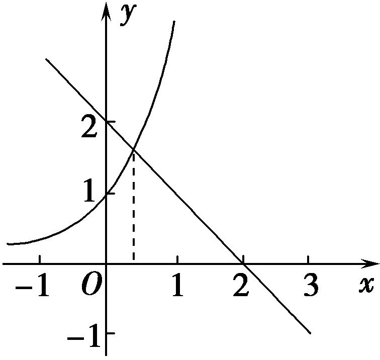

方法二　函数<em>f</em>(<em>x</em>)＝e<em>x</em>＋<em>x</em>－2的零点，即函数<em>y</em>＝e<em>x</em>的图象与<em>y</em>＝－<em>x</em>＋2的图象的交点的横坐标，作出函数<em>y</em>＝e<em>x</em>与直线<em>y</em>＝－<em>x</em>＋2的图象如图所示，由图可知选C．

5．在下列区间中，函数<em>f</em>(<em>x</em>)＝e－<em>x</em>＋4<em>x</em>－3的零点所在的区间可能为(　　)

A．　　　　　B．　　　　　C．　　　　　D．

5．答案　D　解析　函数<em>f</em>(<em>x</em>)＝e－<em>x</em>＋4<em>x</em>－3是连续函数，又因为＝－1＜0，＝＋3－3＞0，

所以＜0，故选D．

6．若<em>x</em>0是方程的解，则<em>x</em>0属于区间(　　)

A．　　　　　　B．　　　　　　C．　　　　　　D．

6．答案　C　解析　　令*g*(*x*)＝，*f*(*x*)＝，则*g*(0)＝1>*f*(0)＝0，，

，所以由图象关系可得&lt;<em>x</em>0&lt;．

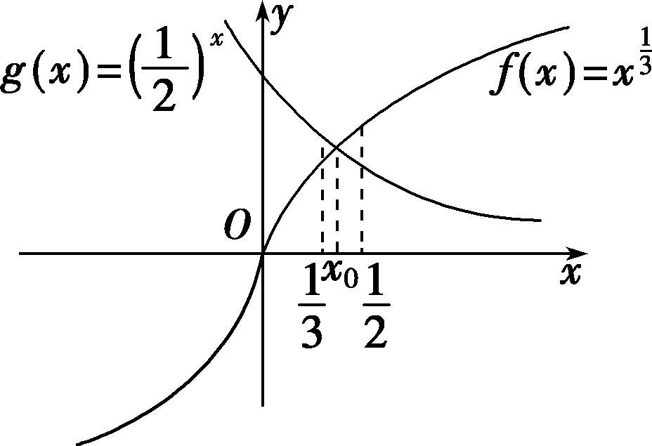

7．已知实数<em>a</em>&gt;1，0&lt;<em>b</em>&lt;1，则函数<em>f</em>(<em>x</em>)＝<em>ax</em>＋<em>x</em>－<em>b</em>的零点所在的区间是(　　)

A．(－2，－1)　　　　　B．(－1，0)　　　　　C．(0，1) 　　　　　D．(1，2)

7．答案　B　解析　因为<em>a</em>&gt;1,0&lt;<em>b</em>&lt;1，<em>f</em>(<em>x</em>)＝<em>ax</em>＋<em>x</em>－<em>b</em>，所以<em>f</em>(－1)＝－1－<em>b</em>&lt;0，<em>f</em>(0)＝1－<em>b</em>&gt;0，所以<em>f</em>(－

1)·*f*(0)<0，则由零点存在性定理可知*f*(*x*)在区间(－1，0)上存在零点．

8．若函数<em>y</em>＝<em>f</em>(<em>x</em>)(<em>x</em>∈<strong>R</strong>)是奇函数，其零点分别为<em>x</em>1，<em>x</em>2，…，<em>x</em>2 017，且<em>x</em>1＋<em>x</em>2＋…＋<em>x</em>2 017＝<em>m</em>，则关于<em>x</em>

的方程2<em>x</em>＋<em>x</em>－2＝<em>m</em>的根所在区间是(　　)

A．(0，1)　　　　　B．(1，2)　　　　　C．(2，3)　　　　　D．(3，4)

8．答案　A　解析　因为函数<em>y</em>＝<em>f</em>(<em>x</em>)(<em>x</em>∈<strong>R</strong>)是奇函数，故其零点<em>x</em>1，<em>x</em>2，…，<em>x</em>2 017关于原点对称，且其中

一个为0，所以<em>x</em>1＋<em>x</em>2＋…＋<em>x</em>2 017＝<em>m</em>＝0．则关于<em>x</em>的方程为2<em>x</em>＋<em>x</em>－2＝0，令<em>h</em>(<em>x</em>)＝2<em>x</em>＋<em>x</em>－2，则<em>h</em>(<em>x</em>)为(－∞，＋∞)上的增函数．因为<em>h</em>(0)＝20＋0－2＝－1&lt;0，<em>h</em>(1)＝21＋1－2＝1&gt;0，所以关于<em>x</em>的方程2<em>x</em>＋<em>x</em>－2＝<em>m</em>的根所在区间是(0，1)．

9．已知函数<em>f</em>(<em>x</em>)＝－log2<em>x</em>，在下列区间中，包含<em>f</em>(<em>x</em>)零点的区间是(　　)

A．(0，1)　　　　　　B．(1，2)　　　　　　C．(2，4)　　　　　　D．(4，＋∞)

9．答案　C　解析　因为<em>f</em>(1)＝6－log21＝6&gt;0，<em>f</em>(2)＝3－log22＝2&gt;0，<em>f</em>(4)＝－log24＝－&lt;0，所以函数

*f*(*x*)的零点所在区间为(2，4)．

10．函数*f*(*x*)＝ln *x*－的零点所在的区间为(　　)

A．(0，1)　　　　　B．(1，2)　　　　　C．(2，3)　　　　　D．(3，4)

10．答案　B　解析　易知*f*(*x*)＝ln *x*－在定义域(0，＋∞)上是增函数，又*f*(1)＝－2<0，*f*(2)＝ln 2－>0．根

据零点存在性定理，可知函数*f*(*x*)＝ln *x*－有唯一零点，且在区间(1，2)内．

11．函数*f*(*x*)＝ln *x*＋*x*－－2的零点所在的区间是(　　)

A．　　　　　　B．(1，2)　　　　　　C．(2，e)　　　　　　D．(e，3)

11．答案　C　解析　易知*f*(*x*)在(0，＋∞)上单调递增，且*f*(2)＝ln 2－<0，*f*(e)＝＋e－－2>0．∴*f*(2)*f*(e)<0，

故*f*(*x*)的零点在区间(2，e)内．

12．已知函数<em>f</em>(<em>x</em>)＝log<em>ax</em>＋<em>x</em>－<em>b</em>(<em>a</em>&gt;0且<em>a</em>≠1)．当2&lt;<em>a</em>&lt;3&lt;<em>b</em>&lt;4时，函数<em>f</em>(<em>x</em>)的零点<em>x</em>0∈(<em>n</em>，<em>n</em>＋1)，<em>n</em>∈<strong>N</strong>\*，

则*n*＝\_\_\_\_\_\_\_\_．

12．答案　2　解析　对于函数<em>y</em>＝log<em>ax</em>，当<em>x</em>＝2时，可得<em>y</em>&lt;1，当<em>x</em>＝3时，可得<em>y</em>&gt;1，在同一坐标系中

画出函数<em>y</em>＝log<em>ax</em>，<em>y</em>＝－<em>x</em>＋<em>b</em>的图象，判断两个函数图象的交点的横坐标在(2，3)内，∴函数<em>f</em>(<em>x</em>)的零点<em>x</em>0∈(<em>n</em>，<em>n</em>＋1)时，<em>n</em>＝2．

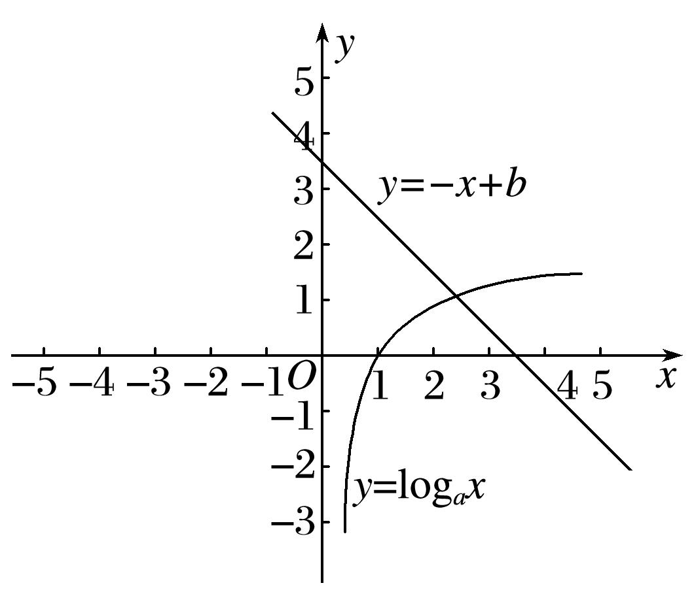

**考点二　简单函数(方程)零点(解)的个数判断**

【**方法总结**】

函数零点个数的判断方法

(1)解方程法：令*f*(*x*)＝0，如果能求出解，则方程解的个数即为函数零点的个数．

(2)零点存在性定理法：利用定理不仅要求函数在区间[*a*，*b*]上是连续不断的曲线，且*f*(*a*)·*f*(*b*)<0，还必须结合函数的图象与性质(如单调性、奇偶性、周期性、对称性)才能确定函数有多少个零点或零点所具有的性质．

(3)数形结合法：对于给定的函数不能直接求解或画出图象的，常分解转化为两个能画出图象的函数的交点问题．即将函数*y*＝*f*(*x*)－*g*(*x*)的零点个数转化为函数*y*＝*f*(*x*)与*y*＝*g*(*x*)图象公共点的个数来判断．

**【例题选讲】**

<strong>[例2]</strong>　(1)(2018·全国Ⅲ)函数<em>f</em>(<em>x</em>)＝cos在[0，π]的零点个数是\_\_\_\_\_\_\_\_．

答案　3　解析　由题意知，cos＝0，所以3<em>x</em>＋＝＋<em>k</em>π，<em>k</em>∈<strong>Z</strong>，所以<em>x</em>＝＋，<em>k</em>∈<strong>Z</strong>，当<em>k</em>＝0时，<em>x</em>＝；当<em>k</em>＝1时，<em>x</em>＝；当<em>k</em>＝2时，<em>x</em>＝，均满足题意，所以函数<em>f</em>(<em>x</em>)在[0，π]的零点个数为3．

(2)函数*f*(*x*)＝的零点个数为(　　)

A．3　　　　　　　　B．2　　　　　　　　C．1　　　　　　　　D．0

答案　B　解析　法一　由*f*(*x*)＝0得或解得*x*＝－2或*x*＝e．因此函数*f*(*x*)共有2个零点．

法二　函数*f*(*x*)的图象如图所示，由图象知函数*f*(*x*)共有2个零点．

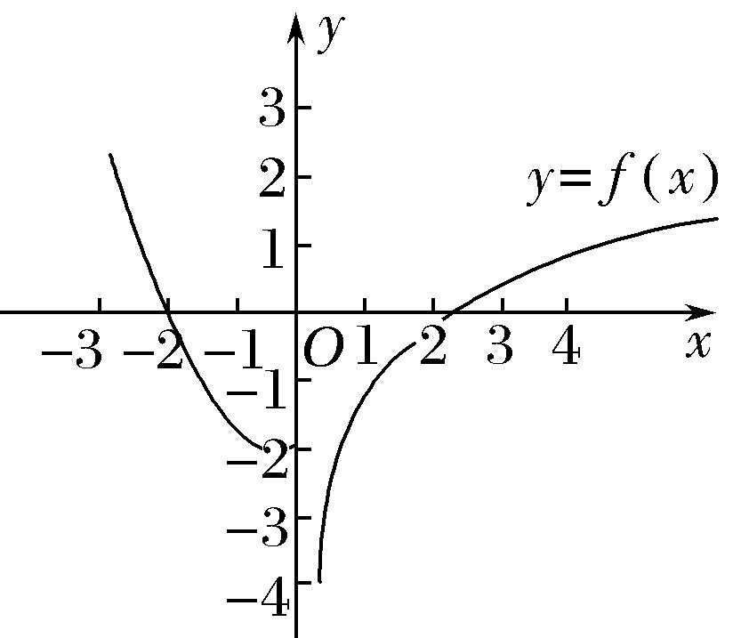

(3)已知函数*f*(*x*)＝则函数*g*(*x*)＝*f*(1－*x*)－1的零点个数为(　　)

A．1　　　　　　　　B．2　　　　　　　　C．3　　　　　　　　D．4

答案　C　解析　*g*(*x*)＝*f*(1－*x*)－1＝＝易知当*x*≥1时，函数*g*(*x*)有1个零点；当*x*<1时，函数*g*(*x*)有2个零点，所以函数*g*(*x*)的零点共有3个，故选C．

(4)函数<em>f</em>(<em>x</em>)＝的零点个数是________．

答案　2　解析　当<em>x</em>≤0时，令<em>x</em>2－2＝0，解得<em>x</em>＝－(正根舍去)，所以在(－∞，0]上，<em>f</em>(<em>x</em>)有一个零点；当<em>x</em>&gt;0时，<em>f</em>′(<em>x</em>)＝2＋&gt;0恒成立，所以<em>f</em>(<em>x</em>)在(0，＋∞)上是增函数．又因为<em>f</em>(2)＝－2＋ln 2&lt;0，<em>f</em>(3)＝ln 3&gt;0，所以<em>f</em>(<em>x</em>)在(0，＋∞)上有一个零点，综上，函数<em>f</em>(<em>x</em>)的零点个数为2．

(5)函数*f*(*x*)＝－的零点个数为(　　)

A．0　　　　　　　　B．1　　　　　　　　C．2　　　　　　　　D．3

答案　B　解析　函数*f*(*x*)＝－的零点个数是方程－＝0的解的个数，即方程＝的解的个数，也就是函数*y*＝与*y*＝的图象的交点个数，在同一坐标系中作出两个函数的图象如图所示，可得交点个数为1．

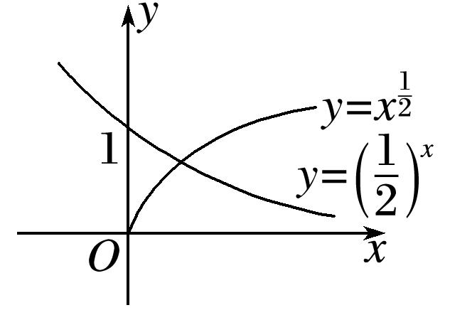

(6)函数<em>f</em>(<em>x</em>)＝3<em>x</em>|ln <em>x</em>|－1的零点个数为(　　)

A．1　　　　　　　　B．2　　　　　　　　C．3　　　　　　　　D．4

答案　B　解析　函数<em>f</em>(<em>x</em>)＝3<em>x</em>|ln <em>x</em>|－1的零点数的个数即函数<em>g</em>(<em>x</em>)＝|ln <em>x</em>|与函数<em>h</em>(<em>x</em>)＝图象的交点个数．作出函数<em>g</em>(<em>x</em>)＝|ln <em>x</em>|和函数<em>h</em>(<em>x</em>)＝的图象，由图象可知，两函数图象有两个交点，故函数<em>f</em>(<em>x</em>)＝3<em>x</em>|ln <em>x</em>|－1有2个零点．

(7)已知函数*f*(*x*)＝－cos*x*，则*f*(*x*)在[0，2π]上的零点个数为\_\_\_\_\_\_\_\_．

答案　3　解析　如图，作出*g*(*x*)＝与*h*(*x*)＝cos*x*的图象，可知其在[0，2π]上的交点个数为3，所以函数*f*(*x*)在[0，2π]上的零点个数为3．

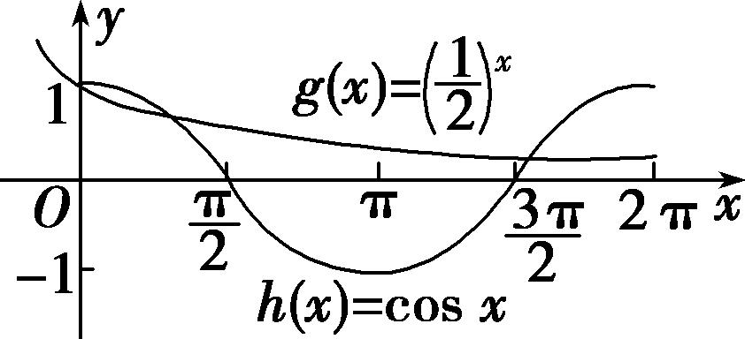

(8)(2015湖北)函数<em>f</em>(<em>x</em>)＝2sin <em>x</em>sin－<em>x</em>2的零点个数为\_\_\_\_\_\_\_\_\_\_．

答案　2　解析　函数<em>f</em>(<em>x</em>)＝2sin <em>x</em>sin－<em>x</em>2的零点个数等价于方程2sin <em>x</em>sin－<em>x</em>2＝0的根的个数，即函数<em>g</em>(<em>x</em>)＝2sin <em>x</em>sin＝2sin <em>x</em>cos <em>x</em>＝sin 2<em>x</em>与<em>h</em>(<em>x</em>)＝<em>x</em>2的图象交点个数．分别画出两函数图象，如图，由图可知，函数<em>g</em>(<em>x</em>)与<em>h</em>(<em>x</em>)的图象有2个交点．故零点个数为2．

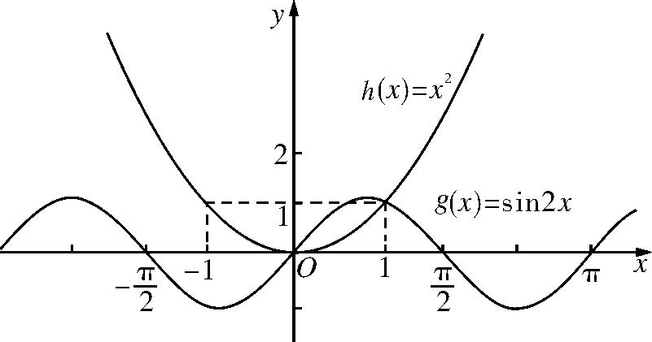

【**对点训练**】

13．已知函数*f*(*x*)＝则函数*y*＝*f*(*x*)＋3*x*的零点个数是(　　)

A．0　　　　　　　　B．1　　　　　　　　C．2　　　　　　　　D．3

13．答案　C　解析　解法1　令*f*(*x*)＋3*x*＝0，则或解得*x*＝0或*x*＝

－1，所以函数*y*＝*f*(*x*)＋3*x*的零点个数是2．故选C．

解法2　函数*y*＝*f*(*x*)＋3*x*的零点个数就是*y*＝*f*(*x*)与*y*＝－3*x*两个函数图象的交点个数，如图所示，由函数的图象可知，零点个数为2．

14．已知函数*f*(*x*)＝则函数*f*(*x*)的零点为(　　)

A．，0　　　　　　　　B．－2，0　　　　　　　　C．　　　　　　　　D．0

14．答案　D　解析　当<em>x</em>≤1时，令<em>f</em>(<em>x</em>)＝2<em>x</em>－1＝0，解得<em>x</em>＝0；当<em>x</em>&gt;1时，令<em>f</em>(<em>x</em>)＝1＋log2<em>x</em>＝0，解得<em>x</em>

＝，又因为*x*>1，所以此时方程无解．综上函数*f*(*x*)的零点只有0．

15．已知函数*f*(*x*)＝函数*g*(*x*)＝3－*f*(2－*x*)，则函数*y*＝*f*(*x*)－*g*(*x*)的零点的个数为(　　)

A．2　　　　　　　　B．3　　　　　　　　C．4　　　　　　　　D．5

15．<strong>答案</strong>　A　<strong>解析</strong>　当<em>x</em>&lt;0时，<em>f</em>(2－<em>x</em>)＝<em>x</em>2，此时函数<em>f</em>(<em>x</em>)－<em>g</em>(<em>x</em>)＝－1－|<em>x</em>|＋<em>x</em>2的小于零的零点为<em>x</em>＝

－；当0≤<em>x</em>≤2时，<em>f</em>(2－<em>x</em>)＝2－|2－<em>x</em>|＝<em>x</em>，函数<em>f</em>(<em>x</em>)－<em>g</em>(<em>x</em>)＝2－|<em>x</em>|＋<em>x</em>－3＝－1无零点；当<em>x</em>&gt;2时，<em>f</em>(2－<em>x</em>)＝2－|2－<em>x</em>|＝4－<em>x</em>，函数<em>f</em>(<em>x</em>)－<em>g</em>(<em>x</em>)＝(<em>x</em>－2)2＋4－<em>x</em>－3＝<em>x</em>2－5<em>x</em>＋5大于2的零点有一个．因此函数<em>y</em>＝<em>f</em>(<em>x</em>)－<em>g</em>(<em>x</em>)共有零点2个．

16．设函数<em>f</em>(<em>x</em>)＝2|<em>x</em>|＋<em>x</em>2－3，则函数<em>y</em>＝<em>f</em>(<em>x</em>)的零点个数是(　　)

A．4　　　　　　　　B．3　　　　　　　　C．2　　　　　　　　D．1

16．答案　C　解析　易知<em>f</em>(<em>x</em>)是偶函数，当<em>x</em>≥0时，<em>f</em>(<em>x</em>)＝2<em>x</em>＋<em>x</em>2－3，∴<em>x</em>≥0时，<em>f</em>(<em>x</em>)在(0，＋∞)上是增函

数，且*f*(1)＝0，∴*x*＝1是函数*y*＝*f*(*x*)在(0，＋∞)上唯一零点．从而*x*＝－1是*y*＝*f*(*x*)在(－∞，0)内的零点．故*y*＝*f*(*x*)有两个零点．

17．函数*f*(*x*)＝|*x*－2|－ln *x*在定义域内的零点的个数为(　　)

A．0　　　　　　　　B．1　　　　　　　　C．2　　　　　　　　D．3

17．答案　C　解析　由题意可知*f*(*x*)的定义域为(0，＋∞)，在同一直角坐标系中画出函数*y*＝|*x*－2|(*x*>0)，

*y*＝ln *x*(*x*>0)的图象，如图所示．由图可知函数*f*(*x*)在定义域内的零点个数为2．

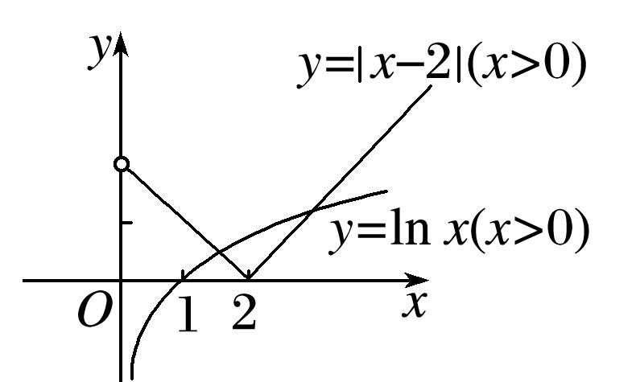

18．函数<em>f</em>(<em>x</em>)＝|log2<em>x</em>|＋<em>x</em>－2的零点个数为(　　)

A．1　　　　　　　　B．2　　　　　　　　C．3　　　　　　　　D．4

18．答案　B　解析　函数<em>f</em>(<em>x</em>)＝|log2<em>x</em>|＋<em>x</em>－2的零点个数，就是方程|log2<em>x</em>|＋<em>x</em>－2＝0的根的个数．令<em>h</em>(<em>x</em>)

＝|log2<em>x</em>|，<em>g</em>(<em>x</em>)＝2－<em>x</em>，在同一坐标平面上画出两函数的图象，如图所示．由图象得<em>h</em>(<em>x</em>)与<em>g</em>(<em>x</em>)有2个交点，∴方程|log2<em>x</em>|＋<em>x</em>－2＝0的根的个数为2．

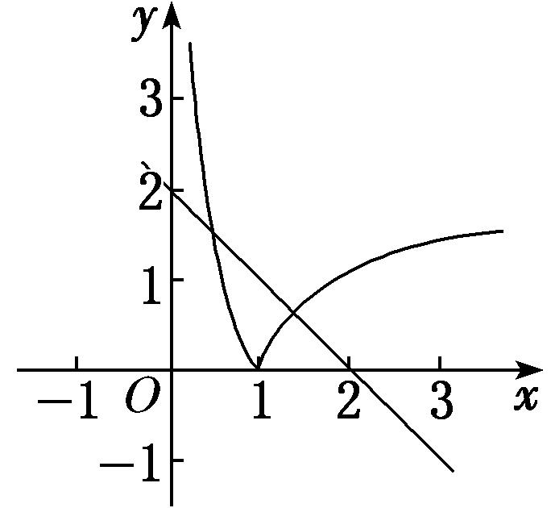

19．函数*f*(*x*)＝－cos *x*在[0，＋∞)内(　　)

A．没有零点　B．有且仅有一个零点　C．有且仅有两个零点　D．有无穷多个零点

19．答案　B　解析　当*x*∈时，因为*f*′(*x*)＝＋sin *x*，>0，sin *x*>0，所以*f*′(*x*)>0，故*f*(*x*)在[0，

1]上单调递增，且*f*(0)＝－1<0，*f*(1)＝1－cos 1>0，所以*f*(*x*)在[0，1]内有唯一零点．当*x*>1时，*f*(*x*)＝－cos *x*>0，故函数*f*(*x*)在[0，＋∞)上有且仅有一个零点，故选B．

20．函数<em>f</em>(<em>x</em>)＝4cos2·cos－2sin <em>x</em>－|ln(<em>x</em>＋1)|的零点个数为\_\_\_\_\_\_\_\_\_\_．

20．答案　2　解析　*f*(*x*)＝2(1＋cos *x*)sin *x*－2sin *x*－|ln(*x*＋1)|＝sin 2*x*－|ln(*x*＋1)|，*x*>－1，函数*f*(*x*)的零点

个数即为函数<em>y</em>1＝sin 2<em>x</em>(<em>x</em>&gt;－1)与<em>y</em>2＝|ln(<em>x</em>＋1)|(<em>x</em>&gt;－1)的图象的交点个数．分别作出两个函数的图象，如图，可知有两个交点，则<em>f</em>(<em>x</em>)有两个零点．

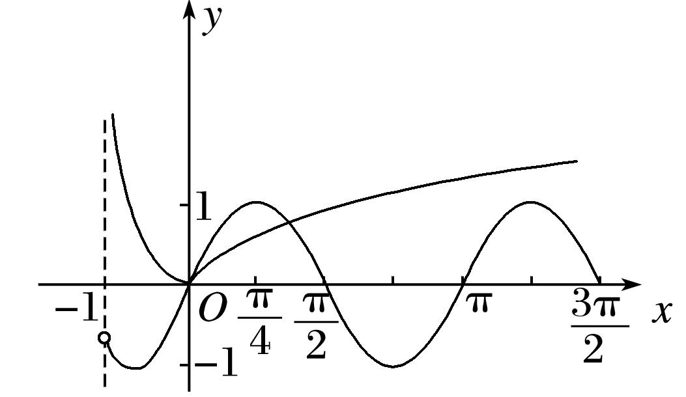

21．函数*f*(*x*)＝的零点个数是\_\_\_\_\_\_\_\_．

21．答案　3　解析　当<em>x</em>＞0时，作函数<em>y</em>＝ln <em>x</em>和<em>y</em>＝<em>x</em>2－2<em>x</em>的图象，由图知，当<em>x</em>＞0时，<em>f</em>(<em>x</em>)有2个零

点；当<em>x</em>≤0时，令<em>x</em>2－2＝0，解得<em>x</em>＝－(正根舍去)，所以在(－∞，0]上有一个零点，综上知<em>f</em>(<em>x</em>)有3个零点．

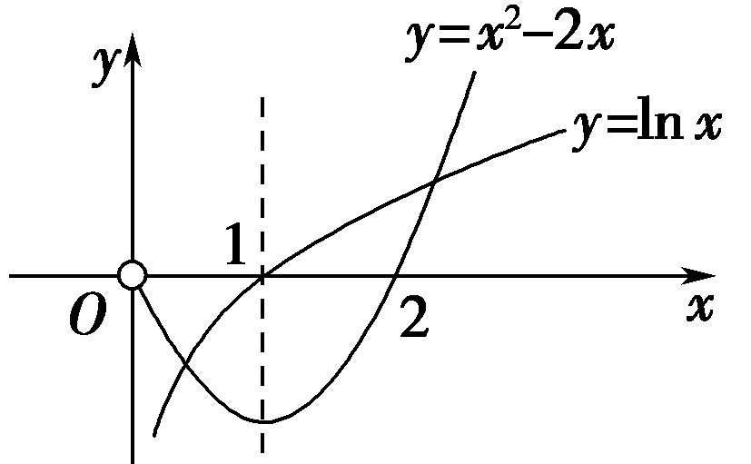

22．已知函数*f*(*x*)＝则函数*y*＝*f*(*x*)＋*x*－4的零点个数为(　　)

A．1　　　　　　　　B．2　　　　　　　　C．3　　　　　　　　D．4

22．答案　B　解析　函数*y*＝*f*(*x*)＋*x*－4的零点个数，即函数*y*＝－*x*＋4与*y*＝*f*(*x*)的图象的交点的个数．如

图所示，函数*y*＝－*x*＋4与*y*＝*f*(*x*)的图象有两个交点，故函数*y*＝*f*(*x*)＋*x*－4的零点有2个．故选B．

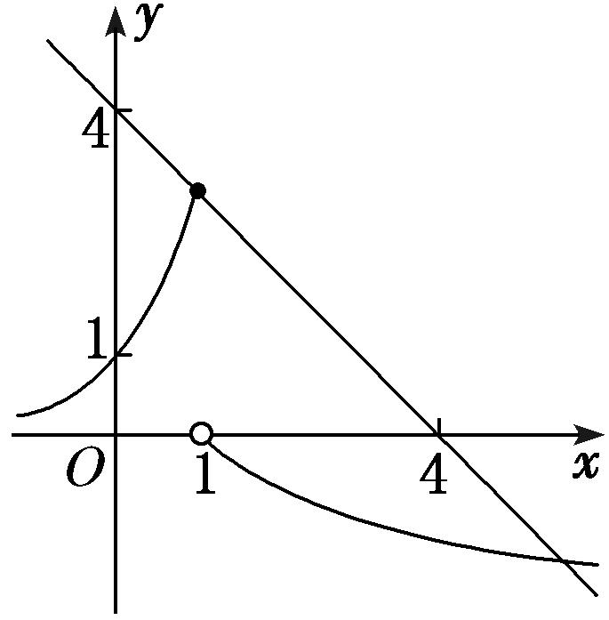

23．已知<em>f</em>(<em>x</em>)＝则函数<em>g</em>(<em>x</em>)＝<em>f</em>(<em>x</em>)－e<em>x</em>的零点个数为\_\_\_\_\_\_\_\_．

23．答案　2　解析　函数<em>g</em>(<em>x</em>)＝<em>f</em>(<em>x</em>)－e<em>x</em>的零点个数即为函数<em>y</em>＝<em>f</em>(<em>x</em>)与<em>y</em>＝e<em>x</em>的图象的交点个数．作出函数

图象可知有2个交点，即函数<em>g</em>(<em>x</em>)＝<em>f</em>(<em>x</em>)－e<em>x</em>有2个零点．

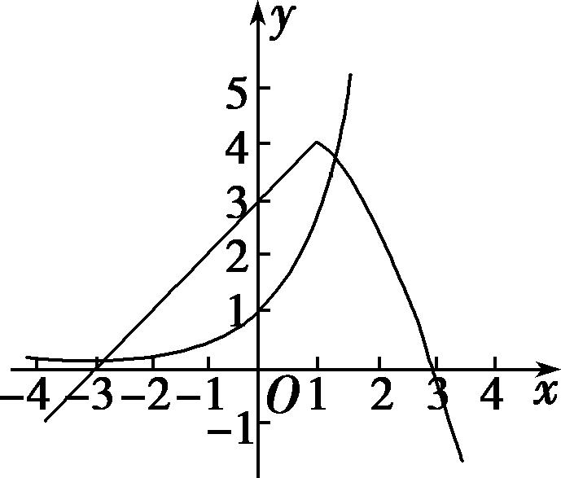

24．已知函数<em>f</em>(<em>x</em>)＝则函数<em>g</em>(<em>x</em>)＝2|<em>x</em>|<em>f</em>(<em>x</em>)－2的零点个数为(　　)

A．1个　　　　　　　B．2个　　　　　　　　C．3个　　　　　　　　D．4个

24．答案　B　解析　画出函数<em>f</em>(<em>x</em>)＝的图象如图，由<em>g</em>(<em>x</em>)＝2|<em>x</em>|<em>f</em>(<em>x</em>)－2＝0可得

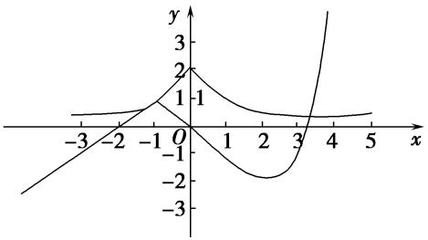

<em>f</em>(<em>x</em>)＝，则问题化为函数<em>f</em>(<em>x</em>)＝与函数<em>y</em>＝＝21－|<em>x</em>|的图象的交点的个数问题．结合图象可以看出两函数图象的交点只有两个，应选答案B．

