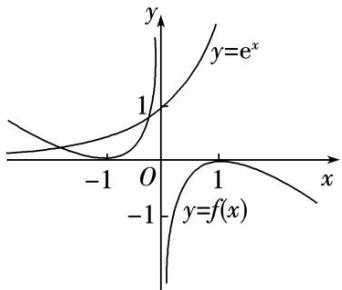
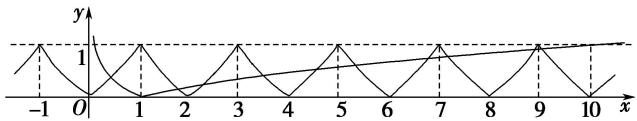
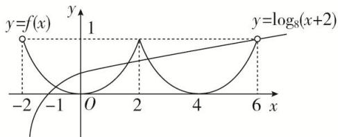
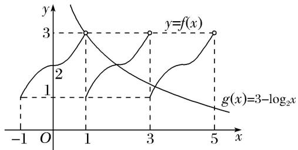
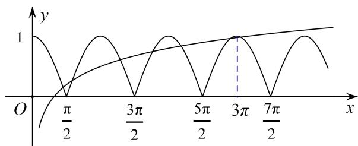

# 专题十五 函数的零点问题（2）

# 考点一 复杂函数(方程)零点(解)的个数判断

# 【方法总结】

复杂函数(方程)的零点的个数(方程的解)的判断多采用数形结合法：对于给定的函数不能直接求解或画出图象的，常分解转化为两个能画出图象的函数的交点问题．即将函数 $y=f(x)-g(x)$ 的零点个数转化为函数 $y=f(x)$ 与 $y=g(x)$ 图象公共点的个数来判断．但其中一个函数往往比较复杂，可能涉及到函数的奇偶性周期性等函数的性质，需要有强大的画图能力．

# 【例题选讲】

[例 1] （1）已知 $f(x)$ 是定义在 R 上的奇函数，且 x>0 时， $f(x)=\ln x-x+1$ ，则函数 $g(x)=f(x)-\mathrm{e}^{x}(\mathrm{e}$ 为自然对数的底数) 的零点个数是()

A. 0

B. 1

C. 2

D. 3

  
（2）已知函数 $y = f(x)$ 是周期为2的周期函数，且当 $x \in [-1, 1]$ 时， $f(x) = 2^{|x|} - 1$ ，则函数 $F(x) = f(x) - |\lg x|$ 的零点个数是（）

A. 9

B. 10

C. 11

D. 18

  
（3）设函数 $f(x)$ 是定义在 $\mathbf{R}$ 上的偶函数，且 $f(x + 2) = f(2 - x)$ ，当 $x \in [-2, 0]$ 时， $f(x) = (\frac{\sqrt{2}}{2})^x - 1$ ，则在区间 $(-2, 6)$ 上关于 $x$ 的方程 $f(x) - \log_8(x + 2) = 0$ 的解的个数为（）

A. 1

B. 2

C. 3

D. 4

  
（4）定义在 $\mathbf{R}$ 上的函数 $f(x)$ ，满足 $f(x) = \begin{cases} x^2 + 2, & x \in [0, 1), \\ 2 - x^2, & x \in [-1, 0), \end{cases}$ ，且 $f(x + 1) = f(x - 1)$ ，若 $g(x) = 3 - \log_2 x$ ，则函数 $F(x) = f(x) - g(x)$ 在 $(0, +\infty)$ 内的零点有（）

A. 3 个

B. 2 个

C. 1 个

D. 0 个

  
（5）若函数 $f(x)$ 的图象上存在两个不同点 $A, B$ 关于原点对称，则称 $A, B$ 两点为一对“优美点”，记作 $(A, B)$ ，规定 $(A, B)$ 和 $(B, A)$ 是同一对“优美点”。已知 $f(x)=\left\{\begin{aligned}&|\cos x|,&x\geq0,\\&-\lg(-x)&,&x<0,\end{aligned}\right.$ 则函数 $f(x)$ 的图象上共存在“优美点”（）

A. 14 对

B. 3 对

C. 5 对

D. 7 对

# 【对点训练】

1. 已知 $f(x)$ 是定义在 $\mathbf{R}$ 上的奇函数，当 $x \geq 0$ 时， $f(x) = x^2 - 3x$ ，则函数 $g(x) = f(x) - x + 3$ 的零点的集合为（）

A. $\{1, 3\}$

B. $\{-3, -1, 1, 3\}$

C. $\{2-\sqrt{7},\quad1,\quad3\}$

D. $\{-2-\sqrt{7},\quad1,\quad3\}$

2. $f(x)$ 是定义在 $\mathbf{R}$ 上的奇函数，且当 $x \in (0, +\infty)$ 时， $f(x) = 2020^x + \log_{2020} x$ ，则函数 $f(x)$ 的零点个数是 \_\_\_\_.

3. 已知函数 $f(x)$ 是偶函数， $f(0) = 0$ ，且 $x > 0$ 时， $f(x)$ 是增函数， $f(3) = 0$ ，则函数 $g(x) = f(x) + \lg |x + 1|$ 的零点个数为 \_\_\_\_.

4. 若定义在 $\mathbf{R}$ 上的偶函数 $f(x)$ 满足 $f(x + 2) = f(x)$ ，且 $x \in [0, 1]$ 时， $f(x) = x$ ，则方程 $f(x) = \log_3 |x|$ 的零点个数是（）

A. 2

B. 3

C. 4

D. 多于 4

5. 已知定义在 $\mathbf{R}$ 上的函数 $y = f(x)$ 对任意的 $x$ 都满足 $f(x + 1) = -f(x)$ ，且当 $0 \leq x < 1$ 时， $f(x) = x$ ，则函数 $g(x) = f(x) - \ln |x|$ 的零点个数为（）

A. 2

B. 3

C. 4

D. 5

6. 已知函数 $f(x)$ 满足：①定义域为 $\mathbf{R}$ ；② $\forall x \in \mathbf{R}$ ，都有 $f(x + 2) = f(x)$ ；③当 $x \in [-1, 1]$ 时， $f(x) = -|x| + 1$ . 则方程 $f(x) = \frac{1}{2} \log_2 |x|$ 在区间 $[-3, 5]$ 内解的个数是（）

A. 5

B. 6

C. 7

D. 8

7. 已知函数 $f(x)$ 是 $\mathbf{R}$ 上最小正周期为 2 的周期函数，且当 $0 \leq x < 2$ 时， $f(x) = x^3 - x$ ，则函数 $y = f(x)$ 的图象在区间[0, 6]上与 $x$ 轴的交点的个数为（）

A. 6

B. 7

C. 8

D. 9

8. 已知函数 $y = f(x)$ 的周期为 2，当 $x \in [-1, 1]$ 时， $f(x) = x^2$ ，那么函数 $y = f(x)$ 的图象与函数 $y = |\lg x|$ 的图象的交点共有（）

A. 10 个

B. 9个

C. 8个

D. 1 个

9. 设函数 $f(x)$ 的定义域为 $\mathbf{R}$ , $f(-x) = f(x)$ , $f(x) = f(2 - x)$ , 当 $x \in [0, 1]$ 时, $f(x) = x^3$ , 则函数 $g(x) = |\cos \pi x| - f(x)$ 在区间 $[- \frac{1}{2}, \frac{3}{2}]$ 上零点的个数为 ( )

A. 3

B. 4

C. 5

D. 6

10. 已知定义在 $\mathbf{R}$ 上的函数 $f(x)$ 满足：①图象关于点(1，0)对称；② $f(-1 + x) = f(-1 - x)$ ；③当 $x \in [-1, 1]$ 时， $f(x) = \begin{cases} 1 - x^2, & x \in [-1, 0], \\ \cos \frac{\pi}{2}x, & x \in 0, 1 \end{cases}$ . 则函数 $y = f(x) - \left(\frac{1}{2}\right)^{|x|}$ 在区间 $[-3, 3]$ 上的零点个数为（）

A. 5

B. 6

C. 7

D. 8

11. 已知定义在 $\mathbf{R}$ 上的偶函数 $f(x)$ 满足 $f(x + 4) = f(x)$ ，且 $x \in [0, 2]$ 时， $f(x) = \sin \pi x + 2 |\sin \pi x|$ ，则方程 $f(x) - |\lg x| = 0$ 在区间 $[0, 10]$ 上根的个数是（）

A. 17

B. 18

C. 19

D. 20

12. 已知函数 $f(x)$ 是定义在 $(- \infty, 0) \cup (0, +\infty)$ 上的偶函数，当 $x > 0$ 时， $f(x) = \begin{cases} 2^{|x-1|}, & 0 < x \leq 2 \\ \frac{1}{2} f(x - 2), & x > 2 \end{cases}$ ，则函数 $g(x) = 4f(x) - 1$ 的零点个数为（）

A. 2

B. 4

C. 6

D. 8

# 考点二 已知简单函数的零点情况求参数的取值范围

# 【方法总结】

# 已知简单函数的零点情况求参数值或取值范围的方法  
（1）直接法：利用零点存在的判定定理构建不等式求解.  
（2）分离参数法：分离参数后转化为求函数的值域(最值)问题求解.  
（3）数形结合法：转化为两个熟悉的函数图象的位置关系问题，从而构建不等式求解.

# 【例题选讲】

[例 2]（1）函数 $f(x)=2^{x}-\frac{2}{x}-a$ 的一个零点在区间(1, 2)内，则实数 a 的取值范围是()

A. $(1, 3)$

B. $(1, 2)$

C. $(0, 3)$

D. $(0, 2)$  
（2）若关于 x 的方程 $2^{2x} + 2^{x}a + a + 1 = 0$ 有实根，则实数 a 的取值范围为 \_\_\_\_.  
（3）已知函数 $f(x)=\left\{\begin{aligned}e^{x}+a, & x\leq0,\\ 3x-1, & x>0\end{aligned}\right.$ ( $a\in\mathbf{R}$ ), 若函数 $f(x)$ 在 R 上有两个零点，则 a 的取值范围是()

A. $(-\infty, -1$

B. $(-∞, 1)$

C. $(-1, 0)$

D. $[-1, 0)$  
（4）已知函数 $f(x) = \begin{cases} 2x^2 + 2mx - 1, & 0 \leq x \leq 1, \\ mx + 2, & x > 1, \end{cases}$ 若 $f(x)$ 在区间 $[0, +\infty)$ 上有且只有2个零点，则实数 $m$ 的取值范围是 \_\_\_\_.  
（5）(2017·全国III)已知函数 $f(x)=x^{2}-2x+a(e^{x-1}+e^{-x+1})$ 有唯一零点，则 $a=(\quad)$

A. $-\frac{1}{2}$

B. $\frac{1}{3}$

C. $\frac{1}{2}$

D. 1  
（6）若曲线 $y = \log_2(2^x - m)(x > 2)$ 上至少存在一点与直线 $y = x + 1$ 上的一点关于原点对称，则 $m$ 的取值范围为 \_\_\_\_.

# 【对点训练】

13. 设函数 $f(x)=x^{3}-3x$ ，若函数 $g(x)=f(x)+f(t-x)$ 有零点，则实数 t 的取值范围是()

A. $(-2\sqrt{3}, 2\sqrt{3})$

B. $(- \sqrt{3}, \sqrt{3})$

C. $[-2\sqrt{3}, 2\sqrt{3}]$

D. $\left[-\sqrt{3},\sqrt{3}\right]$

14. 若关于 $x$ 的方程 $(\lg a + \lg x) \cdot (\lg a + 2\lg x) = 4$ 的所有解都大于 1，则实数 $a$ 的取值范围为 \_\_\_\_.

15. 函数 $f(x) = 2^{x} - \frac{2}{x} - a$ 的一个零点在区间(1, 2)内，则实数 $a$ 的取值范围是（）

A. $(1, 3)$

B. $(1, 2)$

C. $(0, 3)$

D. $(0, 2)$

16. 已知函数 $f(x) = \log_3\frac{x + 2}{x} - a$ 在区间(1, 2)内有零点，则实数 $a$ 的取值范围是（）

A. $(-1, -\log_32)$

B. $(0, \log_52)$

C. $(\log_{3}2, 1)$

D. $(1, \log_{3}4)$

17. 若函数 $f(x) = x^2 - ax + 1$ 在区间 $\left[\frac{1}{2}, 3\right]$ 上有零点，则实数 $a$ 的取值范围是（）

A. $(2, +\infty)$

B. $[2, +\infty)$

C. $\left[2,\frac{5}{2}\right]$

D. $\left[2, \frac{10}{3}\right]$

18. 若函数 $f(x) = 4^x - 2^x - a$ ， $x \in [-1, 1]$ 有零点，则实数 $a$ 的取值范围是 \_\_\_\_.

19. 已知函数 $f(x)=\left\{\begin{aligned}&1,&x\leq0,\\ &\frac{1}{x},&x>0,\end{aligned}\right.$ 则使方程 $x+f(x)=m$ 有解的实数 m 的取值范围是()

A. $(1, 2)$

B. $(-∞,-2]$

C. $(- \infty, 1) \cup (2, +\infty)$

D. $(- \infty, 1] \cup [2, +\infty)$

20. 若函数 $f(x) = \begin{cases} 2^x - a, & x \leq 0, \\ \ln x, & x > 0 \end{cases}$ 有两个不同的零点，则实数 $a$ 的取值范围是 \_\_\_\_.

21. 已知函数 $f(x) = \begin{cases} e^x - a, & x \leq 0, \\ 2x - a, & x > 0, \end{cases}$ ( $a \in \mathbf{R}$ ), 若函数 $f(x)$ 在 $\mathbf{R}$ 上有两个零点，则实数 $a$ 的取值范围是（）

A. $(0, 1]$

B. $[1, +\infty)$

C. $(0, 1)$

D. $(-\infty, 1]$

22. 函数 $f(x)=\left\{\begin{aligned}&|x^{2}+2x-1| & x\leq0\\&2^{x-1}+a & x>0\end{aligned}\right.$ 有两个不同的零点，则实数 a 的取值范围为 \_\_\_\_.

23. 方程 $\log_{\frac{1}{2}}(a-2^{x})=2+x$ 有解，则 a 的最小值为 \_\_\_\_.

24. 设函数 $f(x) = \log_2(2^x + 1)$ ， $g(x) = \log_2(2^x - 1)$ ，若关于 $x$ 的函数 $F(x) = g(x) - f(x) - m$ 在[1, 2]上有零点，则 $m$ 的取值范围为 \_\_\_\_.

