# 专题十五 函数的零点问题(2)

# 考点一 复杂函数(方程)零点(解)的个数判断

# 【方法总结】

复杂函数(方程)的零点的个数(方程的解)的判断多采用数形结合法：对于给定的函数不能直接求解或画出图象的，常分解转化为两个能画出图象的函数的交点问题．即将函数 $y=f(x)-g(x)$ 的零点个数转化为函数 $y=f(x)$ 与 $y=g(x)$ 图象公共点的个数来判断．但其中一个函数往往比较复杂，可能涉及到函数的奇偶性周期性等函数的性质，需要有强大的画图能力.

# 【例题选讲】

[例 1] (1)已知 $f(x)$ 是定义在 R 上的奇函数，且 x>0 时， $f(x)=\ln x-x+1$ ，则函数 $g(x)=f(x)-\mathrm{e}^{x}(\mathrm{e}$ 为自然对数的底数) 的零点个数是()

A. 0

B. 1

C. 2

D. 3

答案 C 解析 当 x>0 时， $f(x)=\ln x-x+1$ ， $f'(x)=\frac{1}{x}-1=\frac{1-x}{x}$ ，所以 $x\in(0,1)$ 时 $f'(x)>0$ ，此时 $f(x)$ 单调递增； $x\in(1,+\infty)$ 时， $f'(x)<0$ ，此时 $f(x)$ 单调递减。因此，当 x>0 时， $f(x)_{\max}=f(1)=\ln 1-1+1=0$ 。根据函数 $f(x)$ 是定义在 R 上的奇函数作出函数 $y=f(x)$ 与 $y=e^{x}$ 的大致图象如图所示，观察到函数 $y=f(x)$ 与 $y=e^{x}$ 的图象有两个交点，所以函数 $g(x)=f(x)-e^{x}$ （e 为自然对数的底数）有 2 个零点。

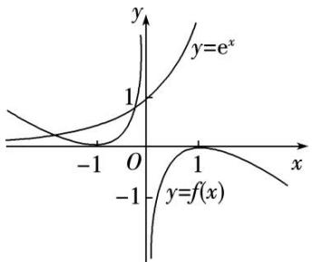

line

| x    | y=e^x | y=f(x) |
| ---- | ----- | ------ |
| -1   | 0     | 0      |
| 0    | 1     | 0      |
| 1    | ∞     | ∞      |

(2)已知函数 $y = f(x)$ 是周期为2的周期函数，且当 $x \in [-1, 1]$ 时， $f(x) = 2^{|x|} - 1$ ，则函数 $F(x) = f(x) - |\lg x|$ 的零点个数是（）

A. 9

B. 10

C. 11

D. 18

答案 B 解析 在坐标平面内画出 $y=f(x)$ 与 $y=|\lg x|$ 的大致图象如图，由图象可知，它们共有 10 个不同的交点，因此函数 $F(x)=f(x)-|\lg x|$ 的零点个数是 10.

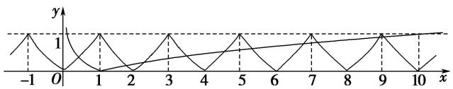

line

| x | y |
|---|---|
| -1 | 1 |
| 0 | 0 |
| 1 | 1 |
| 2 | 0 |
| 3 | 1 |
| 4 | 0 |
| 5 | 1 |
| 6 | 0 |
| 7 | 1 |
| 8 | 0 |
| 9 | 1 |
| 10 | 0 |

(3)设函数 $f(x)$ 是定义在 $\mathbf{R}$ 上的偶函数，且 $f(x + 2) = f(2 - x)$ ，当 $x \in [-2, 0]$ 时， $f(x) = (\frac{\sqrt{2}}{2})^x - 1$ ，则在区间 $(-2, 6)$ 上关于 $x$ 的方程 $f(x) - \log_8(x + 2) = 0$ 的解的个数为（）

A. 1

B. 2

C. 3

D. 4

答案 C 解析 原方程等价于 $y=f(x)$ 与 $y=\log_{8}(x+2)$ 的图象的交点个数问题，由 $f(x+2)=f(2-x)$ ，可知 $f(x)$ 的图象关于 x=2 对称，再根据 $f(x)$ 是偶函数这一性质，可由 $f(x)$ 在 $[-2,0]$ 上的解析式，作出 $f(x)$ 在 $(0,2)$ 上的图象，进而作出 $f(x)$ 在 $(-2,6)$ 上的图象，如图所示.

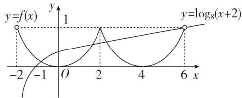

line

| x   | y=f(x) | y=log₈(x+2) |
| --- | ------ | ----------- |
| -2  | 0      | 0           |
| -1  | -1     | 0.5         |
| 0   | 0      | 1           |
| 1   | 1      | 0.5         |
| 2   | 0      | 1           |
| 3   | -1     | 0.5         |
| 4   | 0      | 1           |
| 5   | 1      | 0.5         |
| 6   | 0      | 1           |

再在同一坐标系下，画出 $y = \log_8(x + 2)$ 的图象，注意其图象过点(6, 1)，由图可知，两图象在区间(-2, 6)内有三个交点，从而原方程有三个根，故选C.

(4)定义在 $\mathbf{R}$ 上的函数 $f(x)$ ，满足 $f(x) = \begin{cases} x^2 + 2, & x \in [0, 1), \\ 2 - x^2, & x \in [-1, 0), \end{cases}$ 且 $f(x + 1) = f(x - 1)$ ，若 $g(x) = 3 - \log_2 x$ ，则函数 $F(x) = f(x) - g(x)$ 在 $(0, +\infty)$ 内的零点有（）

A. 3 个

B. 2 个

C. 1 个

D. 0 个

答案 B 解析 由 $f(x + 1) = f(x - 1)$ ，即 $f(x + 2) = f(x)$ ，知 $y = f(x)$ 的周期 $T = 2$ 。在同一坐标系中作出 $y = f(x)$ 与 $y = g(x)$ 的图象(如图)。由于两函数图象有 2 个交点，所以函数 $F(x) = f(x) - g(x)$ 在 $(0, +\infty)$ 内有 2 个零点。

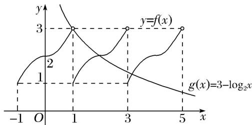

line

| x   | y=f(x) | g(x)=3-log₂x |
| --- | ------ | ------------ |
| -1  | 3      | 2            |
| 1   | 3      | 1            |
| 3   | 3      | 0.5          |
| 5   | 3      | 0.1          |

(5)若函数 $f(x)$ 的图象上存在两个不同点 $A, B$ 关于原点对称，则称 $A, B$ 两点为一对“优美点”，记作 $(A, B)$ ，规定 $(A, B)$ 和 $(B, A)$ 是同一对“优美点”。已知 $f(x)=\left\{\begin{aligned}\|\cos x\|,&x\geq0,\\-\lg(-x)\&,&x<0,\end{aligned}\right.$ 则函数 $f(x)$ 的图象上共存在“优美点”（）

A. 14 对

B. 3 对

C. 5 对

D. 7 对

答案 D 解析 与 $y = -\lg (-x)$ 的图象关于原点对称的函数是 $y = \lg x$ ，函数 $f(x)$ 的图象上的优美点的对数，即方程 $|\cos x| = \lg x (x > 0)$ 的解的个数，也是函数 $y = |\cos x|$ 与 $y = \lg x$ 的图象的交点个数，如图，作函数 $y = |\cos x|$ 与 $y = \lg x$ 的图象，由图可知，共有7个交点，函数 $f(x)$ 的图象上存在“优美点”共有7对．故选D.

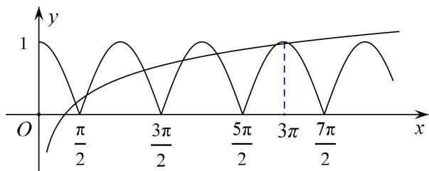

line

| x       | y     |
| ------- | ----- |
| 0       | 0     |
| π/2     | 1     |
| 3π/2    | 0     |
| 5π/2    | 1     |
| 3π      | 0     |
| 7π/2    | 1     |

# 【对点训练】

1. 已知 $f(x)$ 是定义在 $\mathbf{R}$ 上的奇函数，当 $x \geq 0$ 时， $f(x) = x^2 - 3x$ ，则函数 $g(x) = f(x) - x + 3$ 的零点的集合为（）

A. $\{1, 3\}$

B. $\{-3, -1, 1, 3\}$

C. $\{2-\sqrt{7},\quad1,\quad3\}$

D. $\{-2-\sqrt{7},\quad1,\quad3\}$

1. 答案 D 解析 求出当 $x < 0$ 时 $f(x)$ 的解析式，分类讨论解方程即可．令 $x < 0$ ，则 $-x > 0$ ，所以 $f(-x) = (-x)^2 + 3x = x^2 + 3x$ ．因为 $f(x)$ 是定义在 $\mathbf{R}$ 上的奇函数，所以 $f(-x) = -f(x)$ ．所以当 $x < 0$ 时， $f(x)$

$=-x^{2}-3x$ . 所以当 $x\geq0$ 时， $g(x)=x^{2}-4x+3$ 。令 $g(x)=0$ ，即 $x^{2}-4x+3=0$ ，解得 x=1 或 x=3 。当 x<0 时， $g(x)=-x^{2}-4x+3$ 。令 $g(x)=0$ ，即 $x^{2}+4x-3=0$ ，解得 $x=-2+\sqrt{7}>0$ （舍去）或 $x=-2-\sqrt{7}$ 。所以函数 $g(x)$ 有三个零点，故其集合为 $\{-2-\sqrt{7},1,3\}$ 。

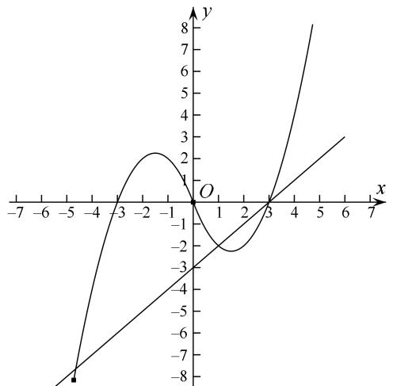

line

| x  | y (solid) | y (dashed) |
|----|-----------|------------|
| -5 | -8        | -          |
| -3 | -         | -          |
| -1 | 2         | -          |
| 0  | 1         | 0          |
| 3  | 0         | 0          |
| 6  | 3         | 3          |

2. $f(x)$ 是定义在 $\mathbf{R}$ 上的奇函数，且当 $x \in (0, +\infty)$ 时， $f(x) = 2020^x + \log_{2020} x$ ，则函数 $f(x)$ 的零点个数是 \_\_\_\_.  
2. 答案 3 解析 结合函数的图象, 可知函数 $y = 2020^{x}$ 和函数 $y = -\log_{2020} x$ 的图象在第一象限有一个交点, 所以函数 $f(x)$ 有一个正的零点, 根据奇函数图象的对称性, 有一个负的零点, 还有零, 所以函数有三个零点.  
3. 已知函数 $f(x)$ 是偶函数， $f(0) = 0$ ，且 $x > 0$ 时， $f(x)$ 是增函数， $f(3) = 0$ ，则函数 $g(x) = f(x) + \lg |x + 1|$ 的零点个数为 \_\_\_\_.  
3. 答案 3 解析 画出函数 $y = f(x)$ 和 $y = -\lg |x + 1|$ 的大致图象，如图所示．∴由图象知，函数 $g(x) = f(x) + \lg |x + 1|$ 的零点的个数为3.

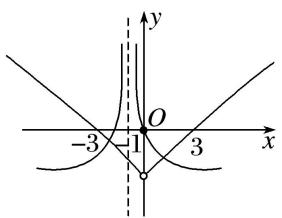

text_image

-3
1
O
3
x
y

4. 若定义在 $\mathbf{R}$ 上的偶函数 $f(x)$ 满足 $f(x + 2) = f(x)$ ，且 $x \in [0, 1]$ 时， $f(x) = x$ ，则方程 $f(x) = \log_3 |x|$ 的零点个数是（）

A. 2

B. 3

C. 4

D. 多于 4

4. 答案 C 解析 由 $f(x + 2) = f(x)$ ，知函数 $f(x)$ 是周期为 2 的周期函数，且是偶函数，在同一坐标系中画出 $y = \log_3 |x|$ 和 $y = f(x)$ ， $x \in [-3, 3]$ 的图象，如图所示，由图可知零点个数为 4.

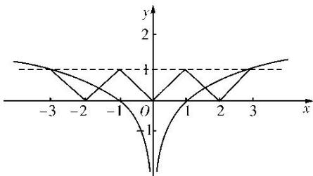

line

| x | y |
|---|---|
| -3 | 1 |
| -2 | 0 |
| -1 | 1 |
| 0 | 0 |
| 1 | 1 |
| 2 | 0 |
| 3 | 1 |

5. 已知定义在 $\mathbf{R}$ 上的函数 $y = f(x)$ 对任意的 $x$ 都满足 $f(x + 1) = -f(x)$ ，且当 $0 \leq x < 1$ 时， $f(x) = x$ ，则函数 $g(x) = f(x) - \ln |x|$ 的零点个数为（）

A. 2

B. 3

C. 4

D. 5

5. 答案 B 解析 依题意，可知函数 $g(x) = f(x) - \ln |x|$ 的零点个数即为函数 $y = f(x)$ 的图象与函数 $y = \ln |x|$ 的图象的交点个数。设 $-1 \leq x < 0$ ，则 $0 \leq x + 1 < 1$ ，此时有 $f(x) = -f(x + 1) = -(x + 1)$ ，又由 $f(x + 1) = -f(x)$ ，得 $f(x + 2) = -f(x + 1) = f(x)$ ，即函数 $f(x)$ 以 2 为周期的周期函数。而 $y = \ln |x| = \begin{cases} \ln x, & x > 0, \\ \ln (-x), & x < 0, \end{cases}$ 在同一坐标系中作出函数 $y = f(x)$ 的图象与 $y = \ln |x|$ 的图象如图所示，由图可知，两图象有 3 个交点，即函数 $g(x) = f(x) - \ln |x|$ 有 3 个零点，故选 B。

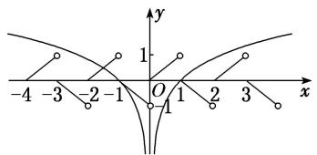

text_image

-4 -3 -2 -1 O 1 2 3 x
y
1
-1

6. 已知函数 $f(x)$ 满足：①定义域为 $\mathbf{R}$ ；② $\forall x \in \mathbf{R}$ ，都有 $f(x + 2) = f(x)$ ；③当 $x \in [-1, 1]$ 时， $f(x) = -|x| + 1$ . 则方程 $f(x) = \frac{1}{2}\log_2 |x|$ 在区间 $[-3, 5]$ 内解的个数是（）

A. 5

B. 6

C. 7

D. 8

6. 答案 A 解析 由 $f(x + 2) = f(x)$ 知函数 $f(x)$ 是周期为 2 的函数，在同一直角坐标系中，画出 $y_{1} = f(x)$ 与 $y_{2} = \frac{1}{2}\log_{2}|x|$ 的图象，如图所示。由图象可得方程解的个数为 5，故选 A.

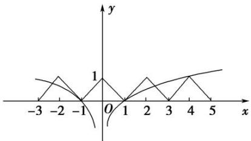

line

| x | y |
|---|---|
| -3 | 0.5 |
| -2 | 0.75 |
| -1 | 0 |
| 0 | 0 |
| 1 | 0.5 |
| 2 | 0.75 |
| 3 | 0.5 |
| 4 | 0.75 |
| 5 | 0.5 |

7. 已知函数 $f(x)$ 是 $\mathbf{R}$ 上最小正周期为 2 的周期函数，且当 $0 \leq x < 2$ 时， $f(x) = x^3 - x$ ，则函数 $y = f(x)$ 的图象在区间[0, 6]上与 $x$ 轴的交点的个数为（）

A. 6

B. 7

C. 8

D. 9

7. 答案 B 解析 当 $0 \leq x < 2$ 时，令 $f(x) = x^3 - x = 0$ ，得 $x = 0$ 或 $x = 1$ 。根据周期函数的性质，由 $f(x)$ 的最小正周期为 2，可知 $y = f(x)$ 在 $[0, 6)$ 上有 6 个零点，又 $f(6) = f(3 \times 2 + 0) = f(0) = 0$ ， $\therefore f(x)$ 在 $[0, 6]$ 上与 $x$ 轴的交点个数为 7。

8. 已知函数 $y = f(x)$ 的周期为 2，当 $x \in [-1, 1]$ 时， $f(x) = x^2$ ，那么函数 $y = f(x)$ 的图象与函数 $y = |\lg x|$ 的图象的交点共有（）

A. 10 个

B. 9 个

C. 8个

D. 1 个

8. 答案 A 解析 在同一平面直角坐标系中分别作出 $y = f(x)$ 和 $y = |\lg x|$ 的图象，如图．又 $\lg 10 = 1$ ，由图象知选 A.

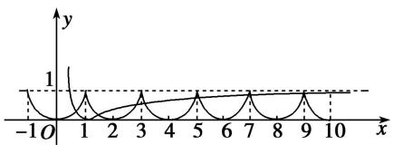

line

| x | y |
|---|---|
| -1 | 0 |
| 0 | 0 |
| 1 | 1 |
| 2 | 0 |
| 3 | 1 |
| 4 | 0 |
| 5 | 1 |
| 6 | 0 |
| 7 | 1 |
| 8 | 0 |
| 9 | 1 |
| 10 | 0 |

9. 设函数 $f(x)$ 的定义域为 $\mathbf{R}$ ， $f(-x) = f(x)$ ， $f(x) = f(2 - x)$ ，当 $x \in [0, 1]$ 时， $f(x) = x^3$ ，则函数 $g(x) = |\cos \pi x| - f(x)$ 在区间 $[- \frac{1}{2}, \frac{3}{2}]$ 上零点的个数为（）

A. 3

B. 4

C. 5

D. 6

9. 答案 C 解析 由 $f(-x) = f(x)$ ，得 $f(x)$ 的图象关于 $y$ 轴对称。由 $f(x) = f(2 - x)$ ，得 $f(x)$ 的图象关于直线 $x = 1$ 对称。当 $x \in [0, 1]$ 时， $f(x) = x^3$ ，所以 $f(x)$ 在 $[-1, 2]$ 上的图象如图。令 $g(x) = |\cos \pi x| - f(x) = 0$ ，得 $|\cos \pi x| = f(x)$ ，两函数 $y = f(x)$ 与 $y = |\cos \pi x|$ 的图象在 $[- \frac{1}{2}, \frac{3}{2}]$ 上的交点有 5 个。

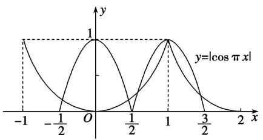

text_image

y
1
y=|cos π x|
-1 -1/2 O 1 1/2 1 3/2 2 x

10. 已知定义在 $\mathbf{R}$ 上的函数 $f(x)$ 满足：①图象关于点(1，0)对称；② $f(-1 + x) = f(-1 - x)$ ；③当 $x \in [-1, 1]$ 时， $f(x) = \begin{cases} 1 - x^2, & x \in [-1, 0], \\ \cos \frac{\pi}{2} x, & x \in 0, 1 \end{cases}$ 则函数 $y = f(x) - \left(\frac{1}{2}\right)^{|x|}$ 在区间 $[-3, 3]$ 上的零点个数为（）

A. 5

B. 6

C. 7

D. 8

10. 答案 A 解析 因为 $f(-1+x)=f(-1-x)$ ，所以函数 $f(x)$ 的图象关于直线 x=-1 对称，又函数 $f(x)$ 的图象关于点 $(1,0)$ 对称，如图所示，画出 $y=f(x)$ 以及 $g(x)=\left(\frac{1}{2}\right)^{|x|}$ 在 $[-3,3]$ 上的图象，由图可知，两函数图象的交点个数为 5，所以函数 $y=f(x)-\left(\frac{1}{2}\right)^{|x|}$ 在区间 $[-3,3]$ 上的零点个数为 5，故选 A.

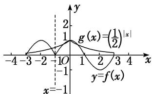

11. 已知定义在 $\mathbf{R}$ 上的偶函数 $f(x)$ 满足 $f(x + 4) = f(x)$ ，且 $x \in [0, 2]$ 时， $f(x) = \sin \pi x + 2 |\sin \pi x|$ ，则方程 $f(x) - |\lg x| = 0$ 在区间[0, 10]上根的个数是（）

A. 17

B. 18

C. 19

D. 20

11. 答案 C 解析 $f(x)=\sin\pi x+2|\sin\pi x|=\left\{\begin{aligned}&3\sin\pi x, &0\leq x\leq1,\\&-\sin\pi x, &1<x\leq2,\end{aligned}\right.$ 由 $f(x+4)=f(x)$ 可知， $f(x)$ 是以 4 为周期的

周期函数．方程 $f(x)-|\lg x|=0$ ，即 $f(x)=|\lg x|$ ，方程的根即为函数 $y=f(x)$ 与 $y=|\lg x|$ 图象交点的横坐标，作出两函数图象如图所示.

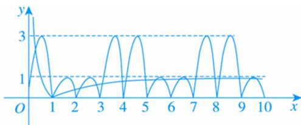

line

| x  | y    |
|----|------|
| 0  | 1.0  |
| 1  | 3.0  |
| 2  | 0.5  |
| 3  | 1.0  |
| 4  | 3.0  |
| 5  | 0.5  |
| 6  | 1.0  |
| 7  | 3.0  |
| 8  | 0.5  |
| 9  | 1.0  |
| 10 | 0.5  |

由图象可知，方程 $f(x)-|\lg x|=0$ 在区间[0, 10]上根的个数是19.

12. 已知函数 $f(x)$ 是定义在 $(- \infty, 0) \cup (0, +\infty)$ 上的偶函数，当 $x > 0$ 时， $f(x) = \begin{cases} 2^{|x-1|}, & 0 < x \leq 2 \\ \frac{1}{2} f(x - 2), & x > 2 \end{cases}$ ，则函数 $g(x) = 4f(x) - 1$ 的零点个数为（）

A. 2

B. 4

C. 6

D. 8

12. 答案 B 解析 函数 $g(x)=4f(x)-1$ 有零点即 $4f(x)-1=0$ 有解，即 $f(x)=\frac{1}{4}$ ，由题意可知，当 $0<x\leq2$ 时， $f(x)=2^{|x-1|}$ ，当 x>2 时， $f(x)=\frac{1}{2}f(x-2)$ ，所以当 $2<x\leq4$ 时， $f(x)=\frac{1}{2}\times2^{|x-3|}$ ，此时 $f(x)$ 的取值范围为 $\left[\frac{1}{2},1\right]$ ；当 $4<x\leq6$ 时， $f(x)=\frac{1}{4}\times2^{|x-5|}$ ，此时 $f(x)$ 的取值范围为 $\left[\frac{1}{4},\frac{1}{2}\right]$ ，x=5 时， $f(5)=\frac{1}{4}$ ；当 $6<x\leq8$ 时， $f(x)=\frac{1}{8}\times2^{|x-7|}$ ，此时 $f(x)$ 的取值范围为 $\left[\frac{1}{8},\frac{1}{4}\right]$ ，x=8 时， $f(8)=\frac{1}{4}$ ；当 $8<x\leq10$ 时， $f(x)=\frac{1}{16}\times2^{|x-9|}$ ，此时 $f(x)$ 的取值范围为 $\left[\frac{1}{16},\frac{1}{8}\right]$ ，所以当 x>0 时， $f(x)=\frac{1}{4}$ 有两解，即当 x>0 时函数 $g(x)=4f(x)-1$ 有两个零点，因为函数 $f(x)$ 是定义在 $(-∞,0)\cup(0,+∞)$ 上的偶函数，所以当 x<0 时， $f(x)=\frac{1}{4}$ 也有两解，所以函数 $g(x)=4f(x)-1$ 共有四个零点，故选 B.

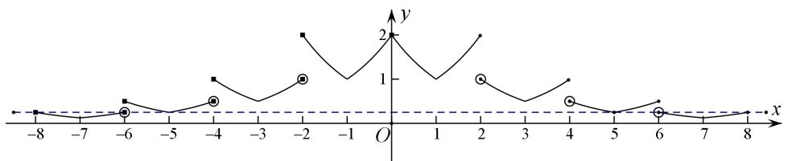

line

| x  | y    |
|----|------|
| -8 | 0.0  |
| -7 | 0.0  |
| -6 | 0.5  |
| -5 | 0.0  |
| -4 | 0.5  |
| -3 | 1.0  |
| -2 | 1.5  |
| -1 | 1.0  |
| 0  | 2.0  |
| 1  | 1.0  |
| 2  | 1.5  |
| 3  | 1.0  |
| 4  | 0.5  |
| 5  | 0.0  |
| 6  | 0.5  |
| 7  | 0.0  |
| 8  | 0.0  |

# 考点二 已知简单函数的零点情况求参数的取值范围

# 【方法总结】

# 已知简单函数的零点情况求参数值或取值范围的方法

(1)直接法: 利用零点存在的判定定理构建不等式求解.  
(2)分离参数法: 分离参数后转化为求函数的值域(最值)问题求解.  
(3)数形结合法：转化为两个熟悉的函数图象的位置关系问题，从而构建不等式求解.

# 【例题选讲】

[例 2] (1) 函数 $f(x)=2^{x}-\frac{2}{x}-a$ 的一个零点在区间 (1, 2) 内，则实数 a 的取值范围是()

A. $(1, 3)$

B. $(1, 2)$

C. $(0, 3)$

D. $(0, 2)$

答案 C 解析 因为函数 $f(x)=2^{x}-\frac{2}{x}-a$ 在区间 $(1,2)$ 上单调递增，又函数 $f(x)=2^{x}-\frac{2}{x}-a$ 的一个零点在区间 $(1,2)$ 内，则有 $f(1)\cdot f(2)<0$ ，所以 $(-a)(4-1-a)<0$ ，即 $a(a-3)<0$ ，所以 0<a<3.

(2)若关于 x 的方程 $2^{2x} + 2^{x}a + a + 1 = 0$ 有实根，则实数 a 的取值范围为 \_\_\_\_.

答案 $(- \infty, 2 - 2\sqrt{2}]$ 解析 由方程，解得 $a = -\frac{2^{2x} + 1}{2^x + 1}$ ，设 $t = 2^x (t > 0)$ ，则 $a = -\frac{t^2 + 1}{t + 1} = -\left(t + \frac{2}{t + 1} - 1\right)$ $= 2 - \left[(t + 1) + \frac{2}{t + 1}\right]$ ，其中 $t + 1 > 1$ ，由基本不等式，得 $(t + 1) + \frac{2}{t + 1} \geq 2\sqrt{2}$ ，当且仅当 $t = \sqrt{2} - 1$ 时取等号，故 $a \leq 2 - 2\sqrt{2}$ .

(3)已知函数 $f(x) = \begin{cases} e^x + a, & x \leq 0, \\ 3x - 1, & x > 0 \end{cases}$ ( $a \in \mathbf{R}$ ), 若函数 $f(x)$ 在 $\mathbf{R}$ 上有两个零点，则 $a$ 的取值范围是()

A. $(-\infty, -1$

B. $(-∞, 1)$

C. $(-1, 0)$

D. $[-1, 0)$

答案 D 解析 (1) 当 $x > 0$ 时, $f(x) = 3x - 1$ 有一个零点 $x = \frac{1}{3}$ . 因此当 $x \leq 0$ 时, $f(x) = e^x + a = 0$ 只有一个实根, $\therefore a = -e^x (x \leq 0)$ , 则 $-1 \leq a < 0$ .

(4)已知函数 $f(x) = \begin{cases} 2x^2 + 2mx - 1, & 0 \leq x \leq 1, \\ mx + 2, & x > 1, \end{cases}$ 若 $f(x)$ 在区间 $[0, +\infty)$ 上有且只有2个零点，则实数 $m$ 的取值范围是 \_\_\_\_.

答案 $-\frac{1}{2} \leq m < 0$ 解析 当 $0 \leq x \leq 1$ 时， $2x^{2} + 2mx - 1 = 0$ ，易知 $x = 0$ 不是方程 $2x^{2} + 2mx - 1 = 0$ 的解，故 $m = \frac{1}{2x} - x$ 在 $(0, 1]$ 上是减函数，故 $m \geq \frac{1}{2} - 1 = -\frac{1}{2}$ ；即 $m \geq -\frac{1}{2}$ 时，方程 $f(x) = 0$ 在 $[0, 1]$ 上有且只有一个解，当 $x > 1$ 时，令 $mx + 2 = 0$ 得， $m = -\frac{2}{x}$ ，故 $-2 < m < 0$ ，即当 $-2 < m < 0$ 时，方程 $f(x) = 0$ 在 $(1, +\infty)$ 上有且只有一个解，综上所述，若 $f(x)$ 在区间 $[0, +\infty)$ 上有且只有 2 个零点，则实数 $m$ 的取值范围是 $-\frac{1}{2} \leq m < 0$ .

(5)(2017·全国III)已知函数 $f(x)=x^{2}-2x+a(e^{x-1}+e^{-x+1})$ 有唯一零点，则 $a=(\quad)$

A. $-\frac{1}{2}$

B. $\frac{1}{3}$

C. $\frac{1}{2}$

D. 1

答案 C 解析 解法一： $f(x)=x^{2}-2x+a(\mathrm{e}^{x-1}+\mathrm{e}^{-x+1})=(x-1)^{2}+a[\mathrm{e}^{x-1}+\mathrm{e}^{-(x-1)}]-1$ ，令 t=x-1，则 $g(t)=f(t+1)=t^{2}+a(\mathrm{e}^{t}+\mathrm{e}^{-t})-1$ ．∵ $g(-t)=(-t)^{2}+a(\mathrm{e}^{-t}+\mathrm{e}^{t})-1=g(t)$ ，∴ 函数 $g(t)$ 为偶函数．∵ $f(x)$ 有唯一零点，∴ $g(t)$ 也有唯一零点．又 $g(t)$ 为偶函数，由偶函数的性质知 $g(0)=0$ ，∴ 2a-1=0，解得 $a=\frac{1}{2}$ ．故选 C.

解法二： $f(x)=0\Leftrightarrow a(\mathrm{e}^{x-1}+\mathrm{e}^{-x+1})=-x^{2}+2x.\mathrm{e}^{x-1}+\mathrm{e}^{-x+1}\geq2\sqrt{\mathrm{e}^{x-1}\cdot\mathrm{e}^{-x+1}}=2$ ，当且仅当x=1时取“=”. $-x^{2}+2x=-(x-1)^{2}+1\leq1$ ，当且仅当x=1时取“=”. 若a>0，则 $a(\mathrm{e}^{x-1}+\mathrm{e}^{-x+1})\geq2a$ ，要使 $f(x)$ 有唯一零点，则必有2a=1，即 $a=\frac{1}{2}$ . 若 $a\leq0$ ，则 $f(x)$ 的零点不唯一．故选C.

(6)若曲线 $y = \log_2(2^x - m)(x > 2)$ 上至少存在一点与直线 $y = x + 1$ 上的一点关于原点对称，则 $m$ 的取值范围为 \_\_\_\_.

答案 (2, 4] 解析 因为直线 $y = x + 1$ 关于原点对称的直线为 $y = x - 1$ ，依题意方程 $\log_2(2^x - m) = x - 1$ 在 $(2, +\infty)$ 上有解，即 $m = 2^{x - 1}$ 在 $x \in (2, +\infty)$ 上有解， $\therefore m > 2$ 。又 $2^x - m > 0$ 恒成立，则 $m \leq (2^x)_{\min} = 4$ ，所以实数 $m$ 的取值范围为 $(2, 4]$ .

# 【对点训练】

13. 设函数 $f(x) = x^3 - 3x$ ，若函数 $g(x) = f(x) + f(t - x)$ 有零点，则实数 $t$ 的取值范围是（）

A. $(-2\sqrt{3}, 2\sqrt{3})$

B. $(- \sqrt{3}, \sqrt{3})$

C. $[-2\sqrt{3}, 2\sqrt{3}]$

D. $[- \sqrt{3}, \sqrt{3}]$

13. 答案 C 解析 由题意， $g(x)=x^{3}-3x+(t-x)^{3}-3(t-x)=3tx^{2}-3t^{2}x+t^{3}-3t$ ，当 t=0 时，显然 $g(x)=0$ 恒成立；当 $t\neq0$ 时，只需 $\Delta=(-3t^{2})^{2}-4\times3t\times(t^{3}-3t)\geq0$ ，化简得 $t^{2}\leq12$ ，即 $-2\sqrt{3}\leq t\leq2\sqrt{3}$ ， $t\neq0$ 。综上可知，实数 t 的取值范围是 $[-2\sqrt{3},2\sqrt{3}]$ 。

14. 若关于 $x$ 的方程 $(\lg a + \lg x) \cdot (\lg a + 2 \lg x) = 4$ 的所有解都大于 1，则实数 $a$ 的取值范围为 \_\_\_\_.

14. 答案 $\left(0, \frac{1}{100}\right)$ 解析 由题意可得 $2(\lg x)^2 + 3(\lg a) \cdot (\lg x) + (\lg a)^2 - 4 = 0$ ，令 $\lg x = t > 0$ ，则有 $2t^2 + 3(\lg x) = 0$ 。

$a) \cdot t + (\lg a)^{2} - 4 = 0$ 的解都是正数，设 $f(t) = 2t^{2} + 3(\lg a) \cdot t + (\lg a)^{2} - 4$ ，则

$\begin{aligned} & \Delta = (3\lg a)^{2} - 8[(\lg a)^{2} - 4] \geq 0, \\ & -\frac{3\lg a}{4} > 0, \\ & f(0) = (\lg a)^{2} - 4 > 0, \end{aligned}$

解得 $\lg a < -2$ ，所以 $0 < a < \frac{1}{100}$ ，所以实数 $a$ 的取值范围是 $\left(0, \frac{1}{100}\right)$ .

15. 函数 $f(x) = 2^{x} - \frac{2}{x} - a$ 的一个零点在区间(1, 2)内，则实数 $a$ 的取值范围是（）

A. $(1, 3)$

B. $(1, 2)$

C. $(0, 3)$

D. $(0, 2)$

15. 答案 C 解析 因为 $f(x)$ 在 $(0, +\infty)$ 上是增函数，则由题意得 $f(1) \cdot f(2) = (0 - a)(3 - a) < 0$ ，解得 0 < a < 3，故选 C.

16. 已知函数 $f(x) = \log_3\frac{x + 2}{x} - a$ 在区间(1, 2)内有零点，则实数 $a$ 的取值范围是（）

A. $(-1, -\log_32)$

B. $(0, \log_52)$

C. $(\log_32, 1)$

D. $(1, \log_34)$

16. 答案 C 解析 $\because$ 函数 $f(x) = \log_3\frac{x + 2}{x} - a$ 在区间(1, 2)内有零点，且 $f(x)$ 在(1, 2)内单调， $\therefore f(1) \cdot f(2) < 0$ ，即 $(1 - a) \cdot (\log_3 2 - a) < 0$ ，解得 $\log_3 2 < a < 1$ .

17. 若函数 $f(x) = x^2 - ax + 1$ 在区间 $\left[\frac{1}{2}, 3\right]$ 上有零点，则实数 $a$ 的取值范围是（）

A. $(2, +\infty)$

B. $[2, +\infty)$

C. $\left[2,\frac{5}{2}\right]$

D. $\left[2,\frac{10}{3}\right]$

17. 答案 D 解析 由题意知方程 $ax = x^2 + 1$ 在 $\left(\frac{1}{2}, 3\right)$ 上有实数解，即 $a = x + \frac{1}{x}$ 在 $\left(\frac{1}{2}, 3\right)$ 上有解，设 $t = x + \frac{1}{x}$ ， $x \in \left(\frac{1}{2}, 3\right)$ ，则 $t$ 的取值范围是 $\left[2, \frac{10}{3}\right]$ . 所以实数 $a$ 的取值范围是 $\left[2, \frac{10}{3}\right]$ .

18. 若函数 $f(x) = 4^x - 2^x - a$ ， $x \in [-1, 1]$ 有零点，则实数 $a$ 的取值范围是 \_\_\_\_.

18. 答案 $\left[-\frac{1}{4}, 2\right]$ 解析 因为函数 $f(x) = 4^x - 2^x - a, x \in [-1, 1]$ 有零点，所以方程 $4^x - 2^x - a = 0$ 在 $[-1, 1]$ 上有解，即方程 $a = 4^x - 2^x$ 在 $[-1, 1]$ 上有解。方程 $a = 4^x - 2^x$ 可变形为 $a = \left(2^x - \frac{1}{2}\right)^2 - \frac{1}{4}$ ，因为 $x \in [-1, 1]$ ，所以 $2^x \in \left[\frac{1}{2}, 2\right]$ ，所以 $\left(2^x - \frac{1}{2}\right)^2 - \frac{1}{4} \in \left[-\frac{1}{4}, 2\right]$ 。所以实数 $a$ 的取值范围是 $\left[-\frac{1}{4}, 2\right]$ .

19. 已知函数 $f(x) = \begin{cases} 1, & x \leq 0, \\ \frac{1}{x}, & x > 0, \end{cases}$ ，则使方程 $x + f(x) = m$ 有解的实数 $m$ 的取值范围是（）

A. $(1, 2)$

B. $(-∞,-2]$

C. $(-\infty, 1) \cup (2, +\infty)$

D. $(-\infty, 1] \cup [2, +\infty)$

19. 答案 D 解析 当 $x \leq 0$ 时, $x + f(x) = m$ , 即 $x + 1 = m$ , 解得 $m \leq 1$ ; 当 $x > 0$ 时, $x + f(x) = m$ , 即 $x + \frac{1}{x} = m$ , 解得 $m \geq 2$ , 即实数 $m$ 的取值范围是 $(- \infty, 1] \cup [2, + \infty)$ .

20. 若函数 $f(x) = \begin{cases} 2^x - a, & x \leq 0, \\ \ln x, & x > 0 \end{cases}$ 有两个不同的零点，则实数 $a$ 的取值范围是 \_\_\_\_.

20. 答案 (0, 1] 解析 当 $x > 0$ 时，由 $f(x) = \ln x = 0$ ，得 $x = 1$ 。因为函数 $f(x)$ 有两个不同的零点，则当 $x \leq 0$ 时，函数 $f(x) = 2^{x} - a$ 有一个零点，令 $f(x) = 0$ 得 $a = 2^{x}$ ，因为 $0 < 2^{x} \leq 2^{0} = 1$ ，所以 $0 < a \leq 1$ ，所以实数 $a$ 的取值范围是 $0 < a \leq 1$ .

21. 已知函数 $f(x) = \begin{cases} \mathrm{e}^x - a, & x \leq 0, \\ 2x - a, & x > 0, \end{cases}$ ( $a \in \mathbf{R}$ ), 若函数 $f(x)$ 在 $\mathbf{R}$ 上有两个零点，则实数 $a$ 的取值范围是（）

A. $(0, 1]$

B. $[1, +\infty)$

C. $(0, 1)$

D. $(-\infty, 1]$

21. 答案 A 解析 由于 $x \leq 0$ 时, $f(x) = \mathrm{e}^{x} - a$ 在 $(- \infty, 0]$ 上单调递增, $x > 0$ 时, $f(x) = 2x - a$ 在 $(0, +\infty)$ 上也单调递增, 而函数 $f(x)$ 在 $\mathbf{R}$ 上有两个零点, 所以当 $x \leq 0$ 时, $f(x) = \mathrm{e}^{x} - a$ 在 $(- \infty, 0]$ 上有一个零点, 即 $\mathrm{e}^{x} = a$ 有一个根. 因为 $x \leq 0$ , $0 < \mathrm{e}^{x} \leq 1$ , 所以 $0 < a \leq 1$ . 当 $x > 0$ 时, $f(x) = 2x - a$ 在 $(0, +\infty)$ 上有一个零点, 即 $2x = a$ 有一个根. 因为 $x > 0$ , $2x > 0$ , 所以 $a > 0$ . 所以函数 $f(x)$ 在 $\mathbf{R}$ 上有两个零点, 则实数 $a$ 的取值范围是 $(0, 1]$ , 故选 A.

22. 函数 $f(x) = \begin{cases} |x^2 + 2x - 1| & x \leq 0 \\ 2^{x - 1} + a & x > 0 \end{cases}$ 有两个不同的零点，则实数 $a$ 的取值范围为 \_\_\_\_.

22. 答案 $\left(-\infty, -\frac{1}{2}\right)$ 解析 由于当 $x \leq 0$ 时， $f(x) = |x^{2} + 2x - 1|$ 的图象与 x 轴只有 1 个交点，即只有 1 个零点，故由题意只需方程 $2^{x-1} + a = 0$ 有 1 个正根即可，变形为 $2^{x} = -2a$ ，结合图形只需 $-2a > 1 \Rightarrow a < -\frac{1}{2}$ 即可.

23. 方程 $\log_{\frac{1}{2}} (a - 2^x) = 2 + x$ 有解，则 $a$ 的最小值为 \_\_\_\_.

23. 答案 1 解析 若方程 $\log_{\frac{1}{2}} (a - 2^x) = 2 + x$ 有解，则 $(\frac{1}{2})^{2 + x} = a - 2^x$ 有解，即 $\frac{1}{4} (\frac{1}{2})^x + 2^x = a$ 有解，因为 $\frac{1}{4} (\frac{1}{2})^x + 2^x \geq 1$ ，故 $a$ 的最小值为 1.

24. 设函数 $f(x) = \log_2(2^x + 1)$ ， $g(x) = \log_2(2^x - 1)$ ，若关于 $x$ 的函数 $F(x) = g(x) - f(x) - m$ 在[1, 2]上有零点，则 $m$ 的取值范围为 \_\_\_\_.

24. 答案 $\left[\log_2\frac{1}{3}, \log_2\frac{3}{5}\right]$ 解析 令 $F(x)=0$ ，即 $g(x)-f(x)-m=0$ 。所以 $m=g(x)-f(x)=\log_2(2^x-1)-\log_2(2^x+1)=\log_2\frac{2^x-1}{2^x+1}=\log_2\left(1-\frac{2}{2^x+1}\right)$ 。因为 $1\leq x\leq 2$ ，所以 $3\leq 2^x+1\leq 5$ 。所以 $\frac{2}{5}\leq \frac{2}{2^x+1}\leq \frac{2}{3}, \frac{1}{3}\leq 1-\frac{2}{2^x+1}\leq \frac{3}{5}$ 。所以 $\log_2\frac{1}{3}\leq \log_2\left(1-\frac{2}{2^x+1}\right)\leq \log_2\frac{3}{5}$ ，即 $\log_2\frac{1}{3}\leq m\leq \log_2\frac{3}{5}$ 。所以 $m$ 的取值范围是 $\left[\log_2\frac{1}{3}, \log_2\frac{3}{5}\right]$ 。

