专题十五　函数的零点问题（2）

考点一　复杂函数(方程)零点(解)的个数判断

【方法总结】

复杂函数(方程)的零点的个数(方程的解)的判断多采用数形结合法：对于给定的函数不能直接求解或画出图象的，常分解转化为两个能画出图象的函数的交点问题．即将函数*y*＝*f*(*x*)－*g*(*x*)的零点个数转化为函数*y*＝*f*(*x*)与*y*＝*g*(*x*)图象公共点的个数来判断．但其中一个函数往往比较复杂，可能涉及到函数的奇偶性周期性等函数的性质，需要有强大的画图能力．

【例题选讲】

<strong>[例1]</strong>　（1）已知<em>f</em>(<em>x</em>)是定义在<strong>R</strong>上的奇函数，且<em>x</em>&gt;0时，<em>f</em>(<em>x</em>)＝ln <em>x</em>－<em>x</em>＋1，则函数<em>g</em>(<em>x</em>)＝<em>f</em>(<em>x</em>)－e<em>x</em>(e为自然对数的底数)的零点个数是(　　)

A．0　　　　　　　　
B．1　　　　　　　　
C．2　　　　　　　　
D．3

<strong>答案</strong>　C　<strong>解析</strong>　当<em>x</em>&gt;0时，<em>f</em>(<em>x</em>)＝ln <em>x</em>－<em>x</em>＋1，<em>f</em>′(<em>x</em>)＝－1＝，所以<em>x</em>∈(0，1)时<em>f</em>′(<em>x</em>)&gt;0，此时<em>f</em>(<em>x</em>)单调递增；<em>x</em>∈(1，＋∞)时，<em>f</em>′(<em>x</em>)&lt;0，此时<em>f</em>(<em>x</em>)单调递减．因此，当<em>x</em>&gt;0时，<em>f</em>(<em>x</em>)max＝<em>f</em>（1）＝ln 1－1＋1＝0.根据函数<em>f</em>(<em>x</em>)是定义在<strong>R</strong>上的奇函数作出函数<em>y</em>＝<em>f</em>(<em>x</em>)与<em>y</em>＝e<em>x</em>的大致图象如图所示，观察到函数<em>y</em>＝<em>f</em>(<em>x</em>)与<em>y</em>＝e<em>x</em>的图象有两个交点，所以函数<em>g</em>(<em>x</em>)＝<em>f</em>(<em>x</em>)－e<em>x</em>(e为自然对数的底数)有2个零点．

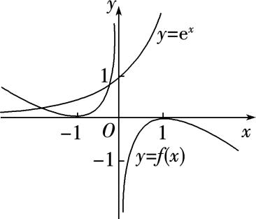  
（2）已知函数<em>y</em>＝<em>f</em>(<em>x</em>)是周期为2的周期函数，且当<em>x</em>∈[－1，1]时，<em>f</em>(<em>x</em>)＝2|<em>x</em>|－1，则函数<em>F</em>(<em>x</em>)＝<em>f</em>(<em>x</em>)－|lg <em>x</em>|的零点个数是(　　)

A．9　　　　　　　　
B．10　　　　　　　　
C．11　　　　　　　　
D．18
答案　<strong>B</strong>　解析　在坐标平面内画出<em>y</em>＝<em>f</em>(<em>x</em>)与<em>y</em>＝|lg <em>x</em>|的大致图象如图，由图象可知，它们共有10个不同的交点，因此函数<em>F</em>(<em>x</em>)＝<em>f</em>(<em>x</em>)－|lg <em>x</em>|的零点个数是10．

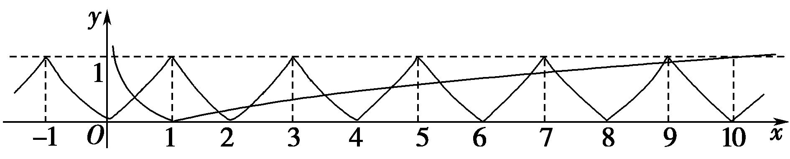

  
（3）设函数<em>f</em>(<em>x</em>)是定义在<strong>R</strong>上的偶函数，且<em>f</em>(<em>x</em>＋2)＝<em>f</em>(2－<em>x</em>)，当<em>x</em>∈[－2，0]时，<em>f</em>(<em>x</em>)＝－1，则在区间(－2，6)上关于<em>x</em>的方程<em>f</em>(<em>x</em>)－log8(<em>x</em>＋2)＝0的解的个数为(　　)

A．1　　　　　　　　
B．2　　　　　　　　
C．3　　　　　　　　
D．4
答案　C　解析　原方程等价于<em>y</em>＝<em>f</em>(<em>x</em>)与<em>y</em>＝log8(<em>x</em>＋2)的图象的交点个数问题，由<em>f</em>(<em>x</em>＋2)＝<em>f</em>(2－<em>x</em>)，可知<em>f</em>(<em>x</em>)的图象关于<em>x</em>＝2对称，再根据<em>f</em>(<em>x</em>)是偶函数这一性质，可由<em>f</em>(<em>x</em>)在[－2，0]上的解析式，作出<em>f</em>(<em>x</em>)在(0，2)上的图象，进而作出<em>f</em>(<em>x</em>)在(－2，6)上的图象，如图所示．

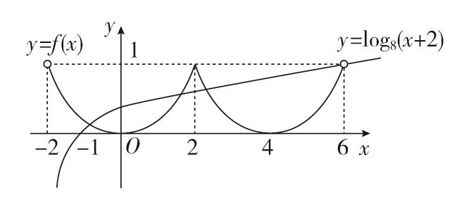
再在同一坐标系下，画出<em>y</em>＝log8(<em>x</em>＋2)的图象，注意其图象过点(6，1)，由图可知，两图象在区间(－2，6)内有三个交点，从而原方程有三个根，故选C．  
（4）定义在<strong>R</strong>上的函数<em>f</em>(<em>x</em>)，满足<em>f</em>(<em>x</em>)＝且<em>f</em>(<em>x</em>＋1)＝<em>f</em>(<em>x</em>－1)，若<em>g</em>(<em>x</em>)＝3－log2<em>x</em>，则函数<em>F</em>(<em>x</em>)＝<em>f</em>(<em>x</em>)－<em>g</em>(<em>x</em>)在(0，＋∞)内的零点有(　　)

A．3个　　　　　　　　
B．2个　　　　　　　　
C．1个　　　　　　　　
D．0个
答案　B　解析　由*f*(*x*＋1)＝*f*(*x*－1)，即*f*(*x*＋2)＝*f*(*x*)，知*y*＝*f*(*x*)的周期*T*＝2．在同一坐标系中作出*y*＝*f*(*x*)与*y*＝*g*(*x*)的图象(如图)．由于两函数图象有2个交点．所以函数*F*(*x*)＝*f*(*x*)－*g*(*x*)在(0，＋∞)内有2个零点．

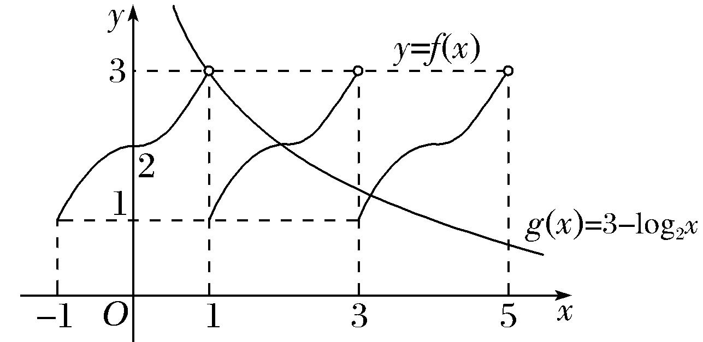  
（5）若函数*f*(*x*)的图象上存在两个不同点*A*，*B*关于原点对称，则称*A*，*B*两点为一对“优美点”，记作(*A*，*B*)，规定(*A*，*B*)和(*B*，*A*)是同一对“优美点”．已知*f*(*x*)＝则函数*f*(*x*)的图象上共存在“优美点”(　　)

A．14对　　　　　　　　
B．3对　　　　　　　　
C．5对　　　　　　　　
D．7对
答案　D　解析　与*y*＝－lg (－*x*)的图象关于原点对称的函数是*y*＝lg *x*，函数*f*(*x*)的图象上的优美点的对数，即方程|cos*x*|＝lg *x*(*x*>0)的解的个数，也是函数*y*＝|cos*x*|与*y*＝lg *x*的图象的交点个数，如图，作函数*y*＝|cos*x*|与*y*＝lg *x*的图象，由图可知，共有7个交点，函数*f*(*x*)的图象上存在“优美点”共有7对．故选D．

【对点训练】

1．已知<em>f</em>(<em>x</em>)是定义在<strong>R</strong>上的奇函数，当<em>x</em>≥0时，<em>f</em>(<em>x</em>)＝<em>x</em>2－3<em>x</em>，则函数<em>g</em>(<em>x</em>)＝<em>f</em>(<em>x</em>)－<em>x</em>＋3的零点的集合为(　　)

A．{1，3}　　　　
B．{－3，－1，1，3}　　　　
C．{2－，1，3}　　　　
D．{－2－，1，3}

1．<strong>答案</strong>　D　<strong>解析</strong>　求出当<em>x</em>＜0时<em>f</em>(<em>x</em>)的解析式，分类讨论解方程即可．令<em>x</em>＜0，则－<em>x</em>＞0，所以<em>f</em>(－

<em>x</em>)＝(－<em>x</em>)2＋3<em>x</em>＝<em>x</em>2＋3<em>x</em>．因为<em>f</em>(<em>x</em>)是定义在<strong>R</strong>上的奇函数，所以<em>f</em>(－<em>x</em>)＝－<em>f</em>(<em>x</em>)．所以当<em>x</em>＜0时，<em>f</em>(<em>x</em>)＝－<em>x</em>2－3<em>x</em>．所以当<em>x</em>≥0时，<em>g</em>(<em>x</em>)＝<em>x</em>2－4<em>x</em>＋3．令<em>g</em>(<em>x</em>)＝0，即<em>x</em>2－4<em>x</em>＋3＝0，解得<em>x</em>＝1或<em>x</em>＝3．当<em>x</em>＜0时，<em>g</em>(<em>x</em>)＝－<em>x</em>2－4<em>x</em>＋3．令<em>g</em>(<em>x</em>)＝0，即<em>x</em>2＋4<em>x</em>－3＝0，解得<em>x</em>＝－2＋＞0(舍去)或<em>x</em>＝－2－．所以函数<em>g</em>(<em>x</em>)有三个零点，故其集合为{－2－，1，3}．

2．<em>f</em>(<em>x</em>)是定义在<strong>R</strong>上的奇函数，且当<em>x</em>∈(0，＋∞)时，<em>f</em>(<em>x</em>)＝2 020<em>x</em>＋log2 020<em>x</em>，则函数<em>f</em>(<em>x</em>)的零点个数是

\_\_\_\_\_\_\_\_\_\_．

2．答案　3　解析　结合函数的图象，可知函数<em>y</em>＝2 020<em>x</em>和函数<em>y</em>＝－log2 020<em>x</em>的图象在第一象限有一个

交点，所以函数*f*(*x*)有一个正的零点，根据奇函数图象的对称性，有一个负的零点，还有零，所以函数有三个零点．

3．已知函数*f*(*x*)是偶函数，*f*（0）＝0，且*x*>0时，*f*(*x*)是增函数，*f*（3）＝0，则函数*g*(*x*)＝*f*(*x*)＋lg|*x*＋1|的零点

个数为\_\_\_\_\_\_\_\_．

3．答案　3　解析　画出函数*y*＝*f*(*x*)和*y*＝－lg|*x*＋1|的大致图象，如图所示．∴由图象知，函数*g*(*x*)＝*f*(*x*)

＋lg|*x*＋1|的零点的个数为3．

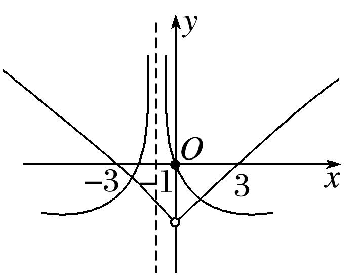

4．若定义在<strong>R</strong>上的偶函数<em>f</em>(<em>x</em>)满足<em>f</em>(<em>x</em>＋2)＝<em>f</em>(<em>x</em>)，且<em>x</em>∈[0，1]时，<em>f</em>(<em>x</em>)＝<em>x</em>，则方程<em>f</em>(<em>x</em>)＝log3|<em>x</em>|的零点个

数是(　　)

A．2　　　　　　　　
B．3　　　　　　　
C．4　　　　　　　　
D．多于4

4．答案　C　解析　由*f*(*x*＋2)＝*f*(*x*)，知函数*f*(*x*)是周期为2的周期函数，且是偶函数，在同一坐标系中

画出<em>y</em>＝log3|<em>x</em>|和<em>y</em>＝<em>f</em>(<em>x</em>)，<em>x</em>∈[－3，3]的图象，如图所示，由图可知零点个数为4.

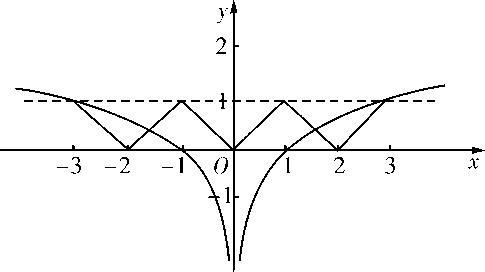

5．已知定义在<strong>R</strong>上的函数<em>y</em>＝<em>f</em>(<em>x</em>)对任意的<em>x</em>都满足<em>f</em>(<em>x</em>＋1)＝－<em>f</em>(<em>x</em>)，且当0≤<em>x</em>&lt;1时，<em>f</em>(<em>x</em>)＝<em>x</em>，则函数<em>g</em>(<em>x</em>)

＝*f*(*x*)－ln|*x*|的零点个数为(　　)

A．2　　　　　　　　
B．3　　　　　　　　
C．4　　　　　　　　
D．5

5．答案　B　解析　依题意，可知函数*g*(*x*)＝*f*(*x*)－ln|*x*|的零点个数即为函数*y*＝*f*(*x*)的图象与函数*y*＝ln|*x*|

的图象的交点个数．设－1≤*x*<0，则0≤*x*＋1<1，此时有*f*(*x*)＝－*f*(*x*＋1)＝－(*x*＋1)，又由*f*(*x*＋1)＝－*f*(*x*)，得*f*(*x*＋2)＝－*f*(*x*＋1)＝*f*(*x*)，即函数*f*(*x*)以2为周期的周期函数．而*y*＝ln|*x*|＝在同一坐标系中作出函数*y*＝*f*(*x*)的图象与*y*＝ln|*x*|的图象如图所示，由图可知，两图象有3个交点，即函数*g*(*x*)＝*f*(*x*)－ln|*x*|有3个零点，故选B．

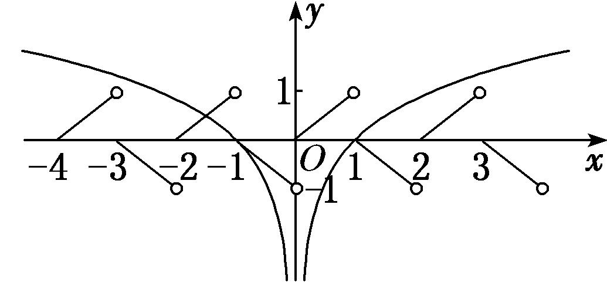

6．已知函数<em>f</em>(<em>x</em>)满足：①定义域为<strong>R</strong>；②∀<em>x</em>∈<strong>R</strong>，都有<em>f</em>(<em>x</em>＋2)＝<em>f</em>(<em>x</em>)；③当<em>x</em>∈[－1，1]时，<em>f</em>(<em>x</em>)＝－|<em>x</em>|＋1．则

方程<em>f</em>(<em>x</em>)＝log2|<em>x</em>|在区间[－3，5]内解的个数是(　　)

A．5　　　　　　　　　
B．6　　　　　　　　　
C．7　　　　　　　　　
D．8

6．答案　<strong>A</strong>　解析　由<em>f</em>(<em>x</em>＋2)＝<em>f</em>(<em>x</em>)知函数<em>f</em>(<em>x</em>)是周期为2的函数，在同一直角坐标系中，画出<em>y</em>1＝<em>f</em>(<em>x</em>)

与<em>y</em>2＝log2|<em>x</em>|的图象，如图所示．由图象可得方程解的个数为5，故选A．

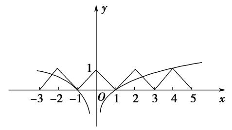

7．已知函数<em>f</em>(<em>x</em>)是<strong>R</strong>上最小正周期为2的周期函数，且当0≤<em>x</em>&lt;2时，<em>f</em>(<em>x</em>)＝<em>x</em>3－<em>x</em>，则函数<em>y</em>＝<em>f</em>(<em>x</em>)的图象
在区间[0，6]上与*x*轴的交点的个数为(　　)

A．6　　　　　　　　
B．7　　　　　　　　
C．8　　　　　　　　
D．9

7．<strong>答案</strong>　B　<strong>解析</strong>　当0≤<em>x</em>&lt;2时，令<em>f</em>(<em>x</em>)＝<em>x</em>3－<em>x</em>＝0，得<em>x</em>＝0或<em>x</em>＝1．根据周期函数的性质，由<em>f</em>(<em>x</em>)的最

小正周期为2，可知*y*＝*f*(*x*)在[0，6)上有6个零点，又*f*（6）＝*f*(3×2＋0)＝*f*（0）＝0，∴*f*(*x*)在[0，6]上与*x*

轴的交点个数为7．

8．已知函数<em>y</em>＝<em>f</em>(<em>x</em>)的周期为2，当<em>x</em>∈[－1，1]时，<em>f</em>(<em>x</em>)＝<em>x</em>2，那么函数<em>y</em>＝<em>f</em>(<em>x</em>)的图象与函数<em>y</em>＝|lg <em>x</em>|的图

象的交点共有(　　)

A．10个　　　　　　　　
B．9个　　　　　　　　
C．8个　　　　　　　　
D．1个

8．<strong>答案</strong>　A　<strong>解析</strong>　在同一平面直角坐标系中分别作出<em>y</em>＝<em>f</em>(<em>x</em>)和<em>y</em>＝|lg <em>x</em>|的图象，如图．又lg 10＝1，由

图象知选A．

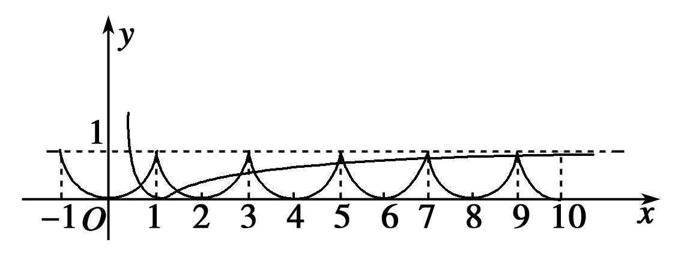

9．设函数<em>f</em>(<em>x</em>)的定义域为<strong>R</strong>，<em>f</em>(－<em>x</em>)＝<em>f</em>(<em>x</em>)，<em>f</em>(<em>x</em>)＝<em>f</em>(2－<em>x</em>)，当<em>x</em>∈[0，1]时，<em>f</em>(<em>x</em>)＝<em>x</em>3，则函数<em>g</em>(<em>x</em>)＝|cosπ<em>x</em>|

－*f*(*x*)在区间[－，]上零点的个数为(　　)

A．3　　　　　　　　
B．4　　　　　　　　
C．5　　　　　　　　
D．6

9．<strong>答案</strong>　C　<strong>解析</strong>　由<em>f</em>(－<em>x</em>)＝<em>f</em>(<em>x</em>)，得<em>f</em>(<em>x</em>)的图象关于<em>y</em>轴对称．由<em>f</em>(<em>x</em>)＝<em>f</em>(2－<em>x</em>)，得<em>f</em>(<em>x</em>)的图象关于直

线<em>x</em>＝1对称．当<em>x</em>∈[0，1]时，<em>f</em>(<em>x</em>)＝<em>x</em>3，所以<em>f</em>(<em>x</em>)在[－1，2]上的图象如图．令<em>g</em>(<em>x</em>)＝|cosπ<em>x</em>|－<em>f</em>(<em>x</em>)＝0，得|cosπ<em>x</em>|＝<em>f</em>(<em>x</em>)，两函数<em>y</em>＝<em>f</em>(<em>x</em>)与<em>y</em>＝|cosπ<em>x</em>|的图象在[－，]上的交点有5个．

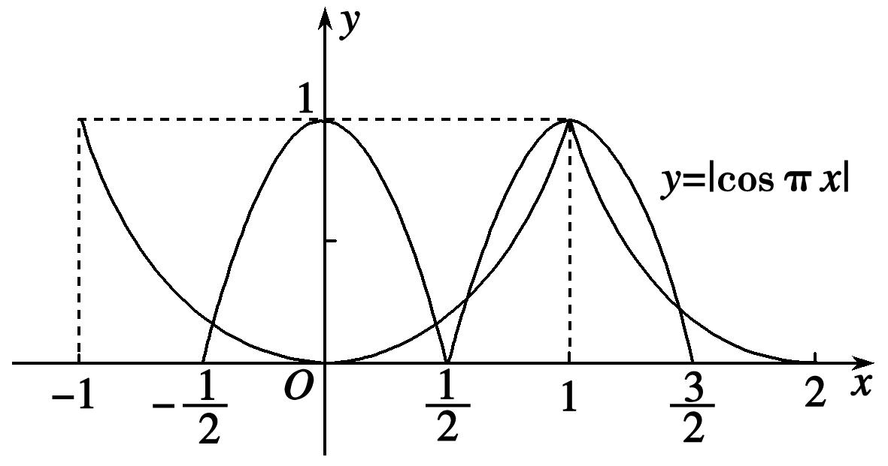

10．已知定义在<strong>R</strong>上的函数<em>f</em>(<em>x</em>)满足：①图象关于点(1，0)对称；②<em>f</em>(－1＋<em>x</em>)＝<em>f</em>(－1－<em>x</em>)；③当<em>x</em>∈[－1，

1]时，<em>f</em>(<em>x</em>)＝则函数<em>y</em>＝<em>f</em>(<em>x</em>)－|<em>x</em>|在区间[－3，3]上的零点个数为(　　)

A．5　　　　　　　　
B．6　　　　　　　　
C．7　　　　　　　　
D．8

10．答案　A　解析　因为*f*(－1＋*x*)＝*f*(－1－*x*)，所以函数*f*(*x*)的图象关于直线*x*＝－1对称，又函数*f*(*x*)

的图象关于点(1，0)对称，如图所示，画出<em>y</em>＝<em>f</em>(<em>x</em>)以及<em>g</em>(<em>x</em>)＝|<em>x</em>|在[－3，3]上的图象，由图可知，两函数图象的交点个数为5，所以函数<em>y</em>＝<em>f</em>(<em>x</em>)－|<em>x</em>|在区间[－3，3]上的零点个数为5，故选A．

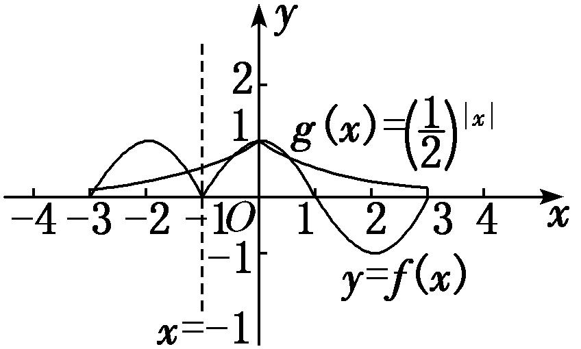

11．已知定义在<strong>R</strong>上的偶函数<em>f</em>(<em>x</em>)满足<em>f</em>(<em>x</em>＋4)＝<em>f</em>(<em>x</em>)，且<em>x</em>∈[0，2]时，<em>f</em>(<em>x</em>)＝sinπ<em>x</em>＋2|sinπ<em>x</em>|，则方程<em>f</em>(<em>x</em>)－

|lg*x*|＝0在区间[0，10]上根的个数是(　　)

A．17　　　　　　　　
B．18　　　　　　　　
C．19　　　　　　　　
D．20

11．<strong>答案</strong>　C　<strong>解析</strong>　<em>f</em>(<em>x</em>)＝sinπ<em>x</em>＋2|sinπ<em>x</em>|＝由<em>f</em>(<em>x</em>＋4)＝<em>f</em>(<em>x</em>)可知，<em>f</em>(<em>x</em>)是以4为周期的

周期函数．方程*f*(*x*)－|lg*x*|＝0，即*f*(*x*)＝|lg*x*|，方程的根即为函数*y*＝*f*(*x*)与*y*＝|lg*x*|图象交点的横坐标，作出两函数图象如图所示．

由图象可知，方程*f*(*x*)－|lg*x*|＝0在区间[0，10]上根的个数是19．

12．已知函数*f*(*x*)是定义在(－∞，0)∪(0，＋∞)上的偶函数，当*x*>0时，*f*(*x*)＝，则函数

*g*(*x*)＝4*f*(*x*)－1的零点个数为(　　)

A．2　　　　　　　　
B．4　　　　　　　　
C．6　　　　　　　　
D．8

12．答案　B　解析　函数*g*(*x*)＝4*f*(*x*)－1有零点即4*f*(*x*)－1＝0有解，即*f*(*x*)＝，由题意可知，当0<*x*≤2

时，<em>f</em>(<em>x</em>)＝2|<em>x</em>－1|，当<em>x</em>&gt;2时，<em>f</em>(<em>x</em>)＝<em>f</em>(<em>x</em>－2)，所以当2&lt;<em>x</em>≤4时，<em>f</em>(<em>x</em>)＝×2|<em>x</em>－3|，此时<em>f</em>(<em>x</em>)的取值范围为；当4&lt;<em>x</em>≤6时，<em>f</em>(<em>x</em>)＝×2|<em>x</em>－5|，此时<em>f</em>(<em>x</em>)的取值范围为，<em>x</em>＝5时，<em>f</em>（5）＝；当6&lt;<em>x</em>≤8时，<em>f</em>(<em>x</em>)＝×2|<em>x</em>－7|，此时<em>f</em>(<em>x</em>)的取值范围为，<em>x</em>＝8时，<em>f</em>（8）＝；当8&lt;<em>x</em>≤10时，<em>f</em>(<em>x</em>)＝×2|<em>x</em>－9|，此时<em>f</em>(<em>x</em>)的取值范围为，所以当<em>x</em>&gt;0时，<em>f</em>(<em>x</em>)＝有两解，即当<em>x</em>&gt;0时函数<em>g</em>(<em>x</em>)＝4<em>f</em>(<em>x</em>)－1有两个零点，因为函数<em>f</em>(<em>x</em>)是定义在(－∞，0)∪(0，＋∞)上的偶函数，所以当<em>x</em>&lt;0时，<em>f</em>(<em>x</em>)＝也有两解，所以函数<em>g</em>(<em>x</em>)＝4<em>f</em>(<em>x</em>)－1共有四个零点，故选B．

考点二　已知简单函数的零点情况求参数的取值范围

【方法总结】

已知简单函数的零点情况求参数值或取值范围的方法  
（1）直接法：利用零点存在的判定定理构建不等式求解．  
（2）分离参数法：分离参数后转化为求函数的值域(最值)问题求解．  
（3）数形结合法：转化为两个熟悉的函数图象的位置关系问题，从而构建不等式求解．

【例题选讲】

<strong>[例2]</strong> （1）函数<em>f</em>(<em>x</em>)＝2<em>x</em>－－<em>a</em>的一个零点在区间(1，2)内，则实数<em>a</em>的取值范围是(　　)

A．(1，3) 　　　　　　　
B．(1，2) 　　　　　　　
C．(0，3) 　　　　　　　
D．(0，2)
答案　C　解析　因为函数<em>f</em>(<em>x</em>)＝2<em>x</em>－－<em>a</em>在区间(1，2)上单调递增，又函数<em>f</em>(<em>x</em>)＝2<em>x</em>－－<em>a</em>的一个零点在区间(1，2)内，则有<em>f</em>（1）·<em>f</em>（2）&lt;0，所以(－<em>a</em>)(4－1－<em>a</em>)&lt;0，即<em>a</em>(<em>a</em>－3)&lt;0，所以0&lt;<em>a</em>&lt;3．  
（2）若关于<em>x</em>的方程22<em>x</em>＋2<em>xa</em>＋<em>a</em>＋1＝0有实根，则实数<em>a</em>的取值范围为________．
答案　(－∞，2－2]　解析　由方程，解得<em>a</em>＝－，设<em>t</em>＝2<em>x</em>(<em>t</em>&gt;0)，则<em>a</em>＝－＝－＝2－，其中<em>t</em>＋1&gt;1，由基本不等式，得(<em>t</em>＋1)＋≥2，当且仅当<em>t</em>＝－1时取等号，故<em>a</em>≤2－2．  
（3）已知函数<em>f</em>(<em>x</em>)＝(<em>a</em>∈<strong>R</strong>)，若函数<em>f</em>(<em>x</em>)在<strong>R</strong>上有两个零点，则<em>a</em>的取值范围是(　　)

A．(－∞，－1　　　　　
B．(－∞，1)　　　　　
C．(－1，0) 　　　　　
D．[－1，0)
答案　D　解析　（1）当<em>x</em>&gt;0时，<em>f</em>(<em>x</em>)＝3<em>x</em>－1有一个零点<em>x</em>＝．因此当<em>x</em>≤0时，<em>f</em>(<em>x</em>)＝e<em>x</em>＋<em>a</em>＝0只有一个实根，∴<em>a</em>＝－e<em>x</em>(<em>x</em>≤0)，则－1≤<em>a</em>&lt;0．  
（4）已知函数*f*(*x*)＝若*f*(*x*)在区间[0，＋∞)上有且只有2个零点，则实数*m*的取值范围是\_\_\_\_\_\_\_\_．
答案　－≤<em>m</em>&lt;0　解析　当0≤<em>x</em>≤1时，2<em>x</em>2＋2<em>mx</em>－1＝0，易知<em>x</em>＝0不是方程2<em>x</em>2＋2<em>mx</em>－1＝0的解，故<em>m</em>＝－<em>x</em>在(0，1]上是减函数，故<em>m</em>≥－1＝－；即<em>m</em>≥－时，方程<em>f</em>(<em>x</em>)＝0在[0，1]上有且只有一个解，当<em>x</em>&gt;1时，令<em>mx</em>＋2＝0得，<em>m</em>＝－，故－2&lt;<em>m</em>&lt;0，即当－2&lt;<em>m</em>&lt;0时，方程<em>f</em>(<em>x</em>)＝0在(1，＋∞)上有且只有一个解，综上所述，若<em>f</em>(<em>x</em>)在区间[0，＋∞)上有且只有2个零点，则实数<em>m</em>的取值范围是－≤<em>m</em>&lt;0．  
（5）(2017·全国Ⅲ)已知函数<em>f</em>(<em>x</em>)＝<em>x</em>2－2<em>x</em>＋<em>a</em>(e<em>x</em>－1＋e－<em>x</em>＋1)有唯一零点，则<em>a</em>＝(　　)

A．－　　　　　　　　
B．　　　　　　　　
C．　　　　　　　　
D．1
答案　C　解析　解法一：<em>f</em>(<em>x</em>)＝<em>x</em>2－2<em>x</em>＋<em>a</em>(e<em>x</em>－1＋e－<em>x</em>＋1)＝(<em>x</em>－1)2＋<em>a</em>[e<em>x</em>－1＋e－(<em>x</em>－1)]－1，令<em>t</em>＝<em>x</em>－1，则<em>g</em>(<em>t</em>)＝<em>f</em>(<em>t</em>＋1)＝<em>t</em>2＋<em>a</em>－1．∵<em>g</em>(－<em>t</em>)＝(－<em>t</em>)2＋<em>a</em>(e－<em>t</em>＋e<em>t</em>)－1＝<em>g</em>(<em>t</em>)，∴函数<em>g</em>(<em>t</em>)为偶函数．∵<em>f</em>(<em>x</em>)有唯一零点，∴<em>g</em>(<em>t</em>)也有唯一零点．又<em>g</em>(<em>t</em>)为偶函数，由偶函数的性质知<em>g</em>（0）＝0，∴2<em>a</em>－1＝0，解得<em>a</em>＝．故选C．
解法二：<em>f</em>(<em>x</em>)＝0⇔<em>a</em>(e<em>x</em>－1＋e－<em>x</em>＋1)＝－<em>x</em>2＋2<em>x</em>．e<em>x</em>－1＋e－<em>x</em>＋1≥2 ＝2，当且仅当<em>x</em>＝1时取“＝”．－<em>x</em>2＋2<em>x</em>＝－(<em>x</em>－1)2＋1≤1，当且仅当<em>x</em>＝1时取“＝”．若<em>a</em>＞0，则<em>a</em>(e<em>x</em>－1＋e－<em>x</em>＋1)≥2<em>a</em>，要使<em>f</em>(<em>x</em>)有唯一零点，则必有2<em>a</em>＝1，即<em>a</em>＝．若<em>a</em>≤0，则<em>f</em>(<em>x</em>)的零点不唯一．故选C．  
（6）若曲线<em>y</em>＝log2(2<em>x</em>－<em>m</em>)(<em>x</em>&gt;2)上至少存在一点与直线<em>y</em>＝<em>x</em>＋1上的一点关于原点对称，则<em>m</em>的取值范围为\_\_\_\_\_\_\_\_．
答案　(2，4]　解析　因为直线<em>y</em>＝<em>x</em>＋1关于原点对称的直线为<em>y</em>＝<em>x</em>－1，依题意方程log2(2<em>x</em>－<em>m</em>)＝<em>x</em>－1在(2，＋∞)上有解，即<em>m</em>＝2<em>x</em>－1在<em>x</em>∈(2，＋∞)上有解，∴<em>m</em>&gt;2．又2<em>x</em>－<em>m</em>&gt;0恒成立，则<em>m</em>≤(2<em>x</em>)min＝4，所以实数<em>m</em>的取值范围为(2，4]．

【对点训练】

13．设函数<em>f</em>(<em>x</em>)＝<em>x</em>3－3<em>x</em>，若函数<em>g</em>(<em>x</em>)＝<em>f</em>(<em>x</em>)＋<em>f</em>(<em>t</em>－<em>x</em>)有零点，则实数<em>t</em>的取值范围是(　　)

A．(－2，2)　　　
B．(－，)　　　
C．[－2，2]　　　
D．[－，]

13．答案　C　解析　由题意，<em>g</em>(<em>x</em>)＝<em>x</em>3－3<em>x</em>＋(<em>t</em>－<em>x</em>)3－3(<em>t</em>－<em>x</em>)＝3<em>tx</em>2－3<em>t</em>2<em>x</em>＋<em>t</em>3－3<em>t</em>，当<em>t</em>＝0时，显然<em>g</em>(<em>x</em>)

＝0恒成立；当<em>t</em>≠0时，只需<em>Δ</em>＝(－3<em>t</em>2)2－4×3<em>t</em>×(<em>t</em>3－3<em>t</em>)≥0，化简得<em>t</em>2≤12，即－2≤<em>t</em>≤2，<em>t</em>≠0．综上可知，实数<em>t</em>的取值范围是[－2，2]．

14．若关于*x*的方程(lg *a*＋lg *x*)·(lg *a*＋2lg *x*)＝4的所有解都大于1，则实数*a*的取值范围为\_\_\_\_\_\_\_\_．

14．答案　　解析　由题意可得2(lg <em>x</em>)2＋3(lg <em>a</em>)·(lg <em>x</em>)＋(lg <em>a</em>)2－4＝0，令lg <em>x</em>＝<em>t</em>&gt;0，则有2<em>t</em>2＋3(lg

<em>a</em>)·<em>t</em>＋(lg<em>a</em>)2－4＝0的解都是正数，设<em>f</em>(<em>t</em>)＝2<em>t</em>2＋3(lg<em>a</em>)·<em>t</em>＋(lg<em>a</em>)2－4，则解得lg <em>a</em>&lt;－2，所以0&lt;<em>a</em>&lt;，所以实数<em>a</em>的取值范围是．

15．函数<em>f</em>(<em>x</em>)＝2<em>x</em>－－<em>a</em>的一个零点在区间(1，2)内，则实数<em>a</em>的取值范围是(　　)

A．(1，3)　　　　　　
B．(1，2)　　　　　　
C．(0，3)　　　　　　
D．(0，2)

15．答案　C　解析　因为*f*(*x*)在(0，＋∞)上是增函数，则由题意得*f*（1）·*f*（2）＝(0－*a*)(3－*a*)<0，解得0<*a*<3，
故选C．

16．已知函数<em>f</em>(<em>x</em>)＝log3－<em>a</em>在区间(1，2)内有零点，则实数<em>a</em>的取值范围是(　　)

A．(－1，－log32)　　　　
B．(0，log52)　　　　
C．(log32，1)　　　　
D．(1，log34)

16．答案　C　解析　∵函数<em>f</em>(<em>x</em>)＝log3－<em>a</em>在区间(1，2)内有零点，且<em>f</em>(<em>x</em>)在(1，2)内单调，∴<em>f</em>（1）·<em>f</em>（2）

&lt;0，即(1－<em>a</em>)·(log32－<em>a</em>)&lt;0，解得log32&lt;<em>a</em>&lt;1．

17．若函数<em>f</em>(<em>x</em>)＝<em>x</em>2－<em>ax</em>＋1在区间上有零点，则实数<em>a</em>的取值范围是(　　)

A．(2，＋∞)　　　　
B．[2，＋∞)　　　　
C．　　　　
D．

17．答案　D　解析　由题意知方程<em>ax</em>＝<em>x</em>2＋1在上有实数解，即<em>a</em>＝<em>x</em>＋在上有解，设<em>t</em>＝<em>x</em>

＋，*x*∈，则*t*的取值范围是．所以实数*a*的取值范围是．

18．若函数<em>f</em>(<em>x</em>)＝4<em>x</em>－2<em>x</em>－<em>a</em>，<em>x</em>∈[－1，1]有零点，则实数<em>a</em>的取值范围是\_\_\_\_\_\_\_\_\_\_．

18．答案　　解析　因为函数<em>f</em>(<em>x</em>)＝4<em>x</em>－2<em>x</em>－<em>a</em>，<em>x</em>∈[－1，1]有零点，所以方程4<em>x</em>－2<em>x</em>－<em>a</em>＝0在[－

1，1]上有解，即方程<em>a</em>＝4<em>x</em>－2<em>x</em>在[－1，1]上有解．方程<em>a</em>＝4<em>x</em>－2<em>x</em>可变形为<em>a</em>＝2－，因为<em>x</em>∈[－1，1]，所以2<em>x</em>∈，所以2－∈．所以实数<em>a</em>的取值范围是．

19．已知函数*f*(*x*)＝则使方程*x*＋*f*(*x*)＝*m*有解的实数*m*的取值范围是(　　)

A．(1，2)　　
B．(－∞，－2]　　
C．(－∞，1)∪(2，＋∞)　　
D．(－∞，1]∪[2，＋∞)

19．答案　D　解析　当*x*≤0时，*x*＋*f*(*x*)＝*m*，即*x*＋1＝*m*，解得*m*≤1；当*x*>0时，*x*＋*f*(*x*)＝*m*，即*x*＋＝

*m*，解得*m*≥2，即实数*m*的取值范围是(－∞，1]∪[2，＋∞)．

20．若函数*f*(*x*)＝有两个不同的零点，则实数*a*的取值范围是\_\_\_\_\_\_\_\_．

20．答案　(0，1]　解析　当*x*>0时，由*f*(*x*)＝ln *x*＝0，得*x*＝1．因为函数*f*(*x*)有两个不同的零点，则当*x*≤0

时，函数<em>f</em>(<em>x</em>)＝2<em>x</em>－<em>a</em>有一个零点，令<em>f</em>(<em>x</em>)＝0得<em>a</em>＝2<em>x</em>，因为0&lt;2<em>x</em>≤20＝1，所以0&lt;<em>a</em>≤1，所以实数<em>a</em>的取值范围是0&lt;<em>a</em>≤1．

21．已知函数<em>f</em>(<em>x</em>)＝(<em>a</em>∈<strong>R</strong>)，若函数<em>f</em>(<em>x</em>)在<strong>R</strong>上有两个零点，则实数<em>a</em>的取值范围是(　　)

A．(0，1]　　　　　
B．[1，＋∞)　　　　　
C．(0，1)　　　　　
D．(－∞，1]

21．答案　A　解析　由于<em>x</em>≤0时，<em>f</em>(<em>x</em>)＝e<em>x</em>－<em>a</em>在(－∞，0]上单调递增，<em>x</em>&gt;0时，<em>f</em>(<em>x</em>)＝2<em>x</em>－<em>a</em>在(0，＋∞)

上也单调递增，而函数<em>f</em>(<em>x</em>)在<strong>R</strong>上有两个零点，所以当<em>x</em>≤0时，<em>f</em>(<em>x</em>)＝e<em>x</em>－<em>a</em>在(－∞，0]上有一个零点，即e<em>x</em>＝<em>a</em>有一个根．因为<em>x</em>≤0，0&lt;e<em>x</em>≤1，所以0&lt;<em>a</em>≤1．当<em>x</em>&gt;0时，<em>f</em>(<em>x</em>)＝2<em>x</em>－<em>a</em>在(0，＋∞)上有一个零点，即2<em>x</em>＝<em>a</em>有一个根．因为<em>x</em>&gt;0，2<em>x</em>&gt;0，所以<em>a</em>&gt;0．所以函数<em>f</em>(<em>x</em>)在<strong>R</strong>上有两个零点，则实数<em>a</em>的取值范围是(0，1]，故选A．

22．函数*f*(*x*)＝有两个不同的零点，则实数*a*的取值范围为\_\_\_\_\_\_\_\_．

22．答案　　解析　由于当<em>x</em>≤0时，<em>f</em>(<em>x</em>)＝|<em>x</em>2＋2<em>x</em>－1|的图象与<em>x</em>轴只有1个交点，即只有1

个零点，故由题意只需方程2<em>x</em>－1＋<em>a</em>＝0有1个正根即可，变形为2<em>x</em>＝－2<em>a</em>，结合图形只需－2<em>a</em>&gt;1⇒<em>a</em>&lt;－即可．

23．方程(<em>a</em>－2<em>x</em>)＝2＋<em>x</em>有解，则<em>a</em>的最小值为________．

23．答案　1　解析　若方程(<em>a</em>－2<em>x</em>)＝2＋<em>x</em>有解，则＝<em>a</em>－2<em>x</em>有解，即＋2<em>x</em>＝<em>a</em>有解，因为

＋2<em>x</em>≥1，故<em>a</em>的最小值为1．

24．设函数<em>f</em>(<em>x</em>)＝log2(2<em>x</em>＋1)，<em>g</em>(<em>x</em>)＝log2(2<em>x</em>－1)，若关于<em>x</em>的函数<em>F</em>(<em>x</em>)＝<em>g</em>(<em>x</em>)－<em>f</em>(<em>x</em>)－<em>m</em>在[1，2]上有零点，
则*m*的取值范围为\_\_\_\_\_\_\_\_．

24．答案　　解析　令<em>F</em>(<em>x</em>)＝0，即<em>g</em>(<em>x</em>)－<em>f</em>(<em>x</em>)－<em>m</em>＝0．所以<em>m</em>＝<em>g</em>(<em>x</em>)－<em>f</em>(<em>x</em>)＝log2(2<em>x</em>－1)－

log2(2<em>x</em>＋1)＝log2＝log2．因为1≤<em>x</em>≤2，所以3≤2<em>x</em>＋1≤5．所以≤≤，≤1－≤．所以log2≤log2≤log2，即log2≤<em>m</em>≤log2．所以<em>m</em>的取值范围是．

