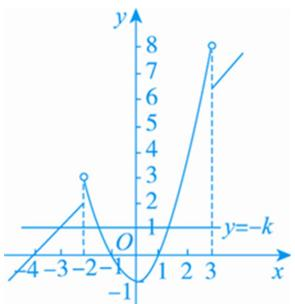
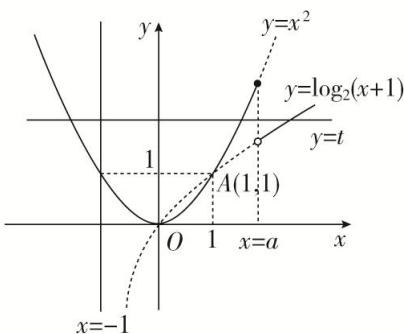
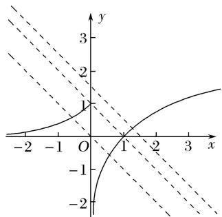
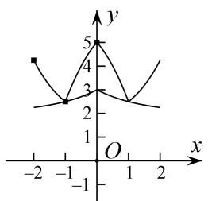
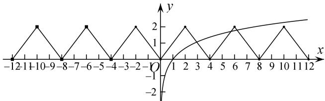
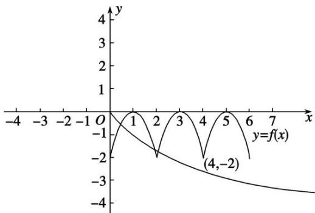
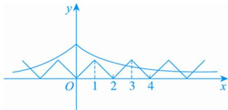

# 专题十六 函数的零点问题(3)

# 考点一 已知 $y = f(x) \pm b$ 型函数零点的情况，求参数 $b$ 的取值范围

# 【方法总结】

已知零点的情况，求参数 $b$ 的取值范围要大致画出 $y = f(x)$ 的图象，有的题需要用导数处理才能画出图象，再画出 $y = \pm b$ 的图象，使得满足条件，求出 $b$ 的取值范围。对于不是 $y = f(x) \pm b$ 型函数需先分离参数转化为该种类型去求解。

# 【例题选讲】

[例 1](1)已知函数 $f(x)=\left\{\begin{aligned}&2x-1,&x>0,\\&x^{2}+x,&x\leq0,\end{aligned}\right.$ 若函数 $g(x)=f(x)-m$ 有三个零点，则实数 m 的取值范围是 \_\_\_\_.

(2)已知函数 $f(x) = \begin{cases} x^2 - 1, & x < 1, \\ \log \frac{1}{2} x, & x \geq 1, \end{cases}$ 若关于 $x$ 的方程 $f(x) = k$ 有三个不同的实根，则实数 $k$ 的取值范围是 \_\_\_\_.  
(3)已知 0<a<1, k≠0，函数 $f(x)=\left\{\begin{aligned}a^{x}, & x\geq0, \\ kx+1, & x<0,\end{aligned}\right.$ 若函数 $g(x)=f(x)-k$ 有两个零点，则实数 k 的取值范围是 \_\_\_\_.  
(4)对任意实数 a, b 定义运算“⊗”： $a \otimes b = \begin{cases} b, & a - b \geq 1, \\ a, & a - b < 1. \end{cases}$ 设 $f(x) = (x^2 - 1) \otimes (4 + x)$ ，若函数 $g(x) = f(x) + k$ 的图象与 x 轴恰有三个不同的交点，则 k 的取值范围是 \_\_\_\_.

line

| x | y |
|---|---|
| -4 | 0 |
| -3 | 1 |
| -2 | 3 |
| -1 | -1 |
| 1 | 0 |
| 2 | 5 |
| 3 | 8 |
| k | 7 |

(5)已知 $a > -1$ ，函数 $f(x) = \begin{cases} x^2 & x \leq a \\ \log_2(x + 1) & x > a \end{cases}$ 若存在 $t$ 使得 $g(x) = f(x) - t$ 有三个零点，则 $a$ 的取值范围是（）

A. $(-1,0)$

B. $(0, 1)$

C. $(1, +\infty)$

D. $(0, +\infty)$

text_image

y
y=x²
y=log₂(x+1)
y=t
1
A(1,1)
O 1 x=a
x=-1
x

# 【对点训练】

1. 已知函数 $f(x) = \begin{cases} \log_{\frac{1}{2}} - 1, & x < 1, \\ x, & x \geq 1, \end{cases}$ 若关于 $x$ 的方程 $f(x) = k$ 有三个不同的实根，则实数 $k$ 的取值范围是 \_\_\_\_.

2. 已知函数 $f(x) = \begin{cases} 2^x - 1, & x < 2, \\ \frac{3}{x - 1}, & x \geq 2, \end{cases}$ 若方程 $f(x) - a = 0$ 有三个不同的实数根，则实数 $a$ 的取值范围是（）

A. (1, 3)

B. $(0, 3)$

C. $(0, 2)$

D. $(0, 1)$

3. 已知函数 $f(x) = \begin{cases} \log_2(x + 1), & x > 0, \\ -x^2 - 2x, & x \leq 0, \end{cases}$ 若函数 $g(x) = f(x) - m$ 有 3 个零点，则实数 $m$ 的取值范围是 \_\_\_\_.

4. 已知函数 $f(x) = \begin{cases} 2^x - 1, & x \leq 1, \\ x - 1, & x > 1, \end{cases}$ 则函数 $F(x) = f(x) - a^2 + a + 1 (a \in \mathbf{R})$ 总有零点时， $a$ 的取值范围是（）

A. $(-\infty, 0) \cup (1, +\infty)$

B. $[-1, 2)$

C. $[-1, 0] \cup (1, 2]$

D. $[0, 1]$

5. 已知 $f(x)$ 是定义在 $\mathbf{R}$ 上且周期为 4 的偶函数，又函数 $f(x) = \begin{cases} |\ln x| & (0 < x \leq e), \\ | -x^2 + ex + 1| & (e < x \leq 4) \end{cases}$ . 若 $f(x) = a$ 在 $[-e, 4]$ 上有 6 个零点，则实数 $a$ 的取值范围是 \_\_\_\_.

6. 已知函数 $f(x)=\left\{\begin{aligned}x^{3}, & x \leq a, \\ x^{2}, & x > a.\end{aligned}\right.$ 若存在实数 b，使函数 $g(x)=f(x)-b$ 有两个零点，则 a 的取值范围是 \_\_\_\_.

7. (2016·山东)已知函数 $f(x)=\left\{\begin{aligned}&|x|,&x\leq m,\\&x^{2}-2mx+4m,&x>m,\end{aligned}\right.$ 其中 m>0 。若存在实数 b，使得关于 x 的方程 $f(x)=b$ 有三个不同的根，则 m 的取值范围是 \_\_\_\_。

# 考点二 已知 $y = f(x) \pm g(x, a)$ 型函数零点的个数，求参数 $a$ 的取值范围

# 【方法总结】

已知 $y=f(x)\pm g(x,\ a)$ 型函数零点的情况，求参数 a 的取值范围的问题多数题都是 $y=f(x)$ 为周期函数，先画出的 $y=f(x)$ 图象，再画出 $y=\pm g(x,\ a)$ 的图象．然后根据零点的情况，建立参数 a 的不等式．如 $\left\{\begin{aligned}f(m)&<g(m),\\ f(n)&>g(n),\end{aligned}\right.$ 等.

# 【例题选讲】

[例 2] (1)(2018·全国I)已知函数 $f(x)=\left\{\begin{aligned}&e^{x},&x\leq0,\\&\ln x,&x>0,\end{aligned}\right.$ $g(x)=f(x)+x+a$ 。若 $g(x)$ 存在 2 个零点，则 a 的取值范围是（）

A. $[-1, 0)$

B. $[0, +\infty)$

C. $[-1, +\infty)$

D. $[1, +\infty)$

text_image

Mathematical graph showing a parabola and two dashed lines intersecting at point (1,0), with x-axis ranging from -2 to 3 and y-axis from -2 to 3.

(2)函数 $f(x) = \begin{cases} 2^x - 1, & x \geq 0, \\ f(x + 1), & x < 0, \end{cases}$ 若方程 $f(x) = -x + a$ 有且只有两个不相等的实数根，则实数 $a$ 的取值

范围为( )

A. $(-\infty, 0)$

B. $[0, 1)$

C. $(-∞, 1)$

D. $[0, +\infty)$

(3)已知函数 $f(x)$ 为偶函数且 $f(x)=f(x-4)$ ，又在区间 $[0,2]$ 上 $f(x)=\left\{\begin{aligned}-x^{2}-\frac{3}{2}x+5,&0\leq x\leq1,\\ 2^{x}+2^{-x},&1<x\leq2,\end{aligned}\right.$ 函数 $g(x)$ $=\left(\frac{1}{2}\right)|x|+a$ ，若 $F(x)=f(x)-g(x)$ 恰有 2 个零点，则 $a=$ \_\_\_\_.

line

| x | y |
|---|---|
| -2 | 4 |
| -1 | 3 |
| 0 | 5 |
| 1 | 3 |
| 2 | 4 |

(4)已知定义在 $\mathbf{R}$ 上的偶函数 $f(x)$ 满足 $f(x - 4) = f(x)$ ，且在区间[0，2]上 $f(x) = x$ ，若关于 $x$ 的方程 $f(x) = \log_a x$ 有三个不同的实根，则 $a$ 的取值范围为 \_\_\_\_.

line

| x | y |
|---|---|
| -12 | 0 |
| -11 | 2 |
| -10 | 0 |
| -9 | 2 |
| -8 | 0 |
| -7 | 2 |
| -6 | 0 |
| -5 | 0 |
| -4 | 2 |
| -3 | 0 |
| -2 | 2 |
| -1 | 0 |
| 0 | 0 |
| 1 | 2 |
| 2 | 0 |
| 3 | 0 |
| 4 | 0 |
| 5 | 2 |
| 6 | 0 |
| 7 | 0 |
| 8 | 2 |
| 9 | 0 |
| 10 | 2 |
| 11 | 0 |
| 12 | 0 |

(5)定义域为 $\mathbf{R}$ 的偶函数 $f(x)$ 满足对 $\forall x \in \mathbf{R}$ , 有 $f(x + 2) = f(x) - f(1)$ , 且当 $x \in [2, 3]$ 时, $f(x) = -2x^2 + 12x - 18$ , 若函数 $y = f(x) - \log_a(|x| + 1)$ 在 $(0, +\infty)$ 上至多有三个零点, 则 $a$ 的取值范围是 \_\_\_\_.

line

| x    | y=f(x) |
| ---- | ------ |
| 0    | -2     |
| 1    | 0      |
| 2    | -2     |
| 3    | 0      |
| 4    | -2     |
| 5    | 0      |
| 6    | -2     |
| 7    | -3     |

(6)定义在 $\mathbf{R}$ 上的奇函数 $f(x)$ 满足条件 $f(1 + x) = f(1 - x)$ ，当 $x \in [0, 1]$ 时， $f(x) = x$ ，若函数 $g(x) = |f(x)| - ae^{-|x|}$ 在区间 $[-2018, 2018]$ 上有4032个零点，则实数 $a$ 的取值范围是（）

A. $(0, 1)$

B. $(e, e^{3})$

C. $(e, e^{2})$

D. $(1, e^{3})$

text_image

y
O 1 2 3 4 x

# 【对点训练】

8. 函数 $f(x) = \begin{cases} 2^x - 1 & (x \geq 0), \\ f(x + 1) & (x < 0), \end{cases}$ ，若方程 $f(x) = -x + a$ 有且只有两个不相等的实数根，则实数 $a$ 的取值范围为 \_\_\_\_.

9. 已知函数 $f(x) = \mathrm{e}^{|x|} + |x|$ . 若关于 $x$ 的方程 $f(x) = k$ 有两个不同的实根，则实数 $k$ 的取值范围是( )

A. $(0, 1)$

B. $(1, +\infty)$

C. $(-1,0)$

D. $(-\infty, -1)$

10. 设 $f(x)$ 是定义在 $\mathbf{R}$ 上的偶函数，对任意的 $x \in \mathbf{R}$ ，都有 $f(x - 2) = f(x + 2)$ ，且当 $x \in [-2, 0]$ 时， $f(x) = \begin{bmatrix} 1 \\ 2 \end{bmatrix}$ $^x - 1$ ，若函数 $g(x) = f(x) - \log_a (x + 2) (a > 1)$ 在区间 $[-2, 6]$ 内恰有三个零点，则实数 $a$ 的取值范围是 \_\_\_\_.

11. 已知定义域为 $\mathbf{R}$ 的偶函数 $f(x)$ 满足：对 $\forall x \in \mathbf{R}$ ，有 $f(x + 2) = f(x) - f(1)$ ，且当 $x \in [2, 3]$ 时， $f(x) = -2x^2 + 12x - 18$ 。若函数 $y = f(x) - \log_a(x + 1)$ 在 $(0, +\infty)$ 上至少有三个零点，则实数 $a$ 的取值范围为（）

A. $\left(0,\frac{\sqrt{3}}{3}\right)$

B. $\left(0,\frac{\sqrt{2}}{2}\right)$

C. $\left(0,\frac{\sqrt{5}}{5}\right)$

D. $\left(0,\frac{\sqrt{6}}{6}\right)$

12. 已知定义在 $\mathbf{R}$ 上的函数 $y = f(x)$ 对任意的 $x$ 都满足 $f(x + 2) = f(x)$ ，当 $-1 \leq x < 1$ 时， $f(x) = \sin \frac{\pi}{2} x$ ，若函数 $g(x) = f(x) - \log_a |x|$ 至少有6个零点，则 $a$ 的取值范围是（）

A. $\left\{0,\frac{1}{5}\right]\cup(5,+\infty)$

B. $\left(0,\frac{1}{5}\right)\cup[5,+\infty)$

C. $\left[\frac{1}{7},\frac{1}{5}\right]\cup (5,7)$

D. $\left(\frac{1}{7},\frac{1}{5}\right)\cup [5,7)$

13. (2016·天津)已知函数 $f(x)=\left\{\begin{aligned}x^{2}+(4a-3)x+3a, & x<0, \\ \log_{a}(x+1)+1, & x\geq0,\end{aligned}\right.$ (a>0 且 $a\neq1$ ) 在 R 上单调递减，且关于 x 的方程

$|f(x)|=2-x$ 恰有两个不相等的实数解，则 a 的取值范围是()

A. $\left\{0,\frac{2}{3}\right]$

B. $\begin{bmatrix}\frac{2}{3},\frac{3}{4}\end{bmatrix}$

C. $\left[\frac{1}{3},\frac{2}{3}\right]\cup \left\{\frac{3}{4}\right\}$

D. $\left[\frac{1}{3},\frac{2}{3}\right]\cup \left\{\frac{3}{4}\right\}$

