# 专题十六 函数的零点问题(3)

考点一 已知 $y = f(x) \pm b$ 型函数零点的情况，求参数 $b$ 的取值范围

# 【方法总结】

已知零点的情况，求参数 $b$ 的取值范围要大致画出 $y = f(x)$ 的图象，有的题需要用导数处理才能画出图象，再画出 $y = \pm b$ 的图象，使得满足条件，求出 $b$ 的取值范围。对于不是 $y = f(x) \pm b$ 型函数需先分离参数转化为该种类型去求解。

# 【例题选讲】

[例 1](1)已知函数 $f(x)=\left\{\begin{aligned}&2x-1,&x>0,\\&x^{2}+x,&x\leq0,\end{aligned}\right.$ 若函数 $g(x)=f(x)-m$ 有三个零点，则实数 m 的取值范围是 \_\_\_\_.

答案 $\left[-\frac{1}{4}, 0\right]$ 解析 作出函数 $f(x)$ 的图象如图所示．当 $x \leq 0$ 时， $f(x) = x^2 + x = \left[\frac{x + \frac{1}{2}}{2}\right]^2 - \frac{1}{4} \geq -\frac{1}{4}$ ，若函数 $f(x)$ 与 $y = m$ 的图象有三个不同的交点，则 $-\frac{1}{4} < m \leq 0$ ，即实数 $m$ 的取值范围是 $\left[-\frac{1}{4}, 0\right]$ .

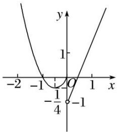

line

| x | y |
|---|---|
| -2 | 1 |
| -1 | 0.5 |
| 0 | 0 |
| 1 | 1 |
| -1/4 | -1 |

(2)已知函数 $f(x) = \begin{cases} x^2 - 1, & x < 1, \\ \log \frac{1}{2} x, & x \geq 1, \end{cases}$ 若关于 $x$ 的方程 $f(x) = k$ 有三个不同的实根，则实数 $k$ 的取值范围是 \_\_\_\_.

答案 $(-1, 0)$ 解析 关于 $x$ 的方程 $f(x) = k$ 有三个不同的实根，等价于函数 $f(x)$ 与函数 $y = k$ 的图象有三个不同的交点，作出函数的图象如图所示，由图可知实数 $k$ 的取值范围是 $(-1, 0)$ .

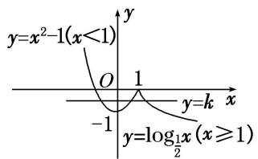

text_image

y=x²-1(x<1)
O
1
y=k
x
-1
y=log₁x (x≥1)

(3)已知 0<a<1, k≠0，函数 $f(x)=\left\{\begin{aligned}a^{x}, & x\geq0, \\ kx+1, & x<0,\end{aligned}\right.$ 若函数 $g(x)=f(x)-k$ 有两个零点，则实数 k 的取值范围是 \_\_\_\_.

答案 (0, 1) 解析 函数 $g(x) = f(x) - k$ 有两个零点，即 $f(x) - k = 0$ 有两个解，即 $y = f(x)$ 与 $y = k$ 的图象有两个交点。分 $k > 0$ 和 $k < 0$ 作出函数 $f(x)$ 的图象。当 $0 < k < 1$ 时，函数 $y = f(x)$ 与 $y = k$ 的图象有两个交点；当 $k = 1$ 时，有一个交点；当 $k > 1$ 或 $k < 0$ 时，没有交点，故当 $0 < k < 1$ 时满足题意。

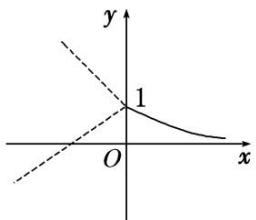

text_image

y
1
O
x

(4)对任意实数 a, b 定义运算“⊗”： $a \otimes b = \begin{cases} b, & a - b \geq 1, \\ a, & a - b < 1. \end{cases}$ 设 $f(x) = (x^2 - 1) \otimes (4 + x)$ ，若函数 $g(x) = f(x) + k$ 的图象与 x 轴恰有三个不同的交点，则 k 的取值范围是 \_\_\_\_.

答案 $[-2, 1)$ 解析 解不等式 $x^{2} - 1 - (4 + x) \geq 1$ ，得 $x \leq -2$ 或 $x \geq 3$ ，所以 $f(x) = \begin{cases} x + 4, & x \in (-\infty, -2] \cup [3, +\infty), \\ x^{2} - 1, & x \in (-2, 3). \end{cases}$ 函数 $g(x) = f(x) + k$ 的图象与 $x$ 轴恰有三个不同的交点转化为

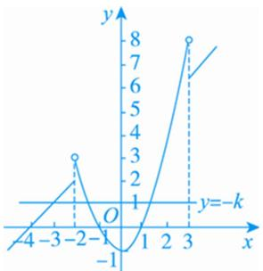

line

| x | y |
|---|---|
| -4 | 0 |
| -3 | 1 |
| -2 | 3 |
| -1 | -1 |
| 1 | 0 |
| 2 | 5 |
| 3 | 8 |
| k | 7 |

函数 $f(x)$ 的图象和直线 $y = -k$ 恰有三个不同的交点．作出函数 $f(x)$ 的图象如图所示，所以 $-1 < -k \leq 2$ ，故 $-2 \leq k < 1$ .

(5)已知 $a > -1$ ，函数 $f(x) = \begin{cases} x^2 & x \leq a \\ \log_2(x + 1) & x > a \end{cases}$ 若存在 $t$ 使得 $g(x) = f(x) - t$ 有三个零点，则 $a$ 的取值范围是（）

A. $(-1,0)$

B. $(0, 1)$

C. $(1, +\infty)$

D. $(0, +\infty)$

答案 C 解析 如图，作出函数 $y=x^{2}$ 和 $y=\log_{2}(x+1)$ 的图象，从图中可以看出，在点 $O(0,0)$ 和点 $A(1,1)$ 处两函数图象有交点，显然，要使 $g(x)=f(x)-t$ 有三个零点，则函数 $y=f(x)$ 的图象与直线 y=t 有三个交点，显然，只有当 a>1 时，才可能有三个交点，故选 C.

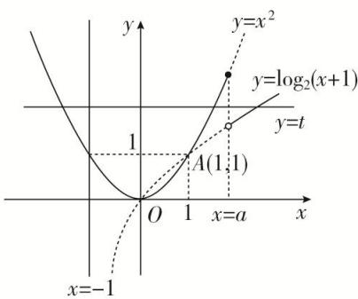

text_image

y
y=x²
y=log₂(x+1)
y=t
1
A(1,1)
O 1 x=a x
x=-1

# 【对点训练】

1. 已知函数 $f(x) = \begin{cases} \log_{\frac{1}{2}} 1, & x < 1, \\ \frac{1}{2} x, & x \geq 1, \end{cases}$ 若关于 $x$ 的方程 $f(x) = k$ 有三个不同的实根，则实数 $k$ 的取值范围是 \_\_\_\_.

1. 答案 $(-1, 0)$ 解析 关于 $x$ 的方程 $f(x) = k$ 有三个不同的实根，等价于函数 $y = f(x)$ 与函数 $y = k$ 的图象有三个不同的交点，作出函数的图象如图所示，由图可知实数 $k$ 的取值范围是 $(-1, 0)$ .

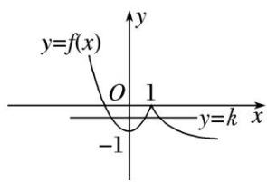

text_image

y=f(x)
O 1
-1
y=k x

2. 已知函数 $f(x) = \begin{cases} 2^x - 1, & x < 2, \\ \frac{3}{x - 1}, & x \geq 2, \end{cases}$ 若方程 $f(x) - a = 0$ 有三个不同的实数根，则实数 $a$ 的取值范围是（）

A. $(1, 3)$

B. $(0, 3)$

C. $(0, 2)$

D. $(0, 1)$

2. 答案 D 解析 画出函数 $f(x)$ 的图象如图所示,

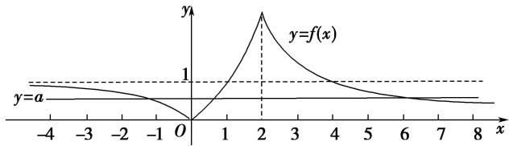

line

| x   | y = f(x) |
| --- | -------- |
| -4  | 0        |
| -3  | 0        |
| -2  | 0        |
| -1  | 0        |
| 0   | 0        |
| 1   | 1        |
| 2   | 1        |
| 3   | 0.5      |
| 4   | 0.25     |
| 5   | 0.1      |
| 6   | 0.05     |
| 7   | 0.025    |
| 8   | 0.01     |

观察图象可知，若方程 $f(x)-a=0$ 有三个不同的实数根，则函数 $y=f(x)$ 的图象与直线 y=a 有 3 个不同的交点，此时需满足 0<a<1。故选 D.

3. 已知函数 $f(x)=\left\{\begin{aligned}\log_{2}(x+1), & x>0,\\ -x^{2}-2x, & x\leq0,\end{aligned}\right.$ 若函数 $g(x)=f(x)-m$ 有 3 个零点，则实数 m 的取值范围是 \_\_\_\_.

3. 答案 (0, 1) 解析 函数 $g(x) = f(x) - m$ 有 3 个零点，转化为 $f(x) - m = 0$ 的根有 3 个，进而转化为 $y = f(x)$ ， $y = m$ 的交点有 3 个。画出函数 $y = f(x)$ 的图象，则直线 $y = m$ 与其有 3 个公共点。又抛物线顶点为 $(-1, 1)$ ，由图可知实数 $m$ 的取值范围是 $(0, 1)$ 。

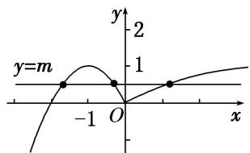

line

| x | y = m |
|---|---|
| -1 | 0 |
| 0 | 1 |
| 1 | 0 |

4. 已知函数 $f(x) = \begin{cases} 2^x - 1, & x \leq 1, \\ x - 1, & x > 1, \end{cases}$ 则函数 $F(x) = f(x) - a^2 + a + 1 (a \in \mathbf{R})$ 总有零点时， $a$ 的取值范围是（）

A. $(-∞, 0)∪(1, +∞)$

B. $[-1, 2)$

C. $[-1, 0] \cup (1, 2]$

D. $[0, 1]$

4. 解析 A 由 $F(x) = 0$ ，得 $f(x) = a^2 - a - 1$ ，因为函数 $f(x)$ 的值域为 $(-1, +\infty)$ ，故 $a^2 - a - 1 > -1$ ，解得 $a < 0$ 或 $a > 1$ . 故选 A.

5. 已知 $f(x)$ 是定义在 $\mathbf{R}$ 上且周期为 4 的偶函数，又函数 $f(x) = \begin{cases} |\ln x| & (0 < x \leq e), \\ | -x^2 + ex + 1| & (e < x \leq 4) \end{cases}$ . 若 $f(x) = a$ 在 $[-e, 4]$ 上有 6 个零点，则实数 $a$ 的取值范围是 \_\_\_\_.

5. 答案 (0, 1) 解析 由题意画出函数 $f(x)$ 在 $[-e, 4]$ 上的图象，如图所示.

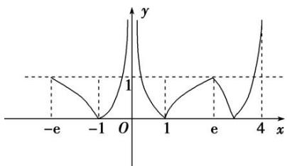

line

| x | y |
|---|---|
| -e | 1 |
| -1 | 0 |
| 0 | 0 |
| 1 | 0 |
| e | 1 |
| 4 | 1 |

又 $f(x)=a$ 在 $[-e, 4]$ 上有 6 个零点，数形结合可知，实数 a 的取值范围为 $(0, 1)$ .

6. 已知函数 $f(x)=\left\{\begin{aligned}x^{3}, & x \leq a, \\ x^{2}, & x > a.\end{aligned}\right.$ 若存在实数 b，使函数 $g(x)=f(x)-b$ 有两个零点，则 a 的取值范围是 \_\_\_\_.

6. 答案 $(- \infty, 0) \cup (1, +\infty)$ 解析 令 $\varphi(x) = x^3(x \leq a)$ , $h(x) = x^2(x > a)$ , 函数 $g(x) = f(x) - b$ 有两个零点, 即函数 $y = f(x)$ 的图象与直线 $y = b$ 有两个交点, 结合图象, 可得 $a < 0$ 或 $\varphi(a) > h(a)$ , 即 $a < 0$ 或 $a^3 > a^2$ , 解得 $a < 0$ 或 $a > 1$ , 故 $a \in (-\infty, 0) \cup (1, +\infty)$ .

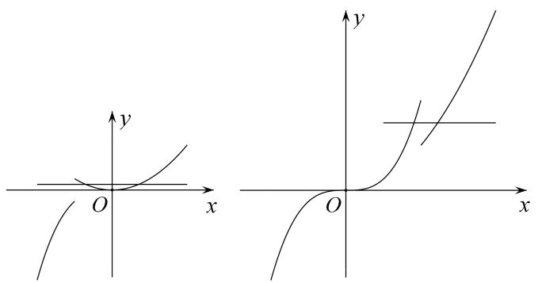

text_image

Mathematical diagrams showing hyperbola and parabola curves in Cartesian coordinates with labeled axes and origin O

7. (2016·山东)已知函数 $f(x)=\left\{\begin{aligned}&|x|,&x\leq m,\\&x^{2}-2mx+4m,&x>m,\end{aligned}\right.$ 其中 m>0 。若存在实数 b，使得关于 x 的方程 $f(x)=b$ 有三个不同的根，则 m 的取值范围是 \_\_\_\_。

7. 答案 $(3, +\infty)$ 解析 $f(x)$ 的大致图象如图所示，

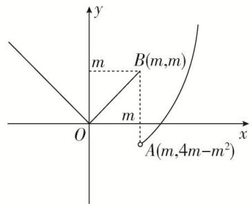

text_image

y
m
B(m,m)
O
m
A(m,4m-m²)
x

若存在 $b \in R$ ，使得方程 $f(x) = b$ 有三个不同的根，只需 $4m - m^{2} < m$ ，又 m > 0，所以 m > 3。

# 考点二 已知 $y = f(x) \pm g(x, a)$ 型函数零点的个数，求参数 $a$ 的取值范围

# 【方法总结】

已知 $y=f(x)\pm g(x,\ a)$ 型函数零点的情况，求参数 a 的取值范围的问题多数题都是 $y=f(x)$ 为周期函数，先画出的 $y=f(x)$ 图象，再画出 $y=\pm g(x,\ a)$ 的图象．然后根据零点的情况，建立参数 a 的不等式．如 $\left\{\begin{aligned}f(m)&<g(m),\\ f(n)&>g(n),\end{aligned}\right.$ 等.

# 【例题选讲】

[例 2] (1)(2018·全国I)已知函数 $f(x)=\left\{\begin{aligned}e^{x},&x\leq0,\\ \ln x,&x>0,\end{aligned}\right.$ $g(x)=f(x)+x+a$ 。若 $g(x)$ 存在 2 个零点，则 a 的取值范围是（）

A. $[-1, 0)$

B. $[0, +\infty)$

C. $[-1, +\infty)$

D. $[1, +\infty)$

答案 C 解析 函数 $g(x)=f(x)+x+a$ 存在 2 个零点，即关于 x 的方程 $f(x)=-x-a$ 有 2 个不同的实根，即函数 $f(x)$ 的图象与直线 y=-x-a 有 2 个交点．作出直线 y=-x-a 与函数 $f(x)$ 的图象，如图所示，由图可知， $-a\leq1$ ，解得 $a\geq-1$ ，故选 C.

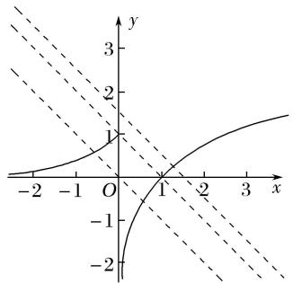

text_image

Graph showing a parabola and two dashed lines intersecting at (1,1), with coordinate axes labeled x and y.

(2)函数 $f(x) = \begin{cases} 2^x - 1, & x \geq 0, \\ f(x + 1), & x < 0, \end{cases}$ 若方程 $f(x) = -x + a$ 有且只有两个不相等的实数根，则实数 $a$ 的取值范围为（）

A. $(-\infty, 0)$

B. $[0, 1)$

C. $(-∞, 1)$

D. $[0, +\infty)$

答案 C 解析 函数 $f(x)=\left\{\begin{aligned}&2^{x}-1,&x\geq0,\\ &f(x+1),&x<0\end{aligned}\right.$ 的图象如图所示，作出直线 l: y=a-x，向左平移直线 l，观察可得当函数 $y=f(x)$ 的图象与直线 l: $y=-x+a$ 的图象有两个交点，即方程 $f(x)=-x+a$ 有且只有两个不相等的实数根时，有 a<1，故选 C.

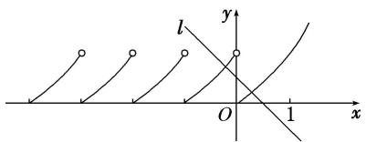

text_image

l
y
O 1 x

(3)已知函数 $f(x)$ 为偶函数且 $f(x)=f(x-4)$ ，又在区间 $[0,2]$ 上 $f(x)=\left\{\begin{aligned}&-x^{2}-\frac{3}{2}x+5, &0\leq x\leq1,\\&2^{x}+2^{-x}, &1<x\leq2,\end{aligned}\right.$ 函数 $g(x)$ $=\left(\frac{1}{2}\right)|x|+a$ ，若 $F(x)=f(x)-g(x)$ 恰有 2 个零点，则 $a=$ \_\_\_\_.

答案 2 解析 由题意可知 $f(x)$ 是周期为 4 的偶函数，画出函数 $f(x)$ 与 $g(x)$ 的大致图象(图略). 若 $F(x)=f(x)-g(x)$ 恰有 2 个零点，则有 $g(1)=f(1)$ ，解得 a=2.

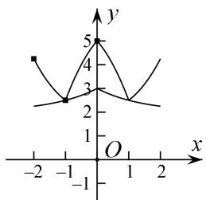

line

| x | y |
|---|---|
| -2 | 4 |
| -1 | 3 |
| 0 | 5 |
| 1 | 3 |
| 2 | 4 |

(4)已知定义在 $\mathbf{R}$ 上的偶函数 $f(x)$ 满足 $f(x - 4) = f(x)$ ，且在区间[0，2]上 $f(x) = x$ ，若关于 $x$ 的方程 $f(x) = \log_a x$ 有三个不同的实根，则 $a$ 的取值范围为 \_\_\_\_.

答案 $(\sqrt{6},\sqrt{10})$ 解析 由 $f(x - 4) = f(x)$ 知，函数的周期为4，又函数为偶函数， $\therefore f(x - 4) = f(x) = f(4 - x)$ 。∴函数图象关于 $x = 2$ 对称，且 $f(2) = f(6) = f(10) = 2$ 。要使方程 $f(x) = \log_a x$ 有三个不同的根，则满足 $\left\{ \begin{array}{l}a > 1, \\ f(6) < 2, \\ f(10) > 2, \end{array} \right.$ 如图，即 $\left\{ \begin{array}{l}a > 1, \\ \log_a 6 < 2, \\ \log_a 10 > 2, \end{array} \right.$ 解得 $\sqrt{6} < a < \sqrt{10}$ 。故 $a$ 的取值范围是 $(\sqrt{6},\sqrt{10})$ 。

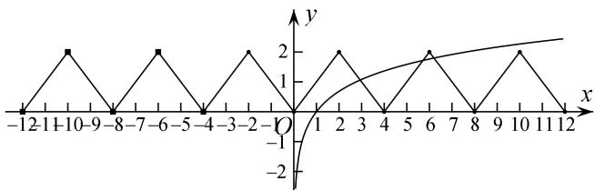

line

| x | y |
|---|---|
| -12 | 0 |
| -11 | 2 |
| -10 | 0 |
| -9 | 2 |
| -8 | 0 |
| -7 | 2 |
| -6 | 0 |
| -5 | 2 |
| -4 | 0 |
| -3 | 2 |
| -2 | 0 |
| -1 | 0 |
| 0 | 0 |
| 1 | 2 |
| 2 | 2 |
| 3 | 1 |
| 4 | 1 |
| 5 | 2 |
| 6 | 0 |
| 7 | 0 |
| 8 | 2 |
| 9 | 0 |
| 10 | 2 |
| 11 | 2 |
| 12 | 2 |

(5)定义域为 $\mathbf{R}$ 的偶函数 $f(x)$ 满足对 $\forall x\in \mathbf{R}$ ，有 $f(x + 2) = f(x) - f(1)$ ，且当 $x\in [2,3]$ 时， $f(x) = -2x^2 +12x$ -18，若函数 $y = f(x) - \log_a(|x| + 1)$ 在 $(0, + \infty)$ 上至多有三个零点，则 $a$ 的取值范围是 \_\_\_\_.

答案 $(\frac{\sqrt{5}}{5}, 1) \cup (1, +\infty)$ 解析 对于偶函数 $f(x), f(x + 2) = f(x) - f(1)$ ，令 $x = -1$ ，则 $f(1) = f(-1) - f(1)$ ，因为 $f(-1) = f(1)$ ，所以 $f(-1) = f(1) = 0$ ，所以 $f(x) = f(x + 2)$ ，故 $f(x)$ 的图象如图所示，则问题等价于 $f(x)$ 的图象与函数 $y = \log_a(|x| + 1)$ 的图象在 $(0, +\infty)$ 上至多有三个交点，显然 $a > 1$ 符合题意；若 $0 < a < 1$ ，则由图可知，只需点 $(4, -2)$ 在函数 $y = \log_a(|x| + 1)$ 图象的上方，所以 $\log_a 5 < -2 = \log_a \frac{1}{a^2} \Rightarrow 5 > \frac{1}{a^2} \Rightarrow \frac{\sqrt{5}}{5} < a < 1$ 。综上，实数 $a$ 的取值范围是 $(\frac{\sqrt{5}}{5}, 1) \cup (1, +\infty)$ 。

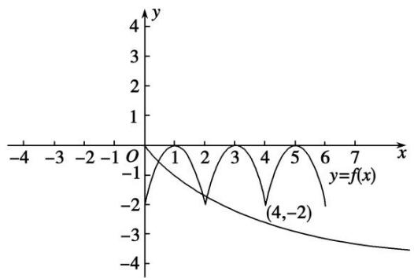

line

| x    | y=f(x) |
| ---- | ------ |
| 0    | -2     |
| 1    | -1     |
| 2    | -2     |
| 3    | -1     |
| 4    | -2     |
| 5    | -1     |
| 6    | -2     |
| 7    | -3     |

(6)定义在 $\mathbf{R}$ 上的奇函数 $f(x)$ 满足条件 $f(1 + x) = f(1 - x)$ ，当 $x \in [0, 1]$ 时， $f(x) = x$ ，若函数 $g(x) = |f(x)| - ae^{-|x|}$ 在区间 $[-2018, 2018]$ 上有4032个零点，则实数 $a$ 的取值范围是（）

A. $(0, 1)$

B. $(e, e^{3})$

C. $(e, e^{2})$

D. $(1, e^{3})$

答案 B 解析 $f(x)$ 满足条件 $f(1 + x) = f(1 - x)$ 且为奇函数，则 $f(x)$ 的图象关于 $x = 1$ 对称，且 $f(x) = f(2 - x)$ ， $f(x) = -f(-x)$ ， $\therefore -f(-x) = f(2 - x)$ ，即 $-f(x) = f(2 + x)$ ， $\therefore f(x + 4) = f(x)$ ， $\therefore f(x)$ 的周期为 4．令 $m(x) = |f(x)|$ ， $n(x) = ae^{-|x|}$ ，画出 $m(x)$ 、 $n(x)$ 的图象如图，

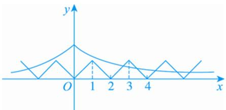

line

| x | y |
|---|---|
| 0 | 0 |
| 1 | 1 |
| 2 | 0 |
| 3 | 1 |
| 4 | 0 |

可知 $m(x)$ 与 $n(x)$ 为偶函数，且要使 $m(x)$ 与 $n(x)$ 图象有交点，需 a > 0，由题意知要满足 $g(x)$ 在区间 $[-2018, 2018]$ 上有 4032 个零点，只需 $m(x)$ 与 $n(x)$ 的图象在 $[0, 4]$ 上有两个交点，则 $\left\{\begin{aligned}m(1) & < n(1), \\ m(3) & > n(3),\end{aligned}\right.$ 可得 $e < a < e^{3}$ ，故选 B.

# 【对点训练】

8. 函数 $f(x) = \begin{cases} 2^x - 1 & (x \geq 0), \\ f(x + 1) & (x < 0), \end{cases}$ ，若方程 $f(x) = -x + a$ 有且只有两个不相等的实数根，则实数 $a$ 的取值范围为 \_\_\_\_.

8. 答案 $(-∞, 1)$ 解析 函数 $f(x)=\left\{\begin{aligned}&2^{x}-1 & (x\geq0),\\&f(x+1) & (x<0)\end{aligned}\right.$ 的图象如图所示，作出直线 l: y=a-x，向左平移直线 l，观察可得函数 $y=f(x)$ 的图象与直线 l: $y=-x+a$ 的图象有两个交点，即方程 $f(x)=-x+a$ 有且只有两个不相等的实数根，即有 a<1.

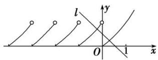

9. 已知函数 $f(x) = \mathrm{e}^{|x|} + |x|$ . 若关于 $x$ 的方程 $f(x) = k$ 有两个不同的实根，则实数 $k$ 的取值范围是( )

A. $(0, 1)$

B. $(1, +\infty)$

C. $(-1,0)$

D. $(-\infty, -1)$

9. 答案 B 解析 方程 $f(x) = k$ 化为方程 $e^{|x|} = k - |x|$ . 令 $y = e^{|x|}$ , $y = k - |x|$ , $y = k - |x|$ 表示过点 (0, k)，斜率为 1 或 -1 的平行折线系，折线与曲线 $y = e^{|x|}$ 恰好有一个公共点时，有 $k = 1$ . 若关于 $x$ 的方程 $f(x) = k$ 有两个不同的实根，则实数 $k$ 的取值范围是 (1, +∞).

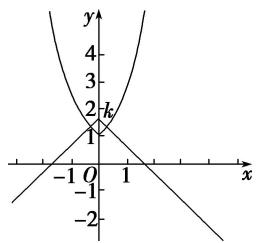

line

| Point | x | y |
|---|---|---|
| 1 | 0 | 0 |
| 2 | 0 | 2 |
| 3 | 0 | 4 |

10. 设 $f(x)$ 是定义在 $\mathbf{R}$ 上的偶函数，对任意的 $x \in \mathbf{R}$ ，都有 $f(x - 2) = f(x + 2)$ ，且当 $x \in [-2, 0]$ 时， $f(x) = \begin{pmatrix} 1 \\ 2 \end{pmatrix}$ $^x - 1$ ，若函数 $g(x) = f(x) - \log_a(x + 2) (a > 1)$ 在区间 $[-2, 6]$ 内恰有三个零点，则实数 $a$ 的取值范围是 \_\_\_\_.

10. 答案 $\sqrt[3]{4} < a < 2$ 解 根据题意得 $f((x + 2) - 2) = f((x + 2) + 2)$ ，即 $f(x) = f(x + 4)$ ，故函数 $f(x)$ 的周期为 4。若方程 $f(x) - \log_a(x + 2) = 0 (a > 1)$ 在区间 $[-2, 6]$ 内恰有三个不同的实根，则函数 $y = f(x)$ 和 $y = \log_a(x + 2)$ 的图象在区间 $[-2, 6]$ 内恰有三个不同的交点，根据图象可知， $\log_a(6 + 2) > 3$ 且 $\log_a(2 + 2) < 3$ ，解得 $\sqrt[3]{4} < a < 2$ 。

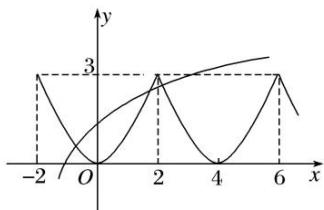

line

| x | y (Line) | y (Line) |
|---|---|---|
| -2 | 3 | 0 |
| 0 | 0 | 0 |
| 2 | 3 | 0 |
| 4 | 0 | 0 |
| 6 | 3 | 0 |

11. 已知定义域为 $\mathbf{R}$ 的偶函数 $f(x)$ 满足：对 $\forall x \in \mathbf{R}$ ，有 $f(x + 2) = f(x) - f(1)$ ，且当 $x \in [2, 3]$ 时， $f(x) = -2x^2 + 12x - 18$ 。若函数 $y = f(x) - \log_a(x + 1)$ 在 $(0, +\infty)$ 上至少有三个零点，则实数 $a$ 的取值范围为（）

A. $\left(0,\frac{\sqrt{3}}{3}\right)$

B. $\left(0,\frac{\sqrt{2}}{2}\right)$

C. $\left(0,\frac{\sqrt{5}}{5}\right)$

D. $\left(0,\frac{\sqrt{6}}{6}\right)$

11. 答案 A 解析 $\because f(x + 2) = f(x) - f(1), f(x)$ 是偶函数， $\therefore f(1) = 0, \therefore f(x + 2) = f(x)$ ，即 $f(x)$ 是周期为 2 的周期函数，且 $y = f(x)$ 的图象关于直线 $x = 2$ 对称，作出函数 $y = f(x)$ 与 $g(x) = \log_a(x + 1)$ 的图象如图所示， $\because$ 两个函数图象在 $(0, +\infty)$ 上至少有三个交点， $\therefore g(2) = \log_a3 > f(2) = -2$ ，且 $0 < a < 1$ ，解得 $0 < a < \frac{\sqrt{3}}{3}$ ，故选 A.

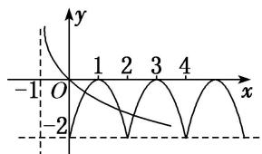

line

| x | y (Line 1) | y (Line 2) |
|---|---|---|
| -1 | -1 | 0 |
| 0 | 0 | -1 |
| 1 | 1 | 0 |
| 2 | 0 | -1 |
| 3 | -1 | 0 |
| 4 | -2 | -1 |

12. 已知定义在 $\mathbf{R}$ 上的函数 $y = f(x)$ 对任意的 $x$ 都满足 $f(x + 2) = f(x)$ ，当 $-1 \leq x < 1$ 时， $f(x) = \sin \frac{\pi}{2} x$ ，若函数 $g(x) = f(x) - \log_a |x|$ 至少有6个零点，则 $a$ 的取值范围是（）

A. $\left[0, \frac{1}{5}\right] \cup (5, +\infty)$

B. $\left(0,\frac{1}{5}\right)\cup[5,+\infty)$

C. $\left(\frac{1}{7},\frac{1}{5}\right]\cup(5,7)$

D. $\left(\frac{1}{7},\frac{1}{5}\right)\cup [5,7)$

12. 答案 A 解析 当 $a > 1$ 时，作出函数 $f(x)$ 与函数 $y = \log_a|x|$ 的图象，如图所示．结合图象可知，

$\left\{ \begin{array}{l} \log_a | - 5| < 1, \\ \log_a | 5| < 1, \end{array} \right.$ 故 $a > 5$

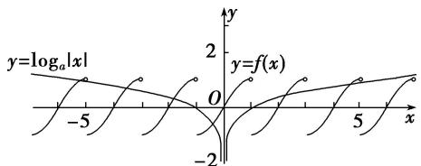

text_image

y=logₐ|x|
-5
0
y=f(x)
-2
x
y
2
y=f(x)

当 $0 < a < 1$ 时，作出函数 $f(x)$ 与函数 $y = \log_a |x|$ 的图象，如图所示．结合图象可知， $\left\{ \begin{array}{l} \log_a | -5| \geq -1, \\ \log_a |5| \geq -1, \end{array} \right.$ 故 $0 < a \leq \frac{1}{5}$ . 故选A.

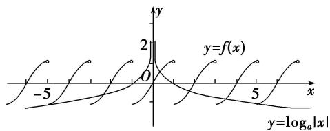

13. (2016·天津)已知函数 $f(x)=\left\{\begin{aligned}x^{2}+(4a-3)x+3a, & x<0, \\ \log_{a}(x+1)+1, & x\geq0,\end{aligned}\right.$ (a>0 且 $a\neq1$ ) 在 R 上单调递减，且关于 x 的方程

$|f(x)|=2-x$ 恰有两个不相等的实数解，则 a 的取值范围是()

A. $\left\{0,\frac{2}{3}\right]$

B. $\left[\frac{2}{3},\frac{3}{4}\right]$

C. $\left[\frac{1}{3},\frac{2}{3}\right]\cup \left\{\frac{3}{4}\right\}$

D. $\left[\frac{1}{3},\frac{2}{3}\right]\cup\left\{\frac{3}{4}\right\}$

13. 答案 C 解析 由 $y=\log_{a}(x+1)+1$ 在 $[0, +\infty)$ 上递减，则 0<a<1，又由 $f(x)$ 在 R 上单调递减，则：

$\left\{ \begin{array}{l} 0^{2} + (4a - 3) \cdot 0 + 3a \geq f(0) = 1, \\ \frac{3 - 4a}{2} \geq 0, \end{array} \right.$ 解得 $\frac{1}{3} \leq a \leq \frac{3}{4}$ .

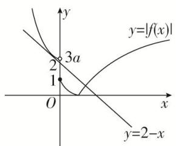

text_image

y
y=|f(x)|
2 3a
1
O
x
y=2-x

结合 $f(x)$ 的图象可知，在 $[0, +\infty)$ 上， $|f(x)| = 2 - x$ 有且仅有一个解，故在 $(- \infty, 0)$ 上， $|f(x)| = 2 - x$ 同样有且仅有一个解，当 $3a > 2$ ，即 $a > \frac{2}{3}$ 时，联立 $|x^2 + (4a - 3)x + 3a| = 2 - x$ ，则 $\Delta = (4a - 2)^2 - 4(3a - 2)$

=0，解得： $a=\frac{3}{4}$ 或1(舍)，当 $1\leq3a\leq2$ 时，由图象可知，符合条件．综上： $a\in\left[\frac{1}{3},\frac{2}{3}\right]\cup\left[\frac{3}{4}\right]$ .

